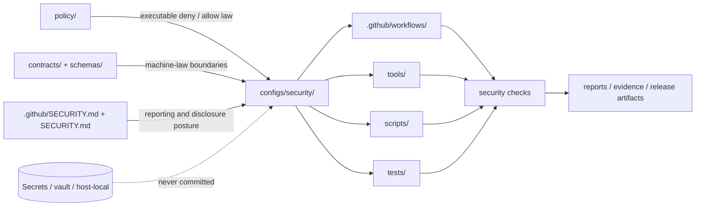

<!-- [KFM_META_BLOCK_V2]
doc_id: kfm://doc/<TODO-VERIFY-UUID>
title: configs/security/
type: standard
version: v1
status: draft
owners: @bartytime4life
created: TODO-VERIFY
updated: TODO-VERIFY-LIVE-GIT-DATE
policy_label: public
related: [../README.md, ../../.github/CODEOWNERS, ../../.github/SECURITY.md, ../../SECURITY.md, ../../policy/README.md, ../../contracts/README.md, ../../schemas/README.md, ../../.github/workflows/README.md, ../../tools/README.md, ../../scripts/README.md, ../../tests/README.md]
tags: [kfm, configs, security, supply-chain, thresholds, waivers]
notes: [Directory README for repo-visible non-secret security configuration; supplied evidence describes current public main as README-only; exact UUID, created date, updated date, live tree state, and any narrower CODEOWNERS split still need verification.]
[/KFM_META_BLOCK_V2] -->

# configs/security/

_Repo-visible, non-secret security thresholds, waivers, scanner profiles, and hardening defaults for Kansas Frontier Matrix._

> **Status:** `experimental`  
> **Owners:** `@bartytime4life` — broad `/configs/` coverage is reported in supplied evidence; any narrower security-config ownership split is **NEEDS VERIFICATION**  
> **Path:** `configs/security/README.md`  
> **Current supplied tree signal:** `README.md` only on public `main` — verify against a live checkout before merge  
> **Repo fit:** security-config lane inside [`../README.md`](../README.md); upstream from [`../../.github/CODEOWNERS`](../../.github/CODEOWNERS), [`../../.github/SECURITY.md`](../../.github/SECURITY.md), [`../../SECURITY.md`](../../SECURITY.md), [`../../policy/README.md`](../../policy/README.md), [`../../contracts/README.md`](../../contracts/README.md), and [`../../schemas/README.md`](../../schemas/README.md); downstream into [`../../.github/workflows/README.md`](../../.github/workflows/README.md), [`../../tools/README.md`](../../tools/README.md), [`../../scripts/README.md`](../../scripts/README.md), and [`../../tests/README.md`](../../tests/README.md)  
> 
> 
> 
> 
> 
>   
> **Quick jump:** [Scope](#scope) · [Repo fit](#repo-fit) · [Accepted inputs](#accepted-inputs) · [Exclusions](#exclusions) · [Current snapshot](#current-snapshot) · [Directory tree](#directory-tree) · [Quickstart](#quickstart) · [Usage](#usage) · [Diagram](#diagram) · [Tables](#tables) · [Task list](#task-list--definition-of-done) · [FAQ](#faq) · [Appendix](#appendix)

> [!IMPORTANT]
> Treat this lane as **config, not policy**.
> `configs/security/` is for repo-visible, non-secret operational settings that tune security checks.
> Executable deny/allow logic, Rego bundles, policy tests, and decision grammar belong in [`../../policy/README.md`](../../policy/README.md).
> Secrets, tokens, private keys, local certificates, and vault-managed material do **not** belong here.

> [!NOTE]
> KFM’s supplied documentation keeps the `contracts/` versus `schemas/` machine-authority boundary visibly unresolved.
> This directory must not become a temporary third home for trust-bearing schemas, vocabularies, or release decision contracts.

---

## Scope

`configs/security/` is a narrow lane for **reviewable, non-secret security-affecting configuration**.

It exists so maintainers can see and review the knobs that influence security checks without weakening KFM’s stronger trust seams: executable policy, contracts, schemas, release proof, public disclosure posture, and secret management.

A file belongs here only when it is all of the following:

- safe to commit to a repo-visible branch
- diffable in Git
- clear about its primary consumer
- subordinate to stronger trust surfaces such as [`../../policy/README.md`](../../policy/README.md), [`../../contracts/README.md`](../../contracts/README.md), [`../../schemas/README.md`](../../schemas/README.md), release evidence, and governed correction paths

Typical examples include threshold files, allow/review/deny posture maps, short-lived waiver metadata, scanner profiles, and non-secret hardening defaults.

### Truth posture used in this README

| Label | Meaning here |
| --- | --- |
| **CONFIRMED** | Directly present in the supplied README draft or attached KFM documentation for this edit |
| **INFERRED** | Conservative interpretation drawn from supplied evidence and KFM doctrine |
| **PROPOSED** | Recommended working shape that fits KFM but is not proven as current-tree reality |
| **UNKNOWN** | Not verified strongly enough in this session |
| **NEEDS VERIFICATION** | Placeholder or claim that should be checked against a live checkout before merge |

[Back to top](#configssecurity)

## Repo fit

| Aspect | Value |
| --- | --- |
| **Path** | `configs/security/README.md` |
| **Role** | Directory README for the security-specific slice of the repo-visible `configs/` lane |
| **Current supplied snapshot** | `README.md` only; live checkout verification still required before treating this as current implementation fact |
| **Upstream orientation** | [`../README.md`](../README.md), [`../../.github/CODEOWNERS`](../../.github/CODEOWNERS), [`../../.github/SECURITY.md`](../../.github/SECURITY.md), [`../../SECURITY.md`](../../SECURITY.md), [`../../policy/README.md`](../../policy/README.md), [`../../contracts/README.md`](../../contracts/README.md), [`../../schemas/README.md`](../../schemas/README.md) |
| **Downstream consumers** | [`../../.github/workflows/README.md`](../../.github/workflows/README.md), [`../../tools/README.md`](../../tools/README.md), [`../../scripts/README.md`](../../scripts/README.md), [`../../tests/README.md`](../../tests/README.md) |
| **Why it exists** | To keep non-secret security posture settings explicit without collapsing policy, contracts, workflow docs, tooling, disclosure posture, generated evidence, and secrets into one blurry surface |
| **Handoff rule** | When a file starts expressing executable law, schema authority, disclosure policy, generated proof, or secret-bearing deployment state, move it out of this lane |
| **Authority caution** | Do not park trust-bearing schemas, vocabularies, or release decision contracts here while root `contracts/` and `schemas/` authority remains under review |

## Accepted inputs

These are the file families that fit this lane.

| Input family | What fits | Typical examples |
| --- | --- | --- |
| **Threshold configs** | Reviewable knobs that determine `fail`, `warn`, or `review` posture | vulnerability severity cutoffs, secrets-scan thresholds, allowed exception TTLs |
| **License / dependency posture maps** | Non-secret policy-adjacent values consumed by checks | allow/review/deny license classes, approved dependency source rules |
| **Waiver metadata** | Short-lived exception records that stay human-reviewable | waiver ID, reason, scope, owner, expiry, linked issue or ADR |
| **Scanner / check profiles** | Tool-facing selectors and ignore scopes that are safe to commit | path excludes, file globs, package selectors, scan profile names |
| **Non-secret hardening defaults** | Operational defaults that do not reveal credentials or host-private values | TLS minima, header toggles, exposure flags, rate-limit defaults |
| **Illustrative examples** | Starter files that make review concrete without claiming live use | example YAML, profile templates, review notes |

## Exclusions

These do **not** belong here.

| Does not belong here | Why | Put it in / near |
| --- | --- | --- |
| **Secrets, tokens, private keys, local certs** | Secret-bearing material must not be committed into a repo-visible config lane | Host-local secret manager, vault, ignored local files, deployment secret surfaces |
| **Executable policy bundles or `.rego` rules** | KFM keeps config separate from executable deny/allow logic | [`../../policy/README.md`](../../policy/README.md) |
| **Machine-readable contracts, schemas, or vocabularies** | These are stronger trust surfaces than runtime knobs; the contract/schema authority split still needs explicit review | [`../../contracts/README.md`](../../contracts/README.md) and/or [`../../schemas/README.md`](../../schemas/README.md) |
| **Workflow orchestration YAML** | Workflow files are the automation lane, not the config lane | [`../../.github/workflows/README.md`](../../.github/workflows/README.md) |
| **Disclosure instructions, reporting contacts, or coordination timelines** | Public reporting posture is a security-policy surface, not an operational threshold file | [`../../.github/SECURITY.md`](../../.github/SECURITY.md) and [`../../SECURITY.md`](../../SECURITY.md) |
| **Generated reports, SBOMs, attestations, telemetry outputs** | Emitted artifacts are outputs, not source config | Workflow-managed report, release, proof, or evidence surfaces |
| **Security tool implementation code** | Code belongs with tooling or script entrypoints | [`../../tools/README.md`](../../tools/README.md) or [`../../scripts/README.md`](../../scripts/README.md) |
| **Business or domain law hiding as “settings”** | Slow-moving truth-bearing rules should not disappear into mutable config | Promote to contracts, policy, or package-level code after review |

## Current snapshot

The safest current statement is deliberately narrow.

### Supplied current public `main` signal

```text
configs/security/
└── README.md
```

This README therefore has two jobs:

1. document what the lane is for, and
2. avoid pretending that a richer subtree is already proven in the visible branch.

> [!WARNING]
> The tree above is grounded in the supplied draft for this edit, not a live checkout performed inside this response.
> Reconfirm with `find configs/security -maxdepth 3 -type f | sort` before merge.

### Adjacent security-doc context

| Path | Supplied signal | Why it matters here |
| --- | --- | --- |
| [`.github/SECURITY.md`](../../.github/SECURITY.md) | GitHub-facing security policy path is visible in the supplied draft | Disclosure posture stays separate from operational config |
| [`SECURITY.md`](../../SECURITY.md) | Secondary public security path is also visible in the supplied draft | It should delegate or remain text-aligned instead of being redefined here |

### Parent-lane context

```text
configs/
├── deployment/
├── env/
├── observability/
├── security/
├── ui/
├── README.md
└── env.schema.json
```

The parent-lane shape above is carried forward from supplied evidence. It remains **NEEDS VERIFICATION** against a live checkout before this README is merged.

## Directory tree

### Working shape for this lane

```text
configs/security/
├── README.md
├── vuln_policy.yaml          # PROPOSED: vulnerability thresholds / fail-warn posture
├── license_policy.yaml       # PROPOSED: license review / allow / deny posture
├── waivers.yaml              # PROPOSED: short-lived, reviewable exceptions
└── profiles/
    └── README.md             # PROPOSED: optional per-scanner or per-check notes
```

### Interpretation rules

- `README.md` is the only file supplied as current visible state.
- `vuln_policy.yaml`, `license_policy.yaml`, `waivers.yaml`, and `profiles/` are **PROPOSED** starter shapes, not asserted current-tree files.
- Add `profiles/` only when multiple tools actually consume distinct profiles.
- Do not add schema-like files here unless the `contracts/` versus `schemas/` placement question has been explicitly resolved for that object family.

## Quickstart

Use these checks before adding files to this lane.

```bash
# 1) See what is actually present.
find configs/security -maxdepth 3 -type f | sort

# 2) Find current consumers or references.
git grep -nE 'configs/security|vuln_policy|license_policy|waiver|sbom|secrets_scan|cosign|attest' -- .

# 3) Re-read adjacent boundary docs before adding security config.
sed -n '1,220p' configs/README.md
sed -n '1,220p' policy/README.md
sed -n '1,220p' contracts/README.md
sed -n '1,220p' schemas/README.md
sed -n '1,220p' .github/workflows/README.md

# 4) Keep disclosure policy separate from config.
sed -n '1,220p' .github/SECURITY.md
sed -n '1,220p' SECURITY.md

# 5) Keep review focused on this lane.
git diff -- configs/security/
```

## Usage

### Operating rules

1. **Keep it non-secret.**  
   If a value would be unsafe to publish in a public branch, it does not belong here.

2. **Keep it finite and reviewable.**  
   Thresholds should converge on clear outcomes such as `fail`, `warn`, or `review`, not hand-wavy prose.

3. **Keep waivers explicit and short-lived.**  
   KFM should prefer bounded exceptions with owner, reason, and expiry over permanent silent ignores.

4. **Keep config subordinate to policy.**  
   Config may feed policy-aware checks, but it should not become the hidden place where governance law drifts.

5. **Make consumers obvious.**  
   Every committed config file should name its primary consumer: workflow, tool, script, or runtime surface.

6. **Prefer deterministic behavior.**  
   The same commit plus the same config should produce the same check posture and the same class of findings.

### Waiver minimum fields

| Field | Why it matters |
| --- | --- |
| `id` | Stable reference for audit, review, and later removal |
| `reason` | Human-readable justification |
| `scope` | Exact package, path, image, dependency, or check being waived |
| `owner` | Who is responsible for the exception |
| `approved_by` | Review trail |
| `expires_at` | Forces revisit instead of permanent drift |
| `ticket` | Link to remediation or architecture discussion |
| `notes` | Short supporting context, kept concise |

> [!NOTE]
> If a waiver needs cryptographic proof, token validation, or executable allow/deny branching, the stronger enforcement logic belongs in policy or workflow code, not in this directory alone.

[Back to top](#configssecurity)

## Diagram



A useful mental model is simple: `configs/security/` tunes **non-secret security behavior**, but it should not replace policy, contracts, disclosure policy, secret management, generated evidence, or the eventual canonical contract/schema home.

## Tables

### Security config family matrix

| Family | Belongs here? | Typical contents | Status in this README |
| --- | --- | --- | --- |
| Vulnerability posture | Yes | fail/warn severities, approved waiver model, review windows | **PROPOSED** |
| License posture | Yes | allow/review/deny classes, escalation paths | **PROPOSED** |
| Secrets-scan posture | Yes | thresholds, ignore scopes, path filters | **PROPOSED** |
| Scanner profiles | Yes | non-secret globs, selectors, profile names | **PROPOSED** |
| Attestation / provenance posture | Maybe | require signatures, checksum presence, telemetry toggles | **PROPOSED** |
| Runtime hardening defaults | Maybe | non-secret exposure flags, TLS minima, header toggles | **NEEDS VERIFICATION** |
| Schema / vocabulary registries | No | JSON Schema, vocabularies, decision registries | **EXCLUDED** |
| Rego bundles / executable allow-deny logic | No | policy rules, tests, decision grammar | **EXCLUDED** |
| Disclosure / reporting policy | No | reporting channels, coordination rules, public security policy | **EXCLUDED** |
| Secret material | No | tokens, passwords, private certs | **EXCLUDED** |

### Review triggers

| Change type | Review expectation | Minimum proof |
| --- | --- | --- |
| Severity threshold changes | Re-check workflows and tools that consume the file | diff + consumer confirmation |
| New waiver | Verify owner, reason, scope, and expiry | issue / ADR / remediation link |
| New ignore / allowlist entry | Prove it suppresses a false positive, not a real risk | sample finding or test evidence |
| New attestation toggle | Verify downstream workflow and artifact expectations still align | workflow / tool review |
| New hardening default | Verify it is non-secret and environment-safe | consumer + rollout note |
| New schema-like file | Stop and confirm the canonical home before merge | contracts / schemas placement review |
| Any file that starts encoding business law | Stop and move it to a stronger surface | contract / policy design review |

## Task list — Definition of done

- [ ] The file is **non-secret** and safe for a repo-visible lane.
- [ ] The primary consumer is named in a comment, README note, or adjacent doc.
- [ ] Any waiver entry is short-lived, owned, and reviewable.
- [ ] Threshold changes are paired with test or consumer validation.
- [ ] The change does not smuggle executable policy into config.
- [ ] The change does not create a parallel schema or contract authority.
- [ ] The change does not create a second disclosure-policy surface inside `configs/security/`.
- [ ] The change does not turn `configs/security/` into a temporary third schema home while root `contracts/` and `schemas/` remain under reconciliation.
- [ ] Proposed file names and paths were checked against the live tree before merge.
- [ ] This README stays honest about **CONFIRMED**, **PROPOSED**, **UNKNOWN**, and **NEEDS VERIFICATION** structure.

## FAQ

### Why not put Rego or policy bundles here?

Because KFM benefits from keeping **config surfaces** and **executable policy surfaces** separate. This directory can feed checks; it should not silently become the only place where allow/deny law lives.

### Can this directory contain secrets?

No. If the value would be unsafe to expose in a repo-visible branch, move it out of this lane.

### Are `vuln_policy.yaml` and `license_policy.yaml` current repo files?

Not confirmed in this session. They are useful **PROPOSED** starter names, not asserted current facts.

### Can a config here block CI?

Yes, but only through a consuming workflow, tool, script, or runtime. Config alone is not enforcement.

### Should disclosure policy or vulnerability reporting contacts live here?

No. Keep public reporting and coordinated disclosure rules in [`../../.github/SECURITY.md`](../../.github/SECURITY.md). The root [`../../SECURITY.md`](../../SECURITY.md) should delegate or remain text-aligned; this directory is for non-secret operational settings, not public reporting policy.

### Why does this README mention both `contracts/` and `schemas/`?

Because supplied KFM documentation exposes both lanes as machine-law-adjacent surfaces and keeps canonical machine-law placement unresolved. This README keeps that tension visible instead of pretending the decision is already finished.

### When should a file leave this directory?

Move a file out of `configs/security/` when it becomes any of the following:

- executable policy
- machine-readable contract authority
- generated evidence or report output
- secret-bearing host or deployment material
- substantial implementation code
- disclosure or coordination policy

## Appendix

<details>
<summary>Illustrative starter YAML (PROPOSED, not current-tree fact)</summary>

### `vuln_policy.yaml`

```yaml
version: 1
consumer: security-supply-chain
severity:
  fail_on:
    - critical
    - high
  warn_on:
    - medium
    - low
waivers:
  require_id: true
  require_reason: true
  require_owner: true
  require_expires_at: true
  default_max_ttl_days: 14
dependency_rules:
  require_lockfiles: true
  require_pinned_sources: true
notes:
  - "Illustrative only; verify exact consumer and key names before merge."
```

### `license_policy.yaml`

```yaml
version: 1
consumer: security-supply-chain
licenses:
  allow:
    - MIT
    - BSD-2-Clause
    - BSD-3-Clause
    - Apache-2.0
  review:
    - MPL-2.0
    - LGPL-3.0-only
  deny:
    - GPL-3.0-only
    - AGPL-3.0-only
actions:
  on_allow: continue
  on_review: require_manual_review
  on_deny: fail
notes:
  - "Illustrative only; policy meaning remains subordinate to reviewed repo doctrine."
```

### `waivers.yaml`

```yaml
version: 1
waivers:
  - id: kfm-sec-0001
    scope: dependency:example-package
    reason: "False positive under current scanner rule"
    owner: "@owner"
    approved_by: "@reviewer"
    ticket: "ADR-OR-ISSUE-ID"
    expires_at: "2026-04-30T00:00:00Z"
    notes: "Remove after upstream fix is adopted"
```

</details>

[Back to top](#configssecurity)
