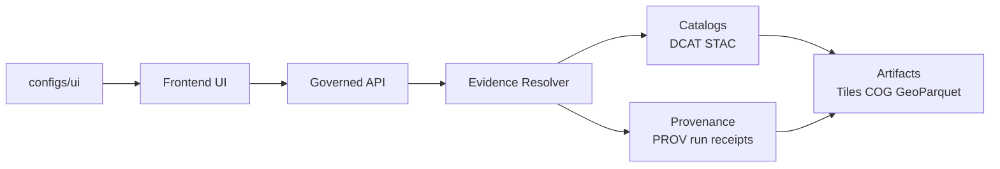

<!--
[KFM_META_BLOCK_V2]
doc_id: kfm://doc/7c0f1a53-1f2e-4a72-a3d9-4c593b7ad8a9
title: configs/ui/README
type: guide
version: v1
status: draft
owners: TBD
created: 2026-02-22
updated: 2026-02-22
policy_label: public
tags:
  - kfm
  - ui
  - config
notes:
  - Defines governance + contract expectations for UI runtime configuration.
[/KFM_META_BLOCK_V2]
-->

<a id="top"></a>

# configs/ui
UI runtime configuration for **Map Explorer**, **Story Mode**, and **Focus Mode** — defaults, registries, and “trust surface” settings that must remain **governed**, **evidence-led**, and **accessible**.

**Status:** `draft` • **Owners:** `TBD` • **Policy label:** `public`

**Quick nav:**  
[Purpose](#purpose) • [Directory layout](#directory-layout) • [Non-negotiables](#non-negotiables) • [Config conventions](#config-conventions) • [Map state](#map-state) • [Evidence and trust surfaces](#evidence-and-trust-surfaces) • [Accessibility](#accessibility) • [Abstention and restriction UX](#abstention-and-restriction-ux) • [Change management](#change-management) • [Definition of Done](#definition-of-done) • [Appendix](#appendix-example-json-snippets)

---

## Purpose

This folder holds **UI configuration** that the frontend consumes at runtime. In KFM terms, UI configuration is a **contract surface**: changes here can affect what users see, how evidence is explained, and how governance is made visible.

The UI is a **governed client**:
- it must **not embed privileged credentials**
- it must **render governance visibly** (policy notices, provenance/evidence, data versions, “what changed,” etc.)
- it must support **reproducible map state** (stories replay the same view; focus mode answers in context)

> **WARNING**  
> If a config change could alter layer visibility, redaction notices, export behavior, or story publish gating, treat it like a production change and route it through the normal governance review path. (If your repo has CODEOWNERS or required reviewers for UI/policy, they should apply here too.)

[(back to top)](#top)

---

## Directory layout

> **NOTE**  
> The exact file list in this folder is repo-specific. Keep this section updated as files are added.

Recommended pattern (example):

```text
repo/
  configs/
    ui/
      README.md                 # this file
      *.json                    # UI runtime configs (defaults, registries, feature flags)
      *.schema.json (optional)  # local schemas ONLY if repo conventions place UI schemas here
```

If your repo follows a “single home for schemas” approach, prefer:
- `contracts/schemas/ui/…` (or `schemas/ui/…`) for JSON Schemas
- `configs/ui/…` for environment-agnostic runtime config values

[(back to top)](#top)

---

## Non-negotiables

These requirements should be treated as hard constraints for anything configured here:

1. **No secrets / no privileged credentials**
   - configs in this folder must be safe to commit and ship to the browser.

2. **Governed, evidence-led UX**
   - configs must not encourage UI behaviors that bypass policy enforcement (no “direct data fetch” URLs that skip governed APIs; no hardcoded asset links that ignore redaction).

3. **Citations must resolve**
   - any configuration that participates in Story publishing or export must ensure citations/evidence references are resolvable at publish time.

4. **Trust surfaces are not optional**
   - policy notices, data versions, provenance access, and automation status are part of the user-visible governance contract.

5. **Abstention is a feature**
   - the UI must explain withholding in policy-safe terms, suggest safe alternatives, and avoid leaking restricted existence via “ghost metadata.”

[(back to top)](#top)

---

## Config conventions

### File formats
- Prefer **JSON** for runtime config (easy to validate, diff, and canonicalize).
- Avoid comments inside JSON (use adjacent `*.md` notes if needed).

### Versioning
- If a config is consumed by code or by downstream tools, include an explicit version field, e.g.:
  - `kfm_ui_config_version: "v1"`
- Breaking changes require:
  - a version bump
  - compatibility notes
  - a safe migration path (or dual-read strategy in UI code)

### Determinism
- Keep configs **deterministic**:
  - stable key ordering (where feasible)
  - avoid implicit defaults that differ across environments/builds
  - prefer explicit values for map defaults (bbox, zoom, time window, filters)

[(back to top)](#top)

---

## How this config fits into the governed system



**Principle:** UI config defines defaults and presentation rules, but **policy + evidence resolution happen at the API boundary**.

[(back to top)](#top)

---

## Map state

Map state is a first-class, reproducible concept in KFM. UI configuration typically defines:
- default camera position (bbox/zoom)
- default active layers (and their presentation defaults)
- default time window
- default filters

This should align with Story Node “map state” so:
- stories replay the same view reliably
- focus mode can answer *in context* of the current view

### Practical guidance
- Keep default views broad enough to avoid accidental sensitive pinpointing.
- If a default layer has policy obligations (e.g., generalized geometry), ensure the config enables the correct UI notice surface.

[(back to top)](#top)

---

## Evidence and trust surfaces

### Trust surfaces
Config in this folder may control whether these surfaces are enabled/required:

- automation status badges (healthy/degraded/failing) on layers or features
- evidence/provenance drawer reachable from:
  - every layer
  - every story claim
- data version label per layer linking to DatasetVersion catalogs
- policy notices at interaction time (example: “geometry generalized due to policy”)
- “what changed?” comparisons between dataset versions (counts/checksums/QA metrics)

### Evidence drawer minimum fields
Whether the evidence drawer is configured via code or config, it must be able to show at least:
- evidence bundle ID and digest
- dataset version ID and dataset name
- license and rights holder (including attribution text)
- freshness (last run timestamp) and validation status
- provenance chain (run receipt link)
- artifact links (only if allowed)
- redactions applied (obligations)

### Evidence reference shape
When configs need to store or reference evidence, prefer structured, resolvable identifiers (schemed references), for example:
- `dcat://…`
- `stac://…`
- `prov://…`

Avoid bare URLs to raw artifacts unless those URLs are themselves governed and policy-filtered.

[(back to top)](#top)

---

## Accessibility

Any UI behavior influenced by this configuration must preserve at least:
- keyboard navigability for layer controls and evidence drawer
- visible focus states
- text labels for policy badges and status indicators (no color-only meaning)
- ARIA labels for map controls
- safe markdown rendering for narratives (CSP + sanitization to prevent XSS)
- exports that include citations and `audit_ref` in a readable format

> **TIP**  
> If a config adds a new UI control, treat “keyboard + screen reader + focus order” as part of the config change’s acceptance criteria.

[(back to top)](#top)

---

## Abstention and restriction UX

Abstention must be understandable **without leaking restricted info**.

When the governed API returns deny/abstain:
- show “why” in policy-safe terms (e.g., “restricted evidence not available to your role”)
- suggest safe alternatives (broader time range, public datasets, different aggregation)
- provide `audit_ref` so stewards can review
- never show “ghost metadata” that reveals restricted existence unless policy allows

[(back to top)](#top)

---

## Change management

When changing anything under `configs/ui/`:

1. **Describe the user-visible effect**
   - What changes on screen? Which surfaces are impacted (layers, evidence drawer, exports, story publishing, focus mode)?

2. **Update or add the contract**
   - Add/modify JSON Schema for the config (where your repo keeps schemas).
   - If your UI consumes typed config, update TypeScript types accordingly.

3. **Run validation**
   - Schema validation for the changed config(s)
   - Link/citation checks if the config introduces evidence refs or impacts story publish rules
   - UI accessibility checks if controls change or new surfaces appear

4. **Governance review triggers**
   - Any changes that could impact policy notices, redactions/obligations messaging, export behavior, or story publishing should trigger governance/steward review.

[(back to top)](#top)

---

## Definition of Done

A config change in this folder is “done” when:

- [ ] The change is described in human terms (what users will see).
- [ ] Config is valid JSON and matches a schema (or the schema is updated/added).
- [ ] No secrets or privileged credentials were added.
- [ ] Any evidence refs introduced are resolvable (or the feature is gated so publishing/export cannot proceed without resolution).
- [ ] Trust surfaces remain enabled (policy notice, evidence drawer, data version label).
- [ ] Abstention UX remains policy-safe (no ghost metadata).
- [ ] Accessibility requirements remain satisfied (keyboard, labels, ARIA, safe markdown).
- [ ] Rollback plan exists (revert commit or config version pin).

[(back to top)](#top)

---

## Appendix: Example JSON snippets

<details>
<summary><strong>Example: Map state shape</strong></summary>

```json
{
  "bbox": [-102.0, 36.9, -94.6, 40.0],
  "zoom": 6,
  "layers": [
    { "layer_id": "example_layer", "dataset_version_id": "YYYY-MM.somehash" }
  ],
  "time_window": { "start": "1950-01-01", "end": "2024-12-31" },
  "filters": {
    "category": ["example"]
  }
}
```

</details>

<details>
<summary><strong>Example: Story Node sidecar (map state + citations)</strong></summary>

```json
{
  "kfm_story_node_version": "v3",
  "story_id": "kfm://story/<uuid>",
  "version_id": "v1",
  "status": "draft",
  "policy_label": "public",
  "review_state": "needs_review",
  "map_state": {
    "bbox": [-102.0, 36.9, -94.6, 40.0],
    "zoom": 6,
    "layers": [
      { "layer_id": "noaa_storm_events", "dataset_version_id": "2026-02.abcd1234" }
    ],
    "time_window": { "start": "1950-01-01", "end": "2024-12-31" }
  },
  "citations": [
    { "ref": "dcat://noaa_ncei_storm_events@2026-02.abcd1234", "kind": "dcat" },
    { "ref": "prov://run/2026-02-20T12:34Z...", "kind": "prov" }
  ]
}
```

</details>
