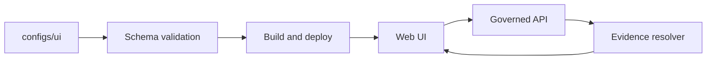

<!-- [KFM_META_BLOCK_V2]
doc_id: kfm://doc/6c1bd5de-2058-4968-878e-2c2a9db6ef02
title: configs/ui — UI Configuration
type: standard
version: v1
status: draft
owners: KFM UI
created: 2026-02-23
updated: 2026-02-23
policy_label: public
related:
  - schemas/ui/
  - contracts/schemas/          # if the repo uses the blueprint layout
  - web/
tags: [kfm, ui, config]
notes:
  - This directory holds governed configuration for KFM UI surfaces (Map, Story, Focus).
  - Treat configs as contract artifacts: versioned, schema-validated, review-gated.
[/KFM_META_BLOCK_V2] -->

# `configs/ui`

> **Purpose:** governed, schema-validated configuration for KFM UI surfaces (Map Explorer, Story Mode, Focus Mode).


<!-- TODO: replace badges with real workflow/status links once known. -->

## Quick links

- [Why this exists](#why-this-exists)
- [Where it fits in the repo](#where-it-fits-in-the-repo)
- [Directory layout](#directory-layout)
- [Config registry](#config-registry)
- [Hard rules](#hard-rules)
- [Loading and override model](#loading-and-override-model)
- [Validation and promotion gates](#validation-and-promotion-gates)
- [Change checklist](#change-checklist)
- [Appendix](#appendix)

---

## Why this exists

KFM’s UI is a **trust surface**: it must expose dataset version, freshness, license, and policy badges; provide one-click evidence/provenance; and behave safely under policy denials and redactions.

This directory exists so those UI behaviors are **driven by governed configuration** (not hard-coded ad hoc), and so config changes can be reviewed, validated, and rolled back like any other production contract artifact.

### Where it fits in the system



- **UI must not bypass policy enforcement** (no direct reads from object storage or databases).
- **Config must not introduce bypass paths** (e.g., direct tile URLs pointing to raw or processed buckets).

[Back to top](#quick-links)

---

## Where it fits in the repo

> The exact wiring may vary; these are the intended touchpoints.

- **Primary consumer:** `web/` (the Map/Story UI and Focus Mode UI).
- **Primary validators:** UI config schemas under **either**:
  - `schemas/ui/` (repo structure guide), **or**
  - `contracts/schemas/` (blueprint-style “contracts/” layout)

If you find your repo uses different paths, update this section and the registry table below.

[Back to top](#quick-links)

---

## Directory layout

> **Recommended default layout** (update as real files land).  
> This README is written to be valid even if only a subset of files exist initially.

```text
configs/ui/
  README.md

  defaults/
    ui.defaults.json          # Baseline UI config (safe defaults)
    map.defaults.json         # Baseline map behavior (zoom bounds, time defaults)

  env/
    ui.dev.json               # Dev overrides (local-only)
    ui.stage.json             # Staging overrides
    ui.prod.json              # Production overrides

  theme/
    tokens.json               # Design tokens (colors, typography, spacing)
    branding.json             # Logos, wordmarks, naming (no copyrighted assets embedded)

  map/
    layers.registry.json      # Layer registry (id, label, datasets, policy display rules)
    basemap.style.json        # Basemap style reference (no credentials)

  story/
    rendering.json            # Story rendering toggles, citation UI rules

  focus/
    focus-ui.json             # Focus Mode UI options (abstention UX, citation density)
```

### Acceptable inputs

- **JSON / JSONC / YAML** (if the repo supports it) that is:
  - versioned in git,
  - validated against a schema (see [Validation and promotion gates](#validation-and-promotion-gates)),
  - safe to ship to clients (no secrets),
  - documented in this README when adding new keys.

### Exclusions

- **Secrets**: API keys, tokens, client secrets, signed URLs, private endpoints.
- **Direct data endpoints** that bypass governed APIs (raw/processed buckets, database hosts).
- **Binary assets** (images/fonts) unless the repo has an explicit assets policy and license tracking.
- **One-off local settings** (put these in ignored local dev config, not in git).

[Back to top](#quick-links)

---

## Config registry

This registry is the “map” of config surfaces in this directory. Keep it current.

> **Important:** Schema file names below are **placeholders** until the actual schema inventory exists.  
> Replace `schemas/ui/<…>` with real paths and keep them versioned.

| Config surface | File(s) | Schema (TBD) | Consumed by | Notes |
|---|---|---|---|---|
| UI defaults | `defaults/ui.defaults.json` | `schemas/ui/<ui-defaults>.v1.schema.json` | `web/` | Baseline safe behavior |
| Feature flags | `defaults/ui.defaults.json` (section) | `schemas/ui/<feature-flags>.v1.schema.json` | `web/` | Prefer additive flags |
| Theme tokens | `theme/tokens.json` | `schemas/ui/<theme-tokens>.v1.schema.json` | `web/` | No brand assets embedded |
| Map defaults | `defaults/map.defaults.json` | `schemas/ui/<map-defaults>.v1.schema.json` | `web/` | Zoom/time bounds |
| Layer registry | `map/layers.registry.json` | `schemas/ui/<layers-registry>.v1.schema.json` | `web/` | Must reference dataset/version IDs, not raw URLs |
| Basemap style ref | `map/basemap.style.json` | `schemas/ui/<basemap-style>.v1.schema.json` | `web/` | Use placeholder URLs in examples |
| Story rendering | `story/rendering.json` | `schemas/ui/<story-rendering>.v1.schema.json` | `web/` | Citation UI + evidence drawer rules |
| Focus Mode UI | `focus/focus-ui.json` | `schemas/ui/<focus-ui>.v1.schema.json` | `web/` | Abstention UX + citation density |

[Back to top](#quick-links)

---

## Hard rules

### 1) Trust membrane stays intact

- UI config **must not** cause the frontend to fetch data directly from object storage or databases.
- All data access must be routed through governed APIs so policy, provenance, and auditing are enforced.

### 2) No credentials in config

- Do not embed credentials in config/specs (including basemap styles, tile URLs, or service endpoints).
- If an endpoint requires authentication, the UI should call the governed API which performs auth and policy checks.

### 3) Policy-aware by design

When config influences display of datasets/layers/stories, it must support policy outcomes:

- allow (normal display)
- deny (hide / safe error)
- obligations (generalize geometry, suppress exports, show notice)

[Back to top](#quick-links)

---

## Loading and override model

Because repo wiring can vary, **treat this as the recommended model** and adjust once the actual loader is confirmed:

1. Load `defaults/*.json`
2. Merge `env/ui.<environment>.json` (if present)
3. Apply runtime overrides (if any) from a governed endpoint (optional)

### Merge semantics (recommended)

- Objects: deep merge
- Arrays: replace (unless a schema defines merge-by-id)
- Unknown keys: fail validation (default-deny for config drift)

[Back to top](#quick-links)

---

## Validation and promotion gates

Config is a **contract artifact**. It should be validated in CI before merge.

### Minimum gates (recommended)

- [ ] JSON schema validation for every config file in this directory
- [ ] Cross-link checks (e.g., layer ids refer to known datasets and API layer ids)
- [ ] Secret scanning (fail if tokens/keys are detected)
- [ ] E2E smoke: UI boots + renders evidence drawer for at least one public dataset

> **Repo reality check:** before wiring loaders or CI gates, confirm the repo’s actual module layout, build system, and workflow names.

[Back to top](#quick-links)

---

## Change checklist

Use this checklist for any PR touching `configs/ui/`.

### Required

- [ ] Schema exists (or is added) for any new/changed config surface
- [ ] Config passes validation gates locally/CI
- [ ] README updated: registry row + notes for new keys
- [ ] No secrets / no direct data endpoints introduced
- [ ] UI behavior verified for: allow, deny, obligations

### Nice-to-have

- [ ] Add/expand fixtures for policy-driven UI states
- [ ] Add screenshot(s) to PR description for significant UI changes
- [ ] Add migration note if a schema version changes

[Back to top](#quick-links)

---

## Appendix

<details>
<summary>Example: layer registry entry (illustrative)</summary>

```json
{
  "layer_id": "noaa_storm_events",
  "title": "Storm Events",
  "dataset": {
    "dataset_slug": "noaa_ncei_storm_events",
    "dataset_version_id": "2026-02.abcd1234"
  },
  "ui": {
    "default_visible": false,
    "legend": { "type": "categorical", "field": "event_type" },
    "badges": ["license", "policy_label", "freshness"]
  }
}
```

</details>

<details>
<summary>Example: feature flag block (illustrative)</summary>

```json
{
  "feature_flags": {
    "enable_focus_mode": true,
    "enable_story_publishing_ui": false
  }
}
```

</details>
