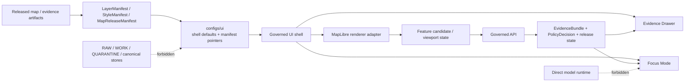

<!-- [KFM_META_BLOCK_V2]
doc_id: kfm://doc/REVIEW_REQUIRED_UUID_CONFIGS_UI_README
title: configs/ui
type: standard
version: v1
status: draft
owners: REVIEW_REQUIRED_OWNER
created: 2026-04-29
updated: 2026-04-29
policy_label: NEEDS_VERIFICATION__public_or_restricted
related: [../README.md, ../../README.md, ../../schemas/README.md, ../../contracts/README.md, ../../policy/README.md, ../../apps/README.md, ../../tests/README.md]
tags: [kfm, ui, configs, maplibre, evidence-drawer, focus-mode, governed-ui]
notes: [Drafted from KFM corpus and current workspace evidence. Owner, doc_id, policy label, adjacent links, exact config filenames, and validation command remain review items because the mounted repo was not available.]
[/KFM_META_BLOCK_V2] -->

<a id="top"></a>

# configs/ui

Configuration home for public-safe UI defaults that keep the KFM shell map-first, evidence-visible, policy-aware, and downstream of governed release artifacts.

> [!NOTE]
> **Impact block**  
> **Status:** `experimental`  
> **Owners:** `REVIEW_REQUIRED_OWNER`  
> **Path:** `configs/ui/`  
> **Posture:** governed UI configuration, not canonical truth, not policy authority, not model runtime  
> **Badges:**  
> 
> 
> 
> 
>   
> **Quick jumps:** [Scope](#scope) · [Repo fit](#repo-fit) · [Accepted inputs](#accepted-inputs) · [Exclusions](#exclusions) · [Directory tree](#directory-tree) · [Quickstart](#quickstart) · [Usage](#usage) · [Diagram](#diagram) · [Operating tables](#operating-tables) · [Definition of done](#definition-of-done) · [FAQ](#faq) · [Appendix](#appendix)

> [!IMPORTANT]
> `configs/ui` may configure how the shell presents released map, drawer, review, export, and Focus surfaces. It must not grant the browser access to RAW, WORK, QUARANTINE, canonical stores, direct model clients, unpublished artifacts, secret-bearing endpoints, or steward-only locations.

---

## Scope

`configs/ui` is the proposed configuration lane for shell-level UI defaults and manifest pointers.

It is for **configuration that helps the front end consume governed outputs**:

- map shell defaults
- surface registry defaults
- trust-state labels and visible negative states
- MapLibre runtime adapter defaults
- Evidence Drawer display defaults
- Focus Mode finite-outcome defaults
- accessibility and responsive behavior defaults
- feature flags that remain subordinate to release, policy, and review state

It is not the source of truth for claims, sources, policy, release state, evidence, routes, schemas, data, tiles, model prompts, or reviewer decisions.

**Truth posture for this README**

| Claim | Label | Meaning |
|---|---|---|
| KFM is governed, evidence-first, map-first, and time-aware. | CONFIRMED | Supported by the attached KFM corpus. |
| MapLibre should be a downstream disciplined 2D renderer inside a governed shell. | CONFIRMED doctrine / PROPOSED implementation | Supported by the MapLibre UI doctrine; implementation depth still needs repo proof. |
| `configs/ui` exists in the mounted repository. | UNKNOWN | The visible workspace did not expose a KFM checkout. |
| The filenames below already exist. | PROPOSED | They are suggested config families to adapt to repo conventions. |
| Package manager, validator, CI command, and app path are known. | UNKNOWN | Verify in the real checkout before merge. |

[Back to top](#top)

---

## Repo fit

`configs/ui/` should sit between **released trust objects** and the **UI shell**. It should make UI behavior easier to review without moving governance into browser configuration.

| Direction | Path | Status | Role |
|---|---|---:|---|
| Parent config index | [`../README.md`](../README.md) | NEEDS VERIFICATION | Expected home for repository-wide config conventions. |
| Repo root | [`../../README.md`](../../README.md) | NEEDS VERIFICATION | Expected top-level project orientation and trust posture. |
| Schema contracts | [`../../schemas/README.md`](../../schemas/README.md) | NEEDS VERIFICATION | Expected schema authority or schema index. |
| API contracts | [`../../contracts/README.md`](../../contracts/README.md) | NEEDS VERIFICATION | Expected API / runtime contract documentation. |
| Policy gates | [`../../policy/README.md`](../../policy/README.md) | NEEDS VERIFICATION | Expected policy-as-code and release gate documentation. |
| UI implementation | [`../../apps/README.md`](../../apps/README.md) | NEEDS VERIFICATION | Expected application surface consuming this config. |
| Fixtures and tests | [`../../tests/README.md`](../../tests/README.md) | NEEDS VERIFICATION | Expected validation fixtures and smoke tests. |

> [!WARNING]
> Link targets are included because README-like docs need repo-fit navigation. They must be checked against the real repo tree before commit.

[Back to top](#top)

---

## Accepted inputs

Only commit configuration that is safe to expose to the normal UI build and safe to review in Git.

| Config family | Accepted here | Required guardrail |
|---|---|---|
| Shell defaults | Surface visibility, panel ordering, default active surface, responsive breakpoints. | Must preserve evidence, policy, review, time, and correction visibility. |
| Map runtime defaults | Renderer adapter flags, allowed source types, non-secret style/sprite/glyph references, initial viewport defaults. | MapLibre remains renderer only; no truth, policy, or release authority. |
| Layer / style references | References to released `LayerManifest`, `StyleManifest`, `TileArtifactManifest`, or `MapReleaseManifest` objects. | Reference manifests; do not embed canonical records or unpublished candidate data. |
| Evidence Drawer defaults | Drawer section order, labels, badge display, citation visibility, empty-state copy. | Every consequential claim must resolve through governed evidence support. |
| Focus Mode defaults | Finite outcome labels, reason-code display, scope inheritance, citation display defaults. | Outcomes remain `ANSWER`, `ABSTAIN`, `DENY`, or `ERROR`; no detached chat surface. |
| Trust-state copy | Public wording for `MISSING_EVIDENCE`, `SOURCE_STALE`, `DENIED_BY_POLICY`, `GENERALIZED_GEOMETRY`, `RESTRICTED_ACCESS`, `CONFLICTED_SUPPORT`, `CITATION_FAILED`, `RELEASE_WITHDRAWN`, and `RUNTIME_ERROR`. | Denials and abstentions must be visible, not softened into vague helpful text. |
| Accessibility defaults | Keyboard hints, focus order metadata, non-color trust indicators, reduced-motion flags. | Trust cues cannot rely on color alone. |
| Feature flags | Controlled exposure of shell features and config-backed experiments. | Feature flags must not bypass policy, citation validation, release state, or access controls. |

[Back to top](#top)

---

## Exclusions

The fastest way to weaken this directory is to make it convenient. Keep the boundary sharp.

| Do not put here | Send it instead to | Reason |
|---|---|---|
| RAW, WORK, QUARANTINE, canonical, or unpublished data paths | `data/`, pipeline config, or governed backend storage | Public UI config must not become a trust-membrane bypass. |
| Secrets, tokens, API keys, cookies, credentials, or VPN/reverse-proxy details | Secret manager / deployment config | This directory may be rendered, bundled, or reviewed broadly. |
| Source descriptors, rights decisions, or source authority records | Source registry / `data/registry/` or repo-native equivalent | Source authority belongs to source governance, not UI defaults. |
| JSON Schemas or OpenAPI components | `schemas/` or `contracts/` | Config consumes contracts; it does not define machine authority. |
| Rego / policy rules | `policy/` | Policy must be enforceable outside the browser. |
| UI components, React code, runtime adapters, or MapLibre wrappers | `apps/`, `ui/`, `web/`, or `packages/` | This directory should not become implementation code. |
| Tile archives, COGs, PMTiles, MBTiles, sprites, glyph bundles, or exported story packages | `data/published/`, `release/`, CDN-like storage, or artifact registry | Delivery artifacts need release manifests and hashes. |
| Model prompts, provider settings, or direct model URLs | Governed AI config / backend runtime config | Focus Mode must remain evidence-subordinate and API-mediated. |
| Exact restricted geometry, steward-only labels, sensitive counts, or withheld-feature details | Governed backend and policy-filtered release artifacts | Config must not leak location-sensitive or access-restricted information. |

[Back to top](#top)

---

## Directory tree

PROPOSED tree. Adapt names through an ADR or migration note if the real repo has established config naming.

```text
configs/ui/
├── README.md
├── shell.defaults.example.json
├── surfaces.example.json
├── trust-states.example.json
├── maplibre.example.json
├── evidence-drawer.example.json
├── focus-mode.example.json
├── feature-flags.example.json
├── accessibility.example.json
└── environments/
    ├── local.example.json
    ├── review.example.json
    └── public.example.json
```

| File | Purpose | Merge expectation |
|---|---|---|
| `shell.defaults.example.json` | Default shell surfaces, panel ordering, time-control visibility, and trust cue visibility. | Must not hide Evidence Drawer or negative states. |
| `surfaces.example.json` | Registry for Explore, Dossier, Story, Compare, Focus, Review, Export, and Diagnostics shell surfaces. | Must mark steward/admin surfaces separately from public shell behavior. |
| `trust-states.example.json` | Public-safe labels and helper text for visible trust states. | Must distinguish denial, abstention, policy block, stale source, and runtime error. |
| `maplibre.example.json` | Renderer adapter defaults and non-secret references to released styles and source types. | Must preserve source/layer separation and avoid production-dense GeoJSON defaults. |
| `evidence-drawer.example.json` | Drawer section order and required evidence/release/correction display flags. | Must keep citations, source roles, review state, and release state visible. |
| `focus-mode.example.json` | Finite outcome labels, scope inheritance, and validation display defaults. | Must not define a direct model endpoint or prompt-only truth behavior. |
| `feature-flags.example.json` | Reviewable feature flags for shell capabilities. | Must remain subordinate to policy and release state. |
| `accessibility.example.json` | Non-color trust cues, keyboard behavior, motion preferences, and text alternatives. | Must be included in UI smoke tests. |
| `environments/*.example.json` | Environment-specific examples without secrets. | Must not contain credentials or raw data endpoints. |

[Back to top](#top)

---

## Quickstart

The real repo validator is **NEEDS VERIFICATION**. Until the repo-native command is confirmed, use this section as a review shape, not as evidence of current CI behavior.

```bash
# From the repository root.
# NEEDS VERIFICATION: replace with the repo-native config/schema validator.
python -m json.tool configs/ui/shell.defaults.example.json >/dev/null
python -m json.tool configs/ui/trust-states.example.json >/dev/null
python -m json.tool configs/ui/maplibre.example.json >/dev/null
```

Expected future validation shape:

```bash
# Pseudocode: replace with actual KFM command once verified.
<repo-native-validator> configs/ui \
  --schemas schemas/contracts/v1 \
  --policy policy \
  --fixtures tests/fixtures
```

[Back to top](#top)

---

## Usage

Use config files in this directory to select **how the shell behaves after governance has already produced admissible artifacts**.

Illustrative config shape:

```json
{
  "schema": "kfm.ui.shell_config.v1",
  "config_id": "kfm.ui.config.public.default",
  "status": "draft",
  "release_scope": "public-safe",
  "requires": {
    "layer_manifest": true,
    "style_manifest": true,
    "evidence_drawer_payload": true,
    "finite_focus_outcomes": ["ANSWER", "ABSTAIN", "DENY", "ERROR"]
  },
  "visible_trust_states": [
    "MISSING_EVIDENCE",
    "SOURCE_STALE",
    "DENIED_BY_POLICY",
    "GENERALIZED_GEOMETRY",
    "RESTRICTED_ACCESS",
    "CONFLICTED_SUPPORT",
    "CITATION_FAILED",
    "RELEASE_WITHDRAWN",
    "RUNTIME_ERROR"
  ],
  "forbidden_paths": {
    "raw_store_access": true,
    "work_store_access": true,
    "quarantine_store_access": true,
    "canonical_store_access": true,
    "direct_model_client": true
  }
}
```

> [!CAUTION]
> The snippet is illustrative. Do not treat `kfm.ui.shell_config.v1` as an implemented schema until the real schema home is verified.

[Back to top](#top)

---

## Diagram


```mermaid
flowchart LR
    A[Released map / evidence artifacts] --> B[LayerManifest / StyleManifest / MapReleaseManifest]
    B --> C[configs/ui<br/>shell defaults + manifest pointers]
    C --> D[Governed UI shell]
    D --> E[MapLibre renderer adapter]
    D --> F[Evidence Drawer]
    D --> G[Focus Mode]
    E --> H[Feature candidate / viewport state]
    H --> I[Governed API]
    I --> J[EvidenceBundle + PolicyDecision + release state]
    J --> F
    J --> G

    X[RAW / WORK / QUARANTINE / canonical stores] -. forbidden .-> C
    Y[Direct model runtime] -. forbidden .-> G
```

The config lane should help the shell **find and display** governed outputs. It must not let UI configuration become a shortcut around evidence resolution, policy enforcement, or release state.

[Back to top](#top)

---

## Operating tables

### Configuration principles

| Principle | Practical rule |
|---|---|
| Renderer is downstream | MapLibre config may set renderer defaults, but never truth, policy, publication, citation, review, or AI authority. |
| Manifest before display | Public layer/style/tile references should resolve through release-aware manifests. |
| Drawer before claims | Popup and hover text stay lightweight; consequential claims belong in Evidence Drawer or governed surfaces. |
| Focus stays bounded | Focus Mode inherits active geography, time, role, and release scope; it does not answer outside scope unless scope changes through a governed control. |
| Negative states are real states | Deny, abstain, stale, missing, restricted, withdrawn, and error states must remain visible and testable. |
| Feature flags are not gates | Flags may hide or reveal UI affordances, but policy and release gates decide whether content is allowed. |

### Review matrix

| Review question | Required answer before merge |
|---|---|
| Does this config reference only released or fixture-safe artifacts? | YES, or hold in draft. |
| Does it avoid secrets and direct backend/model endpoints? | YES, always. |
| Does it preserve `ANSWER` / `ABSTAIN` / `DENY` / `ERROR` distinction? | YES, for every Focus-facing config. |
| Does it keep Evidence Drawer reachable from map selection? | YES, unless the feature is explicitly non-claim-bearing. |
| Does it represent denied or restricted states without leaking details? | YES, policy-safe wording only. |
| Does it carry enough release/correction context for exports? | YES, if export surfaces use the config. |
| Does it have fixture coverage for stale, missing, denied, and error paths? | YES, before active use. |

[Back to top](#top)

---

## Definition of done

A config change under `configs/ui` is ready for review when all applicable gates are checked.

- [ ] Owner is assigned in the KFM Meta Block and CODEOWNERS or repo-native ownership surface.
- [ ] Policy label is confirmed.
- [ ] Adjacent links in this README are verified from `configs/ui/`.
- [ ] Config files are valid JSON/YAML/TOML according to repo convention.
- [ ] Config references manifests or released fixture IDs rather than raw/canonical paths.
- [ ] No secrets, credentials, direct model URLs, private source URLs, or raw-store paths are present.
- [ ] Negative states remain visually and textually distinct.
- [ ] Evidence Drawer can show evidence refs, source roles, review state, release ID, correction state, and citation status.
- [ ] Focus Mode config preserves finite outcomes and citation validation visibility.
- [ ] Sensitive geometry and restricted-access copy are policy-safe.
- [ ] Accessibility defaults include keyboard, focus, non-color cues, contrast, and reduced-motion considerations.
- [ ] Rollback target or previous config version is documented for active configs.
- [ ] Config fixtures cover valid, stale, missing evidence, denied, restricted, withdrawn, and runtime error states.
- [ ] Repo-native schema, policy, lint, and UI smoke tests pass.
- [ ] Documentation, ADRs, schemas, policy, and tests are updated in the same PR when behavior changes.

[Back to top](#top)

---

## FAQ

### Is this directory allowed to change what a layer means?

No. Layer meaning belongs in source descriptors, contracts, manifests, evidence bundles, policy decisions, review state, and release artifacts. `configs/ui` may change presentation defaults only when those changes do not silently alter claim meaning.

### Can a feature flag expose an unreleased layer to public users?

No. Feature flags are UI affordances. They do not override release state, policy state, rights, sensitivity, citation validation, or source support.

### Can this directory store local development endpoints?

Only non-secret, public-safe examples. Real credentials, tokens, private service URLs, admin endpoints, or direct model runtime addresses do not belong here.

### Can Focus Mode be configured here?

Only bounded UI behavior: labels, visible reason codes, scope inheritance defaults, and finite outcome presentation. Retrieval, policy checks, citation validation, model provider configuration, and runtime enforcement belong behind governed APIs.

### Can MapLibre style JSON live here?

Prefer released, hashable style artifacts under the repo’s release/artifact path. This directory may include example references or UI defaults, but production style assets should remain manifest-bound and release-governed.

[Back to top](#top)

---

## Appendix

<details>
<summary>Open verification backlog</summary>

- Confirm whether `configs/ui/` already exists.
- Confirm exact owner for `configs/ui`.
- Confirm policy label for UI config files.
- Confirm parent `configs/README.md` convention.
- Confirm actual schema home for UI config objects.
- Confirm actual contract home for MapLibre, Evidence Drawer, Focus Mode, and release payloads.
- Confirm app path that consumes this config.
- Confirm package manager and validation command.
- Confirm CI workflows and branch protections.
- Confirm whether config is bundled into public clients, loaded server-side, or both.
- Confirm whether environment-specific config belongs under `configs/ui/environments/` or a separate deployment surface.
- Confirm active source of truth for feature flags.
- Confirm current UI accessibility test framework.
- Confirm release artifact, rollback, and cache invalidation conventions.

</details>

<details>
<summary>Terms used here</summary>

| Term | Meaning in this README |
|---|---|
| Governed UI shell | Persistent map-first interface that keeps geography, time, evidence, policy, review, release, and correction state visible. |
| Evidence Drawer | Trust surface that resolves consequential claims to evidence, source roles, citations, review state, and release/correction context. |
| Focus Mode | Evidence-bounded synthesis surface inside the shell with finite outcomes and citation validation. |
| LayerManifest | Release-aware object describing map layer identity, artifacts, evidence obligations, and display boundaries. |
| StyleManifest | Release-aware object describing visual treatment and style asset identity. |
| MapReleaseManifest | Release object tying layer/style/tile artifacts to hashes, source refs, prior release, rollback target, and cache behavior. |
| Negative state | Visible UI state such as missing evidence, denied policy, stale source, citation failure, restricted access, withdrawn release, or runtime error. |

</details>

[Back to top](#top)