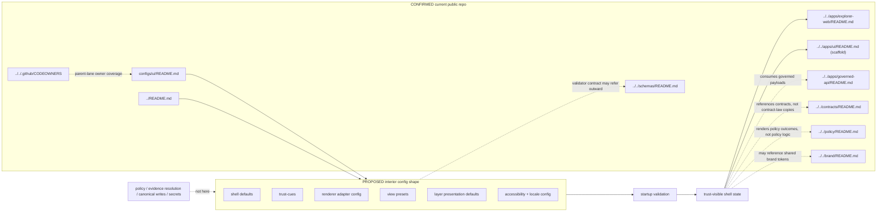

<!-- [KFM_META_BLOCK_V2]
doc_id: kfm://doc/<NEEDS-UUID>
title: UI Configuration
type: standard
version: v1
status: draft
owners: @bartytime4life
created: YYYY-MM-DD
updated: YYYY-MM-DD
policy_label: <NEEDS VERIFICATION>
related: [../README.md, ../../apps/explorer-web/README.md, ../../apps/ui/README.md, ../../apps/governed-api/README.md, ../../contracts/README.md, ../../policy/README.md, ../../schemas/README.md, ../../brand/README.md, ../../.github/CODEOWNERS]
tags: [kfm, ui, config, maplibre, shell]
notes: [Current public main confirms configs/ui/ exists and currently exposes README.md only; current public policy/ and schemas/ parent lanes are now visibly richer than README-only and are reflected here as boundary context; created/updated placeholders need git-history verification; ../../styles/README.md is still absent on public main.]
[/KFM_META_BLOCK_V2] -->

# UI Configuration

Declarative, reviewable UI wiring for the KFM shell, renderer adapters, trust-visible presentation defaults, and accessibility-safe surface behavior.

> **Status:** experimental · **Doc state:** draft · **Owners:** `@bartytime4life` *(current public `/configs/` owner via `.github/CODEOWNERS`; narrower split not yet verified)*  
>        
> **Repo fit:** `configs/ui/README.md` · parent [`../README.md`](../README.md) · shell consumer [`../../apps/explorer-web/README.md`](../../apps/explorer-web/README.md) · governed boundaries [`../../contracts/README.md`](../../contracts/README.md), [`../../policy/README.md`](../../policy/README.md) · schema context [`../../schemas/README.md`](../../schemas/README.md) · presentation neighbor [`../../brand/README.md`](../../brand/README.md)  
> **Quick jump:** [Scope](#scope) · [Repo fit](#repo-fit) · [Accepted inputs](#accepted-inputs) · [Exclusions](#exclusions) · [Directory tree](#directory-tree) · [Quickstart](#quickstart) · [Config domains](#config-domains) · [Diagram](#diagram) · [Current public inventory](#current-public-inventory) · [Gates](#change-gates--definition-of-done) · [FAQ](#faq) · [Appendix](#appendix)

> [!IMPORTANT]
> Current public `main` confirms that `configs/ui/` is a real repo subtree, but the visible inventory is currently `README.md` only. This file therefore distinguishes **CONFIRMED current public inventory** from a **PROPOSED interior working shape**.

> [!WARNING]
> `configs/ui/` must never become a side door for policy, evidence resolution, canonical writes, secrets, or hidden steward-only behavior.

---

## Scope

`configs/ui/` is the repo-visible home for **non-secret, shell-facing UI configuration**.

In KFM, that means wiring the governed shell in a way that stays explicit, reviewable, and subordinate to stronger seams such as contracts, policy, evidence resolution, and publication law. This lane exists to make UI behavior legible in Git, not to let frontend convenience quietly redefine truth.

### Truth posture used here

| Label | How it applies in this README |
| --- | --- |
| **CONFIRMED** | `configs/ui/README.md` exists on public `main`; `configs/`, `apps/explorer-web/`, `apps/ui/`, `contracts/`, `policy/`, `schemas/`, and `brand/` are visible repo lanes or docs. |
| **INFERRED** | `configs/ui/` is intended to hold non-secret shell/runtime configuration consumed by governed UI surfaces. |
| **PROPOSED** | Interior file shapes such as `ui.schema.json`, `shell.defaults.yaml`, or per-surface presets that are not yet visible in the public subtree. |
| **UNKNOWN / NEEDS VERIFICATION** | Actual loader paths, real validation entrypoints, non-public CI settings, git-history dates, and any unpublished runtime behavior. |

### What this directory is for

- keeping shell wiring explicit
- keeping renderer choices subordinate to shell law
- keeping trust cues visible and consistent
- keeping UI behavior configurable without changing doctrine
- keeping presentation settings reviewable in Git

### What this directory is not for

- silent policy overrides
- source-admission rules
- evidence-resolution logic
- canonical-write behavior
- secrets
- hidden feature toggles that weaken trust posture

[Back to top](#ui-configuration)

---

## Repo fit

### Path placement

| Item | Value | Status |
| --- | --- | --- |
| Target README path | `configs/ui/README.md` | **CONFIRMED** on public `main` |
| Parent directory family | `configs/` | **CONFIRMED** |
| Current visible subtree inventory | `README.md` only | **CONFIRMED** |
| Owner coverage | [`../../.github/CODEOWNERS`](../../.github/CODEOWNERS) | **CONFIRMED** parent-lane `/configs/` rule to `@bartytime4life`; narrower `/configs/ui` split remains **UNKNOWN** |
| Primary consumer doc | [`../../apps/explorer-web/README.md`](../../apps/explorer-web/README.md) | **CONFIRMED** doc exists; runtime depth remains **UNKNOWN** |
| Secondary / scaffold surface | [`../../apps/ui/README.md`](../../apps/ui/README.md) | **CONFIRMED** scaffold exists |
| Governed backend neighbor | [`../../apps/governed-api/README.md`](../../apps/governed-api/README.md) | **CONFIRMED** current public lane exists |
| Contract boundary | [`../../contracts/README.md`](../../contracts/README.md) | **CONFIRMED** current public doc exists |
| Policy boundary | [`../../policy/README.md`](../../policy/README.md) | **CONFIRMED** current public parent lane and child policy surfaces are visible |
| Schema authority context | [`../../schemas/README.md`](../../schemas/README.md) | **CONFIRMED** current public parent subtree is visible; final schema-home decision remains unresolved |
| Brand / presentation neighbor | [`../../brand/README.md`](../../brand/README.md) | **CONFIRMED** current public identity subtree exists |
| `../../styles/README.md` | not present on public `main` | **CONFIRMED** absence for that specific path |

### Upstream and downstream links

| Relationship | Path | Why it matters |
| --- | --- | --- |
| Parent config lane | [`../README.md`](../README.md) | Defines the broader non-secret configuration boundary. |
| Runtime shell consumer | [`../../apps/explorer-web/README.md`](../../apps/explorer-web/README.md) | Documents the persistent, map-first shell that would consume these defaults. |
| Secondary UI scaffold | [`../../apps/ui/README.md`](../../apps/ui/README.md) | Confirms a second app-side UI subtree exists today. |
| Governed API boundary | [`../../apps/governed-api/README.md`](../../apps/governed-api/README.md) | UI config must stay downstream of governed payloads. |
| Contract boundary | [`../../contracts/README.md`](../../contracts/README.md) | UI config may reference machine law, but must not replace it. |
| Policy boundary | [`../../policy/README.md`](../../policy/README.md) | Reasons, obligations, and deny-by-default behavior stay there; UI config renders results but does not define them. |
| Schema context | [`../../schemas/README.md`](../../schemas/README.md) | The parent schema subtree is now visibly present, but this README still avoids inventing a singular schema home by assumption. |
| Presentation / identity neighbor | [`../../brand/README.md`](../../brand/README.md) | Shared brand assets and tokens should stay separate from shell wiring. |
| Review ownership | [`../../.github/CODEOWNERS`](../../.github/CODEOWNERS) | Owner badges here are grounded only at the parent `/configs/` rule. |
| Adjacent doctrine / ADRs | [`../../docs/`](../../docs/) | Route families, runbooks, ADRs, and taxonomy docs belong here. |

### Why this path fits KFM

KFM’s March 2026 doctrine consistently separates:

- **shell** from **renderer**
- **configuration** from **governance logic**
- **delivery and portrayal assets** from **canonical truth**
- **public surface behavior** from **policy enforcement**

That makes `configs/ui/` a good fit for shell defaults, renderer adapter knobs, trust-cue display settings, and accessibility-safe behavior — as long as the directory remains declarative, non-secret, validated early, and visibly subordinate to stronger boundaries.

> [!NOTE]
> A dedicated root-level `styles/` lane is **not** a current public repo fact. If one is created later, add it in the same change stream that updates this README and its relative links.

[Back to top](#ui-configuration)

---

## Accepted inputs

Use this directory for **UI-facing inputs that are safe to review, validate, and version in Git**.

| Accepted input | What belongs here | Typical examples | Status |
| --- | --- | --- | --- |
| Shell defaults | Default surface mode, panel behavior, trust-cue visibility | initial surface, panel layout, map/timeline defaults | **CONFIRMED fit** |
| Renderer adapter config | Renderer selection and non-secret adapter knobs | MapLibre default, controlled 3D toggle, interaction caps | **CONFIRMED fit** |
| View presets | Surface-specific presentation defaults | Explorer, Story, Compare, Dossier, Focus presets | **PROPOSED fit** |
| Layer presentation defaults | Ordering, grouping, legend behavior, opacity defaults | grouped legends, default visibility, compare pairings | **PROPOSED fit** |
| Accessibility config | Reduced motion, keyboard hints, focus behavior, contrast-safe toggles | motion policy, persistent focus outlines | **CONFIRMED fit** |
| Locale / display config | Locale-safe formatting and display presets | BCP 47 locale keys, number/date display choices | **PROPOSED fit** |
| Trust-cue display config | How release, correction, generalization, and evidence affordances render | chips, banners, drawer triggers, scope echo placement | **CONFIRMED fit** |
| Non-secret feature flags | UI-only rollout controls that do not weaken doctrine | panel experiments, staged compare tools | **PROPOSED fit** |
| Theme / token references | Reference-only pointers to already-governed brand tokens or presentation IDs | theme keys, density presets, token names | **INFERRED fit** |

### Good input characteristics

A good `configs/ui/` input is:

- declarative
- non-secret
- schema-validatable
- easy to diff
- easy to roll back
- incapable of bypassing governed APIs or policy

[Back to top](#ui-configuration)

---

## Exclusions

These items do **not** belong in `configs/ui/`.

| Not here | Put it in instead | Why |
| --- | --- | --- |
| Source admission rules | [`../../contracts/README.md`](../../contracts/README.md) + [`../../policy/README.md`](../../policy/README.md) | Admission is trust-bearing law, not UI wiring. |
| Canonical write logic | [`../../apps/workers/`](../../apps/workers/) or dedicated backend packages | Browser-facing config must not own authoritative mutation. |
| Evidence resolution logic | [`../../apps/governed-api/`](../../apps/governed-api/) or resolver packages | The Evidence Drawer renders results; it does not compute them here. |
| Policy reasons and obligations | [`../../policy/README.md`](../../policy/README.md) | UI config may render them, but must not define them. |
| Secrets, tokens, private endpoints | host-local secret files or secret manager surfaces | Committed UI config must remain non-secret. |
| Shared logos, icons, seals, or token source files | [`../../brand/README.md`](../../brand/README.md) | Keep identity assets distinct from shell wiring. |
| Hidden admin or steward bypasses | governed API + role-gated review surfaces | KFM rejects alternate truth systems hidden behind convenience paths. |
| Domain truth objects | canonical stores / catalogs / released artifacts | UI config may point at truth-bearing artifacts; it is not one. |
| Arbitrary model/runtime selection from the browser | server-side allow-lists and governed adapters | Bounded synthesis must stay behind governed interfaces. |
| Renderer-specific business meaning | contracts, metadata, governed payloads | The renderer should not become the authority layer. |

> [!CAUTION]
> If changing a file in `configs/ui/` would alter publication state, evidence admissibility, rights enforcement, or deny/allow semantics, the file is probably in the wrong directory.

[Back to top](#ui-configuration)

---

## Directory tree

### Current public snapshot (**CONFIRMED**)

```text
configs/
├── README.md
├── env.schema.json
├── deployment/
├── env/
├── observability/
├── security/
└── ui/
    └── README.md
```

### Interior working shape (**PROPOSED starter pattern**)

The shape below is **review-ready starter structure**, not current public-tree inventory.

```text
configs/
└── ui/
    ├── README.md
    ├── ui.schema.json
    ├── shell.defaults.yaml
    ├── feature-flags.yaml
    ├── trust-cues.yaml
    ├── views/
    │   ├── explorer.yaml
    │   ├── dossier.yaml
    │   ├── story.yaml
    │   ├── compare.yaml
    │   ├── export.yaml
    │   └── focus.yaml
    ├── renderers/
    │   ├── maplibre.yaml
    │   └── controlled-3d.yaml
    ├── layers/
    │   ├── explorer.layers.yaml
    │   ├── story.layers.yaml
    │   └── compare.layers.yaml
    ├── accessibility/
    │   ├── motion.yaml
    │   ├── keyboard.yaml
    │   └── contrast.yaml
    └── locales/
        └── en-US.yaml
```

### Suggested file roles

| File / folder | Purpose | Notes |
| --- | --- | --- |
| `ui.schema.json` | Validation contract for the directory | Introduce only with a real validator path. |
| `shell.defaults.yaml` | Global shell defaults | Must remain non-secret and environment-safe. |
| `trust-cues.yaml` | Display defaults for release/correction/evidence cues | Renders trust state; does not define it. |
| `views/` | Surface-local defaults | Explorer, Story, Compare, Export, Focus, Dossier. |
| `renderers/maplibre.yaml` | MapLibre adapter config | 2D-first default path. |
| `renderers/controlled-3d.yaml` | Controlled 3D opt-in config | Keep separate and burden-bearing. |
| `layers/` | Layer ordering and presentation defaults | No truth semantics here. |
| `accessibility/` | Motion, keyboard, contrast behavior | Treat as structural, not polish. |
| `locales/` | Locale/display conventions | Keep display formatting explicit. |

> [!TIP]
> Current public `main` does **not** expose any of the proposed files above. Create them only in the same change that adds consumer wiring and early validation.

[Back to top](#ui-configuration)

---

## Quickstart

This section shows the **smallest trustworthy path** for turning `configs/ui/` from documentation into a real config surface.

### 1) Inspect the live lane before editing

```bash
find configs/ui -maxdepth 3 -type f | sort
find configs -maxdepth 2 -type d | sort
grep -n "/configs/" .github/CODEOWNERS || true
```

### 2) Trace likely consumers and trust cues

```bash
git grep -nE 'configs/ui|shell\.defaults|trustCues|allowControlled3D|reducedMotion|EvidenceDrawer' -- apps packages tests tools scripts
```

### 3) Add one non-secret starter file

> **Illustrative starter example:** current public `main` does not yet expose this file.

```yaml
# configs/ui/shell.defaults.yaml
shell:
  defaultSurface: explorer
  preserveScopeAcrossModes: true
  showEvidenceDrawer: true
  showReleaseState: true
  showCorrectionState: true

renderer:
  primary: maplibre
  allowControlled3D: false

trustCues:
  releaseChip: true
  correctionChip: true
  generalizedBanner: true
  staleBanner: true

accessibility:
  reducedMotion: respect-system
  keyboardHints: true
  persistentFocusOutline: true
```

### 4) Validate before UI boot

```ts
// illustrative starter example — adapt import paths to the actual app package
import fs from "node:fs";
import path from "node:path";
import YAML from "yaml";

type UiConfig = {
  shell: {
    defaultSurface: "explorer" | "story" | "compare" | "focus" | "review" | "dossier" | "export";
    preserveScopeAcrossModes: boolean;
    showEvidenceDrawer: boolean;
    showReleaseState: boolean;
    showCorrectionState: boolean;
  };
  renderer: {
    primary: "maplibre";
    allowControlled3D: boolean;
  };
};

function readUiConfig(filePath: string): UiConfig {
  const raw = fs.readFileSync(filePath, "utf8");
  const parsed = YAML.parse(raw) as UiConfig;

  // Replace this guard with the repo's actual schema-validation entrypoint
  // once a checked-in `ui.schema.json` and validator command exist.
  if (parsed.renderer.primary !== "maplibre") {
    throw new Error("Unsupported primary renderer in starter contract.");
  }

  return parsed;
}

const configPath = path.resolve(process.cwd(), "configs/ui/shell.defaults.yaml");
const uiConfig = readUiConfig(configPath);

export default uiConfig;
```

### 5) Keep renderer wiring separate from shell law

```ts
// illustrative starter example
import uiConfig from "../config/ui-config";

export function createRendererAdapter() {
  if (uiConfig.renderer.primary !== "maplibre") {
    throw new Error("Only MapLibre is supported in the default path.");
  }

  return {
    kind: "maplibre",
    allowControlled3D: uiConfig.renderer.allowControlled3D,
  };
}
```

> [!NOTE]
> Invalid UI config should fail fast, and valid UI config should still be incapable of weakening doctrine.

[Back to top](#ui-configuration)

---

## Usage

### Boot-time usage

Use `configs/ui/` to make shell behavior explicit at application start:

- which surface opens first
- whether Evidence Drawer affordances are always present
- how release/correction chips are displayed
- whether reduced motion follows the system setting
- which renderer adapter is the default path

### Runtime usage

Use this directory to drive behavior that is:

- presentational
- declarative
- easy to inspect
- consistent across surfaces

Examples:

- Explorer and Story using the same trust-cue rules
- Compare mode preserving separate support notes for side A and side B
- Focus mode inheriting shell scope echoes rather than inventing them
- Export preview surfacing which cues remain attached

### What runtime code should **not** do

Runtime code should not quietly “help” by:

- switching to unpublished scope
- hiding stale, generalized, or correction state
- reordering trust cues only for cosmetic convenience
- binding directly to canonical stores
- embedding policy logic or secrets into frontend configuration

[Back to top](#ui-configuration)

---

## Config domains

| Domain | Should define | Must not define | Primary consumer |
| --- | --- | --- | --- |
| Shell | Mode defaults, panel layout, trust affordance presence | Publication law, evidence meaning | shell app |
| Renderer | Adapter selection, safe non-secret knobs | Authority over truth objects | renderer adapter |
| Views | Per-surface layout defaults | Hidden role escalation | Explorer / Story / Compare / Focus / Review |
| Layers | Ordering, visibility, grouping, legend defaults | Canonical metadata truth | layer manager / map runtime |
| Trust cues | Display defaults for chips, banners, drawer triggers | Reason / obligation semantics | shared UI state |
| Accessibility | Reduced motion, keyboard affordances, focus behavior | Security or policy exceptions | all surfaces |
| Locales | Display formatting and locale handling | Domain-level temporal semantics | formatting layer |
| Feature flags | UI-only staged rollout | Backdoor policy, rights, or evidence changes | app boot + shell store |
| Theme / token references | names or IDs of already-governed tokens | raw asset source files or seal artwork | shell theme layer |

[Back to top](#ui-configuration)

---

## Diagram


```mermaid
flowchart LR
    subgraph CURRENT["CONFIRMED current public repo"]
        C["configs/ui/README.md"]
        P["../README.md"]
        E["../../apps/explorer-web/README.md"]
        U["../../apps/ui/README.md (scaffold)"]
        A["../../apps/governed-api/README.md"]
        K["../../contracts/README.md"]
        Y["../../policy/README.md"]
        Z["../../schemas/README.md"]
        B["../../brand/README.md"]
        O["../../.github/CODEOWNERS"]
    end

    subgraph WORKING["PROPOSED interior config shape"]
        S["shell defaults"]
        T["trust-cues"]
        R["renderer adapter config"]
        V["view presets"]
        L["layer presentation defaults"]
        X["accessibility + locale config"]
    end

    O -. parent-lane owner coverage .-> C
    C --> WORKING
    P --> WORKING
    WORKING --> VALIDATE["startup validation"]
    VALIDATE --> SHELL["trust-visible shell state"]

    SHELL --> E
    SHELL --> U
    SHELL -. consumes governed payloads .-> A
    SHELL -. references contracts, not contract-law copies .-> K
    SHELL -. renders policy outcomes, not policy logic .-> Y
    WORKING -. validator contract may refer outward .-> Z
    SHELL -. may reference shared brand tokens .-> B

    DENY["policy / evidence resolution / canonical writes / secrets"] -. not here .-> WORKING
```

### Reading the diagram

The goal is not complexity. It is **boundary clarity**:

- `configs/ui/*` feeds validated shell and renderer wiring
- current public owner coverage is explicit only at the parent `/configs/` rule
- the shell owns persistent UX continuity
- the UI stays downstream of governed API payloads
- contracts, policy, and schema authority remain stronger seams than config
- shared identity assets stay in `brand/`, not in ad hoc UI config files

[Back to top](#ui-configuration)

---

## Current public inventory

| Path | Current public state | Why it matters |
| --- | --- | --- |
| `configs/ui/README.md` | present | The UI config boundary already exists as a doc surface. |
| Additional files under `configs/ui/` | not visible on public `main` | Interior filenames below remain **PROPOSED**, not current fact. |
| `../env.schema.json` | present in parent `configs/` and currently `{}` | There is already a config-schema naming precedent at the parent lane, but it is still placeholder-state. |
| `../../.github/CODEOWNERS` | global fallback plus explicit `/configs/ @bartytime4life` | The owner badge here is grounded at parent-lane scope only. |
| `../../apps/explorer-web/README.md` | present | The primary shell-consumer doc already exists. |
| `../../apps/ui/` | `src/`, `tests/`, `README.md` scaffold visible | A secondary UI subtree is already present and should not be invented away. |
| `../../apps/governed-api/README.md` | present | The governed runtime boundary is a real public lane, even though deeper endpoint/runtime detail remains unknown. |
| `../../contracts/README.md` | present; current public `contracts/` lane is still README-only | Machine-law boundary exists and should stay separate. |
| `../../policy/` | `bundles/`, `fixtures/`, `policy-runtime/`, `tests/`, `README.md` visible | Policy is now a real parent lane with child surfaces; UI config may render outcomes, but must not own them. |
| `../../schemas/` | `contracts/`, `schemas/`, `standards/`, `tests/`, `workflows/`, `README.md` visible | Schema context is now live enough to cite, but not settled enough to collapse schema-home ambiguity. |
| `../../brand/` | `assets/`, `icons/`, `logos/`, `official-seal/`, `source/`, `templates/`, `tokens/`, `usage/`, `README.md` visible | `brand/` is the closest confirmed identity/presentation neighbor today. |
| `../../styles/README.md` | absent on public `main` | Do not link this as current fact until the lane actually exists. |

> [!NOTE]
> Absence of a public root-level `styles/` lane does **not** forbid one later. It only means this README should not pretend that the path already exists. The same rule applies to any future attempt to collapse policy or schema authority into `configs/ui/` by convenience.

[Back to top](#ui-configuration)

---

## Change gates / definition of done

A change in `configs/ui/` is ready only when the following are true:

- [ ] The change remains non-secret and safe to review in Git.
- [ ] A schema or typed validation contract exists, or the existing one is updated.
- [ ] Boot-time validation behavior is documented.
- [ ] No policy logic, evidence-resolution logic, or canonical-write behavior was introduced.
- [ ] Trust cues remain visible across the affected surfaces.
- [ ] Reduced-motion and keyboard behavior were reviewed if the change affects interaction.
- [ ] Any new renderer behavior preserves shell-vs-renderer separation.
- [ ] Any new 3D-related toggle references a burden review and does **not** become the default path.
- [ ] Any new feature flag includes rollback intent and does not weaken doctrine.
- [ ] Broken relative links are removed or replaced with real repo paths.
- [ ] Parent-lane ownership and review routing still match the touched paths.
- [ ] If config starts referencing `brand/` tokens or a future portrayal lane, ownership and fallback behavior are documented.
- [ ] Adjacent docs are updated if the change affects route families, view taxonomy, or package boundaries.

### Merge blockers worth enforcing

| Gate | Why it matters |
| --- | --- |
| Schema validation | Invalid config must fail before UI boot. |
| No-secrets check | UI config must stay reviewable and non-sensitive. |
| Boundary lint | Prevent frontend convenience from importing trust-bearing write logic. |
| Visual regression on trust cues | Release, correction, and evidence cues must survive UI changes. |
| Accessibility regression | Keyboard continuity and reduced motion are structural obligations. |
| Link integrity | Broken local links are repo drift, not harmless polish issues. |

[Back to top](#ui-configuration)

---

## FAQ

### Can this directory store API keys, tokens, or private endpoints?

No. Secrets belong in host-local secret files or secret-manager surfaces, not in committed UI config.

### Can this directory define why publication was allowed or denied?

No. It may render reasons and obligations, but those belong to policy bundles and governed API decisions.

### Can this directory decide which data is authoritative?

No. It may reference released artifacts and presentation defaults, but authoritative truth remains outside the UI config boundary.

### Can this directory turn 3D on by default?

Not in the default KFM posture. 2D remains the normal operating surface; any 3D path is controlled, explicit, and burden-bearing.

### Where should shared logos, icons, or brand tokens live?

In the current public repo, shared identity assets belong under [`../../brand/README.md`](../../brand/README.md). `configs/ui/` may reference them, but should not absorb them.

### Why is this README not linking `../../styles/README.md`?

Because that path is not a current public repo fact. Add the link only when the lane exists.

[Back to top](#ui-configuration)

---

## Appendix

<details>
<summary>Illustrative naming rules, review hints, and anti-patterns</summary>

### Naming rules

| Pattern | Use |
| --- | --- |
| `*.schema.json` | validation contracts that follow the parent config-schema naming precedent |
| `*.defaults.yaml` | default non-secret values |
| `views/*.yaml` | per-surface presentation defaults |
| `renderers/*.yaml` | adapter-specific runtime config |
| `layers/*.yaml` | layer presentation defaults |
| `accessibility/*.yaml` | motion, keyboard, contrast, and focus rules |
| `locales/*.yaml` | locale/display conventions |

### Review hints

When reviewing a UI config change, ask:

1. Does this file change presentation only, or is it trying to smuggle in governance?
2. If this config is wrong, does the app fail early or drift quietly?
3. Would a screenshot still preserve enough scope, time, and trust context after this change?
4. Did the change make the shell clearer, or merely more decorative?
5. If this renderer or theme mechanism were replaced later, would the public contract remain stable?

### Anti-patterns to reject

- storing secrets in UI config
- embedding evidence-resolution logic in renderer config
- hiding release or correction state for visual neatness
- allowing feature flags to weaken cite-or-abstain behavior
- making renderer settings the source of domain truth
- copying schema law into app-local config files
- linking to nonexistent repo paths as though they were current fact
- letting 3D spectacle outrank inspectability

### If a dedicated portrayal or `styles/` lane appears later

1. Create the lane in the same PR that adds the link.
2. Move shared style JSON, sprites, glyph manifests, or asset-home docs there explicitly.
3. Keep `configs/ui/` reference-only for those assets unless a stronger reason is documented.

</details>

[Back to top](#ui-configuration)
