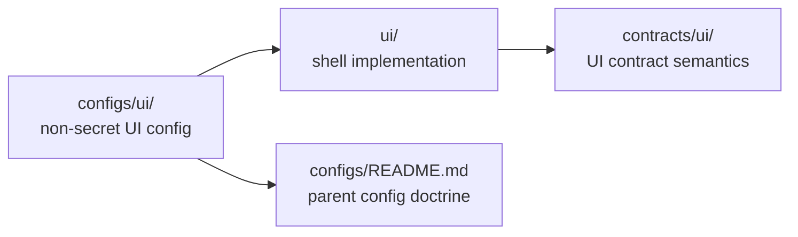

<!-- [KFM_META_BLOCK_V2]
doc_id: kfm://doc/TODO-assign-uuid
title: configs/ui/
type: standard
version: v1
status: draft
owners: @bartytime4life
created: TODO: verify original creation date
updated: 2026-04-29
policy_label: TODO: confirm public|restricted
related: [../README.md, ../../ui/README.md, ../../contracts/ui/README.md, ../security/README.md, ../observability/README.md, ../deployment/README.md, ../env/README.md]
tags: [kfm, configs, ui, non-secret, trust-visible]
notes: [doc_id policy_label and original created date require verification; this lane is currently a scaffold placeholder and should not be treated as proof of active runtime consumers]
[/KFM_META_BLOCK_V2] -->

<a id="top"></a>

# configs/ui/

Non-secret UI configuration lane for KFM shell presentation defaults and trust-visible UX wiring.

> [!IMPORTANT]
> **Status:** experimental  
> **Owners:** `@bartytime4life` (**NEEDS VERIFICATION** against target-branch ownership files)  
> **Path:** `configs/ui/README.md`  
> **Scope posture:** repo-visible, non-secret configuration only  
> **Evidence posture:** lane is currently README-only scaffold (no confirmed substantive config files in this directory yet)
>
> 
> 
> 
> 
> 

**Quick jumps:** [Scope](#scope) · [Repo fit](#repo-fit) · [Accepted inputs](#accepted-inputs) · [Exclusions](#exclusions) · [Directory tree](#directory-tree) · [Usage](#usage) · [Diagram](#diagram) · [Task list](#task-list)

---

## Scope

This lane holds **declarative, non-secret UI config** that influences shell behavior (for example visibility defaults, non-sensitive feature toggles, rendering defaults, and trust-cue presentation guidance).

It is intentionally subordinate to:

- UI implementation code in [`../../ui/README.md`](../../ui/README.md).
- UI contract semantics in [`../../contracts/ui/README.md`](../../contracts/ui/README.md).
- Parent configuration doctrine in [`../README.md`](../README.md).

## Repo fit

| Field | Value |
| --- | --- |
| Directory | `configs/ui/` |
| Upstream doctrine | `configs/README.md` |
| Primary downstream consumers | UI surfaces (exact runtime consumers **NEEDS VERIFICATION**) |
| Current branch state | README scaffold only (**CONFIRMED** from local tree inspection) |
| Relationship to other config lanes | Works alongside `configs/env/`, `configs/deployment/`, `configs/observability/`, and `configs/security/` |

## Accepted inputs

Files belong here when all conditions are true:

1. **Non-secret:** no credentials, tokens, private keys, or secret-bearing endpoints.
2. **UI-facing:** directly affects shell/display behavior rather than backend policy enforcement.
3. **Reviewable:** clear consumer and rollback path are documented.
4. **Config-only:** declarative settings, not executable UI logic.

### Typical examples (PROPOSED)

- Theme and display defaults that do not alter evidence/policy truth.
- Non-sensitive panel visibility or UX affordance toggles.
- Trust-cue display defaults (labels, chips, badges) when the semantics are already defined elsewhere.
- UI environment variable mapping references without secret values.

## Exclusions

Do **not** place the following here:

- Secrets or secret material (store in host-local or platform secret systems).
- Policy decisions/policy code (belongs under policy lanes).
- Contract/schema authority (belongs under contracts/schemas lanes).
- UI implementation code (belongs under `ui/` or app packages).
- Lifecycle data objects (RAW/WORK/PROCESSED/CATALOG/PUBLISHED artifacts).

## Directory tree

```text
configs/ui/
└── README.md   # this lane contract (current scaffold)
```

Diagram omitted — NEEDS VERIFICATION for concrete runtime consumer graph once substantive files are added.

## Usage

When adding a new file in this lane:

1. Declare the consumer (`ui/<surface>` or `apps/<ui-app>`).
2. State the exact behavior impacted.
3. Link the validator (lint/test/check/manual review).
4. Document rollback instructions in-file or in a sibling note.
5. Confirm the file remains non-secret.

## Diagram


```mermaid
flowchart LR
  CUI["configs/ui/<br/>non-secret UI config"] --> UI["ui/<br/>shell implementation"]
  CUI --> CRoot["configs/README.md<br/>parent config doctrine"]
  UI --> CContracts["contracts/ui/<br/>UI contract semantics"]
```

## Task list

- [ ] Confirm lane owners from branch-local ownership files (**NEEDS VERIFICATION**).
- [ ] Replace placeholder `doc_id` and `created` metadata with confirmed values.
- [ ] Add first substantive config file with explicit consumer + validator + rollback note.
- [ ] Link this README from any active UI config loader documentation when present.

<p align="right"><a href="#top">Back to top ↑</a></p>
