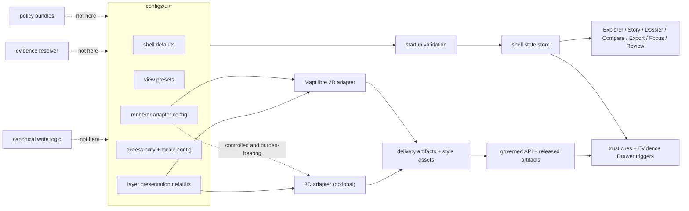

<!-- [KFM_META_BLOCK_V2]
doc_id: kfm://doc/<NEEDS-UUID>
title: UI Configuration
type: standard
version: v1
status: draft
owners: <NEEDS VERIFICATION>
created: YYYY-MM-DD
updated: YYYY-MM-DD
policy_label: <NEEDS VERIFICATION>
related: [<NEEDS VERIFICATION: ../README.md>, <NEEDS VERIFICATION: ../../apps/explorer-web/README.md>, <NEEDS VERIFICATION: ../../styles/README.md>, <NEEDS VERIFICATION: ../../contracts/README.md>]
tags: [kfm, ui, config, maplibre, shell]
notes: [Target file requested at configs/ui/README.md; configs/ is source-grounded, but configs/ui/ subtree, owners, and related-path exactness require mounted repo verification.]
[/KFM_META_BLOCK_V2] -->

# UI Configuration

Declarative, reviewable UI wiring for the KFM shell, renderer adapters, trust-visible presentation defaults, and accessibility-safe surface behavior.

> **Status:** experimental · **Doc state:** draft · **Owners:** `<NEEDS VERIFICATION>`  
>       
> **Quick jump:** [Scope](#scope) · [Repo fit](#repo-fit) · [Inputs](#accepted-inputs) · [Exclusions](#exclusions) · [Directory tree](#directory-tree-proposed) · [Quickstart](#quickstart) · [Config domains](#config-domains) · [Diagram](#diagram) · [Gates](#change-gates-definition-of-done) · [FAQ](#faq) · [Appendix](#appendix)

> [!IMPORTANT]
> `configs/ui/` exists to express **UI wiring and presentation defaults**. It must not become a side door for policy, canonical-write logic, evidence resolution, secrets, or hidden admin behavior.

> [!WARNING]
> The file shape below is a **PROPOSED starter contract** for `configs/ui/`. The March 2026 source corpus confirms the broader `configs/` family and KFM’s UI/configuration boundaries, but the mounted repo tree was not directly visible in this session. Treat exact filenames, owners, and neighboring paths as **NEEDS VERIFICATION**.

---

## Scope

This directory should hold **non-secret, reviewable, declarative UI configuration** for the KFM shell.

That includes shell-level defaults, renderer adapter settings, view presets, layer-presentation defaults, accessibility and motion behavior, locale/display conventions, and other UI-facing configuration that can be validated early at process start.

It does **not** own KFM doctrine. It does **not** decide what is publishable, what is authoritative, or what evidence means. It only helps the UI present already-governed data and already-governed state in a consistent way.

### What this directory is for

- keeping shell wiring explicit
- keeping renderer choices subordinate to shell law
- keeping trust cues visible and consistent
- keeping UI behavior configurable without changing doctrine
- keeping presentation settings reviewable in Git

### What this directory is not for

- silent policy overrides
- data-admission rules
- evidence-resolution logic
- secrets
- hidden feature toggles that weaken trust posture

[Back to top](#ui-configuration)

---

## Repo fit

**Target path:** `configs/ui/README.md`  
**Directory family:** `configs/`  
**Audience:** UI engineers, app engineers, configuration maintainers, policy/security reviewers, and docs maintainers

### Path placement

| Item | Value | Status |
|---|---|---|
| Target README path | `configs/ui/README.md` | **PROPOSED** target path requested for this task |
| Parent directory family | `configs/` | **CONFIRMED** directory family in project documentation |
| `configs/ui/` subtree existence | Needs mounted repo verification | **NEEDS VERIFICATION** |
| Main runtime consumer | KFM shell / explorer web app | **PROPOSED** |
| Closest doctrine neighbors | package-boundary docs, route-family docs, styles registry, contracts | **PROPOSED / INFERRED** |

### Upstream and downstream references

| Relationship | Path | Status | Why it matters |
|---|---|---:|---|
| Parent config family | [`../`](../) | NEEDS VERIFICATION | This README should align with broader config conventions. |
| Primary shell consumer | [`../../apps/explorer-web/`](../../apps/explorer-web/) | PROPOSED | The March 2026 manuals point to a map-first explorer shell as the main UI runtime. |
| Alternate/legacy UI surface | [`../../apps/ui/`](../../apps/ui/) | INFERRED | Secondary repo-shape material mentions `apps/ui`; mounted reality still needs checking. |
| Contracts boundary | [`../../contracts/`](../../contracts/) | PROPOSED | UI config should reference schemas and payload contracts, not replace them. |
| Styles and portrayal | [`../../styles/`](../../styles/) | PROPOSED | Renderer/style assets should remain explicit neighbors, not be hidden inside app code. |
| Docs for boundaries | [`../../docs/`](../../docs/) | PROPOSED | Package and route-family rules should stay near the repo center. |

### Why this path fits KFM

KFM’s March 2026 architecture sources consistently separate:

- **shell** from **renderer**
- **configuration** from **governance logic**
- **delivery/style assets** from **canonical truth**
- **public surface behavior** from **policy enforcement**

A UI-specific config directory fits that boundary model well, as long as it remains declarative, validated, non-secret, and non-authoritative.

[Back to top](#ui-configuration)

---

## Accepted inputs

Use this directory for UI-facing inputs that are safe to review, validate, and version in Git.

| Accepted input | What belongs here | Typical examples | Status |
|---|---|---|---|
| Shell defaults | Default surface mode, persistent layout behavior, trust cue visibility | default surface, panel layout, initial map/timeline behavior | **CONFIRMED fit** |
| Renderer adapter config | Renderer selection and non-secret adapter knobs | MapLibre default, controlled 3D toggle, interaction caps | **CONFIRMED fit** |
| View presets | Surface-specific presentation defaults | Explorer, Story, Compare, Dossier, Focus view presets | **PROPOSED fit** |
| Layer presentation defaults | Ordering, visibility, legend behavior, opacity defaults | initial visible layers, grouped legends, compare mode layer pairing | **PROPOSED fit** |
| Accessibility config | Reduced motion, keyboard hints, focus outline policy, contrast-safe toggles | motion behavior, keyboard affordance visibility | **CONFIRMED fit** |
| Locale/display config | Locale-safe formatting and display presets | date/time display, measurement display conventions, BCP 47 locale keys | **PROPOSED fit** |
| Trust-cue display config | How release state, correction state, and evidence affordances are shown | chips, banners, drawer triggers, scope echo placement | **CONFIRMED fit** |
| Non-secret feature flags | UI-only rollout controls that do not weaken doctrine | gated panel visibility, layout experiments, staged compare tools | **PROPOSED fit** |

### Good input characteristics

A good `configs/ui/` input is:

- declarative
- non-secret
- schema-validatable
- easy to diff
- easy to roll back
- incapable of bypassing governed APIs or policy

[Back to top](#ui-configuration)

---

## Exclusions

These items do **not** belong in `configs/ui/`.

| Not here | Put it in instead | Why |
|---|---|---|
| Source admission rules | contracts / source registry / policy bundles | Admission is trust-bearing law, not UI wiring. |
| Canonical write logic | workers / canonical-model packages | Browser-facing config must not own authoritative mutation. |
| Evidence resolution logic | governed API / resolver packages | The Evidence Drawer displays resolution results; it does not compute them here. |
| Policy reasons and obligations | policy bundles / governed API decisions | UI config may render them, but must not define them. |
| Secrets, tokens, private endpoints | secret store / env references | Client-visible or committed UI config must remain non-secret. |
| Hidden admin or steward bypasses | governed API + review surface | KFM rejects alternate truth systems hidden behind convenience paths. |
| Domain truth objects | canonical stores / catalogs / released artifacts | UI config points at truth-bearing artifacts; it is not one. |
| Arbitrary model/runtime selection from the browser | governed API adapters and server-side allow-lists | Bounded synthesis must remain behind governed interfaces. |
| Renderer-specific business meaning | contracts, metadata, governed payloads | The renderer should not become the authority layer. |

> [!NOTE]
> A useful rule of thumb: if changing a file in `configs/ui/` would alter publication state, evidence admissibility, or rights enforcement, the file is probably in the wrong directory.

[Back to top](#ui-configuration)

---

## Directory tree (proposed)

The following is a **starter shape**, not a confirmed mounted inventory.

```text
configs/
└── ui/
    ├── README.md
    ├── ui.schema.json
    ├── shell.defaults.yaml
    ├── feature-flags.yaml
    ├── trust-cues.yaml
    ├── views/
    │   ├── explorer.yaml
    │   ├── dossier.yaml
    │   ├── story.yaml
    │   ├── compare.yaml
    │   ├── export.yaml
    │   └── focus.yaml
    ├── renderers/
    │   ├── maplibre.yaml
    │   └── controlled-3d.yaml
    ├── layers/
    │   ├── explorer.layers.yaml
    │   ├── story.layers.yaml
    │   └── compare.layers.yaml
    ├── accessibility/
    │   ├── motion.yaml
    │   ├── keyboard.yaml
    │   └── contrast.yaml
    └── locales/
        └── en-US.yaml
```

### Suggested file roles

| File / folder | Purpose | Notes |
|---|---|---|
| `ui.schema.json` | Validation contract for the directory | Validate early at process start. |
| `shell.defaults.yaml` | Global shell defaults | Must remain non-secret and environment-safe. |
| `trust-cues.yaml` | Display defaults for release/correction/evidence cues | Renders trust state; does not define it. |
| `views/` | Surface-local defaults | Explorer, Story, Compare, Export, Focus, Dossier. |
| `renderers/maplibre.yaml` | MapLibre adapter config | 2D-first default path. |
| `renderers/controlled-3d.yaml` | Controlled 3D opt-in config | Keep separate and burden-bearing. |
| `layers/` | Layer ordering/presentation defaults | No truth semantics here. |
| `accessibility/` | Motion, keyboard, contrast behavior | Treat as structural, not polish. |
| `locales/` | Locale/display conventions | Keep display formatting explicit. |

[Back to top](#ui-configuration)

---

## Quickstart

This section shows a **minimal starter pattern** for treating UI config as a validated input at boot, not as an ad hoc runtime surprise.

### 1) Declare one reviewable shell config

```yaml
# configs/ui/shell.defaults.yaml
shell:
  defaultSurface: explorer
  preserveScopeAcrossModes: true
  showEvidenceDrawer: true
  showReleaseState: true
  showCorrectionState: true

renderer:
  primary: maplibre
  allowControlled3D: false

trustCues:
  releaseChip: true
  correctionChip: true
  generalizedBanner: true
  staleBanner: true

accessibility:
  reducedMotion: respect-system
  keyboardHints: true
  persistentFocusOutline: true
```

### 2) Validate it before UI boot

```ts
// illustrative starter example
import fs from "node:fs";
import path from "node:path";

type UiConfig = {
  shell: {
    defaultSurface: "explorer" | "story" | "compare" | "focus" | "review" | "dossier" | "export";
    preserveScopeAcrossModes: boolean;
    showEvidenceDrawer: boolean;
    showReleaseState: boolean;
    showCorrectionState: boolean;
  };
  renderer: {
    primary: "maplibre";
    allowControlled3D: boolean;
  };
};

function readUiConfig(filePath: string): UiConfig {
  const raw = fs.readFileSync(filePath, "utf8");

  // Replace this with the repo's actual schema-validation entrypoint.
  // The important rule is: validate before boot, fail closed on invalid config.
  const parsed = JSON.parse(JSON.stringify(require("yaml").parse(raw))) as UiConfig;

  if (parsed.renderer.primary !== "maplibre") {
    throw new Error("Unsupported primary renderer in starter contract.");
  }

  return parsed;
}

const configPath = path.resolve(process.cwd(), "configs/ui/shell.defaults.yaml");
const uiConfig = readUiConfig(configPath);

export default uiConfig;
```

### 3) Keep renderer wiring separate from shell law

```ts
// illustrative starter example
import uiConfig from "../configs/ui";

export function createRendererAdapter() {
  if (uiConfig.renderer.primary !== "maplibre") {
    throw new Error("Only MapLibre is supported in the default path.");
  }

  return {
    kind: "maplibre",
    allowControlled3D: uiConfig.renderer.allowControlled3D,
  };
}
```

> [!TIP]
> The boot rule is simple: **invalid UI config should fail fast**, and **valid UI config should still be incapable of weakening doctrine**.

[Back to top](#ui-configuration)

---

## Usage

### Boot-time usage

Use `configs/ui/` to make shell behavior explicit at application start:

- which surface opens first
- whether Evidence Drawer affordances are always present
- how release/correction chips are displayed
- whether reduced motion follows the system setting
- which renderer adapter is the default path

### Runtime usage

Use this directory to drive UI behavior that is:

- presentational
- declarative
- easy to inspect
- consistent across surfaces

Examples:

- Explorer and Story using the same trust-cue rules
- Compare mode preserving separate support notes for side A and side B
- Focus mode inheriting shell scope echoes rather than inventing them
- Export preview surfacing which cues remain attached

### What runtime code should *not* do

Runtime code should not quietly “help” by:

- switching to unpublished scope
- hiding stale/generalized/correction state
- reordering trust cues only for cosmetic convenience
- binding directly to canonical stores
- embedding secrets or policy logic into frontend configuration

[Back to top](#ui-configuration)

---

## Config domains

| Domain | Should define | Must not define | Primary consumer |
|---|---|---|---|
| Shell | Mode defaults, panel layout, trust affordance presence | Publication law, evidence meaning | Shell app |
| Renderer | Adapter selection, safe non-secret knobs | Authority over truth objects | Renderer adapter |
| Views | Per-surface layout defaults | Hidden role escalation | Explorer / Story / Compare / Focus / Review |
| Layers | Ordering, visibility, grouping, legend defaults | Canonical metadata truth | Layer manager / map runtime |
| Trust cues | Display defaults for chips, banners, drawer triggers | Reason/obligation semantics | Shared UI state |
| Accessibility | Reduced motion, keyboard affordances, focus behavior | Security or policy exceptions | All surfaces |
| Locales | Display formatting and locale handling | Domain-level temporal semantics | Formatting layer |
| Feature flags | UI-only staged rollout | Backdoor policy, rights, or evidence changes | App boot + shell store |

[Back to top](#ui-configuration)

---

## Diagram


```mermaid
flowchart LR
    subgraph C["configs/ui/*"]
        A["shell defaults"]
        B["view presets"]
        D["renderer adapter config"]
        E["accessibility + locale config"]
        F["layer presentation defaults"]
    end

    C --> V["startup validation"]
    V --> S["shell state store"]
    S --> X["Explorer / Story / Dossier / Compare / Export / Focus / Review"]
    S --> T["trust cues + Evidence Drawer triggers"]

    D --> M["MapLibre 2D adapter"]
    D -. controlled and burden-bearing .-> Z["3D adapter (optional)"]

    F --> M
    F --> Z

    M --> Y["delivery artifacts + style assets"]
    Z --> Y
    Y --> G["governed API + released artifacts"]

    G --> T

    P["policy bundles"] -. not here .-> C
    R["evidence resolver"] -. not here .-> C
    W["canonical write logic"] -. not here .-> C
```

### Reading the diagram

The key idea is not complexity. It is **boundary clarity**:

- `configs/ui/*` feeds validated shell and renderer wiring
- the shell owns persistent UX continuity
- the renderer consumes delivery artifacts and style assets
- governed APIs and released artifacts remain downstream truth-bearing inputs
- policy, evidence resolution, and canonical writes stay outside this directory

[Back to top](#ui-configuration)

---

## Change gates (definition of done)

A change in `configs/ui/` is ready only when the following are true:

- [ ] The change remains **non-secret** and safe to review in Git.
- [ ] A schema or typed validation contract exists, or the existing one is updated.
- [ ] Boot-time validation behavior is documented.
- [ ] No policy logic, evidence-resolution logic, or canonical-write behavior was introduced.
- [ ] Trust cues remain visible across the affected surfaces.
- [ ] Reduced-motion and keyboard behavior were reviewed if the change affects interaction.
- [ ] Any new renderer behavior preserves shell-vs-renderer separation.
- [ ] Any new 3D-related toggle references a burden review and does **not** become the default path.
- [ ] Any new feature flag includes rollback intent and does not weaken doctrine.
- [ ] Adjacent docs are updated if the change affects route families, view taxonomy, or package boundaries.

### Merge blockers worth enforcing

| Gate | Why it matters |
|---|---|
| Schema validation | Invalid config must fail before UI boot. |
| No-secrets check | UI config must stay reviewable and non-sensitive. |
| Forbidden-import / boundary lint | Prevent frontend convenience from importing trust-bearing write logic. |
| Visual regression on trust cues | Release/correction/evidence cues must survive UI changes. |
| Accessibility regression | Keyboard continuity and reduced motion are structural obligations. |

[Back to top](#ui-configuration)

---

## FAQ

### Can this directory store API keys, tokens, or private endpoints?

No. Secrets belong in secret stores or environment references, not in committed UI config.

### Can this directory define why publication was allowed or denied?

No. It may render reasons and obligations, but those belong to policy bundles and governed API decisions.

### Can this directory decide which data is authoritative?

No. It may reference released artifacts and presentation defaults, but authoritative truth remains outside the UI config boundary.

### Can this directory turn 3D on by default?

Not in the default KFM posture. 2D remains the normal operating surface; any 3D path is controlled, explicit, and burden-bearing.

### Can this directory hide correction state for cleaner screenshots?

No. KFM treats correction visibility as part of trust, not optional chrome.

[Back to top](#ui-configuration)

---

## Appendix

<details>
<summary>Illustrative naming rules, review hints, and anti-patterns</summary>

### Naming rules

| Pattern | Use |
|---|---|
| `*.schema.json` | validation contracts |
| `*.defaults.yaml` | default non-secret values |
| `views/*.yaml` | per-surface presentation defaults |
| `renderers/*.yaml` | adapter-specific runtime config |
| `accessibility/*.yaml` | motion, keyboard, contrast, focus rules |
| `locales/*.yaml` | locale/display conventions |

### Review hints

When reviewing a UI config change, ask:

1. Does this file change presentation only, or is it trying to smuggle in governance?
2. If this config is wrong, does the app fail early or drift quietly?
3. Would a screenshot still preserve enough scope, time, and trust context after this change?
4. Did the change make the shell clearer, or merely more decorative?
5. If this renderer/tool were replaced, would the public contract remain stable?

### Anti-patterns to reject

- storing secrets in UI config
- embedding evidence-resolution logic in renderer config
- hiding release or correction state for visual neatness
- allowing feature flags to weaken cite-or-abstain behavior
- making renderer settings the source of domain truth
- letting 3D spectacle outrank inspectability
- environment-specific toggles that silently change trust behavior

</details>

[Back to top](#ui-configuration)
