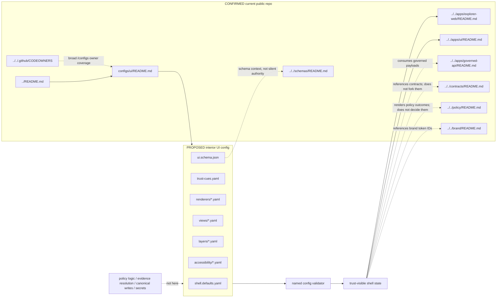

<!-- [KFM_META_BLOCK_V2]
doc_id: kfm://doc/<NEEDS-UUID>
title: UI Configuration
type: standard
version: v1
status: draft
owners: @bartytime4life
created: YYYY-MM-DD
updated: YYYY-MM-DD
policy_label: <NEEDS VERIFICATION>
related: [../README.md, ../../apps/explorer-web/README.md, ../../apps/ui/README.md, ../../apps/governed-api/README.md, ../../contracts/README.md, ../../policy/README.md, ../../schemas/README.md, ../../brand/README.md, ../../.github/CODEOWNERS]
tags: [kfm, ui, config, maplibre, shell, trust-visible]
notes: [doc_id created updated and policy_label require repo-history or governance verification; current public main confirms configs/ui/ is README-led; proposed interior files below require consumer wiring and validation before merge; ../../styles/README.md is not a current public repo path.]
[/KFM_META_BLOCK_V2] -->

# UI Configuration

Declarative, reviewable UI wiring for the KFM shell, renderer adapters, trust-visible presentation defaults, and accessibility-safe surface behavior.

> **Status:** experimental · **Doc state:** draft · **Owners:** `@bartytime4life` *(confirmed only at broad `/configs/` CODEOWNERS scope; narrower `/configs/ui/` ownership remains **NEEDS VERIFICATION**)*  
>        
> **Repo fit:** `configs/ui/README.md` · parent [`../README.md`](../README.md) · shell consumer [`../../apps/explorer-web/README.md`](../../apps/explorer-web/README.md) · governed boundary [`../../apps/governed-api/README.md`](../../apps/governed-api/README.md) · contract/policy/schema context [`../../contracts/README.md`](../../contracts/README.md), [`../../policy/README.md`](../../policy/README.md), [`../../schemas/README.md`](../../schemas/README.md) · identity neighbor [`../../brand/README.md`](../../brand/README.md)  
> **Quick jump:** [Scope](#scope) · [Repo fit](#repo-fit) · [Accepted inputs](#accepted-inputs) · [Exclusions](#exclusions) · [Directory tree](#directory-tree) · [Quickstart](#quickstart) · [Usage](#usage) · [Config domains](#config-domains) · [Diagram](#diagram) · [Current public inventory](#current-public-inventory) · [Gates](#change-gates--definition-of-done) · [FAQ](#faq) · [Appendix](#appendix)

> [!IMPORTANT]
> `configs/ui/` is currently a **README-led public subtree**. This document therefore separates **CONFIRMED public inventory** from **PROPOSED interior configuration shape**.

> [!WARNING]
> `configs/ui/` must never become a side door for policy, evidence resolution, canonical writes, secrets, model-runtime selection, or hidden steward-only behavior.

---

## Scope

`configs/ui/` is the repo-visible home for **non-secret, shell-facing UI configuration**.

In KFM, that means making shell behavior legible in Git without letting frontend convenience quietly redefine truth. UI config may help the product present already-governed state. It must not decide what is true, what is publishable, what is sensitive, what evidence is admissible, or what policy allows.

### Truth posture used here

| Label | How it applies in this README |
| --- | --- |
| **CONFIRMED** | `configs/ui/README.md` exists on public `main`; the parent `configs/` lane exists; adjacent repo lanes named in this README are visible enough to link as current public docs or directories. |
| **INFERRED** | `configs/ui/` is intended to hold non-secret UI/runtime configuration consumed by governed UI surfaces. |
| **PROPOSED** | Interior files such as `ui.schema.json`, `shell.defaults.yaml`, `trust-cues.yaml`, view presets, renderer presets, or accessibility defaults. |
| **UNKNOWN** | Actual runtime loader paths, validator commands, CI enforcement depth, package-level consumers, and deployed behavior. |
| **NEEDS VERIFICATION** | `doc_id`, created/updated dates, policy label, and any narrower owner split below broad `/configs/` ownership. |

### What this directory is for

Use this lane to keep UI-facing behavior:

- declarative
- non-secret
- reviewable in Git
- schema-validatable before runtime use
- subordinate to governed APIs, contracts, policy, evidence, and release state
- consistent across Explorer, Story, Dossier, Compare, Export, Focus, and Review surfaces

### What this directory is not for

Do **not** use `configs/ui/` for:

- silent policy overrides
- source-admission rules
- evidence-resolution logic
- canonical-write behavior
- secrets or private endpoints
- unrestricted feature flags
- browser-side model/runtime authority
- renderer-specific domain truth
- hidden admin or steward bypasses

[Back to top](#ui-configuration)

---

## Repo fit

### Path placement

| Item | Value | Status |
| --- | --- | --- |
| Target README path | `configs/ui/README.md` | **CONFIRMED** on public `main` |
| Parent directory family | `configs/` | **CONFIRMED** |
| Current visible subtree inventory | `README.md` only | **CONFIRMED** |
| Owner coverage | [`../../.github/CODEOWNERS`](../../.github/CODEOWNERS) | **CONFIRMED** broad `/configs/` rule to `@bartytime4life`; narrower `/configs/ui/` split is **NEEDS VERIFICATION** |
| Primary shell consumer doc | [`../../apps/explorer-web/README.md`](../../apps/explorer-web/README.md) | **CONFIRMED** doc exists; runtime wiring remains **UNKNOWN** |
| Secondary UI boundary | [`../../apps/ui/README.md`](../../apps/ui/README.md) | **CONFIRMED** README-led path exists; active runtime ownership remains **NEEDS VERIFICATION** |
| Governed backend boundary | [`../../apps/governed-api/README.md`](../../apps/governed-api/README.md) | **CONFIRMED** doc exists |
| Contract boundary | [`../../contracts/README.md`](../../contracts/README.md) | **CONFIRMED** parent lane exists with child surfaces |
| Policy boundary | [`../../policy/README.md`](../../policy/README.md) | **CONFIRMED** parent lane exists with child surfaces |
| Schema authority context | [`../../schemas/README.md`](../../schemas/README.md) | **CONFIRMED** parent lane exists; schema-home authority questions remain visible |
| Identity / presentation neighbor | [`../../brand/README.md`](../../brand/README.md) | **CONFIRMED** current public identity lane exists |
| `../../styles/README.md` | not a current public path | **CONFIRMED ABSENT** at time of this revision |

### Upstream and downstream links

| Relationship | Path | Why it matters |
| --- | --- | --- |
| Parent config lane | [`../README.md`](../README.md) | Defines the broader non-secret configuration boundary. |
| Runtime shell boundary | [`../../apps/explorer-web/README.md`](../../apps/explorer-web/README.md) | Describes the persistent, map-first shell that would consume UI defaults. |
| Secondary UI boundary | [`../../apps/ui/README.md`](../../apps/ui/README.md) | Keeps placeholder/UI-root ambiguity visible instead of inventing runtime ownership. |
| Governed API boundary | [`../../apps/governed-api/README.md`](../../apps/governed-api/README.md) | UI config must stay downstream of governed payloads. |
| Contract boundary | [`../../contracts/README.md`](../../contracts/README.md) | UI config may reference machine law, but must not copy or replace it. |
| Policy boundary | [`../../policy/README.md`](../../policy/README.md) | Reasons, obligations, deny/allow outcomes, and review semantics stay in policy. |
| Schema context | [`../../schemas/README.md`](../../schemas/README.md) | UI validation may reference schemas, but this README does not settle schema-home authority. |
| Brand / identity neighbor | [`../../brand/README.md`](../../brand/README.md) | Shared logos, seals, icons, tokens, and templates stay outside UI wiring. |
| Review ownership | [`../../.github/CODEOWNERS`](../../.github/CODEOWNERS) | Owner badge is grounded at broad parent-lane scope only. |
| Adjacent doctrine / ADRs | [`../../docs/`](../../docs/) | Route families, ADRs, runbooks, and long-form doctrine belong there. |

### Why this path fits KFM

KFM doctrine consistently separates:

- **shell** from **renderer**
- **configuration** from **governance logic**
- **delivery / portrayal assets** from **canonical truth**
- **public surface behavior** from **policy enforcement**
- **bounded synthesis** from **model-owned truth**

That makes `configs/ui/` a good home for shell defaults, renderer adapter knobs, trust-cue display settings, view presets, and accessibility-safe behavior — as long as the directory remains declarative, non-secret, validated early, and subordinate to stronger seams.

> [!NOTE]
> A dedicated root-level `styles/` lane is not a current public repo fact. If one is introduced later, add the lane and this README link in the same change stream.

[Back to top](#ui-configuration)

---

## Accepted inputs

Use this directory for **UI-facing inputs that are safe to review, validate, and version in Git**.

| Accepted input | What belongs here | Typical examples | Current posture |
| --- | --- | --- | --- |
| Shell defaults | Surface mode, panel behavior, trust-cue visibility | default surface, panel layout, map/timeline defaults | **PROPOSED file class** |
| Renderer adapter config | Renderer selection and non-secret adapter knobs | MapLibre default, controlled 3D toggle, interaction caps | **PROPOSED file class** |
| View presets | Surface-specific presentation defaults | Explorer, Story, Compare, Dossier, Focus, Export presets | **PROPOSED file class** |
| Layer presentation defaults | Ordering, grouping, legend behavior, opacity defaults | default visibility, legend grouping, compare pairings | **PROPOSED file class** |
| Accessibility config | Reduced motion, keyboard hints, focus behavior, contrast-safe toggles | motion policy, focus outlines, keyboard affordance hints | **PROPOSED file class** |
| Locale / display config | Locale-safe display presets | BCP 47 locale keys, number/date display choices | **PROPOSED file class** |
| Trust-cue display config | How release, correction, generalization, freshness, and evidence affordances render | chips, banners, drawer triggers, scope echo placement | **PROPOSED file class** |
| Non-secret feature flags | UI-only rollout controls that do not weaken doctrine | panel experiments, staged compare tools | **PROPOSED file class** |
| Theme / token references | References to already-governed brand tokens or presentation IDs | theme keys, density presets, token names | **INFERRED fit** |

### Good input characteristics

A good `configs/ui/` input is:

- explicit about its consumer
- incapable of bypassing governed APIs or policy
- deterministic enough to diff and roll back
- typed or schema-validatable
- safe to expose in a public repository
- written so wrong config fails early rather than drifting quietly

[Back to top](#ui-configuration)

---

## Exclusions

These items do **not** belong in `configs/ui/`.

| Not here | Put it in instead | Why |
| --- | --- | --- |
| Source admission rules | [`../../contracts/README.md`](../../contracts/README.md) + [`../../policy/README.md`](../../policy/README.md) | Admission is trust-bearing law, not UI wiring. |
| Canonical write logic | governed backend / worker packages | Browser-facing config must not own authoritative mutation. |
| Evidence resolution logic | [`../../apps/governed-api/README.md`](../../apps/governed-api/README.md) or resolver packages | The Evidence Drawer renders results; it does not compute them here. |
| Policy reasons and obligations | [`../../policy/README.md`](../../policy/README.md) | UI config may render outcomes, but must not define allow/deny semantics. |
| Secrets, tokens, private endpoints | host-local secret files or secret manager surfaces | Committed UI config must remain non-secret. |
| Shared logos, icons, seals, raw identity assets | [`../../brand/README.md`](../../brand/README.md) | Identity assets and tokens stay distinct from shell wiring. |
| Hidden admin or steward bypasses | governed API + role-gated review surfaces | KFM rejects alternate truth systems hidden behind convenience paths. |
| Domain truth objects | canonical stores, catalogs, released artifacts | UI config may point at truth-bearing artifacts; it is not one. |
| Browser-controlled model/runtime selection | server-side allow-lists and governed adapters | Bounded synthesis must stay behind governed interfaces. |
| Renderer-specific business meaning | contracts, metadata, governed payloads | A renderer setting should not become the authority layer. |

> [!CAUTION]
> If changing a file in `configs/ui/` would alter publication state, evidence admissibility, rights enforcement, review state, or deny/allow semantics, the file is probably in the wrong directory.

[Back to top](#ui-configuration)

---

## Directory tree

### Current public snapshot (**CONFIRMED**)

```text
configs/
├── README.md
├── env.schema.json
├── deployment/
│   └── README.md
├── env/
│   └── README.md
├── observability/
│   └── README.md
├── security/
│   └── README.md
└── ui/
    └── README.md
```

### Interior working shape (**PROPOSED starter pattern**)

The shape below is a review-ready starter structure, **not** current public inventory.

```text
configs/
└── ui/
    ├── README.md
    ├── ui.schema.json
    ├── shell.defaults.yaml
    ├── feature-flags.yaml
    ├── trust-cues.yaml
    ├── views/
    │   ├── explorer.yaml
    │   ├── dossier.yaml
    │   ├── story.yaml
    │   ├── compare.yaml
    │   ├── export.yaml
    │   └── focus.yaml
    ├── renderers/
    │   ├── maplibre.yaml
    │   └── controlled-3d.yaml
    ├── layers/
    │   ├── explorer.layers.yaml
    │   ├── story.layers.yaml
    │   └── compare.layers.yaml
    ├── accessibility/
    │   ├── motion.yaml
    │   ├── keyboard.yaml
    │   └── contrast.yaml
    └── locales/
        └── en-US.yaml
```

### Suggested file roles

| File / folder | Purpose | Review rule |
| --- | --- | --- |
| `ui.schema.json` | Validation contract for this directory | Introduce only with a named validator path. |
| `shell.defaults.yaml` | Global shell defaults | Must remain non-secret and environment-safe. |
| `trust-cues.yaml` | Display defaults for release/correction/evidence cues | Renders trust state; does not define trust meaning. |
| `views/` | Surface-local defaults | Explorer, Story, Compare, Export, Focus, Dossier. |
| `renderers/maplibre.yaml` | MapLibre adapter config | 2D-first default path. |
| `renderers/controlled-3d.yaml` | Controlled 3D opt-in config | Keep separate, explicit, and burden-bearing. |
| `layers/` | Layer ordering and presentation defaults | No source truth or evidence semantics here. |
| `accessibility/` | Motion, keyboard, contrast, and focus behavior | Treat as structural, not polish. |
| `locales/` | Locale/display conventions | Display formatting only; not temporal semantics. |

> [!TIP]
> Current public `main` does not expose any of the proposed files above. Create them only in the same change that adds a consumer, a validator, and reviewable examples.

[Back to top](#ui-configuration)

---

## Quickstart

This section shows the smallest trustworthy path for turning `configs/ui/` from README-led boundary into a real config surface.

### 1) Inspect the live lane before editing

```bash
find configs/ui -maxdepth 3 -type f | sort
find configs -maxdepth 2 -type d | sort
grep -n "/configs/" .github/CODEOWNERS || true
```

### 2) Trace likely consumers and trust cues

```bash
git grep -nE 'configs/ui|shell\.defaults|trustCues|allowControlled3D|reducedMotion|EvidenceDrawer|DecisionEnvelope|RuntimeResponseEnvelope' \
  apps web packages tests tools scripts 2>/dev/null || true
```

### 3) Add one non-secret starter file

> Illustrative starter example only: current public `main` does not yet expose this file.

```yaml
# configs/ui/shell.defaults.yaml
shell:
  defaultSurface: explorer
  preserveScopeAcrossModes: true
  showEvidenceDrawer: true
  showReleaseState: true
  showCorrectionState: true

renderer:
  defaultAdapter: maplibre
  controlled3d:
    enabled: false
    requiresDrawerParity: true

accessibility:
  respectReducedMotion: true
  preserveKeyboardFocus: true
```

### 4) Validate before runtime use

Use the repo’s actual validator once it exists. Until then, do not claim enforcement.

```bash
# PROPOSED validator shape; replace with the real command when mounted.
python tools/validators/config_ui/check_ui_config.py configs/ui
```

### 5) Re-run adjacent trust-boundary checks

```bash
sed -n '1,220p' configs/README.md
sed -n '1,220p' apps/explorer-web/README.md
sed -n '1,220p' apps/governed-api/README.md
sed -n '1,220p' contracts/README.md
sed -n '1,220p' policy/README.md
sed -n '1,220p' schemas/README.md
```

[Back to top](#ui-configuration)

---

## Usage

### Config should answer these questions

Use `configs/ui/` to make these choices reviewable:

- which surface opens first
- which renderer adapter is the default path
- whether Evidence Drawer affordances are always present
- how release, correction, freshness, and generalization cues appear
- whether reduced motion follows the system setting
- how view presets differ across Explorer, Story, Dossier, Compare, Export, Focus, and Review
- which UI-only experiments are enabled without weakening policy or evidence posture

### Runtime code should not quietly “help” by

- switching to unpublished scope
- hiding stale, generalized, restricted, or correction state
- reordering trust cues only for cosmetic convenience
- binding directly to canonical stores
- embedding policy logic in frontend conditionals
- storing restricted payloads in browser-local persistence
- treating renderer state as domain truth

### Working principle

UI config may control **how already-governed state is presented**.

It must not control **whether state is governed**.

[Back to top](#ui-configuration)

---

## Config domains

| Domain | Should define | Must not define | Primary consumer |
| --- | --- | --- | --- |
| Shell | Mode defaults, panel layout, trust affordance presence | Publication law, evidence meaning | shell app |
| Renderer | Adapter selection, safe non-secret knobs | Authority over truth objects | renderer adapter |
| Views | Per-surface layout defaults | Hidden role escalation | Explorer / Story / Compare / Focus / Review |
| Layers | Ordering, visibility, grouping, legend defaults | Canonical metadata truth | layer manager / map runtime |
| Trust cues | Display defaults for chips, banners, drawer triggers | Reason / obligation semantics | shared UI state |
| Accessibility | Reduced motion, keyboard affordances, focus behavior | Security or policy exceptions | all surfaces |
| Locales | Display formatting and locale handling | Domain-level temporal semantics | formatting layer |
| Feature flags | UI-only staged rollout | Backdoor policy, rights, or evidence changes | app boot + shell store |
| Theme / token references | IDs of already-governed tokens | raw asset source files or seal artwork | shell theme layer |

[Back to top](#ui-configuration)

---

## Diagram


```mermaid
flowchart LR
    subgraph CURRENT["CONFIRMED current public repo"]
        C["configs/ui/README.md"]
        P["../README.md"]
        E["../../apps/explorer-web/README.md"]
        U["../../apps/ui/README.md"]
        A["../../apps/governed-api/README.md"]
        K["../../contracts/README.md"]
        Y["../../policy/README.md"]
        Z["../../schemas/README.md"]
        B["../../brand/README.md"]
        O["../../.github/CODEOWNERS"]
    end

    subgraph PROPOSED["PROPOSED interior UI config"]
        S["shell.defaults.yaml"]
        T["trust-cues.yaml"]
        R["renderers/*.yaml"]
        V["views/*.yaml"]
        L["layers/*.yaml"]
        X["accessibility/*.yaml"]
        G["ui.schema.json"]
    end

    O -. broad /configs owner coverage .-> C
    P --> C
    C --> PROPOSED
    PROPOSED --> VALIDATE["named config validator"]
    VALIDATE --> SHELL["trust-visible shell state"]

    SHELL --> E
    SHELL --> U
    SHELL -. consumes governed payloads .-> A
    SHELL -. references contracts; does not fork them .-> K
    SHELL -. renders policy outcomes; does not decide them .-> Y
    G -. schema context, not silent authority .-> Z
    SHELL -. references brand token IDs .-> B

    DENY["policy logic / evidence resolution / canonical writes / secrets"] -. not here .-> PROPOSED
```

### Reading the diagram

The goal is not complexity. It is **boundary clarity**:

- `configs/ui/*` feeds validated shell and renderer wiring
- current public owner coverage is explicit only at broad `/configs/` scope
- the shell owns UX continuity, not evidence truth
- the UI stays downstream of governed API payloads
- contracts, policy, and schema authority remain stronger seams than config
- shared identity assets stay in `brand/`, not in ad hoc UI config files

[Back to top](#ui-configuration)

---

## Current public inventory

| Path | Current public state | Why it matters |
| --- | --- | --- |
| `configs/ui/README.md` | present | The UI config boundary exists as a doc surface. |
| Additional files under `configs/ui/` | not visible on public `main` | Interior filenames remain **PROPOSED**, not current fact. |
| `../env.schema.json` | present in parent `configs/`; current public content is placeholder-like | There is a config-schema naming precedent, but not proof of UI config validation. |
| `../../.github/CODEOWNERS` | global fallback plus `/configs/ @bartytime4life` | Owner badge is grounded at broad parent-lane scope only. |
| `../../apps/explorer-web/README.md` | present | Primary shell-boundary doc exists. |
| `../../apps/ui/README.md` | present; current public view is README-led | Secondary UI path exists, but active runtime ownership remains **NEEDS VERIFICATION**. |
| `../../apps/governed-api/README.md` | present | Governed runtime boundary is a real public lane. |
| `../../contracts/` | child lanes and README visible | Machine-law boundary exists and should remain separate. |
| `../../policy/` | child lanes and README visible | Policy is a decision lane; UI config may render outcomes, but must not own them. |
| `../../schemas/` | nested child lanes and README visible | Schema context is live enough to cite, but not settled enough for `configs/ui/` to become a schema authority. |
| `../../brand/` | asset, icon, logo, seal, template, token, and usage lanes visible | `brand/` is the closest confirmed identity/presentation neighbor. |
| `../../styles/README.md` | absent on public `main` | Do not link this as current fact until the lane exists. |

> [!NOTE]
> Absence of a public root-level `styles/` lane does not forbid one later. It only means this README must not pretend that the path already exists.

[Back to top](#ui-configuration)

---

## Change gates / definition of done

A change in `configs/ui/` is ready only when all applicable checks pass:

- [ ] The change remains non-secret and safe to review in Git.
- [ ] The file’s consumer is named.
- [ ] A schema or typed validation contract exists, or the PR explicitly explains why this change is documentation-only.
- [ ] The actual loader and validator path are documented before claiming runtime use.
- [ ] No policy logic, evidence-resolution logic, canonical-write behavior, or model-runtime authority was introduced.
- [ ] Trust cues remain visible across affected surfaces.
- [ ] Reduced-motion and keyboard behavior were reviewed if interaction changed.
- [ ] The change does not hide stale, generalized, restricted, correction, review, or release state.
- [ ] Relative links in this README still resolve from `configs/ui/`.
- [ ] Proposed interior paths are either created in the same PR or remain clearly marked **PROPOSED**.
- [ ] Rollback is simple: reverting the config restores prior presentation behavior without data mutation.

### Reviewer quick check

| Smell | Why it matters | Review response |
| --- | --- | --- |
| “This flag hides the evidence drawer for now” | Breaks inspectable-claim posture | Block unless explicitly non-claim-bearing and documented. |
| “Policy is easier to express in frontend config” | Moves decision authority into UI wiring | Move to `policy/` or governed backend. |
| “3D looks better, make it default” | Violates 2D-first / burden-bearing rule | Keep controlled 3D opt-in with drawer parity. |
| “This config points to a private endpoint” | Leaks secret-bearing runtime assumptions | Move to host-local secret/runtime config. |
| “We copied a schema here for convenience” | Creates authority drift | Reference `contracts/` or `schemas/`; do not fork. |

[Back to top](#ui-configuration)

---

## FAQ

### Is `configs/ui/` the source of UI truth?

No. It is a **configuration boundary** for reviewable, non-secret UI wiring. Governed services, contracts, policy, evidence bundles, release state, and canonical stores remain stronger truth surfaces.

### Can this directory define policy labels or obligations?

No. It may define how policy results are displayed, but the labels, reason codes, obligations, deny/allow logic, and review semantics belong in policy and contract surfaces.

### Can this directory turn 3D on by default?

Not in the default KFM posture. KFM remains 2D-first. Controlled 3D belongs behind explicit, burden-bearing configuration and must preserve drawer parity, audit cues, correction state, and the route back to 2D.

### Where should shared logos, icons, seals, and brand tokens live?

In [`../../brand/README.md`](../../brand/README.md). `configs/ui/` may reference token IDs or presentation keys, but should not absorb source assets or visual identity governance.

### Why is there no link to `../../styles/README.md`?

Because that path is not a current public repo fact. Add the link only when the lane exists.

### What happens if a UI config file is wrong?

The desired behavior is early failure through schema/validator checks, not quiet runtime drift. Until the actual validator path is present, this README must keep enforcement claims marked **PROPOSED** or **NEEDS VERIFICATION**.

[Back to top](#ui-configuration)

---

## Appendix

<details>
<summary>Illustrative naming rules, review hints, and anti-patterns</summary>

### Naming rules

| Pattern | Use |
| --- | --- |
| `*.schema.json` | validation contracts that follow existing config-schema naming practice |
| `*.defaults.yaml` | default non-secret values |
| `views/*.yaml` | per-surface presentation defaults |
| `renderers/*.yaml` | adapter-specific runtime config |
| `layers/*.yaml` | layer presentation defaults |
| `accessibility/*.yaml` | motion, keyboard, contrast, and focus rules |
| `locales/*.yaml` | locale/display conventions |

### Review hints

When reviewing a UI config change, ask:

1. Does this file change presentation only, or is it trying to smuggle in governance?
2. If this config is wrong, does the app fail early or drift quietly?
3. Would a screenshot still preserve enough scope, time, and trust context after this change?
4. Did the change make the shell clearer, or merely more decorative?
5. If this renderer or theme mechanism were replaced later, would the public contract remain stable?

### Anti-patterns to reject

- storing secrets in UI config
- embedding evidence-resolution logic in renderer config
- hiding release or correction state for visual neatness
- allowing feature flags to weaken cite-or-abstain behavior
- making renderer settings the source of domain truth
- copying schema law into app-local config files
- linking to nonexistent repo paths as though they were current fact
- letting 3D spectacle outrank inspectability

### If a dedicated portrayal or `styles/` lane appears later

1. Create the lane in the same PR that adds the link.
2. Move shared style JSON, sprites, glyph manifests, or asset-home docs there explicitly.
3. Keep `configs/ui/` reference-only for those assets unless a stronger reason is documented.

</details>

[Back to top](#ui-configuration)
