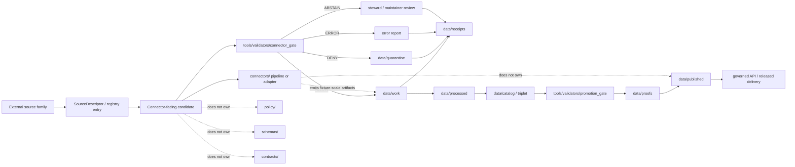

<!-- [KFM_META_BLOCK_V2]
doc_id: kfm://doc/NEEDS_VERIFICATION__connectors_readme
title: connectors/
type: standard
version: v1
status: draft
owners: @bartytime4life
created: NEEDS_VERIFICATION__YYYY-MM-DD
updated: NEEDS_VERIFICATION__YYYY-MM-DD
policy_label: NEEDS_VERIFICATION__public_safe_or_restricted
related: [../README.md, ../.github/CODEOWNERS, ../data/README.md, ../data/registry/README.md, ../contracts/README.md, ../schemas/README.md, ../policy/README.md, ../tools/validators/README.md, ../tools/validators/connector_gate/README.md, ./pipelines/README.md, ./pipelines/ecology/README.md]
tags: [kfm, connectors, source-admission, ingestion, source-descriptor, receipts, fail-closed]
notes: [doc_id, created date, updated date, policy label, link targets, active CODEOWNERS ownership, active-branch directory tree, connector scripts, validator wiring, source registry entries, and CI behavior need live repository verification. This README is an orientation and boundary contract. It is not proof that every connector, validator, workflow, live source path, or release path is implemented.]
[/KFM_META_BLOCK_V2] -->

<a id="top"></a>

# `connectors/`

Source-admission and connector-orientation surface for bringing external source families toward governed KFM work lanes **without bypassing evidence, policy, validation, receipts, review, or release controls**.


> [!NOTE]
> **Status:** `experimental` / `draft`  
> **Intended path:** `connectors/README.md`  
> **Owners:** `@bartytime4life` by broad fallback unless connector-specific CODEOWNERS verification says otherwise.  
> **Evidence mode:** README contract and orientation. Active implementation depth remains **NEEDS_VERIFICATION** until checked in the real repository.  
> **Repo fit:** parent README for source-facing connector stubs, no-network connector fixtures, and pipeline-oriented admission work before governed lifecycle handoff.

> [!IMPORTANT]
> `connectors/` is **not** a shortcut around KFM governance. A connector may observe, fetch, normalize, stage, or prepare source-facing candidates, but it does **not** make a source trusted, public, promoted, cited, policy-safe, or release-ready by itself.

> [!CAUTION]
> Do not place secrets, private endpoints, unpublished evidence, restricted exact locations, RAW captures, provider credentials, or direct model-runtime paths in this directory.

## Quick jumps

[Scope](#scope) · [Operating principles](#operating-principles) · [Repo fit](#repo-fit) · [Accepted inputs](#accepted-inputs) · [Exclusions](#exclusions) · [Directory expectations](#directory-expectations) · [Quickstart](#quickstart) · [Connector onboarding](#connector-onboarding) · [Validation and admission](#validation-and-admission) · [Lifecycle handoff](#lifecycle-handoff) · [Diagram](#diagram) · [Reference tables](#reference-tables) · [Security and sensitivity](#security-rights-and-sensitivity) · [Definition of Done](#definition-of-done) · [FAQ](#faq) · [Appendix](#appendix)

---

## Scope

`connectors/` is the **source-facing edge** of the KFM pipeline.

Use this directory to document and stage connector families that can eventually move source candidates toward the governed lifecycle:

```text
SOURCE EDGE
  → REGISTRY / DESCRIPTOR
  → CONNECTOR ADMISSION
  → WORK / QUARANTINE
  → PROCESSED
  → CATALOG / TRIPLET
  → PUBLISHED
```

A connector should make source acquisition repeatable, inspectable, bounded, and reversible. It should preserve source identity, source role, rights posture, cadence, spatial support, temporal support, validation expectations, sensitivity handling, and handoff targets before any downstream lane treats the result as evidence-bearing.

### What this README establishes

| Area | Truth posture | Rule |
|---|---:|---|
| Directory role | **PROPOSED operating contract** | `connectors/` is source-facing and upstream of normal data lifecycle handoff. |
| Implementation depth | **NEEDS_VERIFICATION** | This README does not claim live source connectors, CI gates, runtime maturity, or release behavior. |
| Source admission posture | **DOCTRINE-CONFIRMED** | Descriptor-first, rights-aware, policy-aware, fail-closed admission. |
| Publication boundary | **DOCTRINE-CONFIRMED** | Connector success is not publication success. |
| Evidence posture | **DOCTRINE-CONFIRMED** | Receipts, proofs, catalog closure, review state, and release state remain separate. |

### Non-goals

`connectors/` does not own source truth, canonical domain meaning, policy decisions, schema authority, publication, public API behavior, AI answers, or release promotion.

[Back to top](#top)

---

## Operating principles

These rules keep connector work useful without letting it weaken the KFM trust membrane.

| Principle | Operational meaning |
|---|---|
| **Descriptor first** | A source family should be named, role-labeled, rights-reviewed, and cadence-aware before live fetching or broad mirroring. |
| **Fixture first** | Start with tiny, public-safe, no-network fixtures and adversarial cases before provider-scale data. |
| **Validator first** | Connector admission must be able to return finite outcomes and reasons before downstream trust. |
| **Fail closed** | Unknown rights, unclear source role, missing policy label, sensitive exact location risk, or ambiguous handoff should block or hold. |
| **Receipts are not proofs** | Process memory belongs in receipt-shaped records; proof packs and release attestations are stronger downstream objects. |
| **No direct public path** | Public clients use governed APIs and released artifacts, not connector outputs, RAW, WORK, QUARANTINE, or unpublished candidates. |
| **No direct AI path** | AI must remain downstream of EvidenceBundle resolution, policy checks, citation validation, and release state. |
| **Rollback is designed in** | Source deactivation, bad runs, bad descriptors, and unsafe outputs need documented reversal paths. |

[Back to top](#top)

---

## Repo fit

**Intended path:** `connectors/README.md`  
**Lane:** source-facing connector orientation  
**Primary role:** keep source acquisition and connector scaffolds subordinate to registry, contract, schema, policy, validator, lifecycle, proof, catalog, and release surfaces.

### Upstream, adjacent, and downstream anchors

> [!WARNING]
> The links below are intended repository anchors. Their existence, current contents, and branch-local correctness must be verified in the active checkout.

| Relation | Surface | Link | Why it matters |
|---|---|---|---|
| Project root | `README.md` | [`../README.md`](../README.md) | Defines KFM mission, evidence-first posture, map-first posture, and cite-or-abstain behavior. |
| Ownership fallback | `.github/CODEOWNERS` | [`../.github/CODEOWNERS`](../.github/CODEOWNERS) | Confirms owner routing when active branch evidence exists; connector-specific ownership still needs verification. |
| Data lifecycle | `data/` | [`../data/README.md`](../data/README.md) | Owns RAW, WORK, QUARANTINE, PROCESSED, receipts, proofs, catalog, and published state. |
| Source registry | `data/registry/` | [`../data/registry/README.md`](../data/registry/README.md) | Source identity, source role, rights, cadence, and admission posture belong here or in the verified registry surface. |
| Contracts | `contracts/` | [`../contracts/README.md`](../contracts/README.md) | Human-readable meaning and lane placement should not be invented by connector code. |
| Schemas | `schemas/` | [`../schemas/README.md`](../schemas/README.md) | Machine-checkable shape authority should remain centralized and versioned. |
| Policy | `policy/` | [`../policy/README.md`](../policy/README.md) | Allow, deny, abstain, obligations, sensitivity, rights, and release logic live outside connector implementations. |
| Validator family | `tools/validators/` | [`../tools/validators/README.md`](../tools/validators/README.md) | Reusable checks and fail-closed reports belong in validator surfaces. |
| Connector gate | `tools/validators/connector_gate/` | [`../tools/validators/connector_gate/README.md`](../tools/validators/connector_gate/README.md) | Admission validator for connector-facing candidates; earlier and narrower than promotion. |
| Connector pipelines | `connectors/pipelines/` | [`./pipelines/README.md`](./pipelines/README.md) | Expected child home for pipeline-oriented connector families. |
| Ecology connector slice | `connectors/pipelines/ecology/` | [`./pipelines/ecology/README.md`](./pipelines/ecology/README.md) | Reported child lane for ecology/HLS/Landsat scaffold work; active contents require verification. |

### Boundary rule

Use `connectors/` for **source-facing connector orientation, connector-adjacent fixtures, and bounded pipeline slices**.

Do **not** use it to:

- define source truth without a registry or descriptor
- store secrets, credentials, tokens, private endpoints, or provider keys
- mirror live provider datasets silently
- publish public artifacts directly
- write to `data/published/` as a side effect
- collapse receipts into proofs
- redefine schemas, contracts, source roles, or policy
- bypass `tools/validators/connector_gate/`
- expose RAW, WORK, QUARANTINE, or unpublished candidate material to public clients
- send source material directly to model runtimes or AI providers

[Back to top](#top)

---

## Accepted inputs

Accepted inputs should be small, reviewable, source-bounded, public-safe where possible, and explicit about what they do **not** prove.

| Input | Belongs here? | Required posture |
|---|---:|---|
| Connector README or design note | Yes | Must state source family, source role, rights posture, cadence, validation expectations, and handoff path. |
| No-network connector fixture | Yes | Tiny, public-safe, and tied to a descriptor or candidate manifest. |
| Local STAC Item or scene manifest for connector smoke tests | Yes | Fixture-scale only; no claim of production source authority. |
| Connector scaffold or adapter stub | Yes | Mark `experimental`, `draft`, or `NEEDS_VERIFICATION` until tested and reviewed. |
| Source candidate manifest | Yes | Carry stable identity and `spec_hash` or equivalent canonicalization basis where practical. |
| Probe output or watcher observation | Conditional | Observation is not admission; route through connector gate before work-lane trust. |
| Generated `ingest_manifest.json`, `qa_summary.json`, or `tileset_metadata.json` examples | Conditional | Keep fixture-sized and reviewable; route process memory to receipts where adopted. |
| Live provider cache | Usually no | Use lifecycle storage and source terms review; never silently mirror provider data in connector docs. |

### Minimum descriptor expectations

Before a source family grows beyond a stub, reviewers should be able to inspect the following fields or equivalent contractually named values.

| Field family | Why it matters |
|---|---|
| `source_id` / `dataset_id` | Stable identity before fetch, scheduling, diffing, or EvidenceRef binding. |
| `source_role` | Prevents observations, regulatory records, discovery mirrors, models, and documentary evidence from collapsing into generic “data.” |
| `publisher` / `controller` | Rights, terms, escalation, and source responsibility need a named accountable party. |
| `acquisition_mode` | API, bulk file, service query, snapshot/diff, local fixture, or other intake style affects validation and replay. |
| `auth_requirements` / `rate_limits` | Connector code must not hide credential, quota, or access burdens. |
| `cadence` / `freshness_basis` | Replay, stale-state detection, watcher behavior, and expiry depend on explicit timing. |
| `raw_capture_format` | RAW preservation and replay need durable source-native shape. |
| `schema_mapping` | Normalization should be explainable before downstream claims are made. |
| `spatial_support` / `temporal_support` | CRS, extent, resolution/support, valid time, source time, and observation time are meaning-bearing. |
| `rights_posture` / `policy_label` | Unknown or restricted conditions should fail closed. |
| `validation_plan` | “We will check it later” is not a safe connector posture. |
| `redaction_points` | Sensitive locations, restricted records, private details, and access-tiered fields need explicit handling. |
| `handoff_targets` | The connector must know where allow, abstain, deny, quarantine, receipt, and review outputs go. |
| `rollback_note` | Source deactivation or bad intake should be reversible without guesswork. |

[Back to top](#top)

---

## Exclusions

| Does not belong in `connectors/` | Put it here instead | Reason |
|---|---|---|
| Source registry authority | `data/registry/` or verified source registry home | Registry state must be inspectable and shared across connector families. |
| Human-readable object meaning | `contracts/` | Connector code should consume meaning, not author it ad hoc. |
| Machine schemas | `schemas/` or verified schema home | Schema authority should not fragment. |
| Allow/deny/obligation rules | `policy/` | Policy must remain auditable outside the connector. |
| Connector admission decisions | `tools/validators/connector_gate/` | Admission is a validator membrane, not a connector side effect. |
| Release promotion decisions | `tools/validators/promotion_gate/` | Promotion is later, stronger, and release-facing. |
| RAW captures | `data/raw/` | RAW is a lifecycle state, not connector documentation. |
| Work outputs | `data/work/` | Work material must remain separate from source-facing code. |
| Held or unsafe material | `data/quarantine/` | Unclear rights, failed validation, and sensitivity risk need explicit hold state. |
| Process receipts | `data/receipts/` | Receipts are process memory and should remain queryable. |
| Proof packs and attestations | `data/proofs/`, `tools/attest/` | Proof is stronger than connector success. |
| Catalog closure | `data/catalog/` | STAC/DCAT/PROV or equivalent catalog closure is downstream of processing and validation. |
| Published artifacts | `data/published/` | Publication requires governed promotion and release state. |
| UI routes, Evidence Drawer payloads, Focus Mode answers | Governed API / UI surfaces | Public clients consume release-backed surfaces only. |
| Secrets or credentials | never commit | Use approved secret management, not repository files. |

[Back to top](#top)

---

## Directory expectations

The intended minimum surface for this README is:

```text
connectors/
├── README.md
└── pipelines/
    ├── README.md
    └── ecology/
        ├── README.md
        └── hls_landsat_ingest.py
```

> [!WARNING]
> Treat the tree above as an **intended or reported snapshot**, not a complete implementation guarantee. Active-branch inventory, executable behavior, workflow wiring, syntax validity, source rights, test coverage, and emitted artifacts remain **NEEDS_VERIFICATION** until checked in the real checkout.

### Reported ecology scaffold

`connectors/pipelines/ecology/hls_landsat_ingest.py`, if present on the active branch, is expected to remain a bounded ecology HLS/Landsat ingest scaffold. The reported scaffold describes support for no-network scene-manifest ingest, optional local STAC Item ingest, optional QA summary override, and placeholder asset copy/download mode.

Reported small emitted artifacts:

- `ingest_manifest.json`
- `qa_summary.json`
- `tileset_metadata.json`

That scaffold is useful as a connector-slice clue. It is **not** proof of production ingestion, live network permission, public release readiness, or CI enforcement.

[Back to top](#top)

---

## Quickstart

Start with inventory and boundary checks. Do not start by fetching live data.

```bash
# 1) Confirm you are in the repository root.
git rev-parse --show-toplevel 2>/dev/null || pwd

# 2) Inspect the connector surface.
find connectors -maxdepth 4 \( -type f -o -type d \) -print 2>/dev/null | sort

# 3) Inspect adjacent trust surfaces before adding or running connector code.
sed -n '1,220p' data/README.md 2>/dev/null || true
sed -n '1,220p' data/registry/README.md 2>/dev/null || true
sed -n '1,220p' contracts/README.md 2>/dev/null || true
sed -n '1,220p' schemas/README.md 2>/dev/null || true
sed -n '1,220p' policy/README.md 2>/dev/null || true
sed -n '1,260p' tools/validators/connector_gate/README.md 2>/dev/null || true

# 4) Search for source-admission vocabulary before inventing new terms.
git grep -n "SourceDescriptor\|source_role\|spec_hash\|connector_gate\|run_receipt\|quarantine" -- \
  connectors data contracts schemas policy tools tests .github 2>/dev/null || true
```

Optional script check after local checkout verification:

```bash
# Run only after confirming script syntax and dependencies on the active branch.
python3 connectors/pipelines/ecology/hls_landsat_ingest.py --help
```

> [!IMPORTANT]
> This README does not claim a connector CLI is currently runnable. Add executable commands only after active-branch syntax, dependencies, tests, and expected outputs are verified.

[Back to top](#top)

---

## Connector onboarding

### Recommended source-family onboarding sequence

1. **Name the source family.** Identify source, publisher/controller, source role, cadence, expected formats, and domain-lane burden.
2. **Create or verify the descriptor.** Put source meaning, rights posture, cadence, and activation state in the verified registry or descriptor home.
3. **Prepare a tiny no-network candidate.** Use a fixture-scale manifest, STAC Item, or sample declaration that can be reviewed without live provider calls.
4. **Declare validation expectations.** Include schema, CRS, time, source-role, rights, sensitivity, and handoff checks.
5. **Run connector admission.** Use `tools/validators/connector_gate/` or the verified equivalent to decide `ALLOW`, `ABSTAIN`, `DENY`, or `ERROR`.
6. **Emit process memory.** Record receipt-shaped output for positive and negative paths where the lane supports it.
7. **Hand off to lifecycle state.** Send allowed candidates to governed work lanes, denied candidates to quarantine, abstained candidates to review, and release candidates to later promotion gates.
8. **Document rollback.** Record how to deactivate, correct, or withdraw connector outputs if source terms, geometry, identifiers, validation assumptions, or sensitivity posture change.

### Connector development posture

| Phase | Allowed work | Not yet allowed |
|---|---|---|
| README-first | Describe source family, boundaries, descriptor requirements, and open questions. | Live fetch, broad mirroring, publication claims. |
| Fixture-first | Add tiny public-safe no-network samples and invalid/adversarial cases. | Provider-scale data copies, secrets, hidden caches. |
| Validator-first | Exercise descriptor completeness, rights posture, source role, CRS/time, and handoff targets. | Promotion, signing, public map output. |
| Pipeline slice | Add bounded adapter or local ingest scaffold with stable emitted artifacts. | Production watcher claims without workflow and receipt proof. |
| Release candidate | Produce processed/catalog/proof-ready candidate through governed lifecycle. | Direct public exposure before promotion state. |

[Back to top](#top)

---

## Validation and admission

Connector admission is the narrow gate that decides whether a source-facing candidate is explicit enough to move toward a governed lifecycle lane.

### Admission outcomes

| Outcome | Meaning in connector context | Expected next step |
|---|---|---|
| `ALLOW` | Candidate is explicit enough for the next governed handoff. | Move to `data/work/` or the verified work lane with process memory. |
| `ABSTAIN` | Candidate is not malformed, but support is insufficient for automatic handoff. | Review, enrich descriptor, or hold. |
| `DENY` | Rights, policy, source-role, sensitivity, identity, or validation requirement failed. | Quarantine or reject with reason. |
| `ERROR` | Malformed input, missing required surface, parser failure, or unsafe runtime failure. | Fix inputs or implementation before retry. |

### Minimum admission checks

A connector-facing candidate should not pass admission unless these checks are either satisfied or explicitly handled by a fail-closed exception path.

| Check | Pass condition |
|---|---|
| Source identity | Source family and dataset identity are stable enough for replay and review. |
| Source role | Role is explicit and compatible with intended downstream claim. |
| Rights posture | Terms, license, redistribution posture, and access limits are visible. |
| Policy label | Candidate has a policy label or is denied/held until one is assigned. |
| Sensitivity | Sensitive exact locations, private data, restricted records, or culturally sensitive data are flagged before public paths. |
| Spatial support | CRS, extent, support/resolution, and geometry confidence are declared where applicable. |
| Temporal support | Valid time, source time, observation time, update cadence, and freshness basis are declared where applicable. |
| Schema mapping | Source-native shape and normalized target shape are explainable. |
| Handoff target | `ALLOW`, `ABSTAIN`, `DENY`, `ERROR`, receipt, and rollback paths are explicit. |

### Negative-path requirements

A connector is not ready just because the happy path runs. It must also show how it behaves when:

- the source descriptor is missing
- the source role is unknown
- rights are unknown or restricted
- geometry is exact but sensitivity is unresolved
- time fields are missing, conflicting, stale, or ambiguous
- schema mapping fails
- local fixture content is malformed
- a provider endpoint changes or becomes unavailable
- a validator returns `ABSTAIN`, `DENY`, or `ERROR`

[Back to top](#top)

---

## Lifecycle handoff

Connector outputs are candidates. They do not become public facts because a script completed.

| Connector result | Lifecycle target | Notes |
|---|---|---|
| Candidate admitted | `data/work/` or verified work lane | Still not public, cited, promoted, or authoritative. |
| Candidate blocked | `data/quarantine/` or rejection report | Include reason, source identity, and retry conditions. |
| Candidate needs steward judgment | review surface / issue / receipt | Use `ABSTAIN` instead of pretending confidence. |
| Parser/runtime failure | error report / receipt | Preserve enough context to debug without leaking secrets or unsafe data. |
| Process memory | `data/receipts/` or verified receipt lane | Receipts describe runs; they are not proof packs. |
| Release-grade evidence | `data/proofs/` after downstream gates | Proofs are downstream of processing, catalog closure, policy, and promotion. |

### Receipts vs proofs

| Object | What it records | What it does not prove |
|---|---|---|
| Receipt | What ran, what was checked, what happened, and why. | That a public claim is release-ready. |
| Proof | Release-grade evidence, attestation, integrity, or review support. | That every future use is safe without policy checks. |
| Catalog record | Discoverable dataset/artifact metadata and provenance closure. | That unpublished connector outputs are public. |
| Promotion decision | Governed state transition into release posture. | That connectors can bypass future correction or rollback. |

[Back to top](#top)

---

## Diagram



Reading rule: the diagram shows **responsibility boundaries**, not a guarantee that every node has an active implementation in the current branch.

[Back to top](#top)

---

## Reference tables

### Connector boundary matrix

| Question | Connector answer |
|---|---|
| Is the source family named and role-labeled? | Required before connector growth. |
| Are rights, terms, cadence, and access conditions visible? | Required before live fetch or scheduled operation. |
| Is there a stable candidate identity? | Required for replay, diffs, receipts, and handoff. |
| Can the connector handle negative paths? | Required before it should be trusted. |
| Does connector success equal publication? | No. Publication remains a governed state transition. |
| Does connector output become canonical truth? | No. It becomes a candidate moving through governed lifecycle states. |
| Can public clients call connectors directly? | No. Public clients should use governed APIs and released artifacts. |
| Can AI consume connector outputs directly? | No. AI must remain downstream of evidence resolution, policy checks, and citation validation. |

### First-wave connector families

| Family | Suggested posture | Why |
|---|---|---|
| Ecology HLS/Landsat | **NEEDS_VERIFICATION / fixture-first** | Reported scaffold suggests no-network scene/STAC Item ingest and small metadata outputs. |
| Hydrology / WBD / Water Data | **PROPOSED early proof lane** | Public-safe enough to test descriptor, time, source-role, and Evidence Drawer patterns. |
| Soil moisture / Mesonet | **PROPOSED watcher slice** | Useful for cadence, freshness, station readings, and run-receipt patterns. |
| Hazards / operational feeds | **restricted by warning posture** | KFM must not become an emergency alerting system. |
| Flora/fauna/sensitive ecology | **fail-closed by default** | Sensitive exact locations and steward controls require public-safe transforms. |
| Archaeology / cultural heritage | **deny public exact geometry by default** | Looting, cultural sensitivity, and steward review burdens are high. |
| People / genealogy / DNA / land | **restricted by default** | Living-person, DNA, and land-title sensitivity require strict policy and assertion discipline. |

[Back to top](#top)

---

## Security, rights, and sensitivity

Connectors are often the first place where unsafe assumptions enter a system. Treat security, rights, and sensitivity as admission concerns, not afterthoughts.

### Hard denies and holds

| Condition | Default posture |
|---|---|
| Unknown rights or terms | `ABSTAIN` or `DENY`; no public path. |
| Credentials required but not documented | `ABSTAIN`; do not commit credentials. |
| Sensitive exact locations | Hold, redact, generalize, or route to restricted access review. |
| Living-person, DNA, private land, or culturally sensitive material | Restricted by default; steward/policy review required. |
| Provider forbids redistribution or bulk mirroring | No mirror; use allowed access path only. |
| Operational warning or emergency context | Contextual only; not a life-safety alert system. |

### Secret handling

Never commit:

- API keys
- OAuth tokens
- private endpoints
- cookies
- user credentials
- internal hostnames for restricted services
- `.env` files containing secrets
- access-tiered source payloads

Use approved secret management and document the **type** of secret required without exposing the value.

[Back to top](#top)

---

## UI, API, and AI boundary

Connectors are upstream of public interpretation surfaces.

| Surface | Boundary |
|---|---|
| Governed API | Should expose released or policy-safe material with EvidenceRef/EvidenceBundle support, not connector-private candidates. |
| MapLibre / UI layers | Should consume released artifacts or governed API payloads, not RAW/WORK/QUARANTINE connector outputs. |
| Evidence Drawer | Should resolve evidence bundles and source roles; connector output alone is insufficient. |
| Focus Mode / governed AI | Should answer, abstain, deny, or error over released/policy-safe evidence only. |
| Model runtimes | Should not receive direct source material, unpublished candidates, secrets, or restricted exact locations. |

[Back to top](#top)

---

## Definition of Done

### README-level readiness

- [ ] Meta block values are verified or intentionally marked `NEEDS_VERIFICATION`.
- [ ] Owner language matches active CODEOWNERS or a verified connector owner.
- [ ] All relative links are checked from `connectors/README.md`.
- [ ] Directory tree matches the active branch.
- [ ] Current connector scripts are inventoried without overstating runtime maturity.
- [ ] Adjacent docs remain synchronized when connector boundaries change.

### Connector-family readiness

- [ ] Source family has a descriptor or registry entry.
- [ ] Source role is explicit and stable.
- [ ] Rights, terms, license, cadence, and access posture are visible.
- [ ] Authentication and rate-limit expectations are documented without exposing secrets.
- [ ] CRS, spatial support, temporal support, and uncertainty basis are declared where applicable.
- [ ] Tiny public-safe fixtures exist.
- [ ] Invalid/adversarial fixtures exist for negative-path testing.
- [ ] Connector admission can return finite outcomes.
- [ ] Unknown rights, missing source role, missing policy label, or unclear sensitivity fail closed.
- [ ] Process receipts are separate from proofs.
- [ ] Publication, catalog closure, and promotion remain downstream.
- [ ] Rollback or deactivation path is documented.

### Review checklist

- [ ] Does the connector preserve RAW source-native meaning?
- [ ] Does it avoid becoming a silent provider mirror?
- [ ] Does it leave enough process memory to replay or audit a run?
- [ ] Does it explicitly route blocked candidates to quarantine or review?
- [ ] Does it keep schema, policy, proof, catalog, and publication authority elsewhere?
- [ ] Does it avoid public route, UI path, or AI path around governed interfaces?

[Back to top](#top)

---

## Troubleshooting

| Symptom | Likely cause | Safe response |
|---|---|---|
| Connector wants to fetch before descriptor exists | Source onboarding skipped registry/descriptor step. | Stop and create/verify descriptor first. |
| Fixture passes but live source fails | Fixture did not model provider shape, auth, rate limits, or current schema. | Treat live failure as `ERROR`; update fixture and descriptor after verification. |
| Rights are unclear | Terms, license, or redistribution posture not resolved. | `ABSTAIN` or `DENY`; no public path. |
| Geometry is precise and sensitivity is unknown | Redaction/generalization not designed. | Hold or quarantine until policy/steward review. |
| Connector output appears useful for a map | Publication and layer readiness are being conflated. | Route through processing, catalog, proof, policy, and promotion gates. |
| AI summary is requested from connector output | AI boundary is being bypassed. | Resolve EvidenceBundle and policy-safe release context first, or abstain. |

[Back to top](#top)

---

## FAQ

### Does `connectors/` publish anything?

No. Connector outputs may become candidates for work, quarantine, processing, cataloging, proof, and publication, but publication requires downstream validation, policy, review, catalog/proof closure, and promotion state.

### Is `connectors/` the same as `tools/validators/connector_gate/`?

No. `connectors/` can hold source-facing connector documentation, stubs, fixtures, and pipeline slices. `tools/validators/connector_gate/` is the fail-closed admission validator that decides whether a connector-facing candidate is explicit enough to continue.

### Can connector code fetch live provider data?

Only after source terms, rights, cadence, authentication, rate limits, sensitivity, descriptor, validation plan, and handoff targets are verified. Fixture-first and no-network proof slices should come first.

### Can connector outputs be read directly by public clients?

No. Public clients and routine UI surfaces should use governed APIs and released artifacts, not RAW, WORK, QUARANTINE, connector outputs, or unpublished candidates.

### What is the difference between a receipt and a proof?

A receipt is process memory: what ran, what was checked, what happened, and why. A proof is release-grade evidence or attestation used closer to promotion and publication. Connector lanes should preserve that separation.

### Should every new source family pass through connector admission?

That is the safest direction. Current coverage remains a branch-level verification item; this README documents the preferred membrane without pretending it is already universal.

[Back to top](#top)

---

## Appendix

<details>
<summary><strong>Illustrative connector candidate manifest shape</strong></summary>

This example is a review aid, not a canonical schema. Keep machine authority in the verified schema home.

```json
{
  "candidate_id": "example-source.connector-candidate.v1",
  "candidate_version": "v1",
  "source_ref": "data/registry/sources/example.yaml",
  "source_role": "direct_observation | regulatory_record | model_output | documentary_evidence | discovery_mirror | NEEDS_VERIFICATION",
  "publisher": "NEEDS_VERIFICATION",
  "controller": "NEEDS_VERIFICATION",
  "acquisition_mode": "api | bulk_file | service_query | local_fixture | snapshot_diff | other",
  "auth_requirements": "none | api_key | token | restricted | NEEDS_VERIFICATION",
  "rate_limit_expectations": "NEEDS_VERIFICATION",
  "rights_posture": "allow | restricted | unknown | needs_review",
  "policy_label": "public-safe | restricted | NEEDS_VERIFICATION",
  "expected_formats": ["json"],
  "raw_capture_format": "NEEDS_VERIFICATION",
  "spatial_support": {
    "crs": "EPSG:4326",
    "extent": "NEEDS_VERIFICATION",
    "resolution_or_support": "NEEDS_VERIFICATION"
  },
  "temporal_support": {
    "cadence": "NEEDS_VERIFICATION",
    "valid_time_basis": "NEEDS_VERIFICATION",
    "source_time_basis": "NEEDS_VERIFICATION"
  },
  "validation_plan": [
    "source_role",
    "rights",
    "schema",
    "crs",
    "temporal_support",
    "sensitivity"
  ],
  "handoff_targets": {
    "allow": "data/work/NEEDS_VERIFICATION",
    "abstain": "review/NEEDS_VERIFICATION",
    "deny": "data/quarantine/NEEDS_VERIFICATION",
    "receipt": "data/receipts/NEEDS_VERIFICATION"
  },
  "rollback_note": "NEEDS_VERIFICATION",
  "spec_hash": "sha256:NEEDS_VERIFICATION"
}
```

</details>

<details>
<summary><strong>Connector PR review card</strong></summary>

Use this as a compact review prompt for connector-related PRs.

| Review item | Pass condition |
|---|---|
| Source identity | One named source or dataset family, not a vague provider bucket. |
| Source role | Declared and compatible with intended downstream claim. |
| Rights and terms | Explicit, current enough for the action, and fail-closed if unresolved. |
| Cadence and freshness | Declared for watcher, polling, stale-state, or snapshot logic. |
| Spatial and temporal support | CRS, extent, resolution/support, valid time, source time, and uncertainty are not hidden. |
| Fixture posture | Tiny, public-safe, no-network fixture exists before broad live intake. |
| Admission result | Candidate can be allowed, abstained, denied, or errored with a reason. |
| Process memory | Receipt-shaped record exists or is planned for positive and negative outcomes. |
| Boundary discipline | No connector path publishes, signs proofs, redefines schemas, bypasses policy, or exposes public output directly. |
| Rollback | Source deactivation, bad run, bad descriptor, and unsafe output paths are reversible. |

</details>

<details>
<summary><strong>Shortest honest one-line summary</strong></summary>

`connectors/` should make source-facing acquisition explicit and reviewable before KFM lets any external source family cross into governed work, quarantine, processing, catalog, proof, or public release paths.

</details>

[Back to top](#top)
