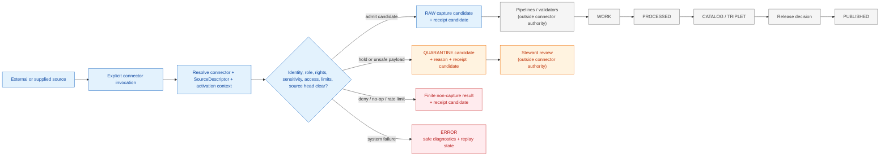

<!-- [KFM_META_BLOCK_V2]
doc_id: kfm://doc/connectors-readme
title: connectors/ — Source Admission Connectors
type: readme; directory-readme; canonical-implementation-root; source-admission-index
version: v0.4
status: draft; repository-grounded; mixed-maturity; partial-static-enforcement; ingest-receipt-hold; no-release; no-publication
owners: NEEDS VERIFICATION — CODEOWNERS routes /connectors/ to @bartytime4life; accepted connector/source stewardship and independent approval controls were not established
created: 2026-06-20
updated: 2026-07-23
supersedes: v0.3 at the same path
policy_label: public; implementation-root; source-admission; pre-RAW; raw-quarantine-receipts-only; fail-closed; no-publication
current_path: connectors/README.md
owning_root: connectors/
base_commit: 5c88eed8086182c600e276060a31d33a6ad2e977
prior_blob: bdd50032bed62ac36964c79f16cf5541b21759a6
truth_posture: >
  CONFIRMED same-path target; canonical connectors responsibility root; current connector-gate workflow;
  static connector/pipeline non-publisher test; fielded singular SourceDescriptor schema and executable wrapper;
  empty source-authority register; placeholder connectors-core package; CODEOWNERS routing; and representative
  family, product, package, and compatibility-lane documentation /
  PROPOSED repository-root connector contract, shared invocation profile, child-lane requirements, receipt
  semantics, topology normalization, and implementation sequence /
  CONFLICTED singular versus plural SourceDescriptor schema authority; schema-declared versus observed
  validator and fixture paths; documentation maturity versus runtime enforcement; and connector alias, product,
  and source-family naming patterns /
  UNKNOWN exhaustive connector inventory, active sources and activation decisions, live network behavior,
  endpoint health, complete rights and sensitivity review, emitted ingest receipts, runtime consumers,
  branch-rule significance, release integration, and public-delivery state.
evidence_snapshot:
  repository: bartytime4life/Kansas-Frontier-Matrix
  base_ref: main
  base_commit: 5c88eed8086182c600e276060a31d33a6ad2e977
  prior_blob: bdd50032bed62ac36964c79f16cf5541b21759a6
  directory_rules_blob: 2affb080e6f0043867c64c7f06c1ca52030fbd55
  connector_gate_workflow_blob: ae3ef92ac5f717cc149a609c3b74dd105dd17e44
  non_publisher_test_blob: c6164787bc848eb2347c347af203d76afae37a2b
  source_descriptor_schema_blob: 582e70b834278c3c6ca9a8b31efbe0989c96f0bc
  source_descriptor_validator_blob: 9d0538e727b5eb49c043998a3550972349d2e790
  source_authority_register_blob: 82c23722520922f5ca0dad7f37ed794d1c2edf81
  connectors_core_blob: 0db121b6f378b64bacaf74af57dbfcd40c969d1f
  codeowners_blob: dd2a84aa514d8ecd9208bc347f90f9a2ed37dd61
related:
  - ../docs/doctrine/directory-rules.md
  - ../docs/sources/ADMISSION_PROCESS.md
  - ../docs/sources/catalog/README.md
  - ../data/registry/sources/README.md
  - ../contracts/source/
  - ../schemas/contracts/v1/source/
  - ../schemas/contracts/v1/sources/
  - ../policy/rights/
  - ../policy/sensitivity/
  - ../data/raw/
  - ../data/quarantine/
  - ../data/receipts/
  - ../pipelines/README.md
  - ../packages/connectors-core/README.md
  - ../tools/validators/connector_gate/README.md
  - ../tests/policy/test_pipeline_connector_non_publisher.py
  - ../.github/workflows/connector-gate.yml
  - ../release/README.md
tags: [kfm, connectors, source-admission, pre-raw, source-descriptor, source-head, rights, sensitivity, raw, quarantine, receipts, non-publisher, trust-membrane, rollback]
notes:
  - "Same-path modernization of v0.3; no connector code, source activation, network behavior, lifecycle artifact, receipt instance, policy decision, release record, public route, or publication state changes."
  - "Directory Rules §7.3 assigns source-specific fetch and admission to connectors/ and limits direct handoff to RAW, QUARANTINE, and receipts."
  - "The current connector-gate workflow provides partial static non-publisher enforcement; ingest-receipt presence remains an explicit readiness hold."
  - "Static badges summarize inspected repository state only; they are not source activation, test completion, policy approval, release, or publication proof."
[/KFM_META_BLOCK_V2] -->

<a id="top"></a>

# Connectors

> **One-line purpose.** `connectors/` is KFM's canonical implementation root for source-specific, descriptor-gated fetch, probe, capture, and pre-RAW admission support; connectors may hand material to `RAW`, `QUARANTINE`, or receipt surfaces, but they never create source truth, promote lifecycle state, approve release, publish, or serve public clients.

[](#status)
[](#authority-level)
[](#outputs)
[](../.github/workflows/connector-gate.yml)
[](#validation)
[](#authority-level)
[](#last-reviewed)

> [!IMPORTANT]
> **Safe current conclusion:** the connector root, a partial static non-publisher workflow, a fielded `SourceDescriptor` schema candidate, an executable descriptor validator wrapper, and many source-lane READMEs exist. Current evidence does **not** establish an exhaustive connector inventory, accepted source activation system, complete receipt enforcement, live endpoint fitness, universal child-lane tests, production consumers, release integration, or public-safe publication.

> [!CAUTION]
> A successful network request is not source admission. A valid descriptor is not an activation decision. A checksum is not evidence closure. A connector receipt is process memory, not proof of release. A connector may preserve facts and candidate artifacts; it cannot manufacture source authority, rights clearance, sensitivity clearance, review, promotion, release, or public truth.

> [!WARNING]
> The machine source-authority register currently has `entries: []`, and the fielded singular `SourceDescriptor` schema declares a different plural path as canonical. Treat source registration and schema placement as **CONFLICTED**, not synchronized or operationally complete.

**Quick navigation:** [Purpose](#purpose) · [Authority](#authority-level) · [Status](#status) · [Belongs](#what-belongs-here) · [Exclusions](#what-does-not-belong-here) · [Inputs](#inputs) · [Outputs](#outputs) · [Validation](#validation) · [Review](#review-burden) · [Related](#related-folders) · [ADRs](#adrs) · [Last reviewed](#last-reviewed) · [Topology](#connector-topology-and-lane-classes) · [Admission flow](#admission-and-lifecycle-flow) · [Conflicts](#current-conflicts-and-maturity-limits) · [Outcomes](#connector-outcomes-and-receipt-boundary) · [Child contract](#child-readme-contract) · [Inspection](#inspection-path) · [Rollback](#correction-and-rollback) · [Done](#definition-of-done) · [Open verification](#open-verification-register)

---

<a id="scope"></a>

## Purpose

`connectors/` owns the source-specific implementation boundary between an external or supplied source surface and KFM's governed pre-RAW admission process.

A connector may help a governed caller answer:

- which source family, product, distribution, endpoint, local package, or upload surface is being addressed;
- whether the caller supplied a resolvable `SourceDescriptor`, activation context, source role, rights posture, sensitivity posture, cadence, and resource limits;
- what source-native bytes, records, manifests, metadata, identifiers, or pointers were observed;
- which source-head, integrity, completeness, freshness, and transport facts were preserved;
- whether the attempt should produce a RAW candidate, QUARANTINE candidate, no-op, denial, hold, rate-limit result, or error;
- which receipt-ready metadata is needed to make the attempt replayable and reviewable.

A connector does **not** decide whether admitted material is processed truth, evidence closure, catalog closure, a graph assertion, a released artifact, a public map layer, an API response, an AI answer, or KFM-published knowledge.

**Primary audience**

- connector and source maintainers;
- domain stewards consuming source-specific material;
- rights, sensitivity, privacy, security, and source-role reviewers;
- contracts, schema, registry, validator, fixture, workflow, and receipt maintainers;
- pipeline and lifecycle maintainers receiving connector handoffs;
- reviewers checking that source access cannot bypass the KFM trust membrane.

[Back to top](#top)

---

<a id="repo-fit"></a>

## Authority level

**Canonical implementation root for source-specific fetch and admission behavior; non-semantic, non-schema, non-policy, non-evidence, non-lifecycle-authority, non-release, non-publication, and non-public-serving.**

Directory Rules §7.3 assigns source-specific fetch and admission to `connectors/`. The root is canonical for that responsibility because the rule and the current repository path agree. That does not make every child path, package, source identity, alias, endpoint, or activation state canonical.

| Concern | Owning surface | `connectors/` relationship |
|---|---|---|
| Source-family and product doctrine | [`docs/sources/catalog/`](../docs/sources/catalog/README.md) and reviewed source docs | Consume and link; do not redefine source authority in connector code. |
| Source identity and registration | [`data/registry/sources/`](../data/registry/sources/README.md) and machine registers | Resolve accepted records; do not mint authority by successful fetch. |
| Object meaning | [`contracts/source/`](../contracts/source/) | Consume semantic contracts; do not replace them with connector-local models. |
| Machine shape | [`schemas/contracts/v1/source/`](../schemas/contracts/v1/source/) or an accepted successor | Validate against accepted schemas; do not create parallel schema authority. |
| Rights, sensitivity, consent, and access | [`policy/rights/`](../policy/rights/), [`policy/sensitivity/`](../policy/sensitivity/), and reviewed decisions | Supply facts and enforce returned obligations; do not self-clear. |
| Source-specific transport and capture | `connectors/<source-or-product>/` | Primary responsibility of this root. |
| Reusable source-agnostic primitives | [`packages/connectors-core/`](../packages/connectors-core/README.md) after maturity is proved | Consume shared helpers; source-specific behavior remains here. |
| Validation | [`tools/validators/`](../tools/validators/) and [`tests/`](../tests/) | Be testable; a passing validator is not source admission or release. |
| Direct lifecycle handoff | [`data/raw/`](../data/raw/), [`data/quarantine/`](../data/quarantine/), [`data/receipts/`](../data/receipts/) | Allowed boundary, under explicit governed orchestration. |
| Normalization and later lifecycle stages | [`pipelines/`](../pipelines/README.md) and governed data phases | Outside connector ownership. |
| Release, correction, withdrawal, rollback | [`release/`](../release/README.md) | Connectors may provide references; they never approve or execute release. |
| Public API, UI, map, export, and AI surfaces | governed applications over released/public-safe artifacts | Never direct connector consumers in the normal public path. |

> [!NOTE]
> A README, path, import, workflow, successful request, descriptor instance, registry row, or connector receipt activates nothing by itself. Activation and use require the applicable governed decision and review state.

[Back to top](#top)

---

## Status

<a id="current-inspected-snapshot"></a>

### Repository-grounded snapshot

| Surface | Current evidence at `main@5c88eed8…` | Safe conclusion |
|---|---|---|
| Parent README | **CONFIRMED** v0.3 baseline, blob `bdd5003…` | Same-path v0.4 modernization. |
| `connectors/` responsibility root | **CONFIRMED** in Directory Rules and repository | Canonical source-specific implementation root; child topology remains mixed. |
| Connector output workflow | **CONFIRMED command-bearing / PARTIAL** | Runs one static non-publisher test; does not validate complete connector behavior. |
| Static non-publisher test | **CONFIRMED executable source** | Scans Python, shell, and YAML write contexts for `data/catalog`, `data/published`, and `release/`; it is not runtime proof and does not cover every forbidden phase. |
| Ingest-receipt presence workflow | **CONFIRMED explicit `WORKFLOW_HOLD`** | No repository-owned receipt-presence validator or deterministic connector fixture set is established there. |
| `SourceDescriptor` singular schema | **CONFIRMED fielded, closed, status `PROPOSED`** | Strong machine-shape candidate; not accepted authority by presence alone. |
| `SourceDescriptor` schema metadata | **CONFIRMED points to plural path as canonical** | Singular/plural schema authority is `CONFLICTED`. |
| Descriptor validator wrapper | **CONFIRMED executable wrapper at `tools/validators/validate_source_descriptor.py`** | Invokes the singular schema and root fixture family; declared and observed paths disagree. |
| Machine source-authority register | **CONFIRMED present with `entries: []`** | No active source inventory is established by the register. |
| Connector gate validator lane | **CONFIRMED documentation-rich; direct executable and dedicated tests unestablished** | Root admission-gate architecture is not fully executable. |
| Shared connectors-core package | **CONFIRMED `0.0.0` placeholder** | Empty initializer and comment-only core do not establish reusable runtime behavior. |
| Representative child lanes | **CONFIRMED family, product, package, and compatibility READMEs** | Documentation is extensive but implementation maturity varies by lane. |
| Alias and naming topology | **CONFIRMED conflicts in inspected examples** | `osm`/`openstreetmap`, `people`/`people-dna-land`, and Kansas Mesonet variants require governed disposition. |
| CODEOWNERS | **CONFIRMED `/connectors/` routes to `@bartytime4life`** | Review routing exists; stewardship, required review, and separation of duties are separate and unproved. |
| Active sources, live network runs, endpoint health, emitted ingest receipts, consumers, release/publication | **UNKNOWN / NEEDS VERIFICATION** | No root-wide operational maturity claim is supported. |

### Truth labels used here

| Label | Meaning |
|---|---|
| `CONFIRMED` | Verified from current repository bytes, workflow definitions, tests, registers, or direct path reads in this update. |
| `PROPOSED` | A design, requirement, path normalization, input profile, or implementation sequence not established as accepted behavior. |
| `UNKNOWN` | Evidence is insufficient for a stronger claim. |
| `NEEDS VERIFICATION` | A concrete check exists but is not closed. |
| `CONFLICTED` | Relevant repository or authority surfaces disagree. |

> [!IMPORTANT]
> Root maturity must be stated per governed flow. A repository with many child READMEs and some placeholder packages is not automatically an implemented connector system.

[Back to top](#top)

---

<a id="accepted-inputs"></a>

## What belongs here

Files belong under `connectors/` when their primary responsibility is **source-specific fetch, probe, transport, source-native parsing, capture, or admission handoff**.

Permitted material includes:

- source-family coordination lanes that keep distinct products and source roles visible;
- product-, distribution-, endpoint-, package-, feed-, archive-, or upload-specific connector lanes;
- source-specific clients and parsers whose network and resource behavior is explicit and testable;
- source-native identifier, field, geometry, raster, network, time-series, pagination, and manifest preservation logic;
- caller-supplied provider or distribution profiles after rights and service-use review;
- descriptor-gated source-head and integrity observations such as ETag, Last-Modified, content length, upstream version, revision ID, and content digest;
- finite source-interaction results that distinguish success, no-op, denial, hold, rate limit, incompleteness, stale state, and operational error;
- connector-local package metadata and source roots when they serve one source lane and do not become shared authority;
- no-network fixtures and connector behavior tests using synthetic or redistribution-safe samples;
- adapters that construct **candidate** RAW, QUARANTINE, or receipt payloads from accepted contracts;
- child READMEs that state the source boundary, rights, sensitivity, source role, network posture, outputs, validation, correction, and rollback.

A file belongs here because it is source-specific implementation—not because it mentions an agency, domain, data product, API, download, or source.

[Back to top](#top)

---

<a id="exclusions"></a>

## What does NOT belong here

| Do not put this in `connectors/` | Correct responsibility |
|---|---|
| Source-family or product doctrine presented as authority | `docs/sources/catalog/` or the applicable reviewed domain/source docs |
| Canonical `SourceDescriptor`, activation decision, source-authority register, rights record, or sensitivity record | `data/registry/`, `control_plane/`, policy, and accepted decision homes |
| Semantic object definitions | `contracts/` |
| JSON Schema, DTO, enum, or machine-shape authority | `schemas/contracts/v1/` |
| General reusable transport/retry/hash helpers used by multiple source lanes | `packages/` after a real shared-package boundary is established |
| Generic validators or admission-gate implementations | `tools/validators/` |
| Declarative run configuration | `pipeline_specs/` |
| Cross-source normalization, joins, identity resolution, canonicalization, or domain transformation | `pipelines/` and downstream implementation packages |
| Normalized WORK candidates or PROCESSED domain records | `data/work/`, `data/processed/` |
| Catalog, STAC/DCAT/PROV, triplet, graph, or search-index authority | `data/catalog/`, `data/triplets/`, and catalog tooling |
| `EvidenceBundle`, proof pack, validation proof, or citation-closure authority | `data/proofs/` and governed proof producers |
| Release manifests, promotion decisions, corrections, withdrawals, rollback cards, or signatures | `release/` |
| Published layers, PMTiles, GeoParquet, reports, stories, API payloads, or exports | `data/published/` after governed release |
| Public API routes, UI/map components, dashboards, exports, alerts, or AI answers | governed application/runtime roots |
| Credentials, session cookies, API keys, consent tokens, or secret values | approved secret-management systems, never repository connector files |
| Real protected precise locations or private living-person/DNA payloads in tests or docs | denied; use synthetic/redacted fixtures under the proper fixture root |
| A second source identity, package, registry, schema, or policy authority created by an alias path | compatibility/migration documentation only until governed disposition |

[Back to top](#top)

---

## Inputs

A mature connector invocation should receive an explicit, immutable, reviewable input packet. Current repository evidence does not establish one universal connector-input schema, so this profile is **PROPOSED** and must be specialized by accepted contracts.

| Input class | Minimum governed context | Fail-closed trigger |
|---|---|---|
| Requested action | probe, fetch, import, inspect local package, resume, or replay; stable run/request ID | implicit or overbroad operation |
| Connector identity | source family, product/distribution, connector/package version, source-specific entrypoint | unknown or alias-resolved-to-multiple implementations |
| Source authority | `SourceDescriptor` reference and applicable activation/review decision | missing, stale, conflicted, inactive, denied, or unresolvable |
| Source role and scope | allowed claim roles, domain scope, spatial/temporal limits, source-native identifiers | role collapse or scope expansion |
| Rights and sensitivity | terms/license snapshot or reference, attribution, redistribution, consent where relevant, sensitivity/default precision | unknown, expired, revoked, incompatible, or insufficiently reviewed |
| Access plan | reviewed host/local input, paths, parameters, method, auth reference, user agent, limits, pagination and completeness strategy | undeclared host, secret value in input, unsafe automation, or service-use mismatch |
| Resource controls | request/byte/record/page/time/retry/deadline/cancellation limits | unbounded operation |
| Source-head strategy | ETag, Last-Modified, version, revision, manifest checksum, content digest, or documented not-applicable reason | no content-identity or drift strategy where one is required |
| Output sinks | caller-owned RAW, QUARANTINE, and receipt candidate destinations | connector chooses later lifecycle or public targets |
| Deterministic dependencies | injected transport, clock, sleeper, randomness, filesystem/archive interfaces, parser limits | hidden network, clock, randomness, or write effects |
| Correction/replay context | prior run/source-head refs, supersession/correction state, expected output identity | replay cannot identify prior state or rollback target |

> [!CAUTION]
> Repository files may reference an endpoint or provider without authorizing its use. Current source terms, rate limits, account requirements, and automated-access conditions must be verified per child lane before activation or live execution.

[Back to top](#top)

---

## Outputs

Directory Rules limit connector output to governed RAW or QUARANTINE handoff plus receipts. The exact authoritative object shapes and sink ownership must come from accepted contracts and orchestration; this README does not create an enum or receipt schema.

| Output family | Connector posture | Authority limit |
|---|---|---|
| RAW capture candidate | Preserve source-native bytes/records, source identity, retrieval metadata, checksum/source-head facts, and intended `data/raw/<domain>/<source_id>/<run_id>/` route | Not normalized truth, evidence closure, processed state, or public data |
| QUARANTINE candidate | Preserve held payload/reference, reason codes, unresolved dependencies, safe diagnostics, and steward routing | Not a failed artifact to silently discard or auto-promote |
| Connector/ingest receipt candidate | Preserve operation, inputs, source-head, tool/connector identity, outcome, hashes, timing, limits, and failures | Process memory; not proof, activation, promotion, or release |
| No-op result | State why no new capture is needed and bind the observed source head | Not evidence that upstream content is unchanged beyond the observation |
| Deny/hold/abstain result | Preserve safe public/reviewer reason families and unresolved references | No protected details in public reasons; no fallback to allow |
| Rate-limit/retry result | Preserve provider response class, retry eligibility, bounded delay/deadline, and attempt history | Never evade controls, rotate identities, or retry without bounds |
| Operational error | Preserve safe failure class, partial-state disposition, and cleanup/replay instructions | Never silently emit incomplete RAW as success |

Direct connector writes or hidden effects to these surfaces are prohibited:

```text
data/work/
data/processed/
data/catalog/
data/triplets/
data/proofs/
data/published/
release/
public API / UI / map / export / AI surfaces
```

The current static workflow test enforces only a subset of this boundary (`data/catalog`, `data/published`, and `release/`). The wider doctrine requirement remains stronger than the implemented static check.

[Back to top](#top)

---

## Validation

### Current executable and held checks

| Surface | Current behavior | What it proves | What it does not prove |
|---|---|---|---|
| [`connector-gate.yml`](../.github/workflows/connector-gate.yml) — `connector-output-gate` | Installs test dependencies and runs the static non-publisher pytest | The named test executes in that workflow when the job runs | Source correctness, network safety, rights, sensitivity, descriptor activation, receipt completeness, or runtime write safety |
| [`test_pipeline_connector_non_publisher.py`](../tests/policy/test_pipeline_connector_non_publisher.py) | Scans selected Python, shell, and YAML write contexts for `data/catalog`, `data/published`, and `release/` | A bounded static trust-boundary guard | Dynamic paths, other languages, all forbidden lifecycle phases, actual runtime behavior, or release safety |
| `connector-gate.yml` — `ingest-receipt-presence` | Emits `WORKFLOW_SKIPPED_EXPLICIT` / `WORKFLOW_HOLD` | The receipt gap is visible rather than falsely green | Presence, shape, identity binding, polarity, persistence, replay, or authority of any ingest receipt |
| [`validate_source_descriptor.py`](../tools/validators/validate_source_descriptor.py) | Runs JSON Schema validation over supplied files or the existing fixture family | The wrapper, singular schema, and fixture path are executable source | Accepted schema authority, activation, source-role correctness beyond schema, or all registry instances |
| [`tools/validators/connector_gate/`](../tools/validators/connector_gate/README.md) | Detailed README; direct gate executable and dedicated tests not established | Future gate boundary and current conflict inventory | Connector admission enforcement |
| Child-lane tests and fixtures | Mixed and lane-specific | Only what each inspected lane's current tests actually execute | Root-wide connector correctness or source activation |

Observed commands:

```bash
python -m pytest \
  tests/policy/test_pipeline_connector_non_publisher.py \
  -q --strict-config --strict-markers

python tools/validators/validate_source_descriptor.py --fixtures
```

For the descriptor fixture command, invalid fixtures are expected to fail schema validation while the wrapper checks that polarity and returns success only when valid examples pass and invalid examples fail as intended.

### Minimum validation before a connector lane can claim implementation readiness

- accepted source and connector identities are stable and non-duplicated;
- an accepted descriptor/activation profile is resolvable;
- default tests perform no live network requests;
- imports and documentation builds have no network or write side effects;
- fixtures are synthetic, redacted, public-domain, or redistribution-safe;
- provider/service behavior is profile-gated, bounded, and current;
- rights, attribution, sensitivity, privacy, consent, and source-role negative cases fail closed;
- pagination, truncation, partial response, stale state, source-head drift, and schema drift are tested;
- retry, timeout, cancellation, rate limit, byte/record/page limits, and cleanup are deterministic;
- RAW, QUARANTINE, no-op, denial, rate-limit, and error outcomes are exercised;
- forbidden writes to every later lifecycle, proof, release, and public surface are tested;
- receipt candidates bind operation, connector identity, descriptor/source head, inputs, outputs, limits, hashes, and outcome;
- replay and correction tests preserve prior identity and do not duplicate source captures;
- CI commands, ownership, and required-check significance are verified.

> [!IMPORTANT]
> A green static boundary check is useful evidence, but it is not a `SourceActivationDecision`, admission record, ingest receipt, `EvidenceBundle`, promotion decision, release approval, or publication proof.

[Back to top](#top)

---

## Review burden

CODEOWNERS currently routes `/connectors/` changes to `@bartytime4life`. That is GitHub review routing, not proof of a connector stewardship assignment, source-owner approval, rights clearance, independent review, or separation of duties.

| Change class | Minimum review posture |
|---|---|
| README-only clarification | Connector-aware maintainer plus docs review. |
| Source-specific parsing or transport | Connector/source maintainer plus affected domain owner and validation reviewer. |
| New endpoint, service, distribution, provider profile, or automation method | Source owner/steward, rights/terms reviewer, security reviewer, and affected domain reviewer. |
| Credentials, accounts, authentication, private services, or protected local inputs | Security/identity review; secrets remain outside repository bytes. |
| Rights, redistribution, consent, privacy, sensitive locations, living persons, DNA/genomics, archaeology/cultural knowledge, rare species, or critical infrastructure | Relevant specialist and policy/sensitivity reviewer; fail closed without ownership. |
| Source role, authority class, or admissibility limit | Source/domain/evidence review and accepted contract/schema/policy alignment. |
| Shared connectors-core primitive | Package owner plus representative connector consumers and compatibility/test review. |
| Connector path, alias, package namespace, or source-ID migration | Directory-governance review, affected consumers, migration/deprecation plan, and rollback proof; ADR where authority changes. |
| Contract, schema, reason-code, receipt, or policy change | Owning contract/schema/policy/receipt maintainers plus fixtures, validators, consumers, and migration review. |
| Source activation, promotion, release, correction, or rollback | Separate governing decision outside connector self-approval; connector authors do not approve their own public release. |

Accepted owners, required reviews, branch rules, and independent approval controls remain **NEEDS VERIFICATION**.

[Back to top](#top)

---

<a id="related-surfaces"></a>

## Related folders

| Surface | Relationship |
|---|---|
| [Directory Rules](../docs/doctrine/directory-rules.md) | Placement, connector output boundary, lifecycle, anti-pattern, and migration doctrine. |
| [Source Admission Process](../docs/sources/ADMISSION_PROCESS.md) | Human-facing pre-RAW admission doctrine; not current implementation proof. |
| [`docs/sources/catalog/`](../docs/sources/catalog/README.md) | Source-family and product doctrine. |
| [`data/registry/sources/`](../data/registry/sources/README.md) | Source identity, role, rights, sensitivity, cadence, and registry instances; current machine register synchronization is incomplete. |
| [`control_plane/source_authority_register.yaml`](../control_plane/source_authority_register.yaml) | Machine source-authority index; currently empty. |
| [`contracts/source/`](../contracts/source/) | Semantic meaning for source and ingest objects. |
| [`schemas/contracts/v1/source/`](../schemas/contracts/v1/source/) | Fielded singular source schemas used by current wrapper. |
| [`schemas/contracts/v1/sources/`](../schemas/contracts/v1/sources/) | Plural schema lane referenced as canonical by singular schema metadata; authority remains conflicted. |
| [`policy/rights/`](../policy/rights/) and [`policy/sensitivity/`](../policy/sensitivity/) | Admissibility gates and obligations. |
| [`data/raw/`](../data/raw/), [`data/quarantine/`](../data/quarantine/), [`data/receipts/`](../data/receipts/) | Permitted direct handoff surfaces. |
| [`pipelines/`](../pipelines/README.md) | Normalization, validation, promotion candidates, and later lifecycle work outside connector ownership. |
| [`packages/connectors-core/`](../packages/connectors-core/README.md) | Proposed shared primitive package; currently a `0.0.0` placeholder. |
| [`tools/validators/connector_gate/`](../tools/validators/connector_gate/README.md) | Admission-readiness validator boundary; direct executable/tests remain unestablished. |
| [`connector-gate.yml`](../.github/workflows/connector-gate.yml) | Partial static non-publisher enforcement and explicit receipt hold. |
| [`release/`](../release/README.md) | Release, correction, withdrawal, and rollback decisions outside connector authority. |

[Back to top](#top)

---

## ADRs

| Decision record | Status | Relevance |
|---|---:|---|
| [`ADR-0017 — Source Descriptor Admission Process`](../docs/adr/ADR-0017-source-descriptor-admission-process.md) | **PROPOSED** | Descriptor-level and record-level admission model; not accepted authority yet. |
| [`ADR-0001 — Schema Home`](../docs/adr/ADR-0001-schema-home--schemas-contracts-v1-is-canonical.md) | **PROPOSED** | Default schema-home decision; current singular/plural source-schema conflict remains unresolved operationally. |
| [`ADR-0003 — Singular Policy Root`](../docs/adr/ADR-0003-policy-singular-is-canonical-%28policies-is-compatibility%29.md) | **PROPOSED** | Policy-root compatibility control; does not activate source policy. |
| Connector lane/alias/source-ID normalization | **NOT ACCEPTED / NEEDS VERIFICATION** | Needed before declaring one family/product/alias topology universally canonical. |
| Connector outcome, ingest-receipt, and admission-gate normalization | **NOT ACCEPTED / NEEDS VERIFICATION** | Needed before one root-wide machine contract can be claimed. |

This README records current repository evidence and open decisions. It does not accept an ADR, activate a source, or normalize paths through prose.

[Back to top](#top)

---

## Last reviewed

**2026-07-23** against `main@5c88eed8086182c600e276060a31d33a6ad2e977`.

Reviewed:

- the complete v0.3 target;
- current Directory Rules connector, lifecycle, validation, anti-pattern, README, and migration boundaries;
- `connector-gate.yml` and its static non-publisher test;
- the fielded singular `SourceDescriptor` schema and observed validator wrapper;
- the source-authority machine register;
- connectors-core package documentation and placeholder maturity;
- CODEOWNERS routing;
- representative USGS, OpenStreetMap/OSM, Kansas Mesonet, and People compatibility-lane documentation.

Not established:

- an exhaustive recursive connector tree or source inventory;
- active `SourceDescriptor` and activation-decision coverage;
- current endpoint, provider, rights, cadence, or rate-limit fitness for every lane;
- live network execution, deployment, consumers, schedules, or emitted ingest receipts;
- complete validator/test/fixture/workflow coverage;
- required-check and independent-review enforcement;
- production promotion, correction, rollback, release, or public-delivery integration.

[Back to top](#top)

---

<a id="directory-tree"></a>
<a id="connector-lane-patterns"></a>

## Connector topology and lane classes

The repository contains multiple connector shapes. This README classifies them without silently renaming, merging, or making one observed pattern universal.

| Lane class | Representative inspected or documented shape | Safe interpretation |
|---|---|---|
| Source-family coordination lane | `connectors/usgs/` | Coordinates multiple distinct products; family identity is not one source role or one activation. |
| Product/distribution lane | nested or flat product paths such as USGS product sublanes, WZDx, or VIIRS-related lanes | Owns source-specific implementation only after descriptor, rights, role, and path posture are resolved. |
| Implementation/package lane | `connectors/openstreetmap/` with package/source/test READMEs | Documentation-rich but implementation-light; package presence and version `0.0.0` do not prove runtime behavior. |
| Nested source/package/test sublanes | `src/`, import-package, and `tests/` directories within a connector family | Local implementation/test boundaries, not independent source or release authority. |
| Compound source name | paths such as `usgs_mrds` or `usgs_ngmdb` | Existing naming pattern; universal canonicality is not inferred. |
| Short-name compatibility alias | `connectors/osm/`, `connectors/people/` | README-only or compatibility-focused in inspected examples; must not duplicate implementation or source identity. |
| Multi-variant compatibility topology | Kansas Mesonet underscore, family/product, short-name, deleted, and proposed variants | `CONFLICTED`; freeze new parallel implementation until path, identity, consent, and migration are governed. |
| Sensitive-domain connector boundary | People/DNA/Land and other protected-source lanes | Deny/quarantine by default where identity, consent, rights, sensitivity, or public precision is unresolved. |

### Topology rules

1. Source families may coordinate; products retain distinct roles, rights, cadence, endpoints, and activation decisions.
2. An abbreviation or alternate slug must not mint a second connector, package, source ID, descriptor family, fixture set, receipt stream, or release path.
3. Nested versus flat placement must be resolved by responsibility, consumers, current evidence, and migration cost—not convenience.
4. Source-specific code stays in the chosen connector lane; source-agnostic primitives graduate to a reviewed shared package.
5. Path migration requires reference updates, compatibility/deprecation posture where needed, validation, and rollback. A README cannot perform the migration by declaration.
6. A complete root inventory should be generated by repository tooling before maintainers claim topology normalization or coverage.

[Back to top](#top)

---

<a id="admission-contract"></a>
<a id="lifecycle-boundary"></a>

## Admission and lifecycle flow



The diagram is an authority map, not proof that a universal connector runtime exists. The direct connector boundary ends at RAW, QUARANTINE, or a receipt-ready finite result. Every later state transition is owned elsewhere and must remain auditable.

### Source-role anti-collapse

A connector must preserve, not blur:

- observed versus modeled versus aggregate versus administrative versus candidate material;
- source family versus specific product, distribution, endpoint, or upstream version;
- discovery/catalog carrier versus the underlying asset;
- source-native quality flags versus KFM validation results;
- upstream currentness versus connector retrieval time and KFM release time;
- exact source geometry versus public-safe derivative geometry;
- successful transport versus complete response;
- fixture behavior versus live source behavior;
- RAW capture versus normalized admission;
- connector receipt versus evidence, proof, or release.

[Back to top](#top)

---

## Current conflicts and maturity limits

| ID | Conflict or gap | Current evidence | Required disposition |
|---|---|---|---|
| CONN-001 | Singular versus plural `SourceDescriptor` schema authority | Fielded singular schema declares plural path canonical; plural lane is separately referenced | Accept/migrate one authority; preserve compatibility and fixture parity. |
| CONN-002 | Declared versus observed descriptor validator and fixtures | Schema metadata names nested validator/test fixtures; wrapper invokes root validator and root fixture family | Reconcile metadata, wrapper, fixtures, tests, and consumers in one governed packet. |
| CONN-003 | Empty source-authority machine register | `control_plane/source_authority_register.yaml` contains `entries: []` | Populate only through reviewed source-governance work; do not infer activation from child docs. |
| CONN-004 | Partial connector-gate enforcement | Current workflow runs one static non-publisher test | Expand only with repository-owned validators and deterministic negative fixtures. |
| CONN-005 | Ingest-receipt enforcement absent | Workflow records an explicit hold | Accept receipt contract/schema/identity binding, validator, fixtures, persistence, replay, and CI. |
| CONN-006 | Direct connector-gate validator unestablished | Validator lane is README-rich but lacks direct executable/dedicated tests | Implement smallest deterministic no-network gate before enforcement claims. |
| CONN-007 | Shared connector runtime placeholder | connectors-core is version `0.0.0`, empty/comment-only at inspected surfaces | Implement and test source-agnostic primitives or keep the package explicitly placeholder. |
| CONN-008 | Child path and alias drift | Inspected OSM/OpenStreetMap, People/People-DNA-Land, and Mesonet variants coexist | Record accepted identity/path/migration decision; block parallel implementation. |
| CONN-009 | Source documentation can outrun activation | Many detailed READMEs exist while active register/runtime evidence is missing | Keep docs valuable but label activation, tests, endpoints, and consumers separately. |
| CONN-010 | Static guard is narrower than doctrine | Test forbids catalog/published/release targets but Directory Rules also prohibit processed/canonical mutation | Extend guards without treating a static scan as runtime proof. |
| CONN-011 | External service terms and fitness are lane-specific and volatile | Root docs cannot establish current endpoint, license, consent, rate-limit, or service-use posture | Reverify in each activation/review cycle; pin evidence and expiry. |
| CONN-012 | Root-wide outcome vocabulary is not accepted | Child docs use several descriptive states and receipt families | Normalize through contracts/ADRs; do not invent an enum here. |

[Back to top](#top)

---

## Connector outcomes and receipt boundary

The terms below describe required semantic distinctions; they are **not** a new canonical enum.

| Semantic result | Required behavior |
|---|---|
| Capture candidate | Preserve exact source and run identity, content/source-head evidence, completeness state, intended RAW route, and receipt metadata. |
| Quarantine candidate | Preserve safe held material/reference, reason families, unresolved dependencies, reviewer route, and no-public exposure. |
| Deny | Do not contact, capture, persist, or expose beyond what the accepted policy allows; emit safe audit metadata. |
| Hold / review required | Stop before the blocked action; preserve unresolved refs and reviewer requirements. |
| Abstain / unsupported | State that the connector cannot decide or represent the requested source action from current support. |
| No-op | Bind the source-head observation and explain why no capture occurred. |
| Rate-limited / retry later | Preserve bounded retry eligibility and deadline; do not evade upstream controls. |
| Error | Preserve safe diagnostics, partial-state cleanup, and replay context; never fall back to success or public exposure. |

A mature connector receipt candidate should identify:

- run/request and connector version;
- source, descriptor, activation, provider/distribution, and endpoint/local-input references;
- requested operation and effective resource limits;
- source-head and integrity observations;
- retrieval/capture start and end times;
- byte, record, page, request, retry, and truncation counts where relevant;
- output candidate IDs, digests, and intended RAW/QUARANTINE routes;
- finite outcome, reason families, obligations, and safe diagnostics;
- policy/review dependency refs;
- correction, supersession, prior-run, and replay refs.

Receipt shape, persistence, signing, and authority remain governed by their accepted contracts. A helper object or log line is not automatically an authoritative receipt.

[Back to top](#top)

---

<a id="required-child-readme-contract"></a>

## Child README contract

Every non-trivial connector lane should make these items reviewable:

1. stable source family, product/distribution, path, package, and alias identity;
2. purpose, audience, authority, status, and implementation evidence boundary;
3. source doctrine links and source-role anti-collapse rules;
4. current inventory of package/source/test/fixture surfaces, with bounded absence language;
5. accepted and prohibited services, methods, upstream mutations, and automation patterns;
6. current rights, attribution, redistribution, consent, privacy, sensitivity, and precision posture;
7. descriptor, activation, provider-profile, endpoint/local-input, and resource-limit inputs;
8. source-native preservation, completeness, freshness, pagination, source-head, and integrity behavior;
9. finite outcomes, RAW/QUARANTINE/receipt candidate boundary, and forbidden downstream writes;
10. deterministic no-network fixtures and positive/negative tests;
11. security, secrets, logging, retry, timeout, cancellation, cleanup, and replay behavior;
12. correction, source deactivation, supersession, migration, and rollback;
13. concrete definition of done and open verification register;
14. evidence ledger separating repository facts, upstream facts, doctrine, proposals, conflicts, and unknowns.

Child docs must not claim endpoint permission, activation, successful execution, currentness, receipt emission, public safety, release, or publication unless current evidence proves that exact claim.

[Back to top](#top)

---

<a id="inspection-path"></a>

## Inspection path

Before relying on a connector or source-derived claim:

1. Start with this root README for responsibility and trust boundaries.
2. Inspect the exact family, product, alias, package, source-root, and test READMEs.
3. Resolve source-family and product doctrine under `docs/sources/catalog/`.
4. Resolve the current `SourceDescriptor`, machine register entry, activation/review decision, and correction state.
5. Inspect applicable contracts, schemas, reason/obligation vocabularies, rights, sensitivity, consent, and source-role policy.
6. Inspect package/source code, default configuration, provider profiles, network side effects, imports, secret handling, and bounded resources.
7. Inspect deterministic fixtures, negative cases, direct connector tests, validator code, workflow definition, and observed workflow run for the target revision.
8. Resolve connector/ingest receipt instances, source-head identity, output digests, intended lifecycle route, and replay/correction refs.
9. Inspect downstream pipeline validation, proof/evidence closure, release decision, correction lineage, and rollback target before relying on any public surface.
10. Abstain or deny when required evidence is missing, stale, conflicted, or unsafe.

> [!CAUTION]
> Never run live source activation, scraping, bulk download, credentialed access, protected-source retrieval, or public exposure merely because a connector path or README exists.

[Back to top](#top)

---

<a id="rollback"></a>

## Correction and rollback

### This README update

This documentation change modifies no connector behavior. Before merge, close or leave the draft pull request and abandon the branch. After merge, revert the documentation commit; do not rewrite shared history.

Byte-level recovery targets:

- v0.3 target blob: `bdd50032bed62ac36964c79f16cf5541b21759a6`
- v0.2 content SHA recorded by v0.3: `01953f857db053dccd83b8de1c81177e5fd609d0`
- prior stub SHA recorded by v0.3: `465b004a56b1119e5cf7e00a34e3f9a7cb132dbb`

### Connector and source correction

A material connector correction should:

1. stop or constrain affected source activity;
2. preserve the failed run, source-head, input, output, and receipt identities;
3. quarantine unsafe or ambiguous captures rather than mutating RAW history;
4. emit reviewed correction/supersession records through their owning roots;
5. invalidate derived candidates and caches without deleting lineage;
6. reevaluate affected evidence, catalogs, releases, and public surfaces through downstream owners;
7. restore the prior accepted connector/package/provider profile or disable the lane;
8. prove replay and rollback with deterministic fixtures before reactivation.

Aliases and path migrations require parity, one-way delegation, consumer/reference updates, no duplicate fetch/receipt emission, a sunset or retention policy, and a tested rollback path.

[Back to top](#top)

---

## Definition of done

### Root README modernization

- [x] Existing path, `doc_id`, created date, core authority boundary, lifecycle law, child contract, rollback targets, and definition-of-done intent preserved.
- [x] Directory Rules §15 section order applied.
- [x] Current workflow, static test, descriptor schema/wrapper, source register, shared package, CODEOWNERS, and representative child-lane evidence incorporated.
- [x] Partial enforcement, held receipt validation, schema/path conflicts, alias drift, and unknown runtime state surfaced.
- [x] Static evidence-backed badges, concise navigation, tables, alerts, Mermaid flow, legacy anchors, evidence ledger, and changelog added.
- [x] No connector code, source activation, network access, policy, lifecycle data, receipt instance, release object, public route, or workflow changed.

### Active connector system

- [ ] Accepted connector and source stewards replace placeholders through governed assignments.
- [ ] Complete recursive connector/source/alias/package/test inventory is generated and reviewed.
- [ ] One accepted connector topology, source-ID rule, and compatibility/migration discipline are documented.
- [ ] SourceDescriptor schema, validator, fixtures, registry, role vocabulary, and activation decision are synchronized.
- [ ] Active source register is populated with reviewed rights, sensitivity, cadence, access, and expiry posture.
- [ ] Shared connector primitives are implemented only where reuse is proved, with package tests and consumers.
- [ ] Direct connector-gate validator, report schema, reason codes, and deterministic no-network tests exist.
- [ ] Ingest-receipt contract, validator, positive/negative fixtures, persistence, source-head binding, replay, and CI are accepted.
- [ ] Every active lane proves import safety, bounded resource use, terms compliance, completeness, drift, retry, quarantine, and correction behavior.
- [ ] Static and runtime tests prove no WORK/PROCESSED/CATALOG/TRIPLET/PROOF/PUBLISHED/RELEASE/public writes.
- [ ] Required checks, ownership, independent review, source deactivation, correction propagation, and rollback drills are observed.
- [ ] No connector is described as active, release-ready, or public without corresponding governed evidence.

[Back to top](#top)

---

## Open verification register

| ID | Question | Status |
|---|---|---:|
| CONN-OV-001 | What is the exhaustive recursive connector inventory, including code, packages, aliases, tests, fixtures, generated files, and consumers? | **NEEDS VERIFICATION** |
| CONN-OV-002 | Which source-family, product, provider, and alias topology is accepted, and which paths require migration or compatibility controls? | **CONFLICTED / NEEDS ADR OR MIGRATION** |
| CONN-OV-003 | Which SourceDescriptor schema path is authoritative, and how will singular/plural parity and metadata be repaired? | **CONFLICTED** |
| CONN-OV-004 | What accepted SourceDescriptor validator, fixture root, role vocabulary, and registry contract should all consumers use? | **CONFLICTED / NEEDS VERIFICATION** |
| CONN-OV-005 | Where is the accepted `SourceActivationDecision`, and what states, reasons, reviews, expiry, deactivation, and correction rules apply? | **UNKNOWN** |
| CONN-OV-006 | Which entries should populate the source-authority machine register, and what prevents docs or placeholders from appearing active? | **UNKNOWN** |
| CONN-OV-007 | What direct connector-gate executable, report schema, registry ID, exit-code contract, and dedicated test lane are accepted? | **UNKNOWN** |
| CONN-OV-008 | What ingest-receipt contract, validator, fixtures, storage, signing, source-head binding, replay, correction, and rollback are accepted? | **UNKNOWN** |
| CONN-OV-009 | Which connector lanes have executable clients, approved provider profiles, no-network tests, current terms, and observed successful dry-runs? | **NEEDS VERIFICATION** |
| CONN-OV-010 | Which source-specific operations require explicit consent, accounts, credentials, or restrictions, and how are expiry and revocation enforced? | **NEEDS VERIFICATION** |
| CONN-OV-011 | How will static and runtime guards cover WORK, PROCESSED, CATALOG, TRIPLET, PROOF, PUBLISHED, RELEASE, API, UI, map, export, and AI writes? | **NEEDS VERIFICATION** |
| CONN-OV-012 | Which connector outcomes, reason codes, obligations, and receipt fields are canonical across packages, validators, workflows, and consumers? | **UNKNOWN** |
| CONN-OV-013 | Which connector checks are required by branch rules, and how are code-owner review and independent source/release approval enforced? | **UNKNOWN / NEEDS VERIFICATION** |
| CONN-OV-014 | What monitoring, deactivation, correction cascade, cache invalidation, and rollback drill prove safe source retirement or upstream drift response? | **UNKNOWN** |
| CONN-OV-015 | Which downstream pipeline is the first accepted proof-bearing connector slice, and what complete EvidenceRef-to-release chain proves it? | **PROPOSED** |

[Back to top](#top)

---

<a id="evidence-basis"></a>

<details>
<summary><strong>No-loss and evidence ledger</strong></summary>

| Baseline element | Disposition |
|---|---|
| Stable path, H1, `doc_id`, created date, source-admission purpose | **KEEP / CLARIFY** |
| Connector non-publisher and RAW/QUARANTINE/receipt boundary | **KEEP / ENRICH** with current workflow/test evidence and explicit gaps |
| Status and owner placeholders | **REPAIR** to evidence-bounded CODEOWNERS routing and stewardship unknowns |
| Scope and repository-fit narrative | **CONSOLIDATE** into Purpose and Authority level |
| Accepted inputs | **RELOCATE / ENRICH** across What belongs here and Inputs |
| Exclusions | **KEEP / ENRICH** in Directory Rules order |
| Current inspected snapshot | **REPAIR / ENRICH** with pinned workflow, tests, schema, validator, register, package, and representative child evidence |
| Partial directory tree and lane-pattern table | **RELOCATE / ENRICH** into topology classes without pretending exhaustiveness |
| Admission field list | **KEEP / ENRICH** into explicit input, source-role, outcome, and receipt boundaries |
| Mermaid lifecycle flow | **KEEP / ENRICH** with finite negative states and downstream authority separation |
| Inspection path | **KEEP / ENRICH** with code, tests, run, receipts, downstream proof/release checks |
| Required child README contract | **KEEP / ENRICH** with provider, security, correction, compatibility, and evidence requirements |
| Validation checklist | **REPAIR / ENRICH** with current partial workflow, exact command, test limits, descriptor wrapper, and receipt hold |
| Evidence basis | **KEEP / ENRICH** as this ledger and metadata snapshot |
| Rollback targets | **KEEP** and add current v0.3 blob plus governed connector correction sequence |
| Definition of done | **KEEP / SPLIT** into completed documentation work and unproved active-system closure |
| Related surfaces and status summary | **KEEP / ENRICH** with direct links, conflicts, and current maturity |

Evidence used: target blob `bdd5003…`; Directory Rules `2affb08…`; connector workflow `ae3ef92…`; non-publisher test `c616478…`; SourceDescriptor schema `582e70b…`; descriptor validator `9d0538e…`; source register `82c2372…`; connectors-core README `0db121b…`; CODEOWNERS `dd2a84a…`; representative USGS, OpenStreetMap/OSM, Kansas Mesonet, and People child READMEs.

</details>

## Changelog

| Version | Date | Change | Rollback |
|---|---|---|---|
| Prior stub | Before 2026-06-20 | Short connector-root boundary. | Restore recorded stub SHA `465b004…`. |
| v0.2 | 2026-06-20 | Expanded connector source-admission, lifecycle, validation, rollback, and completion posture. | Restore recorded content SHA `01953f8…`. |
| v0.3 | 2026-06-20 | Applied prior README authoring guidance, partial tree, lane patterns, child contract, and evidence basis. | Restore blob `bdd50032bed62ac36964c79f16cf5541b21759a6`. |
| v0.4 | 2026-07-23 | Same-path repository-grounded modernization with Directory Rules section order, current partial CI evidence, schema/register/package conflicts, topology classes, input/output/receipt boundaries, stronger review/validation/rollback, legacy anchors, no-loss ledger, and verification register. | Before merge, close or leave the draft PR and abandon the branch. After merge, revert the documentation commit without rewriting shared history. |

## Status summary

`connectors/` is the canonical KFM implementation root for source-specific fetch, probe, capture, and pre-RAW admission support. The repository now has partial static non-publisher enforcement and substantial connector documentation, but it is not yet a proved, synchronized, root-wide connector admission system.

Until source registration, activation decisions, schema/validator authority, connector topology, direct admission gates, deterministic fixtures, ingest receipts, active source reviews, runtime consumers, required checks, correction cascades, and rollback drills are accepted and observed, the safe posture is:

```text
repository-grounded
mixed-maturity
descriptor- and policy-gated
no-network by default
RAW / QUARANTINE / receipts only
fail closed on unresolved identity, rights, sensitivity, role, or source head
non-release
non-publication
```

<p align="right"><a href="#top">Back to top</a></p>
