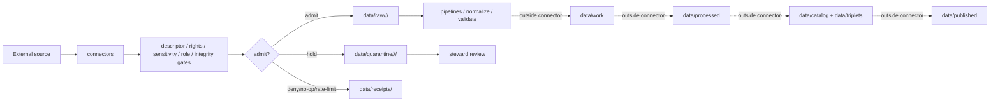

<!-- [KFM_META_BLOCK_V2]
doc_id: kfm://doc/connectors-readme
title: connectors/ — Source Admission Connectors
type: readme
version: v0.3
status: draft
owners: OWNER_TBD — Connector steward · Source steward · Data steward · Policy steward · Validation steward · Docs steward
created: 2026-06-20
updated: 2026-06-20
policy_label: public; implementation-root; source-admission; raw-quarantine-only
related:
  - ../docs/doctrine/directory-rules.md
  - ../docs/sources/ADMISSION_PROCESS.md
  - ../docs/sources/catalog/README.md
  - ../data/registry/sources/
  - ../data/raw/
  - ../data/quarantine/
  - ../data/receipts/
  - ../data/proofs/
  - ../policy/rights/
  - ../policy/sensitivity/
  - ../schemas/contracts/v1/source/
  - ../release/
tags: [kfm, connectors, source-admission, implementation-root, raw, quarantine, receipts, source-descriptor, trust-membrane, governance]
notes:
  - "v0.3 applies the uploaded KFM Repository Markdown Authoring Agent v2 README guidance to the connector-root contract."
  - "No-loss preservation: v0.2 authority, lifecycle, admission, rollback, and definition-of-done language is retained and expanded."
  - "Directory Rules identify connectors/ as an implementation root for source admission."
  - "Connectors may support external-source fetch/probe/admission behavior, but they do not own source doctrine, SourceDescriptor records, schemas, policy, catalog/triplet records, proofs, release decisions, public API behavior, or public UI behavior."
  - "Connector outputs are limited to raw, quarantine, and receipt handoffs unless an accepted ADR says otherwise."
  - "Concrete connector implementation status, inventories, tests, fixtures, CI coverage, schedules, and source activation remain NEEDS VERIFICATION unless proven per child lane."
[/KFM_META_BLOCK_V2] -->

<a id="top"></a>

# Connectors

> Source-specific fetch, probe, and admission support for KFM. Connectors are the external-source membrane; they do not publish, promote, certify, or serve public clients.

<p>
  
  
  
  
  
</p>

`connectors/`

## Quick jumps

[Status](#status) · [Scope](#scope) · [Repo fit](#repo-fit) · [Accepted inputs](#accepted-inputs) · [Exclusions](#exclusions) · [Current inspected snapshot](#current-inspected-snapshot) · [Directory tree](#directory-tree) · [Connector lane patterns](#connector-lane-patterns) · [Admission contract](#admission-contract) · [Lifecycle boundary](#lifecycle-boundary) · [Inspection path](#inspection-path) · [Required child README contract](#required-child-readme-contract) · [Validation](#validation) · [Evidence basis](#evidence-basis) · [Rollback](#rollback) · [Definition of done](#definition-of-done) · [Related surfaces](#related-surfaces)

---

## Status

> [!IMPORTANT]
> **Status:** `draft` / root contract  
> **Owner:** `OWNER_TBD`  
> **Path:** `connectors/`  
> **Authority level:** implementation root for source admission  
> **Truth posture:** `CONFIRMED` current README content and replacement README content; actual connector inventories, source activations, schedules, tests, fixtures, CI coverage, and runtime behavior remain `NEEDS VERIFICATION` unless proven in each child lane.

---

## Scope

`connectors/` contains source-specific implementation support for external-source fetch, probe, packaging, verification, and admission into KFM.

A connector may help answer:

- can this external source be reached or represented under a descriptor?
- what source identity, role, rights, sensitivity, cadence, and freshness posture applies?
- what raw payload, manifest, or pointer was captured?
- what receipt proves the probe, denial, no-op, rate limit, quarantine, or successful admission?
- what should be handed to downstream lifecycle stages for normalization and validation?

A connector must not answer whether admitted material is ready for processed state, catalog closure, triplet assertion, proof closure, publication, public API display, public UI display, or user-facing guidance.

---

## Repo fit

`connectors/` is an implementation root in the KFM authority map. It sits between external source surfaces and governed lifecycle data roots.

```text
External source
  -> connectors/<source-or-product>/
  -> data/raw/ or data/quarantine/ + data/receipts/
  -> pipelines/ or downstream validators
  -> data/work/
  -> data/processed/
  -> data/catalog/ + data/triplets/
  -> release/
  -> data/published/
```

Adjacent responsibility roots:

| Root | Relationship to `connectors/` |
|---|---|
| `docs/sources/catalog/` | Source-family and product doctrine. Connectors must not duplicate or replace it. |
| `data/registry/sources/` | SourceDescriptor and activation authority. Connectors consume or reference descriptors; they do not own them. |
| `policy/rights/`, `policy/sensitivity/` | Rights and sensitivity gates. Connectors must fail closed when these are unresolved. |
| `schemas/contracts/`, `contracts/` | Machine shape and object meaning. Connectors do not create parallel schema authority. |
| `data/raw/`, `data/quarantine/`, `data/receipts/` | Allowed connector handoff surfaces. |
| `data/work/`, `data/processed/`, `data/catalog/`, `data/triplets/`, `data/published/` | Downstream lifecycle surfaces outside connector ownership. |
| `release/` | Release decisions and rollback state, outside connector ownership. |

---

## Accepted inputs

| Belongs in `connectors/` | Required posture |
|---|---|
| Connector-family folders | Keep family/source placement documented; unresolved homes must be marked `NEEDS VERIFICATION` or ADR-class. |
| Product/source connector lanes | Preserve source identity, source role, cadence, rights, sensitivity, version, and receipt lineage. |
| Source clients | Descriptor-gated; no implicit activation; no public behavior. |
| Manifest parsers | Preserve source fields and digests; do not replace schemas or SourceDescriptors. |
| Run/probe receipt helpers | Emit evidence of source interaction; not proof closure. |
| Raw/quarantine handoff helpers | Write only to explicit raw/quarantine targets supplied by caller or orchestration. |
| No-network fixtures | Small, safe, deterministic; fixtures test behavior and do not become source authority. |
| README contracts | Every non-trivial connector lane should state authority, inputs, outputs, exclusions, validation, rollback, and status. |

---

## Exclusions

| Does not belong in `connectors/` | Correct responsibility root |
|---|---|
| Source catalog doctrine | `../docs/sources/catalog/` |
| SourceDescriptor records and activation decisions | `../data/registry/sources/` |
| Machine contracts and schemas | `../schemas/contracts/`, `../contracts/` after accepted placement |
| Rights and sensitivity policy | `../policy/rights/`, `../policy/sensitivity/` |
| Normalized work candidates | `../data/work/` or downstream pipeline roots |
| Processed domain records | `../data/processed/` |
| Catalog and triplet records | `../data/catalog/`, `../data/triplets/` |
| EvidenceBundle/proof closure | `../data/proofs/` and governed proof workflows |
| Published artifacts | `../data/published/` after release gates |
| Release decisions and rollback state | `../release/` |
| Public API or UI behavior | governed app/UI roots after release and policy gates |

---

## Current inspected snapshot

> [!NOTE]
> This is a current-session documentation snapshot, not a full connector implementation inventory. It records connector README surfaces that were directly edited or inspected during this documentation pass. Code modules, tests, workflows, schedules, emitted receipts, and runtime behavior remain `NEEDS VERIFICATION` unless separately cited in child lanes.

| Snapshot item | Status | What it proves | What it does not prove |
|---|---|---|---|
| `connectors/README.md` | `CONFIRMED` | Root README exists and is now a governed source-admission contract. | Does not prove connector implementation completeness. |
| Source-family lanes such as `connectors/usgs/`, `connectors/usfws/`, `connectors/nrcs/` | `CONFIRMED where README files exist` | Family-lane documentation exists for some sources. | Does not prove source activation or endpoint health. |
| Product lanes such as `connectors/wzdx/`, `connectors/viirs_hotspot/`, `connectors/usgs/water_data/` | `CONFIRMED where README files exist` | Product-lane boundary docs exist. | Does not settle path convention or implementation readiness. |
| Compound lanes such as `connectors/usgs_mrds/`, `connectors/usgs_ngmdb/` | `CONFIRMED where README files exist` | Compound-lane docs exist and preserve unresolved path posture. | Does not ratify the compound pattern. |
| `connectors/usgs/src/` and `connectors/usgs/tests/` | `CONFIRMED where README files exist` | Source-root and test-root boundary docs exist. | Does not prove package metadata, tests, fixtures, or CI wiring. |

---

## Directory tree

This tree is a partial, documentation-pass-oriented map. It is not a complete repository inventory.

```text
connectors/
├── README.md
├── usgs/
│   ├── README.md
│   ├── 3dep/
│   ├── nhdplus_hr/
│   ├── nlcd/
│   ├── padus/
│   ├── src/
│   ├── tests/
│   ├── water_data/
│   └── wbd_huc/
├── usgs_mrds/
├── usgs_ngmdb/
├── viirs_hotspot/
└── wzdx/
```

> [!IMPORTANT]
> Treat this as an inspected/adjacent-doc snapshot. A complete connector inventory should be generated by repository tooling before stronger claims are made.

---

## Connector lane patterns

Current connector work in this repo has multiple observed or draft patterns. This root README does not normalize or rename them by itself.

| Pattern | Example | Status |
|---|---|---|
| Family root | `connectors/usgs/`, `connectors/usfws/`, `connectors/nrcs/` | `CONFIRMED` where files exist; authority remains source-admission only. |
| Nested product lane | `connectors/usgs/3dep/`, `connectors/usgs/water_data/`, `connectors/usgs/wbd_huc/` | `draft` / `NEEDS VERIFICATION` until ratified by Directory Rules or ADR. |
| Compound source lane | `connectors/usgs_mrds/`, `connectors/usgs_ngmdb/` | `draft` / ADR-class path convention. |
| Flat product lane | `connectors/wzdx/`, `connectors/viirs_hotspot/`, `connectors/ssurgo/` | `draft` / path convention may require review. |
| Package source root | `connectors/usgs/src/` | implementation support only. |
| Tests root | `connectors/usgs/tests/` | offline connector behavior tests only. |

If a future migration consolidates these patterns, it must use an ADR or migration note with rollback, redirects, and child README updates. Do not infer canonical placement from convenience or topic name alone.

---

## Admission contract

Every connector lane must preserve, when available:

- source family and product identity;
- SourceDescriptor reference supplied by registry/admission tooling;
- source URL, package identity, endpoint family, or distribution surface;
- retrieval/import/probe timestamp;
- cadence/freshness posture;
- source role and sub-product role;
- rights and sensitivity posture;
- version, epoch, release, schema version, or source vintage;
- source-native identifiers;
- geometry/raster/network/time-series metadata where applicable;
- digest/checksum/signature inputs;
- no-op, failure, denial, skipped, rate-limit, quarantine, or admit receipts.

Connectors must fail closed when identity, rights, sensitivity, source role, freshness, endpoint behavior, schema version, or evidence posture cannot be resolved strongly enough for admission.

---

## Lifecycle boundary



Promotion is a governed state transition outside `connectors/`. Connectors may provide evidence for later gates, but they do not perform later gates.

---

## Inspection path

Use this root README to inspect connector posture without overclaiming implementation:

1. Start at `connectors/README.md` to confirm the root boundary.
2. Open the relevant source-family or product-lane README.
3. Check `docs/sources/catalog/<family>/` for product/source doctrine.
4. Check `data/registry/sources/` for the SourceDescriptor and activation decision.
5. Check `policy/rights/` and `policy/sensitivity/` for gates.
6. Check connector tests and fixtures for offline validation.
7. Check emitted receipts, manifests, proofs, and release records before relying on any public or downstream claim.

> [!CAUTION]
> Do not run live source activation, publish outputs, or expose connector material to public clients merely because a connector README exists.

---

## Required child README contract

Every non-trivial child connector README should include:

- KFM meta block;
- status and owners;
- source-admission purpose;
- placement posture and unresolved path issues;
- accepted inputs;
- explicit exclusions;
- source-role discipline;
- product-specific anti-collapse rules;
- output boundary;
- evidence basis;
- validation checklist;
- rollback path;
- definition of done.

Child README files must not claim implementation behavior unless verified from current repo evidence, tests, fixtures, logs, emitted receipts, or runtime artifacts.

---

## Validation

Before relying on a connector root or lane, verify:

- child folder exists and is in the intended responsibility root;
- child README states source-admission-only boundary;
- SourceDescriptor records exist and validate;
- endpoint/package behavior is current and tested or marked `NEEDS VERIFICATION`;
- imports have no unsafe side effects;
- default tests are offline and deterministic;
- rights and sensitivity gates fail closed;
- outputs are restricted to raw/quarantine/receipt handoffs;
- no processed/catalog/triplet/published/release/API/UI writes occur;
- run receipts exist for success, failure, denial, no-op, skipped, and rate-limited cases where applicable.

---

## Evidence basis

| Source | Status | Supports | Limits |
|---|---|---|---|
| Existing `connectors/README.md` v0.2 | `CONFIRMED` | Root purpose, source-admission authority boundary, lifecycle boundary, validation, rollback, and definition-of-done structure. | Needed fuller application of the uploaded README authoring standard. |
| Uploaded `KFM Repository Markdown Authoring Agent — Full Operating Prompt v2` | `CONFIRMED` | README-like docs should be evidence-grounded, preserve strong material, include repo fit, accepted inputs, exclusions, impact block, diagrams/tables where useful, verification, and rollback. | Does not prove connector implementation exists. |
| `docs/doctrine/directory-rules.md` | `CONFIRMED` | `connectors/` is shown as an implementation root for source admission, with connectors feeding the governed data lifecycle. | Directory Rules do not prove any connector implementation is complete. |
| `docs/sources/ADMISSION_PROCESS.md` | `CONFIRMED` | Admission decides whether material may enter under identity, role, rights, sensitivity, and cadence before touching `data/raw/`; admission is not promotion or publication. | Standard doc does not activate sources or prove connector tests. |

---

## Rollback

Rollback is required if this README is used to justify direct publication, direct public-client access, bypass of SourceDescriptor/policy/schema gates, or connector ownership of processed/catalog/triplet/proof/release authority.

Rollback target: v0.2 content SHA `01953f857db053dccd83b8de1c81177e5fd609d0`.

Prior stub rollback target: `465b004a56b1119e5cf7e00a34e3f9a7cb132dbb`.

---

## Definition of done

- [ ] Owners are confirmed and `OWNER_TBD` is replaced.
- [ ] Complete connector inventory is generated and reviewed.
- [ ] Child README files are complete or marked `NEEDS VERIFICATION`.
- [ ] Path-pattern drift is recorded in an ADR, path map, or drift register.
- [ ] SourceDescriptor references are verified for activated sources.
- [ ] Rights and sensitivity gates are verified.
- [ ] Offline fixture tests cover default connector behavior.
- [ ] Output-boundary tests prove no processed/catalog/triplet/published/release/API/UI writes occur from connectors.
- [ ] Run/probe receipts are emitted for success, failure, denial, no-op, skipped, and rate-limited cases where applicable.
- [ ] CI behavior is verified or marked `NEEDS VERIFICATION`.

---

## Related surfaces

| Surface | Why it matters |
|---|---|
| `../docs/doctrine/directory-rules.md` | Placement, lifecycle, and authority-root doctrine. |
| `../docs/sources/ADMISSION_PROCESS.md` | Source admission gate sequence and membrane. |
| `../docs/sources/catalog/README.md` | Source-family and product doctrine index. |
| `../data/registry/sources/` | SourceDescriptor and activation decisions. |
| `../policy/rights/`, `../policy/sensitivity/` | Rights and sensitivity policy gates. |
| `../data/receipts/`, `../data/proofs/` | Run evidence and proof/evidence families. |
| `../release/` | Release decisions and rollback posture. |

---

## Status summary

`connectors/` is the KFM implementation root for source-specific fetch, probe, and admission support. It is not source doctrine, SourceDescriptor authority, schema authority, policy authority, lifecycle truth, catalog/triplet authority, proof closure, release authority, public API behavior, public UI behavior, public map behavior, or publication authority.

<p align="right"><a href="#top">Back to top</a></p>
