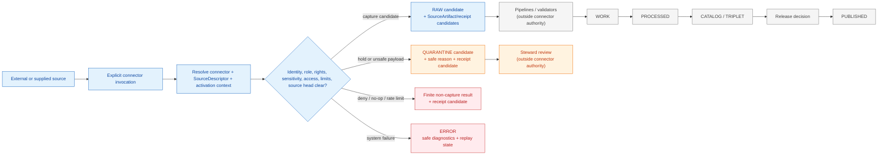

<!-- [KFM_META_BLOCK_V2]
doc_id: kfm://doc/connectors-readme
title: connectors/ — Source-Specific Fetch, Capture, and Admission Implementation
type: readme; directory-readme; canonical-root-landing-page
version: v0.7
prior_version: v0.6
status: repository-grounded; canonical-active-projection; mixed-maturity; internal-core-implemented; partial-no-network-enforcement; connector-run-receipt-presence-held; non-publisher
owners: "NEEDS VERIFICATION — Root Registry and CODEOWNERS route connectors/ to @bartytime4life; accepted source stewards, rights reviewers, domain owners, security reviewers, and independent release approvers remain unverified"
created: 2026-06-20
updated: 2026-08-08
supersedes: v0.6 documentation at the same path; no connector implementation, source activation, SourceDescriptor, schema, contract, policy, fixture, validator, workflow, receipt instance, lifecycle object, release decision, runtime behavior, or public behavior is superseded
policy_label: repository-facing; source-edge; internal; descriptor-gated; rights-aware; sensitivity-aware; no-network-by-default; raw-quarantine-receipt-only; non-publisher
current_path: connectors/README.md
owning_root: connectors/
root_class: canonical
root_registry_id: root.connectors
responsibility: source-specific fetch, probe, transport, source-native parsing, capture, and pre-RAW admission implementation that may hand candidates only to governed RAW, QUARANTINE, or receipt surfaces
truth_posture: cite-or-abstain; path, package, test, workflow, or successful transport evidence does not prove source authority, activation, rights clearance, evidence closure, lifecycle promotion, release, publication, or public fitness
evidence_snapshot:
  repository: bartytime4life/Kansas-Frontier-Matrix
  visibility: public
  base_ref: main
  base_commit: 753cda68c468e8d01457c38e563c107a437aa608
  root_tree: 637f840667060074adc91564ae3b709b7d84ff9e
  connectors_tree: a42079263e682022cd0cab3c22456d5c805ce637
  prior_blob: 11184062e9917b5cc34c6d73b67dbc0ef995f913
  direct_child_directories: 104
  direct_child_files: 1
  directory_rules_blob: fd49a0b83e55cef52c1124281f093e263526898d
  directory_rules_decision: ADR-0029 accepted
  root_registry_blob: 024f668b5f0a9239bafa4f8b09e2afd86300ff8c
  connector_gate_workflow_blob: e3a1082c0f59aa47b903c5bf71d058a49e6ceb11
  connectors_core_tree: 45e044d1d6013e48e68b21051b0ad8d14b93ac5e
  connectors_core_pyproject_blob: ea94c0b24f50a68f3d59becbb34625c42298d7d9
  source_artifact_contract_blob: 9f5e2f082fa2a3aaf94c1e9d879b0a0baa797639
  source_artifact_schema_blob: f451ccbcd7543896cffb98e6abbca23f61432fa3
  source_artifact_workflow_blob: d6fc7cd1658319cbde1c4958d31a73d77bb7f658
  source_authority_register_blob: 82c23722520922f5ca0dad7f37ed794d1c2edf81
  codeowners_blob: dd2a84aa514d8ecd9208bc347f90f9a2ed37dd61
related:
  - ../docs/doctrine/directory-rules.md
  - ../docs/adr/ADR-0029-adopt-directory-governance-standard-v2.md
  - ../control_plane/root_registry.yaml
  - ../docs/sources/ADMISSION_PROCESS.md
  - ../docs/sources/catalog/README.md
  - ../data/registry/sources/README.md
  - ../control_plane/source_authority_register.yaml
  - ../contracts/source/README.md
  - ../schemas/contracts/v1/source/
  - ../schemas/contracts/v1/sources/
  - ../packages/connectors-core/README.md
  - ../tools/validators/connector_gate/README.md
  - ../.github/workflows/connector-gate.yml
  - ../release/README.md
notes:
  - "This is a same-path Markdown modernization and evidence reconciliation. It changes no connector code, package, schema, contract, policy, fixture, validator, workflow, source registry entry, receipt instance, lifecycle object, release object, or public interface."
  - "ADR-0029 adopts docs/doctrine/directory-rules.md as the sole writable human Directory Rules authority. The Root Registry is a machine projection and cannot expand connector authority."
  - "The exact direct-child inventory is verified at the pinned connectors tree and records 104 directories plus this README. The inventory exposes naming and alias drift; it does not decide migrations."
  - "packages/connectors-core is no longer a 0.0.0 placeholder. At the pinned base it is a 0.0.1 internal, no-network implementation with primitives, injected transport, and SourceArtifact handoff, while stable package exports, concrete live transport, source-specific adoption, persistence, and release effects remain unproved."
  - "The current SourceDescriptor singular and plural schema metadata point at each other as canonical/implementation homes. This circular authority claim remains CONFLICTED and is not resolved by this README."
[/KFM_META_BLOCK_V2] -->

<a id="top"></a>

# Connectors

> **One-line purpose.** `connectors/` owns source-specific fetch, probe, transport, source-native parsing, capture, and pre-RAW admission implementation. A connector may produce a governed RAW candidate, QUARANTINE candidate, or receipt-ready finite result; it never creates truth, evidence closure, promotion, release, publication, or a public client path.

**Quick navigation:** [Purpose](#purpose) · [Authority](#authority-level) · [Status](#status) · [Belongs](#what-belongs-here) · [Does not belong](#what-does-not-belong-here) · [Inputs](#inputs) · [Outputs](#outputs) · [Validation](#validation) · [Review](#review-burden) · [Related roots](#related-folders) · [ADRs](#adrs) · [Last reviewed](#last-reviewed) · [Direct children](#direct-child-directory-map) · [Topology](#connector-topology-and-lane-classes) · [Lifecycle](#admission-and-lifecycle-flow) · [Conflicts](#current-conflicts-and-maturity-limits) · [Child contract](#child-readme-contract) · [Rollback](#correction-and-rollback) · [Open work](#open-verification-register)

> [!IMPORTANT]
> **Safe current conclusion:** the repository contains a canonical `connectors/` root, an active Root Registry projection, 104 direct connector directories, a bounded no-network `connectors-core` implementation, SourceArtifact contract/schema/validation surfaces, and partial connector-gate enforcement. It does **not** yet prove a synchronized root-wide source-admission runtime, an active source register, universal source-specific consumers, connector-emitted receipt persistence, live source fitness, release readiness, or publication.

> [!CAUTION]
> A connector path, endpoint string, README, package, test, workflow, successful HTTP status, digest, or captured byte stream does not authorize source use. Source identity, role, rights, sensitivity, access terms, activation state, completeness strategy, evidence treatment, and correction posture must be resolved before a live invocation can be treated as admissible.

> [!NOTE]
> `packages/connectors-core` is implemented as an internal `0.0.1` no-network package at the pinned base, but its package root intentionally exports no stable public surface and it includes no concrete live transport. Treat its primitives as bounded implementation evidence, not as proof that connector lanes are integrated or operational.

---

<a id="scope"></a>

## Purpose

`connectors/` is KFM's canonical implementation root for the **source edge**. It exists to make acquisition behavior explicit, bounded, testable, source-role-aware, and separable from downstream truth and publication systems.

A connector should answer, with reviewable evidence:

- which exact source family, product, distribution, endpoint, archive, package, or supplied input it serves;
- which governed source identity and activation context authorize the requested operation;
- which source-native identifiers, fields, geometries, times, flags, manifests, and byte identities it preserves;
- which rights, terms, attribution, consent, privacy, sensitivity, and precision constraints apply;
- how requests, bytes, records, pages, retries, redirects, time, memory, and cancellation are bounded;
- how source head, completeness, freshness, drift, conflicts, and corrections are represented;
- which finite result occurred;
- which RAW, QUARANTINE, or receipt candidate was produced;
- how replay can identify the prior run without duplicating captures;
- why the connector did **not** perform any later lifecycle, proof, release, or public write.

The root does not turn source material into a KFM-grade claim. It preserves source-native material and process memory for downstream validation, evidence resolution, policy, review, promotion, correction, and release.

[Back to top](#top)

---

<a id="repo-fit"></a>

## Authority level

**Canonical implementation root with narrow source-edge authority.**

| Field | Current posture |
|---|---|
| Root class | `canonical`; class default `ACTIVE` in the Root Registry projection |
| Root registry ID | `root.connectors` |
| Primary responsibility | Source-specific fetch, capture, and admission implementation |
| Permitted artifact kind | `source_connector` |
| Prohibited artifact kinds | Deployable application, pipeline, release decision |
| Exposure | Internal |
| Mutation | Versioned |
| Retention | Repository lifetime |
| Validation profile | `source_admission_only` |
| Current GitHub routing | `/connectors/` → `@bartytime4life` |
| Accepted source stewards and independent release approvers | **NEEDS VERIFICATION** |
| Public-client role | None |
| Publication role | None |

### Directory Rules basis

ADR-0029 accepts the current `docs/doctrine/directory-rules.md` bytes and makes that file the sole writable human Directory Rules authority. The adopted dependency and write-capability rules constrain connectors to shared packages, source contracts, schemas, and admission policy, while direct durable writes end at RAW or QUARANTINE candidates plus ingest receipts.

The active Root Registry projects those rules for `connectors/`; it does not create source authority, activate a connector, grant credentials, admit a source, authorize a lifecycle transition, or release data.

### Authority split

| Question | Owning surface | Connector relationship |
|---|---|---|
| What does a source or ingest object mean? | [`contracts/source/`](../contracts/source/) | Consume the accepted meaning; do not redefine it locally |
| What machine shape is valid? | [`schemas/contracts/v1/source/`](../schemas/contracts/v1/source/) and accepted aliases | Produce or consume validated candidates; do not mint a parallel schema |
| Is a source active, allowed, restricted, or denied? | source registry, policy, and accepted review/activation decisions | Require a resolvable decision; do not self-activate |
| Where do exact captures and held material go? | [`data/raw/`](../data/raw/) and [`data/quarantine/`](../data/quarantine/) | Hand off candidates only through caller-owned, governed sinks |
| Where does process memory go? | [`data/receipts/`](../data/receipts/) | Produce receipt-ready metadata; authoritative persistence is owned elsewhere |
| Who normalizes or joins sources? | [`pipelines/`](../pipelines/README.md) and shared packages | Preserve source-native data; do not perform cross-source truth resolution |
| Who proves evidence or citation closure? | proof/evidence producers and [`data/proofs/`](../data/proofs/) | Provide refs and hashes only |
| Who releases or corrects public state? | [`release/`](../release/README.md) | No self-approval, release, correction, withdrawal, or rollback decision |
| Who serves the public? | governed application/runtime and released carriers | No direct connector-to-browser, map, export, or AI path |

### Exposure, sensitivity, mutability, and storage

- Source credentials and resolved secret values never enter repository bytes, fixtures, logs, URLs, or receipts.
- Sensitive or restricted payloads default to deny or quarantine until a qualified review supports a narrower posture.
- Exact captures are immutable by identity; corrections create new artifacts and preserve supersession/conflict lineage.
- Connector code is versioned; generated or captured data is not stored under `connectors/`.
- Physical storage may be external, but logical ownership and lifecycle placement remain explicit.
- A connector must not infer public-safe geometry from a style filter or client-side hiding.

[Back to top](#top)

---

<a id="current-inspected-snapshot"></a>

## Status

### Repository snapshot

| Field | Verified value |
|---|---|
| Repository/base | `bartytime4life/Kansas-Frontier-Matrix@753cda68c468e8d01457c38e563c107a437aa608` |
| Root tree | `637f840667060074adc91564ae3b709b7d84ff9e` |
| `connectors/` tree | `a42079263e682022cd0cab3c22456d5c805ce637` |
| Prior README blob | `11184062e9917b5cc34c6d73b67dbc0ef995f913` |
| Direct children | 104 directories plus this README |
| Root Registry | `root.connectors`, canonical, ACTIVE by class default, `source_admission_only` |
| CODEOWNERS route | `@bartytime4life` |
| Connector-gate workflow | Present; bounded static and no-network checks |
| Shared connector core | `packages/connectors-core` version `0.0.1`; internal, no stable root export |
| SourceArtifact profile | Proposed semantic contract, closed schema, validator/tests, no-network workflow |
| Source authority register | Present but `PROPOSED` and empty (`entries: []`) |
| SourceDescriptor authority | **CONFLICTED** by circular singular/plural canonical metadata |
| Active source coverage | **UNKNOWN** |
| Live network execution and emitted connector receipts | **UNKNOWN / not established by this review** |
| Release or publication effect | None |

### Maturity matrix

| Capability | Status | Safe conclusion |
|---|---:|---|
| Root placement and responsibility | **CONFIRMED** | Existing same-path root matches adopted Directory Rules and Root Registry projection |
| Direct-child inventory | **CONFIRMED at pinned tree** | 104 directories exist; presence does not establish implementation or activation |
| Root documentation | **CONFIRMED** | Root boundary and child README contract exist |
| Shared primitives | **CONFIRMED, bounded** | Header parsing, source-head identity, retry planning, streamed hashing/limits, integrity results, and redaction exist in internal code |
| Injected transport layer | **CONFIRMED, bounded** | Request/response profiles, HTTPS host admission, finite retries, source-head handling, and secret-safe results exist without a concrete HTTP client |
| Retrieval-to-SourceArtifact handoff | **CONFIRMED, bounded** | Exact successful GET bytes may become a candidate with deterministic non-effects; no persistence or lifecycle authority is created |
| SourceArtifact contract/schema/validator | **CONFIRMED as proposed implementation** | Closed shape, deterministic identity, byte binding, temporal/lineage checks, and no-network workflow exist |
| IngestReceipt validator prerequisite | **CONFIRMED, partial** | Validator and fixture polarity run before the receipt-presence hold |
| Connector-run receipt presence/persistence | **HELD / NEEDS VERIFICATION** | No universal emitted instance, governed storage route, replay, correction, or signing proof is established |
| Static non-publisher enforcement | **CONFIRMED, partial** | Selected statically resolved repository paths are checked against RAW/QUARANTINE/receipts |
| Runtime confinement | **UNKNOWN** | Dynamic targets, external sinks, symlinks, indirect writes, every language, and runtime effects are not closed |
| Source registration and activation | **UNKNOWN / incomplete** | Empty machine register and detailed docs do not establish active sources |
| Source rights/currentness across lanes | **NEEDS VERIFICATION per lane** | Root documentation cannot settle volatile provider terms or endpoint fitness |
| Downstream evidence/release integration | **UNKNOWN** | No root-wide EvidenceRef-to-release proof is established |
| Public serving | **DENIED by boundary** | Connectors are not public APIs, maps, exports, alerts, or AI surfaces |

### Material corrections from v0.6

- `packages/connectors-core` is no longer accurately described as a `0.0.0` placeholder. The pinned repository contains a `0.0.1` internal implementation and focused tests.
- The current connector gate imports and tests core primitives, injected transport, and SourceArtifact handoff in addition to the static non-publisher and receipt-validator checks.
- The SourceArtifact family now has a proposed semantic contract, closed schema, exact-byte validator, fixtures, tests, local reference CAS tooling, and a read-only no-network workflow.
- SourceDescriptor authority is more precisely classified as a circular metadata conflict: the singular schema points to the plural path as canonical, while the plural alias points back to the singular implementation schema.
- ADR-0029 and the active Root Registry now provide accepted placement evidence for the existing root.
- The current exact direct-child inventory is recorded rather than described only through representative lanes.
- None of these corrections upgrades a source to active, proves live execution, closes rights review, creates an authoritative receipt, or establishes release/publication readiness.

> [!IMPORTANT]
> Root maturity is flow-specific. A shared package, a closed schema, and green no-network checks are meaningful implementation evidence, but they do not collapse source identity, activation, transport, capture, receipt persistence, evidence, policy, release, and publication into one “implemented” label.

[Back to top](#top)

---

<a id="accepted-inputs"></a>

## What belongs here

Files belong under `connectors/` when their primary responsibility is **source-specific fetch, probe, transport, source-native parsing, capture, or admission handoff**.

Permitted material includes:

- source-family coordination lanes that preserve distinct products and source roles;
- product-, distribution-, endpoint-, package-, feed-, archive-, or upload-specific connector lanes;
- source-specific clients and parsers with explicit network, resource, and side-effect behavior;
- source-native identifier, field, geometry, raster, network, time-series, pagination, and manifest preservation logic;
- reviewed provider/distribution profiles whose current terms and access posture are recorded elsewhere;
- source-head and integrity observations such as ETag, Last-Modified, upstream version, revision ID, content length, manifest checksum, and content digest;
- finite source-interaction results that distinguish capture, no-op, denial, hold, rate limit, incomplete response, stale state, source conflict, and operational error;
- connector-local package metadata and implementation roots when they serve one source lane;
- no-network fixtures and connector behavior tests using synthetic, redacted, public-domain, or redistribution-safe samples;
- adapters that construct candidate RAW, QUARANTINE, SourceArtifact, or receipt payloads from accepted contracts;
- child READMEs that state source role, rights, sensitivity, network posture, outputs, validation, correction, and rollback.

A file belongs here because it is source-specific implementation—not merely because it mentions an agency, domain, data product, endpoint, or download.

[Back to top](#top)

---

<a id="exclusions"></a>

## What does NOT belong here

| Prohibited content | Correct responsibility |
|---|---|
| Source doctrine presented as authority | [`docs/sources/catalog/`](../docs/sources/catalog/README.md) or reviewed domain/source docs |
| Canonical `SourceDescriptor`, activation decision, source-authority, rights, or sensitivity records | [`data/registry/`](../data/registry/), `control_plane/`, policy, and accepted decision homes |
| Semantic object definitions | [`contracts/`](../contracts/README.md) |
| Machine-shape authority | [`schemas/`](../schemas/README.md) |
| Shared source-agnostic primitives | [`packages/`](../packages/README.md) after a real reusable boundary is proved |
| Generic validators or admission gates | [`tools/validators/`](../tools/validators/README.md) |
| Declarative schedules/run graphs | [`pipeline_specs/`](../pipeline_specs/README.md) |
| Cross-source normalization, joins, identity resolution, or domain transformation | [`pipelines/`](../pipelines/README.md) and shared implementation packages |
| WORK or PROCESSED records | [`data/work/`](../data/work/) and [`data/processed/`](../data/processed/) |
| Catalog, STAC/DCAT/PROV, triplet, graph, or search authority | [`data/catalog/`](../data/catalog/) and [`data/triplets/`](../data/triplets/) |
| EvidenceBundle, proof pack, or citation-closure authority | [`data/proofs/`](../data/proofs/) |
| Release, promotion, correction, withdrawal, rollback, or signature decisions | [`release/`](../release/README.md) |
| Published layers, PMTiles, GeoParquet, reports, stories, API payloads, or exports | [`data/published/`](../data/published/) after governed release |
| Public API, UI/map component, dashboard, alert, export, or AI answer | Governed app/runtime roots |
| Secret values, tokens, private keys, cookies, signed URLs, or embedded credentials | Approved secret-management systems, never repository files |
| Real protected precision or private living-person/DNA payloads in docs/tests | Denied; use synthetic/redacted fixtures in the correct fixture root |
| A second source identity, package, registry, schema, policy, or receipt authority through an alias path | Compatibility/migration documentation only until governed disposition |

[Back to top](#top)

---

## Inputs

A mature connector invocation should receive an explicit, immutable, reviewable packet. The repository does not yet establish one universal connector-input schema, so the profile below is **PROPOSED** and must be specialized by accepted contracts.

| Input class | Minimum governed context | Fail-closed trigger |
|---|---|---|
| Requested action | Probe, fetch, import, inspect local package, resume, or replay; stable run/request ID | Implicit or overbroad operation |
| Connector identity | Source family, product/distribution, connector/package version, source-specific entrypoint | Unknown or alias-resolved-to-multiple implementations |
| Source authority | `SourceDescriptor` ref and applicable activation/review decision | Missing, stale, conflicted, inactive, denied, or unresolvable |
| Source role and scope | Allowed claim roles, domain scope, spatial/temporal limits, source-native identifiers | Role collapse or scope expansion |
| Rights and sensitivity | Terms/license snapshot or ref, attribution, redistribution, consent, sensitivity/default precision | Unknown, expired, revoked, incompatible, or insufficiently reviewed |
| Access plan | Reviewed host/local input, method, safe parameter names, auth reference, user agent, limits, pagination/completeness strategy | Undeclared host, secret value, unsafe automation, or service-use mismatch |
| Resource controls | Request, byte, record, page, time, retry, deadline, memory, cancellation limits | Unbounded operation |
| Source-head strategy | ETag, Last-Modified, version, revision, checksum, digest, or documented not-applicable reason | Missing drift/content-identity strategy where required |
| Output sinks | Caller-owned RAW, QUARANTINE, and receipt candidate destinations | Connector chooses later lifecycle or public targets |
| Deterministic dependencies | Injected transport, clock, sleeper, jitter, cancellation, filesystem/archive interfaces, parser limits | Hidden network, clock, randomness, or write effect |
| Correction/replay | Prior run/source-head refs, supersession/correction state, expected identity | Prior state or rollback target cannot be identified |

> [!CAUTION]
> Repository files may name an endpoint without authorizing its use. Current terms, rate limits, account requirements, automation conditions, and data redistribution rules must be verified for the exact lane before activation or live execution.

[Back to top](#top)

---

## Outputs

The direct connector boundary ends at governed RAW or QUARANTINE handoff plus receipt/process-memory candidates. Authoritative shapes and sink ownership come from accepted contracts and orchestration; this README does not create an enum or receipt schema.

| Output family | Required posture | Authority limit |
|---|---|---|
| RAW capture candidate | Preserve exact source-native bytes/records, source identity, retrieval metadata, completeness state, source-head facts, content digest, and intended route | Not normalized truth, evidence closure, processed state, or public data |
| QUARANTINE candidate | Preserve held payload/ref, safe reason families, unresolved dependencies, and steward route | Never discard silently or auto-promote |
| SourceArtifact candidate | Bind exact nonempty bytes to deterministic identity, safe locator, rights snapshot, parser identity, lineage, and fixed non-effects | Proposed internal verification object; not source admission, evidence, lifecycle transition, or public use |
| Connector/ingest receipt candidate | Preserve operation, inputs, source head, connector/tool identity, limits, timing, hashes, outcome, and safe diagnostics | Process memory; not proof, activation, promotion, or release |
| No-op | Bind the observed source head and explain why no capture is needed | Not a universal claim that upstream content is unchanged |
| Deny/hold/abstain | Preserve safe reason families and unresolved refs | Do not leak protected details or fall back to allow |
| Rate-limit/retry | Preserve provider response class, bounded retry eligibility, deadline, and attempts | Never evade controls or retry without bounds |
| Operational error | Preserve safe failure class, partial-state disposition, cleanup, and replay instructions | Never emit incomplete RAW as success |

Direct writes or hidden effects to these surfaces are prohibited:

```text
data/pre_raw/
data/work/
data/processed/
data/catalog/
data/triplets/
data/proofs/
data/registry/
data/published/
data/rollback/
release/
public API / UI / map / export / AI surfaces
```

`data/pre_raw/` is named here as a denied connector output path; the adopted Directory Rules do not grant that path as a canonical lifecycle home.

[Back to top](#top)

---

## Validation

### Current executable checks

| Surface | Current behavior | What it proves | What it does not prove |
|---|---|---|---|
| [`connector-gate.yml`](../.github/workflows/connector-gate.yml) | Installs repository test dependencies and `packages/connectors-core`; compiles/imports core, transport, and artifact-handoff modules; runs focused core tests, static non-publisher tests, and IngestReceipt validator/fixture checks | Bounded no-network implementation and static trust-boundary checks execute together | Live connectors, rights, activation, runtime confinement, persistence, evidence closure, release |
| [`tests/packages/connectors_core/`](../tests/packages/connectors_core/) | Covers core primitives, import surface, transport success/failure/retry/safety, and artifact handoff | Deterministic internal behavior for the tested package scope | Stable public exports, concrete HTTP transport, source-specific consumers, real network behavior |
| [`test_pipeline_connector_non_publisher.py`](../tests/policy/test_pipeline_connector_non_publisher.py) | Exercises selected Python, shell, and YAML path findings plus a legacy lexical canary | Positive/negative static cases and bounded repository-path evidence | Dynamic/external/URI targets, symlinks, indirect writes, every language, runtime side effects |
| `connector-gate.yml` — `ingest-receipt-presence` | Requires the prerequisite job, then records `CONNECTOR_RECEIPT_PRESENCE_HELD` | Receipt presence cannot appear green after failed prerequisites | A connector-emitted receipt, governed persistence, replay, correction, signing, or authority |
| [`SourceArtifact` workflow](../.github/workflows/source-artifact-validation.yml) | Runs no-network contract/schema/validator/fixture tests and exact synthetic byte binding | Closed proposed shape, deterministic identity, locator/time/lineage rules, local reference CAS | Source admission, truth, evidence closure, lifecycle mutation, release, public use |
| [`validate_source_descriptor.py`](../tools/validators/validate_source_descriptor.py) | Validates supplied files or existing fixture polarity against the fielded singular schema | Wrapper and fixture family are executable | Accepted schema authority, activation, role correctness beyond shape, or registry completeness |
| Child-lane tests | Mixed and lane-specific | Only the exact behavior each inspected lane test executes | Root-wide connector correctness |

### Repository-native commands

```bash
python -m pip install -e ".[test]"
python -m pip install -e "./packages/connectors-core"

python -m compileall -q \
  packages/connectors-core/src/connectors_core

python -m pytest \
  tests/packages/connectors_core \
  tests/policy/test_pipeline_connector_non_publisher.py \
  tests/validators/test_validate_ingest_receipt.py \
  -q --strict-config --strict-markers

python tools/validators/validate_ingest_receipt.py --fixtures
python tools/validators/validate_source_descriptor.py --fixtures

python -m unittest discover \
  --start-directory tests/validators \
  --pattern 'test_validate_source_artifact.py' \
  --verbose

python tools/validators/validate_source_artifact.py --fixtures
```

The commands are the current documented changed-area surfaces, not proof that every environment, connector, source, or workflow succeeds. Install and test steps should remain credential-scrubbed and no-network except for approved package retrieval.

### Minimum readiness evidence for a connector lane

- stable connector/source/product/alias identity;
- accepted descriptor and activation context;
- no live network in default unit tests or imports;
- rights-safe fixtures and explicit source-role negative cases;
- bounded host, redirect, retry, timeout, cancellation, byte/record/page, and completeness behavior;
- source-head, pagination, truncation, stale, schema-drift, and conflict tests;
- RAW, QUARANTINE, no-op, deny/hold, rate-limit, and error outcomes;
- forbidden later-lifecycle and public-write tests;
- receipt binding across operation, connector version, descriptor, source head, inputs, output IDs/digests, limits, and outcome;
- replay/correction identity without duplicate captures;
- observed workflow result at the exact revision;
- source-owner, rights/sensitivity, security, domain, and release review appropriate to consequence.

> [!IMPORTANT]
> A green check is evidence for its assertions. It is not a `SourceActivationDecision`, source-rights approval, ingest receipt instance, `EvidenceBundle`, promotion decision, release approval, or publication proof.

[Back to top](#top)

---

## Review burden

CODEOWNERS and the Root Registry currently route `connectors/` to `@bartytime4life`. Routing is not proof of source stewardship, rights clearance, independent review, or release authority.

| Change class | Minimum review posture |
|---|---|
| README-only clarification | Connector-aware maintainer and docs review |
| Source-specific parsing or transport | Connector/source maintainer, affected domain owner, validation reviewer |
| New endpoint, provider, distribution, automation method | Source steward, rights/terms reviewer, security reviewer, affected domain reviewer |
| Credentials, accounts, protected local inputs | Security/identity review; secrets remain external |
| Sensitive people/DNA, archaeology, rare species, infrastructure, private land, or protected precision | Qualified specialist plus policy/sensitivity review; fail closed without ownership |
| Source role, authority class, or admissibility | Source/domain/evidence review and contract/schema/policy alignment |
| Shared connectors-core change | Package owner, representative consumers, compatibility and test review |
| Alias, path, package namespace, or source-ID migration | Directory-governance review, migration/deprecation plan, reference repair, rollback; ADR when authority changes |
| Contract/schema/reason/receipt/policy change | Owning authority maintainers plus fixtures, validators, consumers, and migration review |
| Source activation, promotion, release, correction, rollback | Separate governing decision; connector authors do not approve their own public release |

Escalate unresolved rights, sensitivity, source identity, alias ownership, or public-precision questions before live use. Accepted steward assignments, required reviews, and separation-of-duty enforcement remain **NEEDS VERIFICATION**.

[Back to top](#top)

---

<a id="related-surfaces"></a>

## Related folders

| Surface | Relationship |
|---|---|
| [Directory Rules](../docs/doctrine/directory-rules.md) | Adopted placement, dependency, write-capability, README, migration, and validation doctrine |
| [ADR-0029](../docs/adr/ADR-0029-adopt-directory-governance-standard-v2.md) | Accepts the current Directory Rules bytes |
| [Root Registry](../control_plane/root_registry.yaml) | Machine projection classifying `root.connectors`; not authority by itself |
| [Source Admission Process](../docs/sources/ADMISSION_PROCESS.md) | Human pre-RAW admission guidance; not implementation proof |
| [`docs/sources/catalog/`](../docs/sources/catalog/README.md) | Source-family/product doctrine |
| [`data/registry/sources/`](../data/registry/sources/README.md) | Source identity, role, rights, sensitivity, cadence, registry instances |
| [`source_authority_register.yaml`](../control_plane/source_authority_register.yaml) | Machine source-authority index; currently proposed and empty |
| [`contracts/source/`](../contracts/source/) | Source and ingest semantics |
| [`schemas/contracts/v1/source/`](../schemas/contracts/v1/source/) | Fielded source schemas and SourceArtifact profile |
| [`schemas/contracts/v1/sources/`](../schemas/contracts/v1/sources/) | SourceDescriptor alias lane participating in the current authority conflict |
| [`packages/connectors-core/`](../packages/connectors-core/README.md) | Internal `0.0.1` shared primitives, injected transport, and artifact handoff; no stable root export |
| [`tests/packages/connectors_core/`](../tests/packages/connectors_core/) | Focused no-network tests for the shared package |
| [`tools/validators/connector_gate/`](../tools/validators/connector_gate/README.md) | Bounded static output-path scanner |
| [`SourceArtifact` contract](../contracts/source/source_artifact.md) | Proposed exact-captured-byte semantic boundary |
| [`SourceArtifact` schema](../schemas/contracts/v1/source/source_artifact.schema.json) | Closed machine shape |
| [`SourceArtifact` validator](../tools/validators/validate_source_artifact.py) | Deterministic shape/semantic/byte-binding checks |
| [`connector-gate.yml`](../.github/workflows/connector-gate.yml) | Partial connector/core/receipt prerequisite enforcement |
| [`source-artifact-validation.yml`](../.github/workflows/source-artifact-validation.yml) | Separate no-network SourceArtifact validation |
| [`pipelines/`](../pipelines/README.md) | Normalization and later lifecycle work |
| [`release/`](../release/README.md) | Release/correction/withdrawal/rollback decisions outside connector authority |

[Back to top](#top)

---

## ADRs

| Decision record | Status | Relevance |
|---|---:|---|
| [`ADR-0029 — Adopt Directory Governance Standard v2`](../docs/adr/ADR-0029-adopt-directory-governance-standard-v2.md) | **ACCEPTED** | Governs current root placement and machine projection |
| [`ADR-0017 — Source Descriptor Admission Process`](../docs/adr/ADR-0017-source-descriptor-admission-process.md) | **PROPOSED** | Descriptor/record admission model; not accepted authority |
| [`ADR-0001 — Schema Home`](../docs/adr/ADR-0001-schema-home--schemas-contracts-v1-is-canonical.md) | **PROPOSED** | Relevant to circular singular/plural SourceDescriptor metadata |
| [`ADR-0003 — Singular Policy Root`](../docs/adr/ADR-0003-policy-singular-is-canonical-%28policies-is-compatibility%29.md) | **PROPOSED** | Policy-root compatibility; does not activate source policy |
| Connector alias/source-ID normalization | **NOT ACCEPTED / NEEDS VERIFICATION** | Required before universal family/product/alias topology claims |
| Root-wide connector outcome and receipt normalization | **NOT ACCEPTED / NEEDS VERIFICATION** | Required before one machine outcome/receipt contract is claimed |

This README records evidence and open decisions. It does not accept a proposed ADR, resolve aliases, activate a source, or migrate paths through prose.

[Back to top](#top)

---

## Last reviewed

**2026-08-08**

Evidence snapshot: `main@753cda68c468e8d01457c38e563c107a437aa608`, root tree `637f840667060074adc91564ae3b709b7d84ff9e`, connector tree `a42079263e682022cd0cab3c22456d5c805ce637`, prior README blob `11184062e9917b5cc34c6d73b67dbc0ef995f913`.

Reviewed:

- complete v0.6 target bytes and legacy anchors;
- accepted ADR-0029, current Directory Rules, and Root Registry projection;
- exact direct-child inventory;
- connector-gate workflow and bounded hold semantics;
- `connectors-core` package metadata, source tree, internal contracts, and focused tests;
- SourceArtifact contract, schema, validator, tests, and workflow;
- singular/plural SourceDescriptor schema metadata;
- empty source-authority machine register;
- CODEOWNERS routing and representative topology conflicts.

Not established:

- recursive semantic classification of every child lane;
- current provider terms, endpoint fitness, credentials, consent, rates, cadence, or rights;
- active source and activation-decision coverage;
- concrete live transport and source-specific adoption of shared core;
- connector-emitted receipt instances and governed persistence;
- runtime confinement across every sink/language;
- downstream EvidenceRef-to-release closure;
- required review/ruleset enforcement, deployment, release, or publication.

Review again when authority, root class, connector writers/consumers, shared package exports, SourceDescriptor authority, source activation, receipt persistence, validation coverage, alias migration, sensitivity posture, or public-boundary behavior changes.

[Back to top](#top)

---

<a id="directory-tree"></a>

## Direct-child directory map

The following is the exact tracked direct-child map at connector tree `a42079263e682022cd0cab3c22456d5c805ce637`. It records **presence only**. Names may represent source families, products, domains, aliases, compatibility paths, supplied-input lanes, or mixed maturity. The map does not activate, normalize, or approve any lane.

```text
connectors/
├── README.md
├── agriculture/
├── ahgp/
├── airnow/
├── archaeology/
├── atmosphere/
├── blm/
├── census/
├── domains/
├── drought-monitor/
├── ebird/
├── eddmaps/
├── epa/
├── epa_aqs/
├── familysearch/
├── fauna/
├── fema-nfhl/
├── fema-openfema/
├── fema/
├── fhwa_hpms/
├── fhwa_nhfn/
├── flora/
├── fra_form57/
├── fra_gcis/
├── ftDNA/
├── gbif/
├── geology/
├── gnis/
├── goes_abi_aod/
├── habitat/
├── hazards/
├── hifld/
├── hms_smoke/
├── hrrr_smoke/
├── idigbio/
├── inaturalist/
├── isric/
├── kansas/
├── kansas_memory/
├── kansas_mesonet/
├── kansas_state_archives/
├── kbs/
├── kcc_oil_gas_reg/
├── kdot/
├── kdwp/
├── kdwp_ert/
├── kgs/
├── kgs_bedrock/
├── kgs_kdhe_wwc5/
├── kgs_las/
├── kgs_oil_gas_wells/
├── kgs_surficial/
├── khri/
├── ksgs/
├── ksu_research_extension/
├── ku_herbarium/
├── lf/
├── loc/
├── local_upload/
├── manual_curation/
├── nasa-earthdata/
├── nasa-firms/
├── nasa-hls/
├── nasa-smap/
├── nasa/
├── nass/
├── natureserve/
├── newspapers/
├── nlcd/
├── noaa-hms-smoke/
├── noaa-storm-events/
├── noaa-uscrn/
├── noaa/
├── noaa_storm_events/
├── nrcs-scan/
├── nrcs-ssurgo/
├── nrcs/
├── ntad/
├── nws-api/
├── nws/
├── openaq/
├── openstreetmap/
├── osm/
├── people-dna-land/
├── people/
├── settlements-infrastructure/
├── soil/
├── ssurgo/
├── state-emergency-context/
├── stb_class1/
├── symbiota/
├── tiger_line/
├── usda-nass/
├── usda-plants/
├── usda/
├── usda_plants/
├── usfws-ecos/
├── usfws/
├── usfws_ecos/
├── usgs-earthquake/
├── usgs/
├── usgs_mrds/
├── usgs_ngmdb/
├── viirs_hotspot/
└── wzdx/
```

### Inventory observations

- 104 direct child directories and one root README are tracked.
- Both family-style and product-style layouts exist.
- Hyphen, underscore, abbreviation, compound-name, and mixed-case patterns coexist.
- Known candidate alias/conflict families include `openstreetmap/` and `osm/`; `people-dna-land/` and `people/`; `noaa-storm-events/` and `noaa_storm_events/`; `usda-plants/` and `usda_plants/`; `usfws-ecos/` and `usfws_ecos/`; `nrcs-ssurgo/` and `ssurgo/`.
- `ftDNA/` is a pre-existing mixed-case direct child and is not treated as a new naming precedent.
- No move, rename, deletion, alias resolution, or source-ID decision occurs in this documentation update.

[Back to top](#top)

---

<a id="connector-lane-patterns"></a>

## Connector topology and lane classes

| Lane class | Representative current shape | Safe interpretation |
|---|---|---|
| Source-family coordination | `usgs/`, `nasa/`, `noaa/`, `nrcs/`, `fema/` | Coordinates products; family identity is not one source role or activation |
| Product/distribution | `nasa-smap/`, `nrcs-ssurgo/`, `fema-nfhl/`, `usgs-earthquake/` | Owns source-specific implementation after identity/rights/role review |
| Domain coordination | `agriculture/`, `geology/`, `soil/`, `domains/` | May coordinate source lanes; cannot become domain truth authority |
| State/institution source | `kdot/`, `kdwp/`, `kgs/`, `kbs/`, `ku_herbarium/` | Requires source-native role, rights, and product distinctions |
| Supplied/local input | `local_upload/`, `manual_curation/` | No live-network implication; still requires source identity, rights, sensitivity, receipts |
| Abbreviation/compatibility | `osm/`, `people/`, `lf/`, `loc/` | Must not duplicate source identity, implementation, fixtures, or receipts |
| Naming variants | hyphen/underscore/mixed-case pairs | `CONFLICTED`; freeze new parallel implementation until governed migration |
| Sensitive boundary | people/DNA, archaeology, infrastructure, protected biodiversity | Default deny/quarantine when consent, rights, identity, or precision is unresolved |

### Topology rules

1. Families may coordinate; products retain distinct role, rights, cadence, endpoints, versions, and activation decisions.
2. An abbreviation or alternate slug must not mint a second connector, package, source ID, descriptor family, fixture set, receipt stream, or release path.
3. Flat versus nested placement is decided by responsibility, consumers, current evidence, and migration cost—not convenience.
4. Source-specific code stays in its chosen connector lane; source-agnostic primitives graduate to a reviewed shared package.
5. Migration requires accepted authority, reference repair, compatibility/deprecation posture, validation, and rollback.
6. Presence in the exact tree does not establish implementation, active source status, or source fitness.

[Back to top](#top)

---

<a id="admission-contract"></a>
<a id="lifecycle-boundary"></a>

## Admission and lifecycle flow


```mermaid
flowchart LR
    EXT["External or supplied source"] --> INV["Explicit connector invocation"]
    INV --> ID["Resolve connector + SourceDescriptor + activation context"]
    ID --> GATE{"Identity, role, rights, sensitivity, access, limits, source head clear?"}
    GATE -->|capture candidate| RAW["RAW candidate<br/>+ SourceArtifact/receipt candidates"]
    GATE -->|hold or unsafe payload| QUAR["QUARANTINE candidate<br/>+ safe reason + receipt candidate"]
    GATE -->|deny / no-op / rate limit| STOP["Finite non-capture result<br/>+ receipt candidate"]
    GATE -->|system failure| ERR["ERROR<br/>safe diagnostics + replay state"]

    RAW --> PIPE["Pipelines / validators<br/>(outside connector authority)"]
    QUAR --> REVIEW["Steward review<br/>(outside connector authority)"]
    PIPE --> WORK["WORK"]
    WORK --> PROC["PROCESSED"]
    PROC --> CAT["CATALOG / TRIPLET"]
    CAT --> REL["Release decision"]
    REL --> PUB["PUBLISHED"]

    classDef connector fill:#e3f2fd,stroke:#1565c0,color:#0d47a1
    classDef hold fill:#fff3e0,stroke:#ef6c00,color:#bf360c
    classDef deny fill:#ffebee,stroke:#c62828,color:#b71c1c
    classDef downstream fill:#f5f5f5,stroke:#757575,color:#424242
    class EXT,INV,ID,GATE,RAW connector
    class QUAR,REVIEW hold
    class STOP,ERR deny
    class PIPE,WORK,PROC,CAT,REL,PUB downstream
```

The diagram is an authority map, not proof that one universal connector runtime exists. Direct connector authority ends at RAW, QUARANTINE, SourceArtifact/receipt candidates, or a finite non-capture result.

### Source-role anti-collapse

A connector must preserve:

- observed versus modeled versus aggregate versus administrative versus candidate material;
- source family versus product, distribution, endpoint, and upstream version;
- discovery/catalog carrier versus underlying asset;
- source-native quality flags versus KFM validation results;
- source update time versus retrieval, processing, release, and correction time;
- exact source geometry versus public-safe derivative geometry;
- successful transport versus complete response;
- fixture behavior versus live source behavior;
- captured bytes versus parsed assertions;
- RAW candidate versus downstream admission;
- connector receipt versus evidence, proof, policy, review, release, or publication.

[Back to top](#top)

---

## Current conflicts and maturity limits

| ID | Conflict or gap | Current evidence | Required disposition |
|---|---|---|---|
| CONN-001 | Circular SourceDescriptor schema authority | Singular schema names plural as canonical; plural alias names singular as implementation canonical | Accept one authority; repair metadata, refs, fixtures, validators, and consumers with compatibility |
| CONN-002 | Descriptor validator/fixture path divergence | Schema metadata and root wrapper/fixture paths do not present one settled layout | Reconcile in one governed dependency-closed packet |
| CONN-003 | Empty source-authority machine register | `entries: []` | Populate only through reviewed source governance; never infer activation from docs |
| CONN-004 | Static connector guard is partial | Current scanner/test covers selected Python, shell, YAML, and lexical paths | Add restricted-sink/runtime evidence without overstating static coverage |
| CONN-005 | Connector-run receipt presence is held | Validator/fixtures/prerequisite exist; no emitted instance/persistence check | Bind a deterministic connector run to accepted receipt profile and governed persistence |
| CONN-006 | Shared core adoption is unproved | `0.0.1` internal package exists and is tested; source-specific consumers were not established here | Adopt lane by lane with compatibility and no-network tests |
| CONN-007 | Stable core API and license are unresolved | Package root exports no stable API; metadata license remains `TBD` | Accept export/version/license posture before external reliance |
| CONN-008 | Direct-child alias and naming drift | 104-dir inventory includes duplicate-style families and mixed case | Decide identities/migrations; block parallel implementation |
| CONN-009 | Documentation can outrun activation | Many detailed child READMEs; empty source-authority register | Keep docs useful while labeling activation and execution separately |
| CONN-010 | SourceArtifact handoff is candidate-only | Contract/schema/validator/core handoff exist with fixed non-effects | Establish descriptor/receipt correspondence, persistence, lifecycle transition, correction |
| CONN-011 | Provider terms and fitness are volatile | Root docs cannot establish current external terms | Reverify for each activation/review cycle and pin evidence/expiry |
| CONN-012 | Root-wide outcome vocabulary is not accepted | Child docs and code use several descriptive states | Normalize through accepted contract/ADR, not this README |
| CONN-013 | Active-source monitoring and deactivation are unproved | No root-wide observed run/health/correction cascade | Define monitoring, revocation, source drift, cache and downstream correction behavior |
| CONN-014 | First proof-bearing connector slice is unresolved | Multiple candidate lanes exist | Select one fixture-first no-network slice with full evidence-to-rollback closure |

[Back to top](#top)

---

## Connector outcomes and receipt boundary

The terms below preserve required distinctions; they are not a new canonical enum.

| Semantic result | Required behavior |
|---|---|
| Capture candidate | Preserve exact source/run identity, source-head evidence, completeness, intended RAW route, output digest, receipt metadata |
| Quarantine candidate | Preserve safe held material/ref, reason families, unresolved dependencies, reviewer route, no-public exposure |
| Deny | Do not contact, capture, persist, or expose beyond accepted policy; emit safe audit metadata |
| Hold/review required | Stop before blocked action; preserve refs and reviewer requirements |
| Abstain/unsupported | State that the connector cannot decide or represent the requested operation |
| No-op | Bind source-head observation and explain why no capture occurred |
| Rate-limited/retry later | Preserve bounded eligibility/deadline; do not evade upstream controls |
| Error | Preserve safe diagnostics, cleanup, replay context; never fall back to success |
| Source conflict | Preserve separate captures and conflict lineage; do not choose by plausibility |
| Malformed capture | Preserve exact bytes and parser identity while withholding downstream interpretation |

A mature receipt candidate should identify:

- run/request ID and connector version;
- source, descriptor, activation, provider/product, and endpoint/local-input refs;
- requested operation and effective limits;
- source-head and integrity observations;
- start/end times;
- byte, record, page, request, retry, redirect, and truncation counts;
- output candidate IDs, digests, and intended routes;
- finite outcome, reason families, obligations, and safe diagnostics;
- policy/review dependencies;
- prior-run, correction, conflict, supersession, and replay refs.

Receipt shape, persistence, signing, and authority remain governed by accepted contracts. A log line or helper object is not automatically an authoritative receipt.

[Back to top](#top)

---

<a id="required-child-readme-contract"></a>

## Child README contract

Every non-trivial connector lane should make these items reviewable:

1. stable family, product/distribution, path, package, source-ID, and alias identity;
2. purpose, audience, authority, status, and implementation evidence boundary;
3. source-doctrine links and source-role anti-collapse rules;
4. current package/source/test/fixture inventory with bounded absence language;
5. accepted and prohibited services, methods, upstream mutations, and automation patterns;
6. current rights, attribution, redistribution, consent, privacy, sensitivity, and precision posture;
7. descriptor, activation, provider profile, endpoint/local input, and resource-limit inputs;
8. source-native preservation, completeness, freshness, pagination, source-head, and integrity behavior;
9. finite outcomes, RAW/QUARANTINE/SourceArtifact/receipt candidate boundary, and forbidden writes;
10. deterministic no-network fixtures and positive/negative tests;
11. secret handling, logging, retry, timeout, cancellation, cleanup, and replay behavior;
12. correction, conflict, deactivation, supersession, migration, and rollback;
13. definition of done and open verification register;
14. evidence ledger separating repository facts, upstream facts, doctrine, proposals, conflicts, and unknowns.

A child README must not claim endpoint permission, activation, successful live execution, receipt emission, public safety, release, or publication without current evidence for that exact claim.

[Back to top](#top)

---

<a id="inspection-path"></a>

## Inspection path

Before relying on a connector or source-derived claim:

1. Start with this root README for responsibility and trust boundaries.
2. Inspect the exact family, product, alias, package, source-root, and test READMEs.
3. Resolve source doctrine under `docs/sources/catalog/`.
4. Resolve the current SourceDescriptor, machine register entry, activation/review decision, and correction state.
5. Inspect applicable contracts, schemas, rights, sensitivity, consent, source-role policy, and reason/obligation vocabularies.
6. Inspect code, package exports, provider profiles, network effects, imports, secrets, limits, and sinks.
7. Inspect deterministic fixtures, negative cases, direct tests, validators, workflow definition, and exact-head run.
8. Resolve receipt instances, source-head identity, output digests, intended lifecycle routes, and replay/correction refs.
9. Inspect downstream validation, EvidenceRef/EvidenceBundle closure, policy/review, release, correction, and rollback before relying on a public surface.
10. Abstain or deny when required evidence is missing, stale, conflicted, or unsafe.

> [!CAUTION]
> Never run live source activation, scraping, bulk download, credentialed access, protected-source retrieval, or public exposure merely because a connector path, package, or README exists.

[Back to top](#top)

---

<a id="rollback"></a>

## Correction and rollback

### This README update

This version changes only `connectors/README.md`. It does not alter connector code, the shared package, schemas, contracts, policy, fixtures, validators, workflows, registry entries, receipts, source activity, lifecycle data, release objects, or public interfaces.

Before merge, rollback is to close the draft PR or transparently revert the feature-branch commit. After an authorized merge, restore prior README blob `11184062e9917b5cc34c6d73b67dbc0ef995f913` or revert the merge through a reviewed PR. Do not rewrite shared history.

Historical recovery anchors retained from v0.6:

- v0.4 target/preimage blob: `8db6ee9cbefdd1ce099789d827f759df9ebd9f59`
- v0.3 target blob: `bdd50032bed62ac36964c79f16cf5541b21759a6`
- v0.2 content SHA: `01953f857db053dccd83b8de1c81177e5fd609d0`
- prior stub SHA: `465b004a56b1119e5cf7e00a34e3f9a7cb132dbb`

### Connector/source correction

A material connector correction should:

1. stop or constrain affected source activity;
2. preserve failed run, source-head, input, output, artifact, and receipt identities;
3. quarantine unsafe or ambiguous captures rather than mutating RAW history;
4. emit correction/supersession records through their owning roots;
5. invalidate derived candidates/caches without deleting lineage;
6. reevaluate affected evidence, catalogs, releases, and public surfaces through downstream owners;
7. restore the prior accepted connector/package/provider profile or disable the lane;
8. prove replay and rollback with deterministic fixtures before reactivation.

Alias/path migrations require parity, one-way delegation, consumer/reference repair, no duplicate fetch or receipt emission, a sunset/retention policy, and a tested rollback or forward-fix path.

[Back to top](#top)

---

## Definition of done

### Root README v0.7

- [x] Existing path, `doc_id`, created date, H1, core authority boundary, lifecycle law, child contract, rollback lineage, and legacy anchors are preserved.
- [x] Adopted Directory Rules v2 and Root Registry evidence replace stale pre-adoption framing.
- [x] Exact direct-child inventory is recorded at the pinned tree.
- [x] `connectors-core` is correctly classified as a bounded internal `0.0.1` implementation rather than a placeholder.
- [x] Current core, transport, artifact-handoff, SourceArtifact, connector-gate, IngestReceipt, SourceDescriptor, and register evidence is reconciled.
- [x] Singular/plural schema conflict, alias drift, held receipt presence, and runtime/source-activation unknowns remain visible.
- [x] No non-documentation surface is changed.

### Active connector system

- [ ] Accepted connector/source stewards and independent release roles are established.
- [ ] Every direct child is semantically classified as family, product, implementation, supplied input, alias, compatibility, deprecated, or held.
- [ ] One connector/source-ID/path/alias grammar is accepted and migrated without parallel writers.
- [ ] SourceDescriptor schema, validator, fixtures, registry, role vocabulary, and activation decisions are synchronized.
- [ ] Source-authority register contains reviewed entries with rights, sensitivity, cadence, access, expiry, and correction state.
- [x] Internal source-agnostic primitives, injected transport, and SourceArtifact handoff exist with focused no-network tests.
- [ ] Stable connectors-core exports, versioning, license, consumer compatibility, and source-specific adoption are accepted.
- [x] Proposed SourceArtifact contract/schema/validator/fixtures/workflow exist with exact synthetic byte binding.
- [x] Repository-owned IngestReceipt validator prerequisite and deterministic fixture polarity are executable.
- [ ] A connector run emits an accepted receipt instance to governed persistence with replay/correction controls.
- [ ] Static and runtime tests close forbidden WORK/PROCESSED/CATALOG/TRIPLET/PROOF/PUBLISHED/RELEASE/public writes.
- [ ] Every active lane proves import safety, limits, terms, completeness, drift, retry, quarantine, and correction behavior.
- [ ] Required checks, independent review, deactivation, correction propagation, and rollback drills are observed.
- [ ] No lane is called active, release-ready, or public without governing evidence.

[Back to top](#top)

---

## Open verification register

| ID | Question | Status |
|---|---|---:|
| CONN-OV-001 | What is the recursive semantic classification of all 104 direct-child lanes, code roots, tests, fixtures, aliases, and consumers? | **NEEDS VERIFICATION** |
| CONN-OV-002 | Which family/product/provider/alias topology is accepted, and which paths require migration or compatibility controls? | **CONFLICTED / NEEDS ADR OR MIGRATION** |
| CONN-OV-003 | Which SourceDescriptor schema path is authoritative, and how will circular singular/plural metadata be repaired? | **CONFLICTED** |
| CONN-OV-004 | What accepted SourceDescriptor validator, fixture root, role vocabulary, and registry contract should consumers use? | **CONFLICTED / NEEDS VERIFICATION** |
| CONN-OV-005 | Where is the accepted SourceActivationDecision, and what states, reviews, expiry, deactivation, and correction rules apply? | **UNKNOWN** |
| CONN-OV-006 | Which reviewed entries should populate the source-authority register, and what prevents docs/placeholders from appearing active? | **UNKNOWN** |
| CONN-OV-007 | What root-wide admission report, reason codes, exit contract, and runtime-confinement proof are accepted? | **UNKNOWN** |
| CONN-OV-008 | What connector-run IngestReceipt profile, storage, signing, replay, correction, and rollback are accepted beyond validator prerequisites? | **PARTIAL / NEEDS VERIFICATION** |
| CONN-OV-009 | Which lanes consume `connectors-core` `0.0.1`, and what compatibility/public-export contract is intended? | **UNKNOWN** |
| CONN-OV-010 | Which lanes have executable clients, approved profiles, no-network tests, current terms, and observed dry-runs? | **NEEDS VERIFICATION** |
| CONN-OV-011 | Which operations require consent, accounts, credentials, contracts, or restricted handling, and how are expiry/revocation enforced? | **NEEDS VERIFICATION** |
| CONN-OV-012 | How will static/runtime guards cover every later lifecycle, release, API, UI, map, export, and AI sink? | **NEEDS VERIFICATION** |
| CONN-OV-013 | Which connector outcomes, reason families, obligations, SourceArtifact states, and receipt fields are canonical? | **UNKNOWN** |
| CONN-OV-014 | Which connector checks are required by branch rules, and how are source/release approvals separated? | **UNKNOWN / NEEDS VERIFICATION** |
| CONN-OV-015 | What monitoring, deactivation, correction cascade, cache invalidation, and rollback drill proves safe source retirement? | **UNKNOWN** |
| CONN-OV-016 | Which fixture-first lane is the first complete EvidenceRef-to-release proof-bearing connector slice? | **PROPOSED** |

[Back to top](#top)

---

<a id="evidence-basis"></a>

<details>
<summary><strong>No-loss and evidence ledger</strong></summary>

| Baseline element | v0.7 disposition |
|---|---|
| Stable path, H1, `doc_id`, created date, source-edge purpose | **KEEP / CLARIFY** |
| Connector non-publisher and RAW/QUARANTINE/receipt boundary | **KEEP / ENRICH** with SourceArtifact and current core evidence |
| Status/owner placeholders | **REPAIR** to current routing and explicit stewardship gaps |
| Scope/repo-fit narrative | **CONSOLIDATE** into Purpose and Authority |
| Accepted inputs and exclusions | **KEEP / ENRICH** |
| Current snapshot | **REPAIR** to current base/tree and exact direct children |
| Topology classes | **KEEP / ENRICH** with exact inventory and drift examples |
| Admission/lifecycle flow | **KEEP / ENRICH** with SourceArtifact candidate boundary |
| Child README contract | **KEEP / ENRICH** |
| Validation | **REPAIR / ENRICH** with `connectors-core` and SourceArtifact checks |
| Evidence basis | **KEEP / ENRICH** with accepted ADR-0029 and Root Registry |
| Rollback lineage | **KEEP** and add v0.6 prior blob |
| Definition of done | **KEEP / SPLIT** between documentation closure and active-system closure |
| Open verification register | **KEEP / UPDATE** |
| Legacy anchors | **KEEP** |

Evidence used: complete v0.6 blob `11184062…`; exact connector tree `a4207926…`; Directory Rules `fd49a0b8…`; accepted ADR-0029; Root Registry `024f668b…`; connector workflow `e3a1082c…`; connectors-core package/tree; SourceArtifact contract/schema/workflow; SourceDescriptor singular/plural schemas; source-authority register `82c2372…`; CODEOWNERS `dd2a84a…`.

</details>

## Changelog

| Version | Date | Change | Rollback |
|---|---|---|---|
| Prior stub | Before 2026-06-20 | Short connector-root boundary | Restore recorded stub SHA `465b004…` |
| v0.2 | 2026-06-20 | Expanded source-admission, lifecycle, validation, rollback, and completion posture | Restore content SHA `01953f8…` |
| v0.3 | 2026-06-20 | Added partial tree, lane patterns, child contract, and evidence basis | Restore blob `bdd50032…` |
| v0.4 | 2026-07-23 | Repository-grounded modernization with partial CI/schema/register/package evidence | Restore blob `8db6ee9c…` |
| v0.5 | 2026-07-29 | Recorded bounded output-path scanner, deterministic policy tests, and static/runtime limits | Focused reviewed revert |
| v0.6 | 2026-07-31 | Wired IngestReceipt validation and fixture polarity as connector-gate prerequisite while holding connector-run receipt presence | Restore blob `11184062…` |
| v0.7 | 2026-08-08 | Reconciled accepted Directory Rules/Root Registry, exact 104-directory inventory, connectors-core `0.0.1`, SourceArtifact implementation, circular SourceDescriptor metadata, current validation, conflicts, and rollback without changing runtime behavior | Revert the documentation commit or restore v0.6 blob |

## Status summary

`connectors/` is the canonical KFM root for source-specific fetch, probe, capture, source-native parsing, and pre-RAW admission support.

At the pinned base, the repository has meaningful bounded implementation: internal no-network shared primitives, injected transport contracts, deterministic SourceArtifact handoff, a proposed SourceArtifact contract/schema/validator workflow, a partial static non-publisher gate, and an executable IngestReceipt validation prerequisite.

It does **not** yet prove a synchronized root-wide source-admission system. Until source registration, activation decisions, SourceDescriptor authority, connector identity/alias convergence, stable shared exports, source-specific consumers, runtime confinement, emitted receipts, governed persistence, rights/currentness review, downstream evidence/release closure, independent approval, correction cascades, and rollback drills are observed, the safe posture remains:

```text
repository-grounded
mixed-maturity
descriptor-, policy-, rights-, and sensitivity-gated
no-network by default
RAW / QUARANTINE / SourceArtifact / receipt candidates only
fail closed on unresolved identity, role, rights, sensitivity, source head, or completeness
non-release
non-publication
```

<p align="right"><a href="#top">Back to top</a></p>
