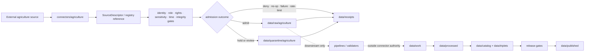

<!-- [KFM_META_BLOCK_V2]
doc_id: kfm://doc/connectors-agriculture-readme
title: connectors/agriculture/ — Agriculture Source Connector Lane
type: readme
version: v0.2
status: draft
owners: OWNER_TBD — Agriculture steward · Source steward · Connector steward · Data steward · Policy steward · Validation steward · Docs steward
created: 2026-06-16
updated: 2026-07-10
policy_label: public; implementation-root; source-admission; raw-quarantine-receipt-only
related:
  - ../README.md
  - ../../docs/doctrine/directory-rules.md
  - ../../docs/domains/agriculture/README.md
  - ../../docs/sources/ADMISSION_PROCESS.md
  - ../../docs/sources/catalog/README.md
  - ../../packages/domains/agriculture/README.md
  - ../../pipelines/domains/agriculture/README.md
  - ../../pipeline_specs/agriculture/README.md
  - ../../data/registry/sources/
  - ../../data/raw/agriculture/
  - ../../data/quarantine/agriculture/
  - ../../data/receipts/
  - ../../data/proofs/
  - ../../policy/rights/
  - ../../policy/sensitivity/
  - ../../policy/domains/agriculture/
  - ../../schemas/contracts/v1/source/
  - ../../schemas/contracts/v1/domains/agriculture/
  - ../../release/
tags: [kfm, connectors, agriculture, source-admission, raw, quarantine, receipts, rights, sensitivity, provenance, governance]
notes:
  - "v0.2 aligns this child lane with the connectors/ root contract while preserving the v0.1 agriculture-specific authority boundary."
  - "No-loss preservation: the prior purpose, allowed/forbidden content, intake posture, validation, migration, safe-change, and definition-of-done rules remain materially intact."
  - "connectors/agriculture/ is for agriculture source-specific fetch, probe, packaging, verification, and admission support only."
  - "Connector outputs are limited to governed raw, quarantine, and receipt handoffs; connectors do not write processed, catalog, triplet, proof-closure, published, or release authority directly."
  - "Agriculture field-level, producer/operator, parcel-adjacent, economic, and rights-limited context requires explicit source, rights, sensitivity, policy, review, and release controls before public use."
  - "The inspected repository search surfaced this README but no additional files under connectors/agriculture/; implementation completeness, source coverage, tests, fixtures, schedules, network behavior, and CI enforcement remain NEEDS VERIFICATION."
[/KFM_META_BLOCK_V2] -->

<a id="top"></a>

# Agriculture Connectors

> Source-specific fetch, probe, and admission support for agriculture data. This lane may admit evidence into governed lifecycle entry points; it does not create agriculture truth or publish public products.

<p>
  
  
  
  
  
</p>

`connectors/agriculture/`

## Quick jumps

[Status](#status) · [Scope](#scope) · [Repo fit](#repo-fit) · [Accepted inputs](#accepted-inputs) · [Exclusions](#exclusions) · [Current inspected snapshot](#current-inspected-snapshot) · [Authority boundary](#authority-boundary) · [Admission contract](#admission-contract) · [Agriculture risk posture](#agriculture-risk-posture) · [Lifecycle flow](#lifecycle-flow) · [Validation](#validation) · [Safe change pattern](#safe-change-pattern) · [Evidence basis](#evidence-basis) · [Rollback](#rollback) · [Definition of done](#definition-of-done) · [Related surfaces](#related-surfaces)

---

## Status

> [!IMPORTANT]
> **Status:** `draft` / child-lane contract  
> **Owner:** `OWNER_TBD`  
> **Path:** `connectors/agriculture/`  
> **Owning root:** `connectors/`  
> **Responsibility:** agriculture source-specific fetch, probe, packaging, verification, and admission support  
> **Truth posture:** the path and README are `CONFIRMED`; current repository search surfaced no additional files in this lane. Source coverage, activation state, connector code, tests, fixtures, schedules, emitted receipts, network behavior, and CI enforcement remain `NEEDS VERIFICATION`.

> [!CAUTION]
> Agriculture connectors must preserve source identity, source role, rights, limitations, temporal context, provenance, sensitivity, and review state. Field-level, producer/operator, parcel-adjacent, economic, or rights-limited material must fail closed to quarantine or denial when its admission posture cannot be established.

---

## Scope

Use this folder for agriculture-specific connector code and documentation that supports governed external-source intake.

A connector in this lane may:

- fetch or probe an approved agriculture source;
- package or stage a source-native payload, manifest, pointer, or distribution reference;
- verify basic transport, checksum, signature, schema-version, or file-integrity properties;
- resolve or reference a SourceDescriptor supplied by the source registry;
- preserve source-native identifiers and source metadata;
- emit an admission, denial, no-op, failure, rate-limit, or quarantine receipt;
- hand accepted material to explicit `data/raw/agriculture/` or `data/quarantine/agriculture/` targets.

A connector in this lane must not:

- decide agriculture truth;
- normalize data into authoritative domain records;
- write processed, catalog, triplet, proof-closure, published, or release authority;
- create policy or schema authority;
- activate a source without a governed descriptor and review posture;
- serve public clients or produce public-ready claims.

---

## Repo fit

`connectors/agriculture/` is a child lane of the source-admission implementation root. Its responsibility ends at governed lifecycle entry and receipt handoff.

```text
External agriculture source
  -> connectors/agriculture/
  -> descriptor / rights / sensitivity / role / integrity gates
  -> data/raw/agriculture/ OR data/quarantine/agriculture/
  -> data/receipts/
  -> downstream pipelines and validators
  -> data/work/
  -> data/processed/
  -> data/catalog/ + data/triplets/
  -> release/
  -> data/published/
```

Adjacent responsibility roots:

| Root | Relationship to this lane |
|---|---|
| `docs/sources/catalog/` | Source-family and product doctrine. Connector code must not duplicate or replace it. |
| `data/registry/sources/` | SourceDescriptor and activation authority. Connectors consume or reference registry decisions. |
| `policy/rights/`, `policy/sensitivity/` | Rights and sensitivity gates. Unresolved posture must fail closed. |
| `schemas/contracts/`, `contracts/` | Machine shape and object meaning. No parallel schema or contract authority belongs here. |
| `data/raw/agriculture/` | Allowed handoff for admitted source-native payloads or governed pointers. |
| `data/quarantine/agriculture/` | Required handoff for unresolved, denied-pending-review, malformed, rights-uncertain, or sensitivity-uncertain material. |
| `data/receipts/` | Allowed handoff for connector-run and admission outcome records; not proof closure. |
| `pipelines/domains/agriculture/` | Downstream executable normalization and transformation authority. |
| `packages/domains/agriculture/` | Reusable agriculture domain implementation. |
| `data/proofs/` | Downstream proof closure; outside connector authority. |
| `release/` | Promotion, release, correction, and rollback authority. |

---

## Accepted inputs

| Belongs here | Required posture |
|---|---|
| Source-specific clients and adapters | Descriptor-gated; source identity and role preserved. |
| Probe and availability helpers | Must emit bounded outcomes and must not imply activation or trust. |
| Manifest and distribution parsers | Preserve source fields, release/vintage, digests, and limitations. |
| Admission metadata helpers | May prepare handoff metadata; must not replace SourceDescriptor or schema authority. |
| Checksum, signature, and transport verification helpers | Record inputs and results in reviewable receipts. |
| Raw/quarantine handoff helpers | Targets must be explicit and restricted to approved lifecycle entry paths. |
| Connector-run receipt helpers | May record success, no-op, failure, denial, rate limit, or quarantine outcomes. |
| Connector documentation | Must state source limits, rights posture, sensitivity posture, outputs, and review requirements. |
| Small no-network fixtures when local convention permits | Deterministic and non-sensitive; fixtures do not become source authority. |

---

## Exclusions

| Does not belong here | Correct responsibility root |
|---|---|
| Source catalog doctrine | `../../docs/sources/catalog/` |
| SourceDescriptor records and activation decisions | `../../data/registry/sources/` |
| Processed agriculture records | `../../data/processed/agriculture/` |
| Catalog or triplet records | `../../data/catalog/`, `../../data/triplets/` |
| EvidenceBundle or proof closure | `../../data/proofs/` and governed proof workflows |
| Published artifacts, map layers, or public exports | `../../data/published/` after release gates |
| Release decisions, correction notices, or rollback cards | `../../release/` |
| Rights, sensitivity, admissibility, or publication policy | `../../policy/` |
| Machine schemas | `../../schemas/contracts/v1/` |
| Human contracts and object meaning | `../../contracts/` after accepted placement |
| Reusable agriculture domain code | `../../packages/domains/agriculture/` |
| Executable normalization/transformation pipelines | `../../pipelines/domains/agriculture/` |
| Declarative pipeline specifications | `../../pipeline_specs/agriculture/` |
| Generated reports and build/QA outputs | `../../artifacts/` |
| Public API, UI, map, or AI behavior | Governed app/UI/runtime roots after evidence, policy, review, and release gates |

---

## Current inspected snapshot

> [!NOTE]
> A current repository search surfaced `connectors/agriculture/README.md` and no additional files under this path. This supports a documentation-boundary claim only; it does not prove that agriculture connectors are absent from all other paths, nor that source admission is implemented elsewhere.

```text
connectors/
└── agriculture/
    └── README.md
```

| Snapshot item | Status | What it proves | What it does not prove |
|---|---|---|---|
| `connectors/agriculture/README.md` | `CONFIRMED` | The child-lane boundary document exists. | Does not prove connector implementation. |
| Additional files under `connectors/agriculture/` | `UNKNOWN` / not surfaced by current search | No additional indexed file was returned in this inspection. | Does not prove recursive absence or repository-wide placement. |
| Source activation, endpoint health, schedules, tests, fixtures, receipts, and CI | `NEEDS VERIFICATION` | Nothing beyond documentation was inspected. | No runtime or enforcement claim may be made. |

---

## Authority boundary

```text
connectors/agriculture/
├── source-specific fetch and probe logic
├── manifest / distribution parsing
├── admission metadata preparation
├── source-role and provenance preservation
├── integrity and transport checks
├── bounded outcome / receipt helpers
└── connector documentation

ALLOWED HANDOFFS:
  data/raw/agriculture/
  data/quarantine/agriculture/
  data/receipts/

NOT OWNED HERE:
  data/work/
  data/processed/
  data/catalog/
  data/triplets/
  data/proofs/ as proof closure
  data/published/
  release/
  policy/
  schemas/
  contracts/
  packages/domains/agriculture/
  pipelines/domains/agriculture/
  public API / UI / map / AI behavior
```

Promotion is a governed state transition outside this lane. A successful connector run is evidence of source interaction, not evidence that the material is correct, normalized, policy-safe, review-approved, or publishable.

---

## Admission contract

Every agriculture connector should preserve, when available:

- source family, product, distribution, and publisher identity;
- SourceDescriptor or registry reference;
- source role and sub-product role;
- retrieval, import, probe, or observation timestamp;
- source release, vintage, epoch, crop year, survey year, or schema version;
- valid-time and source-time distinctions where present;
- source-native identifiers;
- spatial extent, resolution, geometry/raster/tabular form, and coordinate reference information;
- rights, license, terms, attribution, redistribution, and derived-product limitations;
- sensitivity and aggregation posture;
- producer/operator, parcel, facility, or field-level exposure flags where relevant;
- digest, checksum, signature, byte count, and content-type evidence;
- rate-limit, retry, no-op, denial, failure, quarantine, and admit outcomes;
- the exact raw, quarantine, or receipt handoff target.

Connectors must not silently fill missing source fields with guesses. Missing identity, rights, sensitivity, role, temporal, or integrity support must produce a bounded hold, denial, quarantine, or error outcome.

---

## Agriculture risk posture

Agriculture sources can mix public statistical information with operationally sensitive, commercially sensitive, personally identifying, parcel-adjacent, or rights-limited material.

| Risk surface | Connector requirement |
|---|---|
| Field or parcel geometry | Preserve original scope; do not expose or generalize for public use inside connector code. |
| Producer/operator identity | Treat as potentially living-person or commercial context; require explicit policy posture. |
| Yield, input, management, or financial records | Preserve source limitations and confidentiality signals; quarantine when unclear. |
| Remote-sensing or inferred management signals | Label as observation or inference inputs; do not convert inference into fact. |
| USDA, state, university, commercial, or local datasets | Preserve distinct source roles; do not collapse authority because fields align. |
| Survey or modeled estimates | Preserve methodology, uncertainty, temporal scope, and revision lineage. |
| Terms-limited downloads or APIs | Deny or quarantine when retrieval, storage, redistribution, or derivative rights are unresolved. |
| Sensitive ecology, archaeology, infrastructure, or living-person overlap | Defer to the stricter owning-domain policy and avoid exact-location propagation. |

> [!WARNING]
> Convenience is not authority. A connector must not strengthen a source role, remove uncertainty, infer consent, infer redistribution rights, or label a dataset public-safe merely because it can be downloaded.

---

## Lifecycle flow



The connector may contribute evidence to later decisions, but it cannot perform evidence closure, policy approval, promotion, release, correction, rollback, or publication.

---

## Validation

Before relying on an agriculture connector, verify:

- [ ] A governed SourceDescriptor and activation decision exist.
- [ ] Source identity, product identity, source role, cadence, and version/vintage are preserved.
- [ ] Rights, attribution, redistribution, derivative-use, and retention terms are recorded.
- [ ] Sensitivity and aggregation posture are explicit.
- [ ] Producer/operator, parcel, field, facility, or commercial exposure is identified where relevant.
- [ ] Fetch or probe behavior is deterministic where practical and fixture-backed for tests.
- [ ] Network tests are separated from no-network validation.
- [ ] Retries, rate limits, timeouts, partial downloads, and malformed payloads have finite outcomes.
- [ ] Checksums, signatures, manifests, or equivalent integrity evidence are retained when available.
- [ ] Output targets are limited to approved raw, quarantine, and receipt handoffs.
- [ ] Connector code cannot write work, processed, catalog, triplet, proof-closure, published, or release authority.
- [ ] Receipts record failures, denials, no-ops, quarantines, and successful admissions.
- [ ] Downstream stages, not the connector, own normalization, validation, catalog closure, proof closure, and publication.
- [ ] CI and review enforcement are verified or explicitly marked `NEEDS VERIFICATION`.

---

## Safe change pattern

For changes under `connectors/agriculture/`:

1. Confirm the file belongs to source-specific connector implementation or connector documentation.
2. Identify the SourceDescriptor, source/product identity, rights posture, sensitivity posture, and expected cadence.
3. Define bounded outcomes before adding network behavior.
4. Restrict writes to explicit raw, quarantine, and receipt handoff targets.
5. Preserve source-native identifiers, temporal fields, limitations, and digests.
6. Add or update deterministic no-network fixtures and tests where practical.
7. Verify that policy, schema, package, pipeline, proof, release, API, UI, and publication authority remain outside this lane.
8. Record migration and rollback steps when paths, payload shapes, or receipt behavior change.
9. Update this README or explain why the change does not affect the lane contract.

---

## Evidence basis

| Source | Status | Supports | Limits |
|---|---|---|---|
| `connectors/agriculture/README.md` v0.1 | `CONFIRMED` | Existing agriculture connector purpose, authority boundary, allowed/forbidden contents, intake posture, validation, migration, and definition of done. | Did not prove implementation beyond the README. |
| `connectors/README.md` v0.3 | `CONFIRMED` | Root connector contract, raw/quarantine/receipt boundary, SourceDescriptor consumption, fail-closed admission, and child README expectations. | Does not prove this child lane implements those controls. |
| `docs/doctrine/directory-rules.md` | `CONFIRMED` placement doctrine / link `NEEDS VERIFICATION` from this file | `connectors/` is an implementation responsibility root; authority homes must not be duplicated. | Current enforcement and all related paths were not inspected here. |
| Current repository search for `connectors/agriculture/` | `CONFIRMED` search result | Surfaced this README as the indexed file under the lane. | Search results are not a complete recursive tree or runtime audit. |
| KFM agriculture/domain planning corpus | `LINEAGE` | Agriculture source-role, temporal, rights, sensitivity, evidence, map, and publication concerns. | Does not prove current repository implementation. |

---

## Rollback

Rollback is required when a connector change:

- writes beyond raw, quarantine, or receipt handoffs;
- weakens source identity, source role, rights, sensitivity, temporal, provenance, or integrity preservation;
- activates a source without a governed descriptor and review decision;
- creates schema, policy, registry, proof, release, API, UI, or publication authority inside this lane;
- breaks deterministic fixtures, bounded outcomes, or receipt lineage;
- exposes field-level, producer/operator, parcel-adjacent, commercial, or otherwise sensitive material without governed approval.

Rollback procedure:

1. Disable or revert the connector change.
2. Stop new admissions from the affected source/product.
3. Quarantine affected raw payloads and connector receipts without deleting evidence.
4. Identify downstream candidates, processed records, catalog/triplet entries, proofs, releases, and public artifacts derived from the affected admissions.
5. Invoke the owning correction/release process for any downstream exposure.
6. Restore the last verified connector behavior and fixture set.
7. Record the cause, affected run IDs or digests, corrective action, and re-admission criteria.

Rollback target: the last commit or release in which descriptor gating, output boundaries, rights/sensitivity handling, bounded outcomes, and receipt generation were verified.

---

## Definition of done

- [ ] Owners are confirmed and `OWNER_TBD` is replaced.
- [ ] The actual `connectors/agriculture/` tree is recursively inventoried.
- [ ] Every connector is mapped to a source/product and governed SourceDescriptor.
- [ ] Source activation, cadence, endpoint/distribution, rights, sensitivity, and version posture are documented.
- [ ] Outputs are verified to enter only approved raw, quarantine, and receipt handoffs.
- [ ] No processed, catalog, triplet, proof-closure, published, release, schema, policy, registry, package, pipeline, API, UI, or AI authority lives here.
- [ ] No-network fixtures cover successful admission and all material failure/hold outcomes.
- [ ] Network behavior has explicit timeouts, retries, rate-limit handling, partial-download handling, and finite outcomes.
- [ ] Receipts preserve source identity, inputs, digests, timestamps, outcomes, and handoff targets.
- [ ] CI and review behavior are verified or marked `NEEDS VERIFICATION`.
- [ ] Documentation, migration notes, and rollback instructions are current.

---

## Related surfaces

- [`../README.md`](../README.md) — connector-root authority and admission contract.
- [`../../docs/doctrine/directory-rules.md`](../../docs/doctrine/directory-rules.md) — placement and authority-boundary doctrine.
- [`../../docs/domains/agriculture/README.md`](../../docs/domains/agriculture/README.md) — agriculture domain documentation.
- [`../../docs/sources/ADMISSION_PROCESS.md`](../../docs/sources/ADMISSION_PROCESS.md) — source-admission process.
- [`../../docs/sources/catalog/README.md`](../../docs/sources/catalog/README.md) — source catalog doctrine.
- [`../../data/registry/sources/`](../../data/registry/sources/) — SourceDescriptor and activation authority.
- [`../../packages/domains/agriculture/README.md`](../../packages/domains/agriculture/README.md) — reusable domain implementation boundary.
- [`../../pipelines/domains/agriculture/README.md`](../../pipelines/domains/agriculture/README.md) — executable downstream transformation boundary.
- [`../../pipeline_specs/agriculture/README.md`](../../pipeline_specs/agriculture/README.md) — declarative pipeline specification boundary.
- [`../../policy/`](../../policy/) — rights, sensitivity, and admissibility rules.
- [`../../release/`](../../release/) — promotion, release, correction, and rollback authority.

> [!NOTE]
> Related links reflect the existing README lineage and connector-root contract. Each target should be checked during a recursive repository audit; a link does not prove the target’s current completeness or enforcement state.

---

`connectors/agriculture/` is the agriculture source-admission edge—not agriculture truth. It may fetch, probe, verify, package, and hand source material into governed raw, quarantine, and receipt lanes. Every stronger claim remains downstream of evidence, policy, validation, review, release, correction, and rollback.

<p align="right"><a href="#top">Back to top</a></p>
