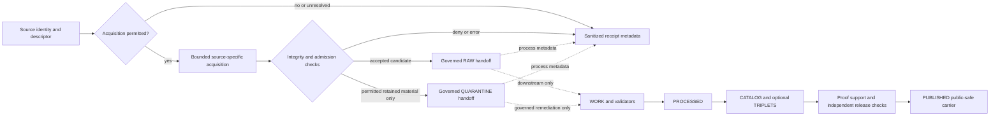

<!-- [KFM_META_BLOCK_V2]
doc_id: kfm://doc/connectors-agriculture-readme
title: connectors/agriculture/ — Agriculture Source Connector Lane
type: readme
version: v0.3
status: draft; repository-grounded; documentation-only; non-publisher
owners: OWNER_TBD — Agriculture steward · Source steward · Connector steward · Data steward · Policy steward · Validation steward · Docs steward
created: 2026-06-16
updated: 2026-09-05
owning_root: connectors/
responsibility: Explain the agriculture source-edge boundary without creating provider, registry, capture, schema, policy, or release authority
truth_posture: CONFIRMED pinned subtree and governing documents; PROPOSED unimplemented connector behavior; UNKNOWN live source and runtime state
evidence_snapshot:
  repository: bartytime4life/Kansas-Frontier-Matrix
  base_ref: main
  base_commit: c1d4efc64fe23f47a15dcb18da945a553304bbf6
  root_tree: 56997eacf46ddd17475e416de44c4f7e0749ab8c
  agriculture_tree: 688b192bd39bfcf9c16c2d346c9258b5d2b71e1a
  prior_blob: 098c86258bd316753b570d62638fc0e17ecbec45
  directory_rules_blob: fd49a0b83e55cef52c1124281f093e263526898d
  method: Complete non-truncated Git subtree plus pinned document reads; not a runtime or repository-wide implementation audit
policy_label: public; implementation-root; source-admission; raw-quarantine-receipt-only
related:
  - ../README.md
  - ../../docs/adr/ADR-0029-adopt-directory-governance-standard-v2.md
  - ../../docs/doctrine/directory-rules.md
  - ../../docs/domains/agriculture/README.md
  - ../../docs/sources/ADMISSION_PROCESS.md
  - ../../docs/sources/catalog/README.md
  - ../../packages/domains/agriculture/README.md
  - ../../pipelines/domains/agriculture/README.md
  - ../../pipeline_specs/agriculture/README.md
  - ../../data/registry/sources/
  - ../../data/raw/README.md
  - ../../data/quarantine/README.md
  - ../../data/receipts/
  - ../../data/proofs/
  - ../../policy/rights/
  - ../../policy/sensitivity/
  - ../../policy/domains/agriculture/
  - ../../schemas/contracts/v1/source/
  - ../../schemas/contracts/v1/domains/agriculture/
  - ../../release/
tags: [kfm, connectors, agriculture, source-admission, raw, quarantine, receipts, rights, sensitivity, provenance, governance]
notes:
  - "v0.3 re-pins the existing README, preserves its identity and navigation, and reconciles the source-first capture boundary with current parent guidance. No source or path migration is executed."
  - "No-loss preservation: the prior purpose, allowed/forbidden content, intake posture, validation, migration, safe-change, and definition-of-done rules remain materially intact."
  - "connectors/agriculture/ is for agriculture source-specific fetch, probe, packaging, verification, and admission support only."
  - "Connector outputs are limited to governed raw, quarantine, and receipt handoffs; connectors do not write processed, catalog, triplet, proof-closure, published, or release authority directly."
  - "Agriculture field-level, producer/operator, parcel-adjacent, economic, and rights-limited context requires explicit source, rights, sensitivity, policy, review, and release controls before public use."
  - "The complete pinned agriculture subtree contains only this README. No executable connector or local test/fixture is present in this subtree; other provider lanes, live activation, schedules, persistence, runtime and enforcement are not inferred."
[/KFM_META_BLOCK_V2] -->

<a id="top"></a>

# Agriculture Connectors

> Source-edge orientation for agriculture data. This directory currently contains documentation only. A future admitted connector may prepare source-native capture candidates and receipt metadata; it does not create agriculture truth or publish public products.

<p>
  
  
  
  
  
</p>

`connectors/agriculture/`

## Quick jumps

[Status](#status) · [Scope](#scope) · [Repo fit](#repo-fit) · [Accepted inputs](#accepted-inputs) · [Exclusions](#exclusions) · [Current inspected snapshot](#current-inspected-snapshot) · [Authority boundary](#authority-boundary) · [Admission contract](#admission-contract) · [Agriculture risk posture](#agriculture-risk-posture) · [Lifecycle flow](#lifecycle-flow) · [Validation](#validation) · [Safe change pattern](#safe-change-pattern) · [Evidence basis](#evidence-basis) · [Rollback](#rollback) · [Definition of done](#definition-of-done) · [Related surfaces](#related-surfaces)

---

## Status

| Field | Current posture |
|---|---|
| Document | `v0.3` / draft child-lane guidance; not an executable admission contract |
| Review date | `2026-09-05` UTC |
| Exact evidence base | `main@c1d4efc64fe23f47a15dcb18da945a553304bbf6` |
| Owning root | `connectors/`; source-specific acquisition and admission support |
| Accountable source/domain stewards | `OWNER_TBD`; specialist authority and independent review remain **NEEDS VERIFICATION** |
| Subtree | **CONFIRMED**: one tracked README; in-lane executable implementation, tests and fixtures are **ABSENT** at this base |
| Other providers, live execution, schedules and persistence | **UNKNOWN / NOT INSPECTED**; subtree absence is not repository-wide absence |
| Source admission, physical capture placement and public use | No permission granted by this README; resolve the separate governing decisions first |

> [!IMPORTANT]
> Truth posture and implementation maturity are separate. The complete subtree proves what is tracked here, not that another provider is inactive or that a documented control is enforced. The behavioral requirements below remain **PROPOSED implementation guidance** until source-specific code and qualifying tests prove them.

> [!CAUTION]
> Preserve source identity, role, rights, limitations, time, provenance and sensitivity. Unresolved acquisition permission means **no fetch or probe**. Quarantine is available only when capture and retention are themselves allowed; it is not permission to collect prohibited material.

---

## Scope

Use this existing folder for agriculture source-edge documentation. Before adding code, reconcile the source/provider grouping with the [connector root](../README.md) and adopted Directory Rules `DIR-EXEC-002` and `DIR-SOURCE-002`. A domain name does not authorize a duplicate provider client, registry writer, or RAW capture.

The following describes a qualified future connector, not functionality shipped by this README:

A connector in this lane may:

- fetch or probe an approved agriculture source;
- package or stage a source-native payload, manifest, pointer, or distribution reference;
- verify basic transport, checksum, signature, schema-version, or file-integrity properties;
- resolve or reference a SourceDescriptor supplied by the source registry;
- preserve source-native identifiers and source metadata;
- prepare finite admission, denial, no-op, failure, rate-limit, or quarantine metadata for the owning receipt producer;
- hand candidates to caller-owned, governed sinks in the logical `data/raw/` or `data/quarantine/` lanes after exact physical placement and write authority are resolved.

A connector in this lane must not:

- decide agriculture truth;
- normalize data into authoritative domain records;
- write processed, catalog, triplet, proof-closure, published, or release authority;
- create policy or schema authority;
- activate a source without a governed descriptor and review posture;
- serve public clients or produce public-ready claims.

---

## Repo fit

`connectors/agriculture/` is a child lane of the source-admission implementation root. Its responsibility ends at governed lifecycle entry and receipt handoff.

```text
Approved source identity / descriptor / rights / sensitivity / request scope
  -> source-specific connector using bounded, permitted acquisition
  -> source-native capture candidate + integrity/completeness checks
  -> caller-owned RAW or permitted QUARANTINE handoff
     + receipt-ready process metadata (separate accountability lane)
  -> downstream WORK / validation / PROCESSED
  -> CATALOG / optional TRIPLETS + proof support
  -> independent release decision
  -> PUBLISHED public-safe carrier
```

**Directory Rules basis:** accepted [ADR-0029](../../docs/adr/ADR-0029-adopt-directory-governance-standard-v2.md) adopts [Directory Rules](../../docs/doctrine/directory-rules.md). Sections 10.1, 11.3–11.4 and 12.3 separate source acquisition, process memory, physical storage and canonical source identity.

**Placement conflict resolved in this prose only:** v0.2 prescribed `data/raw/agriculture/` as a capture destination. The current [RAW parent](../../data/raw/README.md) requires one source-first capture identity and leaves exact physical placement and legacy domain-lane migration on **HOLD**. Use the logical RAW/QUARANTINE lanes, not a guessed replacement path. Existing domain directories do not authorize a second copy of source bytes. This update moves no file, payload, registry record or writer.

Adjacent responsibility roots below are routing guidance, not a runtime inventory:

| Root | Relationship to this lane |
|---|---|
| `docs/sources/catalog/` | Source-family and product doctrine. Connector code must not duplicate or replace it. |
| `data/registry/sources/` | Canonical source-identity/descriptor family. Descriptors and directory presence are not activation decisions; resolve the current policy and review authority separately. |
| `policy/rights/`, `policy/sensitivity/` | Rights and sensitivity gates. Unresolved posture must fail closed. |
| `schemas/contracts/v1/`, `contracts/` | Machine shape and object meaning. No parallel schema or contract authority belongs here. |
| `data/raw/` | Logical immutable capture home; source-first identity and an accepted physical sink are required. |
| `data/quarantine/` | Held material and remediation obligations only where acquisition/retention is permitted; otherwise deny without a payload write. |
| `data/receipts/` | Separate process-memory handoff; receipt-ready metadata is not proof of persistence, evidence closure or approval. |
| `pipelines/domains/agriculture/` | Existing downstream navigation; executable maturity is not established here. The adopted stage-first routing rule does not authorize a second writable pipeline tree. |
| `packages/domains/agriculture/` | Reusable agriculture domain implementation. |
| `data/proofs/` | Downstream proof closure; outside connector authority. |
| `release/` | Promotion, release, correction, and rollback authority. |

---

## Accepted inputs

| Belongs here | Required posture |
|---|---|
| Source-specific clients and adapters | Descriptor-gated; source identity and role preserved. |
| Probe and availability helpers | Must emit bounded outcomes and must not imply activation or trust. |
| Manifest and distribution parsers | Preserve source fields, release/vintage, digests, and limitations. |
| Admission metadata helpers | May prepare handoff metadata; must not replace SourceDescriptor or schema authority. |
| Checksum, signature, and transport verification helpers | Record inputs and results in reviewable receipts. |
| Raw/quarantine handoff helpers | Targets must be explicit and restricted to approved lifecycle entry paths. |
| Connector-run receipt helpers | May record success, no-op, failure, denial, rate limit, or quarantine outcomes. |
| Connector documentation | Must state source limits, rights posture, sensitivity posture, outputs, and review requirements. |
| Synthetic fixture support | Keep fixtures deterministic and non-sensitive; use established fixture/test ownership rather than inventing a parallel local home. No such files are present in this subtree. |

---

## Exclusions

| Does not belong here | Correct responsibility root |
|---|---|
| Source catalog doctrine | `../../docs/sources/catalog/` |
| SourceDescriptor records and activation authority | `../../data/registry/sources/` for identities/descriptors; activation remains a separately governed policy/review decision |
| Processed agriculture records | `../../data/processed/agriculture/` |
| Catalog or triplet records | `../../data/catalog/`, `../../data/triplets/` |
| EvidenceBundle or proof closure | `../../data/proofs/` and governed proof workflows |
| Published artifacts, map layers, or public exports | `../../data/published/` after release gates |
| Release decisions, correction notices, or rollback cards | `../../release/` |
| Rights, sensitivity, admissibility, or publication policy | `../../policy/` |
| Machine schemas | `../../schemas/contracts/v1/` |
| Human contracts and object meaning | `../../contracts/` after accepted placement |
| Reusable agriculture domain code | `../../packages/domains/agriculture/` |
| Executable normalization/transformation pipelines | `../../pipelines/domains/agriculture/` |
| Declarative pipeline specifications | `../../pipeline_specs/agriculture/` |
| Generated reports and build/QA outputs | The owning process/output lane; `artifacts/` is compatibility-scoped, not a universal output or proof home |
| Public API, UI, map, or AI behavior | Governed app/UI/runtime roots after evidence, policy, review, and release gates |

---

## Current inspected snapshot

The Git Trees API returned `truncated: false` for the complete recursive tree
`688b192bd39bfcf9c16c2d346c9258b5d2b71e1a` at the pinned base. It contains exactly one entry:

```text
connectors/agriculture/
└── README.md   # documentation only
```

| Evidence | Verified result | Limit |
|---|---|---|
| Prior README blob | `098c86258bd316753b570d62638fc0e17ecbec45`; mode `100644`; 23,724 bytes | Identity of the pre-update file, not this revision's hash |
| Recursive child entries | One blob; no nested directory, executable connector, local fixture, test or `AGENTS.md` | Absence applies only to this exact subtree |
| Parent guidance | `connectors/README.md` v0.7, read at the same base | Root-level implementation descriptions do not prove adoption by this child |
| Source-role guidance | `docs/domains/agriculture/README.md` v0.3 | Domain semantics and navigation, not live source qualification |
| RAW and source registry | Current parent guidance requires source-first identity and holds exact physical placement | No registry or payload migration is executed here |
| Runtime, endpoints, schedules, source rights and hosted checks | **NOT INSPECTED** as operational evidence for this lane | No live, deployment, CI-green or publication claim |

The [pinned subtree](https://api.github.com/repos/bartytime4life/Kansas-Frontier-Matrix/git/trees/688b192bd39bfcf9c16c2d346c9258b5d2b71e1a?recursive=1) replaces the older search-only inference. Re-pin before implementation; do not turn this bounded inventory into a repository-wide connector census.

---

## Authority boundary

This is a **responsibility diagram**, not the current file tree or a new machine contract.

```text
connectors/agriculture/
├── source-specific fetch and probe logic
├── manifest / distribution parsing
├── admission metadata preparation
├── source-role and provenance preservation
├── integrity and transport checks
├── bounded outcome / receipt helpers
└── connector documentation

CONDITIONAL LOGICAL HANDOFFS (caller-owned sinks):
  data/raw/         # exact source-first physical placement must be accepted
  data/quarantine/  # only when capture/retention is permitted
  data/receipts/    # process memory, not a sequential promotion stage

NOT OWNED HERE:
  data/work/
  data/processed/
  data/catalog/
  data/triplets/
  data/proofs/ as proof closure
  data/published/
  release/
  policy/
  schemas/
  contracts/
  packages/domains/agriculture/
  pipelines/domains/agriculture/
  public API / UI / map / AI behavior
```

Promotion is a governed state transition outside this lane. A successful connector run is evidence of source interaction, not evidence that the material is correct, normalized, policy-safe, review-approved, or publishable.

---

## Admission contract

Consume the current source contracts, schemas, registry references and admission policy; do not implement a new source schema or outcome enum in this README. [ADR-0001](../../docs/adr/ADR-0001-schema-home--schemas-contracts-v1-is-canonical.md) remains **proposed**, while accepted Directory Rules already establish the default schema root. SourceDescriptor family/alias and writer questions remain subject to the [source registry guidance](../../data/registry/sources/README.md); this child does not settle them.

Every qualified agriculture connector must preserve applicable source-supplied metadata, explicitly marking missing optional fields rather than inventing values:

- source family, product, distribution, and publisher identity;
- SourceDescriptor or registry reference;
- source role and sub-product role;
- separate retrieval/import/probe times from observation/valid time; preserve source timezone and missing-time flags;
- source release, vintage, epoch, crop year, survey year, or schema version;
- source publication/revision time distinct from crop year, survey reference period and retrieval freshness;
- source-native identifiers, geography codes/vintage, commodity/statistic/unit keys and source quality or suppression flags;
- spatial extent, resolution, geometry/raster/tabular form, and coordinate reference information;
- rights, license, terms, attribution, redistribution, and derived-product limitations;
- sensitivity and aggregation posture;
- producer/operator, parcel, facility, or field-level exposure flags where relevant;
- digest, checksum, signature, byte count, and content-type evidence;
- rate-limit, retry, no-op, denial, failure, quarantine, and admit outcomes;
- the exact raw, quarantine, or receipt handoff target.

Connectors must not silently fill missing source fields with guesses. Missing required identity, rights, sensitivity, role, temporal or integrity support must produce an explicit bounded outcome. Preserve suppressed or unavailable values as source states, not zeroes or reconstructed private values.

Before acquisition, define request/host/redirect scope, timeout, retry, byte/record/page limits, cancellation and credential-safe logging. A partial page set or truncated download must not be recorded as complete. A retry must not create a second capture identity. Emit sanitized reason metadata on denial, failure or no-op; never put credentials, private query parameters or protected payloads into public logs or receipts. These are qualification requirements, not controls proved by this documentation pass.

---

## Agriculture risk posture

Agriculture sources can mix public statistical information with operationally sensitive, commercially sensitive, personally identifying, parcel-adjacent, or rights-limited material.

| Risk surface | Connector requirement |
|---|---|
| Field or parcel geometry | Preserve original scope; do not expose or generalize for public use inside connector code. |
| Producer/operator identity | Treat as potentially living-person or commercial context; require explicit policy posture. |
| Yield, input, management, or financial records | Preserve source limitations and confidentiality signals; deny acquisition on unclear permission and hold already-permitted captures for review where allowed. |
| Remote-sensing or inferred management signals | Label as observation or inference inputs; do not convert inference into fact. |
| USDA, state, university, commercial, or local datasets | Preserve distinct source roles; do not collapse authority because fields align. |
| Survey or modeled estimates | Preserve methodology, uncertainty, temporal scope, and revision lineage. |
| Terms-limited downloads or APIs | Resolve retrieval, storage, redistribution and derivative rights separately. Quarantine cannot waive missing retrieval or retention permission. |
| Sensitive ecology, archaeology, infrastructure, or living-person overlap | Defer to the stricter owning-domain policy and avoid exact-location propagation. |

### Source roles must survive the handoff

The [Agriculture domain guide](../../docs/domains/agriculture/README.md) supplies these distinctions. They are source-role guidance, not an enabled-source list or fresh verification of endpoints, terms or data versions.

| Source support | Boundary to preserve |
|---|---|
| NASS QuickStats / Crop Progress | Aggregate statistic, geography, commodity, reference period, unit, quality and revision state; never field polygons or operator-level observations |
| SSURGO/SDA and gSSURGO | Soil-owned tabular/vector context versus a derived gridded companion; retain lineage rather than declaring them interchangeable |
| Mesonet, SCAN and USCRN | Station identity, variable/depth, observation time, timezone and quality flags; no implied farm-wide coverage |
| SMAP and HLS/HLS-VI | Satellite/grid support and derived indices remain distinct from station observations, private farm records and inferred stress indicators |
| Farm/operator or parcel-linked records | No implied consent, public-safe status, private yield disclosure or person-land join |

Soil, Hydrology, Atmosphere, Hazards, Flora and People-DNA-Land retain their own canonical responsibilities and stricter restrictions. Any later join, normalization, generalization or public-safe transform belongs downstream and must retain its reason, inputs and provenance.

> [!WARNING]
> Convenience is not authority. A connector must not strengthen a source role, remove uncertainty, infer consent, infer redistribution rights, or label a dataset public-safe merely because it can be downloaded.

---

## Lifecycle flow

The following is an illustrative governed flow, not an executable pipeline. The invariant remains:

`RAW -> WORK/QUARANTINE -> PROCESSED -> CATALOG/TRIPLET -> PUBLISHED`


```mermaid
flowchart LR
  DESC[Source identity and descriptor] --> AUTH{Acquisition permitted?}
  AUTH -->|no or unresolved| REC[Sanitized receipt metadata]
  AUTH -->|yes| CONN[Bounded source-specific acquisition]
  CONN --> GATE{Integrity and admission checks}
  GATE -->|accepted candidate| RAW[Governed RAW handoff]
  GATE -->|permitted retained material only| QUAR[Governed QUARANTINE handoff]
  GATE -->|deny or error| REC
  RAW -. process metadata .-> REC
  QUAR -. process metadata .-> REC
  RAW -. downstream only .-> WORK[WORK and validators]
  QUAR -. governed remediation only .-> WORK
  WORK --> PROC[PROCESSED]
  PROC --> CAT[CATALOG and optional TRIPLETS]
  CAT --> REL[Proof support and independent release checks]
  REL --> PUB[PUBLISHED public-safe carrier]
```

The connector may contribute evidence to later decisions, but it cannot perform evidence closure, policy approval, promotion, release, correction, rollback, or publication.

---

## Validation

### Documentation-only authoring

Review the exact base and target bytes, preserve this document's ID/H1/anchors, check metadata, tables, fences and changed links, and confirm that examples remain non-operational. Bind AI-authored bytes in a pending-review generated-work receipt under the existing `data/receipts/generated/` lane; that receipt is not a connector-run receipt or release proof.

From a full repository checkout, this Git-only check validates the scoped diff, not connector behavior:

```bash
git diff --check -- connectors/agriculture/README.md data/receipts/generated/
```

Use the repository's [generated-receipt guidance](../../data/receipts/generated/README.md) and current validators for their declared scope. Report local overlay checks, repository-native execution and exact-head hosted CI separately. A command listed here has not necessarily run; the task handoff records actual outcomes. Do not run a live source probe just to validate a README.

### Connector qualification — not completed by this update

Before relying on a future agriculture connector, verify:

- [ ] A governed SourceDescriptor and activation decision exist.
- [ ] Source identity, product identity, source role, cadence, and version/vintage are preserved.
- [ ] Rights, attribution, redistribution, derivative-use, and retention terms are recorded.
- [ ] Sensitivity and aggregation posture are explicit.
- [ ] Producer/operator, parcel, field, facility, or commercial exposure is identified where relevant.
- [ ] Fetch or probe behavior is deterministic where practical and fixture-backed for tests.
- [ ] Network tests are separated from no-network validation.
- [ ] Retries, rate limits, timeouts, redirects, cancellation, partial downloads/pages, byte/record budgets and malformed payloads have finite outcomes.
- [ ] Checksums, signatures, manifests, or equivalent integrity evidence are retained when available.
- [ ] Output targets are caller-owned approved RAW, permitted QUARANTINE, and receipt handoffs; exact physical placement is resolved without duplicated domain captures.
- [ ] Connector code cannot write work, processed, catalog, triplet, proof-closure, published, or release authority.
- [ ] Receipts record failures, denials, no-ops, quarantines, and successful admissions.
- [ ] Downstream stages, not the connector, own normalization, validation, catalog closure, proof closure, and publication.
- [ ] CI and review enforcement are verified or explicitly marked `NEEDS VERIFICATION`.

---

## Safe change pattern

For a documentation-only edit, live source activation is not a prerequisite: verify the guidance and keep unproved behavior explicit. For new connector behavior, the admission, ownership, fixture and sink requirements below must close before their corresponding operational transition.

Follow current [CONTRIBUTING](../../CONTRIBUTING.md) and the live delivery-control record in issue #4024. Branch authoring, PR creation, ready, approval and merge are distinct. When the PR mutation path is held, retain a validated branch and exact handoff for an eligible independent creator; do not bypass the hold or treat prose saying `DRAFT` as protection.

For changes under `connectors/agriculture/`:

1. Pin current main, the exact target and applicable instructions; check open work and provider/path overlap. Confirm responsibility before adding or moving files.
2. For connector behavior, identify the existing canonical source/product identity, SourceDescriptor, rights, sensitivity, cadence and governing activation decision. Do not select a new registry writer by convention.
3. Define bounded outcomes before adding network behavior.
4. Restrict writes to explicit raw, quarantine, and receipt handoff targets.
5. Preserve source-native identifiers, temporal fields, limitations, and digests.
6. Add or update deterministic no-network fixtures and tests where practical.
7. Verify that policy, schema, package, pipeline, proof, release, API, UI, and publication authority remain outside this lane.
8. Record migration and rollback steps when paths, payload shapes, or receipt behavior change.
9. Update this README or explain why the change does not affect the lane contract.

---

## Evidence basis

All repository documents below were read at
`c1d4efc64fe23f47a15dcb18da945a553304bbf6`. Their embedded older checkpoints remain historical; this review does not turn their implementation claims into new runtime proof.

| Source | What this review supports | Limit |
|---|---|---|
| [Pre-update README](https://github.com/bartytime4life/Kansas-Frontier-Matrix/blob/c1d4efc64fe23f47a15dcb18da945a553304bbf6/connectors/agriculture/README.md) and pinned subtree above | v0.2 identity, existing content and complete one-file subtree | No repository-wide absence claim |
| [Connector root](../README.md), v0.7 | Source-first provider responsibility, candidate handoffs, finite metadata and non-publication boundary | Root capability descriptions are not child adoption proof |
| [Directory Rules](../../docs/doctrine/directory-rules.md) and [accepted ADR-0029](../../docs/adr/ADR-0029-adopt-directory-governance-standard-v2.md) | Owning roots, source identity and logical/physical storage separation | No new migration or source authorization |
| [Proposed ADR-0001](../../docs/adr/ADR-0001-schema-home--schemas-contracts-v1-is-canonical.md) | Dedicated schema-routing decision remains proposed; adopted default comes from Directory Rules | No schema-family or alias decision made here |
| [RAW parent](../../data/raw/README.md), [source registry](../../data/registry/sources/README.md) and [admission process](../../docs/sources/ADMISSION_PROCESS.md) | Current source-first identity requirement and held physical placement; descriptors are not activation | No registry writer, sink or live source was qualified |
| [Agriculture domain guide](../../docs/domains/agriculture/README.md), v0.3 | Aggregate/station/grid/derived support distinctions and adjacent-domain ownership | Not a current source-version, endpoint or licensing audit |
| [Generated-work receipt lane](../../data/receipts/generated/README.md) and [schema](../../schemas/contracts/v1/receipts/generated_receipt.schema.json) | Authorship provenance shape and pending human review | Receipt validity is not correctness, approval or release |
| Drive: *KFM Agriculture Domain Implementation Dossier — Revised QA Scan Edition*, 2026-04-21; *Directory Rules* | Read-only design lineage; the dossier explicitly lacked a mounted repo | Proposed paths and historic tests are not present-day implementation proof |
| Notion: *KFM Hourly Agriculture Domain Builder v1.0* | Read-only coordination and historical delivery observations | Scheduler state and older branch/test claims were not revalidated by this README task |

**Change record:** v0.3 replaces search-only inventory, removes the domain-first physical-capture prescription, separates receipt metadata from persistence, clarifies pre-fetch denial and source-role preservation, and separates authoring checks from operational qualification. No connector, registry, schema, policy, fixture, pipeline, workflow or public artifact is changed.

---

## Rollback

**This documentation revision:** leave the branch unmerged or submit a focused forward correction/revert after re-pinning. The prior README is blob `098c86258bd316753b570d62638fc0e17ecbec45` at the recorded base. Preserve generated-work receipts as history; a subsequent correction receives a new hash-bound receipt. Reverting prose does not authorize the old physical-path prescription. No live source, payload or release rollback is performed by this update.

**Future operational changes:** route containment and correction through the owning source/data/release authority. The procedure below is conditional guidance, not permission to mutate live state.

Rollback is required when a connector change:

- writes beyond raw, quarantine, or receipt handoffs;
- weakens source identity, source role, rights, sensitivity, temporal, provenance, or integrity preservation;
- activates a source without a governed descriptor and review decision;
- creates schema, policy, registry, proof, release, API, UI, or publication authority inside this lane;
- breaks deterministic fixtures, bounded outcomes, or receipt lineage;
- exposes field-level, producer/operator, parcel-adjacent, commercial, or otherwise sensitive material without governed approval.

Rollback procedure:

1. Disable or revert the connector change.
2. Stop new admissions from the affected source/product.
3. Preserve immutable capture identity and original receipts; use governed quarantine references and remediation records where permitted rather than silently moving or deleting evidence.
4. Identify downstream candidates, processed records, catalog/triplet entries, proofs, releases, and public artifacts derived from the affected admissions.
5. Invoke the owning correction/release process for any downstream exposure.
6. Restore the last verified connector behavior and fixture set.
7. Record the cause, affected run IDs or digests, corrective action, and re-admission criteria.

Rollback target: the last commit or release in which descriptor gating, output boundaries, rights/sensitivity handling, bounded outcomes, and receipt generation were verified.

---

## Definition of done

This is the **connector qualification backlog**, not a claim that the lane is implemented. Only the bounded inventory item is completed by this documentation update.

- [ ] Owners are confirmed and `OWNER_TBD` is replaced.
- [x] The complete `connectors/agriculture/` tree is inventoried at the recorded base: one README; no in-lane connector, test or fixture.
- [ ] Every connector is mapped to a source/product and governed SourceDescriptor.
- [ ] Source activation, cadence, endpoint/distribution, rights, sensitivity, and version posture are documented.
- [ ] Outputs are verified to enter only approved raw, quarantine, and receipt handoffs.
- [ ] No processed, catalog, triplet, proof-closure, published, release, schema, policy, registry, package, pipeline, API, UI, or AI authority lives here.
- [ ] No-network fixtures cover successful admission and all material failure/hold outcomes.
- [ ] Network behavior has explicit timeouts, retries, rate-limit handling, partial-download handling, and finite outcomes.
- [ ] Receipts preserve source identity, inputs, digests, timestamps, outcomes, and handoff targets.
- [ ] CI and review behavior are verified or marked `NEEDS VERIFICATION`.
- [ ] Documentation, migration notes, and rollback instructions are current.

---

## Related surfaces

- [`../README.md`](../README.md) — connector-root authority and admission contract.
- [`../../docs/doctrine/directory-rules.md`](../../docs/doctrine/directory-rules.md) — placement and authority-boundary doctrine.
- [`../../docs/domains/agriculture/README.md`](../../docs/domains/agriculture/README.md) — agriculture domain documentation.
- [`../../docs/sources/ADMISSION_PROCESS.md`](../../docs/sources/ADMISSION_PROCESS.md) — source-admission process.
- [`../../docs/sources/catalog/README.md`](../../docs/sources/catalog/README.md) — source catalog doctrine.
- [`../../data/registry/sources/README.md`](../../data/registry/sources/README.md) — canonical source-identity family; no implied source activation.
- [`../../packages/domains/agriculture/README.md`](../../packages/domains/agriculture/README.md) — reusable domain implementation boundary.
- [`../../pipelines/domains/agriculture/README.md`](../../pipelines/domains/agriculture/README.md) — executable downstream transformation boundary.
- [`../../pipeline_specs/agriculture/README.md`](../../pipeline_specs/agriculture/README.md) — declarative pipeline specification boundary.
- [`../../policy/`](../../policy/) — rights, sensitivity, and admissibility rules.
- [`../../release/`](../../release/) — promotion, release, correction, and rollback authority.

> [!NOTE]
> The evidence table identifies directly inspected guidance. Other retained links are navigation, not proof of current implementation, writer authority or enforcement. Recheck their governing controls before implementation; do not infer a migration from these links.

---

`connectors/agriculture/` is the agriculture source-admission edge—not agriculture truth. It may fetch, probe, verify, package, and hand source material into governed raw, quarantine, and receipt lanes. Every stronger claim remains downstream of evidence, policy, validation, review, release, correction, and rollback.

<p align="right"><a href="#top">Back to top</a></p>
