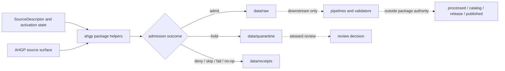

<!-- [KFM_META_BLOCK_V2]
doc_id: kfm://doc/connectors-ahgp-src-package-readme
title: connectors/ahgp/src/ahgp/ — AHGP Connector Python Package
type: readme
version: v0.1
status: draft
owners: OWNER_TBD — Connector steward · Source steward · People/Genealogy steward · Data steward · Validation steward · Docs steward
created: 2026-07-10
updated: 2026-07-10
policy_label: public; package-readme; implementation-support; source-admission-only
related:
  - ../../README.md
  - ../../../../docs/sources/catalog/ahgp.md
  - ../../../../docs/sources/catalog/ahgp/
  - ../../../../data/registry/sources/
  - ../../../../data/raw/
  - ../../../../data/quarantine/
  - ../../../../data/receipts/
  - ../../../../data/proofs/
  - ../../../../policy/rights/
  - ../../../../policy/sensitivity/
  - ../../../../release/
tags: [kfm, connectors, ahgp, python-package, genealogy, implementation-support, source-admission, raw, quarantine, receipts, no-network-on-import, governance]
notes:
  - "Draft package-level README for importable AHGP connector helper code."
  - "The pyproject currently identifies the package as kfm-connector-ahgp version 0.0.0 and remains a greenfield placeholder."
  - "This package supports descriptor-gated source admission; it does not own AHGP doctrine, SourceDescriptor records, people or genealogy truth, schemas, policy, catalog, triplets, proofs, release decisions, API behavior, or UI behavior."
  - "Imports must be side-effect-free: no network calls, filesystem writes, credential reads, source activation, or lifecycle mutation at import time."
  - "Concrete modules, endpoints, tests, fixtures, CI coverage, and runtime behavior remain NEEDS VERIFICATION until inventoried."
[/KFM_META_BLOCK_V2] -->

<a id="top"></a>

# AHGP Connector Python Package

> Importable helper-code boundary for governed American Hereditary Genealogy Project source admission. This package may support intake; it does not establish genealogical truth or authorize publication.

<p>
  
  
  
  
  
</p>

`connectors/ahgp/src/ahgp/`

## Quick jumps

[Status](#status) · [Scope](#scope) · [Package fit](#package-fit) · [Accepted inputs](#accepted-inputs) · [Exclusions](#exclusions) · [Allowed code](#allowed-code) · [Forbidden code](#forbidden-code) · [Admission contract](#admission-contract) · [Genealogy evidence discipline](#genealogy-evidence-discipline) · [I/O boundary](#io-boundary) · [Import-safety contract](#import-safety-contract) · [Validation](#validation) · [Evidence basis](#evidence-basis) · [Rollback](#rollback) · [Definition of done](#definition-of-done)

---

## Status

> [!IMPORTANT]
> **Status:** `draft` / `NEEDS VERIFICATION`  
> **Owner:** `OWNER_TBD`  
> **Path:** `connectors/ahgp/src/ahgp/`  
> **Package:** `kfm-connector-ahgp` version `0.0.0` — greenfield placeholder  
> **Mode:** importable connector implementation support  
> **Truth posture:** `CONFIRMED` target path, parent connector README, and placeholder package metadata; actual Python modules, endpoints, fixtures, tests, CI wiring, source activation, emitted receipts, and runtime behavior remain `UNKNOWN` or `NEEDS VERIFICATION`.

> [!CAUTION]
> AHGP material may contain names, family relationships, cemetery information, obituaries, census-derived context, locality histories, or information about living people. Package code must preserve uncertainty, source limitations, rights, sensitivity, and review state. Retrieved content is candidate evidence, not a verified person, kinship, burial, residence, or historical claim.

---

## Scope

`connectors/ahgp/src/ahgp/` is the Python package namespace for AHGP connector implementation support.

It may contain pure helpers, typed internal data-transfer objects, constants, descriptor-gated client adapters, response parsers, source-locator helpers, content digest helpers, polite-request configuration helpers, admission-record builders, run-receipt helpers, raw/quarantine handoff helpers, and deterministic test support.

It must not become:

- AHGP source-family doctrine;
- a SourceDescriptor or activation registry;
- people, genealogy, cemetery, obituary, census, locality-history, or kinship truth;
- schema or contract authority;
- rights, privacy, sensitivity, or publication policy;
- processed-data, catalog, triplet, or EvidenceBundle authority;
- release, correction, or rollback authority;
- public API, UI, search, map, Focus Mode, or AI behavior;
- an autonomous crawler or publisher.

---

## Package fit

```text
connectors/ahgp/
├── README.md
├── pyproject.toml
└── src/
    └── ahgp/
        └── README.md
```

Responsibility flow:



The package may implement helpers used by this flow. It does not own the descriptor, gate policy, downstream lifecycle, review decision, or publication transition.

---

## Accepted inputs

| Input | Required posture |
|---|---|
| Explicit SourceDescriptor reference or resolved connector configuration | Required before network or import activity; no implicit activation. |
| Explicit AHGP source or product-family locator | Preserve the exact source locator and product-family context. |
| Caller-provided runtime settings | Timeouts, retry limits, user agent, delays, and output destinations must be explicit and reviewable. |
| Candidate source payload or response metadata | Preserve source-native identifiers, timestamps, content type, digest inputs, and caveats. |
| Explicit raw/quarantine destination | Package helpers must not infer or silently create lifecycle authority. |
| Rights and sensitivity decision inputs | Treat unresolved inputs as hold, deny, or needs-review conditions. |

---

## Exclusions

| Does not belong in this package | Correct responsibility root |
|---|---|
| Source-family and product doctrine | `docs/sources/catalog/ahgp.md` and related catalog pages |
| SourceDescriptor records and activation decisions | `data/registry/sources/` |
| Rights and sensitivity policy | `policy/rights/`, `policy/sensitivity/`, and applicable domain policy |
| Machine schemas and human contract meaning | `schemas/contracts/` and `contracts/` under accepted repository conventions |
| Normalization and transformation pipelines | `pipelines/` and `pipeline_specs/` |
| Processed people or genealogy records | `data/processed/` after governed validation |
| Catalog or triplet authority | `data/catalog/`, `data/triplets/` |
| EvidenceBundle or proof closure | `data/proofs/` and governed proof workflows |
| Release, correction, and rollback decisions | `release/` and their owning object families |
| Public APIs, UIs, maps, indexes, or AI answers | Governed application roots consuming released artifacts |

---

## Allowed code

| Allowed item | Required posture |
|---|---|
| Pure constants and enums | Descriptive only; do not replace source-role vocabularies, policy, schemas, or descriptors. |
| Descriptor-gated client helpers | Require explicit resolved configuration; no embedded activation. |
| URL and source-locator helpers | Preserve exact source references and reject unsafe or unsupported schemes. |
| Response and page parsers | Preserve source wording, identifiers, timestamps, links, uncertainty, and limitations. |
| Content digest helpers | Deterministic and side-effect-free unless handed explicit bytes or paths. |
| Polite-request helpers | Explicit user agent, timeout, backoff, retry ceiling, and configurable delay. |
| Admission-record builders | Produce candidate admission metadata; never claim truth, proof closure, or publication. |
| Run-receipt helpers | Represent success, failure, denial, no-op, skipped, rate-limited, and quarantine outcomes. |
| Raw/quarantine handoff helpers | Require explicit destination and receipt context; never write downstream lifecycle states. |
| Offline fixture helpers | Deterministic, minimal, rights-safe, and non-authoritative. |

---

## Forbidden code

| Forbidden item | Reason |
|---|---|
| Network calls at import time | Imports must be deterministic, safe, and testable. |
| Filesystem writes at import time | Importing the package must not mutate lifecycle data. |
| Credential, cookie, or secret reads at import time | Runtime configuration owns secrets and authentication posture. |
| Unbounded crawling or recursive traversal by default | Scope, cadence, rate limits, rights, and review must be explicit. |
| Direct writes to `data/work/`, `data/processed/`, `data/catalog/`, `data/triplets/`, or `data/published/` | Connector packages are admission support only. |
| Embedded SourceDescriptor or activation authority | Registry records and activation decisions live outside package code. |
| Embedded rights, privacy, or sensitivity policy | Policy must remain inspectable and separately governed. |
| Automatic identity resolution or kinship assertion | Name similarity and page structure do not prove identity or relationship. |
| Public API/UI payload builders | Public clients must use governed interfaces and released artifacts. |
| Publication or release commands | Promotion is a governed state transition outside connector ownership. |

---

## Admission contract

AHGP package helpers must preserve, when available:

- AHGP source-family identity;
- product-family or collection identity;
- SourceDescriptor reference supplied by the caller;
- exact page URL, file URL, source locator, or distribution identity;
- retrieval or import timestamp;
- source publication, modification, or observation time without collapsing time kinds;
- source role and any corroborating/context/restricted role supplied by governance records;
- source-native identifiers and labels;
- names exactly as presented by the source;
- locality, cemetery, obituary, census, family, or historical-context labels without converting them into verified claims;
- rights, terms, privacy, sensitivity, and review posture supplied by gates;
- content type, encoding, response status, and redirect chain where material;
- digest, checksum, or signature inputs;
- finite outcome and reason code;
- quarantine reason and review target when admission is not safe.

No helper may claim that a source, person, relationship, event, burial, residence, or locality assertion is verified, authoritative, released, or publishable without downstream evidence, policy, review, and release records.

---

## Genealogy evidence discipline

AHGP is a distributed source family whose pages may mix transcriptions, indexes, contributor material, compiled histories, links, and secondary assertions. Package code must not flatten those roles.

| Source material | Package treatment |
|---|---|
| Name or person mention | Preserve as source text and candidate reference; do not resolve identity automatically. |
| Parent, spouse, child, or household relationship | Preserve the asserted relationship and source context; do not promote it to a verified edge. |
| Cemetery or burial information | Preserve source wording and location precision; route sensitivity questions to policy/review. |
| Obituary or memorial material | Preserve source, date, attribution, and rights posture; do not infer living status or family truth. |
| Census-derived transcription or index | Preserve source year, geography, transcription role, and source limitations. |
| Locality or county history | Treat as contextual or secondary evidence unless registry/source-role policy says otherwise. |
| Contributor-created page | Preserve contributor attribution and caveats; do not silently upgrade authority. |

> [!IMPORTANT]
> Matching names, dates, places, or relatives is not deterministic identity proof. Entity resolution belongs in governed downstream workflows with evidence, uncertainty, review, correction, and rollback support.

---

## I/O boundary

```text
MAY SUPPORT:
  data/raw/<domain>/<source_id>/<run_id>/
  data/quarantine/<domain>/<source_id>/<run_id>/
  data/receipts/<run_id>/

MUST NOT OWN:
  data/work/
  data/processed/
  data/catalog/
  data/triplets/
  data/published/
  data/proofs/ as closure authority
  release/ decisions
  policy/ decisions
  apps/ public API or UI behavior
```

Receipts document connector activity. They do not establish EvidenceBundle closure, source authority, claim correctness, or publication state.

---

## Import-safety contract

Importing `ahgp` must not:

- access the network;
- resolve DNS;
- read credentials, browser profiles, cookies, or tokens;
- write files or create lifecycle directories;
- inspect user home directories;
- activate sources;
- schedule work;
- start threads, processes, servers, or background jobs;
- emit public-facing claims;
- mutate registries, policy, receipts, proofs, or release state.

Runtime actions must be explicit function or command calls with caller-supplied configuration and bounded outcomes.

---

## Validation

Before relying on this package, verify:

- [ ] actual Python modules are inventoried;
- [ ] `pyproject.toml` package discovery and import paths are configured and tested;
- [ ] imports are side-effect-free;
- [ ] source activation requires an explicit resolved descriptor or configuration;
- [ ] network behavior has explicit timeout, delay, retry ceiling, user agent, and error handling;
- [ ] recursive traversal is bounded and disabled by default unless explicitly reviewed;
- [ ] parsers preserve source text, links, timestamps, identifiers, caveats, and source-role metadata;
- [ ] living-person, cemetery-location, obituary, and contributor-content risks are routed to policy/review;
- [ ] raw/quarantine/receipt handoffs require explicit destinations;
- [ ] success, failure, denial, no-op, skip, rate-limit, and quarantine outcomes are tested;
- [ ] no-network fixtures are small, deterministic, rights-safe, and clearly synthetic or permissioned;
- [ ] no package helper writes processed, catalog, triplet, proof, published, or release state;
- [ ] CI runs the relevant tests or the package remains `NEEDS VERIFICATION`.

---

## Evidence basis

| Source | Status | Supports | Limits |
|---|---|---|---|
| `connectors/ahgp/README.md` | `CONFIRMED` | AHGP connector scope, admission-only boundary, source-family posture, endpoint/rate-limit expectations, and downstream authority exclusions. | Does not prove package implementation, endpoints, tests, fixtures, or runtime behavior. |
| `connectors/ahgp/pyproject.toml` | `CONFIRMED` | Package name `kfm-connector-ahgp` and placeholder version `0.0.0`. | Does not prove package discovery, dependencies, modules, commands, or build success. |
| `connectors/README.md` | `CONFIRMED` root contract | Raw/quarantine/receipt handoff limit and exclusion of publication, proof closure, policy, and public behavior. | Does not prove this child package conforms in code. |
| KFM Directory Rules and doctrine corpus | `CONFIRMED` doctrine | Responsibility-root placement, trust membrane, governed promotion, cite-or-abstain, and reversible change. | Does not prove current runtime or test maturity. |

---

## Rollback

Rollback is required if this README is used to justify:

- connector authority beyond importable helper code;
- implicit or automatic source activation;
- unbounded crawling;
- direct public access;
- direct identity or kinship assertion;
- direct promotion, proof closure, release, or publication;
- bypass of SourceDescriptor, rights, privacy, sensitivity, review, or release gates.

Rollback target: restore the initial one-character placeholder content or revert this documentation commit, then record any dependent documentation or implementation assumptions that relied on the broader interpretation.

---

## Definition of done

- [ ] Owners are confirmed and `OWNER_TBD` is replaced.
- [ ] Actual Python modules are inventoried.
- [ ] Package discovery, build metadata, and import paths are verified.
- [ ] Import side effects are tested and absent.
- [ ] Descriptor/configuration gates are tested.
- [ ] Endpoint, timeout, retry, delay, and user-agent behavior is documented and tested.
- [ ] Traversal scope is explicit and bounded.
- [ ] Genealogy source roles and uncertainty are preserved.
- [ ] Living-person, cemetery, obituary, contributor, rights, and sensitivity handling is tested or held closed.
- [ ] Raw/quarantine/receipt-only output boundaries are tested.
- [ ] No processed/catalog/triplet/proof/published/release/policy/API/UI authority lives here.
- [ ] No-network fixtures and tests are verified.
- [ ] CI behavior is verified or marked `NEEDS VERIFICATION`.

---

## Status summary

`connectors/ahgp/src/ahgp/` is a draft implementation-support package for AHGP connector helpers. It is not AHGP doctrine, SourceDescriptor authority, genealogy truth, identity-resolution authority, rights or sensitivity policy, schema authority, catalog/triplet authority, EvidenceBundle closure, release authority, public API behavior, public UI behavior, or publication authority.

<p align="right"><a href="#top">Back to top</a></p>
