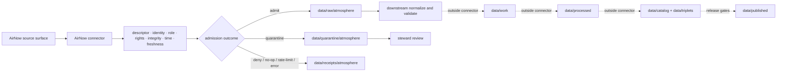

<!-- [KFM_META_BLOCK_V2]
doc_id: kfm://doc/connectors-airnow-readme
title: connectors/airnow/ — AirNow Source Connector Lane
type: readme
version: v0.2
status: draft
owners: OWNER_TBD — Atmosphere/Air steward · Source steward · Connector steward · Data steward · Validation steward · Docs steward
created: 2026-06-16
updated: 2026-07-10
policy_label: public; source-admission; near-real-time; raw-quarantine-receipts-only
related:
  - ../README.md
  - ../../docs/sources/catalog/epa/airnow-api.md
  - ../../docs/domains/atmosphere-air/README.md
  - ../../data/registry/sources/
  - ../../data/raw/atmosphere/
  - ../../data/quarantine/atmosphere/
  - ../../data/receipts/atmosphere/
  - ../../data/proofs/atmosphere/
  - ../../policy/rights/
  - ../../policy/sensitivity/
  - ../../schemas/contracts/v1/source/
  - ../../release/
tags: [kfm, connectors, airnow, epa, atmosphere, air, aqi, source-admission, near-real-time, preliminary, raw, quarantine, receipts, governance]
notes:
  - "v0.2 preserves the v0.1 AirNow/AQS and AQI/concentration anti-collapse rules while aligning this child lane with the current connector-root README contract."
  - "connectors/airnow/ is for AirNow source-specific fetch, probe, parsing, and admission support only."
  - "Connector handoffs are limited to governed raw, quarantine, and run-receipt surfaces; later lifecycle stages remain outside connector authority."
  - "AirNow near-real-time context remains preliminary, time-bounded, source-role-aware, and eligible for later correction or supersession."
  - "Concrete modules, endpoint products, credentials, cadence, source activation, tests, fixtures, emitted receipts, CI wiring, and runtime behavior remain NEEDS VERIFICATION."
[/KFM_META_BLOCK_V2] -->

<a id="top"></a>

# AirNow Connector

> Source-specific fetch, probe, parsing, and admission support for AirNow near-real-time air-quality context. This lane admits candidate source material; it does not establish atmospheric truth or publish public guidance.

<p>
  
  
  
  
  
</p>

`connectors/airnow/`

## Quick jumps

[Status](#status) · [Scope](#scope) · [Repo fit](#repo-fit) · [Accepted inputs](#accepted-inputs) · [Exclusions](#exclusions) · [Authority boundary](#authority-boundary) · [Admission contract](#admission-contract) · [AirNow anti-collapse rules](#airnow-anti-collapse-rules) · [Time, freshness, and supersession](#time-freshness-and-supersession) · [Finite outcomes](#finite-outcomes) · [Lifecycle flow](#lifecycle-flow) · [Validation](#validation) · [Safe change pattern](#safe-change-pattern) · [Evidence basis](#evidence-basis) · [Rollback](#rollback) · [Definition of done](#definition-of-done)

---

## Status

> [!IMPORTANT]
> **Status:** `draft` / `NEEDS VERIFICATION`  
> **Owner:** `OWNER_TBD`  
> **Path:** `connectors/airnow/`  
> **Owning root:** `connectors/`  
> **Responsibility:** AirNow source-specific admission support  
> **Truth posture:** `CONFIRMED` current README path and connector-root boundary; concrete implementation, source activation, endpoint products, cadence, credentials, tests, fixtures, CI wiring, emitted receipts, and runtime behavior remain `NEEDS VERIFICATION`.

> [!CAUTION]
> AirNow material is near-real-time and preliminary context. It must not be presented as a final regulatory archive, pollutant-concentration equivalent, health diagnosis, emergency instruction, or publication-ready truth merely because it is recent or map-ready.

---

## Scope

Use this directory for AirNow-specific connector implementation support that may:

- retrieve or probe an approved AirNow product or distribution surface;
- parse source responses without erasing source-native fields;
- preserve source identity, retrieval context, timestamps, preliminary status, and caveats;
- compute deterministic digests or package metadata;
- construct admission candidates and run-receipt payloads;
- hand accepted material to explicit raw targets;
- route unresolved, malformed, stale, rights-unclear, or policy-relevant material to quarantine;
- support deterministic no-network testing.

This lane does **not** determine atmospheric truth, compute authoritative AQI, resolve evidence closure, approve public messaging, issue health or emergency guidance, promote records, or publish artifacts.

---

## Repo fit

`connectors/airnow/` is an implementation-support lane beneath the connector responsibility root.

```text
External AirNow surface
  -> connectors/airnow/
  -> descriptor / rights / role / integrity / freshness checks
  -> data/raw/atmosphere/ or data/quarantine/atmosphere/
  -> data/receipts/atmosphere/
  -> downstream normalization and validation
  -> data/work/
  -> data/processed/
  -> data/catalog/ + data/triplets/
  -> release/
  -> data/published/
```

Adjacent responsibility roots:

| Root | Relationship to this lane |
|---|---|
| `docs/sources/catalog/epa/airnow-api.md` | Source-product doctrine, caveats, and catalog guidance. This connector must not duplicate it as authority. |
| `data/registry/sources/` | SourceDescriptor and activation authority. Connector code consumes or references descriptors. |
| `policy/rights/`, `policy/sensitivity/` | Rights, sensitivity, and admissibility gates. Connector code must fail closed when unresolved. |
| `schemas/contracts/v1/source/`, `contracts/` | Machine shape and object meaning. No parallel schema authority belongs here. |
| `data/raw/atmosphere/`, `data/quarantine/atmosphere/`, `data/receipts/atmosphere/` | Permitted handoff surfaces when explicitly configured and governed. |
| `data/work/`, `data/processed/`, `data/catalog/`, `data/triplets/`, `data/proofs/`, `data/published/` | Downstream lifecycle surfaces outside connector ownership. |
| `release/` | Promotion, release, correction, supersession, and rollback authority. |

> [!NOTE]
> Existing source documentation has referenced a possible `connectors/epa/airnow/` topology. This README governs the existing `connectors/airnow/` lane only. Final placement remains `CONFLICTED / NEEDS VERIFICATION` until an ADR or migration note settles direct-product versus source-family nesting.

---

## Accepted inputs

| Belongs here | Required posture |
|---|---|
| AirNow client or probe adapters | Descriptor-gated, explicitly configured, bounded, and testable. |
| Response and manifest parsers | Preserve source-native values, units, timestamps, status markers, product identity, and caveats. |
| Digest and integrity helpers | Deterministic; no implicit filesystem or network behavior. |
| Freshness and staleness helpers | Use explicit timestamps and configured thresholds; do not infer "current" from retrieval alone. |
| Admission decision helpers | Produce bounded outcomes and reason codes; never silently promote. |
| Raw/quarantine handoff helpers | Require explicit target, source reference, digest, and run context. |
| Run-receipt builders | Record fetch, deny, no-op, stale, rate-limit, error, quarantine, or admit outcomes. |
| No-network fixtures and test helpers | Deterministic and non-authoritative. |
| Connector documentation | State source limits, time posture, ownership, validation, and rollback. |

---

## Exclusions

| Does not belong here | Correct responsibility root |
|---|---|
| SourceDescriptor records or activation decisions | `data/registry/sources/` |
| Source catalog doctrine | `docs/sources/catalog/` |
| Rights or sensitivity policy | `policy/rights/`, `policy/sensitivity/` |
| Machine schemas and human contracts | `schemas/contracts/`, `contracts/` |
| Normalized work candidates | `data/work/` or governed pipeline roots |
| Processed pollutant, station, observation, or AQI records | `data/processed/` |
| Catalog and triplet records | `data/catalog/`, `data/triplets/` |
| EvidenceBundle or proof closure | `data/proofs/` and governed proof workflows |
| Public layers, tiles, dashboards, alerts, or API responses | Governed app/artifact roots after release |
| Release, correction, supersession, or rollback decisions | `release/` |
| Reusable cross-domain atmosphere logic | Appropriate `packages/` domain or shared package root |
| Executable downstream transforms | `pipelines/` |
| Declarative pipeline definitions | `pipeline_specs/` |
| Generated QA reports or build artifacts | `artifacts/` |

---

## Authority boundary

```text
connectors/airnow/
├── MAY: fetch/probe approved AirNow surfaces
├── MAY: parse and preserve source-native metadata
├── MAY: evaluate admission prerequisites
├── MAY: create run-receipt payloads
├── MAY: hand off to explicit raw/quarantine targets
└── MUST NOT: promote, certify, publish, alert, diagnose, or override evidence/policy/release state

PERMITTED HANDOFFS:
  data/raw/atmosphere/<source_id>/<run_id>/
  data/quarantine/atmosphere/<source_id>/<run_id>/
  data/receipts/atmosphere/<run_id>/

OUTSIDE CONNECTOR AUTHORITY:
  data/work/
  data/processed/
  data/catalog/
  data/triplets/
  data/proofs/ as closure authority
  data/published/
  release/
  public API/UI/AI behavior
```

Receipts prove that a connector action occurred. They do not prove atmospheric truth, catalog closure, evidence closure, regulatory status, or publication readiness.

---

## Admission contract

Every admitted or quarantined AirNow candidate should preserve, when available:

- SourceDescriptor reference;
- source family and product identity;
- source locator or distribution reference;
- retrieval or probe timestamp;
- source-observed or reporting timestamp;
- source release, issue, or update timestamp;
- station, reporting-area, or source-native identifier;
- source-native pollutant, AQI, category, unit, or status fields;
- explicit distinction between AQI/category values and concentration values;
- preliminary, estimated, observed, forecast, or other source-character marker;
- source role and caveat text;
- rights and sensitivity posture supplied by governance surfaces;
- content type, encoding, schema/version markers, and digest;
- freshness or stale-state assessment with reason code;
- admission outcome and run receipt reference;
- quarantine reason and review requirement when applicable.

Missing identity, unresolved source role, ambiguous units, invalid timestamps, stale data, failed integrity checks, unresolved rights, or unknown preliminary/final status must not be silently normalized away.

---

## AirNow anti-collapse rules

AirNow-derived material must preserve these distinctions:

| Distinction | Required rule |
|---|---|
| AQI vs. concentration | Do not treat an AQI or category as a pollutant concentration. Preserve source units and semantic type. |
| Near-real-time vs. final archive | AirNow context remains preliminary and must not be treated as final archival or regulatory truth. |
| Observation vs. forecast | Preserve source character; forecasts, modeled estimates, and observations must not collapse into one record type. |
| Retrieval time vs. observed time | Keep both. A recent fetch does not make an older observation current. |
| Source status vs. KFM release state | AirNow source availability does not imply KFM publication approval. |
| Map-ready vs. evidence-ready | A point, area, feed, or display payload is not automatically an inspectable claim. |
| Health context vs. diagnosis | Public categories or messages must not become individualized medical guidance. |
| Current context vs. emergency authority | KFM must not recast connector output as an emergency alerting system. |

Later archival or corrected records may supersede preliminary AirNow context, but supersession must be explicit, traceable, and release-governed.

---

## Time, freshness, and supersession

AirNow intake is time-sensitive. Connector code should preserve separate time dimensions rather than reduce them to one timestamp:

- **observed/reporting time** — when the source says the condition or value applies;
- **source issue/update time** — when the source published or revised the payload;
- **retrieval time** — when KFM fetched or received it;
- **admission time** — when the payload entered raw or quarantine;
- **release time** — downstream and outside connector ownership;
- **correction/supersession time** — downstream and outside connector ownership.

Freshness thresholds must be explicit configuration tied to product semantics. A connector must not label material `current` solely because the HTTP request succeeded.

Recommended bounded stale-state outcomes:

- `admit_fresh`
- `admit_with_stale_marker`
- `quarantine_stale`
- `quarantine_time_ambiguous`
- `deny_unusable_time`

These names are `PROPOSED` until contracts or schemas confirm the canonical vocabulary.

---

## Finite outcomes

Connector execution should end in a bounded, auditable result rather than an implicit success path.

| Outcome | Meaning | Connector action |
|---|---|---|
| `admit` | Descriptor, integrity, role, time, rights, and required checks pass. | Write only to the configured raw handoff and emit a receipt. |
| `quarantine` | Material is retrievable but unresolved, malformed, stale, ambiguous, or review-sensitive. | Write only to quarantine and emit reason-coded receipt metadata. |
| `deny` | Admission is not permitted or prerequisites fail closed. | Do not write candidate payload to normal raw flow; emit denial receipt when allowed. |
| `no_op` | Nothing materially changed or no admissible new payload exists. | Emit a no-op receipt; do not duplicate lifecycle records. |
| `rate_limited` | Source throttling prevents a safe fetch. | Stop bounded retries and emit rate-limit context. |
| `skipped` | Configuration or schedule intentionally excludes this run. | Emit skip reason where orchestration requires it. |
| `error` | Connector failed unexpectedly. | Fail closed; preserve diagnostic context without exposing secrets. |

Canonical reason codes and envelopes remain `NEEDS VERIFICATION` against current schemas and contracts.

---

## Lifecycle flow



Promotion is a governed state transition outside this connector. A successful fetch proves only that a source interaction occurred.

---

## Validation

Before relying on this lane, verify:

- [ ] the SourceDescriptor exists and activation is explicit;
- [ ] source-product coverage is documented;
- [ ] final lane placement versus `connectors/epa/airnow/` is resolved or formally deferred;
- [ ] endpoints, credentials, rate limits, cadence, and retry budgets are configured rather than embedded as undocumented assumptions;
- [ ] imports are side-effect-free;
- [ ] no-network fixtures cover representative payloads and failure cases;
- [ ] parsers preserve source-native fields, units, timestamps, identifiers, and source character;
- [ ] AQI/category values cannot be mistaken for concentration values;
- [ ] observation, estimate, and forecast character remain distinct;
- [ ] freshness and stale-state behavior is tested;
- [ ] raw, quarantine, and receipt targets are explicit and path-constrained;
- [ ] processed, catalog, triplet, proof, published, release, API, UI, alerting, and AI paths are unreachable from connector helpers;
- [ ] success, quarantine, deny, no-op, rate-limit, skipped, stale, malformed, and error outcomes are tested;
- [ ] diagnostics do not expose secrets or credentials;
- [ ] CI coverage is verified or remains visibly `NEEDS VERIFICATION`.

---

## Safe change pattern

For changes under `connectors/airnow/`:

1. Confirm the change is source-specific connector code, documentation, configuration support, or test support.
2. Confirm the source descriptor and product identity are explicit.
3. Confirm source-native fields, units, timestamps, source role, and preliminary/final character are preserved.
4. Confirm AQI, concentration, observation, estimate, forecast, archive, and KFM release state remain distinct.
5. Confirm network, retry, rate-limit, timeout, and credential behavior is bounded and configurable.
6. Confirm writes are limited to explicit raw, quarantine, and receipt targets.
7. Confirm tests and no-network fixtures are updated.
8. Update related documentation, or explain why no documentation change is required.
9. Preserve a rollback target for path, parser, contract, or source-product changes.

---

## Evidence basis

| Source | Status | Supports | Limits |
|---|---|---|---|
| Existing `connectors/airnow/README.md` v0.1 | `CONFIRMED` | Existing lane path, AirNow/AQS distinction, AQI/concentration anti-collapse, raw/quarantine boundary, placement conflict. | Did not prove connector implementation, endpoint health, source activation, tests, or CI. |
| `connectors/README.md` | `CONFIRMED` root contract | Source-admission responsibility, raw/quarantine/receipt handoffs, downstream exclusions, fail-closed posture. | Does not prove this child lane is operational. |
| `docs/sources/catalog/epa/airnow-api.md` | `NEEDS VERIFICATION` from this README | Proposed source-product doctrine and catalog relationship. | Link existence and current content were not re-inspected in this update. |
| Current repository update | `CONFIRMED` | This README was revised in place from its existing blob. | Does not prove code, tests, workflows, or runtime behavior. |

---

## Rollback

Rollback is required if a change:

- treats AirNow material as final archival or regulatory truth;
- collapses AQI/category values into concentration values;
- erases preliminary, forecast, estimate, observed, stale, or corrected status;
- allows connector code to write processed, catalog, triplet, proof, published, or release state;
- bypasses SourceDescriptor, rights, sensitivity, integrity, time, or review gates;
- exposes credentials or secrets;
- converts this lane into a public API, alerting, diagnostic, medical, or publication authority;
- creates an unresolved parallel connector home without migration and ADR treatment.

Rollback target: prior README blob `747a8a7f7b430f08b486077de25759b967c99cf4`.

---

## Definition of done

- [ ] Owners are confirmed and `OWNER_TBD` is replaced.
- [ ] Actual `connectors/airnow/` contents are inventoried.
- [ ] Source-product coverage and SourceDescriptor references are documented.
- [ ] Direct-product versus EPA-family path placement is resolved or formally deferred.
- [ ] Endpoint, credential, cadence, timeout, retry, and rate-limit behavior is documented and tested.
- [ ] Imports are side-effect-free.
- [ ] No-network fixtures and parser tests exist.
- [ ] Source-native units, timestamps, identifiers, role, caveats, and preliminary status are preserved.
- [ ] AQI, concentration, observations, estimates, forecasts, archival records, and KFM release state remain distinct.
- [ ] Freshness, staleness, correction, and supersession behavior is testable and traceable.
- [ ] Outputs are constrained to raw, quarantine, and receipt handoffs.
- [ ] No processed, catalog, triplet, proof, published, release, policy, schema, registry, public API, UI, alerting, medical, emergency, or AI authority lives here.
- [ ] CI and review enforcement is verified or remains visibly `NEEDS VERIFICATION`.
- [ ] Rollback instructions remain valid.

---

## Status summary

`connectors/airnow/` is a draft AirNow source-admission lane for preliminary, time-sensitive air-quality context. It is not atmospheric truth, AQS archival authority, AQI calculation authority, policy authority, schema authority, evidence closure, release authority, public-health guidance, emergency alerting, publication authority, or a public client interface.

<p align="right"><a href="#top">Back to top</a></p>
