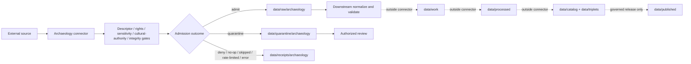

<!-- [KFM_META_BLOCK_V2]
doc_id: kfm://doc/connectors-archaeology-readme
title: connectors/archaeology/ — Archaeology Source Connector Lane
type: readme
version: v0.2
status: draft
owners: OWNER_TBD — Archaeology steward · Cultural-review reviewer · Source steward · Connector steward · Data steward · Policy steward · Docs steward
created: 2026-06-16
updated: 2026-07-10
policy_label: public; connector-boundary; deny-by-default; sensitive-location
related:
  - ../README.md
  - ../../docs/doctrine/directory-rules.md
  - ../../docs/domains/archaeology/README.md
  - ../../data/registry/sources/
  - ../../data/raw/archaeology/
  - ../../data/quarantine/archaeology/
  - ../../data/receipts/archaeology/
  - ../../data/proofs/archaeology/
  - ../../policy/domains/archaeology/
  - ../../policy/rights/
  - ../../policy/sensitivity/
  - ../../schemas/contracts/v1/domains/archaeology/
  - ../../release/
tags: [kfm, connectors, archaeology, cultural-heritage, source-admission, sensitive-location, geoprivacy, raw, quarantine, review, governance]
notes:
  - "v0.2 preserves the v0.1 connector boundary and strengthens sensitive-location, cultural-authority, redaction, logging, review, validation, and rollback controls."
  - "connectors/archaeology/ is for archaeology and cultural-heritage source-specific intake and admission code only."
  - "Connector outputs are limited to governed raw, quarantine, and receipt handoffs; connectors do not promote, publish, generalize, redact for release, or certify claims."
  - "Exact archaeological, burial, sacred, ceremonial, culturally restricted, or looting-sensitive location detail fails closed unless policy and authorized review explicitly permit handling."
  - "Specific connector modules, source coverage, source activation, tests, fixtures, CI enforcement, and runtime behavior remain NEEDS VERIFICATION."
[/KFM_META_BLOCK_V2] -->

<a id="top"></a>

# Archaeology Connectors

> Source-specific intake support for archaeology and cultural-heritage material. This lane admits or quarantines candidate source material; it does not determine cultural authority, confirm claims, release locations, or publish records.

<p>
  
  
  
  
  
</p>

`connectors/archaeology/`

## Quick jumps

[Status](#status) · [Scope](#scope) · [Repo fit](#repo-fit) · [Accepted inputs](#accepted-inputs) · [Exclusions](#exclusions) · [Authority boundary](#authority-boundary) · [Sensitive-location posture](#sensitive-location-posture) · [Cultural authority](#cultural-authority) · [Admission contract](#admission-contract) · [Bounded outcomes](#bounded-outcomes) · [Lifecycle](#lifecycle) · [Validation](#validation) · [Safe change pattern](#safe-change-pattern) · [Evidence basis](#evidence-basis) · [Rollback](#rollback) · [Definition of done](#definition-of-done)

---

## Status

> [!IMPORTANT]
> **Status:** `draft` / `NEEDS VERIFICATION`  
> **Owner:** `OWNER_TBD`  
> **Path:** `connectors/archaeology/`  
> **Owning root:** `connectors/`  
> **Responsibility:** source-specific fetch, probe, packaging, and admission support  
> **Truth posture:** this README and its path are `CONFIRMED`; actual modules, source activation, source coverage, tests, fixtures, emitted receipts, CI enforcement, and runtime behavior remain `NEEDS VERIFICATION`.

> [!CAUTION]
> Archaeology connector output is candidate admission material, not proof of a site, burial, artifact, feature, chronology, affiliation, ownership, significance, or cultural-heritage claim. Exact or restricted location detail must fail closed unless authorized policy and review explicitly permit handling.

---

## Scope

Use this folder for archaeology-specific connector code and connector documentation that supports governed source intake.

A connector may:

- retrieve, receive, or package candidate source material from an approved source;
- preserve source-native identifiers, locators, timestamps, rights notes, and caveats;
- calculate digests and capture retrieval or import context;
- emit admission metadata and run receipts;
- route material to governed raw or quarantine targets;
- return finite outcomes such as `admit`, `quarantine`, `deny`, `skip`, `no_op`, `rate_limited`, or `error`.

A connector must not:

- determine archaeological or cultural truth;
- decide cultural authority, affiliation, ownership, significance, or access rights;
- expose exact protected locations;
- perform release redaction or public generalization as an approval act;
- write processed, catalog, triplet, proof-closure, release, or published records;
- bypass source descriptors, rights review, sensitivity review, steward review, or cultural review.

---

## Repo fit

```text
External archaeology or cultural-heritage source
  -> connectors/archaeology/
  -> descriptor + rights + sensitivity + cultural-review gates
  -> data/raw/archaeology/ OR data/quarantine/archaeology/
  -> data/receipts/archaeology/
  -> downstream normalization and validation
  -> data/work/archaeology/
  -> data/processed/archaeology/
  -> data/catalog/ + data/triplets/
  -> release/
  -> data/published/
```

| Responsibility root | Relationship to this connector lane |
|---|---|
| `docs/domains/archaeology/` | Human-facing archaeology doctrine and domain boundaries. |
| `data/registry/sources/` | SourceDescriptor and activation authority. Connectors consume descriptors; they do not own them. |
| `policy/rights/` | Rights, terms, licensing, access, reuse, and redistribution decisions. |
| `policy/sensitivity/` and `policy/domains/archaeology/` | Sensitive-location, cultural, burial, sacred-site, and publication controls. |
| `schemas/contracts/v1/domains/archaeology/` | Machine-checkable shapes; no parallel schema authority belongs here. |
| `data/raw/archaeology/` | Allowed admitted-source handoff. |
| `data/quarantine/archaeology/` | Required hold area for unresolved rights, sensitivity, identity, quality, or review. |
| `data/receipts/archaeology/` | Run and admission evidence; receipts do not establish proof closure. |
| `data/proofs/archaeology/` | EvidenceBundle and proof closure outside connector authority. |
| `release/` | Promotion, publication, correction, and rollback decisions. |

---

## Accepted inputs

| Belongs here | Required posture |
|---|---|
| Source-specific clients and adapters | Descriptor-gated, configurable, and testable; no implicit activation. |
| Manifest, package, response, or document parsers | Preserve source fields, provenance, caveats, and sensitivity markers. |
| Digest and checksum helpers | Deterministic and side-effect-free unless given explicit bytes or paths. |
| Admission metadata helpers | Produce structured candidate metadata without claiming truth or release state. |
| Review-routing helpers | May recommend quarantine or review; must not approve publication. |
| Run-receipt helpers | Record success, failure, denial, no-op, skip, rate limit, quarantine, and error outcomes. |
| Connector documentation | State source limits, rights posture, sensitivity risks, and verification needs. |
| No-network fixture helpers | Small, synthetic or rights-cleared, non-sensitive, and deterministic. |

---

## Exclusions

| Does not belong here | Correct responsibility root |
|---|---|
| Archaeology doctrine, terminology, or significance rules | `docs/domains/archaeology/` and accepted contracts |
| SourceDescriptor records and activation decisions | `data/registry/sources/` |
| Rights, sovereignty, cultural, burial, sacred-site, or sensitivity policy | `policy/` |
| Machine schemas | `schemas/contracts/v1/` |
| Human contracts and object-family meaning | `contracts/` |
| Processed archaeology records | `data/processed/` |
| Catalog or triplet authority | `data/catalog/`, `data/triplets/` |
| EvidenceBundle or proof closure | `data/proofs/` |
| Public redaction/generalization approval | governed downstream policy and release workflows |
| Published artifacts or map layers | `data/published/` after release gates |
| Release decisions, corrections, or rollback records | `release/` |
| Reusable domain package code | `packages/` |
| Executable transformation pipelines | `pipelines/` |
| Declarative pipeline specifications | `pipeline_specs/` |
| Generated QA reports and build outputs | `artifacts/` |
| Public API, UI, map, export, or AI behavior | governed application and delivery roots |

---

## Authority boundary

```text
MAY SUPPORT:
  source fetch / import / probe
  descriptor resolution
  source-role preservation
  rights and sensitivity metadata capture
  digest calculation
  admission receipts
  explicit raw handoff
  explicit quarantine handoff

MUST NOT OWN:
  archaeological truth
  cultural authority
  significance or affiliation decisions
  exact-location release
  redaction approval
  policy
  schemas or contracts
  processed records
  catalog or triplet closure
  EvidenceBundle closure
  release or publication
  public API, UI, maps, exports, or AI answers
```

---

## Sensitive-location posture

Archaeology intake is **deny-by-default** for protected or exploitation-sensitive detail.

The following material should ordinarily be quarantined unless an approved descriptor, rights decision, sensitivity decision, and authorized review permit otherwise:

- exact archaeological site coordinates;
- burial, cemetery, funerary, mortuary, or human-remains locations;
- sacred, ceremonial, traditional-use, or culturally restricted places;
- locations vulnerable to looting, vandalism, trespass, theft, or disturbance;
- private-land access details or unpublished survey locations;
- confidential consultation records;
- restricted collection, curation, repository, or artifact-storage locations;
- precise geometry whose release would reconstruct a protected location.

> [!WARNING]
> Do not place protected coordinates, names, access instructions, identifiers, or reversible location clues in logs, exception messages, telemetry, fixture files, screenshots, reports, cache keys, URLs, branch names, or commit messages.

Connector code may preserve restricted detail inside approved controlled storage when authorized. It must not decide that generalization, masking, jittering, aggregation, redaction, or omission is sufficient for public release. Those are downstream policy and release decisions that require recorded transformation reasons and review.

---

## Cultural authority

A source's possession of archaeology or cultural-heritage information does not establish unrestricted authority to define, disclose, reuse, reinterpret, or publish it.

Connector logic must preserve, when supplied:

- source and contributor identity;
- asserted community, tribal, institutional, agency, landowner, or researcher role;
- consultation, consent, embargo, confidentiality, access, and reuse conditions;
- Indigenous data governance or sovereignty constraints;
- competing or unresolved authority claims;
- source limitations and interpretive caveats;
- required reviewer or steward class.

When cultural authority, rights, or permitted disclosure is unclear, the correct connector outcome is `quarantine` or `deny`, not inference or silent omission.

---

## Admission contract

Each admitted or quarantined item should preserve, where available:

| Field group | Examples |
|---|---|
| Source identity | source family, source product, SourceDescriptor reference, source-native ID |
| Retrieval context | source locator, retrieval/import time, connector version, request or package identity |
| Temporal context | source time, observation/survey time, publication time, revision time |
| Integrity | digest, checksum, signature metadata, content type, byte length |
| Source role | primary, corroborating, contextual, restricted, or other governed role |
| Rights | license, terms, access condition, reuse restriction, embargo, attribution |
| Sensitivity | exact-location flag, burial/sacred/cultural restriction, exploitation risk, review requirement |
| Spatial metadata | geometry presence, precision, CRS, scale, coordinate uncertainty; never log protected values |
| Review routing | quarantine reason, reviewer class, policy reference, unresolved question |
| Outcome | admit, quarantine, deny, no-op, skipped, rate-limited, or error |
| Lineage | run receipt reference, prior version, correction/supersession pointer when available |

Missing critical identity, rights, sensitivity, cultural-authority, or integrity fields should fail closed.

---

## Bounded outcomes

| Outcome | Meaning | Allowed handoff |
|---|---|---|
| `admit` | Descriptor and admission prerequisites passed for raw intake. | `data/raw/archaeology/` plus receipt |
| `quarantine` | Material was captured but requires rights, sensitivity, cultural, quality, identity, or steward review. | `data/quarantine/archaeology/` plus receipt |
| `deny` | Intake is not permitted under current policy or evidence. | receipt only; no payload exposure |
| `no_op` | No new or changed source material was found. | receipt only |
| `skipped` | Run was intentionally not attempted or was out of scope. | receipt only |
| `rate_limited` | Source constrained the request. | receipt only; retry only under configured policy |
| `error` | Connector or source interaction failed. | safe error receipt without protected detail |

No outcome from this connector means `processed`, `confirmed`, `approved`, `released`, or `published`.

---

## Lifecycle



Promotion is a governed state transition outside this connector lane.

---

## Validation

Before relying on an archaeology connector, verify:

- [ ] SourceDescriptor exists and activation is explicit.
- [ ] Source role, rights, access conditions, and limitations are preserved.
- [ ] Sensitive-location and cultural-review gates fail closed.
- [ ] Protected detail cannot appear in logs, errors, metrics, fixtures, reports, URLs, or commit artifacts.
- [ ] Missing critical identity, rights, sensitivity, or integrity fields produce quarantine or denial.
- [ ] Imports and configuration loading do not trigger network calls or lifecycle writes.
- [ ] No-network fixtures are synthetic, rights-cleared, and non-sensitive.
- [ ] Output helpers can write only to explicit raw, quarantine, and receipt targets.
- [ ] Tests cover admit, quarantine, deny, no-op, skipped, rate-limited, and error outcomes.
- [ ] Exact-location, burial, sacred-site, and cultural-restriction cases are tested with non-sensitive synthetic fixtures.
- [ ] Downstream proof, release, correction, and rollback objects are not emitted by connector code.
- [ ] CI runs the relevant checks, or enforcement remains marked `NEEDS VERIFICATION`.

---

## Safe change pattern

For changes under `connectors/archaeology/`:

1. Confirm the file belongs to source-specific intake support.
2. Confirm the owning source descriptor and policy references.
3. Preserve source-native identifiers, roles, rights, temporal context, integrity, and caveats.
4. Confirm unresolved sensitive or cultural material routes to quarantine or denial.
5. Confirm no protected detail can leak through logs, fixtures, errors, reports, URLs, or telemetry.
6. Confirm no connector path writes processed, catalog, triplet, proof-closure, release, or published records.
7. Add or update no-network tests using synthetic, non-sensitive fixtures.
8. Update relevant documentation and record unresolved placement or authority conflicts.

---

## Evidence basis

| Source | Status | Supports | Limits |
|---|---|---|---|
| Existing `connectors/archaeology/README.md` v0.1 | `CONFIRMED` | Target path, connector boundary, deny-by-default intake, raw/quarantine limit, review posture | Did not prove modules, source activation, tests, CI, or runtime behavior |
| `connectors/README.md` | `CONFIRMED` root contract | Connector admission role and downstream lifecycle exclusions | Does not prove this child lane's implementation |
| KFM Directory Rules | `CONFIRMED` doctrine | `connectors/` responsibility-root placement and no parallel authority | Does not prove current child files or runtime behavior |
| KFM archaeology/domain doctrine | `CONFIRMED` doctrine / `LINEAGE` where report-based | Sensitive-location, rights, cultural-review, evidence, publication, and rollback posture | Does not prove connector enforcement |

---

## Rollback

Rollback is required when a change:

- weakens deny-by-default handling;
- permits protected detail in logs, fixtures, errors, reports, or public surfaces;
- treats source possession as cultural or publication authority;
- bypasses SourceDescriptor, rights, sensitivity, cultural, or steward review;
- allows direct writes beyond raw, quarantine, and receipts;
- presents connector output as confirmed, approved, released, or published truth.

**Rollback target:** prior README blob `d03ca168546f453cac8ada5fae1b46eb4766f31c`.

Rollback must preserve evidence of the reverted change and any affected admission runs. If protected information was exposed, also trigger the applicable incident, correction, access-revocation, and release-rollback procedures.

---

## Definition of done

- [ ] Owners are confirmed and `OWNER_TBD` is replaced.
- [ ] Actual files and modules under `connectors/archaeology/` are inventoried.
- [ ] Every supported source is tied to an active SourceDescriptor.
- [ ] Rights, sensitivity, cultural-authority, and review requirements are documented per source.
- [ ] Raw, quarantine, and receipt-only handoffs are enforced and tested.
- [ ] Protected locations and identifiers cannot leak through operational surfaces.
- [ ] No-network synthetic fixtures cover sensitive and non-sensitive outcomes.
- [ ] Finite outcomes and safe error behavior are tested.
- [ ] No processed, catalog, triplet, proof-closure, release, publication, API, UI, map, export, or AI authority lives here.
- [ ] CI and review enforcement are verified or explicitly marked `NEEDS VERIFICATION`.
- [ ] Rollback and incident paths are tested or documented.

---

## Status summary

`connectors/archaeology/` is a deny-by-default source-admission lane for archaeology and cultural-heritage material. It may support governed raw, quarantine, and receipt handoffs. It is not archaeology truth, cultural authority, rights authority, sensitivity policy, schema authority, catalog/triplet authority, proof closure, release authority, publication authority, or a public delivery path.

<p align="right"><a href="#top">Back to top</a></p>
