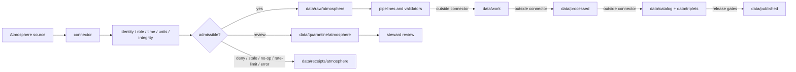

<!-- [KFM_META_BLOCK_V2]
doc_id: kfm://doc/connectors-atmosphere-readme
title: connectors/atmosphere/ — Atmosphere Source Connector Lane
type: readme
version: v0.2
status: draft
owners: OWNER_TBD — Atmosphere/Air steward · Source steward · Connector steward · Data steward · Policy steward · Validation steward · Docs steward
created: 2026-06-16
updated: 2026-07-10
policy_label: public; source-admission; atmosphere; no-official-alerting
related:
  - ../README.md
  - ../airnow/README.md
  - ../../docs/domains/atmosphere/README.md
  - ../../docs/domains/atmosphere/SOURCE_INDEX.md
  - ../../docs/domains/atmosphere/SOURCE_REGISTRY.md
  - ../../docs/sources/catalog/epa/airnow-api.md
  - ../../data/registry/sources/
  - ../../data/raw/atmosphere/
  - ../../data/quarantine/atmosphere/
  - ../../data/receipts/atmosphere/
  - ../../data/proofs/atmosphere/
  - ../../policy/domains/atmosphere/
  - ../../policy/rights/
  - ../../policy/sensitivity/
  - ../../schemas/contracts/v1/domains/atmosphere/
  - ../../release/
tags: [kfm, connectors, atmosphere, air, weather, smoke, aerosol, aqi, aod, forecast, model, source-admission, raw, quarantine, receipts, governance]
notes:
  - "v0.2 preserves the v0.1 connector boundary and expands it with source-role, temporal, stale-state, bounded-outcome, evidence-ledger, and rollback controls."
  - "connectors/atmosphere/ is for atmosphere and air source-specific intake and admission code only."
  - "Connector handoffs are limited to raw, quarantine, and receipt surfaces; connectors do not own downstream promotion, proof closure, release, or publication."
  - "Atmosphere connectors preserve anti-collapse boundaries: AQI is not concentration, AOD is not PM2.5, model fields are not observations, forecasts are not observations, and KFM is not an official alerting surface."
  - "Specific connector modules, source coverage, endpoint behavior, tests, fixtures, activation state, emitted receipts, and CI enforcement remain NEEDS VERIFICATION."
[/KFM_META_BLOCK_V2] -->

<a id="top"></a>

# Atmosphere Connectors

> Source-specific intake support for atmosphere, air-quality, weather, smoke, aerosol, climate, observation, estimate, model, and forecast products. This lane admits evidence candidates; it does not create atmospheric truth or public instructions.

<p>
  
  
  
  
  
</p>

`connectors/atmosphere/`

## Quick jumps

[Status](#status) · [Scope](#scope) · [Repo fit](#repo-fit) · [Accepted inputs](#accepted-inputs) · [Exclusions](#exclusions) · [Authority boundary](#authority-boundary) · [Admission contract](#admission-contract) · [Anti-collapse rules](#anti-collapse-rules) · [Time and stale state](#time-and-stale-state) · [Bounded outcomes](#bounded-outcomes) · [Lifecycle](#lifecycle) · [Validation](#validation) · [Safe changes](#safe-changes) · [Evidence basis](#evidence-basis) · [Rollback](#rollback) · [Definition of done](#definition-of-done)

---

## Status

> [!IMPORTANT]
> **Status:** `draft` / `NEEDS VERIFICATION`  
> **Owner:** `OWNER_TBD`  
> **Path:** `connectors/atmosphere/`  
> **Owning root:** `connectors/`  
> **Responsibility:** atmosphere source-specific fetch, probe, packaging, and admission support  
> **Truth posture:** `CONFIRMED` README path and documented boundary; actual modules, endpoints, source activation, credentials, cadence, tests, fixtures, emitted receipts, CI wiring, and runtime behavior remain `NEEDS VERIFICATION`.

> [!CAUTION]
> Atmosphere connector output is admission material, not proof of a final air-quality, weather, smoke, aerosol, climate, forecast, advisory, or emergency claim. KFM must not be represented as an official warning, alerting, evacuation, medical, or public-safety instruction service.

---

## Scope

Use this lane for source-specific connector code and connector documentation that supports governed intake of:

- in-situ observations;
- near-real-time public context;
- low-cost sensor feeds;
- satellite retrievals and aerosol products;
- radar, gridded weather, climate, and reanalysis products;
- smoke and plume context;
- forecast and model products;
- source manifests, metadata, digests, and probe receipts.

A connector may retrieve, verify, package, stage, or quarantine candidate source material. It may preserve source metadata and emit run or probe evidence. It must not decide scientific truth, normalize downstream domain records, close EvidenceBundles, create catalog or triplet authority, approve release, publish public layers, or issue public instructions.

---

## Repo fit

```text
External atmosphere source
  -> connectors/atmosphere/
  -> descriptor / rights / sensitivity / role / integrity / freshness gates
  -> data/raw/atmosphere/ OR data/quarantine/atmosphere/
  -> data/receipts/atmosphere/
  -> downstream pipelines and validators
  -> data/work/ -> data/processed/
  -> data/catalog/ + data/triplets/
  -> release/
  -> data/published/
```

| Responsibility root | Relationship to this lane |
|---|---|
| `docs/domains/atmosphere/` | Human-facing domain doctrine and source interpretation. |
| `data/registry/sources/` | SourceDescriptor and activation authority. Connectors consume or reference descriptors; they do not own them. |
| `policy/` | Rights, sensitivity, release, and public-safety rules. |
| `schemas/contracts/v1/` and `contracts/` | Machine shape and object meaning. This lane must not create parallel authority. |
| `data/raw/atmosphere/` | Allowed admitted payload handoff. |
| `data/quarantine/atmosphere/` | Required hold path when evidence, rights, role, freshness, or shape is unresolved. |
| `data/receipts/atmosphere/` | Run/probe evidence; not proof closure. |
| `data/proofs/atmosphere/` | Downstream EvidenceBundle and proof-pack authority. |
| `release/` | Promotion, correction, supersession, and rollback authority. |

---

## Accepted inputs

| Belongs here | Required posture |
|---|---|
| Source clients and adapters | Descriptor-gated, configurable, testable, and inactive by default. |
| Endpoint and cadence configuration | Reviewable; never hard-coded as timeless truth. |
| Manifest, header, metadata, and response parsers | Preserve source-native fields, units, timestamps, product identity, and caveats. |
| Digest and integrity helpers | Deterministic and explicit about input bytes or paths. |
| Admission metadata helpers | Preserve source role, temporal fields, preliminary/final status, and limitations. |
| Run/probe receipt helpers | Support success, denial, failure, no-op, skipped, stale, rate-limited, and quarantine outcomes. |
| Raw/quarantine handoff helpers | Require explicit destinations and never write downstream lifecycle states. |
| No-network fixture helpers | Deterministic, bounded, and free of credentials or sensitive payloads. |
| Connector documentation | State exact source and product limits without implying activation or publication. |

---

## Exclusions

| Does not belong here | Correct home |
|---|---|
| Processed atmosphere, air-quality, weather, smoke, AOD, climate, model, or forecast records | `data/processed/` after governed processing |
| Catalog or triplet authority | `data/catalog/`, `data/triplets/` |
| SourceDescriptor records or activation decisions | `data/registry/sources/` |
| Rights, sensitivity, alerting, or release policy | `policy/` |
| Machine schemas or human contracts | `schemas/contracts/v1/`, `contracts/` |
| EvidenceBundle or proof closure | `data/proofs/` and governed proof workflows |
| Release, correction, supersession, or rollback decisions | `release/` |
| Published map layers, APIs, dashboards, alerts, or user guidance | governed publication and application roots |
| Reusable domain transformation code | `packages/` or `pipelines/`, after verified placement |
| Generated reports and QA outputs | `artifacts/` |

---

## Authority boundary

```text
MAY SUPPORT:
  source fetch / probe / package verification
  source metadata preservation
  descriptor-gated admission
  raw handoff
  quarantine handoff
  run/probe receipts

MUST NOT OWN:
  scientific truth determination
  official alerting or emergency guidance
  processed records
  catalog/triplet authority
  proof closure
  release decisions
  published artifacts
  public API/UI behavior
  generated AI answers
```

---

## Admission contract

When available, connector outputs must preserve:

- source family and product identity;
- SourceDescriptor reference supplied by registry or orchestration;
- source URL, package identity, endpoint, distribution surface, or manifest reference;
- retrieval, ingestion, source, observation, model initialization, forecast-valid, publication, and correction times as distinct fields when material;
- source role: observed, retrieved, estimated, modeled, forecast, advisory context, climatology, reanalysis, or other governed vocabulary;
- preliminary, provisional, validated, final, corrected, or superseded state as supplied by the source;
- variable or index identity;
- units and unit basis;
- spatial support, resolution, geometry, grid, station, footprint, or pixel support;
- vertical level, altitude, pressure, or layer when material;
- aggregation or averaging interval;
- quality flags, uncertainty, confidence, caveats, and missing-value semantics;
- source-native identifiers and product version;
- content digest, checksum, signature, or integrity evidence;
- rights and sensitivity posture;
- freshness or stale-state assessment inputs;
- finite run outcome and quarantine reason where applicable.

Connectors must not silently infer absent units, convert estimates into observations, collapse time fields, or strengthen preliminary source status.

---

## Anti-collapse rules

Atmosphere intake must preserve these distinctions:

| Distinction | Required rule |
|---|---|
| AQI vs. concentration | AQI is an index derived under a method; do not treat it as a pollutant concentration. |
| AOD vs. surface PM2.5 | Aerosol optical depth is a remote-sensing quantity; do not relabel it as surface concentration without a governed model and evidence. |
| Observation vs. estimate | Retrieved, interpolated, corrected, or fused values remain estimates unless the source explicitly defines them otherwise. |
| Observation vs. model | Model, reanalysis, and forecast fields are not direct observations. |
| Forecast vs. observation | Forecast-valid time does not convert a forecast into an observed value. |
| Near-real-time vs. final archive | Preliminary operational context may later be corrected or superseded by a validated archive. |
| Low-cost sensor vs. regulatory-grade monitor | Preserve instrument class, calibration, correction method, QA status, and limitations. |
| Smoke plume vs. exposure | Plume or hotspot context does not establish personal exposure or health effect. |
| Advisory context vs. official instruction | KFM may reference released context but must not impersonate an official alerting authority. |
| Domain context vs. domain ownership | Atmosphere evidence may inform hazards, agriculture, hydrology, habitat, flora, or fauna; it does not own those domains' canonical claims. |

---

## Time and stale state

Atmosphere products can change rapidly. A connector must preserve the time semantics needed for downstream stale-state decisions.

Minimum temporal posture:

- do not collapse observation time, source publication time, retrieval time, model initialization time, forecast-valid time, release time, and correction time;
- retain product cadence and expected update interval when the source descriptor provides them;
- mark data `NEEDS VERIFICATION` when cadence or timezone semantics are ambiguous;
- route materially stale, partial, late, malformed, or version-conflicted inputs to quarantine or a bounded non-admit outcome;
- preserve source correction and supersession identifiers;
- never continue presenting an old operational product as current merely because retrieval succeeded.

Freshness policy and public stale-state rendering belong downstream. Connector code provides the evidence needed to make those decisions.

---

## Bounded outcomes

Connector runs should terminate in a reviewable finite outcome rather than silently succeeding:

| Outcome | Meaning |
|---|---|
| `admit_raw` | Descriptor, rights, integrity, role, shape, and minimum temporal checks passed for raw admission. |
| `quarantine` | Material was captured but requires steward, rights, schema, quality, freshness, or source-role review. |
| `deny` | Policy, rights, sensitivity, source identity, or activation state forbids admission. |
| `no_op` | Source or package is unchanged under the governed comparison rule. |
| `stale` | Retrieved material is outside the accepted freshness posture and is not admitted as current. |
| `rate_limited` | Source throttling prevented a complete run; preserve retry evidence without uncontrolled repetition. |
| `skipped` | An explicit configuration or schedule rule prevented the probe. |
| `error` | The run failed; preserve bounded diagnostic evidence without credentials or sensitive payload leakage. |

These are connector-run outcomes, not publication decisions.

---

## Lifecycle



Promotion remains a governed state transition outside this lane.

---

## Validation

Before relying on any implementation under this path, verify:

- [ ] SourceDescriptor exists and activation is explicit.
- [ ] Rights, sensitivity, and source limitations are reviewable.
- [ ] Endpoint, package, cadence, timeout, retry, and rate-limit behavior are configurable.
- [ ] Imports and tests do not trigger network calls or writes unexpectedly.
- [ ] No-network fixtures exist where practical.
- [ ] Parsers preserve units, missing values, quality flags, product version, and source-native fields.
- [ ] Observation, estimate, model, reanalysis, forecast, and advisory roles remain distinct.
- [ ] Observation/source/retrieval/model-init/forecast-valid/release/correction times remain distinct where material.
- [ ] Stale, malformed, partial, or conflicting inputs fail safely.
- [ ] Output helpers are limited to raw, quarantine, and receipt surfaces.
- [ ] Logs and errors do not leak credentials, secrets, or oversized source payloads.
- [ ] Success, quarantine, deny, stale, no-op, rate-limited, skipped, and error outcomes are tested.
- [ ] Downstream proof, release, and publication actions cannot be invoked directly by connector code.
- [ ] CI behavior is verified or explicitly remains `NEEDS VERIFICATION`.

---

## Safe changes

For changes under `connectors/atmosphere/`:

1. Confirm the file belongs to source-specific connector implementation or documentation.
2. Confirm source activation remains descriptor-gated.
3. Confirm no code writes directly to work, processed, catalog, triplet, proof, release, or published surfaces.
4. Preserve source role, units, caveats, preliminary/final state, temporal fields, product version, and quality metadata.
5. Add or update no-network fixtures for parser and outcome behavior.
6. Verify stale, partial, malformed, and source-correction cases fail safely.
7. Update related documentation or explain why no documentation change is required.
8. Record a rollback target for implementation-significant changes.

---

## Evidence basis

| Source | Status | Supports | Limits |
|---|---|---|---|
| This README v0.1 | `CONFIRMED` baseline | Existing atmosphere connector boundary, anti-collapse rules, raw/quarantine limit, and validation posture | Did not prove modules, tests, activation, CI, or runtime behavior |
| `../README.md` | `CONFIRMED` root contract where inspected | Connector-root source-admission responsibilities and downstream exclusions | Does not prove this child lane's implementation |
| `../airnow/README.md` | `CONFIRMED` adjacent documentation where inspected | Near-real-time/final archive, AQI/concentration, temporal, and stale-state discipline | Does not establish all atmosphere source families |
| Atmosphere domain and source docs listed above | `NEEDS VERIFICATION` for current links/content | Intended domain/source doctrine and source inventory | Link presence does not prove source activation or connector behavior |

---

## Rollback

Rollback is required when a change:

- weakens observation/model/forecast/source-role distinctions;
- collapses AQI, concentration, AOD, PM2.5, advisory, or alerting semantics;
- bypasses descriptor, rights, sensitivity, integrity, freshness, or review gates;
- allows direct downstream promotion or public publication;
- leaks credentials or source payloads through logs, fixtures, or errors;
- represents KFM as an official alerting, emergency, medical, or public-safety authority;
- removes the ability to identify stale, corrected, or superseded source material.

**Rollback target:** prior README blob `f15b930edbb5255c32a11ebdea8db199795c293a`.

For implementation changes, the PR must identify the code/config rollback target and any raw/quarantine/receipt artifacts requiring invalidation or re-review.

---

## Definition of done

- [ ] `OWNER_TBD` is replaced with confirmed owners.
- [ ] Actual `connectors/atmosphere/` contents are inventoried.
- [ ] Every supported source and product is tied to a SourceDescriptor and source-catalog entry.
- [ ] Source activation, endpoint, cadence, version, rights, and sensitivity posture are verified.
- [ ] Imports are side-effect-free.
- [ ] No-network fixtures and tests cover parsers and bounded outcomes.
- [ ] Units, quality flags, source-native identifiers, roles, product versions, and temporal fields are preserved.
- [ ] Observation, estimate, model, reanalysis, forecast, advisory, and climatology roles remain distinct.
- [ ] Stale, corrected, and superseded states are testable.
- [ ] Outputs are limited to raw, quarantine, and receipt handoffs.
- [ ] No processed, catalog, triplet, proof, release, publication, API, UI, official-alerting, or AI authority lives here.
- [ ] Logs and fixtures are credential-safe and payload-bounded.
- [ ] CI/review behavior is verified or marked `NEEDS VERIFICATION`.
- [ ] Rollback and correction paths are documented for implementation-significant changes.

---

## Status summary

`connectors/atmosphere/` is a governed source-admission lane for atmosphere and air products. It may support descriptor-gated fetch, probe, metadata preservation, raw/quarantine handoff, and run receipts. It is not a source of atmosphere truth, official alerting authority, policy authority, schema authority, catalog/triplet authority, proof closure, release authority, publication authority, public API/UI authority, or AI authority.

<p align="right"><a href="#top">Back to top</a></p>
