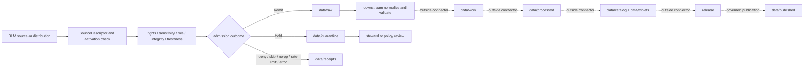

<!-- [KFM_META_BLOCK_V2]
doc_id: kfm://doc/connectors-blm-readme
title: connectors/blm/ — BLM Source Connector Lane
type: readme
version: v0.2
status: draft
owners: OWNER_TBD — Source steward · Connector steward · Land/Cadastral steward · Data steward · Policy steward · Validation steward · Docs steward
created: 2026-06-16
updated: 2026-07-10
policy_label: public; source-admission; raw-quarantine-receipts-only
related:
  - ../README.md
  - ./src/README.md
  - ./src/blm/README.md
  - ./tests/README.md
  - ../../docs/sources/catalog/blm.md
  - ../../data/registry/sources/
  - ../../data/raw/
  - ../../data/quarantine/
  - ../../data/receipts/
  - ../../data/proofs/
  - ../../policy/rights/
  - ../../policy/sensitivity/
  - ../../release/
tags: [kfm, connectors, blm, bureau-of-land-management, source-admission, public-lands, plss, cadastral, land-status, raw, quarantine, receipts, governance]
notes:
  - "v0.2 rebuilds the BLM connector-lane README as a governed source-admission contract."
  - "No-loss preservation: v0.1 source-role, rights, scale, vintage, limitation, raw/quarantine, and no-publication boundaries are retained and expanded."
  - "BLM source material may support public-land, PLSS/CadNSDI, land-status, historic land-record, mineral, recreation, fire, range, vegetation, wildlife, and access context, but it is not county parcel truth, title truth, local road truth, public-access truth, mineral-ownership truth, or final legal interpretation."
  - "Connector outputs are limited to raw, quarantine, and receipt handoffs."
  - "Actual modules, source products, SourceDescriptors, endpoint health, credentials, schedules, rate limits, fixtures, tests, emitted receipts, CI enforcement, and runtime behavior remain NEEDS VERIFICATION."
[/KFM_META_BLOCK_V2] -->

<a id="top"></a>

# BLM Connector

> Governed source-admission support for U.S. Bureau of Land Management source families. This lane may fetch, inspect, and stage BLM material; it does not establish land truth, legal title, public access, policy, proof, release, or publication authority.

<p>
  
  
  
  
  
</p>

`connectors/blm/`

## Quick jumps

[Status](#status) · [Scope](#scope) · [Repo fit](#repo-fit) · [Accepted inputs](#accepted-inputs) · [Exclusions](#exclusions) · [Directory tree](#directory-tree) · [Admission contract](#admission-contract) · [Dataset-family boundaries](#dataset-family-boundaries) · [Sensitive and legal boundaries](#sensitive-and-legal-boundaries) · [Lifecycle](#lifecycle) · [Bounded outcomes](#bounded-outcomes) · [Validation](#validation) · [Safe change pattern](#safe-change-pattern) · [Evidence basis](#evidence-basis) · [Rollback](#rollback) · [Definition of done](#definition-of-done)

---

## Status

> [!IMPORTANT]
> **Status:** `draft` / `NEEDS VERIFICATION`  
> **Owner:** `OWNER_TBD`  
> **Path:** `connectors/blm/`  
> **Owning root:** `connectors/`  
> **Authority:** source-specific fetch, probe, metadata preservation, and admission support only  
> **Truth posture:** the README path and current documentation boundary are `CONFIRMED`; implementation inventory, active SourceDescriptors, endpoint behavior, credentials, schedules, tests, fixtures, receipts, CI enforcement, and runtime behavior remain `NEEDS VERIFICATION`.

> [!CAUTION]
> BLM connector output is candidate admission material. It is not proof of parcel ownership, legal title, surface-management authority, mineral ownership, easement, public access, road status, cultural-resource location, sensitive ecology, or final legal interpretation.

---

## Scope

`connectors/blm/` is the connector lane for governed intake of approved BLM source families and products.

This lane may support:

- descriptor-gated requests to approved BLM services or downloadable distributions;
- endpoint, service, layer, package, and dataset-family inspection;
- source metadata and source-role preservation;
- retrieval timestamps, source vintage, scale, generalization, and digest capture;
- bounded admission decisions;
- handoff to raw, quarantine, and receipt stores;
- package-local source code and connector-scoped offline tests.

This lane must not decide whether admitted material is processed truth, catalog-closed, proof-closed, released, publicly safe, legally authoritative, or suitable for a final user-facing claim.

---

## Repo fit

Directory Rules place `connectors/` at the implementation boundary between external sources and governed lifecycle roots. This child lane refines that responsibility for BLM source families.

```text
External BLM source
  -> connectors/blm/
  -> SourceDescriptor + rights + sensitivity + source-role + integrity gates
  -> data/raw/ or data/quarantine/ + data/receipts/
  -> downstream pipelines and validators
  -> data/work/
  -> data/processed/
  -> data/catalog/ + data/triplets/
  -> release/
  -> data/published/
```

Adjacent responsibility roots:

| Root | Relationship to this lane |
|---|---|
| `docs/sources/catalog/blm.md` | Human-facing BLM source-family profile and source limitations. |
| `data/registry/sources/` | SourceDescriptor identity and source-activation authority. |
| `policy/rights/` | Rights, terms, attribution, redistribution, and access posture. |
| `policy/sensitivity/` | Protected-location and public-exposure decisions. |
| `data/raw/` | Admitted source-native payloads or references. |
| `data/quarantine/` | Held material requiring review or remediation. |
| `data/receipts/` | Run, probe, denial, no-op, rate-limit, and admission receipts. |
| `data/proofs/` | EvidenceBundle and proof closure outside connector ownership. |
| `release/` | Promotion, correction, rollback, and public-release authority. |

---

## Accepted inputs

| Belongs here | Required posture |
|---|---|
| BLM source adapters | Require explicit SourceDescriptor/configuration input; no implicit source activation. |
| Endpoint and service clients | Configurable, timeout-bounded, rate-limit-aware, and testable without live network by default. |
| Service/layer/package inspection helpers | Preserve service identity, layer identity, version, source vintage, and limitations. |
| Metadata parsers | Preserve source-native fields before normalization. |
| Digest and integrity helpers | Deterministic where practical and explicit about byte or resource scope. |
| Admission-envelope helpers | Produce raw/quarantine/receipt handoffs only. |
| Package code under `src/` | Side-effect-free on import and subordinate to this lane contract. |
| Connector-scoped tests under `tests/` | Offline-first; complementary to canonical `tests/`, not a replacement. |
| Connector documentation | Must distinguish source capability from verified activation or runtime behavior. |

---

## Exclusions

| Does not belong here | Correct responsibility root |
|---|---|
| BLM source doctrine or source profile authority | `docs/sources/catalog/` |
| SourceDescriptor records or activation decisions | `data/registry/sources/` |
| Rights and sensitivity rules | `policy/rights/`, `policy/sensitivity/` |
| Machine schemas | `schemas/contracts/v1/` after accepted placement |
| Human contracts and object-family meaning | `contracts/` |
| Normalized work candidates | `data/work/` |
| Processed land or resource records | `data/processed/` |
| Catalog or triplet records | `data/catalog/`, `data/triplets/` |
| EvidenceBundle or proof closure | `data/proofs/` and governed proof workflows |
| Published artifacts and map layers | `data/published/` after release gates |
| Release decisions, corrections, and rollback cards | `release/` |
| Public API, UI, map, or AI behavior | governed application and UI roots |
| Generated QA or build reports | `artifacts/` |

---

## Directory tree

```text
connectors/blm/
├── README.md
├── src/
│   ├── README.md
│   └── blm/
│       └── README.md
└── tests/
    └── README.md
```

> [!NOTE]
> This is the currently documented lane shape, not a complete module inventory. Additional files or directories remain `NEEDS VERIFICATION` until directly inspected.

---

## Admission contract

Every admitted BLM source interaction should preserve, when available:

- SourceDescriptor ID;
- source-family ID;
- dataset-family or product ID;
- endpoint, service, layer, package, item, or record locator;
- retrieval time;
- source publication, update, vintage, or epoch time;
- source-native identifiers;
- source role and authority scope;
- spatial extent, coordinate reference system, scale, resolution, and generalization notes;
- rights, terms, attribution, redistribution, and review posture;
- content digest, checksum, signature, ETag, or last-modified value when available;
- request parameters and pagination/cursor state when material;
- freshness and stale-state posture;
- quarantine, denial, skip, or failure reason;
- receipt reference and rollback target when produced.

The connector must fail closed when source identity, dataset identity, rights, sensitivity, source role, scale, vintage, endpoint behavior, integrity, or destination cannot be resolved strongly enough for admission.

---

## Dataset-family boundaries

BLM is a multi-product source family. Connector code must preserve product boundaries rather than flattening all BLM material into a single authority class.

| Dataset family | Permitted use posture | Must not be treated as |
|---|---|---|
| PLSS / CadNSDI | Survey and cadastral reference context | County parcel ownership, legal title, or deed authority |
| Surface management / land status | Versioned federal management context | Complete ownership, jurisdiction, access, or title truth |
| General Land Office and historic records | Historical source evidence | Present-day ownership or boundary truth |
| Lands and realty | Administrative source context | Final legal interpretation or guaranteed public access |
| Mineral and land records | Source evidence for claims, leases, entries, or records | Mineral ownership truth, active-rights certainty, or legal advice |
| Roads, routes, and access | BLM source context | Local road authority, maintenance status, or guaranteed access |
| Recreation | Facility, route, or use context | Safety certification, accessibility guarantee, or current closure authority |
| Fire and fuels | Source-specific incident, perimeter, or management context | Emergency alerting, final incident truth, or public-safety instruction |
| Range, vegetation, wildlife, and conservation | Management or ecological context | Habitat truth, species-occurrence truth, or safe exact-location disclosure |
| Cultural-resource references | Restricted source context | Public exact-location data or publication permission |

Cross-domain use must occur through governed relations. The connector does not transfer canonical ownership from the relevant domain lane.

---

## Sensitive and legal boundaries

BLM material may intersect with archaeology, sacred places, rare species, critical infrastructure, private holdings, inholdings, disputed access, mineral rights, and living-person or operator context.

The connector must:

- quarantine or deny exact-location detail when sensitivity is unresolved;
- avoid logging protected coordinates, private tokens, credentials, or restricted payloads;
- preserve access restrictions, redaction flags, and source caveats;
- distinguish federal surface management from subsurface rights, private ownership, tribal authority, state authority, county records, and local road authority;
- avoid presenting source availability as redistribution permission;
- avoid presenting map geometry as legal survey, title, boundary, access, or ownership certainty;
- leave redaction, generalization, staged access, and publication decisions to policy and release gates.

---

## Lifecycle



Promotion is a governed state transition outside `connectors/blm/`. Receipts record connector behavior; they do not prove truth, catalog closure, legal authority, or publication readiness.

---

## Bounded outcomes

Connector operations should return explicit finite outcomes rather than ambiguous success booleans.

| Outcome | Meaning |
|---|---|
| `admit_raw` | Descriptor, rights, role, integrity, and destination checks passed for raw admission. |
| `quarantine` | Material was captured or referenced but requires review. |
| `deny` | Admission is not allowed under current evidence or policy. |
| `needs_review` | A steward decision is required before admission can continue. |
| `no_op` | No relevant source change or payload was detected. |
| `rate_limited` | The source deferred or rejected the request due to rate limits. |
| `skipped` | The run intentionally did not execute because prerequisites were unmet. |
| `stale` | The retrieved material is older than the accepted freshness posture. |
| `error` | Retrieval, parsing, integrity, or destination handling failed. |

Every non-admit outcome should carry a reviewable reason code and enough context for diagnosis without exposing sensitive data.

---

## Validation

Before relying on this connector lane, verify:

- [ ] owners and reviewers are confirmed;
- [ ] BLM SourceDescriptors exist and source activation is explicit;
- [ ] actual source products, modules, and endpoints are inventoried;
- [ ] source-family and dataset-family identifiers are preserved;
- [ ] endpoint, service, layer, pagination, cadence, timeout, retry, and rate-limit behavior is configurable;
- [ ] imports are side-effect-free;
- [ ] no-network fixtures cover representative success and failure cases;
- [ ] rights, attribution, redistribution, sensitivity, and access conditions are enforced or fail closed;
- [ ] scale, vintage, resolution, geometry, and generalization metadata is preserved;
- [ ] exact-location sensitive material cannot leak through logs, fixtures, errors, or reports;
- [ ] output helpers can write only raw, quarantine, and receipt handoffs;
- [ ] processed, catalog, triplet, proof, release, published, API, UI, map, and AI authority remains outside this lane;
- [ ] CI runs the relevant tests or the gap remains clearly marked `NEEDS VERIFICATION`.

---

## Safe change pattern

For changes under `connectors/blm/`:

1. Confirm the file belongs to connector implementation, package-local documentation, or connector-scoped tests.
2. Confirm source activation requires an explicit SourceDescriptor or governed configuration.
3. Confirm imports do not perform network calls, filesystem writes, credential reads, or source activation.
4. Confirm source-native identifiers, dataset family, source role, rights, scale, vintage, and limitation notes remain intact.
5. Confirm outputs are restricted to raw, quarantine, and receipt handoffs.
6. Confirm sensitive and legal boundaries fail closed.
7. Update offline fixtures and tests or mark the gap `NEEDS VERIFICATION`.
8. Update related documentation when behavior, source coverage, or admission posture changes.

---

## Evidence basis

| Source | Status | Supports | Limits |
|---|---|---|---|
| `connectors/blm/README.md` prior blob | `CONFIRMED` | Existing BLM lane purpose, raw/quarantine boundary, dataset-family posture, rights/scale/vintage requirements | Did not prove implementation or runtime behavior |
| `connectors/README.md` | `CONFIRMED` documentation contract | Connector-root admission, handoff, and non-publication boundaries | Does not prove child-lane implementation |
| `connectors/blm/src/README.md` | `CONFIRMED` documentation contract | Source-root placement, package discovery, import safety, and lifecycle exclusions | Does not prove actual modules or build success |
| `connectors/blm/src/blm/README.md` | `CONFIRMED` documentation contract | Package boundary, SourceDescriptor gating, dataset-family anti-collapse, sensitive-location posture | Does not prove exports, endpoints, or runtime behavior |
| `connectors/blm/tests/README.md` | `CONFIRMED` documentation contract | Offline test posture, fixture boundaries, bounded outcomes, and CI verification needs | Does not prove tests exist or pass |
| `docs/sources/catalog/blm.md` | `NEEDS VERIFICATION` for current content | Intended BLM source-family doctrine and product context | Does not prove activation, rights clearance, or endpoint health |

---

## Rollback

Rollback is required when a change:

- makes connector output look like legal, cadastral, access, ownership, ecological, or cultural truth;
- enables implicit source activation;
- adds import-time network, filesystem, credential, or mutation side effects;
- permits direct writes to processed, catalog, triplet, proof, release, or published stores;
- weakens rights, sensitivity, exact-location, or logging protections;
- hides stale, corrected, denied, quarantined, or superseded state;
- turns connector tests or receipts into proof of release readiness.

Rollback target for this revision: prior blob `4c253f5e27789496d5785aaf599732ffaced9485`.

---

## Definition of done

- [ ] `OWNER_TBD` is replaced with confirmed owners and reviewers.
- [ ] The complete `connectors/blm/` tree is inventoried.
- [ ] Source products and dataset families are mapped to SourceDescriptors.
- [ ] Endpoint, service, layer, package, cadence, timeout, retry, pagination, and rate-limit behavior is documented.
- [ ] Package imports are verified side-effect-free.
- [ ] Source role, rights, scale, vintage, geometry, resolution, and limitation metadata is preserved.
- [ ] Sensitive archaeology, ecology, infrastructure, private-location, and access context fails closed.
- [ ] Raw, quarantine, and receipt-only handoffs are enforced.
- [ ] Offline fixtures cover admit, quarantine, deny, review, no-op, stale, rate-limit, skip, and error behavior.
- [ ] No processed, catalog, triplet, proof, release, published, API, UI, map, or AI authority lives here.
- [ ] CI/test-runner behavior is verified or explicitly marked `NEEDS VERIFICATION`.
- [ ] Rollback remains possible using the prior blob or a later reviewed commit.

---

## Status summary

`connectors/blm/` is a governed BLM source-admission lane. It may retrieve, inspect, preserve, and stage approved BLM material into raw, quarantine, and receipt handoffs. It is not land truth, parcel truth, legal-title authority, public-access authority, mineral-ownership authority, policy authority, schema authority, catalog/triplet authority, proof closure, release authority, publication authority, public API/UI behavior, map authority, or AI authority.

<p align="right"><a href="#top">Back to top</a></p>
