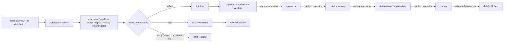

<!-- [KFM_META_BLOCK_V2]
doc_id: kfm://doc/connectors-census-readme
title: connectors/census/ — Census Source Connector Lane
type: readme
version: v0.2
status: draft
owners: OWNER_TBD — Source steward · Connector steward · Frontier Matrix steward · Data steward · Validation steward · Docs steward
created: 2026-06-16
updated: 2026-07-10
policy_label: public; implementation-root; source-admission; aggregate-data; vintage-aware; uncertainty-aware
related:
  - ../README.md
  - ./src/README.md
  - ./src/census/README.md
  - ./tests/README.md
  - ../../docs/sources/catalog/census/README.md
  - ../../docs/sources/catalog/census/acs-estimates.md
  - ../../docs/sources/catalog/census/tiger-line.md
  - ../../docs/sources/catalog/census/decennial-counts.md
  - ../../docs/sources/catalog/census/decennial-microdata.md
  - ../../data/registry/sources/
  - ../../data/raw/
  - ../../data/quarantine/
  - ../../data/receipts/
  - ../../data/proofs/
  - ../../policy/
  - ../../release/
tags: [kfm, connectors, census, acs, decennial, tiger-line, microdata, crosswalks, source-admission, aggregate, administrative, vintage-aware, uncertainty-aware, raw, quarantine, receipts, governance]
notes:
  - "v0.2 aligns the Census connector lane with the governed connector-root, source-tree, package, and test contracts."
  - "No-loss preservation: v0.1 source-admission boundaries, product-family distinctions, vintage handling, uncertainty handling, validation, and definition-of-done requirements are retained and expanded."
  - "Connectors may support raw, quarantine, and receipt handoffs only; they do not own processed data, catalog/triplet records, EvidenceBundle closure, release decisions, public API behavior, or public UI behavior."
  - "Census product families must remain distinct: Decennial counts, ACS estimates, TIGER/Line geography, microdata, historical compilations, and crosswalks do not share one authority model."
  - "Actual modules, SourceDescriptors, endpoint configuration, credentials, schedules, tests, fixtures, receipts, CI wiring, and runtime behavior remain NEEDS VERIFICATION."
[/KFM_META_BLOCK_V2] -->

<a id="top"></a>

# Census Connector

> Governed source-admission support for U.S. Census Bureau product families. This lane may fetch, inspect, stage, and receipt candidate source material; it does not publish demographic truth.

<p>
  
  
  
  
  
  
</p>

`connectors/census/`

## Quick jumps

[Status](#status) · [Scope](#scope) · [Repo fit](#repo-fit) · [Accepted inputs](#accepted-inputs) · [Exclusions](#exclusions) · [Product-family boundaries](#product-family-boundaries) · [Admission contract](#admission-contract) · [Time and geography](#time-and-geography) · [Uncertainty and suppression](#uncertainty-and-suppression) · [Lifecycle](#lifecycle) · [Bounded outcomes](#bounded-outcomes) · [Validation](#validation) · [Evidence basis](#evidence-basis) · [Rollback](#rollback) · [Definition of done](#definition-of-done)

---

## Status

> [!IMPORTANT]
> **Status:** `draft` / `NEEDS VERIFICATION`  
> **Owner:** `OWNER_TBD`  
> **Path:** `connectors/census/`  
> **Authority level:** source-family connector implementation lane  
> **Truth posture:** `CONFIRMED` current README path and child README surfaces; actual modules, product coverage, SourceDescriptors, endpoint behavior, credentials, schedules, fixtures, tests, CI wiring, receipts, and runtime behavior remain `NEEDS VERIFICATION`.

> [!CAUTION]
> Census connector output is admission material, not proof of a final demographic, settlement, boundary, people, land, or historical claim. Counts, estimates, administrative geographies, microdata, historical compilations, and crosswalks must remain source-role- and vintage-aware until governed downstream review and release.

---

## Scope

`connectors/census/` contains implementation support for governed intake of U.S. Census Bureau source families and products.

It may support:

- Decennial census counts;
- American Community Survey estimates;
- TIGER/Line administrative and statistical geography;
- public-use or historical microdata releases;
- historical Census compilations;
- geography relationship and crosswalk files;
- product metadata, manifests, checksums, and retrieval receipts.

It must not become:

- demographic truth;
- administrative-boundary truth outside the stated Census product and vintage;
- living-person identity authority;
- source registry or activation authority;
- schema or contract authority;
- policy authority;
- catalog/triplet authority;
- EvidenceBundle or proof closure;
- release, publication, API, UI, or map authority.

---

## Repo fit

```text
connectors/
└── census/
    ├── README.md
    ├── pyproject.toml
    ├── src/
    │   ├── README.md
    │   └── census/
    │       └── README.md
    └── tests/
        └── README.md
```

| Surface | Responsibility |
|---|---|
| `connectors/census/README.md` | Source-family connector boundary and product-family admission posture. |
| `connectors/census/src/README.md` | Python source-root boundary. |
| `connectors/census/src/census/README.md` | Importable package contract. |
| `connectors/census/tests/README.md` | Offline connector test-lane contract. |
| `docs/sources/catalog/census/` | Source and product doctrine; connectors must not replace it. |
| `data/registry/sources/` | SourceDescriptor and activation authority. |
| `data/raw/`, `data/quarantine/`, `data/receipts/` | Allowed connector handoff surfaces. |
| `data/work/`, `data/processed/`, `data/catalog/`, `data/triplets/`, `data/proofs/`, `data/published/` | Downstream lifecycle and proof surfaces outside connector ownership. |
| `policy/` | Rights, privacy, sensitivity, and publication decisions. |
| `release/` | Release, correction, supersession, and rollback authority. |

---

## Accepted inputs

| Belongs here | Required posture |
|---|---|
| Product-specific source adapters | Require explicit SourceDescriptor/config input; no implicit activation. |
| Endpoint and manifest clients | Preserve product family, vintage, geography, release, table, group, and variable context. |
| Metadata parsers | Retain source-native fields, annotations, suppression markers, and limitation text. |
| Digest and retrieval helpers | Deterministic where practical; preserve checksum and receipt inputs. |
| Raw/quarantine handoff helpers | Require explicit destination and receipt metadata. |
| Connector-local documentation | Must not claim source activation, successful runs, or publication without evidence. |
| Offline tests and small local test helpers | Must not become fixture authority or embed sensitive microdata. |

---

## Exclusions

| Does not belong here | Correct responsibility root |
|---|---|
| SourceDescriptor records and activation decisions | `data/registry/sources/` |
| Census source/product doctrine | `docs/sources/catalog/census/` |
| Machine schemas and human contracts | `schemas/contracts/` and `contracts/` after accepted placement |
| Processed demographic, boundary, crosswalk, or historical records | `data/processed/` |
| Catalog and triplet records | `data/catalog/`, `data/triplets/` |
| EvidenceBundle and proof closure | `data/proofs/` and governed proof workflows |
| Published layers, tables, APIs, or UI payloads | `data/published/` and governed app roots after release |
| Release decisions, corrections, and rollback state | `release/` |
| Reusable cross-domain helpers | `packages/` |
| Executable transformations beyond source admission | `pipelines/` |
| Declarative pipeline definitions | `pipeline_specs/` |
| Generated reports and QA outputs | `artifacts/` |

---

## Product-family boundaries

Census is a multi-product source family. Connector code must not collapse product families into one undifferentiated authority.

| Product family | Required interpretation |
|---|---|
| Decennial counts | Aggregate counts tied to a defined census, universe, table, geography, and vintage. |
| ACS estimates | Statistical estimates; preserve estimate, margin of error, annotation, universe, period, and release. |
| TIGER/Line | Administrative/statistical geometry and identifiers tied to a specific vintage; not universal real-world boundary truth. |
| Microdata | Person/household-level records under product-specific disclosure, rights, and privacy constraints; never treat as identity authority. |
| Historical compilations | Preserve compiler, transformation lineage, source citations, edition, and known gaps. |
| Crosswalks/relationship files | Derived temporal-geography aids; not lossless identity maps and not authority for unrelated domains. |

> [!IMPORTANT]
> A product can orient or contextualize another KFM domain without owning that domain's canonical claim. Census geometry does not prove land title, road authority, jurisdictional practice, settlement history, or individual identity.

---

## Admission contract

Every admitted Census candidate should preserve, when applicable:

- SourceDescriptor reference;
- source family and product family;
- dataset, group, table, variable, file, or layer identity;
- release, edition, survey, census year, period, and vintage;
- geography type, geography code, hierarchy, and geometry vintage;
- universe and denominator;
- count, estimate, margin of error, annotation, suppression, null, and missing-state semantics;
- source-native identifiers separate from normalized KFM identifiers;
- retrieval time, source release time, and source-valid period;
- endpoint, file, package, or distribution locator;
- content digest and integrity metadata;
- rights, privacy, disclosure, and sensitivity posture;
- source role, limitations, and caveats;
- quarantine reason or bounded outcome.

Missing material must remain missing. A connector must not silently convert a suppression, annotation, null, unavailable value, or parsing failure into zero.

---

## Time and geography

Census products are time-aware and geography-aware by construction.

Connector code must:

- preserve source vintage and release version;
- preserve whether time represents census date, survey period, release date, retrieval date, or historical reference period;
- keep geography identifiers scoped to their product and vintage;
- avoid joining records across vintages by code alone;
- require an explicit, provenance-bearing relationship or crosswalk for cross-vintage comparison;
- preserve split, merge, rename, annexation, boundary-change, and unmatched states;
- avoid describing administrative/statistical boundaries as timeless real-world truth.

```text
NEVER ASSUME:
  GEOID(vintage A) == GEOID(vintage B)
  tract geometry == municipal authority
  Census place == settlement history
  TIGER road geometry == legal access or road authority
```

---

## Uncertainty and suppression

For estimate-bearing or disclosure-controlled products, connector code must preserve uncertainty and disclosure semantics.

Required distinctions include:

- estimate versus count;
- margin of error versus standard error or other uncertainty fields;
- annotation versus value;
- suppressed versus unavailable versus not applicable versus true zero;
- universe and denominator differences;
- one-year versus multi-year ACS releases;
- sampling and nonsampling caveats;
- public-use microdata versus restricted or non-public individual records.

No connector helper may strip uncertainty fields merely because a downstream display does not yet use them.

---

## Lifecycle



Connectors may provide evidence for later gates. They do not perform catalog closure, proof closure, release approval, or publication.

---

## Bounded outcomes

Connector execution should return explicit, inspectable outcomes rather than silent success or ambiguous failure.

| Outcome | Meaning |
|---|---|
| `admit_raw` | Descriptor, product, vintage, integrity, rights, and privacy gates allow raw admission. |
| `quarantine` | Material was captured but requires review. |
| `deny` | Policy, rights, privacy, or source conditions prohibit admission. |
| `needs_review` | A checkable human decision is required before admission. |
| `no_op` | No new or changed source material was identified. |
| `rate_limited` | Source throttling prevented completion; no silent partial success. |
| `skipped` | Run was intentionally not attempted under documented conditions. |
| `error` | Execution failed; partial state must remain bounded and receipted. |

Each non-success outcome should carry a stable reason code, source reference, timestamp, and retry/review posture where applicable.

---

## Validation

Before relying on this connector lane, verify:

- [ ] SourceDescriptors exist and are active for each supported product.
- [ ] Product-family catalog pages are current.
- [ ] Actual modules, imports, exports, and package discovery are inventoried.
- [ ] Imports perform no network calls, filesystem writes, credential reads, or source activation.
- [ ] Endpoint, file, cadence, timeout, retry, pagination, and rate-limit behavior is configurable.
- [ ] Tests are offline by default and use small, reviewable, non-sensitive fixtures.
- [ ] Product family, release, vintage, geography, universe, uncertainty, annotation, suppression, and null semantics are preserved.
- [ ] Cross-vintage joins require explicit relationship evidence.
- [ ] Output helpers cannot write processed, catalog, triplet, proof, published, or release records.
- [ ] Logs and receipts do not expose credentials, restricted microdata, or unnecessary sensitive detail.
- [ ] CI runs the relevant tests or the gap remains `NEEDS VERIFICATION`.

---

## Safe change pattern

For changes under `connectors/census/`:

1. Confirm the change belongs to source admission, package support, connector tests, or connector documentation.
2. Confirm source activation remains descriptor-gated.
3. Confirm no import-time network, filesystem, credential, or activation side effects are introduced.
4. Preserve product family, source role, vintage, geography, universe, aggregation, uncertainty, annotations, suppression, and limitation fields.
5. Confirm outputs remain limited to raw, quarantine, and receipt handoffs.
6. Add or update offline tests for success, quarantine, denial, no-op, rate-limit, skipped, and error behavior.
7. Update adjacent README contracts when package layout or responsibility changes.
8. Record rollback instructions for behavior-significant changes.

---

## Evidence basis

| Source | Status | Supports | Limits |
|---|---|---|---|
| Existing `connectors/census/README.md` v0.1 | `CONFIRMED` | Source-admission boundary, product-family distinctions, vintage, aggregation, uncertainty, validation, and exclusions. | Did not prove current implementation or runtime behavior. |
| `connectors/README.md` | `CONFIRMED` | Connector-root authority and raw/quarantine/receipt-only handoff posture. | Does not prove this lane's implementation completeness. |
| `connectors/census/src/README.md` | `CONFIRMED` documentation surface | Python source-root boundary. | Does not prove package discovery or installation. |
| `connectors/census/src/census/README.md` | `CONFIRMED` documentation surface | Importable package contract. | Does not prove modules, exports, or runtime behavior. |
| `connectors/census/tests/README.md` | `CONFIRMED` documentation surface | Offline connector test contract. | Does not prove tests exist, pass, or run in CI. |
| Census catalog pages under `docs/sources/catalog/census/` | `NEEDS VERIFICATION` for current contents | Intended source/product doctrine. | Path references alone do not prove currentness or activation. |

---

## Rollback

Rollback is required if this README or related implementation is used to justify:

- implicit source activation;
- direct writes beyond raw, quarantine, or receipt handoffs;
- removal of vintage, uncertainty, annotation, suppression, or universe semantics;
- cross-vintage joins without explicit relationship evidence;
- treatment of TIGER/Line as timeless boundary truth;
- treatment of estimates as exact counts;
- exposure of restricted or sensitive microdata;
- direct publication, API, UI, map, proof, catalog, or release authority.

Rollback target: prior blob `e5841c944266b8d833c0af15a30e7ed704c880ee`.

---

## Definition of done

- [ ] Owners are confirmed and `OWNER_TBD` is replaced.
- [ ] Actual connector, source-tree, package, and test contents are inventoried.
- [ ] Supported Census product families are tied to active SourceDescriptors and catalog pages.
- [ ] Endpoint, file, cadence, timeout, retry, pagination, vintage, and rate-limit behavior is documented and tested.
- [ ] Imports are side-effect-free.
- [ ] Counts, estimates, uncertainty, annotations, suppression, null states, universes, releases, vintages, and geographies are preserved.
- [ ] Cross-vintage geography behavior is explicit and provenance-bearing.
- [ ] Outputs are verified to enter only raw, quarantine, and receipt handoff lanes.
- [ ] No processed, catalog, triplet, proof, published, release, schema, policy, registry, API, UI, or reusable package authority lives here.
- [ ] No-network tests and safe fixtures are verified.
- [ ] Sensitive or restricted microdata cannot leak through logs, fixtures, reports, or receipts.
- [ ] CI behavior and current test status are verified or marked `NEEDS VERIFICATION`.
- [ ] Rollback instructions are tested for behavior-significant changes.

---

## Status summary

`connectors/census/` is the governed source-admission lane for Census product families. It may support descriptor-gated fetch, metadata preservation, integrity checks, and raw/quarantine/receipt handoffs. It is not demographic truth, administrative-boundary truth, living-person identity authority, source registry authority, schema authority, policy authority, catalog/triplet authority, EvidenceBundle closure, release authority, publication authority, public API behavior, public UI behavior, or reusable domain-package authority.

<p align="right"><a href="#top">Back to top</a></p>
