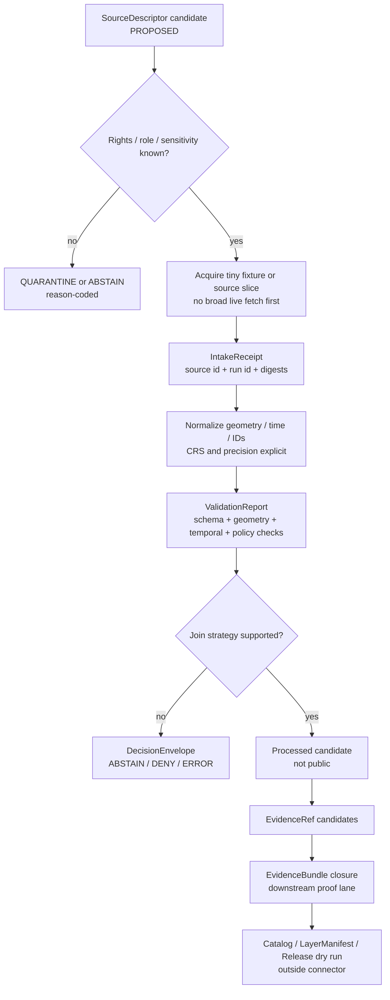

<!-- [KFM_META_BLOCK_V2]
doc_id: kfm://doc/NEEDS_VERIFICATION
title: County Connector README
type: standard
version: v1
status: draft
owners: [Bartytime, NEEDS_VERIFICATION]
created: 2026-05-07
updated: 2026-05-07
policy_label: restricted
related: [kfm://doc/NEEDS_VERIFICATION, connectors/README.md, docs/sources/README.md, docs/domains/README.md]
tags: [kfm, connector, county, geospatial, evidence, lifecycle]
notes: [Extended Pro repo-ready README rebuilt from the supplied County Connector draft. Target path, owner authority, command names, links, schemas, validators, and runtime behavior remain NEEDS VERIFICATION until checked against the active repo.]
[/KFM_META_BLOCK_V2] -->

<a id="top"></a>

# County Connector README

County-level source admission and harmonization support for KFM’s governed spatial evidence lifecycle.

<p align="center">
  <strong>County sources in. Evidence-resolved joins out. No silent publication.</strong>
</p>

<p align="center">
  
  
  
  
  
  
  
</p>

> [!IMPORTANT]
> **Current evidence boundary:** this README is grounded in the supplied County Connector draft, KFM Directory Rules, and KFM doctrine. The active repo path, adjacent files, executable commands, CI wiring, schemas, validators, source descriptors, owners, and runtime behavior remain **NEEDS VERIFICATION**.

> [!CAUTION]
> This connector surface must not become a shortcut around KFM’s trust path. It may support source admission, small public-safe fixtures, crosswalk planning, and receipt-bearing connector work. It must not silently publish, mutate canonical truth, expose RAW/WORK/QUARANTINE material, or treat spatial joins as proof without EvidenceBundle closure.

---

## Status at a glance

| Field | Value |
|---|---|
| **Status** | `draft` |
| **Owners** | `Bartytime` from supplied draft; CODEOWNERS authority **NEEDS VERIFICATION** |
| **Proposed path** | `connectors/county/README.md` |
| **Repo fit** | Source-facing county connector/admission lane under `connectors/` |
| **Evidence posture** | Source-bounded; no mounted active repo proof in this session |
| **Publication posture** | Restricted; no direct public release |
| **Primary downstream proof lane** | Hydrology-first / public-safe fixture-first |
| **Runtime claims** | **UNKNOWN** until active repo inspection confirms commands and implementation |

**Quick jump:** [Scope](#scope) · [Repo fit](#repo-fit) · [Accepted inputs](#accepted-inputs) · [Exclusions](#exclusions) · [Connector flow](#connector-flow) · [Join strategy](#join-strategy) · [Directory tree](#directory-tree) · [Quickstart](#quickstart) · [Usage](#usage) · [Gate matrix](#gate-matrix) · [Task list](#task-list--definition-of-done) · [FAQ](#faq) · [Appendix](#appendix)

---

## Scope

The **County Connector** is a proposed KFM connector/admission surface for county-level geospatial source families that need deterministic, reviewable, evidence-bearing movement into KFM.

It is designed to answer one narrow question:

> Can a county-level source or crosswalk candidate enter KFM in a way that preserves source identity, spatial/temporal support, rights posture, sensitivity posture, reproducible joins, validation records, and downstream EvidenceBundle closure?

This README covers the connector-facing contract for:

- county administrative boundary intake
- parcel or cadastral source admission
- county road / route layer admission
- hydrology boundary and crosswalk support
- small public-safe fixtures for connector validation
- deterministic spatial join planning
- EvidenceBundle and DecisionEnvelope handoff expectations
- fail-closed review, quarantine, and release boundaries

This README does **not** confirm executable connector code exists.

---

## Repo fit

### Proposed home

`connectors/county/README.md`

This path is **PROPOSED** because the supplied draft names a County Connector, and KFM Directory Rules identify `connectors/` as the source-facing root for source-specific fetch and source-admission code. If active repo inspection proves county harmonization is implemented as a pipeline or package instead of a connector, this README should be moved or split with an ADR or migration note.

| Relationship | Proposed link | Status | Reason |
|---|---:|---|---|
| Parent connector index | [`../README.md`](../README.md) | **NEEDS VERIFICATION** | Should define connector-wide rules if present |
| Source registry | [`../../data/registry/sources/`](../../data/registry/sources/) | **NEEDS VERIFICATION** | SourceDescriptor records should be registered outside connector docs |
| Source docs | [`../../docs/sources/`](../../docs/sources/) | **NEEDS VERIFICATION** | Human source guidance belongs in docs |
| Domain context | [`../../docs/domains/`](../../docs/domains/) | **NEEDS VERIFICATION** | County data crosses boundaries, hydrology, roads, land records, and infrastructure |
| Machine schemas | [`../../schemas/contracts/v1/`](../../schemas/contracts/v1/) | **NEEDS VERIFICATION** | Machine-checkable shape belongs under schemas, not connector prose |
| Policy gates | [`../../policy/`](../../policy/) | **NEEDS VERIFICATION** | Policy owns allow/deny/restrict/abstain decisions |
| Validation tools | [`../../tools/validators/`](../../tools/validators/) | **NEEDS VERIFICATION** | Connector checks should be executable and fail closed |
| Lifecycle outputs | [`../../data/raw/`](../../data/raw/), [`../../data/quarantine/`](../../data/quarantine/), [`../../data/processed/`](../../data/processed/) | **NEEDS VERIFICATION** | Connector output must enter lifecycle stores, not stay in the connector folder |
| Release authority | [`../../release/`](../../release/) | **NEEDS VERIFICATION** | Publication requires release decision objects, not connector success |

> [!NOTE]
> `connectors/county/` should be a source-admission boundary. If a future implementation performs heavy harmonization, tiling, catalog closure, or publication, those responsibilities should be delegated to `pipelines/`, `packages/`, `data/`, `release/`, and governed API/UI surfaces.

[Back to top](#top)

---

## What this is / is not

| This is | This is not |
|---|---|
| A connector-facing README for county-level source admission | A proof that `connectors/county/` exists in the active repo |
| A guide for deterministic county joins and crosswalk handoff | A claim that listed commands are currently runnable |
| A place to document accepted inputs, exclusions, gates, and review burden | A home for raw data dumps or published artifacts |
| A trust-boundary reminder for EvidenceBundle and DecisionEnvelope flow | A policy engine, schema authority, release manifest, or public API |
| A staged path toward hydrology-first proof and county-safe integration | A direct path from source fetch to public map layer |

---

## Accepted inputs

Only small, reviewable, source-bounded material belongs here.

| Input | Belongs here when... | Required posture |
|---|---|---|
| `SourceDescriptor` candidate | It describes a county-level source family before live activation | **PROPOSED / NEEDS VERIFICATION** |
| County boundary source note | It identifies source role, vintage, spatial scope, and authority limits | Evidence-first |
| Parcel / cadastral source note | It clearly separates assessor/tax records from title truth | Restricted by default where people/property exposure matters |
| County road or route source note | It separates alignment, jurisdiction, restriction, and status | Source-role visible |
| Hydrology crosswalk note | It supports COMID/HUC/county relationship review without claiming truth alone | Hydrology-first |
| Tiny public-safe fixture | It is synthetic or safe, deterministic, and small enough for tests | Fixture ≠ proof ≠ publication |
| Join strategy profile | It records join method, tolerance, CRS, precision, and fallback reason | Reproducibility required |
| Intake or validation receipt example | It records process memory without becoming proof | Receipt-bearing |
| Manual exception note | It explains why automation abstained or required review | DecisionEnvelope handoff |

---

## Exclusions

| Does **not** belong here | Put it here instead | Why |
|---|---|---|
| Raw provider downloads | `data/raw/<domain>/<source>/<run>/` | RAW is lifecycle material, not connector documentation |
| Failed or unsafe payloads | `data/quarantine/<domain>/<reason>/<run>/` | Quarantine must be explicit and auditable |
| Processed normalized datasets | `data/processed/<domain>/<dataset>/<version>/` | Processed candidates belong in lifecycle stores |
| Published PMTiles, GeoParquet, reports, exports | `data/published/` plus `release/` records | Publication is a governed transition |
| Release manifests, proof packs, rollback cards | `release/` | Release authority does not belong in connector code |
| Canonical JSON Schemas | `schemas/contracts/v1/` | Schemas own machine validation |
| Contract semantics | `contracts/` | Contracts own object meaning |
| Rego or policy logic | `policy/` | Policy owns allow/deny/restrict/abstain |
| General-purpose validators | `tools/validators/` | Validators should be executable and reusable |
| Pipeline orchestration | `pipelines/` and `pipeline_specs/` | Pipelines own how work runs |
| Governed API routes | `apps/governed_api/` or repo-confirmed equivalent | Public clients must use governed interfaces |
| UI / Evidence Drawer components | UI app or package path after repo verification | UI must consume governed envelopes only |
| Secrets, API keys, tokens | Nowhere in repo | Secrets must never be committed |
| Living-person, DNA, exact sensitive-location material | Quarantine or restricted steward path | Fail closed until policy/steward review |

[Back to top](#top)

---

## Connector flow



> [!IMPORTANT]
> A successful connector run is not publication. Connector success may create receipts, candidate outputs, and reviewable handoff records. Public exposure still requires validation, policy, EvidenceBundle closure, review, release manifest, correction path, and rollback target.

---

## Join strategy

County-level data often needs spatial alignment across boundaries, hydrology, roads, parcels, and historic or administrative units. The connector should prefer official identifiers and crosswalks before geometry fallbacks.

| Rank | Join method | Use when | Required record |
|---:|---|---|---|
| 1 | Official identifier / crosswalk | A source provides stable county FIPS, HUC, COMID, route ID, parcel ID, or documented relationship table | `join_method`, source/version, key fields, source authority, effective date |
| 2 | Polygon overlay | No official key exists, but polygon geometry supports reproducible overlay | CRS, geometry hash, precision, area threshold, overlap result |
| 3 | Containment / centroid fallback | A point or feature can be assigned to a containing polygon with known ambiguity limits | centroid rule, tolerance, ambiguity flag |
| 4 | Outlet / pour-point snap | Hydrology assignment needs a last-resort pour-point or network snap | snap distance, target network version, method caveat |
| 5 | Manual review / abstain | Automated assignment is ambiguous, sensitive, unsupported, or rights-blocked | DecisionEnvelope with reason code and review requirement |

### Minimum join metadata

Every nontrivial join should preserve:

- source descriptor reference
- input dataset version or fixture id
- join method
- CRS and precision assumptions
- spatial tolerance or threshold
- temporal basis / boundary vintage
- ambiguity class
- evidence reference or pending EvidenceRef
- validation report reference
- reviewer / exception record when manual override occurs

---

## Evidence and decision objects

| Object | Role in this README | Connector may emit? | Connector may treat as proof? |
|---|---|---:|---:|
| `SourceDescriptor` | Defines source identity, source role, rights, cadence, caveats | Yes, as candidate | No |
| `IntakeReceipt` | Records source acquisition / fixture admission | Yes | No |
| `ValidationReport` | Records validation pass/fail and reasons | Yes | No |
| `DecisionEnvelope` | Records allow/deny/abstain/error for connector-facing decisions | Yes, if implemented | No |
| `EvidenceRef` | Points to support that must resolve later | Candidate only | No |
| `EvidenceBundle` | Resolved support package for claims/layers | Usually downstream | Yes, when closed and released |
| `CatalogRecord` | Discoverable metadata and closure | Downstream | No, not alone |
| `ReleaseManifest` | Publication state transition record | Downstream | Release authority |
| `CorrectionNotice` | Public/steward correction record | Downstream | Correction authority with release lineage |
| `RollbackPlan` | Reversible release target | Downstream | Operational release support |

---

## Directory tree

The tree below is **PROPOSED**. It is written as a connector-facing README layout, not as a claim that these files currently exist.

```text
connectors/
└── county/
    ├── README.md
    ├── descriptors/
    │   ├── README.md
    │   └── county_source_descriptor.example.yaml
    ├── adapters/
    │   ├── README.md
    │   ├── boundaries/
    │   │   └── README.md
    │   ├── parcels/
    │   │   └── README.md
    │   ├── roads/
    │   │   └── README.md
    │   └── hydrology/
    │       └── README.md
    ├── fixtures/
    │   ├── README.md
    │   ├── valid/
    │   │   └── county_join_candidate.example.json
    │   └── invalid/
    │       └── missing_source_role.example.json
    ├── examples/
    │   ├── README.md
    │   └── county_join_plan.example.yaml
    └── OPEN_QUESTIONS.md
```

### Tree ownership notes

| Path | Owns | Does not own |
|---|---|---|
| `descriptors/` | Local examples or drafts for source descriptor candidates | Canonical source registry |
| `adapters/` | Source-facing adapter documentation and thin code after verification | Pipeline orchestration or publication |
| `fixtures/` | Tiny public-safe connector fixtures | Real provider mirrors or sensitive data |
| `examples/` | Illustrative join plans and command shapes | Executable truth unless verified |
| `OPEN_QUESTIONS.md` | Pending placement/source/tooling questions | Permanent undocumented ambiguity |

> [!TIP]
> If the active repo already uses `ingest/` and `preflight/` under connector leaves, keep the repo convention and update this README with the verified tree. If not, prefer names that keep the source-admission role obvious: `descriptors/`, `adapters/`, `fixtures/`, and `examples/`.

[Back to top](#top)

---

## Quickstart

The commands below are **PROPOSED command shapes**, not confirmed executable commands.

```bash
# PROPOSED / NEEDS VERIFICATION
# 1. Validate a county source descriptor candidate.
python -m tools.validators.source_descriptor \
  connectors/county/descriptors/county_source_descriptor.example.yaml

# PROPOSED / NEEDS VERIFICATION
# 2. Run connector-gate checks against a tiny public-safe fixture.
python -m tools.validators.connector_gate \
  --candidate connectors/county/fixtures/valid/county_join_candidate.example.json

# PROPOSED / NEEDS VERIFICATION
# 3. Dry-run a join plan without publishing.
python -m connectors.county.cli dry-run \
  --plan connectors/county/examples/county_join_plan.example.yaml \
  --out data/work/county/NEEDS_VERIFICATION/run_receipt.json

# PROPOSED / NEEDS VERIFICATION
# 4. Confirm no public output was emitted.
find data/published -maxdepth 3 -type f | grep county && exit 1 || true
```

Expected early behavior:

- descriptor checks fail closed when rights, source role, sensitivity, or cadence is unknown
- invalid fixtures produce reason-coded validation failures
- dry-runs emit receipts and reports, not public releases
- published outputs remain absent until release gates are implemented and passed

---

## Usage

### Illustrative join-plan shape

This example is **illustrative**. It should become a schema-backed fixture only after the active repo schema home is verified.

```yaml
# connectors/county/examples/county_join_plan.example.yaml
status: PROPOSED
plan_id: county_join_plan_NEEDS_VERIFICATION
county_fips: "NEEDS_VERIFICATION"
source_descriptor_ref: kfm://source/NEEDS_VERIFICATION
input_manifest_ref: kfm://receipt/NEEDS_VERIFICATION

join_ladder:
  - rank: 1
    method: official_crosswalk
    keys: [county_fips, huc12, comid]
    required: false
  - rank: 2
    method: polygon_overlay
    crs: EPSG:4326
    minimum_overlap_ratio: NEEDS_VERIFICATION
  - rank: 3
    method: centroid_containment
    tolerance_meters: NEEDS_VERIFICATION
  - rank: 4
    method: outlet_snap
    snap_distance_meters: NEEDS_VERIFICATION
  - rank: 5
    method: manual_review_or_abstain

outputs:
  emit_intake_receipt: true
  emit_validation_report: true
  emit_decision_envelope: true
  publish: false

policy:
  deny_if_rights_unknown: true
  deny_if_sensitive_exact_geometry: true
  abstain_if_join_ambiguous: true
```

### Illustrative output envelope

```json
{
  "object_type": "DecisionEnvelope",
  "status": "PROPOSED",
  "outcome": "ABSTAIN",
  "reason_codes": [
    "JOIN_AMBIGUOUS",
    "EVIDENCE_BUNDLE_UNRESOLVED"
  ],
  "candidate_id": "kfm://candidate/NEEDS_VERIFICATION",
  "source_descriptor_ref": "kfm://source/NEEDS_VERIFICATION",
  "validation_report_ref": "kfm://validation/NEEDS_VERIFICATION",
  "evidence_bundle_ref": "kfm://evidence/NEEDS_VERIFICATION",
  "publishable": false
}
```

[Back to top](#top)

---

## Gate matrix

| Gate | Blocks when | Expected result |
|---|---|---|
| Source identity | source id, role, authority, or steward is missing | `DENY` or `ABSTAIN` |
| Rights | license, redistribution, or attribution is unclear | `DENY` public release |
| Sensitivity | exact sensitive geometry, living-person linkage, critical infrastructure, rare species, archaeology, or cultural sensitivity is present | `DENY`, generalize, redact, or quarantine |
| Geometry | invalid geometry, wrong CRS, unsupported precision, or out-of-scope extent | `ERROR` or quarantine |
| Temporal basis | boundary vintage, observation time, source time, or retrieval time is missing where material | `ABSTAIN` |
| Join ambiguity | crosswalk or overlay produces many-to-many or unsupported assignment | `ABSTAIN` with review requirement |
| Evidence closure | EvidenceRef cannot resolve to EvidenceBundle | `ABSTAIN` |
| Policy | policy returns deny/restrict/obligation not satisfied | `DENY` or hold |
| Release | ReleaseManifest, proof pack, correction path, or rollback target is missing | no publication |
| UI/API | public output would expose raw path, candidate path, or direct model output | `DENY` |

---

## Task list / Definition of Done

### Phase 0 — README and placement review

- [ ] Confirm the active repo target path for this README.
- [ ] Confirm whether `connectors/county/` exists or should be created.
- [ ] Confirm whether county work belongs under `connectors/`, `pipelines/domains/`, `packages/domains/`, or `docs/domains/`.
- [ ] Update `owners` from CODEOWNERS or project governance evidence.
- [ ] Replace `NEEDS_VERIFICATION` links with real relative links.
- [ ] Add or update parent `connectors/README.md` link if present.

### Phase 1 — source-admission skeleton

- [ ] Add one valid SourceDescriptor fixture.
- [ ] Add one invalid SourceDescriptor fixture.
- [ ] Add one valid tiny county join candidate fixture.
- [ ] Add one invalid fixture for missing source role.
- [ ] Add one invalid fixture for ambiguous join.
- [ ] Add one invalid fixture for sensitive exact geometry.
- [ ] Add connector-gate validation command or documented runner.

### Phase 2 — hydrology-first proof handoff

- [ ] Add a public-safe HUC/county relationship fixture.
- [ ] Record CRS, precision, and boundary vintage.
- [ ] Emit an IntakeReceipt.
- [ ] Emit a ValidationReport.
- [ ] Emit a DecisionEnvelope.
- [ ] Confirm unresolved EvidenceBundle returns `ABSTAIN`.
- [ ] Confirm valid fixture can hand off to downstream EvidenceBundle closure.

### Phase 3 — release-boundary proof

- [ ] Confirm connector never writes directly to `data/published/`.
- [ ] Confirm connector never writes release manifests.
- [ ] Confirm downstream release dry-run exists before public exposure.
- [ ] Confirm rollback and correction fixtures exist before public layer activation.
- [ ] Confirm public API/UI uses released artifacts only.

---

## FAQ

### Is this connector allowed to publish a county layer?

No. Connector success is not publication. Publication requires validation, policy, review, proof, release manifest, correction path, and rollback target.

### Can raw county files live under `connectors/county/`?

No. Raw provider files belong in lifecycle storage such as `data/raw/` or `data/quarantine/`, with receipts and source descriptors. This README may include tiny public-safe fixtures only.

### Why not join everything spatially and fix problems later?

Because ambiguous joins create false authority. KFM should prefer official identifiers/crosswalks, record spatial fallback assumptions, and abstain or require review when assignment is unsupported.

### Does a county parcel source prove ownership?

No. Parcel geometry and assessor/tax rows are not title truth by themselves. Land ownership claims require source-role-specific evidence and review.

### Can this handle sensitive data?

Only with fail-closed posture. Living-person data, exact sensitive locations, rare species, archaeology, critical infrastructure, DNA/genomic material, and culturally sensitive locations require quarantine, restriction, generalization, redaction, staged access, or denial unless policy and steward review explicitly allow use.

### Should this README include real source URLs?

Only after source rights, terms, cadence, authority, sensitivity, and attribution are reviewed. Candidate source links may appear in the appendix as **NEEDS VERIFICATION**, not as activated connectors.

---

## Appendix

<details>
<summary><strong>Appendix A — candidate source references from supplied draft</strong></summary>

These references were present in the supplied County Connector draft or adjacent KFM hydrology planning context. Treat them as candidate references until source activation review confirms current endpoints, licensing, terms, versions, cadence, attribution, and use limits.

| Candidate reference | Use | Status |
|---|---|---|
| USGS NHDPlus V2.1 Data Catalog | Candidate hydrology/network/crosswalk context | **NEEDS VERIFICATION** |
| EPA NHDPlus User Guide | Candidate technical reference for NHDPlus concepts | **NEEDS VERIFICATION** |
| USGS 12-digit hydrologic unit outlet pour points | Candidate outlet/pour-point support | **NEEDS VERIFICATION** |
| County parcel/cadastral providers | Candidate county land-record source family | **NEEDS VERIFICATION** |
| County road / transportation providers | Candidate county road/source family | **NEEDS VERIFICATION** |
| Local upload / steward-provided county files | Candidate controlled intake mode | **NEEDS VERIFICATION** |

</details>

<details>
<summary><strong>Appendix B — open verification items</strong></summary>

| Item | Why it matters | Target disposition |
|---|---|---|
| Active repo path | README path cannot be confirmed from mounted repo evidence | Verify before commit |
| CODEOWNERS / owner | `Bartytime` appears in supplied draft; repo authority still needs confirmation | Replace with verified owner |
| Parent connector README | Links and local conventions should match adjacent docs | Verify and update |
| Command names | No executable connector commands confirmed | Replace illustrative commands |
| Schema home | `schemas/contracts/v1/` is doctrine-supported but active repo convention still needs verification | Confirm ADR |
| Source descriptor registry | Connector should not invent registry authority | Link to canonical source registry |
| Validation runner | Gate commands should match repo tooling | Confirm `tools/validators/` conventions |
| Policy gates | Deny/abstain behavior must be executable, not prose-only | Add tests |
| EvidenceBundle ID format | Placeholder URI must be replaced | Verify ID convention |
| Release path | Connector must not publish directly | Verify release dry-run and rollback path |
| Sensitive geometry policy | Public output must fail closed | Add negative fixtures |
| Hydrology proof fixture | First proof handoff should be public-safe | Add or link fixture |

</details>

<details>
<summary><strong>Appendix C — reviewer checklist</strong></summary>

- [ ] The README states its evidence boundary.
- [ ] The README has status, owners, badges, and quick jumps.
- [ ] The README includes scope, repo fit, accepted inputs, and exclusions.
- [ ] The README does not claim current implementation without repo proof.
- [ ] Every proposed path is labeled **PROPOSED** or **NEEDS VERIFICATION**.
- [ ] The connector does not own raw lifecycle storage.
- [ ] The connector does not own publication.
- [ ] The connector does not own policy law.
- [ ] The connector does not own machine schema authority.
- [ ] The connector requires receipts and validation reports.
- [ ] The connector requires EvidenceBundle handoff before public claims.
- [ ] The connector fails closed for rights, sensitivity, stale evidence, and ambiguous joins.
- [ ] The diagram reflects KFM lifecycle boundaries.
- [ ] Long reference material is collapsed.
- [ ] All placeholder links are reviewable.

</details>
