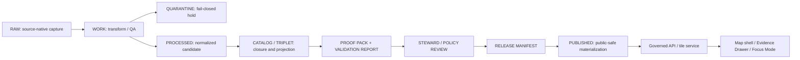

<!-- [KFM_META_BLOCK_V2]
doc_id: kfm://doc/NEEDS_VERIFICATION
title: County Connector README
type: standard
version: v1
status: draft
owners: [Bartytime]
created: 2026-05-07
updated: 2026-05-07
policy_label: restricted
related: [kfm://doc/NEEDS_VERIFICATION]
tags: [kfm, connector, county]
notes: [Full Extended Pro-level KFM README: top-of-file badges, layered impact, governance checklist, quick links, Mermaid lifecycle, CLI examples, PROPOSED directory layout, KFM Notes, collapsible references, hydrology-first proof lane, EvidenceBundle and DecisionEnvelope placeholders pending repo verification]
[/KFM_META_BLOCK_V2] -->

# County Connector README

> **Purpose:** Ingest, harmonize, and audit county-level geospatial datasets into KFM with deterministic spatial joins, lifecycle governance, full evidence traceability, and hydrology-first proof lane.

---

## 🏷 Status, Owners & Badges

**Status:** Draft | **Owners:** Bartytime | **Domain:** Geospatial Connector  

   

---

## 🌐 Quick Links

[Source Code (PROPOSED)](NEEDS_VERIFICATION) • [Issues (PROPOSED)](NEEDS_VERIFICATION) • [Pull Requests (PROPOSED)](NEEDS_VERIFICATION) • [Design Doc (PROPOSED)](NEEDS_VERIFICATION) • [Evidence Bundles (PROPOSED)](NEEDS_VERIFICATION) • :contentReference[oaicite:0]{index=0}

---

## ⚡ Impact Block

- **Integration:** Aligns county parcels, roads, hydrology, and administrative boundaries into KFM.  
- **Deterministic Joins:** Official crosswalks → polygon overlays → centroids/outlet snaps fallback.  
- **Governance:** Logs dataset version, join method, tolerance, and EvidenceBundle reference for audit.  
- **Auditability:** DecisionEnvelope tracks manual overrides/exceptions.  
- **Public Safety:** DENY-by-default for sensitive sources (living persons, rare species, critical infrastructure).  
- **Hydrology-First Proof Lane:** All county layers integrate downstream of hydrology/ecology proof lanes (PROPOSED):contentReference[oaicite:1]{index=1}.  

---

## 📌 Scope

**Included:**

- County-level geospatial datasets (parcels, roads, hydrology, administrative boundaries)  
- Deterministic spatial joins with fallback hierarchy  
- EvidenceBundle logging and DecisionEnvelope support  
- Preflight validation using KFM lifecycle rules  

**Excluded / Out-of-scope:**

- Direct RAW/WORK/QUARANTINE manipulation  
- Sensitive living-person datasets unless explicitly approved  
- Public release of unverified or policy-unchecked layers  

---

## 📚 Overview

Hierarchical deterministic spatial join strategy:

1. **Official Crosswalks** – COMID ⇄ HUC12 mappings from NHDPlus V2.1 or equivalent trusted sources:contentReference[oaicite:2]{index=2}  
2. **Catchment–Polygon Overlay** – Polygon-to-polygon joins when official mappings are missing  
3. **Centroid Fallback** – Assign points to containing HUC/county polygon if overlaps are ambiguous  
4. **Outlet Snap (Pour Point)** – Last-resort assignment based on pour point proximity  

> **Audit Note:** All tolerances, snap distances, and dataset versions must be recorded in EvidenceBundle (PROPOSED).  

---

## ✅ Governance Checklist / Task List

- [ ] Verify official crosswalks are current  
- [ ] Spatial overlay tolerances logged  
- [ ] Centroid and snap fallback documented  
- [ ] EvidenceBundle linked for every operation  
- [ ] DecisionEnvelope captures manual overrides  
- [ ] Policy and rights enforcement verified  
- [ ] Sensitive/restricted data DENY-by-default  
- [ ] Lifecycle respected: `RAW → WORK → PROCESSED → CATALOG → PUBLISHED`:contentReference[oaicite:3]{index=3}:contentReference[oaicite:4]{index=4}  
- [ ] Hydrology-first proof lane enforced before county layer integration  

---

## 🛠 Usage / Quickstart

```bash
# Run ingest for a specific county
python ingest/run_county_ingest.py --county FIPS_CODE

# Preflight validation for a specific layer
python preflight/checks.py --layer parcels_sedgwick

# CLI with EvidenceBundle logging
python connect_county.py \
  --input dataset.csv \
  --output aligned.csv \
  --evidence-bundle kfm://evidence/NEEDS_VERIFICATION
```

**Notes:**  

- Outputs **must reference EvidenceBundle** (PROPOSED)  
- Manual overrides **must** be captured in DecisionEnvelope (PROPOSED)  
- Direct RAW/WORK/QUARANTINE access prohibited  
- All spatial joins **must be reproducible**  

---

## 📁 Proposed Directory Layout (PROPOSED)

```
connectors/
└── county/
    ├── README.md
    ├── ingest/
    │   ├── nwis/          # PROPOSED
    │   ├── ssurgo/        # PROPOSED
    │   └── parcels/       # PROPOSED
    ├── preflight/
    │   └── validators/    # PROPOSED
    ├── processed/         # PROPOSED
    └── fixtures/          # PROPOSED
```

> Layout follows KFM Directory Rules: domain folders under `connectors/` with lifecycle, governance, and evidence lineage preserved:contentReference[oaicite:5]{index=5}.

---

## 🌊 Workflow / Lifecycle Diagram



> Diagram placeholder — verify workflow integration and EvidenceDrawer contracts when repo is mounted.  

---

## 🎯 Quickstart

1. Install dependencies: `pip install -r requirements.txt`  
2. Configure county sources in `config.yaml`  
3. Run ingest: `python ingest/run_county_ingest.py --county FIPS_CODE`  
4. Validate: `python preflight/checks.py --layer <layer_name>`  
5. Promote to **CATALOG** after QA passes  

---

## 📌 KFM Notes

- Always begin with **hydrology/ecology proof lanes** before sensitive county layers:contentReference[oaicite:6]{index=6}  
- All new datasets must pass EvidenceBundle resolution and policy gates  
- Connector ensures reproducible spatial joins and full audit trail  
- Layered fallback guarantees deterministic assignment when geometries are ambiguous  
- Lifecycle enforcement, auditability, and review gates are non-negotiable  

---

<details>
<summary>References & Evidence</summary>

1. [USGS NHDPlus V2.1 Data Catalog](https://data.usgs.gov/datacatalog/data/USGS%3A5c86a747e4b09388244b3da1)  
2. [EPA NHDPlus User Guide](https://www.epa.gov/system/files/documents/2023-04/NHDPlusV2_User_Guide.pdf)  
3. [USGS 12-Digit Hydrologic Unit Pour Points](https://www.usgs.gov/data/12-digit-hydrologic-unit-outlet-pour-points-nhdplus-v21-wbd-snapshot)  
4. KFM EvidenceBundle references: `kfm://evidence/NEEDS_VERIFICATION`:contentReference[oaicite:7]{index=7}

</details>
