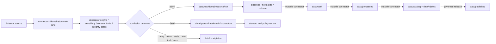

<!-- [KFM_META_BLOCK_V2]
doc_id: kfm://doc/connectors-domains-readme
title: connectors/domains/ — Domain-Scoped Connector Admission Lanes
type: readme
version: v0.2
status: draft
owners: OWNER_TBD — Source steward · Connector steward · Domain stewards · Data steward · Policy steward · Validation steward · Docs steward
created: 2026-06-16
updated: 2026-07-10
policy_label: public; implementation-root; domain-scoped-source-admission; raw-quarantine-receipts-only
related:
  - ../README.md
  - ../../docs/domains/README.md
  - ../../docs/doctrine/directory-rules.md
  - ../../data/registry/sources/
  - ../../data/raw/
  - ../../data/quarantine/
  - ../../data/receipts/
  - ../../data/proofs/
  - ../../policy/
  - ../../release/
  - ../../packages/domains/
  - ../../pipelines/domains/
  - ../../pipeline_specs/
tags: [kfm, connectors, domains, source-admission, raw, quarantine, receipts, source-descriptor, trust-membrane, governance]
notes:
  - "v0.2 preserves the v0.1 authority, lifecycle, validation, duplication-warning, and definition-of-done boundaries while expanding child-lane governance."
  - "connectors/domains/ is a grouping lane for domain-scoped source intake only; it is not domain doctrine, package authority, pipeline authority, policy authority, schema authority, proof closure, release authority, or publication authority."
  - "Child lanes may support raw, quarantine, and receipt handoffs only unless an accepted ADR explicitly changes the boundary."
  - "Domain-scoped placement must not duplicate a source-family connector lane without an ADR or migration note with rollback."
  - "Child inventory, source activation, modules, tests, fixtures, schedules, receipts, CI enforcement, and runtime behavior remain NEEDS VERIFICATION unless proven per lane."
[/KFM_META_BLOCK_V2] -->

<a id="top"></a>

# Domain-Scoped Connector Admission Lanes

> Domain-organized source intake for KFM. These lanes admit candidates; they do not define domain truth, perform promotion, or serve public clients.

<p>
  
  
  
  
  
</p>

`connectors/domains/`

## Quick jumps

[Status](#status) · [Scope](#scope) · [Repo fit](#repo-fit) · [Accepted inputs](#accepted-inputs) · [Exclusions](#exclusions) · [Child-lane contract](#child-lane-contract) · [Placement and duplication](#placement-and-duplication) · [Admission contract](#admission-contract) · [Lifecycle boundary](#lifecycle-boundary) · [Bounded outcomes](#bounded-outcomes) · [Validation](#validation) · [Safe changes](#safe-changes) · [Evidence basis](#evidence-basis) · [Rollback](#rollback) · [Definition of done](#definition-of-done)

---

## Status

> [!IMPORTANT]
> **Status:** `draft` / root contract  
> **Owner:** `OWNER_TBD`  
> **Path:** `connectors/domains/`  
> **Authority level:** implementation grouping root for domain-scoped source admission  
> **Truth posture:** `CONFIRMED` current README path and root boundary; child inventory, canonical placement, source activation, modules, tests, fixtures, receipts, CI coverage, schedules, and runtime behavior remain `NEEDS VERIFICATION` unless proven in each child lane.

---

## Scope

`connectors/domains/` groups connector implementation when intake behavior is primarily organized around a KFM domain rather than one external source family.

A child lane may:

- fetch or import candidate source material through explicit runtime configuration;
- preserve source identity, product identity, domain target, role, time, rights, sensitivity, limitations, and integrity metadata;
- produce raw, quarantine, or receipt handoffs for governed downstream review;
- document domain-specific admission and anti-collapse requirements;
- expose deterministic, testable connector helpers that are safe to import.

A child lane must not:

- define domain doctrine or canonical domain truth;
- activate a source without registry and policy evidence;
- write processed, catalog, triplet, proof-closure, release, or published objects;
- create parallel schema, contract, policy, registry, or release authority;
- bypass review, sensitivity, rights, consent, sovereignty, or release gates;
- become a public API, UI, map, routing, advisory, legal, medical, or AI truth surface.

---

## Repo fit

```text
External source or distribution
  -> connectors/domains/<domain-lane>/
  -> SourceDescriptor + rights + sensitivity + role + integrity gates
  -> data/raw/<domain>/ or data/quarantine/<domain>/
  -> data/receipts/<run_id>/
  -> pipelines/ and downstream validators
  -> data/work/
  -> data/processed/
  -> data/catalog/ + data/triplets/
  -> release/
  -> data/published/
```

Adjacent responsibility roots:

| Root | Relationship to `connectors/domains/` |
|---|---|
| `docs/domains/` | Domain doctrine, terminology, scope, and human-facing guidance. |
| `docs/sources/catalog/` | Source-family and product doctrine. Domain connector lanes must not duplicate it. |
| `data/registry/sources/` | SourceDescriptor and activation authority. Connectors consume or reference descriptors. |
| `policy/` | Rights, sensitivity, consent, sovereignty, admissibility, and publication decisions. |
| `schemas/`, `contracts/` | Machine shape and semantic meaning. No parallel authority may be created here. |
| `data/raw/`, `data/quarantine/`, `data/receipts/` | Allowed connector handoff surfaces. |
| `packages/domains/` | Reusable domain libraries outside connector ownership. |
| `pipelines/domains/`, `pipeline_specs/` | Transformation and declarative flow authority outside connector ownership. |
| `data/work/`, `data/processed/`, `data/catalog/`, `data/triplets/`, `data/proofs/`, `data/published/` | Downstream lifecycle and evidence surfaces outside connector ownership. |
| `release/` | Release decisions, correction state, and rollback targets outside connector ownership. |

---

## Accepted inputs

| Belongs here | Required posture |
|---|---|
| Domain connector sublanes | Placement must be intentional, documented, and non-duplicative or migration-governed. |
| Domain-scoped source adapters | Require explicit descriptor/config input; preserve source identity and role. |
| Admission metadata helpers | Preserve time, rights, sensitivity, limitations, digests, and review state. |
| Raw/quarantine handoff helpers | Require explicit destination and receipt metadata. |
| Run/probe receipt helpers | Record success, failure, denial, no-op, stale, skipped, rate-limited, or quarantined outcomes. |
| Connector-local documentation | State authority, inputs, outputs, exclusions, validation, evidence limits, and rollback. |
| Small deterministic test helpers | No network by default; never become fixture or source authority. |

---

## Exclusions

| Does not belong here | Correct responsibility root |
|---|---|
| Domain doctrine or scope | `../../docs/domains/` |
| Source-family doctrine | `../../docs/sources/catalog/` |
| SourceDescriptor records or activation decisions | `../../data/registry/sources/` |
| Reusable domain libraries | `../../packages/domains/` |
| Executable transformations | `../../pipelines/domains/` |
| Declarative pipeline definitions | `../../pipeline_specs/` |
| Processed records | `../../data/processed/` |
| Catalog or triplet records | `../../data/catalog/`, `../../data/triplets/` |
| EvidenceBundle or proof closure | `../../data/proofs/` and governed proof workflows |
| Published artifacts or public layers | `../../data/published/` after release gates |
| Policy, release, correction, or rollback decisions | `../../policy/`, `../../release/` |
| Schemas or contracts | `../../schemas/`, `../../contracts/` |
| Generated reports or QA artifacts | `../../artifacts/` |
| Public API, UI, routing, alerting, or AI response behavior | Governed application roots after policy and release gates |

---

## Child-lane contract

Every non-trivial child lane under `connectors/domains/` should document:

1. domain scope and source-family relationship;
2. owning root and authority limit;
3. accepted inputs and exclusions;
4. SourceDescriptor, rights, sensitivity, consent, and review prerequisites;
5. preserved identity, role, time, geography, uncertainty, and limitation fields;
6. raw, quarantine, and receipt handoff rules;
7. bounded outcomes and reason codes;
8. import and network side-effect posture;
9. offline test and fixture expectations;
10. evidence limits, rollback target, and definition of done.

Child lanes must narrow this root contract where domain risk requires stronger controls. They must not weaken it.

---

## Placement and duplication

Domain-scoped placement is not automatically canonical merely because a connector serves one domain.

A child lane requires review when any of the following is true:

- a direct lane such as `connectors/<source-or-domain>/` already exists;
- a source-family lane already owns the same endpoint or product family;
- both domain and source-family lanes can fetch the same material;
- package, schema, policy, registry, or pipeline code is duplicated;
- imports or output paths make authority ownership unclear.

> [!WARNING]
> Do not maintain two active connector implementations for the same source/product without an ADR or migration note defining ownership, delegation, compatibility, cutover, receipts, and rollback.

Allowed resolutions include:

- one canonical connector with domain adapters;
- one source-family connector delegated to by domain lanes;
- a temporary migration bridge with an expiry condition;
- a documented split where products, roles, or authorities are genuinely distinct.

---

## Admission contract

Each child connector must preserve, when applicable:

- source family and product identity;
- SourceDescriptor reference supplied by registry or orchestration;
- source-native identifier and locator;
- domain target without treating the target as source authority;
- retrieval/import/probe timestamp;
- source time, observed time, valid time, publication time, and correction time where relevant;
- source role, product role, and observed/modeled/derived status;
- geography, scale, resolution, precision, and generalization posture;
- aggregation unit, uncertainty, suppression, null, and caveat fields;
- rights, sensitivity, consent, sovereignty, embargo, and access posture;
- version, vintage, release, epoch, and schema indicators;
- digest, checksum, signature, or integrity inputs;
- quarantine reason, review state, receipt reference, and rollback target.

Missing or conflicting material fields must produce `quarantine`, `deny`, `needs_review`, or another explicit finite outcome—not silent weakening or publication.

---

## Lifecycle boundary



Promotion is a governed state transition outside `connectors/domains/`. Connector receipts may support later review, but they are not proof closure or release approval.

---

## Bounded outcomes

Child connectors should return explicit finite outcomes rather than ambiguous success states.

| Outcome | Meaning |
|---|---|
| `admit_raw` | Candidate and required admission metadata are sufficient for raw staging. |
| `quarantine` | Material is retained but requires rights, sensitivity, schema, identity, integrity, or steward review. |
| `deny` | Policy, rights, consent, sovereignty, or source conditions prohibit admission. |
| `needs_review` | A human or governed decision is required before admission can proceed. |
| `no_op` | No meaningful source change was detected. |
| `stale` | Source material is outside the accepted freshness or validity posture. |
| `rate_limited` | Retrieval was deferred because of source constraints. |
| `skipped` | Preconditions were not met or the source/product was intentionally excluded. |
| `error` | A finite operational failure occurred and was recorded without promotion. |

Outcome names may vary by accepted contract, but semantics must remain explicit, testable, and receipt-backed.

---

## Validation

Before relying on this root or any child lane, verify:

- [ ] child lane placement is intentional and documented;
- [ ] overlapping source-family or direct connector lanes are resolved or migration-governed;
- [ ] SourceDescriptors exist and activation state is explicit;
- [ ] rights, sensitivity, consent, sovereignty, and review gates are applied where relevant;
- [ ] imports do not perform network calls, filesystem writes, credential reads, or source activation;
- [ ] endpoint, cadence, timeout, retry, pagination, and rate-limit behavior is configurable;
- [ ] source role, time, version, uncertainty, limitations, and integrity metadata are preserved;
- [ ] outputs are limited to raw, quarantine, and receipt handoffs;
- [ ] sensitive values are absent from unsafe logs, errors, snapshots, and fixtures;
- [ ] tests use no-network fixtures by default;
- [ ] CI execution is verified or explicitly marked `NEEDS VERIFICATION`;
- [ ] downstream processing, proof closure, release, and publication remain outside connector authority.

---

## Safe changes

For changes under `connectors/domains/`:

1. Confirm the change belongs to connector implementation or connector-local documentation.
2. Check Directory Rules and visible ADRs before creating, moving, or renaming a child lane.
3. Identify overlapping direct, source-family, package, pipeline, schema, policy, and registry homes.
4. Preserve source identity, role, time, rights, sensitivity, limitations, and integrity metadata.
5. Keep import behavior side-effect-free and runtime behavior explicitly configured.
6. Restrict outputs to raw, quarantine, and receipt handoffs.
7. Update offline tests and fixtures or mark the gap `NEEDS VERIFICATION`.
8. Record migration, compatibility, documentation, and rollback effects.

---

## Evidence basis

| Source | Status | Supports | Limits |
|---|---|---|---|
| `connectors/domains/README.md` prior blob `ed2878af2f04457c4f21340f3d02ac5ee48d812a` | `CONFIRMED` | Existing root purpose, authority exclusions, raw/quarantine boundary, duplication warning, validation, and definition of done. | Does not prove child implementation or runtime behavior. |
| `connectors/README.md` | `CONFIRMED` where inspected | Root connector admission boundary and raw/quarantine/receipt posture. | Does not prove each child lane conforms. |
| Child README documents under `connectors/domains/` | `CONFIRMED` only where individually inspected | Domain-specific doctrine boundaries and verification backlogs. | Do not prove code, tests, activation, CI, or release state. |
| Current connector modules, SourceDescriptors, tests, fixtures, receipts, workflows, and logs | `UNKNOWN / NEEDS VERIFICATION` | Required to prove implementation and enforcement. | Not established by this README. |

---

## Rollback

Rollback is required if this README or a child change is used to justify:

- duplicate active connector authority without an ADR or migration note;
- direct writes beyond raw, quarantine, or receipt surfaces;
- embedded schema, contract, policy, registry, proof, or release authority;
- public access to connector internals;
- source activation without descriptor and policy evidence;
- unreviewed exposure of sensitive, rights-limited, consent-bound, sovereign, living-person, ecological, archaeological, infrastructure, or precise-location material;
- claims of implementation, CI, release, or publication maturity without evidence.

Rollback target for this documentation update: prior blob `ed2878af2f04457c4f21340f3d02ac5ee48d812a`.

A connector incident involving sensitive or rights-restricted material also requires containment, affected-artifact review, receipt preservation, downstream invalidation assessment, and correction or withdrawal through the owning governance paths.

---

## Definition of done

- [ ] Owners are confirmed and `OWNER_TBD` is replaced.
- [ ] Actual child lanes are inventoried.
- [ ] Each child lane has a README contract or an explicit documented exemption.
- [ ] Canonical placement and duplication status are resolved for each lane.
- [ ] Source coverage is tied to SourceDescriptors and product/source catalog records.
- [ ] Rights, sensitivity, consent, sovereignty, and review prerequisites are documented.
- [ ] Import safety and explicit runtime configuration are tested.
- [ ] Raw, quarantine, and receipt-only output boundaries are enforced.
- [ ] Bounded outcomes and reason codes are tested.
- [ ] No doctrine, package, pipeline, processed, catalog, triplet, proof, published, release, schema, policy, registry, fixture, API, UI, or report authority lives here.
- [ ] Offline tests and fixtures are verified or marked `NEEDS VERIFICATION`.
- [ ] CI and review behavior are verified or marked `NEEDS VERIFICATION`.
- [ ] Rollback targets and migration notes exist for structural changes.

---

## Status summary

`connectors/domains/` is a domain-scoped source-admission grouping root. It may support descriptor-gated fetch, metadata preservation, raw/quarantine staging, and receipt generation. It is not domain truth, source registry authority, schema or contract authority, policy authority, package or pipeline authority, catalog/triplet authority, proof closure, release authority, publication authority, or public-client behavior.

<p align="right"><a href="#top">Back to top</a></p>
