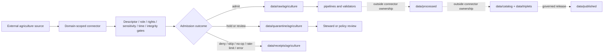

<!-- [KFM_META_BLOCK_V2]
doc_id: kfm://doc/connectors-domains-agriculture-readme
title: connectors/domains/agriculture/ — Agriculture Domain-Scoped Connector Lane
type: readme
version: v0.2
status: draft
owners: OWNER_TBD — Agriculture steward · Source steward · Connector steward · Data steward · Validation steward · Docs steward
created: 2026-06-16
updated: 2026-07-10
policy_label: public; implementation-support; source-admission; raw-quarantine-receipts-only
related:
  - ../README.md
  - ../../README.md
  - ../../agriculture/README.md
  - ../../../docs/domains/agriculture/README.md
  - ../../../data/registry/sources/
  - ../../../data/raw/agriculture/
  - ../../../data/quarantine/agriculture/
  - ../../../data/receipts/agriculture/
  - ../../../data/proofs/agriculture/
  - ../../../policy/domains/agriculture/
  - ../../../packages/domains/agriculture/
  - ../../../pipelines/domains/agriculture/
  - ../../../pipeline_specs/agriculture/
  - ../../../release/
tags: [kfm, connectors, domains, agriculture, source-admission, raw, quarantine, receipts, source-role, governance, migration]
notes:
  - "v0.2 preserves the v0.1 domain-scoped connector boundary and strengthens placement, admission, validation, evidence, and rollback controls."
  - "This lane does not silently replace connectors/agriculture/; canonical placement remains NEEDS VERIFICATION and is ADR- or migration-note-class."
  - "Connector outputs are limited to raw, quarantine, and receipt handoffs unless an accepted ADR says otherwise."
  - "Specific modules, sources, SourceDescriptors, endpoints, tests, fixtures, CI wiring, and runtime behavior remain NEEDS VERIFICATION."
[/KFM_META_BLOCK_V2] -->

<a id="top"></a>

# Agriculture Domain-Scoped Connectors

> Domain-scoped source-admission support for agriculture. This lane may help retrieve and stage candidate source material, but it does not create agriculture truth, publish data, or replace governed downstream stages.

<p>
  
  
  
  
  
  
</p>

`connectors/domains/agriculture/`

## Quick jumps

[Status](#status) · [Scope](#scope) · [Repo fit](#repo-fit) · [Accepted inputs](#accepted-inputs) · [Exclusions](#exclusions) · [Placement conflict](#placement-conflict) · [Admission contract](#admission-contract) · [Agriculture source-role discipline](#agriculture-source-role-discipline) · [Lifecycle boundary](#lifecycle-boundary) · [Bounded outcomes](#bounded-outcomes) · [Validation](#validation) · [Evidence basis](#evidence-basis) · [Rollback](#rollback) · [Definition of done](#definition-of-done)

---

## Status

> [!IMPORTANT]
> **Status:** `draft` / `NEEDS VERIFICATION`  
> **Owner:** `OWNER_TBD`  
> **Path:** `connectors/domains/agriculture/`  
> **Owning root:** `connectors/`  
> **Responsibility:** domain-scoped agriculture source-admission support  
> **Truth posture:** `CONFIRMED` README path and v0.1 baseline; actual code, source coverage, source activation, tests, fixtures, receipts, CI wiring, and runtime behavior remain `NEEDS VERIFICATION`.

> [!WARNING]
> `connectors/agriculture/` also exists. This README does not declare either lane canonical. Running both without an accepted placement decision risks duplicate source activation, divergent receipts, and parallel connector authority.

---

## Scope

Use this directory only when agriculture connector behavior is intentionally organized beneath the domain-scoped connector grouping.

Allowed responsibilities include:

- descriptor-gated source clients and download helpers;
- source metadata, digest, and retrieval-context preservation;
- small admission helpers that prepare explicit raw, quarantine, or receipt handoffs;
- source-role, vintage, scale, rights, sensitivity, and limitation preservation;
- finite, reviewable admission outcomes;
- connector-local documentation.

This directory must not decide agriculture truth, transform admitted material into processed records, close EvidenceBundles, create catalog or triplet authority, issue release decisions, or publish public layers.

---

## Repo fit

```text
External agriculture source
  -> connectors/domains/agriculture/   # this lane, if placement is accepted
  -> data/raw/agriculture/
     or data/quarantine/agriculture/
     plus data/receipts/agriculture/
  -> pipelines/domains/agriculture/     # outside connector ownership
  -> data/work/ and data/processed/
  -> data/catalog/ and data/triplets/
  -> release/
  -> data/published/
```

Adjacent responsibility roots:

| Root | Relationship to this lane |
|---|---|
| `connectors/agriculture/` | Direct agriculture connector lane. Relationship is `CONFLICTED / NEEDS VERIFICATION`. |
| `data/registry/sources/` | SourceDescriptor and activation authority. This lane consumes references; it does not own them. |
| `data/raw/agriculture/` | Allowed admitted-payload handoff. |
| `data/quarantine/agriculture/` | Allowed fail-closed handoff for unresolved material. |
| `data/receipts/agriculture/` | Allowed run/probe/admission receipt handoff. Receipts are not proof closure. |
| `packages/domains/agriculture/` | Reusable agriculture domain code. Connector-specific code must not migrate here silently. |
| `pipelines/domains/agriculture/` | Executable normalization and transformation logic. |
| `pipeline_specs/agriculture/` | Declarative pipeline definitions. |
| `policy/domains/agriculture/` | Admissibility, sensitivity, rights, and publication rules. |
| `release/` | Release, correction, and rollback decisions. |

---

## Accepted inputs

| Belongs here | Required posture |
|---|---|
| Domain-scoped source adapters | Require explicit SourceDescriptor/config input; no implicit source activation. |
| Product or source-family endpoint helpers | Preserve source identity, product identity, endpoint family, and retrieval context. |
| Manifest and response parsers | Preserve source-native fields, timestamps, units, geometry metadata, and digest inputs. |
| Admission-envelope builders | May prepare raw, quarantine, or receipt handoffs only. |
| Failure and review routing | Must emit finite outcomes with reason codes; no silent fallback to publication. |
| Connector documentation | Must state source limits, placement uncertainty, validation needs, and rollback posture. |

---

## Exclusions

| Does not belong here | Correct responsibility root |
|---|---|
| Agriculture doctrine or domain scope | `../../../docs/domains/agriculture/` |
| SourceDescriptor records or activation decisions | `../../../data/registry/sources/` |
| Reusable agriculture package code | `../../../packages/domains/agriculture/` |
| Executable transformation logic | `../../../pipelines/domains/agriculture/` |
| Declarative pipeline definitions | `../../../pipeline_specs/agriculture/` |
| Processed agriculture records | `../../../data/processed/agriculture/` after governed processing |
| Catalog or triplet records | `../../../data/catalog/`, `../../../data/triplets/` |
| EvidenceBundle or proof closure | `../../../data/proofs/` and governed proof workflows |
| Published artifacts or map layers | `../../../data/published/` after release gates |
| Policy rules | `../../../policy/` |
| Machine schemas and human contracts | `../../../schemas/`, `../../../contracts/` under accepted placement |
| Release, correction, or rollback decisions | `../../../release/` |
| Generated reports | `../../../artifacts/` |

---

## Placement conflict

The repository currently exposes both:

```text
connectors/agriculture/
connectors/domains/agriculture/
```

This README treats the duplicate pattern as a governance issue, not a naming preference.

| Question | Status |
|---|---|
| Does this README path exist? | `CONFIRMED` |
| Does the direct agriculture lane exist? | `CONFIRMED` |
| Which path is canonical for active connector code? | `NEEDS VERIFICATION` |
| May both lanes activate the same source? | `DENY` unless explicitly separated by accepted descriptors and governance |
| Is consolidation required? | `PROPOSED`; resolve by ADR or migration note |

A placement decision should identify:

1. the owning lane for each connector or source family;
2. SourceDescriptor references and activation state;
3. imports, tests, schedules, receipts, and downstream consumers to migrate;
4. compatibility and redirect needs;
5. rollback target and validation evidence.

---

## Admission contract

Every connector run should preserve, when applicable:

- SourceDescriptor reference;
- source family and product identity;
- source-native identifiers;
- endpoint, distribution, package, or record locator;
- retrieval or probe time;
- source observation, survey, valid, publication, release, or vintage time;
- geographic extent, scale, resolution, and generalization posture;
- units, classifications, code lists, and version identifiers;
- source role and authority limits;
- rights, license, access, and redistribution posture;
- sensitivity and disclosure posture;
- content digest, checksum, or signature inputs;
- raw or quarantine destination supplied by orchestration;
- outcome and reason code;
- rollback or replay reference when available.

The connector must fail closed when identity, rights, source role, sensitivity, units, vintage, geography, or destination cannot be resolved strongly enough for admission.

---

## Agriculture source-role discipline

Agriculture sources are not interchangeable. Connector code must preserve distinctions such as:

| Source or product class | Must not silently become |
|---|---|
| Cropland or land-cover classification | Ground-observed crop truth, ownership, or management practice |
| Census, survey, or administrative estimate | Field-level observation or operator-specific fact |
| Yield estimate or model output | Measured harvested yield without supporting evidence |
| Soil or capability context | Current management, productivity, or legal land-use authority |
| Remote sensing index | Crop condition, drought impact, or damage claim without model and validation context |
| Weather or climate context | Agriculture-domain claim or official advisory |
| Parcel, tract, or field geometry | Ownership, tenancy, operator identity, or legal boundary truth |
| Livestock inventory aggregate | Facility-level or producer-level fact |
| Conservation or program record | Universal practice adoption or unrestricted public disclosure |

Field-, parcel-, operator-, producer-, facility-, and management-level information requires rights and sensitivity review. Exact locations, proprietary management data, living-person information, commercial records, and inferred operational behavior should default to quarantine, redaction, generalization, staged access, or denial when policy is unresolved.

---

## Lifecycle boundary



Promotion beyond raw or quarantine is a governed state transition outside this connector lane.

---

## Bounded outcomes

Connector behavior should resolve to explicit finite outcomes rather than ambiguous success:

| Outcome | Meaning |
|---|---|
| `admit_raw` | Material passed admission checks and was handed to an explicit raw target. |
| `quarantine` | Material was captured but requires review or remediation. |
| `deny` | Policy, rights, sensitivity, identity, or integrity rules prohibit admission. |
| `needs_review` | A named steward or policy decision is required. |
| `no_op` | No new or changed source material was found. |
| `skip` | The run intentionally did not process the source, with a reason. |
| `rate_limited` | The source limited access; retry posture must be recorded. |
| `stale` | Material failed freshness or vintage expectations. |
| `error` | The run failed; partial outputs must not be mistaken for admitted data. |

Each outcome should carry a stable reason code and receipt reference where supported.

---

## Validation

Before relying on this lane, verify:

- [ ] placement relative to `connectors/agriculture/` is resolved or documented;
- [ ] actual modules and source families are inventoried;
- [ ] every active source maps to a SourceDescriptor;
- [ ] imports do not trigger network, credential, or filesystem side effects;
- [ ] endpoint, cadence, timeout, retry, and rate-limit behavior is configurable;
- [ ] source role, time, units, scale, rights, sensitivity, and limitations are preserved;
- [ ] outputs are limited to explicit raw, quarantine, and receipt handoffs;
- [ ] no-network fixtures cover normal and failure outcomes where practical;
- [ ] logs and fixtures do not expose sensitive field-, parcel-, operator-, or facility-level information;
- [ ] CI runs the relevant tests or the gap remains `NEEDS VERIFICATION`;
- [ ] downstream proof, catalog, release, and publication objects are produced outside this lane.

---

## Safe change pattern

1. Confirm the change belongs to source admission rather than domain packages, pipelines, policy, schema, or release.
2. Check whether equivalent behavior already exists under `connectors/agriculture/`.
3. Require explicit descriptor and runtime configuration inputs.
4. Preserve source role, vintage, units, geography, rights, sensitivity, and limitation metadata.
5. Keep writes restricted to explicit raw, quarantine, and receipt targets.
6. Add or update offline tests and review fixtures for sensitive content.
7. Record migration and rollback steps when placement or imports change.
8. Update this README or explain why documentation is unaffected.

---

## Evidence basis

| Source | Status | Supports | Limits |
|---|---|---|---|
| Existing `connectors/domains/agriculture/README.md` v0.1 | `CONFIRMED` | Path, domain-scoped purpose, duplicate-lane warning, raw/quarantine boundary, exclusions | Does not prove implementation, source activation, tests, or CI |
| `connectors/agriculture/README.md` | `CONFIRMED` as adjacent documentation | Direct agriculture lane and source-admission boundary | Does not resolve canonical placement |
| `connectors/README.md` | `CONFIRMED` as root contract | Connector-root authority and downstream lifecycle separation | Does not prove child implementation maturity |
| Current repository implementation | `UNKNOWN / NEEDS VERIFICATION` | Must be inspected through modules, descriptors, tests, receipts, workflows, and runtime evidence | README text alone is not proof |

---

## Rollback

Rollback is required when a change:

- creates parallel activation with `connectors/agriculture/`;
- weakens SourceDescriptor, rights, sensitivity, source-role, or integrity gates;
- writes processed, catalog, triplet, proof, published, or release objects directly;
- exposes sensitive agriculture details in logs, fixtures, reports, or public paths;
- breaks imports, tests, schedules, receipts, or downstream consumers without a migration plan;
- treats connector output as evidence closure or publication authority.

Rollback target: prior blob `e203623bba83e4097b184a9e8dd3ec3a706e3aae`.

---

## Definition of done

- [ ] Owners are confirmed and `OWNER_TBD` is replaced.
- [ ] The relationship to `connectors/agriculture/` is resolved by accepted placement documentation.
- [ ] Actual files, modules, sources, descriptors, schedules, and consumers are inventoried.
- [ ] Source coverage is tied to active SourceDescriptors.
- [ ] Imports are side-effect-free.
- [ ] Raw, quarantine, and receipt-only boundaries are enforced and tested.
- [ ] Agriculture source-role and anti-collapse rules are tested.
- [ ] Rights, sensitivity, and protected-detail handling are verified.
- [ ] No domain doctrine, package, pipeline, processed, catalog, triplet, proof, published, release, policy, schema, registry, fixture, or report authority lives here.
- [ ] Tests, fixtures, receipts, and CI behavior are verified or marked `NEEDS VERIFICATION`.
- [ ] Migration and rollback instructions exist for any placement or import change.

---

## Status summary

`connectors/domains/agriculture/` is a draft domain-scoped agriculture source-admission lane. It may support descriptor-gated retrieval and raw, quarantine, or receipt handoffs, but it is not agriculture truth, policy, schema, catalog/triplet, proof, release, publication, package, or pipeline authority. Its relationship to `connectors/agriculture/` remains `NEEDS VERIFICATION` and must not be resolved through silent duplication.

<p align="right"><a href="#top">Back to top</a></p>
