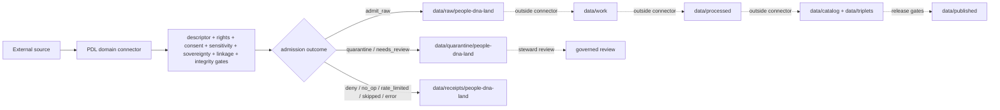

<!-- [KFM_META_BLOCK_V2]
doc_id: kfm://doc/connectors-domains-pdl-readme
title: connectors/domains/people-dna-land/ — People, DNA, and Land Domain Connector Group
type: readme
version: v0.2
status: draft
owners: OWNER_TBD — People/DNA/Land steward · Privacy steward · Consent steward · Source steward · Connector steward · Data steward · Docs steward
created: 2026-06-16
updated: 2026-07-10
policy_label: restricted-by-default; source-admission; sensitive-domain
related:
  - ../README.md
  - ./census/README.md
  - ../../../docs/domains/people-dna-land/SENSITIVITY_PROFILE.md
  - ../../../docs/domains/people-dna-land/README.md
  - ../../../data/registry/sources/
  - ../../../data/raw/people-dna-land/
  - ../../../data/quarantine/people-dna-land/
  - ../../../data/receipts/people-dna-land/
  - ../../../data/proofs/people-dna-land/
  - ../../../policy/domains/people-dna-land/
  - ../../../packages/domains/people-dna-land/
  - ../../../pipelines/domains/people-dna-land/
  - ../../../pipeline_specs/people-dna-land/
  - ../../../release/
tags: [kfm, connectors, domains, people-dna-land, consent, privacy, genealogy, census, land, source-admission, quarantine, restricted, governance]
notes:
  - "v0.2 upgrades the domain-scoped connector-group contract while preserving the v0.1 authority boundary."
  - "This lane is restricted-by-default because source material may involve living persons, genealogy, DNA-related context, residence, land, title, consent, sovereignty, or re-identification risk."
  - "Connector outputs are limited to raw, quarantine, and process-receipt handoffs; connectors do not promote, resolve identity, infer kinship, determine ownership, close evidence, approve release, or publish."
  - "Concrete child lanes, modules, SourceDescriptors, consent records, tests, fixtures, CI coverage, and runtime behavior remain NEEDS VERIFICATION unless directly proven."
[/KFM_META_BLOCK_V2] -->

<a id="top"></a>

# People, DNA, and Land Domain Connectors

> Domain-scoped source-admission support for highly sensitive people, genealogy, DNA-related, census, residence, and land-context sources. This lane is restricted by default and never serves as identity, kinship, title, consent, proof, release, or publication authority.

<p>
  
  
  
  
  
</p>

`connectors/domains/people-dna-land/`

## Quick jumps

[Status](#status) · [Scope](#scope) · [Repo fit](#repo-fit) · [Accepted inputs](#accepted-inputs) · [Exclusions](#exclusions) · [Child lanes](#child-lanes) · [Sensitive-domain contract](#sensitive-domain-contract) · [Admission outcomes](#admission-outcomes) · [Lifecycle boundary](#lifecycle-boundary) · [Validation](#validation) · [Safe change pattern](#safe-change-pattern) · [Evidence basis](#evidence-basis) · [Rollback](#rollback) · [Definition of done](#definition-of-done)

---

## Status

> [!IMPORTANT]
> **Status:** `draft` / `NEEDS VERIFICATION`  
> **Owner:** `OWNER_TBD`  
> **Path:** `connectors/domains/people-dna-land/`  
> **Responsibility:** domain-scoped connector grouping and sensitive source-admission support  
> **Truth posture:** `CONFIRMED` README path and current documentation boundary; actual child-lane inventory, modules, source activation, consent records, tests, fixtures, receipts, CI coverage, and runtime behavior remain `NEEDS VERIFICATION`.

> [!CAUTION]
> This lane may encounter living-person data, genealogy, DNA-related context, residence history, land or title context, tribal or sovereign interests, culturally restricted knowledge, and combinations that create re-identification risk. Missing consent, rights, sensitivity, authority, or review evidence must result in quarantine, denial, or abstention—not silent admission or publication.

---

## Scope

Use this folder only for connector-facing code and documentation intentionally scoped to the People, DNA, and Land domain.

Allowed responsibilities are limited to:

- descriptor-gated source discovery, fetch, probe, or import support;
- preservation of source identity, source role, product family, vintage, time, rights, consent references, sensitivity, and limitations;
- deterministic digest and retrieval metadata support;
- routing candidate material to raw, quarantine, or process-receipt handoff surfaces;
- returning finite, auditable admission outcomes;
- child-lane documentation that preserves the trust membrane.

This folder must not become domain doctrine, identity resolution, kinship inference, genealogy proof, genomic interpretation, ownership/title adjudication, consent authority, sovereignty authority, policy authority, schema authority, catalog/triplet authority, EvidenceBundle closure, release approval, public API behavior, UI behavior, map exposure, AI-answer authority, or publication authority.

---

## Repo fit

```text
connectors/
└── domains/
    └── people-dna-land/
        ├── README.md
        └── census/
            └── README.md
```

Adjacent responsibility roots:

| Root | Relationship to this lane |
|---|---|
| `docs/domains/people-dna-land/` | Domain doctrine, sensitivity posture, and human-facing operating rules. |
| `data/registry/sources/` | SourceDescriptor, activation, rights, cadence, and source-role authority. |
| `data/raw/people-dna-land/` | Accepted raw or staged candidate material. |
| `data/quarantine/people-dna-land/` | Default holding surface for unresolved rights, consent, sensitivity, identity, sovereignty, or linkage risk. |
| `data/receipts/people-dna-land/` | Process receipts for fetch, denial, quarantine, no-op, rate limit, or error outcomes. |
| `data/proofs/people-dna-land/` | EvidenceBundle or proof closure outside connector ownership. |
| `policy/domains/people-dna-land/` | Policy and decision rules. Connectors consume outcomes; they do not define them. |
| `packages/domains/people-dna-land/` | Reusable domain package code outside connector ownership. |
| `pipelines/domains/people-dna-land/` | Transformation and downstream lifecycle logic. |
| `pipeline_specs/people-dna-land/` | Declarative pipeline definitions. |
| `release/` | Release, correction, rollback, and publication decisions. |

---

## Accepted inputs

| Belongs here | Required posture |
|---|---|
| Domain-scoped source adapters | Must require explicit SourceDescriptor and runtime configuration. |
| Census or other source-family delegation wrappers | Must preserve source-family authority in the canonical connector lane and avoid duplicate activation logic. |
| Admission metadata helpers | Preserve source role, vintage, time, rights, consent references, sensitivity, limitations, and digests. |
| Quarantine-routing helpers | Use explicit, reviewable reason codes and never auto-release. |
| Process-receipt helpers | Record bounded connector outcomes; receipts are not proof closure. |
| Connector-local documentation | State authority boundaries, risks, accepted outputs, validation, and rollback. |
| Small deterministic test helpers | No network by default; no sensitive real-person or precise-location fixtures. |

---

## Exclusions

| Does not belong here | Correct responsibility root |
|---|---|
| Domain doctrine or sensitivity policy | `docs/domains/people-dna-land/`, `policy/domains/people-dna-land/` |
| SourceDescriptor or activation authority | `data/registry/sources/` |
| Consent records or consent decisions as authority | governed consent/registry/policy homes after path verification |
| Identity resolution, person matching, kinship inference, or family-tree assertions | governed downstream domain workflows with evidence and review |
| DNA sequence, genotype, genomic interpretation, or health inference logic | restricted governed domain systems; exact home `NEEDS VERIFICATION` |
| Land-title, ownership, parcel, heirship, access, or legal conclusions | governed land/title workflows and authoritative legal sources |
| Processed records | `data/processed/` |
| Catalog or triplet records | `data/catalog/`, `data/triplets/` |
| EvidenceBundle or proof closure | `data/proofs/` and governed proof workflows |
| Release decisions, correction, or rollback state | `release/` |
| Public API, UI, map, export, or AI-answer behavior | governed public surfaces after release and policy gates |
| Schemas and contracts | `schemas/`, `contracts/` after accepted placement |
| Reusable package code | `packages/domains/people-dna-land/` |
| Transformation pipelines | `pipelines/domains/people-dna-land/` |
| Generated reports | `artifacts/` |

---

## Child lanes

| Child lane | Status | Required relationship |
|---|---|---|
| `census/` | `CONFIRMED` README exists | Domain-scoped wrapper only; canonical Census source-family authority remains outside this lane. |
| Additional child lanes | `UNKNOWN` | Must be inventoried and justified before being treated as canonical. |

A new child lane requires:

1. a verified source or domain need;
2. an identified canonical source-family connector relationship;
3. a SourceDescriptor and activation posture;
4. rights, consent, sensitivity, sovereignty, and re-identification review;
5. explicit raw/quarantine/receipt outputs;
6. no-network tests and rollback notes;
7. an ADR or migration note when placement duplicates another active connector lane.

---

## Sensitive-domain contract

### Living-person and identity protection

Connector code must not:

- resolve or merge people across sources without governed downstream review;
- infer that two records describe the same person from names, addresses, dates, relatives, parcels, or identifiers alone;
- infer family, biological relationship, household, residence, ownership, or heirship as connector output;
- expose exact addresses, residences, contact information, private identifiers, or low-count combinations through logs, fixtures, receipts, or errors;
- treat public availability as sufficient consent or release authority.

### DNA and genealogy separation

DNA-related, genealogical, census, cemetery, obituary, historical, and land records are different source families and evidence roles. Connector convenience must not collapse them into one identity or lineage claim.

Any material suggesting biological relationship, ancestry, health, ethnicity, tribal affiliation, kinship, or living-person linkage must fail closed unless explicit policy, consent, source authority, evidence, and review support the intended use.

### Land and title separation

Census geography, address context, parcel geometry, land records, tax records, deeds, patents, historical occupancy, and ownership claims are not interchangeable. Connector output must preserve source role and must not create legal title, present ownership, access rights, residence, heirship, or boundary conclusions.

### Sovereignty and cultural sensitivity

Where tribal, Indigenous, sovereign, culturally restricted, burial, sacred, or community-governed interests may apply, unresolved authority or consent requires quarantine or denial. Connector code does not decide that disclosure is culturally appropriate.

### Linkage and re-identification risk

Seemingly aggregate or public records may become sensitive when combined. Admission metadata should record linkage-risk indicators when available, including:

- low counts or sparse geography;
- precise time and place combinations;
- rare surnames or family structures;
- residence/parcel history;
- historical microdata with living-person possibility;
- DNA, genealogy, cemetery, obituary, or vital-record cross-links;
- tribal, cultural, or sovereign context;
- exact coordinates or small-area identifiers.

Unresolved linkage risk routes to quarantine.

---

## Admission outcomes

Connector operations must return a finite, reviewable outcome rather than silently continuing:

| Outcome | Meaning |
|---|---|
| `admit_raw` | Descriptor, rights, consent, sensitivity, integrity, and destination checks support raw admission. |
| `quarantine` | Material requires review because of privacy, consent, rights, identity, linkage, sovereignty, sensitivity, or validation concerns. |
| `deny` | Policy or source conditions prohibit intake. |
| `needs_review` | A steward or specialist decision is required before admission. |
| `no_op` | No new or changed source material was detected. |
| `rate_limited` | Source access was deferred without bypassing controls. |
| `skipped` | A documented prerequisite was absent or the source was inactive. |
| `error` | The operation failed; partial output must not be treated as admitted. |

Each outcome should carry a reason code, source reference, run identity, timestamp, and rollback or cleanup pointer where applicable.

---

## Lifecycle boundary



Promotion, identity resolution, proof closure, policy decisions, release, correction, rollback, and publication are outside this connector lane.

---

## Validation

Before relying on this connector group, verify:

- child lanes and files are inventoried;
- every active source is tied to a SourceDescriptor;
- source-family authority and delegation relationships are documented;
- rights, consent, sensitivity, sovereignty, and living-person checks are fail-closed;
- no import-time network, filesystem, credential, or activation side effects exist;
- no-network fixtures are small, synthetic or safely de-identified, and non-sensitive;
- exact addresses, identifiers, DNA/genomic data, private genealogy, precise sensitive locations, and low-count combinations cannot leak through logs or fixtures;
- outputs are limited to raw, quarantine, and process receipts;
- bounded outcomes and reason codes are tested;
- connector code cannot write processed, catalog, triplet, proof, release, or published records;
- CI runs the relevant tests or the gap remains `NEEDS VERIFICATION`.

---

## Safe change pattern

For changes under `connectors/domains/people-dna-land/`:

1. Confirm the change is connector code, connector documentation, or connector-facing support material.
2. Confirm the canonical source-family connector relationship and avoid parallel activation authority.
3. Confirm SourceDescriptor, rights, consent, sensitivity, sovereignty, source role, time, vintage, and limitation fields are preserved.
4. Confirm no person, kinship, DNA, residence, title, ownership, access, or legal inference is produced by the connector.
5. Confirm unresolved privacy, linkage, cultural, or location risk routes to quarantine or denial.
6. Confirm output paths are limited to raw, quarantine, and process receipts.
7. Update tests, fixtures, documentation, and rollback notes—or mark the gaps `NEEDS VERIFICATION`.

---

## Evidence basis

| Source | Status | Supports | Limits |
|---|---|---|---|
| Current `connectors/domains/people-dna-land/README.md` v0.1 | `CONFIRMED` | Existing path, source-admission scope, raw/quarantine boundary, and authority exclusions. | Did not prove child inventory or implementation. |
| `connectors/domains/people-dna-land/census/README.md` | `CONFIRMED` documentation | Census child-lane boundary, privacy posture, and placement conflict. | Does not prove active code or source activation. |
| KFM doctrine and sensitivity posture | `CONFIRMED` doctrine | Cite-or-abstain, fail-closed handling, evidence-subordinate AI, governed promotion, sensitivity, and rollback requirements. | Does not prove runtime enforcement. |
| Live modules, SourceDescriptors, tests, receipts, CI, runtime | `UNKNOWN` | Required for implementation claims. | Not established by this README update. |

---

## Rollback

Rollback is required if this README or related implementation is used to justify:

- direct public access to connector output;
- identity, kinship, DNA, residence, ownership, title, access, or legal conclusions;
- source activation without descriptor, rights, consent, sensitivity, or sovereignty checks;
- exact sensitive-location or living-person exposure;
- direct writes to processed, catalog, triplet, proof, release, or published roots;
- parallel source-family authority without an ADR or migration note.

Rollback target: prior blob `af848fb32d357f3efe16b91ee0d51e2f4f92a39f`.

If sensitive material may have been exposed, rollback also requires containment, access-log review, removal from caches and generated artifacts, correction records, and steward escalation.

---

## Definition of done

- [ ] Owners are confirmed and `OWNER_TBD` is replaced.
- [ ] Actual child lanes, modules, configuration, and documentation are inventoried.
- [ ] Canonical source-family connector relationships are documented.
- [ ] Every active source is tied to a verified SourceDescriptor.
- [ ] Rights, consent, sensitivity, sovereignty, living-person, and linkage-risk gates are documented and tested.
- [ ] Imports are side-effect-free.
- [ ] Outputs are verified to enter only raw, quarantine, or process-receipt lanes.
- [ ] No identity, kinship, DNA, residence, ownership, title, access, or legal inference is produced here.
- [ ] No processed, catalog, triplet, proof, release, published, schema, policy, registry, package, pipeline, fixture, or report authority lives here.
- [ ] Tests and fixtures are no-network by default and contain no sensitive real-person data.
- [ ] CI and review behavior are verified or marked `NEEDS VERIFICATION`.
- [ ] Rollback and sensitive-data incident procedures are reviewable.

---

## Status summary

`connectors/domains/people-dna-land/` is a restricted-by-default connector grouping and source-admission lane. It is not people truth, identity authority, genealogy authority, DNA authority, consent authority, land/title authority, policy authority, schema authority, catalog/triplet authority, proof closure, release authority, publication authority, reusable package authority, pipeline authority, or public-interface authority.

<p align="right"><a href="#top">Back to top</a></p>
