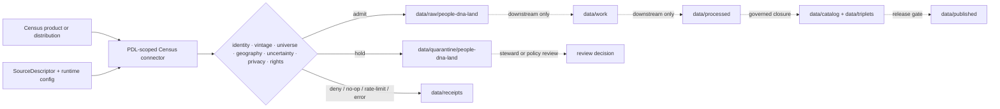

<!-- [KFM_META_BLOCK_V2]
doc_id: kfm://doc/connectors-domains-pdl-census-readme
title: connectors/domains/people-dna-land/census/ — PDL-Scoped Census Connector Lane
type: readme
version: v0.2
status: draft
owners: OWNER_TBD — People/DNA/Land steward · Census source steward · Connector steward · Privacy reviewer · Data steward · Docs steward
created: 2026-06-16
updated: 2026-07-10
policy_label: restricted-by-default; source-admission; privacy-sensitive; raw-quarantine-receipts-only
related:
  - ../../README.md
  - ../../../census/README.md
  - ../../../../docs/sources/catalog/census/README.md
  - ../../../../docs/domains/people-dna-land/SENSITIVITY_PROFILE.md
  - ../../../../data/registry/sources/
  - ../../../../data/raw/people-dna-land/
  - ../../../../data/quarantine/people-dna-land/
  - ../../../../data/receipts/
  - ../../../../data/proofs/
  - ../../../../policy/
  - ../../../../release/
tags: [kfm, connectors, domains, people-dna-land, census, source-admission, aggregate-data, vintage, uncertainty, privacy, re-identification, raw, quarantine, receipts, governance]
notes:
  - "v0.2 preserves the v0.1 domain-scoped admission boundary and expands privacy, living-person, re-identification, linkage, uncertainty, placement-conflict, validation, and rollback controls."
  - "This lane is not Census source-family authority and does not replace connectors/census/."
  - "Outputs are limited to raw, quarantine, and governed receipt handoffs; no processed, catalog, triplet, proof-closure, release, or publication authority lives here."
  - "Actual modules, Census products, SourceDescriptors, tests, fixtures, CI wiring, and runtime behavior remain NEEDS VERIFICATION."
[/KFM_META_BLOCK_V2] -->

<a id="top"></a>

# PDL-Scoped Census Connector

> Domain-scoped Census intake for the People/DNA/Land lane. This connector may preserve aggregate demographic and administrative-geography source context, but it must not infer identity, kinship, DNA relationships, title, ownership, residence, or publication readiness.

<p>
  
  
  
  
  
</p>

`connectors/domains/people-dna-land/census/`

## Quick jumps

[Status](#status) · [Scope](#scope) · [Repo fit](#repo-fit) · [Accepted inputs](#accepted-inputs) · [Exclusions](#exclusions) · [Authority boundary](#authority-boundary) · [Census product roles](#census-product-roles) · [PDL privacy posture](#pdl-privacy-posture) · [Admission contract](#admission-contract) · [Bounded outcomes](#bounded-outcomes) · [Lifecycle](#lifecycle) · [Placement conflict](#placement-conflict) · [Validation](#validation) · [Evidence basis](#evidence-basis) · [Rollback](#rollback) · [Definition of done](#definition-of-done)

---

## Status

> [!IMPORTANT]
> **Status:** `draft` / `NEEDS VERIFICATION`  
> **Owner:** `OWNER_TBD`  
> **Path:** `connectors/domains/people-dna-land/census/`  
> **Owning root:** `connectors/`  
> **Responsibility:** PDL-scoped Census source intake and admission support  
> **Truth posture:** `CONFIRMED` README path and current documentation content; active modules, product coverage, SourceDescriptors, endpoints, fixtures, tests, receipts, CI enforcement, and runtime behavior remain `NEEDS VERIFICATION`.

> [!CAUTION]
> Census material must not be combined with people, genealogy, DNA, land, parcel, address, cemetery, obituary, voter, or household data in a way that creates unsupported identity, kinship, residence, ownership, ancestry, or living-person claims. When linkage or re-identification risk is unresolved, route to quarantine or deny admission.

---

## Scope

Use this folder only for Census connector behavior intentionally scoped to the People/DNA/Land domain.

Permitted responsibilities include:

- descriptor-gated retrieval or staging of approved Census products;
- preservation of source family, product family, vintage, geography, universe, aggregation, uncertainty, and retrieval metadata;
- raw, quarantine, and receipt handoff preparation;
- explicit privacy, living-person, disclosure, linkage, and re-identification flags;
- bounded admission outcomes for incomplete, conflicting, stale, sensitive, or policy-blocked material.

This lane does **not** decide demographic truth, person identity, family relationship, genetic relationship, residence, title, parcel ownership, legal status, cultural affiliation, source activation, proof closure, release, or publication.

---

## Repo fit

```text
connectors/
└── domains/
    └── people-dna-land/
        └── census/
            └── README.md
```

Adjacent responsibility roots:

| Root | Relationship |
|---|---|
| `connectors/census/` | Census source-family connector authority for implementation support; relationship to this domain-scoped lane remains unresolved. |
| `docs/sources/catalog/census/` | Census product and source-family doctrine. |
| `docs/domains/people-dna-land/` | PDL domain doctrine, sensitivity, consent, and publication posture. |
| `data/registry/sources/` | SourceDescriptor and activation authority. |
| `data/raw/people-dna-land/` | Allowed raw/staged PDL handoff surface. |
| `data/quarantine/people-dna-land/` | Required hold surface for unresolved privacy, rights, linkage, living-person, or placement risk. |
| `data/receipts/` | Run, denial, no-op, quarantine, and admission receipts. |
| `data/proofs/` | EvidenceBundle and proof closure outside connector authority. |
| `policy/` | Privacy, sensitivity, rights, consent, disclosure, and publication decisions. |
| `release/` | Release, correction, rollback, and withdrawal decisions. |

---

## Accepted inputs

| Belongs here | Required posture |
|---|---|
| Descriptor-gated Census clients | Require explicit SourceDescriptor and runtime configuration; no implicit activation. |
| Product-family adapters | Preserve product identity, vintage, universe, geography, and source role. |
| Aggregate-data parsers | Preserve estimates, counts, margins of error, annotations, suppression, null, and missing states. |
| Administrative-geography helpers | Treat geometry as vintage-bound administrative context, not person, parcel, residence, or ownership truth. |
| Admission-envelope helpers | Produce raw/quarantine/receipt candidates only. |
| Privacy and linkage-risk flags | Preserve review-needed reasons without making policy decisions. |
| Connector documentation | State limitations, placement conflict, evidence boundary, and rollback expectations. |

---

## Exclusions

| Does not belong here | Correct responsibility root |
|---|---|
| PDL doctrine, consent rules, or sensitivity policy | `docs/domains/people-dna-land/`, `policy/` |
| Census source-family doctrine | `docs/sources/catalog/census/` |
| SourceDescriptor records or activation decisions | `data/registry/sources/` |
| Reusable domain package code | `packages/domains/people-dna-land/` |
| Executable transformations | `pipelines/domains/people-dna-land/` |
| Declarative flow definitions | `pipeline_specs/people-dna-land/` |
| Processed PDL or Census records | `data/processed/` after governed processing |
| Catalog or triplet authority | `data/catalog/`, `data/triplets/` |
| Proof closure | `data/proofs/` and governed proof workflows |
| Release decisions, corrections, or withdrawals | `release/` |
| Public API, map, search, graph, AI, or UI behavior | Governed application surfaces after release and policy gates |
| Generated reports or QA artifacts | `artifacts/` |

---

## Authority boundary

```text
MAY SUPPORT:
  descriptor-gated fetch/probe
  product and vintage metadata preservation
  aggregate and administrative-geography parsing
  privacy/linkage-risk flags
  raw/quarantine/receipt handoffs

MUST NOT OWN:
  person identity or entity resolution
  genealogy or kinship inference
  DNA or ancestry inference
  address/residence attribution
  parcel/title/ownership conclusions
  consent or privacy decisions
  processed/catalog/triplet/proof closure
  release/publication decisions
  public API/UI/map/AI behavior
```

A connector receipt proves that an operation occurred or was refused. It does not prove a demographic, identity, family, land, residence, or ownership claim.

---

## Census product roles

Census product families must remain distinct:

| Product family | Required interpretation |
|---|---|
| Decennial counts | Aggregate counts tied to a defined universe, geography, and vintage; not person-level truth. |
| ACS estimates | Statistical estimates; preserve margins of error, annotations, survey period, and uncertainty. |
| TIGER/Line | Administrative geography and feature context tied to a vintage; not legal parcel, residence, title, or ownership authority. |
| Crosswalks | Derived mappings with method, vintage pair, weighting basis, and uncertainty; never implicit identity. |
| Historical compilations | Preserve compilation provenance, source dates, transcription limits, and living-person review posture. |
| Microdata or person-level releases | Restricted-by-default; require explicit rights, disclosure, living-person, consent, policy, and review support before admission. |

Do not collapse:

- count into estimate;
- estimate into fact about an individual;
- administrative geography into lived community identity;
- household aggregate into named household membership;
- address geography into residence proof;
- geographic overlap into person, family, DNA, parcel, or ownership linkage;
- one vintage into another without an explicit crosswalk and documented loss.

---

## PDL privacy posture

This lane is **fail closed** for living-person, linkage, disclosure, and re-identification risk.

Connector behavior must:

- preserve aggregation level and minimum geography;
- preserve suppression, annotation, null, and missing-state semantics;
- avoid reconstructing suppressed or unavailable values;
- avoid joining Census records to names, addresses, parcels, DNA, family trees, obituaries, cemetery records, or account identifiers inside connector code;
- avoid logging sensitive query parameters, exact addresses, person identifiers, or restricted source payloads;
- quarantine records when low counts, sparse geography, unusual combinations, historical linkage, or auxiliary data could increase re-identification risk;
- preserve living-person and disclosure-review flags supplied by policy or source descriptors;
- use generalized or redacted metadata in fixtures and examples.

> [!WARNING]
> Public availability of a source does not automatically make every combination, linkage, inference, or publication safe. Source legality, connector access, downstream use, and public release are separate governed decisions.

---

## Admission contract

When available, each admission candidate should preserve:

- SourceDescriptor reference;
- Census source family and product family;
- dataset, table, group, variable, file, or distribution identifier;
- release, survey period, decennial year, or source vintage;
- geography type, geography identifier, and geography vintage;
- universe, concept, variable label, and unit;
- count-versus-estimate distinction;
- margin of error, annotation, suppression, null, and missing-state fields;
- retrieval/probe/import time and source time where available;
- source URL, API query, package identity, or distribution locator;
- content digest or checksum inputs;
- rights, disclosure, sensitivity, living-person, and linkage-risk posture;
- review-needed and quarantine reason codes;
- rollback or replay target where applicable.

Missing or conflicting identity, product, vintage, universe, geography, uncertainty, rights, disclosure, or policy inputs must result in quarantine, denial, or abstention—not silent normalization.

---

## Bounded outcomes

Connector operations should return explicit finite outcomes:

| Outcome | Meaning |
|---|---|
| `admit_raw` | Candidate may enter raw staging with descriptor and receipt lineage. |
| `quarantine` | Candidate requires privacy, rights, vintage, linkage, sensitivity, or steward review. |
| `deny` | Admission is not allowed under current evidence or policy. |
| `needs_review` | A checkable ambiguity blocks normal admission. |
| `no_op` | No new or changed source material was found. |
| `rate_limited` | Source refused or deferred the request. |
| `skipped` | A documented configuration or scope rule excluded the operation. |
| `error` | The connector failed and emitted a reviewable failure receipt. |

No outcome implies processed state, proof closure, release approval, public safety, or publication.

---

## Lifecycle



Promotion beyond raw or quarantine is outside this connector lane.

---

## Placement conflict

`connectors/census/` already exists as the direct Census source-family connector lane. This PDL-scoped lane is acceptable only when one of the following is true:

1. it contains a narrow PDL adapter that delegates shared source-family behavior to `connectors/census/`;
2. it is part of a documented migration;
3. an accepted ADR explicitly permits domain-scoped duplication.

| Claim | Status |
|---|---|
| This README path exists | `CONFIRMED` |
| Direct `connectors/census/` lane exists | `CONFIRMED` |
| Canonical active implementation lane | `NEEDS VERIFICATION` |
| Long-term coexistence is approved | `NEEDS VERIFICATION / ADR candidate` |

Do not copy shared Census client, parser, schema, descriptor, or policy authority into both lanes without an ADR and migration/rollback plan.

---

## Validation

Before relying on this connector lane, verify:

- [ ] owners and reviewers are assigned;
- [ ] actual folder contents and modules are inventoried;
- [ ] the relationship to `connectors/census/` is documented;
- [ ] SourceDescriptors exist and are active for every supported product;
- [ ] imports have no network, filesystem, credential, or activation side effects;
- [ ] endpoint, product, vintage, geography, universe, and rate assumptions are configurable;
- [ ] counts, estimates, margins of error, annotations, suppression, null, and missing states are preserved;
- [ ] cross-vintage joins require explicit crosswalks and loss metadata;
- [ ] no person, genealogy, DNA, residence, parcel, title, or ownership inference occurs in connector code;
- [ ] low-count, sparse, living-person, linkage, disclosure, and re-identification risks fail closed;
- [ ] tests use small, non-sensitive, no-network fixtures where practical;
- [ ] outputs are restricted to raw, quarantine, and receipt handoffs;
- [ ] CI executes relevant tests or the gap remains `NEEDS VERIFICATION`;
- [ ] downstream proof, release, correction, and rollback records remain outside this connector.

---

## Evidence basis

| Source | Status | Supports | Limits |
|---|---|---|---|
| Existing `connectors/domains/people-dna-land/census/README.md` v0.1 | `CONFIRMED` | Path, domain-scoped intent, raw/quarantine limit, placement warning, and authority exclusions. | Does not prove implementation or source activation. |
| `connectors/census/README.md` | `CONFIRMED` documentation boundary | Census product-family, vintage, geography, aggregation, and uncertainty posture. | Does not prove this lane delegates to or shares implementation with it. |
| KFM lifecycle and trust doctrine | `CONFIRMED` doctrine | Raw/quarantine admission, governed promotion, cite-or-abstain, and evidence-subordinate behavior. | Does not prove runtime enforcement. |
| Live modules, tests, fixtures, receipts, CI, logs | `UNKNOWN / NEEDS VERIFICATION` | Would prove current implementation and enforcement. | Not inspected in this update. |

---

## Rollback

Rollback is required if this README is used to justify:

- duplicate Census source-family authority;
- person, family, DNA, residence, parcel, title, or ownership inference;
- reconstruction of suppressed or unavailable values;
- direct processed, catalog, triplet, proof, release, or publication writes;
- public exposure of restricted, low-count, living-person, or re-identifiable data;
- bypass of SourceDescriptor, privacy, rights, policy, review, or release gates.

Rollback target: prior blob `d6a5b195759fb23a094f1b57afc74ea7caa1d1d3`.

---

## Definition of done

- [ ] `OWNER_TBD` is replaced with accountable owners and reviewers.
- [ ] Actual connector files and supported Census products are inventoried.
- [ ] Relationship to `connectors/census/` is resolved through delegation, migration, or ADR.
- [ ] Source coverage is tied to SourceDescriptors and catalog pages.
- [ ] Product family, vintage, geography, universe, aggregation, and uncertainty semantics are tested.
- [ ] Living-person, low-count, linkage, disclosure, and re-identification cases fail closed.
- [ ] No person, genealogy, DNA, residence, parcel, title, or ownership claims are created here.
- [ ] Outputs are verified to enter only raw, quarantine, and receipt lanes.
- [ ] No doctrine, schema, policy, registry, package, pipeline, processed, catalog, triplet, proof-closure, release, publication, fixture, or artifact authority lives here.
- [ ] Tests, fixtures, receipts, CI behavior, and rollback procedure are verified or explicitly marked `NEEDS VERIFICATION`.

---

## Status summary

`connectors/domains/people-dna-land/census/` is a restricted-by-default, domain-scoped Census admission lane. It preserves aggregate, vintage, geography, uncertainty, privacy, and linkage-risk metadata; it is not Census source-family authority, person or relationship truth, DNA inference, land/title authority, proof closure, release authority, or a public publication path.

<p align="right"><a href="#top">Back to top</a></p>
