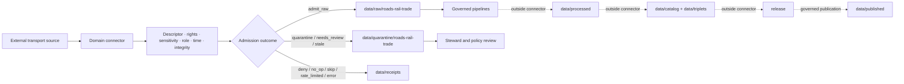

<!-- [KFM_META_BLOCK_V2]
doc_id: kfm://doc/connectors-domains-roads-rail-trade-readme
title: connectors/domains/roads-rail-trade/ — Roads, Rail, and Trade Domain Connector Lane
type: readme
version: v0.2
status: draft
owners: OWNER_TBD — Roads/Rail/Trade steward · Source steward · Connector steward · Data steward · Policy steward · Docs steward
created: 2026-06-16
updated: 2026-07-10
policy_label: public; domain-scoped; source-admission; raw-quarantine-receipts-only
related:
  - ../README.md
  - ../../../connectors/README.md
  - ../../../docs/domains/roads-rail-trade/README.md
  - ../../../data/registry/sources/
  - ../../../data/raw/roads-rail-trade/
  - ../../../data/quarantine/roads-rail-trade/
  - ../../../data/receipts/
  - ../../../data/proofs/
  - ../../../policy/
  - ../../../release/
  - ../../../packages/domains/roads-rail-trade/
  - ../../../pipelines/domains/roads-rail-trade/
  - ../../../pipeline_specs/roads-rail-trade/
tags: [kfm, connectors, domains, roads-rail-trade, roads, rail, trade-routes, mobility, network, source-admission, governance]
notes:
  - "v0.2 preserves the v0.1 authority boundary and expands source-role, temporal, operational-status, sensitivity, validation, receipt, and rollback controls."
  - "This lane is domain-scoped source-admission support only; it does not own transport truth, network topology truth, route identity, policy, schemas, catalogs, triplets, proofs, release, public routing, or publication."
  - "Connector handoffs are limited to governed raw, quarantine, and receipt surfaces."
  - "Concrete child connectors, modules, SourceDescriptors, endpoints, tests, fixtures, CI wiring, and runtime behavior remain NEEDS VERIFICATION."
[/KFM_META_BLOCK_V2] -->

<a id="top"></a>

# Roads, Rail, and Trade Domain Connectors

> Domain-scoped source-admission support for road, rail, trade-route, mobility, and transport-network material. This lane stages evidence; it does not define operational truth, legal access, routing authority, or publication state.

<p>
  
  
  
  
  
</p>

`connectors/domains/roads-rail-trade/`

## Quick jumps

[Status](#status) · [Scope](#scope) · [Repo fit](#repo-fit) · [Accepted inputs](#accepted-inputs) · [Exclusions](#exclusions) · [Admission contract](#admission-contract) · [Transport anti-collapse rules](#transport-anti-collapse-rules) · [Sensitive and operational detail](#sensitive-and-operational-detail) · [Bounded outcomes](#bounded-outcomes) · [Lifecycle](#lifecycle) · [Validation](#validation) · [Safe change pattern](#safe-change-pattern) · [Evidence basis](#evidence-basis) · [Rollback](#rollback) · [Definition of done](#definition-of-done)

---

## Status

> [!IMPORTANT]
> **Status:** `draft` / `NEEDS VERIFICATION`  
> **Owner:** `OWNER_TBD`  
> **Path:** `connectors/domains/roads-rail-trade/`  
> **Owning root:** `connectors/`  
> **Responsibility:** domain-scoped source intake and admission support  
> **Truth posture:** `CONFIRMED` README path and documentation boundary; child connectors, source activation, endpoints, schedules, tests, fixtures, emitted receipts, CI coverage, and runtime behavior remain `NEEDS VERIFICATION`.

> [!CAUTION]
> Connector output is candidate source material. It is not proof that a road is open, a rail line is active, a crossing is safe, a route is legally accessible, a trade corridor is current, or a graph edge is traversable.

---

## Scope

Use this lane for connector-facing code and documentation that is intentionally scoped to the Roads / Rail / Trade domain.

Allowed responsibilities include:

- retrieving or staging approved source material;
- preserving source-native identifiers and locators;
- recording retrieval, source, valid, event, and publication times when available;
- preserving source role, network mode, route class, operational status, vintage, scale, uncertainty, and limitations;
- computing content digests and admission metadata;
- routing candidate material to raw, quarantine, or receipt handoffs;
- returning finite, reviewable outcomes when admission cannot proceed.

This lane must not decide final route identity, operational status, legal access, graph topology, historical interpretation, publication readiness, or public routing behavior.

---

## Repo fit

```text
connectors/
└── domains/
    └── roads-rail-trade/
        └── README.md
```

| Responsibility root | Relationship |
|---|---|
| `connectors/domains/` | Domain-scoped connector grouping. Child placement must be intentional and documented. |
| `docs/domains/roads-rail-trade/` | Human-facing domain doctrine and interpretation. |
| `data/registry/sources/` | SourceDescriptor and activation authority. |
| `data/raw/roads-rail-trade/` | Allowed raw admission handoff. |
| `data/quarantine/roads-rail-trade/` | Required hold area for unresolved, conflicting, sensitive, stale, or rights-limited material. |
| `data/receipts/` | Run, denial, no-op, quarantine, and admission receipts. |
| `data/proofs/` | Downstream evidence closure; not connector authority. |
| `packages/domains/roads-rail-trade/` | Reusable domain helper code outside connector ownership. |
| `pipelines/domains/roads-rail-trade/` | Executable transformation and promotion logic. |
| `pipeline_specs/roads-rail-trade/` | Declarative workflow definitions. |
| `policy/` | Rights, sensitivity, access, and publication decisions. |
| `release/` | Release, correction, withdrawal, and rollback decisions. |

> [!NOTE]
> Paths beyond the directly inspected README remain subject to repository verification. Do not treat this table as proof that every referenced directory or contract is implemented.

---

## Accepted inputs

| Belongs here | Required posture |
|---|---|
| Road, rail, trail, crossing, port, terminal, route, mobility, and trade-source adapters | Descriptor-gated and source-role preserving. |
| Service, feed, package, archive, or download clients | Explicit configuration; no implicit activation. |
| Manifest, feature, event, and metadata parsers | Preserve source-native fields, units, time, geometry, direction, status, and limitations. |
| Digest and admission-envelope helpers | Deterministic where practical. |
| Raw/quarantine handoff helpers | Require explicit destination and receipt metadata. |
| Connector-local documentation | Must state source authority limits and review requirements. |
| Small test support helpers | Offline and non-authoritative; fixture placement must follow the accepted test/fixture contract. |

---

## Exclusions

| Does not belong here | Owning responsibility root |
|---|---|
| Domain doctrine or route interpretation | `docs/domains/roads-rail-trade/` |
| Reusable domain package code | `packages/domains/roads-rail-trade/` |
| Network normalization, conflation, graph construction, or generalization pipelines | `pipelines/domains/roads-rail-trade/` |
| Declarative pipeline definitions | `pipeline_specs/roads-rail-trade/` |
| Processed network or event records | `data/processed/` |
| Catalog or triplet records | `data/catalog/`, `data/triplets/` |
| SourceDescriptor authority | `data/registry/sources/` |
| EvidenceBundle or proof closure | `data/proofs/` and governed proof workflows |
| Release decisions and rollback state | `release/` |
| Rights, safety, access, or publication policy | `policy/` |
| Machine schemas and semantic contracts | accepted `schemas/` and `contracts/` authority roots |
| Public routing, navigation, map, API, or UI behavior | governed public application and runtime roots after release |
| Generated reports and QA artifacts | `artifacts/` |

---

## Admission contract

Every admitted candidate should preserve, when available:

- SourceDescriptor reference;
- source family, product, feed, service, or archive identity;
- source-native feature, event, segment, route, station, crossing, or facility identifier;
- network mode and feature class;
- retrieval time, source time, valid time, event time, update time, and vintage;
- geometry type, coordinate reference information, scale, resolution, and generalization notes;
- directionality, carriageway, track, lane, route, operator, jurisdiction, and ownership fields as source assertions only;
- operational, construction, closure, restriction, abandonment, historic, proposed, or unknown status exactly as represented by the source;
- uncertainty, confidence, completeness, and limitation fields;
- rights, sensitivity, and access posture;
- content digest and receipt reference;
- quarantine reason or denial reason when admission cannot proceed.

Missing identity, time, role, status, rights, sensitivity, or integrity information must not be silently defaulted into public-ready values.

---

## Transport anti-collapse rules

Connector code must keep these concepts distinct:

| Do not collapse | Required distinction |
|---|---|
| Source linework vs. legal right-of-way | Geometry alone does not establish legal access, ownership, easement, or jurisdiction. |
| Mapped road vs. open road | Presence does not prove current accessibility, maintenance, condition, or permission. |
| Rail geometry vs. active service | A mapped track does not prove current operator, traffic, passenger service, freight service, or safety status. |
| Historic route vs. modern route | Shared names or approximate alignment do not prove identity or continuity. |
| Observed movement vs. inferred flow | Counts, traces, schedules, models, and derived flows must retain separate source roles. |
| Administrative classification vs. physical condition | Functional class, route number, or ownership label does not prove surface, capacity, or operability. |
| Closure/advisory feed vs. permanent network truth | Events are time-bound and may expire, be corrected, or be superseded. |
| Trade corridor vs. individual shipment | Aggregate or modeled corridor context must not be treated as transaction-level evidence. |
| Source topology vs. governed graph edge | Connector output does not authorize routable graph connectivity. |

Historic routes, modern roads, rail lines, trails, crossings, facilities, ports, and trade corridors require independent identity and temporal treatment.

---

## Sensitive and operational detail

Fail closed or quarantine when source material may expose:

- critical infrastructure details not appropriate for public release;
- security-sensitive rail, bridge, tunnel, port, terminal, control, or facility attributes;
- private access roads, restricted crossings, gated routes, or non-public facilities;
- precise archaeological, burial, sacred, ecological, or cultural-resource locations intersecting transport corridors;
- living-person movement traces or re-identifiable mobility records;
- proprietary shipment, logistics, operator, or commercial-route information;
- stale closure, hazard, detour, or emergency information that could mislead users.

Logs, exceptions, test fixtures, receipts, and debugging output must not expose restricted credentials, tokens, private movement histories, or sensitive infrastructure coordinates.

KFM connector output must never be presented as emergency, dispatch, navigation, legal-access, or safety instruction.

---

## Bounded outcomes

A connector run should terminate in a finite, inspectable result such as:

| Outcome | Meaning |
|---|---|
| `admit_raw` | Candidate material passed admission checks and was handed to an approved raw target. |
| `quarantine` | Material requires rights, sensitivity, identity, temporal, status, quality, or steward review. |
| `deny` | Policy, rights, source, or security conditions prohibit admission. |
| `no_op` | The source has no material change or the digest already exists. |
| `skip` | The product, region, vintage, mode, or feature class is outside configured scope. |
| `rate_limited` | Retrieval was deferred without bypassing source controls. |
| `stale` | Time-sensitive material exceeded its accepted freshness window. |
| `needs_review` | A bounded human decision is required before further processing. |
| `error` | Retrieval, parsing, validation, integrity, or handoff failed. |

Each non-success outcome should preserve a reason code and enough non-sensitive context for audit and retry.

---

## Lifecycle



Promotion is a governed state transition outside this connector lane.

---

## Validation

Before relying on any child connector or helper in this lane, verify:

- [ ] SourceDescriptor exists, is active, and matches the requested source/product.
- [ ] Child connector placement is intentional and documented.
- [ ] Imports have no network, filesystem, credential, or activation side effects.
- [ ] Endpoints, authentication, pagination, retries, timeouts, cadence, and rate limits are configurable.
- [ ] Source-native identity, mode, role, time, vintage, directionality, geometry, status, and limitation fields are preserved.
- [ ] Historic, current, proposed, closed, abandoned, modeled, and inferred records remain distinct.
- [ ] Raw/quarantine/receipt-only output boundaries are enforced.
- [ ] Sensitive locations and movement data fail closed or quarantine.
- [ ] Offline fixtures cover success, malformed input, stale data, denial, no-op, rate-limit, quarantine, and error outcomes.
- [ ] Generated reports land outside this connector lane.
- [ ] CI execution and current pass state are verified or explicitly marked `NEEDS VERIFICATION`.
- [ ] Canonical `tests/` trust-spine checks remain separate from connector-local tests.

---

## Safe change pattern

1. Confirm the change is connector code, connector-local documentation, or connector-facing support material.
2. Confirm the source or product is descriptor-gated and intentionally placed.
3. Confirm no direct writes target processed, catalog, triplet, proof, published, or release state.
4. Preserve source-native identity, source role, mode, time, status, scale, rights, and limitations.
5. Add or update offline tests for finite outcomes and anti-collapse rules.
6. Review logs, fixtures, and receipts for sensitive infrastructure or movement detail.
7. Update affected documentation or explain why no documentation change is required.

---

## Evidence basis

| Evidence | Status | Supports | Does not prove |
|---|---|---|---|
| This README path and prior v0.1 content | `CONFIRMED` | Existing domain-scoped lane and authority boundary. | Implementation completeness or runtime correctness. |
| Parent `connectors/` doctrine | `CONFIRMED where inspected` | Connectors are source-admission infrastructure only. | Child activation, health, or CI coverage. |
| Roads/Rail/Trade doctrine and related paths | `NEEDS VERIFICATION` | Intended downstream responsibility separation. | Current contracts, schemas, tests, or release state. |
| Actual modules, SourceDescriptors, endpoints, fixtures, tests, receipts, and workflows | `UNKNOWN / NEEDS VERIFICATION` | Must be inspected before implementation claims. | Nothing until verified. |

---

## Rollback

Rollback is required if this README or implementation is used to justify:

- direct public access to connector internals;
- direct routing, navigation, legal-access, closure, or operational-status claims;
- direct writes to processed, catalog, triplet, proof, published, or release stores;
- collapse of historic and modern routes, source geometry and legal access, or modeled and observed movement;
- disclosure of sensitive infrastructure, private movement, or restricted-access detail;
- implicit source activation without SourceDescriptor and policy gates.

Rollback target: prior blob `fec45d124debe5b343bd41963b2ece8c908f6733`.

For sensitive-data exposure, stop the affected connector, quarantine outputs, preserve audit evidence without repeating restricted detail, revoke exposed credentials if applicable, and initiate correction or withdrawal through the owning governance path.

---

## Definition of done

- [ ] Owners are confirmed and `OWNER_TBD` is replaced.
- [ ] Actual folder contents and child connectors are inventoried.
- [ ] Child placement and source coverage are tied to active SourceDescriptors.
- [ ] Endpoint, cadence, timeout, retry, pagination, and rate-limit behavior are documented and tested.
- [ ] Source-role, mode, vintage, time, identity, status, geometry, uncertainty, and limitation fields are preserved.
- [ ] Historic/modern, observed/modeled, open/closed, active/abandoned, and geometry/access distinctions are tested.
- [ ] Sensitive infrastructure, private movement, and restricted-access details fail closed or quarantine.
- [ ] Outputs are verified to enter only raw, quarantine, and receipt handoff surfaces.
- [ ] No doctrine, package, pipeline, processed, catalog, triplet, published, release, schema, policy, proof, registry, fixture, report, API, UI, or routing authority lives here.
- [ ] Offline tests, canonical trust-spine tests, CI behavior, and current pass state are verified or marked `NEEDS VERIFICATION`.
- [ ] Rollback and correction paths are documented and testable.

---

## Status summary

`connectors/domains/roads-rail-trade/` is a domain-scoped source-admission lane. It may stage transport-related candidate evidence into governed raw, quarantine, and receipt surfaces. It is not transport truth, network topology authority, legal-access authority, routing authority, emergency guidance, schema or policy authority, proof closure, release authority, publication authority, reusable package authority, or pipeline authority.

<p align="right"><a href="#top">Back to top</a></p>
