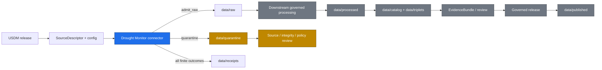

<!-- [KFM_META_BLOCK_V2]
doc_id: kfm://doc/connectors-drought-monitor-readme
title: connectors/drought-monitor/ — U.S. Drought Monitor Connector Lane
type: readme
version: v0.3
status: draft
owners: OWNER_TBD — Source steward · Connector steward · Drought/Hazards steward · Data steward · Docs steward
created: 2026-06-16
updated: 2026-07-10
policy_label: public
related:
  - ../README.md
  - ../../docs/sources/catalog/drought_monitor/README.md
  - ../../docs/sources/catalog/drought_monitor/drought-monitor.md
  - ../../data/registry/sources/
  - ../../data/raw/
  - ../../data/quarantine/
  - ../../data/receipts/
  - ../../data/proofs/
  - ../../policy/
  - ../../release/
tags: [kfm, connectors, drought-monitor, usdm, drought, hydrology, agriculture, hazards, habitat, source-admission, raw, quarantine, governance]
notes:
  - "v0.3 strengthens release cadence, supersession, classification-versus-indicator, bounded-outcome, evidence, and rollback controls."
  - "The source-family catalog marks drought_monitor as PROPOSED beyond connector roots listed in directory rules; connector-lane ratification remains NEEDS VERIFICATION."
  - "Connector output may enter data/raw/, data/quarantine/, or receipt handoff paths only."
  - "Specific modules, endpoints, source descriptors, tests, fixtures, and CI enforcement remain NEEDS VERIFICATION."
[/KFM_META_BLOCK_V2] -->

<a id="top"></a>

# Drought Monitor Connector

> Source-specific intake and admission lane for U.S. Drought Monitor drought-classification source material.

<p>
  
  
  
  
  
</p>

`connectors/drought-monitor/`

## Quick jumps

[Status](#status) · [Scope](#scope) · [Repo fit](#repo-fit) · [Inputs](#inputs) · [Exclusions](#exclusions) · [Admission contract](#admission-contract) · [Temporal and supersession rules](#temporal-and-supersession-rules) · [Bounded outcomes](#bounded-outcomes) · [Validation](#validation) · [Evidence basis](#evidence-basis) · [Rollback](#rollback) · [Definition of done](#definition-of-done)

---

## Status

> [!IMPORTANT]
> **Status:** `draft` / `NEEDS VERIFICATION`  
> **Owner:** `OWNER_TBD`  
> **Path:** `connectors/drought-monitor/`  
> **Truth posture:** README path and current content are `CONFIRMED`; source activation, connector implementation, endpoint behavior, descriptors, tests, fixtures, receipts, and CI wiring remain `NEEDS VERIFICATION`.

> [!CAUTION]
> U.S. Drought Monitor classes are weekly expert-synthesis classifications. They are not raw observations, forecasts, hydrologic measurements, crop-loss determinations, emergency declarations, or automatic proof of local conditions.

---

## Scope

`connectors/drought-monitor/` is the connector lane for U.S. Drought Monitor source intake and admission helpers.

It may contain source-specific fetch logic, release-discovery helpers, metadata parsers, digest helpers, raw/quarantine handoff helpers, receipt-input helpers, and connector-local documentation.

It must not become drought truth, hydrology truth, agriculture truth, hazard truth, habitat truth, source-family authority, policy authority, schema authority, catalog/triplet authority, proof closure, release authority, pipeline authority, alerting authority, or publication authority.

---

## Repo fit

```text
connectors/
└── drought-monitor/
    └── README.md
```

Related responsibility roots:

```text
docs/sources/catalog/drought_monitor/  # source-family and product documentation
data/registry/sources/                 # SourceDescriptors and activation state
data/raw/                              # admitted raw source payloads
data/quarantine/                       # held material requiring review
data/receipts/                         # process and validation receipts
data/proofs/                           # EvidenceBundles and proof packs
policy/                                # source, rights, sensitivity, and publication rules
release/                               # release, correction, supersession, and rollback state
```

> [!NOTE]
> Source documentation currently treats `drought_monitor` as proposed beyond the connector roots listed in Directory Rules. Final placement and activation remain `NEEDS VERIFICATION` until ratified by current repository evidence or an ADR/migration note.

---

## Authority boundary

```text
MAY SUPPORT:
  data/raw/<domain>/<source_id>/<run_id>/
  data/quarantine/<domain>/<source_id>/<run_id>/
  data/receipts/<run_id>/

MUST NOT OWN:
  data/work/
  data/processed/
  data/catalog/
  data/triplets/
  data/published/
  data/proofs/ as closure authority
  release/ decisions
  policy/ rules
  schemas/ or contracts/
  source registry rows
  public API, UI, alerting, or routing behavior
```

Receipts are evidence that a fetch, validation, denial, skip, or quarantine action occurred. They are not proof closure, catalog closure, or publication approval.

---

## Inputs

| Accepted item | Required posture |
|---|---|
| Source adapter | Require explicit SourceDescriptor/config input and preserve source identity. |
| Release discovery helper | Preserve release date, valid period, product identity, and retrieval context. |
| Metadata parser | Preserve native classification fields, source caveats, and geometry/vintage metadata. |
| Digest helper | Deterministic and side-effect-free unless explicit bytes or paths are supplied. |
| Raw/quarantine handoff helper | Require explicit destination, reason, and receipt metadata. |
| Connector documentation | Do not claim source activation, validation, or release state unless verified. |
| Test references | Prefer no-network fixtures; fixtures are not source authority. |

---

## Exclusions

| Do not store or decide here | Correct home |
|---|---|
| Source catalog authority | `docs/sources/catalog/drought_monitor/` and registry homes |
| SourceDescriptor activation | `data/registry/sources/` |
| Domain doctrine | `docs/domains/` |
| Processed drought, hydrology, agriculture, hazard, or habitat records | `data/processed/` |
| Catalog or triplet records | `data/catalog/`, `data/triplets/` |
| EvidenceBundles and proof closure | `data/proofs/` |
| Release, correction, supersession, or rollback decisions | `release/` |
| Published layers or public summaries | `data/published/` after governed release |
| Policy rules | `policy/` |
| Schemas or contracts | `schemas/`, `contracts/` |
| Generated reports | `artifacts/` |

---

## Admission contract

A connector run should preserve, when available:

- SourceDescriptor reference;
- source family and product identity;
- release date and release week;
- source-valid time or valid-through interval;
- retrieval time;
- content digest and source locator;
- native drought classification and geometry fields;
- source role and limitation text;
- provisional, corrected, replaced, or superseded status;
- rights and review posture;
- quarantine reason and bounded outcome;
- receipt reference and rollback target.

### Anti-collapse rules

- A drought class is not a direct measurement.
- A weekly map is not a forecast.
- A drought classification does not prove a crop-loss amount, water-right condition, emergency declaration, or local operational restriction.
- Supporting indicators, observations, models, and expert synthesis must remain distinct source roles.
- County or polygon summaries must not be silently converted into parcel-, field-, farm-, person-, or facility-level truth.
- Later releases may supersede earlier releases; supersession must not erase lineage.

---

## Temporal and supersession rules

Every admitted product should preserve distinct time fields rather than collapsing them into one timestamp:

| Time field | Meaning |
|---|---|
| Release time | When the source published the product. |
| Valid time / valid-through | Period represented by the source product. |
| Retrieval time | When KFM fetched or received it. |
| Correction time | When a corrected source version was published, when applicable. |
| Supersession time | When a newer release replaced an earlier release for ordinary current-state use. |

A newer weekly release may become the preferred current context, but prior releases remain part of the historical record. The connector may preserve supersession metadata; it must not delete lineage or decide public correction policy.

---

## Bounded outcomes

Connector runs must terminate with an explicit finite outcome:

| Outcome | Meaning |
|---|---|
| `admit_raw` | Source material passed admission checks and was staged as raw. |
| `quarantine` | Material requires source, integrity, rights, format, placement, or policy review. |
| `deny` | Admission is prohibited under current rules or evidence. |
| `no_change` | The retrieved release matches the already-recorded digest/version. |
| `superseded` | The product is preserved but no longer preferred for current-state use. |
| `rate_limited` | The source deferred or rejected the request; no silent retry loop. |
| `skipped` | A declared precondition was not met. |
| `error` | Retrieval, parsing, validation, or handoff failed with an auditable reason. |

No outcome may silently promote material to processed, catalog, triplet, proof, published, or release state.

---

## Lifecycle



Everything after raw/quarantine/receipt handoff is outside this connector's authority.

---

## Validation

Before relying on this connector, verify:

- [ ] SourceDescriptor and product-family records exist and are active.
- [ ] Placement is intentional and documented.
- [ ] Endpoint, format, cadence, timeout, retry, and rate-limit behavior are configurable.
- [ ] Imports are side-effect-free.
- [ ] No-network fixtures cover expected source shapes where practical.
- [ ] Release, valid, retrieval, correction, and supersession times remain distinct.
- [ ] Native classifications and caveat text are preserved.
- [ ] Digest stability and `no_change` behavior are tested.
- [ ] Outputs are limited to raw, quarantine, and receipt handoffs.
- [ ] Downstream proof, catalog, release, and publication objects are created only outside this connector.
- [ ] CI execution is verified or explicitly marked `NEEDS VERIFICATION`.

---

## Evidence basis

| Source | Status | Supports | Limits |
|---|---|---|---|
| This README path and prior blob | `CONFIRMED` | Existing connector boundary and placement warning | Does not prove implementation or activation |
| `docs/sources/catalog/drought_monitor/` references | `CONFIRMED` by prior README evidence | Source-family documentation relationship | Does not prove current endpoint health or runtime behavior |
| Connector modules, tests, fixtures, receipts, and CI | `UNKNOWN / NEEDS VERIFICATION` | Potential implementation evidence | Not inventoried in this update |

---

## Rollback

Rollback is required if this README is used to justify:

- direct publication from connector output;
- treating drought classifications as raw observations or forecasts;
- erasing release lineage during supersession;
- field-, parcel-, person-, facility-, or legal-condition claims unsupported by the source;
- bypassing SourceDescriptor, policy, evidence, review, or release gates;
- storing processed, catalog, triplet, proof, release, or published authority in this lane.

Rollback target: prior blob `65f8fb9d233faf751b6c56806b701b707b3aac32`.

---

## Definition of done

- [ ] Owners are confirmed and `OWNER_TBD` is replaced.
- [ ] Actual connector contents are inventoried.
- [ ] SourceDescriptor IDs and activation are verified.
- [ ] Connector-root placement is ratified or documented as migration state.
- [ ] Endpoint, cadence, format, timeout, retry, and rate-limit behavior are documented and tested.
- [ ] Classification, indicator, observation, model, and forecast roles remain distinct.
- [ ] Release, valid, retrieval, correction, and supersession times are preserved.
- [ ] Raw/quarantine/receipt-only boundaries are tested.
- [ ] No source-family, domain, processed, catalog, triplet, published, release, schema, policy, proof, registry, fixture, or report authority lives here.
- [ ] Tests, fixtures, receipts, and CI behavior are verified or marked `NEEDS VERIFICATION`.

---

## Status summary

`connectors/drought-monitor/` is for U.S. Drought Monitor source-admission code only. It is not drought truth, observation authority, forecast authority, alerting authority, policy authority, schema authority, catalog/triplet authority, proof closure, release authority, publication authority, or pipeline authority.

<p align="right"><a href="#top">Back to top</a></p>
