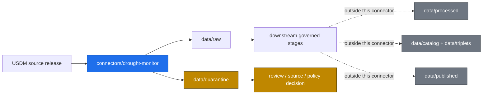

<!-- [KFM_META_BLOCK_V2]
doc_id: kfm://doc/connectors-drought-monitor-readme
title: connectors/drought-monitor/ — U.S. Drought Monitor Connector Lane
type: readme
version: v0.2
status: draft
owners: OWNER_TBD — Source steward · Connector steward · Drought/Hazards steward · Data steward · Docs steward
created: 2026-06-16
updated: 2026-06-16
policy_label: public
related:
  - ../README.md
  - ../../docs/sources/catalog/drought_monitor/README.md
  - ../../docs/sources/catalog/drought_monitor/drought-monitor.md
  - ../../data/registry/sources/
  - ../../data/raw/
  - ../../data/quarantine/
  - ../../data/receipts/
  - ../../data/proofs/
  - ../../policy/
  - ../../release/
tags: [kfm, connectors, drought-monitor, usdm, drought, hydrology, agriculture, hazards, habitat, source-admission, raw, quarantine, governance]
notes:
  - "v0.2 expands the connector README into a fuller repo-facing contract while preserving the original raw/quarantine-only boundary."
  - "The source-family catalog marks drought_monitor as PROPOSED beyond the connector roots listed in directory rules; connector lane ratification remains NEEDS VERIFICATION."
  - "Connector output may enter data/raw/ or data/quarantine/ only."
  - "Specific modules, endpoints, source descriptors, tests, fixtures, and CI enforcement remain NEEDS VERIFICATION."
[/KFM_META_BLOCK_V2] -->

<a id="top"></a>

# Drought Monitor Connector

> Source-specific intake and admission lane for U.S. Drought Monitor drought-classification source material.

<p>
  
  
  
  
  
</p>

`connectors/drought-monitor/`

## Quick jumps

[Scope](#scope) · [Repo fit](#repo-fit) · [Authority boundary](#authority-boundary) · [Inputs](#inputs) · [Exclusions](#exclusions) · [Admission posture](#admission-posture) · [Validation](#validation) · [Definition of done](#definition-of-done)

---

## Scope

`connectors/drought-monitor/` is the connector lane for U.S. Drought Monitor source intake and admission helpers.

It may contain connector-local documentation and source-admission code for drought-classification source material. It must not become drought truth, hydrology truth, agriculture truth, hazards truth, habitat truth, source-family authority, policy authority, schema authority, catalog/triplet authority, proof authority, release authority, pipeline authority, or publication authority.

> [!IMPORTANT]
> **Status:** draft / `NEEDS VERIFICATION`  
> **Owner:** `OWNER_TBD`  
> **Path:** `connectors/drought-monitor/`  
> **Truth posture:** connector README path is confirmed by this committed file; the USDM source-family catalog pages exist; source activation, endpoint behavior, descriptors, tests, fixtures, and CI wiring remain `NEEDS VERIFICATION`.

## Repo fit

```text
connectors/
└── drought-monitor/
    └── README.md
```

Related responsibility roots:

```text
connectors/                            # source-specific fetch and admission code
docs/sources/catalog/drought_monitor/  # USDM source-family and product documentation
data/registry/sources/                 # source descriptors and activation state
data/raw/                              # raw staged outputs
data/quarantine/                       # held material requiring review
data/receipts/                         # process and validation receipts
data/proofs/                           # EvidenceBundles and proof packs
policy/                                # source and publication rules
release/                               # release decisions and rollback/correction state
```

The source catalog describes `drought_monitor` as a proposed source family beyond the connector roots listed in Directory Rules. Treat this connector lane as draft until placement and activation are ratified.

## Lifecycle sketch



## Authority boundary

```text
OUTPUT LIMIT:
  data/raw/
  data/quarantine/

NOT HERE:
  source-family truth
  domain doctrine
  processed data
  catalog records
  triplet records
  receipts/proofs as authority
  release decisions
  published artifacts
  policy rules
  schemas/contracts
  registry rows
  generated reports
```

## Inputs

| Accepted item | Required posture |
|---|---|
| Source adapter | Preserve source identity, product family, release week, and review posture. |
| Admission helper | Prepare raw/quarantine admission output only. |
| Source-role helper | Preserve role, time, drought class, and limitation fields. |
| Connector docs | Do not claim source admission, validation, or release state unless verified. |
| Test references | Point to owning test or fixture roots; avoid treating fixtures as source authority. |

## Exclusions

| Do not store here | Correct home |
|---|---|
| Source catalog authority | `docs/sources/catalog/drought_monitor/` and source registry homes |
| Source descriptors or registry rows | `data/registry/sources/` |
| Domain doctrine or scope | `docs/domains/` |
| Processed drought, hydrology, agriculture, hazards, or habitat records | `data/processed/` |
| Catalog or triplet records | `data/catalog/`, `data/triplets/` |
| Receipts and proof packs as authority | `data/receipts/`, `data/proofs/` |
| Release decisions or rollback/correction records | `release/` |
| Published artifacts or public layers | `data/published/` after governed release |
| Policy rules | `policy/` |
| Schemas or contracts | `schemas/`, `contracts/` |
| Generated reports | `artifacts/` |

## Admission posture

USDM source intake should preserve:

- source identity and product family;
- release date, release week, and retrieval time;
- source time or valid-through time when available;
- content digest;
- native drought-classification fields;
- source role and limitation notes;
- review-needed flags;
- quarantine reason when review is required.

Drought Monitor material may inform hydrology, agriculture, hazards, habitat, and related reasoning, but connector output remains admission material. Confirmation, transformation, publication, correction, and rollback belong to governed downstream stages.

## Placement and activation status

| Claim | Status | Notes |
|---|---|---|
| `connectors/drought-monitor/README.md` exists after this update | `CONFIRMED` | Verified by direct repo update/fetch. |
| USDM source-family docs exist under `docs/sources/catalog/drought_monitor/` | `CONFIRMED` | Source-family and product docs were inspected. |
| `drought_monitor` is ratified as a connector root | `NEEDS VERIFICATION` | Catalog docs mark it proposed beyond the listed connector roots. |
| SourceDescriptor activation exists | `NEEDS VERIFICATION` | Must be checked in `data/registry/sources/`. |
| Live endpoint behavior and cadence configuration are implemented | `UNKNOWN` | Not verified from code/tests in this update. |
| CI invokes connector tests | `UNKNOWN` | Workflow evidence not inspected for this update. |

## Validation

Before relying on this connector, verify:

- source descriptors exist and are active;
- placement is intentional and documented;
- endpoint, format, cadence, and release-week assumptions are configurable;
- tests use no-network fixtures where practical;
- output paths are limited to raw/quarantine admission lanes;
- downstream receipts, proofs, catalog/triplet records, and release records are produced only outside this connector;
- any public product is released only through governed publication controls.

## Definition of done

- [ ] Owners are confirmed and `OWNER_TBD` is replaced.
- [ ] Actual connector contents are inventoried.
- [ ] SourceDescriptor IDs and source-family activation are verified.
- [ ] Endpoint, cadence, and format choices are documented.
- [ ] Outputs are verified to enter only raw or quarantine admission lanes.
- [ ] No source-family, domain, processed, catalog, triplet, published, release, schema, policy, proof, receipt, registry, fixture, or report authority lives here.
- [ ] Tests, fixtures, and CI behavior are verified or marked `NEEDS VERIFICATION`.

## Status summary

`connectors/drought-monitor/` is for U.S. Drought Monitor source-admission code only. It is not source-family truth, domain truth, policy authority, schema authority, catalog/triplet authority, proof closure, release authority, publication authority, or pipeline authority.

<p align="right"><a href="#top">Back to top</a></p>
