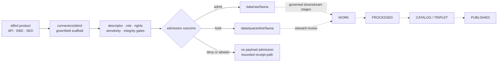

<!-- [KFM_META_BLOCK_V2]
doc_id: kfm://doc/connectors-ebird-readme
title: connectors/ebird/ — eBird Connector Lane
type: readme
version: v0.2
status: draft
owners: OWNER_TBD — Source steward · Connector steward · Fauna steward · Data steward · Docs steward
created: 2026-06-16
updated: 2026-07-10
policy_label: restricted
related:
  - ../README.md
  - ./src/README.md
  - ./src/ebird/README.md
  - ./tests/README.md
  - ../../docs/doctrine/directory-rules.md
  - ../../docs/sources/ADMISSION_PROCESS.md
  - ../../docs/adr/ADR-0012-connector-outputs-to-data-raw-or-data-quarantine-only.md
  - ../../docs/sources/catalog/ebird/README.md
  - ../../docs/sources/catalog/ebird/ebird-api.md
  - ../../docs/sources/catalog/ebird/ebird-basic-dataset.md
  - ../../docs/sources/catalog/ebird/sampling-event-data.md
  - ../../data/registry/fauna/sources/ebird.yaml
  - ../../data/raw/fauna/ebird/README.md
  - ../../policy/domains/fauna/rare_species_redaction.rego
  - ../../release/
tags: [kfm, connectors, ebird, fauna, birds, biodiversity, source-admission, raw, quarantine, governance]
notes:
  - "This README describes the verified greenfield state of connectors/ebird/ and its governed implementation boundary."
  - "The package metadata is version 0.0.0; fetch and admission modules are placeholders; no runnable connector-local test suite is present."
  - "Connector-local and registry descriptor values conflict on sensitivity and remain unresolved."
  - "Connector payload output is limited to RAW or QUARANTINE; admission, promotion, and publication remain separate governed transitions."
[/KFM_META_BLOCK_V2] -->

<a id="top"></a>

# eBird Connector

> Greenfield source-admission lane for eBird material entering the KFM Fauna lifecycle.

<p>
  
  
  
  
  
  
</p>

`connectors/ebird/`

> [!IMPORTANT]
> **Document lifecycle:** `draft`  
> **Component maturity:** `experimental` — greenfield scaffold, not an active connector  
> **Owners:** `OWNER_TBD`; `.github/CODEOWNERS` supplies only the repository-wide fallback  
> **Evidence boundary:** `CONFIRMED` from `bartytime4life/Kansas-Frontier-Matrix` at base commit `d79c39d0e828e0793195e527ad253b774652a09a`; live endpoints, credentials, activation, runtime behavior, and CI execution were not verified.  
> **Quick links:** [Scope](#scope-and-audience) · [Current state](#current-implementation-state) · [Repo fit](#repository-fit) · [Product boundaries](#product-and-authority-boundaries) · [Safety conflicts](#safety-conflicts) · [Validation](#validation) · [Rollback](#rollback)

---

## Scope and audience

This directory is the implementation boundary for eBird-specific fetch and admission support. It is intended for connector maintainers, source stewards, Fauna stewards, data stewards, policy reviewers, test authors, and documentation reviewers.

Code here may eventually fetch an approved eBird product, preserve source metadata, apply admission preconditions, and hand an immutable source capture to `data/raw/fauna/` or a held capture to `data/quarantine/fauna/`.

This directory is not eBird source-family doctrine, Fauna truth, taxonomy authority, SourceDescriptor authority, rights or sensitivity policy, evidence closure, release authority, or a public data path.

## Current implementation state

The current package is a scaffold. The inspected files document no supported installation or runnable connector command.

| Surface | Confirmed state | What it does not prove |
|---|---|---|
| `pyproject.toml` | Declares `kfm-connector-ebird` at version `0.0.0`. | No build backend, dependencies, entry points, environment variables, or test configuration are declared. |
| `src/ebird/__init__.py` | Empty file. | No public Python API or import behavior beyond an empty module. |
| `src/ebird/fetch.py` | One-line greenfield placeholder. | No endpoint client, authentication, pagination, retry, timeout, rate-limit, or download behavior. |
| `src/ebird/admit.py` | One-line greenfield placeholder. | No descriptor gate, validation, quarantine, receipt, or output-path enforcement. |
| `src/ebird/descriptor.yaml` | Placeholder with `role: TBD`, `rights: TBD`, and `sensitivity_floor: public`. | It is not an accepted SourceDescriptor or activation decision. |
| `tests/` | Contains a README contract only. | No connector-local test modules, fixtures, runner command, passing tests, or CI wiring. |
| Generic boundary workflow | Pull requests touching `connectors/**` trigger `policy-boundary-guards`. | Its static test is not eBird behavior coverage and does not enforce the full RAW/QUARANTINE-only contract. |

Documentation below `src/` and `tests/` defines intended boundaries. It does not upgrade placeholder code into implemented behavior.

## Repository fit

### Inspected directory map

```text
connectors/ebird/
├── README.md
├── pyproject.toml
├── src/
│   ├── README.md
│   └── ebird/
│       ├── README.md
│       ├── __init__.py
│       ├── admit.py
│       ├── descriptor.yaml
│       └── fetch.py
└── tests/
    └── README.md
```

This is the directly inspected connector surface at the evidence commit. It is not proof of runtime deployment, scheduled execution, source access, or downstream artifacts.

### Responsibility map

| Surface | Responsibility |
|---|---|
| [`../README.md`](../README.md) | Connector-root authority and lifecycle boundary. |
| [`../../docs/sources/catalog/ebird/`](../../docs/sources/catalog/ebird/) | Human-facing eBird family and product documentation. |
| [`../../data/registry/fauna/sources/ebird.yaml`](../../data/registry/fauna/sources/ebird.yaml) | Candidate eBird SourceDescriptor; authority fields remain unresolved. |
| [`../../data/raw/fauna/ebird/`](../../data/raw/fauna/ebird/) | RAW eBird source-capture lane after admission. |
| `../../data/quarantine/fauna/` | Hold lane when identity, role, rights, sensitivity, integrity, or validation is unresolved. |
| `../../data/receipts/` | Receipt authority owned by governed receipt writers, not this connector directory. |
| `../../data/proofs/` | EvidenceBundle and proof closure outside connector ownership. |
| `../../policy/` | Rights, sensitivity, privacy, and release decisions. |
| `../../release/` | Release, correction, and rollback decisions. |

## Product and authority boundaries

The draft eBird source catalog distinguishes three product surfaces. An implementation must keep their identity, access mode, grain, time, and limitations separate.

| Product surface | Connector posture |
|---|---|
| eBird API | Treat responses as the named API product; do not present them as EBD or SED extracts. |
| eBird Basic Dataset (EBD) | Preserve bulk-product identity, release identity, source fields, rights posture, and checklist links. |
| Sampling Event Data (SED) | Preserve checklist and effort identity; do not silently convert effort metadata into an observation record. |

Anti-collapse rules:

- an eBird observation is not specimen-backed evidence, taxonomic authority, range truth, legal status, or release authority;
- SED checklist or effort data is not a species observation by itself;
- absence from an API response or occurrence table is not proof of biological absence;
- source taxon names and identifiers are crosswalk inputs, not autonomous KFM taxonomy decisions;
- fetch success is not admission approval, and admission is not promotion or publication;
- generated summaries, maps, tiles, indexes, or model outputs are interpretive surfaces, not sovereign truth.

## Accepted inputs and outputs

Because the connector is not implemented, the items below are the required boundary for future work, not a claim that these interfaces exist.

| May belong here | Required posture |
|---|---|
| Source client or download adapter | Descriptor-gated, explicitly configured, and side-effect-free on import. |
| API, EBD, or SED parser | Preserve product identity, source fields, temporal scope, and limitations. |
| Admission helper | Return a bounded admit, quarantine, deny, abstain, no-change, rate-limit, or error outcome. |
| Provenance and integrity helper | Preserve source locator or request fingerprint, retrieval context, source time, and content digest. |
| Sensitivity routing helper | Mark material for governed review; never publish or generalize autonomously. |
| Connector-local tests | Offline and deterministic by default, using synthetic or explicitly approved fixtures. |
| Connector documentation | Separate confirmed implementation from proposed contracts and unknowns. |

Allowed payload handoffs:

```text
data/raw/fauna/<source_id>/<run_id>/
data/quarantine/fauna/<reason>/<run_id>/
```

A receipt may be supplied only through a documented governed receipt writer. This directory does not own receipt meaning or the receipt store.

## Exclusions

| Do not store or decide here | Owning surface |
|---|---|
| eBird family or product doctrine | `docs/sources/catalog/ebird/` |
| Authoritative SourceDescriptors or activation decisions | `data/registry/sources/` and governed admission workflows |
| Fauna doctrine or taxonomy decisions | `docs/domains/fauna/` and governing taxonomy surfaces |
| Rights, privacy, sensitivity, redaction, or release rules | `policy/` |
| RAW or quarantined payloads | `data/raw/` or `data/quarantine/` |
| Normalized or processed records | `data/work/` or `data/processed/` through pipelines |
| Catalog records or triplets | `data/catalog/` or `data/triplets/` |
| EvidenceBundles or proof packs | `data/proofs/` |
| Release, correction, or rollback decisions | `release/` |
| Published layers, API payloads, UI data, or generated reports | Governed downstream and published surfaces after release |
| Machine schemas or semantic contracts | `schemas/` or `contracts/` |

## Admission lifecycle

The diagram is the required connector boundary, not implemented runtime behavior.



The lifecycle invariant is `RAW -> WORK / QUARANTINE -> PROCESSED -> CATALOG / TRIPLET -> PUBLISHED`. Promotion is a governed state transition, not a file move, connector action, Git commit, pull request, merge, or release label.

> [!CAUTION]
> Exact bird-occurrence data can expose sensitive species, nests, roosts, breeding sites, migration concentrations, private-property activity, or observer-linked locations. This connector must not emit public-ready exact locations or bypass policy, redaction, generalization, review, EvidenceBundle resolution, or release controls.

## Safety conflicts

The inspected repository contains unresolved conflicts that block source activation and public-ready exact occurrence output.

| Source | Current value or posture | Status |
|---|---|---|
| `src/ebird/descriptor.yaml` | `role: TBD`, `rights: TBD`, `sensitivity_floor: public` | `CONFLICTED` with restricted/TBD source posture; not authoritative. |
| [`../../data/registry/fauna/sources/ebird.yaml`](../../data/registry/fauna/sources/ebird.yaml) | Role, authority, rights, sensitivity, cadence, access, and citation remain `TBD`. | `NEEDS VERIFICATION`; source is not activation-ready. |
| [`../../policy/domains/fauna/rare_species_redaction.rego`](../../policy/domains/fauna/rare_species_redaction.rego) | Greenfield stub with `default deny := false` and no real rules. | `CONFLICTED` with documented fail-closed posture; enforcement is not proven. |
| [`../../policy/domains/fauna/ebird_redistribution.md`](../../policy/domains/fauna/ebird_redistribution.md) | Proposed scaffold requiring owners and authoritative content. | `NEEDS VERIFICATION`; redistribution approval is not proven. |
| [`../../policy/source/descriptor_required_before_ingest.rego`](../../policy/source/descriptor_required_before_ingest.rego) and [`../../tools/validators/validate_connector_gate.py`](../../tools/validators/validate_connector_gate.py) | Policy defaults to `deny := false`; validator raises `NotImplementedError`. | `CONFLICTED` with descriptor-gated admission; source-gate enforcement is not implemented. |
| Package and registry documentation | Package docs propose `data/receipts/fauna/<run_id>/`; the registry candidate names `data/receipts/ingest/fauna/ebird/<run_id>.json`; no writer exists. | `CONFLICTED`; no receipt path or behavior is operational. |

Until stewards resolve these conflicts through authoritative descriptors, policy, fixtures, and tests:

- do not activate live eBird access;
- do not treat the connector-local descriptor as registry authority;
- do not infer that rare-species redaction is enforced;
- do not write directly to a proposed receipt path;
- do not emit public-ready exact coordinates or observer-linked data; and
- quarantine, deny, or abstain when rights, sensitivity, privacy, or source role is unresolved.

## Quickstart and usage

There is no supported connector command yet. The inspected `pyproject.toml` declares no build system, dependencies, scripts, or test runner, and the Python modules contain no executable implementation.

Do not install this package, provide eBird credentials, or schedule live requests based on the scaffold. Add a quickstart only after the implementation, configuration contract, offline tests, and source-activation decision are reviewed and verified.

## Validation

### Documentation checks

- [ ] Preserve the KFM meta block, one H1, and stable section anchors.
- [ ] Keep repository-relative links valid.
- [ ] Keep implementation claims tied to inspected code, tests, configuration, or runtime evidence.
- [ ] Keep product identity, source role, rights, sensitivity, privacy, and lifecycle caveats visible.
- [ ] Do not add credentials, private observations, exact sensitive locations, or restricted source material.

### Implementation readiness gates

- [ ] Assign accountable owners and an accepted SourceDescriptor authority.
- [ ] Resolve the connector-local descriptor duplicate and sensitivity conflict.
- [ ] Replace the redistribution and rare-species policy scaffolds with reviewed, fail-closed rules.
- [ ] Implement side-effect-free clients and parsers with explicit configuration and bounded failure outcomes.
- [ ] Prove API, EBD, and SED separation, including EBD/SED pair coherence where applicable.
- [ ] Prove rights, exact-location, sensitive-species, and observer-privacy routing.
- [ ] Prove payload writes are restricted to RAW or QUARANTINE.
- [ ] Add safe fixtures, deterministic no-network tests, a supported local command, and connector-specific CI evidence.
- [ ] Verify live endpoints, authentication, terms, cadence, rate limits, retries, timeouts, and pagination before documenting them as current.

## Evidence basis

| Evidence at `d79c39d0e828e0793195e527ad253b774652a09a` | Status | Supports | Does not prove |
|---|---|---|---|
| `connectors/ebird/pyproject.toml` and Python modules | `CONFIRMED` | Version `0.0.0`, empty `__init__.py`, placeholder fetch/admit code. | Installation, interfaces, or runtime behavior. |
| `connectors/ebird/src/ebird/descriptor.yaml` | `CONFIRMED` | Connector-local placeholder values and the `public` sensitivity conflict. | SourceDescriptor authority or activation. |
| `connectors/ebird/tests/README.md` and inspected test surface | `CONFIRMED` | Intended test boundary and absence of a verified runnable suite. | Passing tests, fixtures, coverage, or CI. |
| `.github/workflows/policy-boundary-guards.yml` and its connector/pipeline static test | `CONFIRMED` | A generic boundary check is triggered by connector changes. | eBird behavior, RAW/QUARANTINE-only enforcement, source gating, rights, or sensitivity handling. |
| `data/registry/fauna/sources/ebird.yaml` | `CONFIRMED` | Candidate registry path exists with unresolved fields. | Reviewed source role, rights, sensitivity, access, or activation. |
| eBird family and product pages | `CONFIRMED draft docs` | API, EBD, and SED are documented as distinct product surfaces. | Current upstream behavior, permitted use, or connector implementation. |
| Directory Rules, admission process, and connector-root README | `CONFIRMED repository doctrine` | Source-admission boundary and RAW/QUARANTINE lifecycle posture. | Automated enforcement in this connector. |
| Runtime logs, emitted receipts, workflow runs, and deployment evidence | `UNKNOWN` | Nothing in this README relies on them. | Runtime or operational maturity. |

## Rollback

Rollback this documentation change if it obscures the greenfield state, weakens source-role or lifecycle boundaries, hides rights or sensitivity conflicts, or implies activation, test success, or release readiness without evidence.

The prior target blob is `78b289719a5daa4592d066277e0a86e1494a4ad3`. Restore it through a transparent revert commit or revert pull request, then re-run documentation validation. Do not weaken a valid safety control to make implementation match documentation.

## Definition of done

- [ ] Owners replace `OWNER_TBD` through an accepted stewardship record.
- [ ] The connector package has reviewed build metadata, dependencies, entry points, and configuration.
- [ ] SourceDescriptor authority, source role, rights, sensitivity, access, cadence, and citation are resolved.
- [ ] API, EBD, and SED behavior is implemented without product or authority collapse.
- [ ] Imports are side-effect-free and credentials are read only through an approved runtime boundary.
- [ ] Admission outcomes and RAW/QUARANTINE-only writes are enforced and tested.
- [ ] Rights, sensitive-species, exact-location, observer-privacy, and redistribution controls fail closed.
- [ ] Offline tests, safe fixtures, and connector-specific CI pass with reviewable evidence.
- [ ] Quickstart, usage, failure, and rollback instructions match verified behavior.
- [ ] No connector path bypasses EvidenceBundle, policy, review, release, correction, or public-interface controls.

## Verification backlog

| Item | Current status | Required evidence |
|---|---|---|
| Connector and Fauna ownership | `UNKNOWN` | Accepted CODEOWNERS or stewardship record. |
| Authoritative eBird SourceDescriptor | `CONFLICTED` | Registry decision resolving the connector-local duplicate. |
| Rights and redistribution posture | `NEEDS VERIFICATION` | Current source terms plus reviewed KFM policy and activation decision. |
| Sensitive-species and observer-privacy enforcement | `CONFLICTED` | Fail-closed policy, positive and negative fixtures, and passing tests. |
| Connector implementation and configuration | `CONFIRMED — placeholder only` | Reviewed Python interfaces, package metadata, and explicit runtime configuration. |
| Tests, fixtures, and CI | `CONFIRMED — README only` | Runnable offline suite and workflow/run evidence. |
| Live endpoint and operational behavior | `NEEDS VERIFICATION` | Source-steward review plus bounded integration evidence without exposing credentials or sensitive data. |

## Related documentation

- [Connector root contract](../README.md)
- [Connector source-tree contract](./src/README.md)
- [eBird Python-package contract](./src/ebird/README.md)
- [eBird test-lane contract](./tests/README.md)
- [Directory Rules](../../docs/doctrine/directory-rules.md)
- [Source Admission Process](../../docs/sources/ADMISSION_PROCESS.md)
- [Draft connector-output ADR](../../docs/adr/ADR-0012-connector-outputs-to-data-raw-or-data-quarantine-only.md)
- [eBird source-family profile](../../docs/sources/catalog/ebird/README.md)
- [eBird API product page](../../docs/sources/catalog/ebird/ebird-api.md)
- [eBird Basic Dataset product page](../../docs/sources/catalog/ebird/ebird-basic-dataset.md)
- [Sampling Event Data product page](../../docs/sources/catalog/ebird/sampling-event-data.md)
- [eBird RAW Fauna lane](../../data/raw/fauna/ebird/README.md)

## Status summary

`connectors/ebird/` is a greenfield, source-admission-only scaffold. It has no supported runtime, test command, source activation, or public output path. Until the descriptor and policy conflicts are resolved and implementation evidence exists, the safe outcome is deny, abstain, or quarantine—not activation or publication.

<p align="right"><a href="#top">Back to top</a></p>
