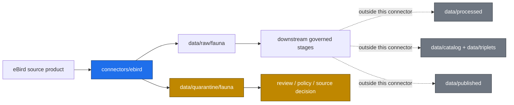

<!-- [KFM_META_BLOCK_V2]
doc_id: kfm://doc/connectors-ebird-readme
title: connectors/ebird/ — eBird Connector Lane
type: readme
version: v0.1
status: draft
owners: OWNER_TBD — Source steward · Connector steward · Fauna steward · Data steward · Docs steward
created: 2026-06-16
updated: 2026-06-16
policy_label: restricted
related:
  - ../README.md
  - ../../docs/sources/catalog/ebird/README.md
  - ../../docs/sources/catalog/ebird/ebird-api.md
  - ../../docs/sources/catalog/ebird/ebird-ebd.md
  - ../../docs/sources/catalog/ebird/ebird-sed.md
  - ../../docs/domains/fauna/README.md
  - ../../data/registry/sources/fauna/
  - ../../data/raw/fauna/
  - ../../data/quarantine/fauna/
  - ../../data/receipts/fauna/
  - ../../data/proofs/fauna/
  - ../../policy/sensitivity/
  - ../../release/
tags: [kfm, connectors, ebird, fauna, birds, biodiversity, source-admission, raw, quarantine, governance]
notes:
  - "This README replaces the greenfield stub with a governed connector-lane contract."
  - "eBird source catalog docs mark rights and public-release posture as restricted / deny-by-default where terms and sensitivity require review."
  - "Connector output may enter data/raw/fauna/ or data/quarantine/fauna/ only."
  - "Specific modules, endpoints, credentials, rate limits, source descriptors, tests, fixtures, and CI enforcement remain NEEDS VERIFICATION."
[/KFM_META_BLOCK_V2] -->

<a id="top"></a>

# eBird Connector

> Source-specific intake and admission lane for eBird observation products used by the KFM Fauna lane.

<p>
  
  
  
  
  
</p>

`connectors/ebird/`

## Quick jumps

[Scope](#scope) · [Repo fit](#repo-fit) · [Authority boundary](#authority-boundary) · [Inputs](#inputs) · [Exclusions](#exclusions) · [Admission posture](#admission-posture) · [Validation](#validation) · [Definition of done](#definition-of-done)

---

## Scope

`connectors/ebird/` is the connector lane for eBird source intake and admission helpers.

It may contain connector-local documentation and source-admission code for eBird API, EBD, SED, or related eBird product-family intake. It must not become avian truth, fauna truth, source-family authority, policy authority, schema authority, catalog/triplet authority, proof authority, release authority, pipeline authority, or publication authority.

> [!IMPORTANT]
> **Status:** draft / `NEEDS VERIFICATION`  
> **Owner:** `OWNER_TBD`  
> **Path:** `connectors/ebird/`  
> **Truth posture:** README path and adjacent source catalog page are CONFIRMED. Connector implementation, source activation, credentials, rate limits, tests, fixtures, and CI wiring remain `NEEDS VERIFICATION`.

## Repo fit

```text
connectors/
└── ebird/
    └── README.md
```

Related responsibility roots:

```text
connectors/                         # source-specific fetch and admission code
docs/sources/catalog/ebird/          # eBird source-family and product documentation
docs/domains/fauna/                  # fauna domain doctrine and sensitivity posture
data/registry/sources/fauna/         # source descriptors and activation state
data/raw/fauna/                      # raw staged source outputs
data/quarantine/fauna/               # held material requiring review
data/receipts/fauna/                 # process and validation receipts
data/proofs/fauna/                   # EvidenceBundles and proof packs
policy/sensitivity/                  # sensitivity and release rules
release/                             # release decisions and rollback/correction state
```

## Lifecycle sketch



## Authority boundary

```text
OUTPUT LIMIT:
  data/raw/fauna/
  data/quarantine/fauna/

NOT HERE:
  source-family truth
  fauna doctrine
  sensitive occurrence publication decisions
  processed data
  catalog records
  triplet records
  receipts/proofs as authority
  release decisions
  published artifacts
  policy rules
  schemas/contracts
  source registry rows
  generated reports
```

## Inputs

| Accepted item | Required posture |
|---|---|
| Source adapter | Preserve source identity, product family, access mode, and review posture. |
| Admission helper | Prepare raw/quarantine admission output only. |
| Source-role helper | Preserve observed-source role, time, observer/source metadata, and limitation fields. |
| Sensitivity routing helper | Mark records needing review; do not publish or generalize by itself. |
| Connector docs | Do not claim source admission, validation, or release state unless verified. |
| Test references | Point to owning test or fixture roots; avoid treating fixtures as source authority. |

## Exclusions

| Do not store here | Correct home |
|---|---|
| eBird source-family authority | `docs/sources/catalog/ebird/` and source registry homes |
| Source descriptors or registry rows | `data/registry/sources/fauna/` |
| Fauna doctrine or sensitivity rules | `docs/domains/fauna/`, `policy/sensitivity/` |
| Processed occurrence, range, or monitoring records | `data/processed/` |
| Catalog or triplet records | `data/catalog/`, `data/triplets/` |
| Receipts and proof packs as authority | `data/receipts/`, `data/proofs/` |
| Release decisions or rollback/correction records | `release/` |
| Published artifacts or public layers | `data/published/` after governed release |
| Policy rules | `policy/` |
| Schemas or contracts | `schemas/`, `contracts/` |
| Generated reports | `artifacts/` |

## Admission posture

eBird intake should preserve:

- source identity and product family;
- access mode and rights posture;
- retrieval time and source time where available;
- observation or checklist time where available;
- content digest;
- source role and limitation notes;
- taxonomy identifiers or taxonomic crosswalk inputs when available;
- review-needed flags;
- quarantine reason when review is required.

Connector output should route through governed lifecycle stages and leave confirmation, transformation, public generalization, publication, correction, and rollback to their owning roots.

> [!CAUTION]
> Fauna sensitive occurrence release fails closed. Connector code must not emit public-ready exact occurrence outputs or bypass downstream review, policy, redaction, or release controls.

## Placement and activation status

| Claim | Status | Notes |
|---|---|---|
| `connectors/ebird/README.md` exists after this update | `CONFIRMED` | Verified by direct repo update/fetch. |
| eBird source-family docs exist under `docs/sources/catalog/ebird/` | `CONFIRMED` | Family README was inspected. |
| `connectors/ebird/` is active implementation | `NEEDS VERIFICATION` | Stub existed; implementation not inventoried. |
| SourceDescriptor activation exists | `NEEDS VERIFICATION` | Must be checked in `data/registry/sources/fauna/`. |
| Credentials, rate limits, and endpoint behavior are implemented | `UNKNOWN` | Not verified from code/tests in this update. |
| CI invokes connector tests | `UNKNOWN` | Workflow evidence not inspected for this update. |

## Validation

Before relying on this connector, verify:

- source descriptors exist and are active;
- product-family selection is documented;
- access, rights, cadence, and rate-limit assumptions are configurable;
- tests use no-network fixtures where practical;
- output paths are limited to raw/quarantine admission lanes;
- sensitivity routing is fail-closed;
- downstream receipts, proofs, catalog/triplet records, and release records are produced only outside this connector;
- any public product is released only through governed publication controls.

## Definition of done

- [ ] Owners are confirmed and `OWNER_TBD` is replaced.
- [ ] Actual connector contents are inventoried.
- [ ] SourceDescriptor IDs and source-family activation are verified.
- [ ] Product coverage, credentials, cadence, and rate limits are documented.
- [ ] Outputs are verified to enter only raw or quarantine admission lanes.
- [ ] No source-family, domain, processed, catalog, triplet, published, release, schema, policy, proof, receipt, registry, fixture, or report authority lives here.
- [ ] Tests, fixtures, and CI behavior are verified or marked `NEEDS VERIFICATION`.

## Status summary

`connectors/ebird/` is for eBird source-admission code only. It is not source-family truth, fauna truth, policy authority, schema authority, catalog/triplet authority, proof closure, release authority, publication authority, or pipeline authority.

<p align="right"><a href="#top">Back to top</a></p>
