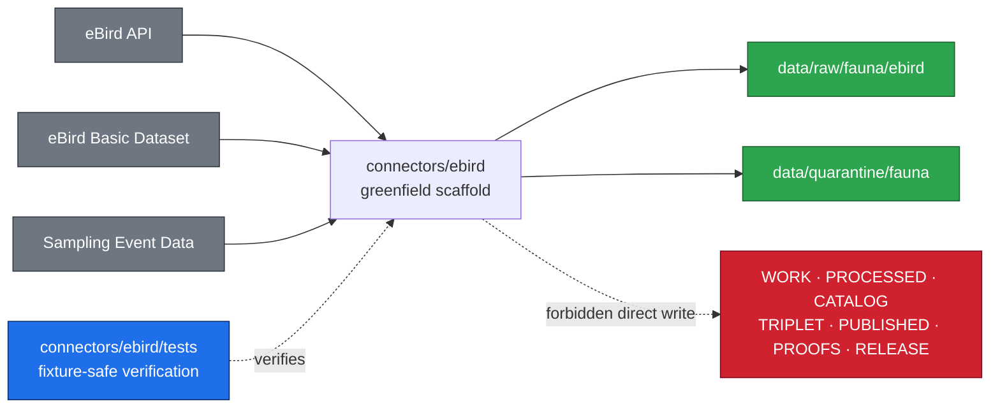

<!-- [KFM_META_BLOCK_V2]
doc_id: kfm://doc/connectors-ebird-tests-readme
title: connectors/ebird/tests/ — eBird Connector Test Lane
type: readme
version: v0.1
status: draft
owners: OWNER_TBD — Connector steward · Test steward · Source steward · Fauna steward · Sensitivity reviewer · Rights reviewer · Validation steward · Docs steward
created: 2026-07-10
updated: 2026-07-10
policy_label: public-doctrine; test-fixtures-only; no-live-network-by-default; restricted-source; fail-closed; no-publication
related:
  - ../README.md
  - ../src/ebird/README.md
  - ../src/ebird/descriptor.yaml
  - ../pyproject.toml
  - ../../../docs/sources/catalog/ebird/README.md
  - ../../../docs/sources/catalog/ebird/ebird-api.md
  - ../../../docs/sources/catalog/ebird/ebird-basic-dataset.md
  - ../../../docs/sources/catalog/ebird/sampling-event-data.md
  - ../../../docs/adr/ADR-0012-connector-outputs-to-data-raw-or-data-quarantine-only.md
  - ../../../data/registry/fauna/sources/ebird.yaml
  - ../../../data/raw/fauna/ebird/README.md
  - ../../../policy/domains/fauna/rare_species_redaction.rego
tags: [kfm, connectors, ebird, tests, fixtures, fauna, biodiversity, no-network, rights, sensitivity, observer-privacy, raw, quarantine, governance]
notes:
  - "This README replaces the two-line greenfield test stub with a governed eBird connector test-lane contract."
  - "GitHub API inspection confirms the package metadata, fetcher, admission gate, connector-local descriptor, and target test file remain greenfield placeholders."
  - "Connector-local sensitivity_floor=public conflicts with the registry placeholder and restricted / deny-by-default source documentation."
  - "The rare-species policy file is a proposed greenfield stub whose current default deny value is false; it does not prove fail-closed enforcement."
  - "Actual test modules, fixture inventory, connector-specific runner configuration, CI wiring, and passing status remain NEEDS VERIFICATION."
[/KFM_META_BLOCK_V2] -->

<a id="top"></a>

# eBird Connector Tests

> Test-lane contract for eBird source admission across API, Basic Dataset, and Sampling Event Data products—offline by default, fixture-safe, fail-closed, and unable to publish.

<p>
  
  
  
  
  
  
</p>

> [!IMPORTANT]
> **Status:** `experimental` test README · **Owner:** `OWNER_TBD`  
> **Path:** `connectors/ebird/tests/README.md` — `CONFIRMED`  
> **Truth posture:** `CONFIRMED` greenfield files and doctrine surfaces · `PROPOSED` test contract · `NEEDS VERIFICATION` test inventory and execution  
> **Boundary:** connector-admission tests only; no live-network default, secret credentials, source activation, policy authority, or publication path.

**Quick jumps:** [Scope](#scope) · [Repo fit](#repo-fit) · [Accepted inputs](#accepted-inputs) · [Exclusions](#exclusions) · [Evidence ledger](#evidence-ledger) · [Safety conflicts](#safety-conflicts) · [Test matrix](#test-matrix) · [Fixture policy](#fixture-policy) · [Validation](#validation) · [Rollback](#rollback) · [Verification backlog](#verification-backlog)

---

## Scope

`connectors/ebird/tests/` is the connector-local test lane for eBird source-admission behavior.

Tests here may verify descriptor gating, import safety, product-family separation, parser behavior, source-role preservation, rights and sensitivity routing, observer privacy, fixture safety, deterministic integrity metadata, and RAW/QUARANTINE-only handoff.

Tests here must not claim that:

- the connector is active or production-ready;
- a live eBird surface is approved for unattended access;
- EBD or SED material is cleared for redistribution;
- exact observation or checklist locations are public-safe;
- source records are specimen-backed evidence;
- connector success authorizes processing, catalog closure, release, or publication; or
- a passing snapshot, generated summary, map layer, or index is sovereign truth.

The inspected package remains greenfield. This README defines what future tests must prove; it does not claim those tests already exist or pass.

[Back to top ↑](#top)

---

## Repo fit

| Surface | Role | Current evidence |
|---|---|---:|
| `connectors/ebird/tests/` | Connector-local test lane. | **CONFIRMED path; prior README was a two-line stub** |
| [`../README.md`](../README.md) | Parent eBird connector governance lane. | **CONFIRMED** |
| [`../src/ebird/README.md`](../src/ebird/README.md) | Package-level import, I/O, and authority boundary. | **CONFIRMED** |
| [`../pyproject.toml`](../pyproject.toml) | Package metadata. | **CONFIRMED `0.0.0` greenfield placeholder** |
| [`../../../docs/sources/catalog/ebird/README.md`](../../../docs/sources/catalog/ebird/README.md) | Family source profile covering API, EBD, and SED. | **CONFIRMED draft documentation** |
| [`../../../data/registry/fauna/sources/ebird.yaml`](../../../data/registry/fauna/sources/ebird.yaml) | Fauna source-descriptor candidate. | **CONFIRMED placeholder; authority fields unresolved** |
| [`../../../data/raw/fauna/ebird/README.md`](../../../data/raw/fauna/ebird/README.md) | eBird Fauna RAW source-family lane. | **CONFIRMED documentation; payload inventory UNKNOWN** |
| [`../../../policy/domains/fauna/rare_species_redaction.rego`](../../../policy/domains/fauna/rare_species_redaction.rego) | Candidate rare-species policy surface. | **CONFIRMED greenfield stub; enforcement CONFLICTED** |
| [`../../../docs/adr/ADR-0012-connector-outputs-to-data-raw-or-data-quarantine-only.md`](../../../docs/adr/ADR-0012-connector-outputs-to-data-raw-or-data-quarantine-only.md) | Proposed numbered connector-output boundary. | **CONFIRMED draft ADR; underlying directory doctrine controls** |

### Inspected connector surface

The GitHub API confirmed these files; this is an inspected surface, not proof that no other children exist:

```text
connectors/ebird/
├── README.md
├── pyproject.toml                  # version 0.0.0 placeholder
├── src/
│   └── ebird/
│       ├── README.md
│       ├── __init__.py             # empty
│       ├── admit.py                # greenfield placeholder
│       ├── descriptor.yaml         # greenfield placeholder; conflicts noted below
│       └── fetch.py                # greenfield placeholder
└── tests/
    └── README.md                   # this test-lane contract
```

### Quickstart status

No connector-specific test command is currently supportable from inspected evidence. The package metadata declares no test dependencies or runner configuration, GitHub API search found no test-lane artifact beyond this README, and the root `Makefile` test target does not name the eBird connector.

`NEEDS VERIFICATION`: add a runnable command only after test modules, dependency configuration, markers, fixture location, and CI behavior are confirmed.

[Back to top ↑](#top)

---

## Accepted inputs

Accepted test-lane content:

- deterministic parser and admission tests for implemented connector interfaces;
- tests proving package imports perform no network calls, filesystem writes, credential reads, or source activation;
- synthetic or explicitly approved fixtures that preserve product identity (`API`, `EBD`, or `SED`);
- SourceDescriptor, source-role, rights, sensitivity, and observer-privacy gate tests;
- EBD/SED pair-coherence cases using synthetic checklist keys;
- malformed, partial, stale, redacted, ambiguous, and unsupported input cases;
- tests proving outputs land only in RAW or QUARANTINE handoff envelopes; and
- regression tests tied to a verified defect, drift entry, contract, or policy decision.

## Exclusions

Do not place these in connector-local tests:

- live API credentials, account material, authorization headers, cookies, or captured secrets;
- network-dependent tests in the default suite;
- unmanaged real observations, exact sensitive-species locations, observer identifiers, trip comments, or private locality data;
- full EBD or SED exports, production payload dumps, caches, or logs;
- production source descriptors or connector-local copies treated as registry authority;
- policy or schema implementations treated as test-folder authority;
- fixtures presented as released or canonical evidence;
- tests that write directly to WORK, PROCESSED, CATALOG, TRIPLET, PUBLISHED, proof, receipt, or release stores; or
- generated prose, maps, snapshots, graph projections, or indexes treated as authoritative fauna claims.

[Back to top ↑](#top)

---

## Evidence ledger

| Source | Status | Supports | Limits |
|---|---:|---|---|
| `connectors/ebird/tests/README.md` | **CONFIRMED** | Target file existed as a two-line greenfield stub before this update. | Does not prove test modules or fixtures exist. |
| `connectors/ebird/README.md` | **CONFIRMED** | Connector is source-admission only and may hand off to RAW or QUARANTINE. | Explicitly leaves implementation, tests, fixtures, and CI unverified. |
| `connectors/ebird/src/ebird/README.md` | **CONFIRMED** | Package imports must be side-effect-free and exact occurrence release fails closed. | Does not prove Python behavior; modules remain placeholders. |
| `pyproject.toml`, `admit.py`, `fetch.py`, `__init__.py` | **CONFIRMED** | Package is a `0.0.0` greenfield scaffold with empty or placeholder implementation files. | No executable connector or test contract is proven. |
| `docs/sources/catalog/ebird/README.md` and product pages | **CONFIRMED draft docs** | Distinguish API, EBD, and SED; frame eBird as observation/coverage evidence with restricted and sensitive handling. | Product pages contain proposed and external claims; they do not prove activation or implementation. |
| `data/registry/fauna/sources/ebird.yaml` | **CONFIRMED placeholder** | A candidate source-descriptor path exists. | Role, authority, rights, sensitivity, cadence, access, and citation remain `TBD`. |
| `connectors/ebird/src/ebird/descriptor.yaml` | **CONFIRMED placeholder** | A connector-local descriptor-shaped file exists. | It is not confirmed as authority and conflicts with safer source documentation. |
| `policy/domains/fauna/rare_species_redaction.rego` | **CONFIRMED greenfield stub** | Candidate package and rule shape exist. | `default deny := false`; no real redaction rules or fail-closed enforcement are proven. |
| `.github/CODEOWNERS` | **CONFIRMED placeholder** | Wildcard ownership points to `@kfm/maintainers`. | No connector-, eBird-, fauna-, or test-specific owner is assigned. |
| Actual tests, fixtures, CI runs, and logs | **NEEDS VERIFICATION** | This README defines the intended review boundary. | Passing status, coverage, and automated enforcement remain unknown. |

---

## Safety conflicts

### Descriptor sensitivity conflict

The inspected sources disagree:

| Source | Current value or posture |
|---|---|
| `connectors/ebird/src/ebird/descriptor.yaml` | `sensitivity_floor: public` |
| `data/registry/fauna/sources/ebird.yaml` | `sensitivity_floor: TBD`; role and rights are also `TBD` |
| eBird family and connector READMEs | restricted handling and public release denied by default where rights or sensitivity remain unresolved |

This is `CONFLICTED`. The connector-local `public` value must not activate a source, weaken fixture handling, or authorize exact-coordinate release.

### Rare-species policy conflict

`policy/domains/fauna/rare_species_redaction.rego` is labeled a proposed greenfield stub and currently declares `default deny := false`. That is not evidence of the deny-by-default posture described in eBird source and connector documentation.

> [!CAUTION]
> Until authoritative descriptor and policy decisions resolve both conflicts, connector behavior and tests must fail closed: no live activation, no public-ready exact occurrence output, and no inference that a placeholder policy protects sensitive records.

[Back to top ↑](#top)

---

## Boundary diagram

This is the required test contract, not a claim about implemented runtime behavior:



---

## Test matrix

| Test area | Required assertion | Failure posture |
|---|---|---|
| Greenfield activation | Placeholder modules and descriptors cannot be mistaken for an active connector. | Block activation. |
| Import safety | Importing `ebird` performs no network, filesystem, credential, registry, or lifecycle mutation. | Fail test. |
| SourceDescriptor gate | Fetch or admission requires an accepted authoritative descriptor and activation state. | `DENY` or `ABSTAIN`; do not use connector-local placeholder values. |
| Product separation | API, EBD, and SED identities, access modes, grain, and limitation fields remain distinct. | Quarantine or reject ambiguous product input. |
| Source role | Observation/coverage material is not promoted to specimen, legal, regulatory, or release authority; SED effort metadata is not silently treated as an observation. | Fail closed. |
| Rights | Unknown or restricted rights cannot produce redistribution-ready output. | Quarantine, deny, or abstain. |
| Sensitive species | Exact or policy-ineligible coordinates cannot become public-ready output. | Quarantine, generalize only through governed downstream policy, or deny. |
| Observer privacy | SED observer identifiers, group identifiers, comments, precise locations, and timestamps are not exposed through committed fixtures or public-ready output. | Quarantine or deny. |
| EBD/SED coherence | Paired synthetic fixtures preserve declared release identity and checklist-key relationships where the confirmed contract requires pairing. | Quarantine mismatched or incomplete pairs. |
| Provenance and integrity | Source identity, product family, retrieval context, time, and content digest/checksum inputs survive admission as required by confirmed contracts. | Quarantine or error when required lineage is incomplete. |
| Lifecycle boundary | Connector code can hand off only to RAW or QUARANTINE and cannot write to later lifecycle, proof, receipt-authority, or release homes. | Fail test and block merge. |
| Failure handling | Unsupported, malformed, unavailable, unauthorized, rate-limited, or policy-ambiguous states do not leak secrets or silently continue. | Return the confirmed safe outcome; otherwise error. |
| Fixtures | Committed fixtures are synthetic, minimized, redacted/generalized where needed, and reviewable. | Block commit or quarantine the fixture. |

> [!IMPORTANT]
> Fetch success is not admission approval, and admission success is not publication approval. Tests must preserve that separation.

---

## Fixture policy

Fixture data must be safe to commit and sufficient to prove one bounded behavior.

1. Prefer synthetic eBird-shaped records; do not copy live sensitive observations merely for realism.
2. Label every fixture as API, EBD, SED, or an intentionally invalid mixed case.
3. Use synthetic checklist and observation identifiers, observer values, group identifiers, comments, timestamps, and coordinates.
4. Include explicit rights, sensitivity, source-role, precision, and expected-disposition fields when the verified contract supports them.
5. Build EBD/SED pair cases with synthetic matching and mismatching checklist keys.
6. Never commit API keys, account data, authorization material, raw restricted exports, or exact sensitive locations.
7. Record source, license/terms basis, transformation, and approval for any externally derived snippet that a steward permits.
8. Do not refresh snapshots automatically when a material semantic difference appears.
9. Keep the fixture home `NEEDS VERIFICATION`; do not create parallel authority between this folder and a shared `fixtures/` root.

---

## Validation

Before describing this test lane as implemented:

- confirm the authoritative eBird SourceDescriptor home and resolve the connector-local duplicate;
- replace placeholder descriptor values with reviewed source role, rights, sensitivity, cadence, access, and citation decisions;
- replace the rare-species policy stub with reviewed fail-closed rules and tests;
- implement connector code without import-time side effects;
- add deterministic, no-network tests for every applicable row in the matrix;
- prove RAW/QUARANTINE-only output-path enforcement;
- confirm fixture location and safety metadata;
- configure and document the repository-native test command;
- connect real CI evidence before adding CI or coverage badges; and
- preserve product, source, observer, rights, sensitivity, time, geometry, and lineage limits end to end.

Root policy, EvidenceBundle closure, downstream validation, promotion, release, correction, and rollback tests belong with their owning surfaces. Connector-local tests may verify the handoff contract but must not become those authorities.

[Back to top ↑](#top)

---

## Definition of done

- [ ] Owners are confirmed and `OWNER_TBD` is replaced.
- [ ] Actual child test files and fixtures are inventoried.
- [ ] Connector code is no longer a greenfield placeholder.
- [ ] SourceDescriptor authority and activation state are resolved.
- [ ] Descriptor sensitivity and policy-default conflicts are closed with reviewed evidence.
- [ ] API, EBD, and SED product-separation tests exist.
- [ ] No-network and import-side-effect tests exist.
- [ ] Rights, sensitive-species, observer-privacy, source-role, and EBD/SED coherence tests exist where applicable.
- [ ] RAW/QUARANTINE-only output-path denial tests exist.
- [ ] Fixture safety is reviewed and traceable.
- [ ] A verified local command and CI evidence are documented.

---

## Rollback

Rollback is required if this README is used to imply implemented tests, CI success, active source access, approved rights, working sensitive-species enforcement, public release readiness, or connector maturity that current evidence does not support.

Prior file state:

```text
blob SHA: 7bf0afc9fec3f2089de6c1f428b75258824e6022
content: two-line greenfield stub
```

Restore that blob or revert the documentation commit through the repository's normal GitHub change-control path. Do not disable a valid safety control merely to make implementation match this README.

---

## Verification backlog

| Item | Status | Needed evidence |
|---|---:|---|
| Assign connector- and fauna-specific owners. | **NEEDS VERIFICATION** | Accepted CODEOWNERS or stewardship record. |
| Confirm complete test and fixture inventory. | **NEEDS VERIFICATION** | Repository tree and file review. |
| Confirm test runner, dependencies, markers, and command. | **NEEDS VERIFICATION** | Completed `pyproject.toml` and runnable tests. |
| Resolve authoritative SourceDescriptor home. | **CONFLICTED** | Registry decision or accepted ADR; remove or subordinate the duplicate. |
| Resolve `public` versus restricted/TBD sensitivity posture. | **CONFLICTED** | Reviewed source descriptor, rights decision, and sensitivity policy. |
| Replace `default deny := false` rare-species stub. | **CONFLICTED / DENY activation** | Reviewed policy rules plus positive and negative policy tests. |
| Verify current eBird terms, API behavior, cadence, and permitted fixture use. | **NEEDS VERIFICATION** | Current authoritative upstream sources and steward review. |
| Confirm EBD/SED pairing and observer-privacy contract. | **NEEDS VERIFICATION** | Accepted schema/contract and test fixtures. |
| Confirm connector-specific CI wiring and passing status. | **NEEDS VERIFICATION** | Workflow configuration and run evidence. |

---

## Maintainer note

Use this lane to turn the eBird connector's unresolved source, rights, sensitivity, and lifecycle obligations into executable checks. Until those checks exist and pass, the correct claim is **greenfield scaffold**, not active connector.

[Back to top ↑](#top)
