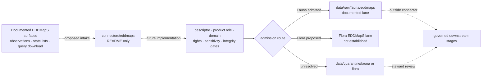

<!-- [KFM_META_BLOCK_V2]
doc_id: kfm://doc/connectors-eddmaps-readme
title: connectors/eddmaps/ — EDDMapS Connector Lane
type: readme
version: v0.2
status: draft
owners: OWNER_TBD — Source steward · Connector steward · Flora steward · Fauna steward · Data steward · Docs steward
created: 2026-06-16
updated: 2026-07-10
policy_label: restricted
related:
  - ../README.md
  - ../../docs/doctrine/directory-rules.md
  - ../../docs/sources/ADMISSION_PROCESS.md
  - ../../docs/adr/ADR-0012-connector-outputs-to-data-raw-or-data-quarantine-only.md
  - ../../docs/adr/ADR-0017-source-descriptor-admission-process.md
  - ../../docs/sources/catalog/eddmaps/README.md
  - ../../docs/sources/catalog/eddmaps/invasive-species-observations.md
  - ../../docs/sources/catalog/eddmaps/state-species-lists.md
  - ../../docs/sources/catalog/eddmaps/advanced-query-download.md
  - ../../docs/sources/RIGHTS_GUIDANCE.md
  - ../../docs/sources/catalog/RIGHTS-AND-SENSITIVITY-MAP.md
  - ../../docs/architecture/cross-domain-invasives.md
  - ../../contracts/domains/flora/invasive_plant_record.md
  - ../../control_plane/source_authority_register.yaml
  - ../../schemas/contracts/v1/source/source_descriptor.schema.json
  - ../../data/registry/sources/README.md
  - ../../data/registry/sources/fauna/README.md
  - ../../data/registry/sources/flora/README.md
  - ../../data/raw/fauna/eddmaps/README.md
  - ../../data/raw/flora/README.md
  - ../../data/quarantine/fauna/README.md
  - ../../data/quarantine/flora/README.md
  - ../../policy/rights/README.md
  - ../../policy/source/descriptor_required_before_ingest.rego
  - ../../release/
tags: [kfm, connectors, eddmaps, flora, fauna, invasive-species, biodiversity, source-admission, raw, quarantine, governance]
notes:
  - "connectors/eddmaps/ is currently a README-only connector lane; no implementation, package configuration, tests, fixtures, or SourceDescriptor were found in the inspected surface."
  - "EDDMapS family and product pages are draft documentation scaffolds, not evidence of source activation or current upstream behavior."
  - "A Fauna RAW EDDMapS lane is documented; no EDDMapS-specific Flora RAW child lane was found."
  - "Rights, access, product roles, connector placement, cross-domain routing, and public-release posture remain unresolved and fail closed."
[/KFM_META_BLOCK_V2] -->

<a id="top"></a>

# EDDMapS Connector

> Documentation-only source-admission boundary for proposed EDDMapS invasive-species material entering KFM Fauna or Flora review.

<p>
  
  
  
  
  
  
</p>

`connectors/eddmaps/`

> [!IMPORTANT]
> **Document lifecycle:** `draft`  
> **Component maturity:** `experimental` — README-only lane, not an active connector  
> **Owners:** `OWNER_TBD`; `.github/CODEOWNERS` supplies only the repository-wide fallback  
> **Evidence boundary:** `CONFIRMED` from `bartytime4life/Kansas-Frontier-Matrix` at base commit `69568a0320beda70844eb3f20005e74b42574e38`; current EDDMapS services, terms, credentials, activation, runtime behavior, and payloads were not verified.  
> **Quick links:** [Scope](#scope-and-audience) · [Current state](#current-repository-state) · [Repo fit](#repository-fit) · [Product boundaries](#product-and-source-role-boundaries) · [Cross-domain routing](#cross-domain-routing) · [Authority gaps](#authority-and-safety-gaps) · [Validation](#validation) · [Rollback](#rollback)

---

## Scope and audience

This directory is the proposed implementation boundary for EDDMapS-specific fetch and admission support. It is intended for connector maintainers, source stewards, Fauna and Flora stewards, rights and sensitivity reviewers, test authors, and documentation reviewers.

Future code here may fetch an accepted EDDMapS product, preserve query and source context, apply admission preconditions, and hand an immutable source capture to an approved RAW lane or a held capture to QUARANTINE.

This directory is not EDDMapS source-family doctrine, invasive-species truth, regulatory authority, Fauna or Flora doctrine, taxonomic authority, SourceDescriptor authority, rights or sensitivity policy, evidence closure, release authority, or a public data path.

## Current repository state

The current connector lane contains only this README. Bounded code search and direct path reads found no connector implementation or runnable interface.

| Surface | Confirmed state | What it does not prove |
|---|---|---|
| `connectors/eddmaps/README.md` | The only confirmed file in the connector lane. | No source access, admission behavior, or connector placement ratification. |
| Package and source tree | No `pyproject.toml` or `src/` README was found. | No package name, language, dependencies, entry point, client, parser, or writer. |
| Tests and fixtures | No connector-local test lane or fixture surface was found. | No test command, passing behavior, coverage, or offline fixture contract. |
| Authentication and configuration | No named environment variable, credential loader, endpoint, timeout, retry, pagination, cadence, or rate-limit configuration was found. | No supported setup or live-use procedure. |
| SourceDescriptor | No EDDMapS descriptor file was found in the inspected domain-first or subtype-first registry candidates; registry topology is itself unresolved. | No accepted source role, role authority, rights, sensitivity, cadence, access, citation, or activation decision. |
| Generic boundary workflow | Pull requests touching `connectors/**` trigger `policy-boundary-guards`. | Its static test is not EDDMapS behavior coverage and does not enforce every RAW/QUARANTINE admission obligation. |

The family and product pages under `docs/sources/catalog/eddmaps/` are draft scaffolds. They define proposed source distinctions and open questions; they do not upgrade this directory into an implemented connector.

## Repository fit

### Inspected directory map

```text
connectors/eddmaps/
└── README.md
```

This directly inspected map is bounded to the evidence commit. It does not prove that an external deployment, untracked credential, source schedule, or runtime integration exists elsewhere.

### Responsibility map

| Surface | Responsibility and current status |
|---|---|
| [`../README.md`](../README.md) | Connector-root authority and lifecycle boundary. |
| [`../../docs/sources/catalog/eddmaps/`](../../docs/sources/catalog/eddmaps/) | Draft family and product documentation; not activation evidence. |
| [`../../data/registry/sources/`](../../data/registry/sources/) | Candidate SourceDescriptor and activation surface; registry topology is unresolved and no EDDMapS descriptor file was found. |
| [`../../data/registry/sources/fauna/README.md`](../../data/registry/sources/fauna/README.md) | Registry guidance recognizes EDDMapS/invasive feeds as mixed-role material requiring private-parcel and rights review. |
| [`../../data/registry/sources/flora/README.md`](../../data/registry/sources/flora/README.md) | Flora registry guidance exists, but no EDDMapS descriptor row or activation decision was found. |
| [`../../control_plane/source_authority_register.yaml`](../../control_plane/source_authority_register.yaml) | Proposed source-authority register; its `entries` list is empty. |
| [`../../schemas/contracts/v1/source/source_descriptor.schema.json`](../../schemas/contracts/v1/source/source_descriptor.schema.json) | Proposed SourceDescriptor machine shape; existence does not create an EDDMapS descriptor. |
| [`../../data/raw/fauna/eddmaps/`](../../data/raw/fauna/eddmaps/) | Confirmed documentation for a Fauna RAW capture lane; payload presence remains unknown. |
| [`../../data/raw/flora/`](../../data/raw/flora/) | Generic Flora RAW root exists; an EDDMapS-specific child lane was not found. |
| [`../../data/quarantine/fauna/`](../../data/quarantine/fauna/) and [`../../data/quarantine/flora/`](../../data/quarantine/flora/) | Domain hold lanes for unresolved material. |
| [`../../docs/architecture/cross-domain-invasives.md`](../../docs/architecture/cross-domain-invasives.md) | Draft cross-domain context; does not resolve connector placement or runtime routing. |
| `../../policy/` | Rights, sensitivity, geoprivacy, role, and release decisions. |
| `../../release/` | Release, correction, and rollback decisions. |

### Placement status

`connectors/` is a confirmed implementation root, but the EDDMapS source catalog marks this named lane as beyond the connector roots enumerated by Directory Rules. The directory exists; its canonical placement remains `CONFLICTED / NEEDS DECISION` until an accepted ADR, Directory Rules update, or migration record resolves the drift.

Do not treat directory existence or this README as connector activation or placement ratification.

## Product and source-role boundaries

The draft source catalog separates three EDDMapS surfaces. A future connector must preserve those distinctions and must not infer current upstream behavior from the documentation scaffolds.

| Documented surface | Required connector posture |
|---|---|
| Invasive-species observations | Preserve the underlying observation role and EDDMapS aggregator context; upstream verifier status is evidence metadata, not KFM validation or release approval. |
| State species lists | Keep regulatory and administrative list roles separate from occurrence evidence; a taxon on a list is not proof of presence at a place. |
| Advanced Query download | Preserve the exact query, retrieval context, result boundary, and digest; a query-scoped extract is not a complete distribution, range, or absence claim. |

Anti-collapse rules:

- an invasive-species observation is not regulatory designation, taxonomic authority, eradication status, or release authority;
- an aggregated record must preserve EDDMapS identity and any exposed upstream source context;
- upstream verification does not satisfy KFM descriptor, validation, policy, EvidenceBundle, review, or release gates;
- a state list is regulatory or administrative context, not an observed event;
- absence from a query result is not proof of biological absence;
- generated summaries, maps, tiles, indexes, or model outputs are interpretive surfaces, not sovereign truth.

## Cross-domain routing

EDDMapS material can be relevant to Fauna and Flora, but the current repository does not prove one operational cross-domain route.

| Route | Current evidence | Required posture |
|---|---|---|
| Fauna invasive-species capture | `data/raw/fauna/eddmaps/README.md` exists. | Admission still requires an accepted descriptor, rights and sensitivity decisions, and implemented connector behavior. |
| Flora invasive-plant capture | Flora doctrine references `InvasivePlantRecord` and EDDMapS-class observations; no `data/raw/flora/eddmaps/README.md` was found. | Treat as `PROPOSED`; do not create or write the child lane without the required placement and admission decisions. |
| Ambiguous or mixed-taxon material | No automatic split behavior is implemented. | Quarantine or abstain until product role, taxon, domain owner, rights, and sensitivity are resolved. |
| State-list material | Source roles may be regulatory or administrative rather than observed. | Use separate descriptor and role-authority decisions; do not merge with observation captures by convenience. |

Do not dual-write one source run into Fauna and Flora to avoid making a routing decision. Preserve one admitted source capture and let governed downstream transforms create domain-specific candidates with explicit lineage.

## Accepted inputs and outputs

Because no connector is implemented, these are future boundary requirements, not current interfaces.

| May belong here | Required posture |
|---|---|
| Approved download or query adapter | Descriptor-gated, explicitly configured, and side-effect-free on import. |
| Observation parser | Preserve source record identity, aggregator/upstream context, time, geometry precision, verification flags, and limitations. |
| State-list parser | Preserve list identity, source role, role authority, jurisdiction, effective time, and citation. |
| Admission helper | Return a bounded admit, quarantine, deny, abstain, no-change, rate-limit, or error outcome. |
| Provenance and integrity helper | Preserve source surface, exact query fingerprint, retrieval context, and content digest. |
| Sensitivity and privacy routing helper | Preserve restriction/private flags and request governed review; never publish or generalize autonomously. |
| Connector-local tests | Offline and deterministic by default, using synthetic or explicitly approved fixtures. |

No output path is operational today. A future implementation may hand payloads only to an approved RAW or QUARANTINE lane selected by the admission decision. Receipts must be emitted through a documented governed receipt writer; this directory does not own receipt meaning or receipt storage.

## Exclusions

| Do not store or decide here | Owning surface |
|---|---|
| EDDMapS family or product doctrine | `docs/sources/catalog/eddmaps/` |
| Authoritative SourceDescriptors or activation decisions | Governed `data/registry/` and admission workflows after registry topology is resolved |
| Fauna, Flora, invasive-object, or taxonomy doctrine | `docs/domains/`, `contracts/`, and governing taxonomy surfaces |
| Rights, consent, privacy, sensitivity, redaction, or release rules | `policy/` |
| RAW or quarantined payloads | Approved `data/raw/` or `data/quarantine/` lanes |
| Normalized or processed domain records | `data/work/` or `data/processed/` through pipelines |
| Catalog records or triplets | `data/catalog/` or `data/triplets/` |
| EvidenceBundles or proof packs | `data/proofs/` |
| Release, correction, or rollback decisions | `release/` |
| Published layers, API payloads, UI data, or generated reports | Governed downstream and published surfaces after release |
| Regulatory claims or emergency/eradication guidance | Governing public authority and reviewed downstream claim surfaces |

## Admission lifecycle

The diagram is the required boundary for future implementation, not current runtime behavior.



The lifecycle invariant is `RAW -> WORK / QUARANTINE -> PROCESSED -> CATALOG / TRIPLET -> PUBLISHED`. Promotion is a governed state transition, not a file move, connector action, Git commit, pull request, merge, or release label.

> [!CAUTION]
> Invasive-species data is not automatically public-safe. Exact locations may expose private parcels, sensitive hosts or taxa, culturally sensitive knowledge, or early-detection response activity. Unclear rights, restriction flags, source role, domain route, or sensitivity must quarantine, deny, or abstain.

## Authority and safety gaps

The following gaps block live activation and public-ready output:

| Gap | Confirmed evidence | Required disposition |
|---|---|---|
| Connector implementation | This directory contains only a README. | Implement and review explicit interfaces before documenting setup or use. |
| Source identity and activation | No EDDMapS SourceDescriptor file was found, and the source-authority register has `entries: []`. | Assign product-specific source roles, role authorities, rights, sensitivity, cadence, access, citation, and activation state. |
| Upstream access and rights | Product pages mark endpoints, formats, authentication, cadence, license, attribution, redistribution, and consent as `UNKNOWN` or `NEEDS VERIFICATION`. | Verify current authoritative upstream terms before intake or public derivation. |
| Rights policy | [`policy/rights/README.md`](../../policy/rights/README.md) is a greenfield bundle stub, and no EDDMapS-specific rights or redistribution policy was found. | Keep intake and public derivation blocked until a reviewed rights decision exists. |
| Placement | Source docs mark `connectors/eddmaps/` as an open connector-root decision. | Resolve by accepted ADR, Directory Rules update, or migration record. |
| Cross-domain routing | Fauna RAW child is documented; Flora EDDMapS child is absent. | Resolve ownership and routing without unreviewed dual writes. |
| Receipt placement | Connector-root and draft admission documents describe different run-local or central receipt handoffs, and no EDDMapS writer exists. | Keep payloads in the admitted RAW/QUARANTINE lane and feed any receipt index only through an accepted governed writer. |
| Descriptor gate | [`descriptor_required_before_ingest.rego`](../../policy/source/descriptor_required_before_ingest.rego) defaults to `deny := false`; [`validate_connector_gate.py`](../../tools/validators/validate_connector_gate.py) raises `NotImplementedError`. | Implement and test fail-closed source admission; do not infer enforcement from doctrine. |
| Geoprivacy and sensitive-species policy | [`rare_species_redaction.rego`](../../policy/domains/fauna/rare_species_redaction.rego) defaults to `deny := false`; [Fauna geoprivacy](../../policy/sensitivity/fauna/geoprivacy.rego) and [Flora rare-plant geoprivacy](../../policy/sensitivity/flora/rare_plant_geoprivacy.rego) are explicitly rule-free scaffolds. | Treat exact geometry, private-parcel detail, contributor identity, and sensitive or early-detection records as restricted until substantive policy and tests exist. |
| EDDMapS-specific tests and CI | No connector-local tests or workflow were found; only generic boundary CI applies. | Add offline product-role, rights, sensitivity, routing, and output-boundary tests. |

## Quickstart and usage

There is no supported command, package installation, named environment variable, authentication procedure, or runtime response contract for this connector.

Do not provide credentials, schedule EDDMapS requests, or create RAW payloads based on this README. Add a quickstart only after placement, SourceDescriptor, current upstream access and terms, implementation, safe fixtures, offline tests, and admission policy are accepted and verified.

## Validation

### Documentation checks

- [ ] Preserve the KFM meta block, one H1, and stable section anchors.
- [ ] Keep repository-relative links valid.
- [ ] Keep implementation claims tied to inspected code, tests, configuration, or runtime evidence.
- [ ] Keep observation, aggregator, regulatory, administrative, domain, rights, sensitivity, and lifecycle distinctions visible.
- [ ] Do not add credentials, contributor identities, private-parcel details, exact sensitive locations, or restricted source material.

### Implementation readiness gates

- [ ] Assign accountable connector, source, Fauna, Flora, rights, and sensitivity owners.
- [ ] Resolve connector placement and cross-domain routing.
- [ ] Create accepted product-specific SourceDescriptors and activation decisions.
- [ ] Verify current access surfaces, authentication, formats, query limits, cadence, rights, attribution, redistribution, and consent terms.
- [ ] Implement side-effect-free adapters and parsers with explicit configuration and bounded failure outcomes.
- [ ] Prove observation, aggregator, regulatory, administrative, and query-scope separation.
- [ ] Prove private-parcel, sensitive-location, early-detection, and cross-domain routing fail closed.
- [ ] Prove payload writes are restricted to the admitted RAW or QUARANTINE lane.
- [ ] Add safe fixtures, deterministic no-network tests, a supported local command, and connector-specific CI evidence.

## Evidence basis

| Evidence at `69568a0320beda70844eb3f20005e74b42574e38` | Status | Supports | Does not prove |
|---|---|---|---|
| `connectors/eddmaps/README.md` and bounded connector-path search | `CONFIRMED` | README-only connector lane. | Implementation, configuration, tests, activation, or runtime behavior. |
| EDDMapS family and three product pages | `CONFIRMED draft docs` | Proposed product separation, mixed source roles, open rights/access questions, and placement drift. | Current upstream facts, SourceDescriptors, connector behavior, or public-use permission. |
| `data/registry/sources/fauna/README.md` | `CONFIRMED guidance` | EDDMapS/invasive feeds can carry observed, aggregate, or regulatory roles and need private-parcel and rights review. | An EDDMapS registry row or activation decision. |
| SourceDescriptor schema and empty source-authority register | `CONFIRMED proposed scaffolds` | A machine shape and register surface exist. | An EDDMapS descriptor, authority assignment, or activation decision. |
| `data/raw/fauna/eddmaps/README.md` | `CONFIRMED documentation` | Fauna RAW lane boundary exists. | Payload presence, implemented writer, validation, or promotion. |
| Flora canonical paths and `InvasivePlantRecord` contract | `CONFIRMED repository docs` | Flora owns invasive-plant object meaning and references EDDMapS-class observations. | An EDDMapS-specific Flora RAW lane or operational cross-domain route. |
| Generic descriptor policy, connector validator, and boundary workflow | `CONFIRMED scaffolds` | Repository-wide source-gate and non-publisher intent. | Fail-closed descriptor enforcement or EDDMapS behavior coverage. |
| Runtime logs, emitted receipts, source payloads, and deployment evidence | `UNKNOWN` | Nothing in this README relies on them. | Operational maturity or release readiness. |

## Rollback

Rollback this documentation change if it obscures the README-only state, weakens product-role or lifecycle boundaries, hides placement or cross-domain uncertainty, or implies activation, test success, rights clearance, or release readiness without evidence.

The prior target blob is `159a20418b58c5d456bfc256563806113160dd42`. Restore it through a transparent revert commit or revert pull request, then re-run documentation validation. Do not weaken a valid safety control to make implementation match documentation.

## Definition of done

- [ ] Owners replace `OWNER_TBD` through an accepted stewardship record.
- [ ] Connector placement and Fauna/Flora routing are resolved.
- [ ] Product-specific SourceDescriptor authority, source role, role authority, rights, sensitivity, access, cadence, citation, and activation are resolved.
- [ ] Observation, state-list, and query-download behavior is implemented without product or authority collapse.
- [ ] Imports are side-effect-free and credentials are read only through an approved runtime boundary.
- [ ] Admission outcomes and single-lane RAW/QUARANTINE writes are enforced and tested.
- [ ] Private-parcel, sensitive-taxon, early-detection, contributor, and redistribution controls fail closed.
- [ ] Offline tests, safe fixtures, and connector-specific CI pass with reviewable evidence.
- [ ] Quickstart, usage, failure, and rollback instructions match verified behavior.
- [ ] No connector path bypasses EvidenceBundle, policy, review, release, correction, or public-interface controls.

## Verification backlog

| Item | Current status | Required evidence |
|---|---|---|
| Connector, source, Fauna, and Flora ownership | `UNKNOWN` | Accepted CODEOWNERS or stewardship record. |
| Connector placement | `CONFLICTED` | Accepted ADR, Directory Rules update, or migration record. |
| EDDMapS SourceDescriptors and activation | `UNKNOWN` | Product-specific registry records and activation decisions. |
| Current upstream access, rights, and consent | `NEEDS VERIFICATION` | Authoritative current source terms and steward review. |
| Fauna/Flora route | `CONFLICTED` | Accepted domain-routing decision and documented lane ownership. |
| Connector implementation and configuration | `CONFIRMED — README only` | Reviewed interfaces, package metadata, and explicit runtime configuration. |
| Tests, fixtures, and connector-specific CI | `CONFIRMED — absent in inspected lane` | Runnable offline suite and workflow/run evidence. |

## Related documentation

- [Connector root contract](../README.md)
- [Directory Rules](../../docs/doctrine/directory-rules.md)
- [Source Admission Process](../../docs/sources/ADMISSION_PROCESS.md)
- [Draft RAW/QUARANTINE connector-output ADR](../../docs/adr/ADR-0012-connector-outputs-to-data-raw-or-data-quarantine-only.md)
- [Proposed SourceDescriptor admission ADR](../../docs/adr/ADR-0017-source-descriptor-admission-process.md)
- [EDDMapS source-family profile](../../docs/sources/catalog/eddmaps/README.md)
- [Invasive-species observations product page](../../docs/sources/catalog/eddmaps/invasive-species-observations.md)
- [State species lists product page](../../docs/sources/catalog/eddmaps/state-species-lists.md)
- [Advanced Query download product page](../../docs/sources/catalog/eddmaps/advanced-query-download.md)
- [Source rights guidance](../../docs/sources/RIGHTS_GUIDANCE.md)
- [Source catalog rights and sensitivity map](../../docs/sources/catalog/RIGHTS-AND-SENSITIVITY-MAP.md)
- [Cross-domain invasives architecture](../../docs/architecture/cross-domain-invasives.md)
- [Flora invasive-plant record contract](../../contracts/domains/flora/invasive_plant_record.md)
- [EDDMapS Fauna RAW lane](../../data/raw/fauna/eddmaps/README.md)
- [Fauna source-registry guidance](../../data/registry/sources/fauna/README.md)

## Status summary

`connectors/eddmaps/` is a README-only, proposed source-admission lane. It has no supported runtime, SourceDescriptor, test command, source activation, or public output path. Until placement, product roles, cross-domain routing, current rights and access, implementation, and fail-closed policy are resolved, the safe outcome is deny, abstain, or quarantine—not activation or publication.

<p align="right"><a href="#top">Back to top</a></p>
