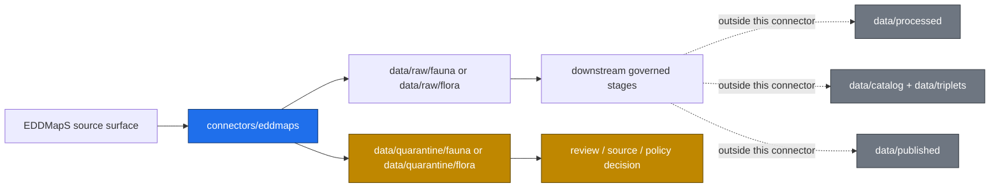

<!-- [KFM_META_BLOCK_V2]
doc_id: kfm://doc/connectors-eddmaps-readme
title: connectors/eddmaps/ — EDDMapS Connector Lane
type: readme
version: v0.1
status: draft
owners: OWNER_TBD — Source steward · Connector steward · Flora steward · Fauna steward · Data steward · Docs steward
created: 2026-06-16
updated: 2026-06-16
policy_label: restricted
related:
  - ../README.md
  - ../../docs/sources/catalog/eddmaps/README.md
  - ../../docs/sources/catalog/eddmaps/invasive-species-observations.md
  - ../../docs/sources/catalog/eddmaps/state-species-lists.md
  - ../../docs/sources/catalog/eddmaps/advanced-query-download.md
  - ../../docs/domains/fauna/README.md
  - ../../data/registry/sources/
  - ../../data/raw/fauna/
  - ../../data/raw/flora/
  - ../../data/quarantine/fauna/
  - ../../data/quarantine/flora/
  - ../../data/receipts/
  - ../../data/proofs/
  - ../../policy/sensitivity/
  - ../../release/
tags: [kfm, connectors, eddmaps, flora, fauna, invasive-species, biodiversity, source-admission, raw, quarantine, governance]
notes:
  - "Connector lane for EDDMapS source intake and admission helpers."
  - "The source catalog marks EDDMapS placement as PROPOSED beyond the connector roots listed in directory rules; connector lane ratification remains NEEDS VERIFICATION."
  - "Rights posture and public release remain fail-closed until verified."
  - "Connector output may enter raw or quarantine admission lanes only."
[/KFM_META_BLOCK_V2] -->

<a id="top"></a>

# EDDMapS Connector

> Source-specific intake and admission lane for EDDMapS invasive-species and pest-observation source material.

<p>
  
  
  
  
  
</p>

`connectors/eddmaps/`

## Quick jumps

[Scope](#scope) · [Repo fit](#repo-fit) · [Lifecycle sketch](#lifecycle-sketch) · [Authority boundary](#authority-boundary) · [Inputs](#inputs) · [Exclusions](#exclusions) · [Admission posture](#admission-posture) · [Placement status](#placement-status) · [Validation](#validation) · [Definition of done](#definition-of-done)

---

## Scope

`connectors/eddmaps/` is the connector lane for EDDMapS source intake and admission helpers.

It may contain connector-local documentation and source-admission code for EDDMapS invasive-species, pest, and related occurrence source material. It must not become invasive-species truth, flora truth, fauna truth, source-family authority, policy authority, schema authority, catalog/triplet authority, proof authority, release authority, pipeline authority, or publication authority.

> [!IMPORTANT]
> **Status:** draft / `NEEDS VERIFICATION`  
> **Owner:** `OWNER_TBD`  
> **Path:** `connectors/eddmaps/`  
> **Truth posture:** README path is confirmed by this committed file; source-catalog documentation exists; source activation, endpoint behavior, rights terms, tests, fixtures, and CI wiring remain `NEEDS VERIFICATION`.

## Repo fit

```text
connectors/
└── eddmaps/
    └── README.md
```

Related responsibility roots:

```text
connectors/                         # source-specific fetch and admission code
docs/sources/catalog/eddmaps/        # EDDMapS source-family documentation
docs/domains/fauna/                  # fauna domain and sensitive occurrence posture
docs/domains/flora/                  # flora domain lane, where verified in repo
data/registry/sources/               # source descriptors and activation state
data/raw/fauna/                      # raw staged fauna outputs
data/raw/flora/                      # raw staged flora outputs
data/quarantine/fauna/               # held fauna material requiring review
data/quarantine/flora/               # held flora material requiring review
data/receipts/                       # process and validation receipts
data/proofs/                         # EvidenceBundles and proof packs
policy/sensitivity/                  # sensitivity and release rules
release/                             # release decisions and rollback/correction state
```

## Lifecycle sketch



## Authority boundary

```text
OUTPUT LIMIT:
  data/raw/fauna/
  data/raw/flora/
  data/quarantine/fauna/
  data/quarantine/flora/

NOT HERE:
  source-family truth
  flora or fauna doctrine
  sensitive occurrence publication decisions
  processed data
  catalog records
  triplet records
  receipts/proofs as authority
  release decisions
  published artifacts
  policy rules
  schemas/contracts
  source registry rows
  generated reports
```

## Inputs

| Accepted item | Required posture |
|---|---|
| Source adapter | Preserve source identity, source surface, product or query context, and review posture. |
| Admission helper | Prepare raw/quarantine admission output only. |
| Source-role helper | Preserve observation/aggregator role, time, taxon, location precision, and limitation fields. |
| Sensitivity routing helper | Mark records needing review; do not publish or generalize by itself. |
| Connector docs | Do not claim source admission, validation, or release state unless verified. |
| Test references | Point to owning test or fixture roots; avoid treating fixtures as source authority. |

## Exclusions

| Do not store here | Correct home |
|---|---|
| EDDMapS source-family authority | `docs/sources/catalog/eddmaps/` and source registry homes |
| Source descriptors or registry rows | `data/registry/sources/` |
| Flora or fauna doctrine | `docs/domains/flora/`, `docs/domains/fauna/` |
| Sensitivity and release policy | `policy/sensitivity/`, `policy/` |
| Processed occurrence or monitoring records | `data/processed/` |
| Catalog or triplet records | `data/catalog/`, `data/triplets/` |
| Receipts and proof packs as authority | `data/receipts/`, `data/proofs/` |
| Release decisions or rollback/correction records | `release/` |
| Published artifacts or public layers | `data/published/` after governed release |
| Schemas or contracts | `schemas/`, `contracts/` |
| Generated reports | `artifacts/` |

## Admission posture

EDDMapS intake should preserve:

- source identity and source surface;
- query or product-family context;
- retrieval time and source time where available;
- observation time where available;
- content digest;
- source role and limitation notes;
- taxon identifiers or crosswalk inputs when available;
- location precision and review-needed flags;
- rights posture and citation notes;
- quarantine reason when review is required.

EDDMapS may inform Flora and Fauna invasive-species reasoning, but connector output remains admission material. Confirmation, transformation, public generalization, publication, correction, and rollback belong to governed downstream stages.

> [!CAUTION]
> Rights and sensitive-location handling fail closed. Connector code must not emit public-ready exact occurrence outputs or bypass downstream review, policy, redaction, or release controls.

## Placement status

The EDDMapS source-catalog entry identifies `connectors/eddmaps/` as a candidate placement beyond the connector roots listed in Directory Rules. Treat this lane as draft until placement is ratified or a migration note/ADR resolves it.

| Claim | Status | Notes |
|---|---|---|
| `connectors/eddmaps/README.md` exists after this update | `CONFIRMED` | Verified by direct repo update/fetch. |
| EDDMapS source-family docs exist under `docs/sources/catalog/eddmaps/` | `CONFIRMED` | Family README was inspected. |
| `connectors/eddmaps/` is ratified as a connector root | `NEEDS VERIFICATION` | Source-catalog docs mark placement as open. |
| SourceDescriptor activation exists | `NEEDS VERIFICATION` | Must be checked in `data/registry/sources/`. |
| Rights, credentials, rate limits, and endpoint behavior are implemented | `UNKNOWN` | Not verified from code/tests in this update. |
| CI invokes connector tests | `UNKNOWN` | Workflow evidence not inspected for this update. |

## Validation

Before relying on this connector, verify:

- source descriptors exist and are active;
- placement is intentional and documented;
- access method, query surface, cadence, and rights assumptions are configurable;
- tests use no-network fixtures where practical;
- output paths are limited to raw/quarantine admission lanes;
- sensitivity routing is fail-closed;
- downstream receipts, proofs, catalog/triplet records, and release records are produced only outside this connector;
- any public product is released only through governed publication controls.

## Definition of done

- [ ] Owners are confirmed and `OWNER_TBD` is replaced.
- [ ] Actual connector contents are inventoried.
- [ ] SourceDescriptor IDs and source-family activation are verified.
- [ ] Product/query coverage, access method, cadence, and rights posture are documented.
- [ ] Outputs are verified to enter only raw or quarantine admission lanes.
- [ ] No source-family, domain, processed, catalog, triplet, published, release, schema, policy, proof, receipt, registry, fixture, or report authority lives here.
- [ ] Tests, fixtures, and CI behavior are verified or marked `NEEDS VERIFICATION`.

## Status summary

`connectors/eddmaps/` is for EDDMapS source-admission code only. It is not source-family truth, flora truth, fauna truth, policy authority, schema authority, catalog/triplet authority, proof closure, release authority, publication authority, or pipeline authority.

<p align="right"><a href="#top">Back to top</a></p>
