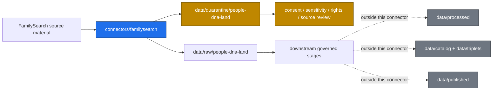

<!-- [KFM_META_BLOCK_V2]
doc_id: kfm://doc/connectors-familysearch-readme
title: connectors/familysearch/ — FamilySearch Connector Lane
type: readme
version: v0.1
status: draft
owners: OWNER_TBD — Source steward · Connector steward · People/DNA/Land steward · Sensitivity reviewer · Data steward · Docs steward
created: 2026-06-18
updated: 2026-06-18
policy_label: public-doctrine
proposed_path: connectors/familysearch/README.md
truth_posture: CONFIRMED path exists / PROPOSED connector-lane contract / UNKNOWN implementation depth
related:
  - ../README.md
  - ../../docs/sources/catalog/familysearch/README.md
  - ../../docs/domains/people-dna-land/README.md
  - ../../docs/domains/people-dna-land/SOURCE_REGISTRY.md
  - ../../data/registry/sources/people-genealogy-dna-land/
  - ../../data/raw/people-dna-land/
  - ../../data/quarantine/people-dna-land/
  - ../../data/receipts/people-dna-land/
  - ../../data/proofs/people-dna-land/
  - ../../policy/genealogy/publication.rego
  - ../../policy/sensitivity/
  - ../../release/
tags: [kfm, connectors, familysearch, genealogy, people-dna-land, source-admission, consent, living-person, sensitivity, raw, quarantine, governance]
notes:
  - "This README replaces the greenfield stub with a governed connector-lane contract."
  - "FamilySearch-derived material is sensitive by default when it can involve living persons, family relations, private accounts, or person-place assertions."
  - "Connector output may enter RAW or QUARANTINE only; publication requires downstream evidence, policy, consent, review, release, and rollback gates."
  - "Specific endpoints, OAuth behavior, rate limits, descriptors, tests, fixtures, credentials, CI enforcement, and source terms remain NEEDS VERIFICATION."
[/KFM_META_BLOCK_V2] -->

<a id="top"></a>

# FamilySearch Connector

> Source-specific intake and admission lane for FamilySearch genealogy material used by the KFM People, Genealogy, DNA, and Land Ownership domain.

<p>
  
  
  
  
  
</p>

`connectors/familysearch/`

## Quick jumps

[Scope](#scope) · [Repo fit](#repo-fit) · [Authority boundary](#authority-boundary) · [Inputs](#inputs) · [Exclusions](#exclusions) · [Admission posture](#admission-posture) · [Consent and privacy](#consent-and-privacy) · [Validation](#validation) · [Definition of done](#definition-of-done) · [Verification backlog](#verification-backlog)

---

## Scope

`connectors/familysearch/` is the connector lane for FamilySearch source intake and admission helpers.

It may contain connector-local documentation, configuration examples, source-admission code, parser helpers, bounded client helpers, and tests for FamilySearch genealogy source material.

It must not become genealogy truth, person truth, DNA truth, land-ownership truth, source-family authority, policy authority, schema authority, catalog/triplet authority, proof authority, release authority, pipeline authority, or publication authority.

> [!IMPORTANT]
> **Status:** draft / `NEEDS VERIFICATION`  
> **Owner:** `OWNER_TBD`  
> **Path:** `connectors/familysearch/`  
> **Truth posture:** README path is CONFIRMED. Connector implementation, source activation, credentials, endpoint coverage, rate limits, descriptors, tests, fixtures, policy enforcement, and CI wiring remain `NEEDS VERIFICATION`.

---

## Repo fit

```text
connectors/
└── familysearch/
    └── README.md
```

Related responsibility roots:

```text
connectors/                                      # source-specific fetch and admission code
docs/sources/catalog/familysearch/               # FamilySearch source-family briefing
docs/domains/people-dna-land/                    # sensitive People/Genealogy/DNA/Land domain doctrine
data/registry/sources/people-genealogy-dna-land/ # source descriptors and activation state
data/raw/people-dna-land/                        # raw staged source outputs, if admitted
data/quarantine/people-dna-land/                 # held material requiring review
data/receipts/people-dna-land/                   # process and validation receipts
data/proofs/people-dna-land/                     # EvidenceBundles and proof packs
policy/genealogy/                                # genealogy-specific publication policy, if present
policy/sensitivity/                              # sensitivity and release rules
release/                                         # release decisions and rollback/correction state
```

Path names involving `people-dna-land` versus `people-genealogy-dna-land` may be affected by domain-segment naming decisions. Treat the related paths above as aligned with current visible docs, but verify against accepted Directory Rules and ADRs before adding new siblings.

---

## Lifecycle sketch



---

## Authority boundary

```text
OUTPUT LIMIT:
  data/raw/people-dna-land/
  data/quarantine/people-dna-land/

NOT HERE:
  person truth
  relationship truth
  DNA truth
  land-title truth
  source descriptor authority
  consent authority
  policy authority
  schema authority
  processed records
  catalog or triplet records
  published records
  release decisions
```

The connector may help retrieve or parse source material. It does not decide whether a person assertion, relationship assertion, family-tree edge, source citation, account-derived record, or person-place claim is true, publishable, consented, rights-cleared, or public-safe.

---

## Inputs

Potential input classes include:

- source descriptor references;
- steward-approved endpoint or export identifiers;
- OAuth or account-mediated access metadata, if approved by policy;
- user-provided or steward-provided source exports;
- source citation fragments;
- person, relationship, event, place, or record references;
- test fixtures that preserve source shape without exposing private material.

All live or account-mediated access is **NEEDS VERIFICATION** and must remain off by default until source terms, consent, revocation behavior, credential handling, and policy gates are reviewed.

---

## Exclusions

Do not place these in `connectors/familysearch/`:

| Excluded material | Correct handling |
|---|---|
| Credentials, OAuth secrets, tokens, cookies, session exports | Never commit. Use approved local or CI secret management only. |
| Large copied source payloads | Store only if rights, size, sensitivity, provenance, and retention posture are approved. |
| Living-person private details | Deny by default or quarantine with strict review. |
| Raw DNA, DNA matches, or DNA-derived hypotheses | Out of connector scope unless an accepted policy explicitly permits a quarantined handoff. |
| Public claims about family relationships | Downstream evidence, review, and release only. |
| SourceDescriptor authority records | `data/registry/sources/...` or accepted registry home. |
| Schemas | `schemas/contracts/v1/...` under the accepted schema-home convention. |
| Publication policy | `policy/` and release review surfaces. |
| Release manifests or rollback records | `release/` and lifecycle/release roots. |

---

## Admission posture

FamilySearch connector output must be conservative.

Expected behavior:

- no live network or account access unless explicitly enabled and reviewed;
- no source fetch without a source descriptor or source activation decision;
- no implicit publication from retrieved records;
- no silent merging of person identities;
- no automatic conclusion that a relationship is true because it appears in a tree;
- no public display of living-person information without consent and review;
- no persistent cache of private account material unless retention is approved;
- unclear rights, consent, or sensitivity routes to quarantine or abstention.

Recommended finite outcomes:

| Situation | Outcome |
|---|---|
| Source descriptor missing | `ABSTAIN` or connector error. |
| Access token missing | `ABSTAIN`; do not ask code to bypass auth. |
| Consent scope unknown | `DENY` or quarantine-safe result. |
| Living-person material detected | `DENY` by default unless explicit policy and consent allow a restricted handoff. |
| Relationship assertion unsupported | Carry as candidate assertion only; do not promote. |
| Source response malformed | `ERROR` with safe metadata. |
| Source terms unclear | `NEEDS_VERIFICATION`; no live activation. |

---

## Consent and privacy

FamilySearch-derived material sits inside KFM's most sensitive People/Genealogy/DNA/Land posture.

Connector code and docs should preserve these defaults:

1. Living-person data is denied or restricted by default.
2. Consent must be scoped, revocable, and recorded before any living-person exposure.
3. Account-mediated access must not leak tokens, private account state, or private tree material.
4. Genealogical assertions are evidence candidates, not facts by default.
5. Family-tree relationships should retain source, contributor, confidence, and review state where available.
6. Revocation, tombstone, retention, and cache-invalidation behavior must be designed before live activation.
7. Publication requires downstream policy, sensitivity, review, release, and rollback controls.

---

## Validation

Connector-local validation should check that:

- source metadata is preserved;
- source descriptor references are required for live activation;
- timestamps and retrieval metadata are explicit;
- relationship and person assertions remain candidate assertions;
- living-person indicators route to deny/quarantine behavior;
- malformed or incomplete responses fail closed;
- no test or connector run writes directly to processed, catalog, triplet, published, proof, receipt, or release stores;
- fixture data is synthetic, minimized, or approved for committed use.

Root-level validation, policy-as-code, release gates, and EvidenceBundle closure remain outside this connector.

---

## Definition of done

This connector lane is ready for first review when:

- [ ] Source catalog entry is linked and current enough for review.
- [ ] SourceDescriptor location and proposed `source_id` are verified.
- [ ] Live access is disabled by default.
- [ ] OAuth or account-mediated access behavior is explicitly documented before use.
- [ ] Credentials are excluded from source control.
- [ ] Living-person material routes to deny/quarantine by default.
- [ ] Parser output preserves source references and contributor/source metadata where available.
- [ ] Connector output is limited to RAW or QUARANTINE handoff.
- [ ] No public claims are created by connector code.
- [ ] Tests cover no-network, malformed, empty, private, and rights-unclear cases.
- [ ] Reviewers have a rollback path for connector activation and cached material.

---

## Verification backlog

| Item | Status | Needed evidence |
|---|---:|---|
| Confirm actual `connectors/familysearch/` implementation files. | **NEEDS VERIFICATION** | Mounted repo tree or GitHub listing. |
| Confirm source descriptor home and `source_id`. | **NEEDS VERIFICATION** | Source registry entry and accepted schema. |
| Confirm source terms, API access model, and rate limits. | **NEEDS VERIFICATION** | Current source steward review. |
| Confirm OAuth/credential handling policy. | **NEEDS VERIFICATION** | Security and source steward review. |
| Confirm consent, revocation, tombstone, and retention behavior. | **NEEDS VERIFICATION** | Policy docs and review decisions. |
| Confirm fixture strategy for private genealogy material. | **NEEDS VERIFICATION** | Test fixture registry and sensitivity review. |
| Confirm People/DNA/Land path segment convention. | **NEEDS VERIFICATION** | Directory Rules, ADRs, and current repo paths. |
| Confirm CI wiring for connector-local tests. | **NEEDS VERIFICATION** | Workflow files and test logs. |

---

## Maintainer note

Treat this connector as a high-sensitivity admission helper. It can make FamilySearch material easier to inspect and govern, but it must not make family-tree data look more certain, more public, or more consented than the evidence, source terms, privacy posture, review state, and release state allow.
