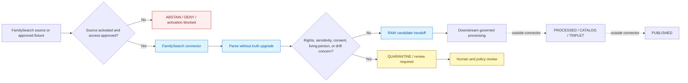

<!-- [KFM_META_BLOCK_V2]
doc_id: kfm://doc/connectors-familysearch-readme
title: connectors/familysearch/ — FamilySearch Connector Lane
type: readme
version: v0.2
status: draft
owners: OWNER_TBD — Connector steward · Source steward · People/DNA/Land steward · Privacy/consent steward · Rights reviewer · Security reviewer · Validation steward · Data steward · Docs steward
created: 2026-06-18
updated: 2026-07-11
policy_label: public-doctrine; connector-lane; high-sensitivity; greenfield; not-activated; no-network-default; raw-or-quarantine-only; no-publication
proposed_path: connectors/familysearch/README.md
truth_posture: CONFIRMED greenfield scaffold / PLACEHOLDER implementation / README-only tests / NOT ACTIVATED / live source behavior UNKNOWN
related:
  - ../README.md
  - pyproject.toml
  - src/README.md
  - src/familysearch/README.md
  - src/familysearch/descriptor.yaml
  - src/familysearch/fetch.py
  - tests/README.md
  - ../../docs/sources/catalog/familysearch.md
  - ../../docs/sources/catalog/familysearch/README.md
  - ../../docs/sources/catalog/familysearch/family-tree.md
  - ../../docs/sources/catalog/familysearch/places-authorities.md
  - ../../docs/sources/catalog/familysearch/historical-record-images.md
  - ../../docs/domains/people-dna-land/README.md
  - ../../docs/domains/people-dna-land/CONSENT.md
  - ../../docs/domains/people-dna-land/CONSENT_MODEL.md
  - ../../docs/domains/people-dna-land/SOURCE_REGISTRY.md
  - ../../data/registry/people-dna-land/sources/familysearch.yaml
  - ../../schemas/contracts/v1/source/
  - ../../policy/sensitivity/
  - ../../release/
tags: [kfm, connectors, familysearch, genealogy, people-dna-land, source-admission, consent, living-person, high-sensitivity, greenfield, raw, quarantine, governance]
notes:
  - "Repository inspection confirms a greenfield connector scaffold: a placeholder pyproject, documented src root, package README, placeholder descriptor, one-line fetcher placeholder, and README-only test lane."
  - "No importable package, executable connector, live source access, OAuth flow, parser, privacy gate, handoff writer, fixture set, executable tests, CI coverage, activation record, or publication path is proved."
  - "Source identity, descriptor authority, source role, rights, sensitivity, access posture, output contract, and activation state remain unresolved or conflicting."
  - "The package-local sensitivity_floor: public value is a placeholder and must not be interpreted as a privacy, consent, rights, activation, or release decision."
  - "Connector output, once implemented and activated, may prepare RAW or QUARANTINE handoff only."
[/KFM_META_BLOCK_V2] -->

<a id="top"></a>

# FamilySearch Connector Lane

> Evidence-grounded overview of the greenfield FamilySearch connector lane. This directory reserves a governed source-admission boundary for FamilySearch-derived genealogy material; it does **not** currently provide a runnable connector, source activation, genealogy truth, consent authority, or publication capability.

<p>
  
  
  
  
  
</p>

`connectors/familysearch/`

> [!IMPORTANT]
> **Confirmed state:** this lane contains documentation and placeholders only. It is not import-proven, executable, source-activated, rights-cleared, consent-integrated, tested, CI-covered, or publication-ready. The existence of this directory is not an activation decision.

**Quick jumps:** [Purpose](#purpose) · [Verified repository state](#verified-repository-state) · [Evidence ledger](#evidence-ledger) · [Authority boundary](#authority-boundary) · [Blocking drift](#blocking-drift) · [Source-family posture](#source-family-posture) · [Lifecycle boundary](#lifecycle-boundary) · [Privacy consent and rights](#privacy-consent-and-rights) · [Allowed future responsibilities](#allowed-future-responsibilities) · [Forbidden responsibilities](#forbidden-responsibilities) · [Target architecture](#target-architecture) · [Runtime posture](#runtime-posture) · [Input and output contract](#input-and-output-contract) · [Testing relationship](#testing-relationship) · [Activation gates](#activation-gates) · [Implementation sequence](#implementation-sequence) · [Review and rollback](#review-and-rollback) · [Definition of done](#definition-of-done) · [Verification backlog](#verification-backlog)

---

## Purpose

`connectors/familysearch/` is the source-specific connector lane reserved for governed intake of FamilySearch-derived genealogy material.

Its future role is narrow:

- hold connector-local packaging and implementation code;
- consume only explicit, reviewed configuration and source references;
- perform source access only after activation, rights, privacy, consent, and security gates are satisfied;
- parse synthetic fixtures or approved source responses without upgrading them to truth;
- preserve source, contributor, citation, retrieval, temporal, and digest metadata;
- represent people, relationships, events, places, and citations as source-attributed candidate assertions;
- detect conditions that require `DENY`, `ABSTAIN`, `ERROR`, quarantine, or human review;
- construct bounded handoff material for governed RAW or QUARANTINE admission;
- remain deterministic, auditable, reversible, and testable without a network or personal account.

This lane is not a family tree, person registry, identity resolver, consent registry, rights authority, source registry, graph authority, release engine, public API, user-interface data source, or publication path.

[Back to top ↑](#top)

---

## Verified repository state

The following structure is confirmed on the repository's `main` branch at the time of this update:

```text
connectors/familysearch/
├── README.md
├── pyproject.toml
├── src/
│   ├── README.md
│   └── familysearch/
│       ├── README.md
│       ├── descriptor.yaml
│       └── fetch.py
└── tests/
    └── README.md
```

### Current maturity

| Surface | Confirmed content | Maturity |
|---|---|---:|
| `README.md` | This connector-lane overview. | **DOCUMENTED** |
| `pyproject.toml` | Project name `kfm-connector-familysearch`; version `0.0.0`. | **PLACEHOLDER** |
| `src/README.md` | Evidence-grounded source-root contract. | **DOCUMENTED** |
| `src/familysearch/README.md` | Evidence-grounded package-boundary contract. | **DOCUMENTED** |
| `src/familysearch/descriptor.yaml` | `name: familysearch`; unresolved role and rights; placeholder `sensitivity_floor: public`. | **PLACEHOLDER / BLOCKED** |
| `src/familysearch/fetch.py` | One-line greenfield fetcher placeholder. | **PLACEHOLDER** |
| `tests/README.md` | Evidence-grounded connector-local test contract. | **DOCUMENTED / TESTS ABSENT** |
| Importable package | No `__init__.py`, package discovery evidence, or import test confirmed. | **ABSENT / UNPROVED** |
| Parser, client, privacy gate, handoff builder, or error model | None confirmed. | **ABSENT** |
| Local fixtures | None confirmed. | **ABSENT** |
| Executable tests | None confirmed. | **ABSENT** |
| Connector-specific CI evidence | None confirmed. | **UNKNOWN** |
| Source activation decision | None confirmed. | **NOT ACTIVATED** |
| Live account or API behavior | None confirmed. | **UNKNOWN / NOT IMPLEMENTED** |

> [!CAUTION]
> A documented scaffold is not an implementation. Do not describe this connector as installed, operational, integrated, validated, compliant, activated, or release-ready until executable code, approved source governance, tests, and reviewable run evidence exist.

[Back to top ↑](#top)

---

## Evidence ledger

| Evidence | Status | Supports | Does not support |
|---|---:|---|---|
| `connectors/familysearch/` tree | **CONFIRMED** | The connector lane and greenfield scaffold exist. | Runtime maturity, activation, rights clearance, or publication. |
| `pyproject.toml` | **CONFIRMED placeholder** | A project name and version are reserved. | Build backend, dependency resolution, package discovery, entry points, or install success. |
| `src/README.md` | **CONFIRMED** | Source-root responsibilities and current limitations are documented. | Importable or executable code. |
| `src/familysearch/README.md` | **CONFIRMED** | Package boundary, blockers, future modules, and lifecycle restrictions are documented. | Implemented package behavior. |
| `src/familysearch/fetch.py` | **CONFIRMED placeholder** | A future fetcher location is reserved. | HTTP, OAuth, retry, rate limiting, caching, parsing, or handoff behavior. |
| `src/familysearch/descriptor.yaml` | **CONFIRMED placeholder** | Connector-local source metadata was anticipated. | Canonical SourceDescriptor authority, source role, rights, sensitivity, or activation. |
| `tests/README.md` | **CONFIRMED documentation** | Required no-network, synthetic-fixture, privacy, error, and drift posture is defined. | Executable tests, passing results, or CI enforcement. |
| `data/registry/people-dna-land/sources/familysearch.yaml` | **CONFIRMED proposed registry record** | A registry candidate exists under the current People/DNA/Land path. | Final source identity, role, rights, sensitivity, access posture, or activation. |
| FamilySearch catalog documents | **CONFIRMED draft documentation** | FamilySearch is treated as a high-sensitivity genealogy source family with candidate-assertion and living-person restrictions. | Current API behavior, current source terms, implemented OAuth, or release approval. |
| People/DNA/Land consent documentation | **CONFIRMED doctrine / PROPOSED implementation** | Consent is explicit, scoped, revocable, fail-closed, and independent of publication. | Implemented consent enforcement in this connector. |

[Back to top ↑](#top)

---

## Authority boundary

```text
THIS CONNECTOR LANE MAY EVENTUALLY:
  hold source-specific adapter code
  validate explicit connector configuration
  preserve source and citation metadata
  parse synthetic or approved source-shaped payloads
  keep person and relationship material as candidate assertions
  detect privacy, consent, rights, and source-shape blockers
  emit deterministic deny, abstain, error, or quarantine signals
  prepare RAW-or-QUARANTINE handoff envelopes

THIS CONNECTOR LANE MUST NOT:
  establish person identity truth
  establish family relationship truth
  infer consent
  decide rights or sensitivity
  activate itself
  define canonical source descriptors
  define binding schemas or contracts
  merge people into canonical identities
  publish living-person data
  handle raw DNA or DNA-derived hypotheses by default
  write directly to processed, catalog, triplet, published, proof, receipt, or release roots
  create public-facing claims
  bypass EvidenceBundle, policy, review, release, correction, or rollback gates
```

The connector may preserve what a FamilySearch source says. It does not decide that the source is correct, that a contributor is authoritative, that two records describe the same person, that a relationship is true, or that any derived claim is safe to publish.

[Back to top ↑](#top)

---

## Blocking drift

The lane is blocked by unresolved or conflicting repository evidence.

| Blocker | Confirmed state | Required resolution |
|---|---|---|
| Source identity | Package-local material uses `familysearch`; catalog material proposes `familysearch-api`. | Select one canonical `source_id` and align connector, registry, catalog, receipts, fixtures, and tests. |
| Descriptor authority | Package-local `descriptor.yaml` and registry candidate both exist. | Confirm the source registry as authority and define whether package-local metadata is generated, copied, or non-authoritative. |
| Source role | Role remains `TBD`. | Source steward assigns an allowed role under the accepted SourceDescriptor standard. |
| Rights | License, redistribution, attribution, and authority remain unresolved. | Complete current source-terms and rights review. |
| Sensitivity | Package-local YAML says `public`; registry sensitivity is unresolved; domain doctrine is deny-by-default for living-person material. | Remove placeholder ambiguity and adopt a reviewed sensitivity posture. |
| Access posture | OAuth, scopes, account model, endpoint coverage, and credential handling are unimplemented. | Approve an explicit access contract before code or live tests. |
| Consent integration | Consent doctrine exists, but connector integration is unimplemented. | Define which inputs require consent evidence and how revocation blocks re-emission. |
| Output contract | No binding source-admission or handoff envelope is confirmed. | Select the accepted contract/schema before implementing writers. |
| Package configuration | Build backend, package discovery, dependencies, and entry points are absent or unproved. | Complete packaging and prove installation/import behavior. |
| Tests and fixtures | Test lane is README-only. | Implement synthetic fixtures and executable tests against real code. |
| CI | No connector-specific passing run is confirmed. | Add reproducible local execution before CI enforcement. |
| Activation | No SourceActivationDecision or equivalent is confirmed. | Keep all live behavior disabled until governance approves activation. |

> [!WARNING]
> The value `sensitivity_floor: public` in `src/familysearch/descriptor.yaml` is a greenfield placeholder. It must fail validation or remain non-authoritative until a reviewed descriptor resolves sensitivity. It is not evidence that FamilySearch-derived records are public-safe.

[Back to top ↑](#top)

---

## Source-family posture

FamilySearch-related repository documentation currently distinguishes several potential surfaces, including family-tree records, place authorities, and historical-record images. Those surfaces must not be collapsed into one undifferentiated source role or access policy.

A future connector design should preserve at least:

- upstream surface or product identity;
- canonical source identifier;
- source role;
- contributor or submitter context where present;
- citation and evidence references;
- access method and scope;
- rights and redistribution posture;
- sensitivity floor and review state;
- retrieval time and source version where available;
- payload digest and parser version;
- whether a record concerns a living person;
- whether a relationship is asserted, inferred, or merely linked;
- whether material came from a public surface, restricted account context, private tree, export, or reviewed fixture.

A source-family umbrella does not authorize every product or surface. Each materially different surface may require its own descriptor, activation decision, rights review, parser contract, retention rule, and sensitivity posture.

[Back to top ↑](#top)

---

## Lifecycle boundary

KFM lifecycle discipline remains:

```text
RAW -> WORK / QUARANTINE -> PROCESSED -> CATALOG / TRIPLET -> PUBLISHED
```

The connector participates only at the source-admission edge.



The diagram describes the required future boundary. It is not implementation evidence.

Allowed connector-side outcomes:

- explicit refusal or abstention;
- safe, finite connector error;
- drift or review signal;
- quarantine candidate;
- RAW candidate handoff after all source-admission preconditions pass.

Forbidden connector-side outcomes:

- direct processed record;
- canonical person merge;
- catalog or triplet write;
- EvidenceBundle closure claim;
- publication artifact;
- release manifest;
- public API or UI payload.

[Back to top ↑](#top)

---

## Privacy consent and rights

FamilySearch material can involve living people, private relationships, account-mediated access, contributor notes, family-tree assertions, person-place links, private exports, and source images with separate rights.

Minimum posture:

1. **Living-person material fails closed.** Missing or unclear status routes to denial, quarantine, or review.
2. **Consent is never inferred.** Missing, expired, revoked, ambiguous, unverifiable, or scope-mismatched consent does not permit living-person exposure.
3. **Consent does not publish.** Even valid consent clears only the consent constraint; evidence, rights, sensitivity, release, and policy gates remain independent.
4. **Rights are separate from consent.** A person may consent while KFM still lacks source rights; source rights may exist while personal consent is absent.
5. **Private account material is not public-safe by default.** Account visibility must not be mistaken for redistribution permission.
6. **Relationship assertions remain claims.** A tree edge, contributor statement, or merged record does not become KFM relationship truth automatically.
7. **Person-place material requires special care.** Living-person locations, addresses, and fine-grained place associations must fail closed.
8. **DNA-like fields trigger denial or quarantine.** Raw DNA, match data, kit identifiers, segments, or DNA-derived hypotheses are outside this connector's default scope.
9. **Retention and revocation must be explicit.** No live activation before cache, retention, deletion, tombstone, and revocation-propagation behavior is reviewed.
10. **Logs must minimize exposure.** Never log tokens, cookies, private source payloads, living-person details, or raw account identifiers.

[Back to top ↑](#top)

---

## Allowed future responsibilities

After governance blockers are resolved, connector code may support:

- explicit configuration loading and validation;
- SourceDescriptor and activation precondition checks;
- bounded transport helpers for specifically approved source surfaces;
- OAuth token use without token persistence or logging;
- timeout, retry, backoff, and rate-limit behavior with finite bounds;
- deterministic parsing of approved source-shaped payloads;
- preservation of unsupported fields when contractually required;
- contributor, citation, source, retrieval, and digest metadata preservation;
- candidate person, relationship, event, place, and citation records;
- living-person, consent, private-source, rights, sensitivity, and DNA-like-field gates;
- source-shape drift detection;
- RAW or QUARANTINE handoff-envelope construction;
- synthetic-fixture and no-network test support;
- safe error objects and review signals.

Every responsibility remains subordinate to the canonical descriptor, contracts, policies, activation decision, and downstream lifecycle gates.

---

## Forbidden responsibilities

Connector code must not:

- run live network calls at import time;
- require a FamilySearch account for default import or tests;
- read credentials at import time;
- store tokens, cookies, browser sessions, or private account exports in the repository;
- silently refresh fixtures from live accounts;
- persist private payload caches without approved retention and revocation behavior;
- choose its own source role, rights, sensitivity, or activation state;
- infer person identity or merge records as truth;
- infer relationship truth from tree structure;
- infer consent from account access or contributor activity;
- treat the local descriptor as self-authorizing;
- write directly to `data/processed/`, `data/catalog/`, `data/triplets/`, `data/published/`, `data/proofs/`, `data/receipts/`, or `release/`;
- emit public text, map features, graph claims, or UI payloads;
- convert generated summaries into evidence;
- continue indefinitely after rate limits, timeouts, or schema drift;
- suppress governance drift merely to keep a test green.

[Back to top ↑](#top)

---

## Target architecture

The following structure is a **PROPOSED implementation target**, not a claim about current files:

```text
connectors/familysearch/
├── README.md
├── pyproject.toml
├── src/
│   ├── README.md
│   └── familysearch/
│       ├── README.md
│       ├── __init__.py
│       ├── config.py
│       ├── descriptors.py
│       ├── client.py
│       ├── parser.py
│       ├── assertions.py
│       ├── privacy.py
│       ├── consent.py
│       ├── rights.py
│       ├── handoff.py
│       ├── drift.py
│       └── errors.py
└── tests/
    ├── README.md
    ├── fixtures/
    ├── test_import_safety.py
    ├── test_configuration.py
    ├── test_descriptor_preconditions.py
    ├── test_parser.py
    ├── test_candidate_assertions.py
    ├── test_privacy_and_consent.py
    ├── test_handoff_envelope.py
    └── test_errors_and_drift.py
```

Do not create this entire structure mechanically. Add modules only when:

- their responsibility is implemented;
- their contract is known;
- tests accompany the behavior;
- no existing shared package already owns the concern;
- source, privacy, rights, and activation dependencies are explicit.

Shared logic should move upward only after at least two connectors require it and the shared authority boundary is reviewed.

[Back to top ↑](#top)

---

## Runtime posture

The required default posture is:

| Concern | Required behavior |
|---|---|
| Package import | No HTTP, account access, secret read, file write, or environment mutation. |
| Network | Disabled unless explicitly invoked by an approved live-access path. |
| Account | Not required for import, fixture parsing, or default tests. |
| Credentials | Never committed, persisted in fixtures, or printed in logs. |
| Source activation | Required before any live request. |
| Descriptor | Canonical descriptor required; unresolved fields block activation. |
| Source identity | One reviewed canonical ID required. |
| Rights | Unresolved rights block live intake and public-safe outcomes. |
| Sensitivity | Unresolved sensitivity routes to quarantine or review. |
| Consent | Missing or invalid consent fails closed where consent applies. |
| Living person | Deny, quarantine, or review-required by default. |
| DNA-like material | Out of scope; deny or quarantine plus drift signal. |
| Retries | Finite, bounded, and rate-limit aware. |
| Cache | Disabled or explicitly governed by retention and revocation policy. |
| Writes | RAW or QUARANTINE handoff only after preconditions pass. |
| Publication | Forbidden. |
| Errors | Deterministic, actionable, redacted, and finite. |

No environment-variable name, command-line interface, endpoint list, OAuth scope set, retry count, cache path, or test marker is currently confirmed. These must be introduced through implementation and review, not inferred from older README examples.

[Back to top ↑](#top)

---

## Input and output contract

### Future allowed inputs

- canonical SourceDescriptor reference;
- explicit SourceActivationDecision or accepted equivalent;
- connector configuration validated against a reviewed contract;
- approved source-surface or endpoint identifier;
- OAuth/access material supplied through approved secret handling;
- synthetic source-shaped fixture;
- approved response payload or export with provenance and rights context;
- request parameters allowed by source terms and policy;
- runtime context needed for privacy, consent, rights, and sensitivity evaluation.

### Future allowed outputs

- finite connector error or abstention result;
- activation-blocked result;
- source-shape drift signal;
- privacy, consent, rights, or sensitivity review signal;
- source-attributed candidate assertion set;
- RAW handoff candidate;
- QUARANTINE handoff candidate;
- safe metadata describing retrieval, parser version, source surface, digest, and review flags.

### Output invariants

Every non-error candidate output should preserve, where applicable:

- canonical source identifier;
- source-surface identifier;
- retrieval timestamp;
- source URI or stable reference;
- payload digest;
- parser version;
- contributor/source labels;
- citation identifiers;
- event/date/place source attribution;
- candidate-assertion status;
- living-person status or unresolved marker;
- consent reference or unresolved state where applicable;
- rights and sensitivity review state;
- intended lifecycle target of RAW or QUARANTINE only.

Outputs must never be shaped as direct public claims or UI-ready records.

[Back to top ↑](#top)

---

## Testing relationship

Connector-local test documentation lives at [`tests/README.md`](tests/README.md).

The test lane currently contains no confirmed executable tests or fixtures. Its future default suite must be:

- synthetic-fixture based;
- no-network and no-account;
- deterministic;
- explicit about absent implementation;
- fail-closed on descriptor, activation, role, rights, sensitivity, consent, and living-person uncertainty;
- capable of detecting attempted writes beyond RAW or QUARANTINE;
- incapable of proving genealogy truth or release eligibility.

Minimum future test classes:

- import safety;
- configuration defaults;
- descriptor and activation preconditions;
- parser behavior;
- candidate-assertion preservation;
- privacy and consent gates;
- error and source-shape drift handling;
- handoff-envelope restrictions;
- explicit rejection of placeholder `sensitivity_floor: public` as real-source approval.

A likely future command is:

```bash
python -m pytest connectors/familysearch/tests
```

That command is **PROPOSED**, not current passing evidence.

[Back to top ↑](#top)

---

## Activation gates

The connector must remain inactive until every required gate has reviewable evidence.

### Source governance

- [ ] One canonical source identifier is approved.
- [ ] Canonical SourceDescriptor home is confirmed.
- [ ] Source role is assigned.
- [ ] Source surfaces/products are separately identified where materially different.
- [ ] Current source terms and redistribution posture are reviewed.
- [ ] Attribution requirements are recorded.
- [ ] Sensitivity floor is reviewed and the unsafe placeholder is removed or made explicitly non-authoritative.
- [ ] SourceActivationDecision or accepted equivalent exists.

### Security and access

- [ ] Approved access model and endpoint scope are documented.
- [ ] OAuth scopes and credential lifecycle are reviewed.
- [ ] Secrets are supplied only through approved mechanisms.
- [ ] Tokens and private account material are excluded from logs and persistent fixtures.
- [ ] Rate limits, retries, timeouts, and error behavior are bounded.
- [ ] Cache, retention, deletion, and revocation behavior are approved.

### Privacy and consent

- [ ] Living-person detection and unresolved-status behavior fail closed.
- [ ] Consent requirements are explicit by source surface and use case.
- [ ] Missing, expired, revoked, ambiguous, or mismatched consent blocks relevant output.
- [ ] Consent is documented as independent from rights, evidence, sensitivity, and release.
- [ ] Person-place precision and private-tree material have explicit handling.
- [ ] DNA-like fields are denied or quarantined by default.

### Implementation and validation

- [ ] Package is installable and importable without side effects.
- [ ] Configuration, client, parser, privacy, consent, rights, drift, handoff, and error responsibilities are implemented only as needed.
- [ ] Binding handoff contract/schema is selected.
- [ ] Synthetic fixtures exist and are sensitivity-reviewed.
- [ ] Executable no-network tests pass from a clean environment.
- [ ] CI wiring has reviewable successful runs.
- [ ] No direct downstream or publication writes are possible.
- [ ] Rollback and deactivation behavior are documented and tested.

No single gate substitutes for another.

[Back to top ↑](#top)

---

## Implementation sequence

Build the connector in dependency order:

1. **Resolve authority and identity**
   - select canonical `source_id`;
   - establish descriptor authority;
   - distinguish FamilySearch source surfaces;
   - resolve role, rights, sensitivity, and access posture.
2. **Define activation and output contracts**
   - confirm SourceActivationDecision workflow;
   - select the binding source-admission/handoff contract;
   - define finite outcomes and lifecycle targets.
3. **Complete packaging**
   - choose build backend and package discovery;
   - declare runtime and test dependencies;
   - expose a narrow import surface with no side effects.
4. **Implement fixture-first behavior**
   - configuration and descriptor preconditions;
   - deterministic parser;
   - candidate-assertion preservation;
   - privacy, consent, rights, sensitivity, and drift evaluation;
   - bounded handoff-envelope construction.
5. **Implement tests before live access**
   - synthetic fixtures;
   - no-network enforcement;
   - malformed, empty, unauthorized, timeout, rate-limit, private, living-person, revoked, rights-unclear, sensitivity-unclear, and drift cases.
6. **Integrate CI**
   - prove the command locally first;
   - retain passing run evidence;
   - do not enable live tests in default CI.
7. **Consider live source access last**
   - only after activation, terms, security, privacy, consent, rights, retention, and rollback reviews;
   - start with a narrowly scoped, auditable smoke path;
   - never retain private response bodies merely for convenience.

[Back to top ↑](#top)

---

## Review and rollback

Changes to this connector are sensitivity-significant when they affect:

- source identifiers or descriptor locations;
- OAuth scopes, endpoints, account behavior, or credentials;
- living-person detection;
- consent and revocation behavior;
- rights or sensitivity interpretation;
- fixture content;
- cache, retention, deletion, or logging;
- handoff targets;
- test-network posture;
- activation or release claims.

Reviewers should reject changes that:

- convert placeholders into silent defaults;
- use successful account access as proof of rights or consent;
- treat tree relationships as canonical truth;
- add real living-person or DNA fixtures;
- enable live access before activation;
- bypass quarantine for unresolved material;
- write directly to downstream lifecycle roots;
- claim passing tests when only README guidance exists;
- present consent as publication permission.

Rollback procedure after unsafe activation, data exposure, or misleading maturity claims:

1. Disable connector activation and live credentials.
2. Stop scheduled or manual retrieval paths.
3. Quarantine or remove newly admitted material according to retention and incident policy.
4. Invalidate caches and derived artifacts affected by revoked or unsafe material.
5. Revert the connector change and restore no-network defaults.
6. Review logs and repository history for secret or private-data exposure.
7. Preserve the incident, source drift, rights drift, or privacy finding in the appropriate governed record.
8. Correct README badges, status fields, and release claims.
9. Require fresh review before reactivation.

A code revert alone may be insufficient when material has already entered caches or downstream stores.

[Back to top ↑](#top)

---

## Definition of done

This connector lane is not complete merely because its README files are polished.

- [x] Connector-lane authority boundary is documented.
- [x] Current greenfield scaffold is inventoried.
- [x] Source-root, package, and test-lane READMEs are aligned.
- [x] Placeholder sensitivity and source-governance conflicts are explicit.
- [ ] Canonical source identifier is approved.
- [ ] Descriptor authority and activation workflow are approved.
- [ ] Source role, rights, sensitivity, and access posture are resolved.
- [ ] Source surfaces are separated where needed.
- [ ] Packaging is complete and import-safe.
- [ ] Connector behavior is implemented against accepted contracts.
- [ ] Synthetic fixtures and executable tests exist.
- [ ] Default tests prove no network and no account access.
- [ ] Living-person, consent, rights, sensitivity, DNA-like, and drift cases fail closed.
- [ ] RAW-or-QUARANTINE-only handoff is enforced.
- [ ] CI evidence exists.
- [ ] Live access, if needed, is separately reviewed and activated.
- [ ] Rollback, deactivation, cache invalidation, and revocation behavior are tested.
- [ ] No connector code or test creates public claims or crosses the publication boundary.

[Back to top ↑](#top)

---

## Verification backlog

| Item | Status | Needed evidence |
|---|---:|---|
| Confirm the connector tree after future changes. | **NEEDS CONTINUOUS VERIFICATION** | Repository tree inspection. |
| Resolve `familysearch` versus `familysearch-api`. | **CONFLICTED** | Accepted source-registry decision and aligned references. |
| Confirm canonical SourceDescriptor home. | **CONFLICTED / NEEDS VERIFICATION** | Registry standard, accepted descriptor, and activation workflow. |
| Resolve source role. | **BLOCKED** | Steward-reviewed SourceDescriptor. |
| Resolve rights, attribution, and redistribution. | **BLOCKED** | Current source terms and rights review. |
| Resolve sensitivity floor. | **BLOCKED** | Privacy/sensitivity review and canonical descriptor update. |
| Confirm FamilySearch source-surface decomposition. | **NEEDS VERIFICATION** | Catalog review and source-steward decision. |
| Confirm access model, OAuth scopes, endpoint coverage, and account constraints. | **UNKNOWN** | Approved client/access contract. |
| Confirm rate-limit, retry, timeout, cache, and retention behavior. | **UNKNOWN** | Source documentation, implementation, and tests. |
| Confirm consent and revocation integration. | **PROPOSED / NEEDS VERIFICATION** | Implemented gate, policy references, and tests. |
| Confirm package build backend and discovery. | **NEEDS VERIFICATION** | Completed `pyproject.toml` and clean install evidence. |
| Confirm import surface. | **NEEDS VERIFICATION** | Package files and import-safety tests. |
| Confirm source-admission handoff contract. | **NEEDS VERIFICATION** | Accepted contract/schema and validation tests. |
| Confirm fixture authority and metadata convention. | **NEEDS VERIFICATION** | Fixture documentation and sensitivity review. |
| Confirm executable default tests. | **ABSENT** | Test files and passing local run. |
| Confirm CI integration and merge-gate posture. | **UNKNOWN** | Workflow configuration and successful runs. |
| Confirm live-test or live-access approval mechanism. | **NOT APPROVED** | Source, security, privacy, rights, retention, consent, and activation reviews. |
| Confirm rollback, deactivation, cache invalidation, and incident response. | **NEEDS VERIFICATION** | Runbook, implementation, and tests. |

---

## Maintainer note

Treat FamilySearch as a high-sensitivity source family, not a convenient genealogy API. The connector's first responsibility is to preserve uncertainty, provenance, privacy, consent boundaries, source-role separation, and reversibility. Capability comes after restraint. A connector that retrieves more data but obscures rights, living-person status, consent, or relationship uncertainty is not progress under KFM doctrine.

[Back to top ↑](#top)
