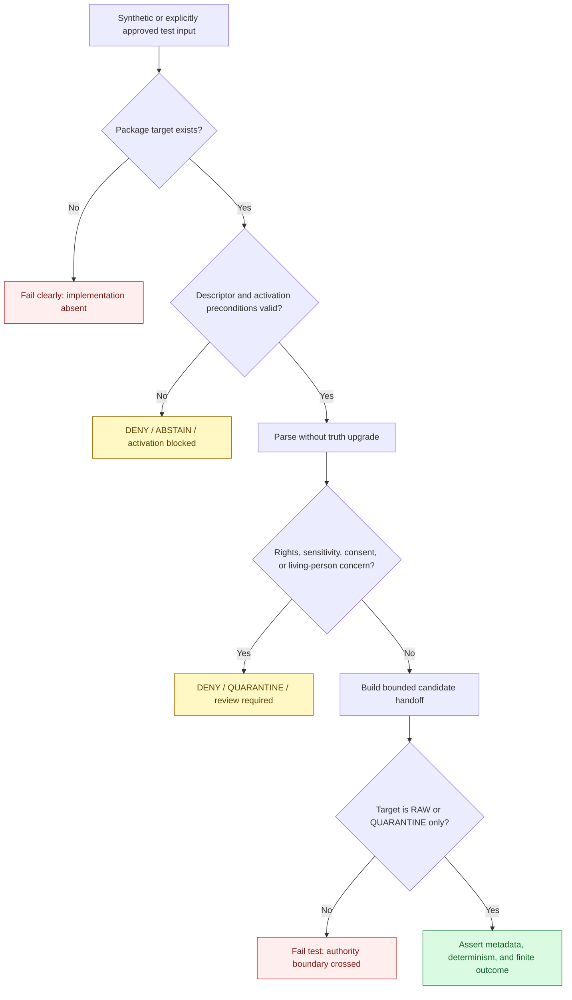

<!-- [KFM_META_BLOCK_V2]
doc_id: kfm://doc/connectors-familysearch-tests-readme
title: connectors/familysearch/tests/ — FamilySearch Connector Test Lane
type: readme
version: v0.2
status: draft
owners: OWNER_TBD — Connector steward · Source steward · People/DNA/Land steward · Privacy/consent steward · Rights reviewer · Validation steward · Security reviewer · Docs steward
created: 2026-06-18
updated: 2026-07-11
policy_label: public-doctrine; connector-local-tests; high-sensitivity; greenfield; synthetic-fixtures-only; no-network-default; no-account-default; no-publication
proposed_path: connectors/familysearch/tests/README.md
truth_posture: CONFIRMED README-only test lane / executable tests ABSENT / CI wiring UNKNOWN / live testing NOT APPROVED
related:
  - ../README.md
  - ../pyproject.toml
  - ../src/README.md
  - ../src/familysearch/README.md
  - ../src/familysearch/descriptor.yaml
  - ../src/familysearch/fetch.py
  - ../../../tests/README.md
  - ../../../fixtures/
  - ../../../docs/sources/catalog/familysearch.md
  - ../../../docs/sources/catalog/familysearch/README.md
  - ../../../docs/domains/people-dna-land/README.md
  - ../../../docs/domains/people-dna-land/CONSENT.md
  - ../../../docs/domains/people-dna-land/CONSENT_MODEL.md
  - ../../../data/registry/people-dna-land/sources/familysearch.yaml
  - ../../../schemas/contracts/v1/source/
  - ../../../policy/sensitivity/
  - ../../../release/
tags: [kfm, connectors, familysearch, tests, genealogy, people-dna-land, consent, living-person, source-admission, synthetic-fixtures, no-network, quarantine, governance]
notes:
  - "Repository inspection confirms this test lane contains this README only; no executable FamilySearch connector tests, local fixtures, live-test folder, test configuration, or passing CI evidence are present."
  - "The connector implementation is also a greenfield scaffold, so this README defines required tests without claiming that any test target currently exists or runs."
  - "Tests must fail closed while source identity, descriptor authority, role, rights, sensitivity, access posture, and source activation remain unresolved."
  - "The package-local sensitivity_floor: public value is a placeholder and must never be used as an expected public-safe test result."
[/KFM_META_BLOCK_V2] -->

<a id="top"></a>

# FamilySearch Connector Test Lane

> Evidence-grounded contract for connector-local tests under `connectors/familysearch/`. The lane is currently documentation-only. Future tests must prove safe source-admission behavior without using live accounts, exposing private genealogy material, asserting family truth, or creating publication artifacts.

<p>
  
  
  
  
  
</p>

`connectors/familysearch/tests/`

> [!IMPORTANT]
> **Confirmed state:** this directory contains this README and no confirmed executable test files. The adjacent connector package contains only documentation, a placeholder descriptor, and a one-line fetcher placeholder. No importable package, parser, privacy gate, handoff builder, live client, fixture set, test dependency, test command, CI job, or passing test result is proved.

**Quick jumps:** [Purpose](#purpose) · [Verified repository state](#verified-repository-state) · [Evidence ledger](#evidence-ledger) · [Test authority boundary](#test-authority-boundary) · [Blocking drift](#blocking-drift) · [Allowed test inputs](#allowed-test-inputs) · [Forbidden material](#forbidden-material) · [Target test classes](#target-test-classes) · [Fixture contract](#fixture-contract) · [No-network and no-account contract](#no-network-and-no-account-contract) · [Expected outcomes](#expected-outcomes) · [Test flow](#test-flow) · [Execution posture](#execution-posture) · [Implementation sequence](#implementation-sequence) · [Acceptance gates](#acceptance-gates) · [Review and rollback](#review-and-rollback) · [Definition of done](#definition-of-done) · [Verification backlog](#verification-backlog)

---

## Purpose

This directory is reserved for **connector-local** tests of the FamilySearch source-admission adapter.

Future tests may verify that connector code:

- imports without network, account, browser-session, or secret side effects;
- consumes synthetic fixtures deterministically;
- preserves source identifiers, contributor labels, citations, retrieval metadata, temporal fields, and digests;
- keeps person, relationship, event, place, and citation material as candidate assertions;
- fails closed on living-person, consent, rights, sensitivity, activation, source-shape, and descriptor uncertainty;
- emits only bounded RAW-or-QUARANTINE handoff results;
- never writes public claims, release artifacts, catalog records, triplets, proofs, or publication outputs.

This test lane does **not** prove person identity, kinship, dates, places, land connections, consent validity, source authority, publication eligibility, or FamilySearch truth.

[Back to top ↑](#top)

---

## Verified repository state

The following structure is confirmed on the repository's `main` branch at the time of this update:

```text
connectors/familysearch/
├── README.md
├── pyproject.toml
├── src/
│   ├── README.md
│   └── familysearch/
│       ├── README.md
│       ├── descriptor.yaml
│       └── fetch.py
└── tests/
    └── README.md
```

### Current maturity

| Surface | Confirmed state | Maturity |
|---|---|---:|
| `tests/README.md` | This connector-local test contract. | **DOCUMENTED** |
| Executable test modules | None confirmed. | **ABSENT** |
| Local test fixtures | None confirmed. | **ABSENT** |
| Live-test directory | None confirmed. | **ABSENT** |
| `../src/familysearch/fetch.py` | One-line greenfield placeholder. | **PLACEHOLDER** |
| `../src/familysearch/descriptor.yaml` | Unresolved role and rights with placeholder `sensitivity_floor: public`. | **PLACEHOLDER / BLOCKED** |
| `../pyproject.toml` | Project name and version only. | **PLACEHOLDER** |
| Test dependency declaration | None confirmed. | **UNKNOWN / UNPROVED** |
| CI job or workflow coverage | None confirmed for this connector. | **UNKNOWN** |
| Passing test evidence | None confirmed. | **ABSENT** |

> [!CAUTION]
> A detailed README is not a test suite. Do not mark this connector tested, validated, CI-covered, privacy-compliant, or release-ready until executable tests and reviewable run evidence exist.

[Back to top ↑](#top)

---

## Evidence ledger

| Evidence | Status | What it supports | What it does not support |
|---|---:|---|---|
| `connectors/familysearch/tests/README.md` | **CONFIRMED** | The local test lane and its governance contract exist. | Test implementation or passing results. |
| Current `tests/` search and source-root inventory | **CONFIRMED for inspected state** | No executable FamilySearch test files were found during this update. | Permanent absence or future CI behavior. |
| `../src/README.md` | **CONFIRMED** | The source root is greenfield and not import-proven. | Runnable package behavior. |
| `../src/familysearch/README.md` | **CONFIRMED** | Package blockers, required posture, and target responsibilities are documented. | Implemented parser, client, privacy, or handoff code. |
| `../src/familysearch/fetch.py` | **CONFIRMED placeholder** | A future fetcher path is reserved. | HTTP, OAuth, retry, rate-limit, cache, or response behavior. |
| `../src/familysearch/descriptor.yaml` | **CONFIRMED placeholder** | Connector-local source metadata was anticipated. | Canonical descriptor authority, role, rights, sensitivity, or activation. |
| `../../../data/registry/people-dna-land/sources/familysearch.yaml` | **CONFIRMED proposed registry record** | A registry candidate exists. | Final source ID, role, rights, sensitivity, access posture, or activation. |
| FamilySearch catalog documents | **CONFIRMED draft documentation** | The source is treated as high-sensitivity and living-person material is deny-by-default. | Current API terms, runtime implementation, or release approval. |
| People/DNA/Land consent documentation | **CONFIRMED doctrine / PROPOSED implementation** | Consent is explicit, revocable, independent, and fail-closed; consent does not publish. | An implemented connector consent gate. |

[Back to top ↑](#top)

---

## Test authority boundary

Connector-local tests may prove only the behavior of the FamilySearch adapter at the source-admission edge.

```text
TESTS MAY PROVE:
  deterministic parsing of synthetic source-shaped fixtures
  import safety
  no-network and no-account defaults
  explicit configuration validation
  source metadata preservation
  candidate-assertion preservation
  fail-closed privacy and consent behavior
  finite error and drift outcomes
  RAW-or-QUARANTINE-only handoff behavior

TESTS MUST NOT CLAIM:
  person identity truth
  family relationship truth
  historical fact truth
  consent authority
  rights clearance
  sensitivity classification authority
  source activation authority
  publication eligibility
  release approval
  public safety of real genealogy records
```

Cross-domain, policy, contract, release, consent-runtime, integration, and end-to-end publication tests belong in their governed repository-wide homes. This directory must not become a parallel canonical `tests/` root.

[Back to top ↑](#top)

---

## Blocking drift

Executable FamilySearch tests must not encode unresolved placeholders as accepted facts.

| Blocker | Confirmed conflict or gap | Required test posture |
|---|---|---|
| Source identity | Package-local material uses `familysearch`; catalog material proposes `familysearch-api`. | Reject ambiguous activation and require one reviewed canonical identifier. |
| Descriptor authority | A package-local descriptor and a registry candidate both exist. | Treat the registry workflow as the expected authority boundary; do not let package-local YAML self-activate the connector. |
| Source role | Role remains `TBD`. | Fail activation preconditions. |
| Rights | License, redistribution, and authority remain unresolved. | Deny live access and public-safe output. |
| Sensitivity | Package-local YAML says `public`; registry sensitivity is unresolved; domain doctrine is deny-by-default for living people. | Treat `public` as an invalid placeholder, not an allow decision. |
| Access posture | OAuth, account scope, endpoint coverage, and credential handling are unimplemented. | No live test execution. |
| Consent runtime | Doctrine exists; connector integration is unimplemented. | Missing, expired, revoked, ambiguous, or mismatched consent fails closed. |
| Package importability | No `__init__.py`, build backend, package discovery, or import test is confirmed. | Do not claim import safety until an importable target exists. |
| Output envelope | No accepted connector handoff schema is confirmed. | Test only after the contract/schema is selected; never invent an authoritative shape in fixtures. |
| CI | No connector-specific job or passing run is confirmed. | Do not display a passing badge or claim merge-gate enforcement. |

These blockers are test requirements, not inconveniences to mock away.

[Back to top ↑](#top)

---

## Allowed test inputs

Future default tests may consume:

- synthetic FamilySearch-shaped person, relationship, event, place, and citation fixtures;
- minimized non-personal metadata fixtures;
- explicit connector configuration objects with no real credentials;
- invalid descriptor fixtures designed to prove fail-closed behavior;
- mocked transport responses for success, empty, malformed, unauthorized, forbidden, timeout, rate-limit, and drift cases;
- synthetic consent states such as missing, expired, revoked, scope-mismatched, and valid-but-not-publish-authorizing;
- temporary directories supplied by the test framework;
- explicitly versioned schemas or contracts once their authority is verified.

Every fixture must identify whether it is synthetic, minimized, redacted, or separately approved.

---

## Forbidden material

Do not place or use the following in this test lane:

| Forbidden material | Reason / correct handling |
|---|---|
| Real OAuth tokens, client secrets, cookies, browser sessions, refresh tokens, or account exports | Never commit; default tests must not require them. |
| Real living-person records | Use synthetic fixtures. Any exception requires documented privacy, rights, retention, and consent review outside this README. |
| Raw DNA, DNA matches, segment data, kit identifiers, or DNA-derived hypotheses | Outside the connector-local default test scope. |
| Unreviewed private family-tree payloads | Do not commit or cache. Route approved investigations through governed quarantine processes. |
| Live-response snapshots automatically refreshed from accounts | Creates uncontrolled retention, drift, and privacy exposure. |
| Canonical source descriptors | Belong in the source registry, not test fixtures. Invalid descriptor copies may be synthetic test inputs only. |
| Binding schemas or contracts | Belong under the accepted contract/schema authority. Tests reference them; they do not define them. |
| Publication policy | Belongs under `policy/`. |
| Public claims, proofs, receipts, release manifests, rollback cards, catalog records, or triplets | Outside connector-local test authority. |

[Back to top ↑](#top)

---

## Target test classes

The files below are **PROPOSED implementation targets**. None is confirmed to exist.

```text
connectors/familysearch/tests/
├── README.md
├── fixtures/
│   ├── README.md
│   ├── valid/
│   ├── invalid/
│   ├── private/
│   └── drift/
├── test_import_safety.py
├── test_configuration.py
├── test_descriptor_preconditions.py
├── test_parser.py
├── test_candidate_assertions.py
├── test_privacy_and_consent.py
├── test_handoff_envelope.py
├── test_errors_and_drift.py
└── live/
    ├── README.md
    └── test_smoke.py
```

Do not create the entire tree mechanically from this document. Add each file only with the implementation, fixture, contract, and review evidence needed to make it meaningful.

### Test class contract

| Test class | Required proof | Must not imply |
|---|---|---|
| Import safety | Import performs no HTTP, secret read, account access, file write, or environment mutation. | That the connector is activated or useful. |
| Configuration | Defaults are no-network, no-account, bounded, and explicit. | That a placeholder configuration is approved. |
| Descriptor preconditions | Missing, ambiguous, or unresolved descriptors block live activation. | That connector-local YAML is canonical authority. |
| Parser | Synthetic payloads are parsed deterministically with source attribution intact. | That parsed assertions are true. |
| Candidate assertions | Person and relationship records remain candidate/source assertions. | Person merge or canonical identity. |
| Privacy and consent | Living-person and consent failures yield deny, abstain, quarantine, or review-required outcomes. | That consent alone permits publication. |
| Handoff envelope | Only RAW or QUARANTINE targets are accepted, once a binding envelope contract exists. | Direct pipeline promotion or release. |
| Errors and drift | Failures are finite, actionable, redacted, and non-publishing. | Automatic source repair or silent compatibility. |
| Optional live smoke | A specifically approved endpoint can be contacted under reviewed scope. | Broad endpoint coverage, terms compliance, or release readiness. |

[Back to top ↑](#top)

---

## Fixture contract

Synthetic fixtures are the default and preferred evidence source for this lane.

Minimum fixture metadata, **PROPOSED pending fixture convention review**:

```yaml
fixture_id: familysearch-synthetic-person-001
fixture_status: synthetic
source_family: familysearch
contains_real_person_data: false
contains_living_person_data: false
contains_dna_data: false
rights_posture: generated-for-tests
sensitivity_posture: public-safe-synthetic
supports_tests:
  - parser_valid_shape
  - candidate_assertion_preservation
review_state: draft
```

Fixture rules:

1. Use invented people, relationships, events, places, citations, and identifiers.
2. Do not copy real account payloads merely because fields have been renamed.
3. Minimize each fixture to the behavior under test.
4. Keep valid, invalid, private-marker, and schema-drift fixtures separate.
5. Record why each fixture exists and which tests consume it.
6. Preserve unsupported fields only when the parser contract requires safe passthrough.
7. Never encode `sensitivity_floor: public` as the expected state of real FamilySearch material.
8. Promote fixtures to a shared `fixtures/` authority only after multi-consumer need and sensitivity review are confirmed.

[Back to top ↑](#top)

---

## No-network and no-account contract

> [!CAUTION]
> Default tests must require no internet, FamilySearch account, OAuth flow, token, cookie, browser session, private export, or credential-bearing environment variable.

Required controls once tests exist:

- mock or block all HTTP by default;
- fail a test that attempts an unapproved network call;
- make parser, privacy, descriptor, and envelope tests independent of live access;
- do not auto-refresh fixtures;
- do not persist private response bodies;
- redact authorization headers and account identifiers from errors;
- isolate any future live smoke tests under an explicit marker and separate directory;
- keep live tests outside default CI unless governance explicitly approves otherwise;
- require a reviewed SourceDescriptor and SourceActivationDecision before any live test can run;
- prevent live tests from writing to lifecycle, proof, receipt, release, or publication stores.

No environment flag name is confirmed. Do not standardize `KFM_ALLOW_LIVE_FAMILYSEARCH_TESTS` or another flag solely because an earlier README used it as an example.

[Back to top ↑](#top)

---

## Expected outcomes

Tests should prefer finite, reviewable outcomes over ambiguous exceptions.

| Condition | Expected safe behavior |
|---|---|
| Package target absent | Test collection or import test fails clearly; do not report connector validation success. |
| Canonical source ID unresolved | `ABSTAIN`, validation failure, or activation-blocked result. |
| Source descriptor missing | Activation refused with an actionable error. |
| Source role unresolved | Activation refused. |
| Rights unresolved | `DENY`, `ABSTAIN`, or quarantine-only result; never public-safe output. |
| Sensitivity unresolved | Quarantine or review-required result. |
| Placeholder `sensitivity_floor: public` encountered | Validation failure or explicit placeholder rejection. |
| Network disabled | Parser-only tests continue; transport path returns a bounded disabled outcome. |
| Credential absent | Default suite continues; live path abstains or is skipped only after a real live-test contract exists. |
| Unauthorized / forbidden | Finite redacted error; no credential leakage. |
| Timeout / rate limit | Bounded error; no infinite retry. |
| Empty response | `ABSTAIN` unless the endpoint contract defines empty as valid. |
| Malformed response | Finite parser error with safe metadata. |
| Unexpected source shape | Drift result marked `NEEDS VERIFICATION`; no silent field loss or promotion. |
| Living-person marker | `DENY`, quarantine, or review-required outcome. |
| Consent missing, expired, revoked, or mismatched | `DENY` or `ABSTAIN`; no public-safe result. |
| Valid consent present | Consent gate may clear only its own constraint; publication remains independently blocked. |
| DNA-like field detected | Deny/quarantine plus drift signal. |
| Unsupported relationship assertion | Preserve as candidate assertion or reject explicitly; never promote to truth. |
| Attempted processed/catalog/triplet/published/release write | Test failure. |

[Back to top ↑](#top)

---

## Test flow



The diagram describes the **required future test posture**. It is not evidence that these stages are implemented.

[Back to top ↑](#top)

---

## Execution posture

No test command is currently confirmed runnable because:

- no executable tests are confirmed;
- no importable package is proved;
- the package metadata does not confirm a build backend, package discovery, or test dependencies;
- no connector-specific CI job or passing run is confirmed.

A likely future local command is:

```bash
python -m pytest connectors/familysearch/tests
```

This command is **PROPOSED**, not current verification evidence. Replace it with the repository-standard command after package and test-runner integration are implemented and demonstrated.

Any future live-test command must remain undocumented as runnable until source activation, security review, rights review, privacy/consent review, credential handling, endpoint scope, retention behavior, and safe logging are all resolved.

[Back to top ↑](#top)

---

## Implementation sequence

Build the test lane in dependency order:

1. **Resolve governance blockers**
   - choose the canonical source identifier;
   - choose the canonical SourceDescriptor home;
   - resolve role, rights, sensitivity, access posture, and activation workflow;
   - select the binding source-admission envelope contract.
2. **Make the package importable without side effects**
   - establish package discovery and build metadata;
   - add a narrow `__init__.py` only when a real public import surface exists;
   - prove no network, secret, or file-write behavior occurs at import.
3. **Add synthetic fixture governance**
   - create the smallest fixture set needed for implemented behavior;
   - document fixture provenance and sensitivity posture;
   - prohibit real living-person and DNA material.
4. **Add deterministic unit tests**
   - configuration and descriptor preconditions;
   - parser and candidate-assertion preservation;
   - privacy, consent, error, and drift handling.
5. **Add handoff tests**
   - only after a binding envelope contract exists;
   - assert RAW-or-QUARANTINE-only targets and refusal of downstream writes.
6. **Integrate the default no-network suite**
   - use the repository-standard runner;
   - add CI only after the command is locally reproducible;
   - retain explicit evidence of passing runs.
7. **Consider live smoke testing last**
   - only after activation and all governance reviews;
   - isolate it from default tests and private response retention;
   - do not treat a smoke test as source validation or release approval.

[Back to top ↑](#top)

---

## Acceptance gates

A pull request adding or changing FamilySearch connector tests is reviewable only when applicable gates are satisfied.

### Required for every test PR

- [ ] Claims are labeled `CONFIRMED`, `PROPOSED`, `UNKNOWN`, or `NEEDS VERIFICATION` as appropriate.
- [ ] No real credentials, account identifiers, session material, or private exports are committed.
- [ ] No real living-person or DNA data is committed.
- [ ] Fixtures are synthetic, minimized, and documented.
- [ ] Default tests make no network calls.
- [ ] Tests do not establish genealogy truth or canonical person identity.
- [ ] Tests do not write to processed, catalog, triplet, published, proof, receipt, or release roots.
- [ ] Expected failures are finite, actionable, and safe to log.
- [ ] Source-ID, descriptor, role, rights, sensitivity, or activation drift is not hidden by mocks.
- [ ] README claims match executable evidence.

### Required before claiming the suite runs

- [ ] An importable package target exists.
- [ ] Test dependencies and runner are declared.
- [ ] The documented command succeeds from a clean environment.
- [ ] The default suite blocks network and account access.
- [ ] Run output or CI evidence is reviewable.

### Required before any live smoke test

- [ ] Canonical SourceDescriptor and source identifier are approved.
- [ ] SourceActivationDecision or equivalent activation evidence exists.
- [ ] Current source terms and allowed endpoint scope are reviewed.
- [ ] OAuth and secret handling are security-reviewed.
- [ ] Rights, sensitivity, consent, retention, revocation, and cache behavior are reviewed.
- [ ] Live tests are isolated from default CI and do not retain private response bodies.
- [ ] Safe logging and rollback procedures are documented.

[Back to top ↑](#top)

---

## Review and rollback

Treat fixture and privacy-test changes as sensitivity-significant even when they contain synthetic data.

Review should verify:

- the test belongs in this connector-local lane;
- the test targets implemented behavior rather than a README-only proposal;
- mocks do not bypass unresolved governance preconditions;
- error assertions do not expose secrets or source payloads;
- fixture metadata is accurate;
- living-person, consent, rights, sensitivity, and activation cases fail closed;
- a passing test is not described as proof of public truth or release readiness.

Rollback procedure for a harmful or misleading test change:

1. Revert the test and fixture changes.
2. Remove any copied or generated sensitive material from the branch and review repository history exposure.
3. Restore no-network and no-account defaults.
4. Re-run the last verified clean test command, when one exists.
5. Preserve any real source, privacy, rights, or schema drift finding in the appropriate backlog or review record.
6. Correct README badges and maturity claims if test coverage or CI evidence was overstated.

[Back to top ↑](#top)

---

## Definition of done

This test lane is not complete merely because this README exists.

- [x] The connector-local test authority boundary is documented.
- [x] The current README-only state is explicit.
- [x] Proposed test classes and fixture rules are separated from implementation evidence.
- [ ] Canonical source identity and descriptor authority are resolved.
- [ ] Role, rights, sensitivity, access posture, and activation are resolved.
- [ ] The FamilySearch package is importable without side effects.
- [ ] Synthetic fixtures exist and pass sensitivity review.
- [ ] Executable import, configuration, descriptor, parser, candidate-assertion, privacy, consent, error, and drift tests exist.
- [ ] A binding handoff contract is selected and covered by tests.
- [ ] Default tests prove no network and no account access.
- [ ] The repository-standard test command is documented and reproducible.
- [ ] CI wiring and passing run evidence exist.
- [ ] Any live smoke test is separately approved, isolated, and reversible.
- [ ] No test or fixture creates public claims or crosses the publication boundary.

[Back to top ↑](#top)

---

## Verification backlog

| Item | Status | Needed evidence |
|---|---:|---|
| Confirm that `tests/README.md` remains the only file in this lane after subsequent changes. | **NEEDS CONTINUOUS VERIFICATION** | Repository tree inspection. |
| Confirm package import name and import surface. | **NEEDS VERIFICATION** | Build metadata, package files, and import test. |
| Confirm test runner and dependency manager. | **NEEDS VERIFICATION** | Completed `pyproject.toml`, workspace configuration, or CI setup. |
| Resolve `familysearch` versus `familysearch-api`. | **CONFLICTED** | Accepted source registry decision and aligned references. |
| Confirm canonical SourceDescriptor home. | **CONFLICTED / NEEDS VERIFICATION** | Registry standard, accepted descriptor, and activation workflow. |
| Resolve source role. | **BLOCKED** | Steward-reviewed descriptor. |
| Resolve rights and redistribution posture. | **BLOCKED** | Current source terms and rights review. |
| Resolve sensitivity floor and remove unsafe placeholder meaning. | **BLOCKED** | Privacy/sensitivity review and canonical descriptor update. |
| Confirm OAuth, endpoint, rate-limit, retry, cache, and retention behavior. | **UNKNOWN** | Implemented client contract, source review, and tests. |
| Confirm consent and revocation integration. | **PROPOSED / NEEDS VERIFICATION** | Implemented gate, policy references, and tests. |
| Confirm source-admission envelope contract. | **NEEDS VERIFICATION** | Accepted contract/schema and validation tests. |
| Confirm fixture authority and metadata convention. | **NEEDS VERIFICATION** | Root fixture documentation and reviewer decision. |
| Confirm default no-network enforcement mechanism. | **NEEDS VERIFICATION** | Test configuration and passing evidence. |
| Confirm CI integration and merge-gate posture. | **UNKNOWN** | Workflow configuration, branch policy, and successful runs. |
| Confirm live-test approval mechanism, if live tests are ever needed. | **NOT APPROVED** | Source, security, privacy, rights, retention, and activation reviews. |

---

## Maintainer note

FamilySearch connector tests should prove restraint before capability. The first successful suite should demonstrate that unresolved source identity, descriptor, rights, sensitivity, consent, living-person, and activation conditions stop the connector safely. Only after those boundaries are executable and evidenced should the test lane expand toward parsing, handoff, or tightly governed live-source behavior.

[Back to top ↑](#top)
