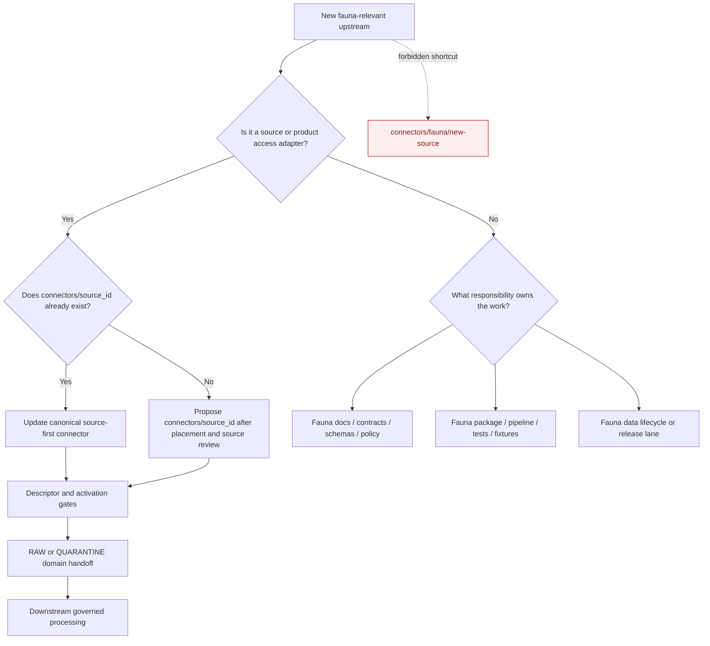

<!-- [KFM_META_BLOCK_V2]
doc_id: kfm://doc/connectors-fauna-readme
title: connectors/fauna/ — Fauna Connector Compatibility Index
type: readme
version: v0.2
status: draft
owners: OWNER_TBD — Connector steward · Source steward · Fauna steward · Biodiversity steward · Sensitivity reviewer · Rights reviewer · Validation steward · Docs steward
created: 2026-06-18
updated: 2026-07-11
policy_label: public-doctrine; compatibility-index; noncanonical-path; source-first-connectors; documentation-only; no-code; no-activation; no-publication
proposed_path: connectors/fauna/README.md
truth_posture: CONFIRMED compatibility directory / NONCANONICAL implementation path / source-first connector placement CONFIRMED / child implementation forbidden
related:
  - ../README.md
  - inaturalist/README.md
  - ../inaturalist/README.md
  - ../ebird/README.md
  - ../idigbio/README.md
  - ../usfws-ecos/README.md
  - ../../docs/domains/fauna/README.md
  - ../../docs/domains/fauna/CANONICAL_PATHS.md
  - ../../docs/domains/fauna/FILE_SYSTEM_PLAN.md
  - ../../docs/domains/fauna/SOURCE_FAMILIES.md
  - ../../docs/domains/fauna/SOURCE_REGISTRY.md
  - ../../docs/sources/catalog/inaturalist/README.md
  - ../../docs/sources/catalog/ebird/README.md
  - ../../docs/sources/catalog/idigbio/README.md
  - ../../data/registry/sources/fauna/
  - ../../data/raw/fauna/
  - ../../data/quarantine/fauna/
  - ../../fixtures/domains/fauna/
  - ../../tests/domains/fauna/
  - ../../policy/domains/fauna/
  - ../../policy/sensitivity/fauna/
  - ../../release/
tags: [kfm, connectors, fauna, compatibility, noncanonical, source-first, biodiversity, occurrence-evidence, geoprivacy, sensitive-location, raw, quarantine, governance]
notes:
  - "Fauna canonical-path doctrine explicitly places connector implementations under connectors/<source_id>/ and excludes connectors/<domain>/ as the implementation lane."
  - "The current connectors/fauna/ subtree is therefore a compatibility and navigation surface, not a connector group with runtime authority."
  - "The only confirmed child is connectors/fauna/inaturalist/README.md, which is itself a noncanonical compatibility pointer to connectors/inaturalist/."
  - "No new connector code, package metadata, descriptors, tests, fixtures, credentials, activation state, or source-admission behavior may be added under this subtree without an accepted ADR that changes placement doctrine."
  - "Fauna-specific processing belongs in fauna responsibility lanes after source-first connector admission, not in duplicate fauna-scoped connector implementations."
[/KFM_META_BLOCK_V2] -->

<a id="top"></a>

# Fauna Connector Compatibility Index

> Documentation-only compatibility index for historical or generated fauna-scoped connector references. KFM connector implementations are organized by **source** under `connectors/<source_id>/`, not by domain under `connectors/fauna/`.

<p>
  
  
  
  
  
</p>

`connectors/fauna/`

> [!IMPORTANT]
> **Confirmed state:** this subtree is not a canonical connector implementation lane. It contains this README and the documentation-only `inaturalist/README.md` compatibility pointer. Source-specific connector work belongs in source-first homes such as `connectors/inaturalist/`, `connectors/ebird/`, `connectors/idigbio/`, or `connectors/usfws-ecos/`, subject to each source's own governance and maturity evidence.

**Quick jumps:** [Purpose](#purpose) · [Canonicality decision](#canonicality-decision) · [Verified repository state](#verified-repository-state) · [Evidence ledger](#evidence-ledger) · [Compatibility responsibilities](#compatibility-responsibilities) · [Forbidden responsibilities](#forbidden-responsibilities) · [Source-first connector navigation](#source-first-connector-navigation) · [Fauna responsibility lanes](#fauna-responsibility-lanes) · [Placement decision flow](#placement-decision-flow) · [Admission and lifecycle boundary](#admission-and-lifecycle-boundary) · [Sensitivity and geoprivacy posture](#sensitivity-and-geoprivacy-posture) · [Child compatibility paths](#child-compatibility-paths) · [Migration and deprecation](#migration-and-deprecation) · [Review and rollback](#review-and-rollback) · [Definition of done](#definition-of-done) · [Verification backlog](#verification-backlog)

---

## Purpose

This README prevents `connectors/fauna/` from hardening into a parallel connector hierarchy.

It may:

- explain why source-first connector placement governs;
- redirect maintainers from historical fauna-scoped links to canonical source homes;
- index source-first connectors that may provide fauna-relevant material;
- identify the correct fauna-domain responsibility lanes after connector admission;
- preserve geoprivacy, sensitive-location, source-role, and rights warnings;
- document migration, correction, and deprecation work for this compatibility subtree.

It does not host connector implementations, activate sources, decide source roles, classify sensitivity, admit data, or publish fauna claims.

[Back to top ↑](#top)

---

## Canonicality decision

The placement question is resolved by current repository doctrine and live-tree evidence.

| Question | Decision | Evidence posture |
|---|---|---:|
| Are connector implementations organized by domain? | **No.** | `docs/domains/fauna/CANONICAL_PATHS.md` says connectors are source-specific and belong at `connectors/<source_id>/`. |
| Is `connectors/fauna/` a canonical implementation root? | **No.** | The fauna path register explicitly excludes a domain segment under `connectors/` from the implementation lane. |
| What may remain here? | Documentation-only compatibility and navigation material. | This preserves old links without creating runtime authority. |
| May new source connectors be created below this folder? | **No.** | New connector implementations must use reviewed source-first placement. |
| Where does fauna-specific behavior belong? | In fauna packages, pipelines, policies, schemas, tests, fixtures, and lifecycle lanes after source admission. | Domain behavior and source access are separate responsibilities. |
| Can an ADR change this? | Yes, but only explicitly. | Until an accepted ADR changes doctrine, source-first placement governs. |

> [!CAUTION]
> Directory presence is not authority. A generated skeleton, historical link, or convenience grouping cannot override responsibility-root doctrine.

[Back to top ↑](#top)

---

## Verified repository state

The following relationship is confirmed on the repository's `main` branch at the time of this update:

```text
connectors/
├── fauna/
│   ├── README.md                         # this noncanonical compatibility index
│   └── inaturalist/
│       └── README.md                     # compatibility pointer only
├── inaturalist/                          # source-first iNaturalist lane
├── ebird/                                # source-first eBird lane
├── idigbio/                              # source-first iDigBio lane
└── usfws-ecos/                           # source-first USFWS ECOS lane
```

This listing is illustrative of confirmed nearby source-first homes, not an exhaustive inventory of every source that can support Fauna.

### Current maturity

| Surface | Confirmed content | Maturity |
|---|---|---:|
| `connectors/fauna/README.md` | This compatibility-index contract. | **DOCUMENTED / NONCANONICAL** |
| `connectors/fauna/inaturalist/README.md` | Pointer to `connectors/inaturalist/`; implementation forbidden locally. | **DOCUMENTED / NONCANONICAL** |
| Other child directories under `connectors/fauna/` | None confirmed in this update. | **ABSENT / NEEDS CONTINUOUS VERIFICATION** |
| Connector code under `connectors/fauna/` | None confirmed. | **ABSENT** |
| Package metadata under `connectors/fauna/` | None confirmed. | **ABSENT** |
| Connector-local tests or fixtures under `connectors/fauna/` | None confirmed. | **ABSENT** |
| Source activation owned by this subtree | None. | **FORBIDDEN** |
| Publication authority owned by this subtree | None. | **FORBIDDEN** |

[Back to top ↑](#top)

---

## Evidence ledger

| Evidence | Status | Supports | Does not support |
|---|---:|---|---|
| `docs/domains/fauna/CANONICAL_PATHS.md` | **CONFIRMED doctrine-derived register** | Source-specific connector placement at `connectors/<source_id>/`; fauna behavior belongs in domain responsibility lanes. | Activation or implementation maturity of any particular connector. |
| `connectors/fauna/README.md` | **CONFIRMED** | The compatibility directory exists and can carry migration guidance. | Runtime, source, or publication authority. |
| `connectors/fauna/inaturalist/README.md` | **CONFIRMED compatibility pointer** | The historical fauna-scoped iNaturalist path redirects to `connectors/inaturalist/`. | A second iNaturalist implementation. |
| `connectors/inaturalist/` | **CONFIRMED source-first scaffold** | The canonical iNaturalist connector home exists. | Operational, activated, rights-cleared, tested, or release-ready behavior. |
| `connectors/ebird/` | **CONFIRMED source-first lane** | eBird is organized by source and has package-level files in the live tree. | Full maturity or activation status without separate inspection. |
| `connectors/idigbio/` | **CONFIRMED source-first lane** | iDigBio is organized by source and has source-specific documentation. | Full maturity or activation status without separate inspection. |
| `connectors/usfws-ecos/` | **CONFIRMED source-first lane** | USFWS ECOS is organized by source despite serving multiple domains. | Full maturity or activation status without separate inspection. |
| Fauna lifecycle and governance roots | **CONFIRMED responsibility pattern** | Domain-specific data, policy, testing, and processing have separate homes. | Permission to read connector output directly from public clients. |

[Back to top ↑](#top)

---

## Compatibility responsibilities

`connectors/fauna/` may contain only non-executable compatibility material.

Allowed content:

- this README;
- short deprecation or correction notices;
- links from historical fauna-scoped references to source-first connectors;
- migration inventories and backlink-cleanup notes;
- a reviewed redirect manifest if the repository adopts a machine-readable redirect standard;
- navigation to fauna source-family, registry, RAW, quarantine, policy, test, and pipeline documentation;
- explicit warnings against connector-to-publication shortcuts.

Every artifact here must remain:

- documentation-only;
- non-authoritative;
- non-executable;
- reversible;
- clear about the canonical destination;
- free of credentials, source payloads, activation state, and public claims.

[Back to top ↑](#top)

---

## Forbidden responsibilities

Do not add these beneath `connectors/fauna/`:

```text
FORBIDDEN:
  source client code
  fetchers or downloaders
  request builders
  parsers or normalizers
  package metadata
  importable modules
  source descriptors
  source activation decisions
  connector configuration with runtime authority
  credentials, API keys, tokens, cookies, or sessions
  source payloads or response caches
  connector-local fixtures or test suites
  retry, backoff, rate-limit, or authentication logic
  taxonomy resolution implementations
  rights or license normalization implementations
  sensitivity or geoprivacy transformation implementations
  RAW or QUARANTINE writers
  processed, catalog, triplet, proof, receipt, release, or publication writers
  public API, map, tile, search, report, story, or generated-answer payloads
```

A pull request adding any of these should be rejected or redirected unless it also supplies an accepted ADR that deliberately changes connector placement doctrine and includes a migration plan.

[Back to top ↑](#top)

---

## Source-first connector navigation

Fauna consumes evidence from many source families. The connector remains source-first even when every current consumer is in the Fauna domain.

| Source-first lane | Fauna relevance | Boundary |
|---|---|---|
| [`connectors/inaturalist/`](../inaturalist/README.md) | Community-observation occurrence evidence shared with Flora. | Not regulatory, legal-status, canonical-taxonomy, sensitive-location, or publication authority. |
| [`connectors/ebird/`](../ebird/README.md) | Bird observations, sampling events, or licensed dataset surfaces subject to product-specific rules. | Preserve effort, rights, sensitivity, and source-product distinctions; do not infer universal presence. |
| [`connectors/idigbio/`](../idigbio/README.md) | Specimen and collection-derived biodiversity evidence shared across Fauna and Flora. | Specimen, media, summary, and portal products must remain distinct. |
| [`connectors/usfws-ecos/`](../usfws-ecos/README.md) | Federal species, listing, profile, critical-habitat, and consultation-related surfaces. | Product roles differ; regulatory status must not collapse into occurrence evidence or vice versa. |

The table is a navigation aid, not a complete source registry and not proof that each connector is activated or production-ready.

Before adding a new connector:

1. identify the upstream source or product family;
2. search for an existing `connectors/<source_id>/` home;
3. verify source catalog and SourceDescriptor conventions;
4. resolve product identity, source role, rights, access, sensitivity, and activation;
5. create or update the source-first lane;
6. route admitted outputs to the correct domain lifecycle lane.

[Back to top ↑](#top)

---

## Fauna responsibility lanes

Fauna-specific work belongs under responsibility roots, not beneath this compatibility directory.

| Responsibility | Correct lane | Examples |
|---|---|---|
| Domain doctrine | `docs/domains/fauna/` | Source families, identity, lifecycle, sensitivity, release posture. |
| Object meaning | `contracts/domains/fauna/` | Occurrence evidence, restricted/public occurrence split, sensitive-site objects. |
| Machine shape | `schemas/contracts/v1/domains/fauna/` | Fauna object schemas and validation shapes. |
| Domain policy | `policy/domains/fauna/` | Allow, deny, restrict, abstain, source-role and product-use rules. |
| Sensitivity policy | `policy/sensitivity/fauna/` | Nests, dens, roosts, hibernacula, spawning sites, rare-taxon geometry. |
| Reusable domain code | `packages/domains/fauna/` | Shared fauna logic used by multiple consumers. |
| Pipeline execution | `pipelines/domains/fauna/` | Normalize, validate, resolve, redact, aggregate, project. |
| Domain tests | `tests/domains/fauna/` | Policy, schema, source-role, sensitive-location, and publication-boundary tests. |
| Domain fixtures | `fixtures/domains/fauna/` | Synthetic valid, invalid, restricted, and public-safe examples. |
| Source registry | `data/registry/sources/fauna/` or accepted source registry home | Descriptor and activation records; exact path subject to current registry convention. |
| RAW admission | `data/raw/fauna/<source_id>/` | Immutable admitted captures and RAW-local sidecars. |
| Quarantine | `data/quarantine/fauna/` | Rights, sensitivity, taxonomy, geometry, drift, or validation holds. |
| Downstream lifecycle | `data/work/fauna/`, `data/processed/fauna/`, catalog/triplet lanes | Governed transformations after connector admission. |
| Release | `release/` | Promotion, correction, withdrawal, and rollback decisions. |

Source-first connectors may serve Fauna, Flora, Habitat, People, or other domains. Domain-specific routing is determined by descriptors, product identity, policy, and downstream pipelines—not by duplicating the connector under each domain.

[Back to top ↑](#top)

---

## Placement decision flow



The diagram expresses placement doctrine. It does not prove any connector is implemented or activated.

[Back to top ↑](#top)

---

## Admission and lifecycle boundary

Source-first fauna-relevant connectors remain constrained to the source-admission edge:

```text
upstream source
  -> connectors/<source_id>/
  -> SourceDescriptor and activation checks
  -> data/raw/<domain>/<source_id>/ or data/quarantine/<domain>/
  -> downstream governed work, validation, evidence closure, policy, review, release
```

KFM lifecycle discipline remains:

```text
RAW -> WORK / QUARANTINE -> PROCESSED -> CATALOG / TRIPLET -> PUBLISHED
```

Connectors must not:

- publish;
- write directly to processed, catalog, triplet, proof, receipt, or release authority roots;
- turn an observation or specimen into confirmed range or presence truth;
- decide regulatory or legal status unless the specific source product and downstream contract authorize that role;
- bypass taxonomy, rights, sensitivity, geoprivacy, evidence, review, or release gates.

This compatibility directory performs no lifecycle handoff at all.

[Back to top ↑](#top)

---

## Sensitivity and geoprivacy posture

Fauna source material can expose nests, dens, roosts, hibernacula, spawning sites, rare taxa, collection sites, telemetry positions, mortality events, disease events, observer identities, and other protected ecological information.

Minimum cross-source posture:

1. Preserve upstream geoprivacy and obscuration fields as evidence.
2. Never infer, reconstruct, or deobscure protected coordinates.
3. Treat exact sensitive locations as deny, quarantine, restricted, redacted, or generalized by default.
4. Keep source-provided privacy separate from KFM sensitivity policy; the stricter obligation wins.
5. Preserve per-record rights, licenses, attribution, and media-use constraints.
6. Preserve source role and product identity; observation, specimen, regulatory, modeled, and aggregate evidence must not collapse.
7. Route unresolved taxonomy, geometry, rights, vintage, quality, or sensitivity to quarantine or abstention.
8. Keep watchers and connectors non-publishing.
9. Require downstream EvidenceBundle, policy, review, release, correction, and rollback support before public use.
10. Treat AI summaries, maps, tiles, search indexes, and vector representations as downstream carriers, not sovereign truth.

[Back to top ↑](#top)

---

## Child compatibility paths

### `inaturalist/`

[`connectors/fauna/inaturalist/README.md`](inaturalist/README.md) is the only confirmed child in this subtree. It is a noncanonical compatibility pointer to [`connectors/inaturalist/`](../inaturalist/README.md).

It must remain documentation-only and must not accumulate:

- source-access code;
- package metadata;
- descriptors or activation records;
- fixtures or tests;
- rights, geoprivacy, taxonomy, or sensitivity implementations;
- lifecycle writers;
- public-output logic.

### Future children

Do not add additional child source folders. A historical link that requires preservation should normally be corrected at its source. When a redirect is unavoidable, add only the smallest reviewed documentation pointer and record its removal or retention decision.

[Back to top ↑](#top)

---

## Migration and deprecation

The preferred long-term state is that source references point directly to source-first connector homes.

Migration sequence:

1. inventory all references to `connectors/fauna/` and its children;
2. classify each reference as documentation, code, configuration, test, fixture, workflow, registry, or generated skeleton;
3. replace source-implementation references with `connectors/<source_id>/`;
4. move fauna-domain behavior to the appropriate fauna responsibility lane;
5. verify no runtime, CI, import, packaging, registry, or release path depends on this subtree;
6. preserve correction notes for renamed or superseded paths;
7. choose an explicit end state.

Allowed end states:

| End state | Use when |
|---|---|
| Retained compatibility index | Maintainers still encounter historical fauna-scoped links and the index prevents repeated placement mistakes. |
| Minimal tombstone README | All useful navigation has moved, but old external or historical links still need an explanation. |
| Directory removal | All backlinks and generated references are corrected, no tooling depends on the path, and removal is approved. |
| ADR-authorized canonical group | Only if an accepted ADR intentionally changes source-first doctrine and supplies migration, ownership, test, and rollback plans. |

Do not remove the directory merely for cosmetic cleanliness while unresolved backlinks still point here.

[Back to top ↑](#top)

---

## Review and rollback

Review any change under `connectors/fauna/` as a placement-sensitive change.

A reviewer should confirm:

- the change is documentation-only;
- it does not create a new connector implementation surface;
- canonical source-first links are correct;
- the document does not imply activation or maturity without evidence;
- fauna-specific behavior is routed to a responsibility-root lane;
- sensitive-location, geoprivacy, rights, source-role, and lifecycle warnings remain intact;
- no public client is directed toward RAW, QUARANTINE, connector, or compatibility content.

Rollback is required if a change:

- adds executable code or package metadata here;
- creates a parallel source descriptor or activation state;
- duplicates source-first tests or fixtures;
- weakens geoprivacy or sensitive-location controls;
- presents connector output as public truth;
- claims this directory is canonical without an accepted ADR.

Rollback procedure:

1. revert the offending change;
2. move legitimate source-specific work to `connectors/<source_id>/`;
3. move legitimate fauna-domain work to its responsibility-root lane;
4. repair backlinks and imports;
5. record any exposed drift in the appropriate register;
6. re-check that this subtree contains compatibility documentation only.

[Back to top ↑](#top)

---

## Definition of done

This compatibility index is complete for its current role when:

- [x] Source-first connector placement is stated as the governing rule.
- [x] `connectors/fauna/` is labeled noncanonical for implementation.
- [x] The current iNaturalist child is labeled compatibility-only.
- [x] Confirmed nearby source-first connector examples are linked.
- [x] Fauna responsibility lanes are identified.
- [x] New child connector implementations are explicitly forbidden.
- [x] Lifecycle, geoprivacy, sensitivity, rights, and source-role boundaries are preserved.
- [ ] All repository references to `connectors/fauna/` are inventoried.
- [ ] Incorrect implementation references are migrated to source-first homes.
- [ ] Generated skeletons or templates are corrected so they stop recreating domain-scoped connector paths.
- [ ] A retained-index, tombstone, or removal decision is recorded.
- [ ] CI or repository validation rejects new executable files beneath this subtree, if such a validator is adopted.

[Back to top ↑](#top)

---

## Verification backlog

| Item | Status | Needed evidence |
|---|---:|---|
| Inventory all backlinks to `connectors/fauna/`. | **NEEDS VERIFICATION** | Repository-wide path search and generated-file/template review. |
| Confirm no hidden or unindexed executable files exist below this subtree. | **NEEDS CONTINUOUS VERIFICATION** | Repository tree inspection. |
| Confirm whether the parent compatibility index should ultimately remain, tombstone, or be removed. | **OPEN DECISION** | Maintainer and docs-steward review after backlink cleanup. |
| Correct templates or skeleton maps that imply domain-scoped connectors. | **NEEDS VERIFICATION** | Template inventory and patch review. |
| Confirm source-first homes for all fauna-relevant sources referenced by domain docs. | **NEEDS VERIFICATION** | Source-family register, source catalog, and connector tree crosswalk. |
| Confirm SourceDescriptor registry convention for multi-domain sources. | **NEEDS VERIFICATION** | Accepted source-registry standard and current records. |
| Confirm routing contract from one source-first connector to multiple domain RAW/QUARANTINE lanes. | **NEEDS VERIFICATION** | Descriptor, handoff contract, schemas, and tests. |
| Confirm geoprivacy and sensitive-location policy implementation. | **NEEDS VERIFICATION** | Policy code, redaction/generalization profiles, and negative tests. |
| Confirm connector-output boundary enforcement. | **NEEDS VERIFICATION** | ADR, validators, tests, and CI evidence. |
| Add a noncanonical-path validator for executable files below `connectors/fauna/`, if approved. | **PROPOSED** | Validator design, fixture cases, and CI integration. |

---

## Maintainer note

Keep `connectors/fauna/` boring and temporary in spirit. Its value is preventing old paths from becoming new authority. Build source access once under `connectors/<source_id>/`; build fauna behavior in fauna responsibility lanes; publish only through governed downstream release surfaces.

[Back to top ↑](#top)
