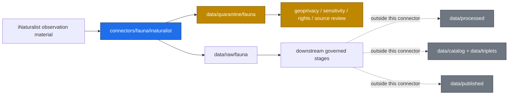

<!-- [KFM_META_BLOCK_V2]
doc_id: kfm://doc/connectors-fauna-inaturalist-readme
title: connectors/fauna/inaturalist/ — iNaturalist Fauna Connector Lane
type: readme
version: v0.1
status: draft
owners: OWNER_TBD — Source steward · Connector steward · Fauna steward · Sensitivity reviewer · Data steward · Docs steward
created: 2026-06-18
updated: 2026-06-18
policy_label: public-doctrine
proposed_path: connectors/fauna/inaturalist/README.md
truth_posture: CONFIRMED path exists / PROPOSED fauna-scoped connector-lane contract / UNKNOWN implementation depth
related:
  - ../../README.md
  - ../../../docs/sources/catalog/inaturalist/README.md
  - ../../../docs/sources/catalog/inaturalist/research-grade-observations.md
  - ../../../docs/domains/fauna/README.md
  - ../../../docs/domains/fauna/SOURCE_FAMILIES.md
  - ../../../docs/domains/fauna/SOURCE_REGISTRY.md
  - ../../../data/registry/sources/fauna/
  - ../../../data/raw/fauna/
  - ../../../data/quarantine/fauna/
  - ../../../data/receipts/fauna/
  - ../../../data/proofs/fauna/
  - ../../../policy/sensitivity/
  - ../../../policy/rights/
  - ../../../release/
tags: [kfm, connectors, fauna, inaturalist, biodiversity, occurrence-evidence, geoprivacy, sensitive-location, source-admission, raw, quarantine, governance]
notes:
  - "This README fills a previously blank file with a governed fauna-scoped connector-lane contract."
  - "Visible source-catalog docs also reference connectors/inaturalist/ as an iNaturalist connector location; this fauna-scoped path should be reconciled with any accepted ADR or migration note before parallel authority is assumed."
  - "iNaturalist-derived observations may involve geoprivacy, rare species, sensitive habitat, observer metadata, and per-record licensing; default behavior is admit to RAW or QUARANTINE only."
  - "Specific API endpoints, authentication, rate limits, per-record licenses, descriptors, tests, fixtures, CI enforcement, and activation state remain NEEDS VERIFICATION."
[/KFM_META_BLOCK_V2] -->

<a id="top"></a>

# iNaturalist Fauna Connector

> Fauna-scoped source-specific intake and admission lane for iNaturalist observation material used by the KFM Fauna domain.

<p>
  
  
  
  
  
</p>

`connectors/fauna/inaturalist/`

## Quick jumps

[Scope](#scope) · [Repo fit](#repo-fit) · [Authority boundary](#authority-boundary) · [Inputs](#inputs) · [Exclusions](#exclusions) · [Admission posture](#admission-posture) · [Geoprivacy and sensitivity](#geoprivacy-and-sensitivity) · [Validation](#validation) · [Definition of done](#definition-of-done) · [Verification backlog](#verification-backlog)

---

## Scope

`connectors/fauna/inaturalist/` is a fauna-scoped connector lane for iNaturalist source intake and admission helpers.

It may contain connector-local documentation, configuration examples, parser helpers, bounded client helpers, source-admission code, and tests for iNaturalist-derived fauna observation material.

It must not become species truth, taxonomy authority, legal-status authority, rare-species-location authority, geoprivacy authority, policy authority, schema authority, catalog/triplet authority, proof authority, release authority, pipeline authority, or publication authority.

> [!IMPORTANT]
> **Status:** draft / `NEEDS VERIFICATION`  
> **Owner:** `OWNER_TBD`  
> **Path:** `connectors/fauna/inaturalist/`  
> **Truth posture:** README path is CONFIRMED. Connector implementation, source activation, exact endpoint coverage, authentication, rate limits, descriptors, tests, fixtures, policy enforcement, and CI wiring remain `NEEDS VERIFICATION`.

---

## Repo fit

```text
connectors/
└── fauna/
    └── inaturalist/
        └── README.md
```

Related responsibility roots:

```text
connectors/                                  # source-specific fetch and admission code
docs/sources/catalog/inaturalist/            # iNaturalist source-family briefing
docs/domains/fauna/                          # fauna domain doctrine and sensitivity posture
data/registry/sources/fauna/                 # source descriptors and activation state
data/raw/fauna/                              # raw staged fauna source outputs
data/quarantine/fauna/                       # held material requiring review
data/receipts/fauna/                         # process and validation receipts
data/proofs/fauna/                           # EvidenceBundles and proof packs
policy/sensitivity/                          # sensitivity and release rules
policy/rights/                               # rights and license policy, if present
release/                                     # release decisions and rollback/correction state
```

> [!WARNING]
> The visible iNaturalist source-catalog profile references `connectors/inaturalist/` as a connector location, while this README lives at `connectors/fauna/inaturalist/`. Treat the relationship between these two possible connector homes as **NEEDS VERIFICATION** until a repo tree review, Directory Rules check, or ADR confirms whether this path is the canonical fauna-scoped lane, a compatibility path, or a migration target.

---

## Lifecycle sketch



---

## Authority boundary

```text
OUTPUT LIMIT:
  data/raw/fauna/
  data/quarantine/fauna/

NOT HERE:
  species occurrence truth
  legal/listed-status truth
  taxonomy authority
  geoprivacy authority
  rare-species release decisions
  source descriptor authority
  policy authority
  schema authority
  processed records
  catalog or triplet records
  published records
  release decisions
```

The connector may help retrieve, parse, or stage source-shaped observation material. It does not decide whether an observation is true, taxonomically settled, license-cleared, sensitive-location-safe, regulatory, or publishable.

---

## Inputs

Potential input classes include:

- source descriptor references;
- steward-approved iNaturalist endpoint or export identifiers;
- observation identifiers;
- taxon identifiers or names, when allowed by source policy;
- place, county, bounding-box, or date filters, when allowed by sensitivity policy;
- per-record license and attribution metadata;
- geoprivacy flags or obscured-location indicators;
- observer and observation metadata, subject to privacy and rights review;
- test fixtures that preserve source shape without exposing sensitive locations.

All live access is **NEEDS VERIFICATION** and must remain off by default until source terms, per-record license behavior, geoprivacy handling, sensitive-location policy, rate limits, and source activation are reviewed.

---

## Exclusions

Do not place these in `connectors/fauna/inaturalist/`:

| Excluded material | Correct handling |
|---|---|
| API credentials, tokens, cookies, private sessions | Never commit; use approved secret management only. |
| Large copied source payloads | Store only if rights, size, provenance, and retention posture are approved. |
| Precise locations for sensitive species | Quarantine, generalize, redact, or deny according to policy. |
| Legal/listed-status decisions | Authoritative regulatory source lanes and downstream review only. |
| Taxonomic authority decisions | Taxonomy authority or downstream taxonomic resolution workflow. |
| Public-facing occurrence claims | Downstream evidence, review, release, and redaction only. |
| SourceDescriptor authority records | `data/registry/sources/fauna/` or accepted source registry home. |
| Schemas | `schemas/contracts/v1/...` under the accepted schema-home convention. |
| Publication policy | `policy/` and release review surfaces. |
| Release manifests or rollback records | `release/` and lifecycle/release roots. |

---

## Admission posture

iNaturalist connector output must be conservative because observation data may include sensitive taxa, exact coordinates, observer metadata, media licenses, and geoprivacy transformations.

Expected behavior:

- no live network access unless explicitly enabled and reviewed;
- no source fetch without a source descriptor or source activation decision;
- no implicit publication from retrieved observations;
- no automatic conversion from observation to confirmed occurrence truth;
- no public display of precise sensitive locations without policy review;
- no removal of source geoprivacy signals;
- no assumption that per-record license or media reuse rights are public-safe;
- unclear rights, geoprivacy, sensitivity, or taxonomic certainty routes to quarantine or abstention.

Recommended finite outcomes:

| Situation | Outcome |
|---|---|
| Source descriptor missing | `ABSTAIN` or connector error. |
| Live access not enabled | `ABSTAIN`; fixture-based tests still pass. |
| Per-record license missing or unclear | `NEEDS_VERIFICATION` or quarantine-safe output. |
| Sensitive species or location marker detected | Redact, generalize, quarantine, or deny according to policy. |
| Geoprivacy field present | Preserve and enforce; do not de-obscure. |
| Taxon uncertainty unsupported | Carry as candidate observation only; do not promote. |
| Source response malformed | `ERROR` with safe metadata. |
| Source terms unclear | `NEEDS_VERIFICATION`; no live activation. |

---

## Geoprivacy and sensitivity

This connector must preserve sensitive-location protections.

Minimum posture:

1. Source geoprivacy fields must be preserved.
2. Obscured coordinates must not be reverse-engineered or replaced with precise coordinates.
3. Sensitive-taxon precise locations must default to quarantine, redaction, generalization, or deny.
4. Observer-provided coordinates and place descriptions must be treated as potentially sensitive.
5. Media URLs, attribution, and licenses must remain attached to source records where applicable.
6. Public release requires downstream policy checks, redaction profile, EvidenceBundle support, review state, release state, and rollback path.

---

## Validation

Connector-local validation should check that:

- source metadata is preserved;
- source descriptor references are required for live activation;
- timestamps, retrieval metadata, observation IDs, taxon IDs, and license fields are explicit where available;
- geoprivacy and obscuration fields are preserved;
- sensitive-location indicators route to deny/quarantine/generalization behavior;
- malformed or incomplete responses fail closed;
- occurrence records remain candidate evidence until downstream validation;
- no test or connector run writes directly to processed, catalog, triplet, published, proof, receipt, or release stores;
- fixture data is synthetic, minimized, redacted, or approved for committed use.

Root-level validation, policy-as-code, release gates, and EvidenceBundle closure remain outside this connector.

---

## Definition of done

This connector lane is ready for first review when:

- [ ] Source catalog entry is linked and current enough for review.
- [ ] SourceDescriptor location and proposed source ID are verified.
- [ ] Live access is disabled by default.
- [ ] Credentials are excluded from source control.
- [ ] Per-record rights/license handling is documented before activation.
- [ ] Geoprivacy fields are preserved and tested.
- [ ] Sensitive taxa and precise locations route to deny/quarantine/generalization by default.
- [ ] Parser output preserves source references, observation identifiers, taxon identifiers, timestamps, and attribution metadata where available.
- [ ] Connector output is limited to RAW or QUARANTINE handoff.
- [ ] No public claims are created by connector code.
- [ ] Tests cover no-network, malformed, empty, geoprivacy, sensitive-location, rights-unclear, and taxon-uncertain cases.
- [ ] Reviewers have a rollback path for connector activation and cached material.

---

## Verification backlog

| Item | Status | Needed evidence |
|---|---:|---|
| Confirm whether canonical connector home is `connectors/fauna/inaturalist/` or `connectors/inaturalist/`. | **NEEDS VERIFICATION** | Directory Rules, ADR, repo tree, and migration note. |
| Confirm actual implementation files below this path. | **NEEDS VERIFICATION** | Mounted repo tree or GitHub listing. |
| Confirm source descriptor home and source ID. | **NEEDS VERIFICATION** | Source registry entry and accepted schema. |
| Confirm source terms, API access model, authentication posture, and rate limits. | **NEEDS VERIFICATION** | Current source steward review. |
| Confirm per-record license and media-rights handling. | **NEEDS VERIFICATION** | Source profile, rights policy, and fixture review. |
| Confirm geoprivacy, sensitive taxa, and rare-location redaction behavior. | **NEEDS VERIFICATION** | Sensitivity policy, fauna steward review, and redaction profile. |
| Confirm fixture strategy for biodiversity observation material. | **NEEDS VERIFICATION** | Test fixture registry and sensitivity review. |
| Confirm CI wiring for connector-local tests. | **NEEDS VERIFICATION** | Workflow files and test logs. |

---

## Maintainer note

Treat this connector as a sensitive-location admission helper. It can make iNaturalist fauna material easier to inspect and govern, but it must not make community observations look more certain, more public, more license-cleared, or more location-safe than the evidence, geoprivacy state, source terms, policy, review state, and release state allow.
