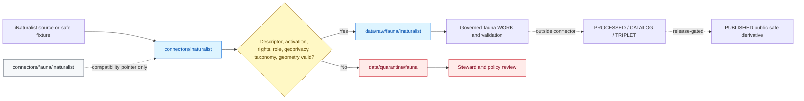

<!-- [KFM_META_BLOCK_V2]
doc_id: kfm://doc/connectors-fauna-inaturalist-readme
title: connectors/fauna/inaturalist/ — iNaturalist Fauna Compatibility Pointer
type: readme
version: v0.2
status: draft
owners: OWNER_TBD — Connector steward · Source steward · Fauna steward · Flora steward · Biodiversity steward · Sensitivity reviewer · Rights reviewer · Validation steward · Docs steward
created: 2026-06-18
updated: 2026-07-11
policy_label: public-doctrine; compatibility-lane; noncanonical-path; source-first-connectors; fauna-consumer-context; geoprivacy-gated; rights-gated; no-code; no-activation; no-publication
proposed_path: connectors/fauna/inaturalist/README.md
truth_posture: CONFIRMED compatibility README / NONCANONICAL connector path / canonical source-first lane CONFIRMED at connectors/inaturalist / implementation ABSENT here
related:
  - ../README.md
  - ../../inaturalist/README.md
  - ../../inaturalist/pyproject.toml
  - ../../inaturalist/observations/README.md
  - ../../inaturalist/src/README.md
  - ../../inaturalist/src/inaturalist/README.md
  - ../../inaturalist/tests/README.md
  - ../../../docs/sources/catalog/inaturalist/README.md
  - ../../../docs/sources/catalog/inaturalist/research-grade-observations.md
  - ../../../docs/domains/fauna/README.md
  - ../../../docs/domains/fauna/CANONICAL_PATHS.md
  - ../../../docs/domains/fauna/SOURCE_FAMILIES.md
  - ../../../docs/domains/fauna/SOURCE_REGISTRY.md
  - ../../../docs/domains/flora/README.md
  - ../../../data/raw/fauna/inaturalist/README.md
  - ../../../data/registry/sources/fauna/
  - ../../../data/raw/fauna/
  - ../../../data/quarantine/fauna/
  - ../../../policy/sensitivity/
  - ../../../policy/rights/
  - ../../../release/
tags: [kfm, connectors, fauna, inaturalist, compatibility, noncanonical, source-first, biodiversity, occurrence-evidence, geoprivacy, rights, raw, quarantine, governance]
notes:
  - "Fauna canonical-path doctrine states that connectors are organized by source under connectors/<source_id>/, not by domain under connectors/fauna/."
  - "The live repository contains the source-first iNaturalist connector scaffold at connectors/inaturalist/, including package and test documentation plus placeholder package metadata."
  - "This path contains documentation only and must not accumulate connector code, descriptors, fixtures, tests, activation state, or independent source-admission behavior."
  - "iNaturalist is shared by Fauna and Flora; a fauna-only connector implementation would create source-role, rights, geoprivacy, taxonomy, and maintenance drift."
  - "iNaturalist material remains community-observation occurrence evidence, not regulatory, legal-status, taxonomic, sensitive-location, or publication authority."
[/KFM_META_BLOCK_V2] -->

<a id="top"></a>

# iNaturalist Fauna Compatibility Pointer

> Noncanonical compatibility README for the historical fauna-scoped iNaturalist path. The canonical connector lane is source-first at [`connectors/inaturalist/`](../../inaturalist/README.md). This directory must remain documentation-only unless an accepted ADR explicitly changes connector placement doctrine.

<p>
  
  
  
  
  
</p>

`connectors/fauna/inaturalist/`

> [!IMPORTANT]
> **Confirmed state:** this path contains this README only. Repository doctrine organizes connectors by **source**, and the live source-first iNaturalist connector scaffold exists at `connectors/inaturalist/`. Do not add code, package metadata, descriptors, fixtures, tests, credentials, activation records, or independent runtime behavior here.

**Quick jumps:** [Purpose](#purpose) · [Canonicality decision](#canonicality-decision) · [Verified repository state](#verified-repository-state) · [Evidence ledger](#evidence-ledger) · [Compatibility responsibilities](#compatibility-responsibilities) · [Forbidden responsibilities](#forbidden-responsibilities) · [Canonical source-first lane](#canonical-source-first-lane) · [Fauna consumer context](#fauna-consumer-context) · [Source posture](#source-posture) · [Rights geoprivacy and sensitivity](#rights-geoprivacy-and-sensitivity) · [Lifecycle boundary](#lifecycle-boundary) · [Migration and deprecation contract](#migration-and-deprecation-contract) · [Review and rollback](#review-and-rollback) · [Definition of done](#definition-of-done) · [Verification backlog](#verification-backlog)

---

## Purpose

This README exists to prevent a historical or generated fauna-scoped path from becoming a second iNaturalist connector authority.

It provides:

- a clear pointer to the canonical source-first connector lane;
- fauna-specific context for maintainers following old links;
- an explicit prohibition on parallel implementation;
- a migration and deprecation boundary;
- a concise reminder of iNaturalist rights, geoprivacy, sensitivity, and source-role constraints;
- protection against accidental connector-to-publication shortcuts.

This path does not host a connector implementation and does not authorize one.

[Back to top ↑](#top)

---

## Canonicality decision

The canonicality question is resolved by current repository evidence:

| Question | Decision | Evidence posture |
|---|---|---:|
| Are connectors organized by domain? | **No.** | Fauna canonical-path doctrine says `connectors/` is organized by source and explicitly excludes `connectors/<domain>/` as the implementation lane. |
| What is the canonical iNaturalist connector home? | `connectors/inaturalist/` | The source catalog links to that path, the path exists, and it contains the source-first connector scaffold. |
| What is this path? | **Noncanonical compatibility pointer.** | It exists under the noncanonical `connectors/fauna/` grouping and contains no implementation files. |
| May this path independently fetch or parse fauna observations? | **No.** | That would duplicate source-first behavior and split rights, taxonomy, geoprivacy, tests, and activation state. |
| May fauna-specific behavior exist? | Yes, downstream of the canonical connector. | Fauna-specific processing belongs in fauna pipelines, packages, policies, schemas, tests, and lifecycle lanes—not a second source connector. |

> [!CAUTION]
> Directory presence is not authority. A compatibility path must not become canonical merely because future contributors add files beneath it.

[Back to top ↑](#top)

---

## Verified repository state

The following relationship is confirmed on the repository's `main` branch at the time of this update:

```text
connectors/
├── fauna/
│   ├── README.md                         # noncanonical domain-group compatibility surface
│   └── inaturalist/
│       └── README.md                     # this compatibility pointer
└── inaturalist/                          # canonical source-first connector lane
    ├── README.md
    ├── pyproject.toml                    # greenfield placeholder
    ├── observations/
    │   └── README.md
    ├── src/
    │   ├── README.md
    │   └── inaturalist/
    │       └── README.md
    └── tests/
        └── README.md
```

### Current maturity

| Surface | Confirmed content | Maturity |
|---|---|---:|
| `connectors/fauna/inaturalist/README.md` | This compatibility and migration boundary. | **DOCUMENTED / NONCANONICAL** |
| Files below this compatibility path | No implementation files confirmed. | **ABSENT** |
| `connectors/inaturalist/README.md` | Parent source-first connector contract. | **DOCUMENTED** |
| `connectors/inaturalist/pyproject.toml` | Project name `kfm-connector-inaturalist`; version `0.0.0`. | **PLACEHOLDER** |
| `connectors/inaturalist/src/README.md` | Source-root documentation. | **DOCUMENTED** |
| `connectors/inaturalist/src/inaturalist/README.md` | Proposed package-internal contract. | **DOCUMENTED / IMPLEMENTATION UNPROVED** |
| `connectors/inaturalist/tests/README.md` | Proposed no-network, fixture-safe test contract. | **DOCUMENTED / TESTS UNPROVED** |
| Live source access | None confirmed. | **NOT ACTIVATED / UNKNOWN** |
| SourceDescriptor record | No accepted iNaturalist descriptor confirmed in this update. | **NEEDS VERIFICATION** |
| Passing connector CI evidence | None confirmed. | **UNKNOWN** |

> [!WARNING]
> The canonical source-first lane is also greenfield. Redirecting work there does not mean the iNaturalist connector is operational, activated, rights-cleared, sensitivity-cleared, tested, or publication-ready.

[Back to top ↑](#top)

---

## Evidence ledger

| Evidence | Status | Supports | Does not support |
|---|---:|---|---|
| `docs/domains/fauna/CANONICAL_PATHS.md` | **CONFIRMED doctrine-derived register** | Connectors belong at `connectors/<source_id>/`, not `connectors/fauna/`. | Connector activation or implementation maturity. |
| `docs/sources/catalog/inaturalist/README.md` | **CONFIRMED draft source profile** | `connectors/inaturalist/` is the connector reference; iNaturalist spans Fauna and Flora and has strict rights/geoprivacy gates. | Current API endpoint, authentication, rate limits, or implemented code. |
| `connectors/inaturalist/` tree | **CONFIRMED** | A source-first connector scaffold exists. | Runnable package, live access, tests, or CI. |
| `connectors/inaturalist/pyproject.toml` | **CONFIRMED placeholder** | Project name and version are reserved. | Build backend, dependencies, package discovery, or installation. |
| `connectors/inaturalist/src/inaturalist/README.md` | **CONFIRMED documentation** | Proposed package responsibilities preserve rights, geoprivacy, source role, and RAW/QUARANTINE limits. | Implemented modules or behavior. |
| `connectors/inaturalist/tests/README.md` | **CONFIRMED documentation** | Proposed no-network and fail-closed test posture exists. | Executable tests or passing results. |
| `connectors/fauna/README.md` | **CONFIRMED compatibility group README** | The parent fauna grouping already warns that source-first connector homes are preferred. | Authority to add domain-group connector implementations. |
| `data/raw/fauna/inaturalist/README.md` | **CONFIRMED RAW-lane documentation** | Fauna has a source-family-specific RAW destination and treats iNaturalist as observed community evidence. | Connector execution or promotion approval. |

[Back to top ↑](#top)

---

## Compatibility responsibilities

This path may contain only compatibility-oriented documentation that helps maintainers navigate from old or generated fauna-scoped references to canonical homes.

Allowed content:

- this README;
- a short deprecation notice if tooling requires one;
- migration notes that point to `connectors/inaturalist/`;
- links to fauna-domain policy, source registry, RAW, quarantine, and validation surfaces;
- a machine-readable redirect manifest only if a repository standard explicitly requires and validates it;
- correction notes explaining why a prior fauna-scoped reference was noncanonical.

Any compatibility artifact must remain non-executable, non-authoritative, and reversible.

[Back to top ↑](#top)

---

## Forbidden responsibilities

Do not add the following beneath `connectors/fauna/inaturalist/`:

```text
FORBIDDEN HERE:
  connector client code
  request builders
  response parsers
  package metadata
  __init__.py or importable modules
  source descriptors or activation records
  API credentials, tokens, cookies, or secrets
  source response caches or payload dumps
  connector fixtures or test suites
  retry, rate-limit, or authentication logic
  rights or license normalization authority
  geoprivacy transformation logic
  taxonomy resolution logic
  RAW or QUARANTINE writers
  pipeline, catalog, triplet, proof, receipt, release, or publication logic
  public API, map, UI, report, story, search, or generated-answer payloads
```

Adding those files would create parallel authority and should be rejected or migrated to the correct responsibility root.

[Back to top ↑](#top)

---

## Canonical source-first lane

All iNaturalist source-admission implementation belongs under:

```text
connectors/inaturalist/
```

The source-first lane is responsible for shared behavior across every KFM consumer domain, including Fauna and Flora.

A future canonical connector may support, after governance and test closure:

- SourceDescriptor and activation precondition checks;
- bounded request construction for approved iNaturalist products or surfaces;
- deterministic parsing of approved or synthetic observation payloads;
- observation ID, source URL, quality grade, taxon, event time, geometry, uncertainty, attribution, license, and geoprivacy preservation;
- per-record rights handling;
- source-role anti-collapse checks;
- taxonomy and geometry validation handoffs;
- finite error and schema-drift outcomes;
- RAW or QUARANTINE candidate-envelope construction;
- no-network fixture-based testing.

The canonical lane must not publish, promote, determine legal status, become taxonomic authority, or release precise sensitive locations.

[Back to top ↑](#top)

---

## Fauna consumer context

Fauna-specific concerns remain important, but they are applied as downstream consumer-domain governance rather than by duplicating the source connector.

| Concern | Correct responsibility home |
|---|---|
| iNaturalist source access and parsing | `connectors/inaturalist/` |
| Fauna source descriptor or domain admission state | `data/registry/sources/fauna/` or accepted registry home |
| Immutable Fauna RAW capture | `data/raw/fauna/inaturalist/` |
| Rights-, taxonomy-, geometry-, or sensitivity-unclear holds | `data/quarantine/fauna/` |
| Fauna normalization and processing | `pipelines/domains/fauna/` and `data/work/fauna/` |
| Fauna object meaning | `contracts/domains/fauna/` |
| Machine shape | `schemas/contracts/v1/domains/fauna/` or accepted biodiversity schema home |
| Sensitive-taxon and geometry policy | `policy/sensitivity/fauna/` and related policy roots |
| Domain validation | `tests/domains/fauna/` and connector-local tests where appropriate |
| EvidenceBundles and proofs | `data/proofs/fauna/` or accepted proof home |
| Catalog, triplets, and graph projection | governed downstream catalog/triplet lanes |
| Release, correction, and rollback | `release/` and governed lifecycle roots |

The connector preserves source facts and restrictions. Fauna governance decides how those candidates may proceed downstream.

[Back to top ↑](#top)

---

## Source posture

KFM treats iNaturalist as **community-observation occurrence evidence**.

It may support:

- candidate species observations;
- research-grade observation streams after rights and taxonomy gates;
- source-attributed media and identification evidence where reuse is allowed;
- temporal and geographic occurrence evidence with uncertainty and geoprivacy preserved;
- comparison with other biodiversity evidence sources.

It must not be treated as:

- legal or listed-status authority;
- regulatory authority;
- canonical taxonomy;
- exact sensitive-location authority;
- proof that a species is currently present at a released location;
- proof of range, habitat suitability, population status, ownership, management status, or conservation compliance;
- a replacement for agency, specimen, or steward authority;
- public-release authority.

Source roles must remain explicit. Individual observations may be `observed` evidence or `candidate` records requiring review; aggregate or modeled outputs require separate governed objects and receipts.

[Back to top ↑](#top)

---

## Rights geoprivacy and sensitivity

### Per-record rights

Rights are per record, not automatically source-wide.

A canonical connector must preserve and validate, where available:

- observation license;
- media license;
- attribution requirements;
- creator or observer credit allowed by policy;
- redistribution constraints;
- source URL or stable identifier;
- rights normalization result;
- unresolved-rights reason.

Unknown, unsupported, or unnormalized rights fail closed for promotion-track use.

### Geoprivacy

Upstream geoprivacy is evidence and must not be erased.

- Preserve obscured, private, open, and unknown location states.
- Never reverse-engineer, infer, or back-fill precise coordinates from obscured records.
- Do not treat missing precision as a data-cleaning defect.
- Preserve coordinate uncertainty and source-provided locality text under sensitivity review.
- Route sensitive taxa, nests, dens, roosts, hibernacula, spawning sites, colonies, or other protected sites toward quarantine, generalization, redaction, or denial.

### Additive KFM sensitivity

KFM policy may be stricter than the upstream source state. Upstream openness does not guarantee KFM public release.

Public-safe derivatives require downstream:

- rights closure;
- taxonomy and geometry validation;
- source-role preservation;
- sensitivity classification;
- deterministic redaction or generalization where required;
- EvidenceBundle support;
- review and release state;
- correction and rollback support.

[Back to top ↑](#top)

---

## Lifecycle boundary

```text
SOURCE CONTACT
  -> connectors/inaturalist/
  -> data/raw/fauna/inaturalist/ OR data/quarantine/fauna/
  -> downstream governed fauna processing
  -> catalog/triplet candidates
  -> release review
  -> public-safe publication, if every gate closes
```



The compatibility path does not participate in runtime flow. It points to the canonical connector only.

Connector output is limited to:

- refusal, abstention, or finite error;
- drift or review signal;
- QUARANTINE candidate;
- RAW candidate after admission preconditions pass.

Connector output must never be a processed record, catalog item, triplet, EvidenceBundle closure claim, release manifest, public layer, UI payload, or published statement.

[Back to top ↑](#top)

---

## Migration and deprecation contract

### Current posture

This path is retained temporarily to avoid broken links and to make the canonicality correction inspectable.

### Migration rules

1. New documentation must link directly to `connectors/inaturalist/`.
2. Existing references to `connectors/fauna/inaturalist/` should be corrected when their files are next maintained.
3. No implementation may be added here during migration.
4. Any discovered code or configuration beneath this path must be inventoried before movement.
5. Canonical source-first code must preserve Fauna and Flora consumers without copying domain-specific versions.
6. SourceDescriptor, receipt, fixture, and test identifiers must not fork during migration.
7. A deletion proposal must check backlinks, generated indexes, CI references, documentation links, and migration tooling.
8. Deletion or long-term retention should be recorded by ADR, migration note, or accepted repository cleanup decision.

### Safe end states

The repository should eventually choose one of these explicit end states:

- **Redirect retained:** keep this README as a permanent compatibility pointer;
- **Tombstone retained:** replace it with a minimal deprecation notice after backlinks are corrected;
- **Path removed:** delete the directory after verified reference cleanup and a recorded migration decision.

It must not remain an ambiguous second connector home.

[Back to top ↑](#top)

---

## Review and rollback

Review any change to this file for accidental authority expansion.

Reject changes that:

- add implementation guidance that belongs in `connectors/inaturalist/`;
- imply this is a canonical fauna connector;
- describe live API behavior without verified evidence;
- weaken rights, geoprivacy, or sensitive-location gates;
- imply source activation or passing tests;
- introduce a direct path from connector output to processed, catalog, triplet, published, proof, receipt, or release stores;
- treat research-grade status as publication approval;
- treat iNaturalist taxonomy as canonical;
- treat obscured coordinates as recoverable missing data.

Rollback procedure:

1. Revert the misleading compatibility change.
2. Remove any code, credentials, fixtures, payloads, or package metadata added beneath this path.
3. Confirm equivalent canonical work exists only under `connectors/inaturalist/` or the correct responsibility root.
4. Correct links that began treating this path as canonical.
5. Preserve any legitimate placement or source-governance drift finding in the appropriate register or ADR workflow.
6. Reassess whether this compatibility path should be retained, tombstoned, or removed.

[Back to top ↑](#top)

---

## Definition of done

This compatibility README is complete when it prevents—not encourages—parallel connector authority.

- [x] The path is labeled noncanonical.
- [x] The canonical source-first connector home is identified.
- [x] Current repository structure is documented.
- [x] Implementation beneath this path is prohibited.
- [x] Fauna-specific consumer responsibilities are redirected to their proper roots.
- [x] Rights, geoprivacy, sensitivity, taxonomy, and source-role boundaries are preserved.
- [x] RAW-or-QUARANTINE-only connector output is explicit.
- [ ] All repository links that incorrectly treat this path as canonical are inventoried.
- [ ] Incorrect links are migrated to `connectors/inaturalist/`.
- [ ] An ADR, migration note, or cleanup decision selects redirect retention, tombstone retention, or path removal.
- [ ] Parent `connectors/fauna/README.md` is updated to reflect the resolved source-first placement decision.
- [ ] Canonical connector documentation is updated from proposal-based inventories when implementation evidence changes.

[Back to top ↑](#top)

---

## Verification backlog

| Item | Status | Needed evidence |
|---|---:|---|
| Inventory backlinks to `connectors/fauna/inaturalist/`. | **NEEDS VERIFICATION** | Repository-wide search and generated-index inspection. |
| Confirm whether any workflow, package, or tool references this compatibility path. | **NEEDS VERIFICATION** | CI, build, import, and script search. |
| Decide permanent redirect, tombstone, or deletion posture. | **OPEN DECISION** | ADR, migration note, or accepted cleanup record. |
| Update `connectors/fauna/README.md` from unresolved to compatibility-only wording. | **NEEDS FOLLOW-UP** | Parent README revision. |
| Confirm the full current child inventory of `connectors/inaturalist/`. | **NEEDS CONTINUOUS VERIFICATION** | Repository tree inspection. |
| Confirm canonical SourceDescriptor ID and registry home for iNaturalist Fauna and Flora use. | **NEEDS VERIFICATION** | Accepted source descriptor and activation workflow. |
| Confirm current API products, endpoint versions, authentication, and rate limits. | **NEEDS VERIFICATION** | Current source-steward review. |
| Confirm research-grade and non-research-grade product separation. | **NEEDS VERIFICATION** | Product descriptors, source profile decision, and tests. |
| Confirm per-record observation and media rights normalization. | **NEEDS VERIFICATION** | Rights map, implementation, fixtures, and test evidence. |
| Confirm geoprivacy preservation and KFM additive sensitivity enforcement. | **NEEDS VERIFICATION** | Connector code, policy, redaction/generalization profiles, and tests. |
| Confirm taxonomy and geometry validation contracts. | **NEEDS VERIFICATION** | Accepted contracts, schemas, validators, and fixtures. |
| Confirm RAW and QUARANTINE handoff envelope shape. | **NEEDS VERIFICATION** | Contract/schema and connector tests. |
| Confirm no-network default, executable tests, and CI coverage in canonical lane. | **UNKNOWN** | Test files, documented command, and passing runs. |
| Confirm source activation state. | **NOT ACTIVATED / NEEDS VERIFICATION** | Accepted SourceActivationDecision or equivalent. |

---

## Maintainer note

Keep this path boring. Its job is to prevent drift by pointing maintainers to the source-first connector and the correct fauna responsibility roots. Every new executable file added here makes the repository less coherent and should trigger a placement review.

[Back to top ↑](#top)
