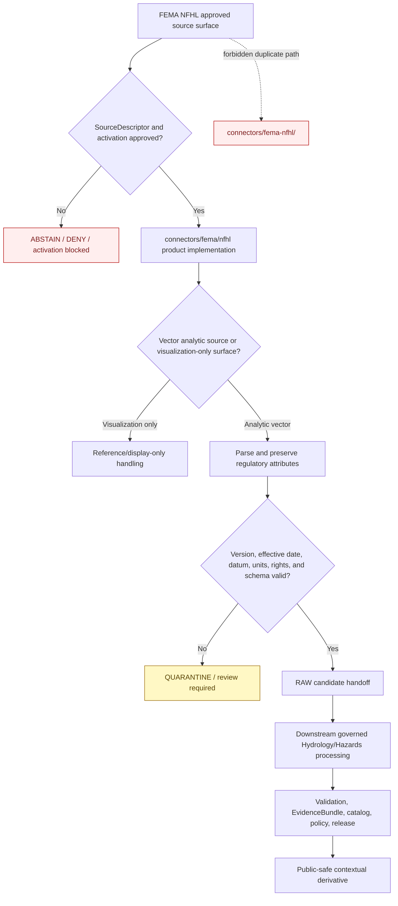

<!-- [KFM_META_BLOCK_V2]
doc_id: kfm://doc/connectors-fema-nfhl-readme
title: connectors/fema-nfhl/ — FEMA NFHL Compatibility Pointer
type: readme
version: v0.2
status: draft
owners: OWNER_TBD — Connector steward · FEMA source steward · NFHL product steward · Hydrology steward · Hazards steward · Rights reviewer · Validation steward · Docs steward
created: 2026-06-18
updated: 2026-07-11
policy_label: public-context-only; compatibility-lane; noncanonical-path; fema-family-product-lane; regulatory-context; not-for-life-safety; no-code; no-activation; no-publication
proposed_path: connectors/fema-nfhl/README.md
truth_posture: CONFIRMED compatibility README / NONCANONICAL flat path / preferred nested product lane CONFIRMED at connectors/fema/nfhl / implementation ABSENT here
related:
  - ../README.md
  - ../fema/README.md
  - ../fema/pyproject.toml
  - ../fema/nfhl/README.md
  - ../fema/src/README.md
  - ../fema/src/fema/README.md
  - ../fema/tests/README.md
  - ../../docs/sources/catalog/fema/README.md
  - ../../docs/sources/catalog/fema/nfhl-flood-hazard.md
  - ../../docs/sources/catalog/fema/map-service-center.md
  - ../../docs/domains/hydrology/README.md
  - ../../docs/domains/hydrology/CANONICAL_PATHS.md
  - ../../docs/domains/hydrology/SOURCE_REGISTRY.md
  - ../../docs/domains/hazards/README.md
  - ../../docs/domains/hazards/SOURCE_REGISTRY.md
  - ../../data/raw/hydrology/fema_nfhl/README.md
  - ../../data/raw/hazards/nfhl/README.md
  - ../../pipelines/domains/hydrology/ingest_nfhl/README.md
  - ../../tools/ingest/nfhl_watch/README.md
  - ../../data/registry/sources/
  - ../../data/quarantine/hydrology/
  - ../../data/quarantine/hazards/
  - ../../policy/sensitivity/
  - ../../release/
tags: [kfm, connectors, fema, nfhl, compatibility, noncanonical, floodplain, flood-hazard, hydrology, hazards, regulatory-context, raw, quarantine, governance]
notes:
  - "The live repository contains the FEMA family connector scaffold at connectors/fema/ and an NFHL product lane at connectors/fema/nfhl/."
  - "The FEMA NFHL source catalog, watcher documentation, connector tests, and RAW-lane references point toward the nested FEMA-family product structure rather than this flat split path."
  - "This path contains documentation only and must not accumulate connector code, package metadata, descriptors, fixtures, tests, credentials, activation state, caches, or independent source-admission behavior."
  - "NFHL is regulatory flood-hazard context, not observed inundation, forecast, warning, legal or insurance determination, engineering certification, or life-safety guidance."
  - "The preferred nested FEMA lane is itself greenfield; redirecting implementation there does not prove source activation, endpoint verification, passing tests, rights closure, or production readiness."
[/KFM_META_BLOCK_V2] -->

<a id="top"></a>

# FEMA NFHL Compatibility Pointer

> Noncanonical compatibility README for the flat `connectors/fema-nfhl/` path. FEMA connector work is organized under the FEMA source-family lane, with the NFHL product surface at [`connectors/fema/nfhl/`](../fema/nfhl/README.md). This directory must remain documentation-only unless an accepted ADR explicitly changes the connector structure.

<p>
  
  
  
  
  
</p>

`connectors/fema-nfhl/`

> [!IMPORTANT]
> **Confirmed state:** this flat path contains this README only. The repository also contains the FEMA family scaffold at `connectors/fema/` and the product-specific NFHL documentation lane at `connectors/fema/nfhl/`. Do not add code, package metadata, descriptors, tests, fixtures, credentials, endpoint configuration, caches, activation records, or runtime behavior here.

**Quick jumps:** [Purpose](#purpose) · [Placement decision](#placement-decision) · [Verified repository state](#verified-repository-state) · [Evidence ledger](#evidence-ledger) · [Compatibility responsibilities](#compatibility-responsibilities) · [Forbidden responsibilities](#forbidden-responsibilities) · [Preferred FEMA product lane](#preferred-fema-product-lane) · [NFHL source posture](#nfhl-source-posture) · [Authority boundary](#authority-boundary) · [Analytics versus visualization](#analytics-versus-visualization) · [Regulatory and life-safety boundary](#regulatory-and-life-safety-boundary) · [Lifecycle boundary](#lifecycle-boundary) · [Required metadata preservation](#required-metadata-preservation) · [Migration and deprecation](#migration-and-deprecation) · [Review and rollback](#review-and-rollback) · [Definition of done](#definition-of-done) · [Verification backlog](#verification-backlog)

---

## Purpose

This README prevents a historical or generated flat NFHL path from becoming a second FEMA connector authority.

It provides:

- a clear pointer to the FEMA family and nested NFHL product lane;
- a record of why parallel implementation is prohibited;
- NFHL-specific regulatory, datum, version, and life-safety warnings for maintainers following old links;
- migration guidance for references that still name `connectors/fema-nfhl/`;
- protection against connector-to-RAW, connector-to-publication, or visualization-to-analytics shortcuts.

This path does not host a connector implementation and does not authorize source activation.

[Back to top ↑](#top)

---

## Placement decision

Current repository evidence favors the nested FEMA family/product structure.

| Question | Decision | Evidence posture |
|---|---|---:|
| What is the FEMA connector family home? | `connectors/fema/` | FEMA source-catalog documents link to this family path, and the live scaffold exists. |
| Where is the NFHL product lane? | `connectors/fema/nfhl/` | The live path exists; NFHL source, watcher, test, and RAW documentation reference the nested product structure. |
| What is `connectors/fema-nfhl/`? | **Noncanonical compatibility pointer.** | It is a flat split path containing documentation only. |
| May implementation be duplicated in both paths? | **No.** | Duplication would split product identity, endpoint behavior, version tracking, datum controls, tests, activation state, and rollback. |
| Can this decision change? | Only through an accepted ADR or migration decision. | Until then, the FEMA family/product structure is the preferred implementation boundary. |

> [!CAUTION]
> Directory presence is not authority. A generated skeleton, legacy link, or convenient flat name does not justify a second connector implementation.

[Back to top ↑](#top)

---

## Verified repository state

The following relationship is confirmed on the repository's `main` branch at the time of this update:

```text
connectors/
├── fema-nfhl/
│   └── README.md                         # this compatibility pointer
└── fema/                                 # FEMA source-family scaffold
    ├── README.md
    ├── pyproject.toml                    # greenfield placeholder
    ├── nfhl/
    │   └── README.md                     # preferred NFHL product lane
    ├── src/
    │   ├── README.md
    │   └── fema/
    │       └── README.md
    └── tests/
        └── README.md
```

### Current maturity

| Surface | Confirmed content | Maturity |
|---|---|---:|
| `connectors/fema-nfhl/README.md` | This compatibility and migration boundary. | **DOCUMENTED / NONCANONICAL** |
| Other files below `connectors/fema-nfhl/` | None confirmed. | **ABSENT** |
| `connectors/fema/README.md` | FEMA source-family connector contract. | **DOCUMENTED** |
| `connectors/fema/pyproject.toml` | Project name `kfm-connector-fema`; version `0.0.0`. | **PLACEHOLDER** |
| `connectors/fema/nfhl/README.md` | NFHL product-lane contract. | **DOCUMENTED / IMPLEMENTATION UNPROVED** |
| `connectors/fema/src/` | Source-root and package documentation. | **DOCUMENTED / IMPLEMENTATION UNPROVED** |
| `connectors/fema/tests/README.md` | Connector-family test expectations. | **DOCUMENTED / TEST COVERAGE UNPROVED** |
| Live NFHL endpoint access | None confirmed by this update. | **NOT ACTIVATED / UNKNOWN** |
| Accepted NFHL SourceDescriptor | Not confirmed by this update. | **NEEDS VERIFICATION** |
| Passing connector CI evidence | None confirmed. | **UNKNOWN** |

> [!WARNING]
> The preferred `connectors/fema/nfhl/` lane is also greenfield. Redirecting implementation there does not mean the connector is operational, endpoint-verified, activated, rights-cleared, tested, or publication-ready.

[Back to top ↑](#top)

---

## Evidence ledger

| Evidence | Status | Supports | Does not support |
|---|---:|---|---|
| `docs/sources/catalog/fema/nfhl-flood-hazard.md` | **CONFIRMED draft product profile** | FEMA family placement, NFHL regulatory role, nested product-path verification question, analytics/visualization split, required regulatory attributes. | Current endpoint values, activation, or implementation maturity. |
| `connectors/fema/` tree | **CONFIRMED greenfield scaffold** | FEMA family connector home, package placeholder, source documentation, test documentation, and nested NFHL product lane exist. | Runnable connector, installed package, or passing tests. |
| `connectors/fema/nfhl/README.md` | **CONFIRMED product documentation** | NFHL-specific connector responsibilities and RAW/QUARANTINE boundary are documented. | Implemented client, parser, downloader, watcher integration, or activation. |
| `connectors/fema-nfhl/README.md` | **CONFIRMED compatibility file** | The flat path exists and can redirect old references. | Independent connector authority. |
| `tools/ingest/nfhl_watch/README.md` | **CONFIRMED documentation** | NFHL change-detection work is associated with the FEMA/NFHL product context. | Executable watcher or approved polling cadence. |
| `pipelines/domains/hydrology/ingest_nfhl/README.md` | **CONFIRMED documentation** | NFHL has a downstream hydrology ingest responsibility separate from source access. | Connector implementation or publication approval. |
| `data/raw/hydrology/fema_nfhl/README.md` and `data/raw/hazards/nfhl/README.md` | **CONFIRMED RAW-lane documentation** | Domain-routed RAW destinations exist in documentation. | Admitted payloads, receipts, or promotion readiness. |

[Back to top ↑](#top)

---

## Compatibility responsibilities

This path may contain only compatibility-oriented documentation that helps maintainers move from flat historical references to canonical FEMA family/product locations.

Allowed content:

- this README;
- a minimal deprecation or tombstone notice;
- migration inventories and backlink-cleanup notes;
- correction notes explaining why the flat path is noncanonical;
- links to the FEMA family connector, NFHL product connector, source catalog, RAW lanes, pipelines, policies, and release documentation;
- a machine-readable redirect manifest only if a repository standard explicitly defines and validates one.

Every artifact here must remain:

- non-executable;
- non-authoritative;
- reversible;
- explicit about the preferred destination;
- free of source payloads, credentials, endpoint secrets, activation state, and public claims.

[Back to top ↑](#top)

---

## Forbidden responsibilities

Do not add the following beneath `connectors/fema-nfhl/`:

```text
FORBIDDEN HERE:
  connector client code
  ArcGIS REST request builders
  WFS, WMS, WMTS, or FeatureServer access code
  bulk-download or archive extraction code
  response parsers or feature normalizers
  package metadata or importable modules
  SourceDescriptor records or activation decisions
  API credentials, tokens, cookies, or secrets
  endpoint configuration with runtime authority
  source payloads, caches, bulk packages, or extracted features
  connector fixtures or test suites
  watcher, retry, backoff, rate-limit, or polling logic
  datum, projection, elevation, or regulatory-attribute transforms
  RAW or QUARANTINE writers
  processed, catalog, triplet, proof, receipt, release, or publication writers
  public maps, tiles, APIs, dashboards, reports, stories, or generated-answer payloads
```

Adding those files would create parallel authority and should be rejected or migrated to the appropriate FEMA, domain, lifecycle, policy, test, pipeline, or release lane.

[Back to top ↑](#top)

---

## Preferred FEMA product lane

All NFHL source-admission implementation should be coordinated through:

```text
connectors/fema/
├── README.md
├── nfhl/
│   └── README.md
├── src/
│   └── fema/
└── tests/
```

The exact implementation split inside the FEMA package remains open. A future implementation may use product-specific modules such as:

```text
connectors/fema/src/fema/
├── nfhl/
│   ├── client.py
│   ├── bulk.py
│   ├── parse.py
│   ├── validate.py
│   ├── handoff.py
│   └── errors.py
```

That module map is **PROPOSED**, not implementation evidence. It should be adopted only when package conventions, product identity, endpoint strategy, contracts, fixtures, tests, and ownership are resolved.

[Back to top ↑](#top)

---

## NFHL source posture

KFM treats NFHL as **regulatory flood-hazard context**.

NFHL may support downstream claims about:

- issued flood-hazard zones;
- Special Flood Hazard Areas;
- source-carried base-flood-elevation features when datum and units are known;
- FIRM panel and study lineage;
- regulatory effective dates and version identifiers;
- exposure-context overlays after governed processing and release.

NFHL does not by itself prove:

- that flooding is occurring now;
- the observed extent or depth of a past flood;
- a forecast or warning;
- that a site is safe;
- that a property is insurable or insurance is required;
- a legal interpretation or compliance determination;
- an engineering certification;
- eligibility for assistance, financing, permits, or benefits.

The connector preserves source-issued context. It does not reinterpret it into a determination.

[Back to top ↑](#top)

---

## Authority boundary

```text
THE PREFERRED NFHL CONNECTOR MAY EVENTUALLY:
  retrieve approved NFHL analytic source surfaces
  capture approved bulk-package metadata
  preserve product, feature-class, panel, study, and jurisdiction identity
  preserve DFIRM_ID, VERSION_ID, EFFECTIVE_DATE, zone, datum, units, and lineage
  distinguish analytic vector sources from visualization-only services
  detect schema, version, datum, completeness, and source-shape drift
  emit finite error, abstention, review, or quarantine outcomes
  prepare RAW-or-QUARANTINE handoff material

THIS COMPATIBILITY PATH MUST NOT:
  perform any of those operations
  establish flood-event truth
  issue forecasts or warnings
  make insurance, legal, engineering, eligibility, or life-safety determinations
  define source descriptors, schemas, policies, or release decisions
  write lifecycle data
  serve public clients
```

[Back to top ↑](#top)

---

## Analytics versus visualization

NFHL source documentation establishes a critical separation:

| Surface class | Allowed KFM use | Prohibited use |
|---|---|---|
| Analytic vector source | Governed feature retrieval, validation, transformation, and downstream spatial analysis after activation. | Direct public use from connector or RAW storage. |
| WMS or other visualization surface | Human reference or display support where permitted and accurately labeled. | Analytical joins, geometry truth extraction, feature-level regulatory analysis, or replacement for vector source data. |
| Bulk package or authoritative archive | Immutable RAW capture after descriptor and admission gates. | Silent overwrite, unversioned extraction, or publication without downstream closure. |
| Derived tiles or PMTiles | Released visualization only after validation, generalization/redaction, catalog closure, and release approval. | Evidence substitution or life-safety determination. |

> [!CAUTION]
> A rendered image is not an analytic vector dataset. Connector or pipeline code must not derive regulatory geometry from a visualization-only surface when the governed analytic source is required.

[Back to top ↑](#top)

---

## Regulatory and life-safety boundary

> [!WARNING]
> NFHL is not a real-time flood feed, forecast, warning service, emergency instruction, insurance ruling, legal opinion, engineering certification, or site-safety determination.

Minimum posture:

1. Preserve source regulatory attributes verbatim where required.
2. Preserve `DFIRM_ID`, `VERSION_ID`, `EFFECTIVE_DATE`, flood-zone designation, study references, and revision lineage where available.
3. Preserve coordinate reference system, horizontal datum, vertical datum, elevation units, and transformation history where applicable.
4. Block base-flood-elevation engineering claims when vertical datum or units are missing.
5. Block stale or unversioned regulatory claims when effective date or version identity is absent.
6. Do not convert NFHL zones into observed inundation, model output, or future flood predictions.
7. Prevent export language resembling an insurance, legal, permit, compliance, eligibility, or property-specific determination.
8. Direct emergency and life-safety decisions to current official FEMA, NWS, state, and local emergency channels.
9. Treat maps, tiles, AI summaries, vector indexes, and generated explanations as downstream carriers, not sovereign truth.

[Back to top ↑](#top)

---

## Lifecycle boundary

The compatibility path performs no lifecycle action.

The preferred future flow is:



The diagram defines responsibility boundaries. It does not prove that endpoint access, parsing, handoff, downstream validation, or release is implemented.

KFM lifecycle discipline remains:

```text
RAW -> WORK / QUARANTINE -> PROCESSED -> CATALOG / TRIPLET -> PUBLISHED
```

[Back to top ↑](#top)

---

## Required metadata preservation

A future NFHL connector must preserve the source fields needed to identify the regulatory vintage and interpret geometry safely.

Minimum preservation targets, subject to current upstream verification:

| Metadata family | Examples | Failure posture |
|---|---|---|
| Product identity | FEMA, NFHL, service or bulk product identifier | Missing identity blocks admission. |
| Feature identity | Feature class, object ID, panel or study reference | Missing identity routes to quarantine or rejection. |
| Regulatory vintage | `VERSION_ID`, `EFFECTIVE_DATE`, revision lineage | Missing or unparseable values block regulatory claims. |
| Regulatory attributes | `DFIRM_ID`, flood zone, study references, BFE fields where present | Do not normalize away source-issued meaning. |
| Spatial reference | CRS, horizontal datum, vertical datum, units | Unknown datum or units blocks engineering/elevation use. |
| Retrieval lineage | Source URI, query or package identity, retrieval time, checksum, parser version | Missing lineage blocks promotion-track use. |
| Surface class | Analytic vector, visualization-only, bulk archive, derived display | Surface-class ambiguity routes to review. |
| Source role | `regulatory` for admitted NFHL product | Must not collapse into observed, modeled, or warning roles. |
| Intended lifecycle target | RAW or QUARANTINE | Any downstream direct-write target is invalid. |

[Back to top ↑](#top)

---

## Migration and deprecation

The preferred long-term state is that all NFHL connector references point to the FEMA family/product structure.

Migration sequence:

1. inventory references to `connectors/fema-nfhl/`;
2. classify each reference as documentation, code, configuration, workflow, test, fixture, registry, pipeline, RAW lane, or generated skeleton;
3. replace connector-implementation references with `connectors/fema/nfhl/` or the accepted package module under `connectors/fema/src/fema/`;
4. keep hydrology and hazards behavior in their domain responsibility lanes;
5. verify no import, package, workflow, CI, watcher, registry, pipeline, or release path depends on this flat directory;
6. update templates and skeleton maps so they stop recreating the split path;
7. choose an explicit end state.

| End state | Use when |
|---|---|
| Retained compatibility pointer | Historical links remain common and the pointer prevents duplicate implementation. |
| Minimal tombstone README | Most navigation has moved but old links still need an explanation. |
| Directory removal | All backlinks are corrected, no tooling depends on the path, and removal is reviewed. |
| ADR-authorized flat connector | Only if an accepted ADR deliberately chooses the flat path and includes ownership, migration, tests, activation, and rollback plans. |

Do not remove the path merely for cosmetic cleanliness while unresolved references still depend on it.

[Back to top ↑](#top)

---

## Review and rollback

Review every change under `connectors/fema-nfhl/` as a placement-sensitive and life-safety-adjacent documentation change.

A reviewer should confirm:

- the change is documentation-only;
- the preferred FEMA/NFHL destination is correct;
- no connector implementation or source activation is implied;
- NFHL remains regulatory context rather than observed flooding;
- analytic-vector and visualization-only surfaces remain distinct;
- version, effective-date, datum, units, and regulatory-attribute requirements remain explicit;
- no public client is directed to connector, RAW, WORK, or QUARANTINE material;
- no text resembles an insurance, legal, engineering, eligibility, warning, or life-safety determination.

Rollback is required if a change:

- adds executable code or package metadata here;
- creates a parallel SourceDescriptor or activation state;
- duplicates FEMA tests, fixtures, endpoint configuration, or watcher logic;
- weakens regulatory-vintage, datum, or visualization/analytics safeguards;
- presents NFHL as observed or predictive flood truth;
- claims this flat path is canonical without an accepted decision;
- enables direct publication or public-client access.

Rollback procedure:

1. revert the offending change;
2. move legitimate NFHL source work to `connectors/fema/nfhl/` or the accepted FEMA package module;
3. move legitimate domain processing to Hydrology or Hazards responsibility lanes;
4. repair links, imports, workflows, and configuration;
5. record any placement, source-role, datum, version, or life-safety drift;
6. confirm this directory contains compatibility documentation only.

[Back to top ↑](#top)

---

## Definition of done

This compatibility pointer is complete for its current role when:

- [x] The FEMA family and nested NFHL product lane are identified.
- [x] The flat path is labeled noncanonical and documentation-only.
- [x] Parallel implementation is explicitly forbidden.
- [x] NFHL regulatory, analytics/visualization, datum, version, and life-safety boundaries are preserved.
- [x] The RAW-or-QUARANTINE connector boundary is explicit.
- [ ] All references to `connectors/fema-nfhl/` are inventoried.
- [ ] Implementation references are migrated to the FEMA family/product lane.
- [ ] Templates and skeleton maps stop generating the flat path.
- [ ] The FEMA package layout and NFHL module home are accepted.
- [ ] A retained-pointer, tombstone, removal, or ADR decision is recorded.
- [ ] Repository validation rejects executable files beneath this compatibility path, if such a validator is adopted.

[Back to top ↑](#top)

---

## Verification backlog

| Item | Status | Needed evidence |
|---|---:|---|
| Inventory every backlink to `connectors/fema-nfhl/`. | **NEEDS VERIFICATION** | Repository-wide path search and generated-template review. |
| Confirm no hidden or unindexed executable files exist below this path. | **NEEDS CONTINUOUS VERIFICATION** | Repository tree inspection. |
| Confirm the accepted NFHL implementation module under `connectors/fema/`. | **OPEN DECISION** | Package design, ownership, tests, and migration review. |
| Confirm accepted NFHL SourceDescriptor ID and registry home. | **NEEDS VERIFICATION** | Source registry record, schema validation, and activation decision. |
| Confirm current analytic vector endpoint and feature-class inventory. | **NEEDS VERIFICATION** | Source-steward review against current FEMA service metadata. |
| Confirm bulk-download strategy and Map Service Center relationship. | **NEEDS VERIFICATION** | Product review, source terms, and ingestion design. |
| Confirm WMS/visualization-only surface handling. | **NEEDS VERIFICATION** | Source profile, connector implementation, and negative tests. |
| Confirm current rights, attribution, and redistribution posture. | **NEEDS VERIFICATION** | Terms snapshot and rights review. |
| Confirm regulatory attribute, version, effective-date, CRS, datum, and units validation. | **NEEDS VERIFICATION** | Contracts, schemas, fixtures, validators, and test logs. |
| Confirm RAW routing between Hydrology and Hazards consumers. | **NEEDS VERIFICATION** | Descriptor/handoff contract and domain pipeline tests. |
| Confirm no-network fixtures and connector test coverage. | **NEEDS VERIFICATION** | Test inventory and passing evidence. |
| Confirm CI enforcement of connector-output and compatibility-path boundaries. | **UNKNOWN** | Workflows, validators, branch policy, and successful runs. |
| Decide whether this pointer remains, becomes a tombstone, or is removed. | **OPEN DECISION** | Backlink cleanup and maintainer review. |

---

## Maintainer note

Keep `connectors/fema-nfhl/` boring and non-executable. Its value is preventing a flat historical path from becoming a second source of connector truth. Build FEMA access once under the FEMA family/product lane, preserve NFHL as regulatory context, route admitted material only to RAW or QUARANTINE, and publish only through governed downstream evidence and release surfaces.

[Back to top ↑](#top)
