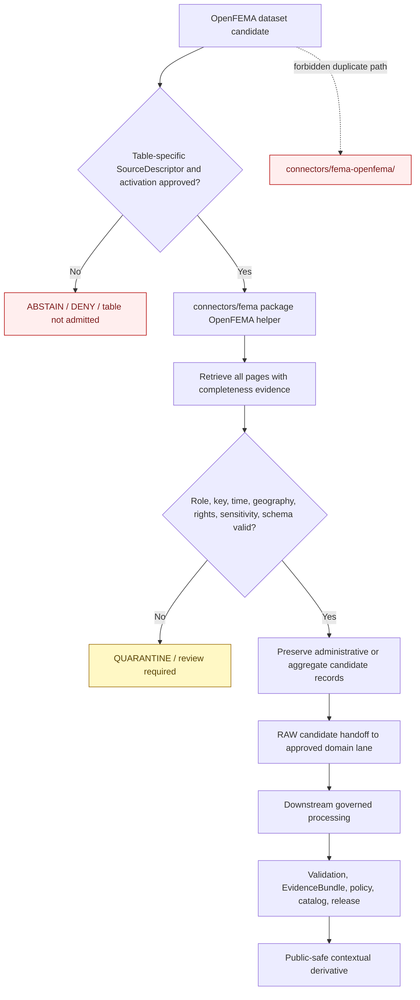

<!-- [KFM_META_BLOCK_V2]
doc_id: kfm://doc/connectors-fema-openfema-readme
title: connectors/fema-openfema/ — OpenFEMA Compatibility Pointer
type: readme
version: v0.2
status: draft
owners: OWNER_TBD — Connector steward · FEMA source steward · OpenFEMA product steward · Hazards steward · Settlements/Infrastructure steward · Privacy/sensitivity reviewer · Rights reviewer · Validation steward · Docs steward
created: 2026-06-18
updated: 2026-07-11
policy_label: public-context-administrative; compatibility-lane; noncanonical-path; fema-family-package; per-table-admission; privacy-reviewed; not-for-life-safety; no-code; no-activation; no-publication
proposed_path: connectors/fema-openfema/README.md
truth_posture: CONFIRMED compatibility README / NONCANONICAL flat path / preferred FEMA family package CONFIRMED at connectors/fema / OpenFEMA implementation ABSENT or UNPROVED
related:
  - ../README.md
  - ../fema/README.md
  - ../fema/pyproject.toml
  - ../fema/src/README.md
  - ../fema/src/fema/README.md
  - ../fema/tests/README.md
  - ../../docs/sources/catalog/fema/README.md
  - ../../docs/sources/catalog/fema/openfema-disaster-declarations.md
  - ../../docs/sources/catalog/fema/openfema-auxiliary-tables.md
  - ../../docs/sources/catalog/fema/nfip-claim-policy-aggregates.md
  - ../../docs/domains/hazards/README.md
  - ../../docs/domains/hazards/SOURCES.md
  - ../../docs/domains/hazards/SOURCE_REGISTRY.md
  - ../../docs/domains/settlements-infrastructure/README.md
  - ../../data/registry/hazards/sources/fema_disaster_declarations.yaml
  - ../../data/raw/hazards/fema/README.md
  - ../../tools/ingest/fema_decl_watch/README.md
  - ../../data/registry/sources/
  - ../../data/raw/
  - ../../data/quarantine/
  - ../../policy/sensitivity/
  - ../../release/
tags: [kfm, connectors, fema, openfema, compatibility, noncanonical, disaster-declarations, administrative, aggregate, per-table-admission, hazards, settlements-infrastructure, raw, quarantine, governance]
notes:
  - "The live repository contains the FEMA source-family connector scaffold at connectors/fema/, whose package README explicitly proposes OpenFEMA handling within the shared FEMA package."
  - "No nested connectors/fema/openfema/ directory is confirmed; the exact module split inside connectors/fema/src/fema/ remains an implementation decision."
  - "This flat path contains documentation only and must not accumulate connector code, package metadata, SourceDescriptors, fixtures, tests, credentials, activation state, caches, or independent source-admission behavior."
  - "OpenFEMA is a family of heterogeneous datasets. Disaster Declarations are administrative records; auxiliary datasets may be administrative or aggregate and require separate descriptors, roles, sensitivity reviews, and activation decisions."
  - "OpenFEMA records are not observed hazard events, forecasts, warnings, damage assessments, eligibility decisions, or life-safety guidance."
[/KFM_META_BLOCK_V2] -->

<a id="top"></a>

# OpenFEMA Compatibility Pointer

> Noncanonical compatibility README for the flat `connectors/fema-openfema/` path. OpenFEMA source-admission work belongs within the FEMA source-family connector at [`connectors/fema/`](../fema/README.md), with product- and table-specific behavior implemented under the accepted FEMA package structure. This directory must remain documentation-only unless an accepted ADR explicitly chooses a different connector layout.

<p>
  
  
  
  
  
  
</p>

`connectors/fema-openfema/`

> [!IMPORTANT]
> **Confirmed state:** this flat path contains this README only. The live repository contains the FEMA family scaffold at `connectors/fema/`, and its package documentation proposes OpenFEMA behavior inside the shared `fema` Python package. Do not add code, package metadata, descriptors, tests, fixtures, credentials, endpoint configuration, caches, activation records, or runtime behavior here.

**Quick jumps:** [Purpose](#purpose) · [Placement decision](#placement-decision) · [Verified repository state](#verified-repository-state) · [Evidence ledger](#evidence-ledger) · [Compatibility responsibilities](#compatibility-responsibilities) · [Forbidden responsibilities](#forbidden-responsibilities) · [Preferred FEMA package lane](#preferred-fema-package-lane) · [OpenFEMA source posture](#openfema-source-posture) · [Per-table admission contract](#per-table-admission-contract) · [Source-role anti-collapse](#source-role-anti-collapse) · [Pagination freshness and drift](#pagination-freshness-and-drift) · [Privacy sensitivity and aggregation](#privacy-sensitivity-and-aggregation) · [Authority boundary](#authority-boundary) · [Lifecycle boundary](#lifecycle-boundary) · [Testing relationship](#testing-relationship) · [Migration and deprecation](#migration-and-deprecation) · [Review and rollback](#review-and-rollback) · [Definition of done](#definition-of-done) · [Verification backlog](#verification-backlog)

---

## Purpose

This README prevents the historical or generated flat OpenFEMA path from becoming a second FEMA connector authority.

It provides:

- a clear pointer to the FEMA source-family connector;
- a record of why parallel implementation is prohibited;
- a table-by-table admission boundary for OpenFEMA datasets;
- source-role, privacy, aggregation, pagination, and life-safety guardrails;
- migration guidance for references that still name `connectors/fema-openfema/`;
- protection against administrative-to-observed, aggregate-to-individual, connector-to-publication, and watcher-to-publisher shortcuts.

This path does not host a connector implementation, admit an OpenFEMA table, or authorize source activation.

[Back to top ↑](#top)

---

## Placement decision

Current repository evidence favors one FEMA family connector with product-specific behavior inside the shared package.

| Question | Decision | Evidence posture |
|---|---|---:|
| What is the FEMA connector home? | `connectors/fema/` | FEMA source-catalog pages link to that path, and the live family scaffold exists. |
| Is there a confirmed nested `connectors/fema/openfema/` lane? | **No.** | No such repository path was found during this update. |
| Where should OpenFEMA implementation live? | Under the accepted `connectors/fema/src/fema/` package structure. | The FEMA package README proposes an `openfema.py` responsibility and product/table dispatch inside the shared package. |
| What is `connectors/fema-openfema/`? | **Noncanonical compatibility pointer.** | It is a flat split path containing documentation only. |
| May implementation be duplicated in this path and `connectors/fema/`? | **No.** | Duplication would split table identity, roles, descriptors, pagination, privacy rules, tests, activation state, and rollback. |
| Can placement change? | Only through an accepted ADR or migration decision. | Until then, the FEMA family package is the preferred implementation boundary. |

> [!CAUTION]
> Directory presence is not authority. A generated skeleton, legacy link, or convenient flat name does not justify a second connector implementation.

[Back to top ↑](#top)

---

## Verified repository state

The following relationship is confirmed on the repository's `main` branch at the time of this update:

```text
connectors/
├── fema-openfema/
│   └── README.md                         # this compatibility pointer
└── fema/                                 # FEMA source-family scaffold
    ├── README.md
    ├── pyproject.toml                    # greenfield placeholder
    ├── nfhl/
    │   └── README.md
    ├── src/
    │   ├── README.md
    │   └── fema/
    │       └── README.md                 # proposes OpenFEMA package responsibility
    └── tests/
        └── README.md
```

### Current maturity

| Surface | Confirmed content | Maturity |
|---|---|---:|
| `connectors/fema-openfema/README.md` | This compatibility and migration boundary. | **DOCUMENTED / NONCANONICAL** |
| Other files below `connectors/fema-openfema/` | None confirmed. | **ABSENT** |
| `connectors/fema/README.md` | FEMA family connector contract. | **DOCUMENTED** |
| `connectors/fema/pyproject.toml` | Project name `kfm-connector-fema`; version `0.0.0`. | **PLACEHOLDER** |
| `connectors/fema/src/fema/README.md` | Proposes product dispatch and an OpenFEMA parser responsibility. | **DOCUMENTED / IMPLEMENTATION UNPROVED** |
| OpenFEMA implementation modules | None confirmed by this update. | **ABSENT / UNPROVED** |
| `connectors/fema/tests/README.md` | Describes OpenFEMA source-role, pagination, per-table, and failure tests. | **DOCUMENTED / TEST COVERAGE UNPROVED** |
| Accepted Disaster Declarations descriptor | A greenfield template exists with unresolved fields. | **PROPOSED / BLOCKED** |
| Accepted auxiliary-table descriptors | None confirmed by this update. | **ABSENT / NEEDS VERIFICATION** |
| Live OpenFEMA access | None confirmed by this update. | **NOT ACTIVATED / UNKNOWN** |
| Passing connector CI evidence | None confirmed. | **UNKNOWN** |

> [!WARNING]
> The preferred `connectors/fema/` lane is also greenfield. Redirecting implementation there does not mean OpenFEMA access is operational, endpoint-verified, activated, privacy-reviewed, tested, or publication-ready.

[Back to top ↑](#top)

---

## Evidence ledger

| Evidence | Status | Supports | Does not support |
|---|---:|---|---|
| `docs/sources/catalog/fema/openfema-disaster-declarations.md` | **CONFIRMED draft product profile** | Disaster Declarations are `administrative`, bind to `DisasterDeclaration`, and must not become observed hazard events. | Current endpoint, schema, activation, or implementation maturity. |
| `docs/sources/catalog/fema/openfema-auxiliary-tables.md` | **CONFIRMED draft family profile** | Auxiliary tables are heterogeneous; each needs a separate descriptor, role, rights snapshot, sensitivity tier, cadence, and decision. | Admission of any specific table. |
| `connectors/fema/` tree | **CONFIRMED greenfield scaffold** | FEMA family home, package placeholder, product documentation, and test documentation exist. | Runnable connector, installed package, or passing tests. |
| `connectors/fema/src/fema/README.md` | **CONFIRMED documentation** | Shared FEMA package is expected to dispatch OpenFEMA product/table helpers and preserve administrative or aggregate roles. | Implemented `openfema.py`, pagination, parser, or handoff behavior. |
| `connectors/fema/tests/README.md` | **CONFIRMED documentation** | Required tests include per-table admission, role preservation, pagination, freshness, aggregation, and drift. | Executable tests or passing results. |
| `data/registry/hazards/sources/fema_disaster_declarations.yaml` | **CONFIRMED greenfield template** | A candidate descriptor identity exists for Disaster Declarations. | Approved role, authority, rights, sensitivity, cadence, access, or activation. |
| `tools/ingest/fema_decl_watch/README.md` | **CONFIRMED documentation** | A declaration watcher boundary exists for review signals only. | Executable watcher, connector authority, or publication power. |
| `connectors/fema-openfema/README.md` | **CONFIRMED compatibility file** | The flat path can redirect old references and carry migration warnings. | Independent connector authority. |

[Back to top ↑](#top)

---

## Compatibility responsibilities

This path may contain only compatibility-oriented documentation that helps maintainers move from flat historical references to the FEMA family package.

Allowed content:

- this README;
- a minimal deprecation or tombstone notice;
- migration inventories and backlink-cleanup notes;
- correction notes explaining why the flat path is noncanonical;
- links to FEMA family connector docs, OpenFEMA product profiles, registry templates, RAW lanes, watcher docs, tests, policies, and release documentation;
- a machine-readable redirect manifest only if a repository standard explicitly defines and validates one.

Every artifact here must remain:

- non-executable;
- non-authoritative;
- reversible;
- explicit about the preferred destination;
- free of source payloads, credentials, endpoint secrets, activation state, personal data, and public claims.

[Back to top ↑](#top)

---

## Forbidden responsibilities

Do not add the following beneath `connectors/fema-openfema/`:

```text
FORBIDDEN HERE:
  OpenFEMA client or request code
  endpoint, dataset-slug, or API-version configuration with runtime authority
  pagination, retry, backoff, rate-limit, or freshness logic
  response parsers or table normalizers
  package metadata or importable modules
  SourceDescriptor records or activation decisions
  API credentials, tokens, cookies, or secrets
  source payloads, caches, exports, or downloaded tables
  connector fixtures or test suites
  declaration or auxiliary-table watcher code
  privacy, PII, sensitivity, or rights policy implementations
  aggregation or de-identification implementations
  RAW or QUARANTINE writers
  processed, catalog, triplet, proof, receipt, release, or publication writers
  emergency alerts, eligibility tools, damage assessments, public dashboards, maps, reports, stories, or generated-answer payloads
```

Adding those files would create parallel authority and should be rejected or migrated to the appropriate FEMA package, domain, lifecycle, policy, test, tooling, or release lane.

[Back to top ↑](#top)

---

## Preferred FEMA package lane

All OpenFEMA source-admission implementation should be coordinated through:

```text
connectors/fema/
├── README.md
├── src/
│   └── fema/
│       └── README.md
└── tests/
    └── README.md
```

The exact package split remains open. A minimal implementation might begin with a single product module:

```text
connectors/fema/src/fema/
├── openfema.py
└── ...
```

A larger implementation may justify a table-family subpackage:

```text
connectors/fema/src/fema/openfema/
├── __init__.py
├── client.py
├── pagination.py
├── declarations.py
├── auxiliary.py
├── aggregates.py
├── validate.py
├── handoff.py
└── errors.py
```

Both maps are **PROPOSED**, not implementation evidence. Select one only after package conventions, table identities, descriptors, endpoint strategy, pagination contracts, fixtures, tests, privacy ownership, and maintenance boundaries are resolved.

Do not create a nested `connectors/fema/openfema/` documentation or code lane merely to mirror the flat path unless the repository adopts that product-folder convention explicitly.

[Back to top ↑](#top)

---

## OpenFEMA source posture

OpenFEMA is a distribution family for multiple FEMA administrative and aggregate datasets. It is not one uniform source product.

### Disaster Declarations

The Disaster Declarations dataset is treated as an **administrative** source for the Hazards-domain `DisasterDeclaration` object family.

It may support downstream claims that FEMA issued or amended a declaration with specified:

- declaration number and type;
- declaration date;
- incident period;
- designated jurisdictions;
- FEMA-issued disaster title or incident category;
- program-authority fields carried by the source.

It does not by itself prove:

- that a physical hazard occurred at a specific place or time;
- observed flood, fire, tornado, storm, earthquake, or damage extent;
- that aid applies to a particular person, household, property, or organization;
- that a location is safe;
- a forecast, warning, damage assessment, or life-safety instruction.

### Auxiliary tables

OpenFEMA auxiliary datasets may describe registrations, projects, grants, mission assignments, costs, mitigated properties, program activity, or aggregates.

Their roles vary:

| Table shape | Expected source role | Required guardrail |
|---|---|---|
| Row records a federal action, award, project, registration, or assignment | `administrative` | Do not convert to observed event or on-the-ground truth. |
| Row reports counts, totals, rates, or rollups | `aggregate` | Preserve `role_aggregation_unit`; do not infer individual or site-specific facts. |
| Table carries household, applicant, address, property, or precise infrastructure fields | `administrative` with elevated sensitivity review | Restrict, generalize, quarantine, or deny according to reviewed policy. |
| Dataset is not separately described and activated | No admitted role | Do not fetch for promotion-track use. |

There is no umbrella OpenFEMA admission.

[Back to top ↑](#top)

---

## Per-table admission contract

Every OpenFEMA dataset used by KFM must have an independently reviewable identity and admission decision.

Minimum descriptor or activation fields should include, subject to the accepted SourceDescriptor schema:

| Field family | Required content | Failure posture |
|---|---|---|
| Dataset identity | Canonical KFM source ID, current OpenFEMA dataset slug/key, API version or schema identity | Missing or ambiguous identity blocks activation. |
| Product family | Disaster Declarations, PA, IHP, HMGP/HMA, mission assignments, costs, NFIP aggregate, or another explicitly named surface | No generic `openfema-all` admission. |
| Source role | `administrative` or `aggregate` as supported | Missing or inferred role blocks activation. |
| Role authority | FEMA | Must remain explicit. |
| Aggregation unit | County, state, disaster, project, program, year, or other exact unit for aggregate tables | Required for `aggregate`; ambiguity routes to quarantine. |
| Record identity | Stable primary key or documented composite key | Missing key blocks deterministic updates and deduplication. |
| Temporal meaning | Event time, declaration time, award time, reporting period, update time, retrieval time | Time kinds must not collapse. |
| Geography meaning | Declared area, project location, applicant location, aggregation geography, or other exact semantics | Geography must not be overinterpreted as event extent. |
| Rights and attribution | Current terms snapshot, attribution, redistribution posture | Unknown rights blocks public-safe output. |
| Sensitivity and privacy | PII risk, address precision, property precision, infrastructure sensitivity, required generalization | Unknown sensitivity routes to review or deny. |
| Cadence and freshness | Expected update behavior, stale threshold, source metadata used for change detection | Missing freshness rules block automated promotion. |
| Pagination contract | Page size, continuation mechanism, ordering, completeness checks, expected count behavior | Incomplete pagination routes to quarantine. |
| Schema fingerprint | Expected fields/types and drift policy | Unknown drift blocks silent parsing. |
| Domain routing | Hazards, Settlements/Infrastructure, Hydrology-adjacent, or other approved consumers | Routing does not alter source role. |
| Lifecycle target | RAW or QUARANTINE only | Any direct downstream target is invalid. |

> [!IMPORTANT]
> A family page, shared API host, or adjacent dataset listing is not an activation decision. Admission is table-specific.

[Back to top ↑](#top)

---

## Source-role anti-collapse

The most important semantic rule is that OpenFEMA administrative and aggregate records must not be transformed into observation evidence merely because they mention a hazard, location, date, applicant, project, or cost.

```text
DISASTER DECLARATION
  = administrative federal action
  ≠ observed hazard event

PROJECT / GRANT / MISSION ASSIGNMENT
  = administrative program record
  ≠ proof of completed work, damage, or physical conditions

COUNT / TOTAL / COST ROLLUP
  = aggregate evidence at a declared unit
  ≠ household, property, person, or site-specific truth
```

Required anti-collapse behavior:

- preserve `administrative` and `aggregate` source roles through every connector output;
- require an aggregation unit for aggregate records;
- distinguish declaration dates from incident periods and observed-event times;
- distinguish designated jurisdictions from observed hazard footprints;
- distinguish project locations from verified damage or completion;
- reject edges that directly promote a declaration into a `Hazard Event` object;
- reject aggregate-to-individual or aggregate-to-property inference;
- require separate observed-source evidence for physical-world claims.

[Back to top ↑](#top)

---

## Pagination freshness and drift

OpenFEMA table ingestion is incomplete unless pagination and source-state evidence are complete.

A future connector must treat the following as first-class metadata:

- dataset key or slug;
- API or schema version;
- query parameters and filters;
- deterministic ordering where supported;
- page size and page/offset/continuation state;
- total-count metadata where available;
- pages requested and pages received;
- first and last record identities;
- duplicate and gap checks;
- retrieval start and completion times;
- source update metadata, `etag`, `last_modified`, digest, or equivalent where available;
- row count and schema fingerprint;
- parser version and connector version.

Fail-closed cases:

| Condition | Required outcome |
|---|---|
| Page or continuation token missing unexpectedly | Quarantine or incomplete-run error. |
| Count differs from retrieved unique-record count without explanation | Quarantine and drift review. |
| Ordering is unstable and no deterministic checkpoint exists | Abstain from incremental promotion. |
| Dataset schema changes | Emit a reviewable drift signal; do not silently discard fields. |
| Stable key changes or becomes ambiguous | Block deduplication and update processing. |
| Freshness metadata is missing or stale | Mark stale/unknown; do not claim current completeness. |
| A watcher detects change | Emit proposed work or review signal only; do not publish or promote. |

[Back to top ↑](#top)

---

## Privacy sensitivity and aggregation

OpenFEMA tables span a sensitivity gradient. Public API availability does not automatically make every field or derived join public-safe.

Minimum posture:

1. **Review every table independently.** Sensitivity cannot be inherited from the OpenFEMA family name.
2. **Detect PII and quasi-identifiers.** Applicant, household, address, property, contact, project, and precise location fields require explicit review.
3. **Preserve aggregation units.** Counts and dollar totals are meaningful only at the stated geography, program, disaster, time, and population unit.
4. **Do not disaggregate.** Never infer household, person, property, applicant, or site-level facts from aggregate values.
5. **Protect sensitive infrastructure.** Project detail may require generalization, restriction, or quarantine.
6. **Keep joins governed.** A table that is low-risk alone may become identifying when joined with parcels, addresses, people, or precise infrastructure.
7. **Apply minimum-cell and suppression rules where adopted.** Missing review means no public-safe derivative.
8. **Separate rights from sensitivity.** Public records may still require attribution and may still be unsafe to expose at full precision.
9. **Minimize logs and fixtures.** Do not log or commit real sensitive rows merely to test parsing.
10. **Treat generated summaries as downstream carriers.** They cannot override table roles, sensitivity decisions, or evidence gaps.

[Back to top ↑](#top)

---

## Authority boundary

```text
THE PREFERRED FEMA CONNECTOR MAY EVENTUALLY:
  access specifically activated OpenFEMA datasets
  preserve dataset and table identity
  preserve administrative or aggregate source role
  preserve stable keys, time kinds, geography semantics, and aggregation units
  enforce pagination completeness and freshness checks
  detect schema, key, count, role, privacy, and source-shape drift
  emit finite error, abstention, review, or quarantine outcomes
  prepare RAW-or-QUARANTINE handoff material

THIS COMPATIBILITY PATH MUST NOT:
  perform any of those operations
  admit an OpenFEMA table
  establish observed hazard truth
  issue forecasts, warnings, damage assessments, or emergency guidance
  decide individual eligibility, benefits, insurance, compliance, or legal meaning
  define descriptors, schemas, policies, or release decisions
  write lifecycle data
  serve public clients
```

[Back to top ↑](#top)

---

## Lifecycle boundary

The compatibility path performs no lifecycle action.

The preferred future flow is:



The diagram defines responsibility boundaries. It does not prove endpoint access, pagination, parsing, handoff, downstream validation, or release is implemented.

KFM lifecycle discipline remains:

```text
RAW -> WORK / QUARANTINE -> PROCESSED -> CATALOG / TRIPLET -> PUBLISHED
```

[Back to top ↑](#top)

---

## Testing relationship

Connector-local OpenFEMA tests belong under the FEMA family test lane:

```text
connectors/fema/tests/
```

Future tests should prove:

- importing the FEMA package performs no network access or secret reads;
- live access is disabled by default;
- each table requires a descriptor and activation decision;
- Disaster Declarations remain administrative;
- auxiliary records preserve administrative or aggregate roles;
- aggregate records require an aggregation unit;
- table identity and stable keys are explicit;
- pagination completeness, duplicates, gaps, and count mismatch fail closed;
- time and geography semantics do not collapse;
- schema drift produces review signals rather than silent field loss;
- PII-risk or precision-sensitive tables route to review or deny;
- outputs target RAW or QUARANTINE only;
- no test writes directly to processed, catalog, triplet, published, proof, receipt, or release roots.

The current FEMA test README is documentation, not proof that executable OpenFEMA tests exist or pass.

[Back to top ↑](#top)

---

## Migration and deprecation

The preferred long-term state is that all OpenFEMA connector references point to the FEMA family package.

Migration sequence:

1. inventory references to `connectors/fema-openfema/`;
2. classify each reference as documentation, code, configuration, workflow, watcher, test, fixture, registry, pipeline, RAW lane, or generated skeleton;
3. replace connector-implementation references with `connectors/fema/` or the accepted module under `connectors/fema/src/fema/`;
4. keep Hazards and Settlements/Infrastructure behavior in their domain responsibility lanes;
5. keep declaration watchers in the approved tooling lane and non-publishing;
6. verify no import, package, workflow, CI, registry, or release path depends on this flat directory;
7. update templates and skeleton maps so they stop recreating the split path;
8. choose an explicit end state.

| End state | Use when |
|---|---|
| Retained compatibility pointer | Historical links remain common and the pointer prevents duplicate implementation. |
| Minimal tombstone README | Most navigation has moved but old links still need an explanation. |
| Directory removal | All backlinks are corrected, no tooling depends on the path, and removal is reviewed. |
| ADR-authorized flat connector | Only if an accepted ADR deliberately chooses this path and includes ownership, table identity, privacy, tests, activation, migration, and rollback plans. |

Do not remove the path merely for cosmetic cleanliness while unresolved references still depend on it.

[Back to top ↑](#top)

---

## Review and rollback

Review every change under `connectors/fema-openfema/` as a placement-sensitive, privacy-sensitive, and life-safety-adjacent documentation change.

A reviewer should confirm:

- the change is documentation-only;
- the preferred FEMA package destination is correct;
- no OpenFEMA table activation or implementation is implied;
- per-table admission remains mandatory;
- administrative and aggregate records remain distinct from observed events;
- aggregation units, stable keys, pagination, freshness, and schema drift remain explicit;
- PII, address, property, and sensitive-infrastructure risks remain fail-closed;
- no public client is directed to connector, RAW, WORK, QUARANTINE, or watcher material;
- no text resembles emergency guidance, observed damage, eligibility, benefit, insurance, legal, or site-specific determination.

Rollback is required if a change:

- adds executable code or package metadata here;
- creates a parallel descriptor or activation state;
- duplicates FEMA tests, fixtures, endpoint configuration, pagination, or watcher logic;
- enables umbrella OpenFEMA admission;
- weakens source-role, aggregation, privacy, or completeness safeguards;
- presents declarations as observed events;
- presents aggregates as individual or property truth;
- claims this flat path is canonical without an accepted decision;
- enables direct publication or public-client access.

Rollback procedure:

1. revert the offending change;
2. move legitimate OpenFEMA source work to the accepted FEMA package module;
3. move legitimate domain processing to Hazards or Settlements/Infrastructure responsibility lanes;
4. repair links, imports, workflows, watcher references, and configuration;
5. record any placement, source-role, privacy, aggregation, pagination, or life-safety drift;
6. confirm this directory contains compatibility documentation only.

[Back to top ↑](#top)

---

## Definition of done

This compatibility pointer is complete for its current role when:

- [x] The FEMA family package is identified as the preferred implementation boundary.
- [x] The flat path is labeled noncanonical and documentation-only.
- [x] Parallel implementation is explicitly forbidden.
- [x] Per-table descriptors and activation are mandatory.
- [x] Administrative and aggregate roles are separated from observed-event truth.
- [x] Pagination, stable-key, freshness, privacy, aggregation, and life-safety boundaries are documented.
- [x] The RAW-or-QUARANTINE connector boundary is explicit.
- [ ] All references to `connectors/fema-openfema/` are inventoried.
- [ ] Implementation references are migrated to the FEMA package.
- [ ] Templates and skeleton maps stop generating the flat path.
- [ ] The FEMA package's OpenFEMA module structure is accepted.
- [ ] Disaster Declarations and each admitted auxiliary table have validated descriptors and activation decisions.
- [ ] A retained-pointer, tombstone, removal, or ADR decision is recorded.
- [ ] Repository validation rejects executable files beneath this compatibility path, if such a validator is adopted.

[Back to top ↑](#top)

---

## Verification backlog

| Item | Status | Needed evidence |
|---|---:|---|
| Inventory every backlink to `connectors/fema-openfema/`. | **NEEDS VERIFICATION** | Repository-wide path search and generated-template review. |
| Confirm no hidden or unindexed executable files exist below this path. | **NEEDS CONTINUOUS VERIFICATION** | Repository tree inspection. |
| Confirm the accepted OpenFEMA module or subpackage structure under `connectors/fema/src/fema/`. | **OPEN DECISION** | Package design, ownership, tests, and migration review. |
| Complete and validate the Disaster Declarations descriptor. | **BLOCKED** | Source ID, role, authority, rights, sensitivity, cadence, access, citation, and activation decision. |
| Inventory candidate auxiliary datasets and assign stable source IDs. | **NEEDS VERIFICATION** | Current OpenFEMA dataset inventory and steward review. |
| Confirm current endpoint, API version, dataset slugs, query syntax, and rate limits. | **NEEDS VERIFICATION** | Source-steward review against current official metadata. |
| Confirm pagination, ordering, count, checkpoint, and retry contracts. | **NEEDS VERIFICATION** | Connector design, fixtures, and negative tests. |
| Confirm per-table rights and attribution posture. | **NEEDS VERIFICATION** | Terms snapshot and rights review. |
| Confirm per-table sensitivity, PII, address, property, and infrastructure handling. | **NEEDS VERIFICATION** | Privacy/sensitivity review, policy, and fixtures. |
| Confirm stable keys and update semantics for each admitted table. | **NEEDS VERIFICATION** | Dataset documentation, schemas, and deduplication tests. |
| Confirm time-kind and geography semantics for each table. | **NEEDS VERIFICATION** | Contracts, mapping notes, and source-role tests. |
| Confirm RAW routing across Hazards, Settlements/Infrastructure, and other consumers. | **NEEDS VERIFICATION** | Descriptor/handoff contract and domain pipeline tests. |
| Confirm no-network fixtures and connector test coverage. | **NEEDS VERIFICATION** | Test inventory and passing evidence. |
| Confirm watcher boundaries and proposed-work-record contract. | **NEEDS VERIFICATION** | Tool implementation, fixtures, and non-publisher tests. |
| Confirm CI enforcement of connector-output and compatibility-path boundaries. | **UNKNOWN** | Workflows, validators, branch policy, and successful runs. |
| Decide whether this pointer remains, becomes a tombstone, or is removed. | **OPEN DECISION** | Backlink cleanup and maintainer review. |

---

## Maintainer note

Keep `connectors/fema-openfema/` inert. Its value is preventing old flat references from becoming new authority. Implement OpenFEMA access once inside the FEMA family package, activate datasets one table at a time, preserve administrative and aggregate meaning, route uncertain or sensitive material to quarantine, and publish only through governed downstream release surfaces.

[Back to top ↑](#top)
