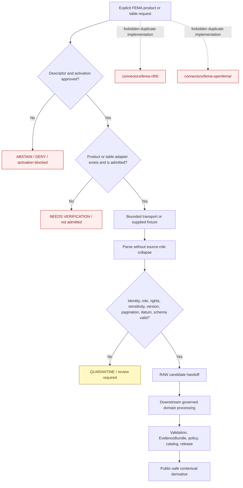

<!-- [KFM_META_BLOCK_V2]
doc_id: kfm://doc/connectors-fema-readme
title: connectors/fema/ — FEMA Connector Family Lane
type: readme
version: v0.2
status: draft
owners: OWNER_TBD — Connector steward · FEMA source steward · NFHL product steward · OpenFEMA product steward · Hazards steward · Hydrology steward · Settlements/Infrastructure steward · Privacy/sensitivity reviewer · Rights reviewer · Security reviewer · Validation steward · Docs steward
created: 2026-06-18
updated: 2026-07-11
policy_label: public-context-only; source-family-connector; shared-fema-package; greenfield; no-network-default; no-secret-import; per-product-admission; per-table-openfema-admission; raw-or-quarantine-only; not-for-life-safety; no-publication
proposed_path: connectors/fema/README.md
truth_posture: CONFIRMED family scaffold / package implementation ABSENT / sources NOT ACTIVATED / flat NFHL and OpenFEMA paths compatibility-only / executable tests ABSENT / CI UNKNOWN
related:
  - ../README.md
  - pyproject.toml
  - nfhl/README.md
  - src/README.md
  - src/fema/README.md
  - tests/README.md
  - ../fema-nfhl/README.md
  - ../fema-openfema/README.md
  - ../../docs/sources/catalog/fema/README.md
  - ../../docs/sources/catalog/fema/nfhl-flood-hazard.md
  - ../../docs/sources/catalog/fema/map-service-center.md
  - ../../docs/sources/catalog/fema/openfema-disaster-declarations.md
  - ../../docs/sources/catalog/fema/openfema-auxiliary-tables.md
  - ../../docs/sources/catalog/fema/nfip-claim-policy-aggregates.md
  - ../../docs/domains/hazards/README.md
  - ../../docs/domains/hazards/SOURCE_REGISTRY.md
  - ../../docs/domains/hydrology/README.md
  - ../../docs/domains/hydrology/CANONICAL_PATHS.md
  - ../../docs/domains/hydrology/SOURCE_REGISTRY.md
  - ../../docs/domains/settlements-infrastructure/README.md
  - ../../data/registry/sources/
  - ../../data/registry/hazards/sources/fema_disaster_declarations.yaml
  - ../../data/raw/hydrology/fema_nfhl/README.md
  - ../../data/raw/hazards/nfhl/README.md
  - ../../data/raw/hazards/fema/README.md
  - ../../data/quarantine/
  - ../../fixtures/
  - ../../schemas/contracts/v1/source/
  - ../../policy/sensitivity/
  - ../../release/
  - ../../tools/ingest/nfhl_watch/README.md
  - ../../tools/ingest/fema_decl_watch/README.md
  - ../../pipelines/domains/hydrology/ingest_nfhl/README.md
tags: [kfm, connectors, fema, source-family, greenfield, nfhl, map-service-center, openfema, disaster-declarations, regulatory, administrative, aggregate, pagination, version-lock, datum, privacy, source-admission, raw, quarantine, governance]
notes:
  - "Repository inspection confirms a greenfield FEMA connector scaffold: family README, placeholder pyproject, NFHL product README, source-root README, README-only shared package directory, and README-only test lane."
  - "No importable FEMA package, client, dispatcher, transport, NFHL adapter, OpenFEMA adapter, parser, handoff builder, fixture set, executable connector test, source activation, or passing CI evidence is proved."
  - "One shared implementation package is preferred at connectors/fema/src/fema/. Product documentation remains separate at connectors/fema/nfhl/ and source-catalog pages."
  - "The flat connectors/fema-nfhl/ and connectors/fema-openfema/ paths are noncanonical compatibility pointers and must not host parallel implementation or activation state."
  - "NFHL remains regulatory context; Disaster Declarations remain administrative; OpenFEMA aggregates require an explicit aggregation unit; no FEMA record becomes observed-event truth by convenience."
[/KFM_META_BLOCK_V2] -->

<a id="top"></a>

# FEMA Connector Family

> Evidence-grounded family overview for future FEMA source-admission code. The current lane is a documentation-only greenfield scaffold. It does **not** provide an importable package, live FEMA access, an activated product or table, executable connector tests, lifecycle promotion, or publication capability.

<p>
  
  
  
  
  
  
</p>

`connectors/fema/`

> [!IMPORTANT]
> **Confirmed state:** this family lane contains documentation and placeholder project metadata only. No `__init__.py`, build backend, package discovery, runtime dependency, client, transport, dispatcher, NFHL adapter, OpenFEMA adapter, parser, pagination implementation, handoff builder, executable test, source activation, live endpoint integration, or passing CI evidence is confirmed. The flat `connectors/fema-nfhl/` and `connectors/fema-openfema/` paths are compatibility pointers, not alternative connector implementations.

**Quick jumps:** [Purpose](#purpose) · [Verified repository state](#verified-repository-state) · [Evidence ledger](#evidence-ledger) · [Family authority boundary](#family-authority-boundary) · [Placement and architecture decision](#placement-and-architecture-decision) · [Blocking drift](#blocking-drift) · [FEMA product map](#fema-product-map) · [Source-role anti-collapse](#source-role-anti-collapse) · [Admission model](#admission-model) · [Shared-package contract](#shared-package-contract) · [Configuration transport and credentials](#configuration-transport-and-credentials) · [NFHL requirements](#nfhl-requirements) · [OpenFEMA requirements](#openfema-requirements) · [Rights privacy and sensitivity](#rights-privacy-and-sensitivity) · [Metadata preservation](#metadata-preservation) · [Finite outcomes](#finite-outcomes) · [Lifecycle and domain routing](#lifecycle-and-domain-routing) · [Watcher pipeline and release separation](#watcher-pipeline-and-release-separation) · [Testing relationship](#testing-relationship) · [Implementation sequence](#implementation-sequence) · [Activation gates](#activation-gates) · [Review and rollback](#review-and-rollback) · [Definition of done](#definition-of-done) · [Verification backlog](#verification-backlog)

---

## Purpose

`connectors/fema/` is the source-family coordination and packaging lane for FEMA source-admission work.

It may coordinate:

- the shared Python package boundary under `src/fema/`;
- package and build metadata in `pyproject.toml`;
- FEMA product-specific documentation such as `nfhl/README.md`;
- connector-local test requirements under `tests/`;
- explicit product and OpenFEMA table dispatch;
- source-role, rights, sensitivity, privacy, version, datum, pagination, and lifecycle constraints;
- migration away from duplicate flat connector paths;
- interfaces with separately governed watchers, domain pipelines, source registries, policies, lifecycle stores, and release controls.

When implementation exists, it may help retrieve and parse specifically activated FEMA products or tables, preserve their source meaning, and prepare bounded RAW-or-QUARANTINE handoff candidates.

This lane is not FEMA truth, hazard-event truth, regulatory interpretation, emergency alerting, insurance determination, benefit eligibility, damage assessment, legal advice, engineering certification, source-registry authority, schema authority, policy authority, proof authority, release authority, or a public-data surface.

[Back to top ↑](#top)

---

## Verified repository state

The following scaffold is confirmed on the repository's `main` branch at the time of this update:

```text
connectors/fema/
├── README.md                             # this family overview
├── pyproject.toml                        # project name + version only
├── nfhl/
│   └── README.md                         # preferred NFHL product coordination lane
├── src/
│   ├── README.md                         # source-root contract
│   └── fema/
│       └── README.md                     # shared-package contract
└── tests/
    └── README.md                         # connector-local test contract
```

Related flat compatibility paths:

```text
connectors/fema-nfhl/README.md             # NFHL compatibility pointer
connectors/fema-openfema/README.md         # OpenFEMA compatibility pointer
```

### Current maturity

| Surface | Confirmed content | Maturity |
|---|---|---:|
| `README.md` | This FEMA family contract. | **DOCUMENTED** |
| `pyproject.toml` | Project name `kfm-connector-fema`; version `0.0.0`. | **PLACEHOLDER** |
| Build backend | None declared in the inspected project file. | **ABSENT / UNPROVED** |
| `src` package discovery | None declared. | **ABSENT / UNPROVED** |
| Supported Python version | None declared. | **ABSENT / UNPROVED** |
| Runtime and test dependencies | None declared. | **ABSENT / UNPROVED** |
| `nfhl/README.md` | NFHL product semantics, version, datum, surface, and activation requirements. | **DOCUMENTED** |
| `src/README.md` | Source-root placement and architecture contract. | **DOCUMENTED** |
| `src/fema/README.md` | Shared-package contract and proposed implementation options. | **DOCUMENTED / IMPLEMENTATION ABSENT** |
| Python source files | None confirmed below `src/`. | **ABSENT** |
| `tests/README.md` | Connector-local test contract. | **DOCUMENTED / EXECUTABLE TESTS ABSENT** |
| Connector fixtures | None confirmed. | **ABSENT** |
| Accepted NFHL SourceDescriptor and activation | None confirmed by this lane. | **NOT ACTIVATED / NEEDS VERIFICATION** |
| Accepted OpenFEMA table activations | None confirmed by this lane. | **NOT ACTIVATED / NEEDS VERIFICATION** |
| Live endpoint, archive, or API integration | None confirmed. | **ABSENT / UNKNOWN** |
| Connector-specific CI evidence | None confirmed. | **UNKNOWN** |

> [!CAUTION]
> A family directory, package-shaped child folder, project name, or extensive documentation is not implementation evidence. Do not describe `kfm-connector-fema` as installable, importable, runnable, integrated, activated, tested, privacy-cleared, rights-cleared, compliant, or production-ready until repository artifacts and reviewable execution evidence support those claims.

[Back to top ↑](#top)

---

## Evidence ledger

| Evidence | Status | What it supports | What it does not support |
|---|---:|---|---|
| `connectors/fema/README.md` | **CONFIRMED** | The FEMA family coordination boundary exists. | Executable connector behavior. |
| `connectors/fema/pyproject.toml` | **CONFIRMED placeholder** | A project name and version are reserved. | Build backend, dependencies, package discovery, installation, entry points, or import. |
| `connectors/fema/nfhl/README.md` | **CONFIRMED preferred product documentation** | NFHL product identity, regulatory role, surface classification, version, datum, metadata, and activation requirements are documented. | Implemented NFHL access, parsing, or activation. |
| `connectors/fema/src/README.md` | **CONFIRMED documentation** | One shared FEMA source root is reserved. | Python source files or package behavior. |
| `connectors/fema/src/fema/README.md` | **CONFIRMED documentation** | Proposed package architectures, product semantics, metadata, finite outcomes, and activation gates are documented. | Importable or executable package behavior. |
| `connectors/fema/tests/README.md` | **CONFIRMED documentation** | Required package, placement, NFHL, OpenFEMA, pagination, privacy, and handoff tests are defined. | Executable tests, passing results, or CI enforcement. |
| `connectors/fema-nfhl/README.md` | **CONFIRMED compatibility pointer** | The flat NFHL path redirects to the family/product structure. | Independent connector authority. |
| `connectors/fema-openfema/README.md` | **CONFIRMED compatibility pointer** | OpenFEMA implementation belongs in the shared FEMA package and table admission is independent. | Implemented OpenFEMA behavior. |
| FEMA source catalog pages | **CONFIRMED draft documentation** | FEMA product distinctions and source-role anti-collapse constraints are documented. | Current endpoints, schemas, terms, rights, activation, or runtime behavior. |
| `data/registry/hazards/sources/fema_disaster_declarations.yaml` | **CONFIRMED greenfield template** | A candidate Disaster Declarations identity exists. | Approved role, authority, rights, sensitivity, cadence, access posture, or activation. |
| FEMA watcher and pipeline READMEs | **CONFIRMED documentation** | Source access, change detection, and downstream processing have separate responsibilities. | Executable watcher, pipeline, cadence, or lifecycle transition. |
| FEMA RAW-lane READMEs | **CONFIRMED documentation** | Candidate domain-routed RAW destinations are described. | Admitted payloads, receipts, accepted aliases, or promotion readiness. |

[Back to top ↑](#top)

---

## Family authority boundary

```text
THIS FAMILY LANE MAY EVENTUALLY COORDINATE:
  one shared FEMA Python package
  explicit configuration and closed product/table dispatch
  bounded source-specific transport
  NFHL and OpenFEMA adapters
  source-role and metadata preservation
  pagination and completeness accounting
  finite connector results and errors
  RAW-or-QUARANTINE handoff candidates
  product documentation and connector-local tests

THIS FAMILY LANE MUST NOT OWN OR DECIDE:
  canonical SourceDescriptors or source activation
  observed hazard-event truth
  current flood, fire, storm, earthquake, or damage conditions
  regulatory, legal, insurance, eligibility, compliance, or engineering determinations
  emergency warnings, forecasts, or life-safety instructions
  policy, rights, sensitivity, privacy, schema, proof, catalog, or release authority
  direct WORK, PROCESSED, CATALOG, TRIPLET, PROOF, RECEIPT, RELEASE, or PUBLISHED writes
  public APIs, maps, tiles, dashboards, reports, stories, search payloads, or generated answers
```

The connector family may preserve what a FEMA product or table says and the role under which it was admitted. It does not decide that the record is observed physical-world evidence, universally public-safe, legally controlling for a specific site, or eligible for public release.

[Back to top ↑](#top)

---

## Placement and architecture decision

Current repository documentation supports one FEMA family connector and one shared implementation package.

| Responsibility | Preferred path | Current posture |
|---|---|---:|
| FEMA source-family coordination | `connectors/fema/` | **CONFIRMED scaffold** |
| Packaging metadata | `connectors/fema/pyproject.toml` | **PLACEHOLDER** |
| FEMA Python source root | `connectors/fema/src/` | **CONFIRMED documentation-only root** |
| Shared FEMA package | `connectors/fema/src/fema/` | **CONFIRMED package README / implementation absent** |
| NFHL product documentation | `connectors/fema/nfhl/` | **CONFIRMED preferred product lane** |
| FEMA connector-local tests | `connectors/fema/tests/` | **CONFIRMED documentation / executable tests absent** |
| Flat NFHL path | `connectors/fema-nfhl/` | **NONCANONICAL compatibility pointer** |
| Flat OpenFEMA path | `connectors/fema-openfema/` | **NONCANONICAL compatibility pointer** |
| NFHL change detection | `tools/ingest/nfhl_watch/` | **DOCUMENTED / implementation unproved** |
| Declaration change detection | `tools/ingest/fema_decl_watch/` | **DOCUMENTED / implementation unproved** |
| Hydrology NFHL processing | `pipelines/domains/hydrology/ingest_nfhl/` | **DOCUMENTED / implementation unproved** |

Package-code placement and product-documentation placement are distinct decisions. The existence of `connectors/fema/nfhl/README.md` does not require an importable Python package under that product documentation folder.

> [!IMPORTANT]
> Implement FEMA source behavior once under `connectors/fema/src/fema/`. Do not create parallel clients, parsers, descriptors, fixtures, tests, endpoint settings, caches, activation state, or lifecycle writers under `connectors/fema-nfhl/`, `connectors/fema-openfema/`, or `connectors/fema/nfhl/` unless an accepted package-layout decision explicitly changes this architecture.

No nested `connectors/fema/openfema/` lane is currently confirmed. OpenFEMA product meaning belongs in source catalog pages; implementation belongs in the shared FEMA package unless a reviewed architecture decision says otherwise.

[Back to top ↑](#top)

---

## Blocking drift

The family cannot become operational safely until these gaps are resolved or represented as explicit fail-closed conditions.

| Blocker | Current state | Required resolution |
|---|---|---|
| Package importability | `src/fema/` is README-only; no `__init__.py`. | Select packaging strategy and prove clean import. |
| Build configuration | `pyproject.toml` declares only name and version. | Add reviewed build backend, `src` discovery, Python requirement, dependencies, optional groups, and version policy. |
| Package architecture | Flat modules and product subpackages are both proposed. | Choose one; do not implement both in parallel. |
| Connector-result contract | No binding finite-result or handoff shape is confirmed. | Select contracts, schemas, validators, and error semantics. |
| NFHL SourceDescriptor | No accepted active descriptor is confirmed. | Approve source/product ID, regulatory role, surfaces, rights, cadence, routing, and activation. |
| Disaster Declarations descriptor | A greenfield template exists with unresolved fields. | Complete schema validation, role, authority, rights, sensitivity, cadence, access, and activation review. |
| OpenFEMA auxiliary descriptors | None are confirmed. | Review every table independently; no umbrella admission. |
| Endpoint and archive inventory | Current FEMA surfaces are not pinned here. | Verify product/table endpoint, archive, service, version, schema, terms, and identity. |
| Rights and sensitivity | Product/table-specific terms and public-safe rules are incomplete or unverified. | Complete rights, attribution, privacy, precision, joining, and suppression review. |
| Stable identity and time semantics | Product/table keys and distinct time meanings are unimplemented. | Pin deterministic identities and separate source, declaration, incident, award, reporting, update, and retrieval times. |
| OpenFEMA pagination | Stable ordering, continuation, counts, duplicate/gap checks, and incomplete-run behavior are unimplemented. | Define and test completeness accounting. |
| NFHL surface and datum controls | Current analytic/visualization classes, version, CRS, datum, units, and field inventory are unimplemented. | Pin source metadata and negative tests. |
| RAW routing | Hydrology documentation uses `fema_nfhl`; Hazards uses `nfhl`. | Confirm one handoff contract or explicitly governed aliases. |
| Fixtures and tests | Test contract exists; executable fixtures and tests are absent. | Add synthetic no-network cases against implemented code. |
| Watchers and pipelines | README boundaries exist; executable behavior is unproved. | Implement separately with finite interfaces and independent tests. |
| CI | No passing connector-specific run is confirmed. | Prove a clean local no-network command before claiming CI enforcement. |
| Compatibility backlinks | Flat paths and generated skeleton references may remain. | Inventory, correct, retain intentionally, tombstone, or remove under review. |

Do not paper over these gaps with guessed endpoints, broad provider defaults, permissive role inference, invented schemas, unbounded skips, or examples presented as operational configuration.

[Back to top ↑](#top)

---

## FEMA product map

FEMA is a provider family, not one homogeneous source product. Every materially distinct product or OpenFEMA table needs independent identity, role, rights, sensitivity, cadence, schema, and activation evidence.

| Product area | Required source-role posture | Family-level guardrails |
|---|---|---|
| National Flood Hazard Layer (NFHL) | `regulatory` | Preserve issued regulatory attributes, surface class, version, effective date, CRS, datum, units, and lineage. Never emit observed inundation, forecast, warning, insurance, legal, or engineering conclusions. |
| Map Service Center (MSC) | Product-specific document/distribution context, subject to descriptor review | Preserve panel, study, document, revision, and effective-state identity. Do not substitute rendered panels for governed analytic vectors. |
| OpenFEMA Disaster Declarations | `administrative` | Preserve federal-action semantics, declaration number/type, declaration date, incident period, designated jurisdictions, and source lineage. Never emit a `Hazard Event` from the declaration alone. |
| OpenFEMA auxiliary action records | `administrative` | Preserve exact table identity, stable key, program/action meaning, time and geography semantics, privacy review, and source lineage. Do not infer damage, completion, eligibility, or physical conditions. |
| OpenFEMA totals and rollups | `aggregate` | Require exact aggregation unit, population/scope, geography, program/disaster, and time period. Never infer person, household, property, applicant, or site-level facts. |
| NFIP claim and policy aggregates | `aggregate`, subject to dedicated review | Preserve aggregation, suppression, temporal, geographic, and joining context. Treat precision and re-identification risk as sensitivity concerns. |

A shared FEMA provider does not create umbrella admission, one shared schema, one rights decision, one sensitivity tier, one cadence, or one source role.

[Back to top ↑](#top)

---

## Source-role anti-collapse

Source roles are semantic constraints, not labels that may be changed for convenience.

```text
NFHL regulatory zone
  = issued regulatory flood-hazard context
  ≠ observed flood event
  ≠ forecast or warning
  ≠ property-specific insurance or legal determination

FEMA Disaster Declaration
  = administrative federal action
  ≠ observed storm, flood, fire, tornado, earthquake, or damage event

Grant / project / registration / mission assignment
  = administrative program record
  ≠ verified damage, completed work, eligibility, or physical condition

Count / total / cost / policy / claim rollup
  = aggregate evidence at a declared unit
  ≠ person, household, applicant, property, or site truth
```

Required behavior:

- preserve the admitted source role through parsing, validation, handoff, routing, and downstream citation;
- reject product/role mismatches;
- distinguish declaration dates from incident periods and observed-event times;
- distinguish designated jurisdictions from observed hazard footprints;
- distinguish project, applicant, reporting, and aggregation locations from physical event extent;
- require explicit aggregation units for aggregate records;
- reject direct declaration-to-`Hazard Event` promotion;
- reject aggregate-to-individual or aggregate-to-property inference;
- require independently governed observed sources for physical-world event claims.

Downstream workflows may combine FEMA records with other admitted evidence, but the connector must preserve each input's role and must not perform a semantic truth upgrade.

[Back to top ↑](#top)

---

## Admission model

Every FEMA product or OpenFEMA table used by KFM must have an independently reviewable identity and activation decision.

Conceptual request context, **PROPOSED pending contract selection**:

```yaml
source_descriptor_ref: kfm://source/<approved-id>
activation_ref: kfm://source-activation/<approved-id>
provider: fema
product_family: nfhl | map_service_center | openfema | nfip
product_key: <explicit-product-or-table-key>
source_role: regulatory | administrative | aggregate
approved_surface: <service-archive-dataset-or-table-identity>
request_scope: <reviewed-query-package-or-geography-scope>
domain_route: <approved-domain-route>
lifecycle_target: raw | quarantine
```

Required admission behavior:

- reject missing or ambiguous product/table identity;
- reject missing SourceDescriptor or activation evidence for live behavior;
- reject unknown or non-admitted product keys;
- reject product/role mismatches;
- never dispatch by URL substring alone;
- never infer an OpenFEMA table role from API adjacency;
- never use a provider-wide switch to activate all FEMA products;
- require stable identity, time semantics, geography semantics, rights, sensitivity, cadence, and source-shape expectations;
- keep test-only fixture configuration unable to fall through to live access;
- allow only RAW or QUARANTINE as connector handoff targets.

A family README, common API host, shared provider, nearby table listing, or source catalog page is not an activation decision.

[Back to top ↑](#top)

---

## Shared-package contract

All executable FEMA connector behavior should be implemented once beneath:

```text
connectors/fema/src/fema/
```

The exact package layout remains an open implementation decision. Two coherent options are documented in [`src/fema/README.md`](src/fema/README.md): a small flat package or product-specific subpackages.

Whichever option is selected must preserve these invariants:

1. **One package.** Do not duplicate NFHL or OpenFEMA behavior in flat compatibility or product-documentation paths.
2. **Small public surface.** Import only deliberate package APIs.
3. **No import side effects.** Imports perform no network, secret reads, filesystem writes, logging setup, environment mutation, cache initialization, registry mutation, or source activation.
4. **Explicit dispatch.** Every operation names one admitted product or table.
5. **Replaceable transport.** Parsing and validation work with supplied fixtures and deterministic test doubles.
6. **Minimal normalization.** Preserve source meaning; route domain joins, place resolution, geometry repair, redaction, aggregation, evidence closure, and publication shaping downstream.
7. **Finite outcomes.** Errors, abstentions, review states, drift signals, and handoff candidates are explicit and bounded.
8. **No publication.** Package output stops at connector results and RAW-or-QUARANTINE candidates.

Do not create every proposed module mechanically. Each file must correspond to implemented responsibility, an accepted contract, executable tests, and an owner.

[Back to top ↑](#top)

---

## Configuration transport and credentials

Configuration must be explicit, validated, side-effect free, and incapable of activating a source by convenience.

A future configuration should separate:

- safe no-network defaults;
- SourceDescriptor and activation references;
- exact product/table identity and role;
- approved endpoint, archive, service, layer, dataset slug, or table identity;
- request scope and deterministic ordering;
- timeout, retry, backoff, rate-limit, pagination, redirect, response-size, and archive-size limits;
- rights, attribution, privacy, sensitivity, and suppression obligations;
- domain route and RAW/QUARANTINE target;
- test-only fixture configuration.

When live transport is eventually approved:

- network access must be invoked explicitly;
- credentials, API keys, cookies, tokens, and private configuration must use approved secret handling;
- authorization material must never be committed, copied into fixtures, or printed in logs;
- parsers must not acquire credentials or perform network requests;
- redirects, host changes, content types, encodings, and archive formats must be validated;
- retries and backoff must be finite;
- rate-limit responses must not create unbounded loops;
- OpenFEMA pagination must carry completeness evidence;
- bulk downloads must be checksum-bound and must not silently overwrite prior captures;
- source payload logging must be minimized;
- test doubles must work without network or credentials;
- any live smoke test must be isolated from default tests and public CI output.

No environment-variable name, pytest marker, endpoint string, credential convention, or live command is currently accepted by this family README.

[Back to top ↑](#top)

---

## NFHL requirements

NFHL is a `regulatory` product. It is not observed inundation, a flood model, a forecast, a warning service, a property-safety determination, an insurance ruling, legal advice, or engineering certification.

### Surface classification

Every NFHL input must be classified before use:

| Surface class | Allowed future use | Prohibited use |
|---|---|---|
| Analytic vector service or extract | Governed feature retrieval, validation, transformation, and downstream analysis after activation. | Direct public use from connector or RAW storage. |
| Visualization-only service, including WMS-like rendering | Human reference or display support where permitted and accurately labeled. | Feature extraction, analytical joins, geometry truth, regulatory attribute extraction, or replacement for governed vectors. |
| Bulk archive or authoritative package | Immutable RAW capture after descriptor and activation gates. | Silent overwrite, unversioned extraction, or implicit publication. |
| Service metadata or data dictionary | Surface identity, feature inventory, version, and drift evidence. | Activation by itself. |
| Derived tile, image, PMTiles, or summary | Public display only after downstream validation, generalization, catalog closure, and release. | Evidence substitution, engineering use, or life-safety determination. |

### Required NFHL preservation

Where carried by the approved product surface, preserve:

- provider and NFHL product identity;
- analytic, visualization, archive, metadata, or derived-display surface class;
- feature class and stable object identity;
- panel, study, jurisdiction, and revision identity;
- `DFIRM_ID`;
- `VERSION_ID` or accepted equivalent;
- `EFFECTIVE_DATE` and revision lineage;
- flood-zone designation, study references, and BFE fields;
- CRS, horizontal datum, vertical datum, elevation units, and transformation history;
- query, package, panel, study, geography, and retrieval scope;
- feature counts, archive members, checksums, and completeness evidence;
- source URI, retrieval times, schema fingerprint, connector version, and parser version.

Fail closed when version, effective state, identity, surface class, datum, units, checksum, completeness, required regulatory attributes, or source lineage is absent or incompatible with the requested use.

A rendered map is not an analytic vector dataset. A BFE value without verified vertical datum and units is not suitable for engineering conclusions. A regulatory vintage cannot be called current without source-time, scope, version/effective-state, and retrieval evidence.

[Back to top ↑](#top)

---

## OpenFEMA requirements

OpenFEMA is a distribution family for heterogeneous administrative and aggregate datasets. There is no umbrella OpenFEMA admission.

### Disaster Declarations

Disaster Declarations are `administrative` records of federal action. Preserve, where applicable:

- exact dataset identity and schema/API version;
- declaration number and type;
- stable source key;
- declaration date;
- incident period;
- update and retrieval times;
- designated jurisdictions;
- FEMA-issued title or incident category;
- program-authority fields;
- pagination and source lineage.

A declaration may support a downstream `DisasterDeclaration` candidate. It does not by itself prove an observed hazard event, physical footprint, damage extent, person or property eligibility, safety condition, forecast, warning, or emergency instruction.

### Auxiliary administrative tables

Every auxiliary table requires its own descriptor, activation, source role, stable key, cadence, rights snapshot, sensitivity review, parser contract, fixture set, and tests.

Administrative records must preserve action semantics such as award, project, registration, assignment, grant, or program activity. They must not be converted into proof of observed damage, completed work, applicant eligibility, or physical conditions.

### Aggregate tables

Aggregate records require explicit:

- aggregation unit;
- geography;
- program or product scope;
- disaster or reporting scope;
- time period;
- population or record universe;
- suppression or minimum-cell obligations where adopted;
- rights, sensitivity, and joining-risk posture.

Do not disaggregate counts, totals, costs, claims, policies, or rates into person, household, applicant, address, property, infrastructure, or site-level facts.

### Pagination completeness

A future OpenFEMA adapter must preserve or validate:

- exact dataset slug/key and API/schema version;
- query filters and deterministic ordering where supported;
- page size and continuation, offset, or token state;
- pages requested and received;
- total-count evidence where available;
- first and last stable identities;
- duplicate and gap checks;
- retrieval start and completion times;
- source freshness metadata, digest, `etag`, `last_modified`, or accepted equivalent where available;
- row count, schema fingerprint, connector version, and parser version.

Missing pages, unexplained count mismatch, unstable ordering, changed keys, stale metadata, duplicates, gaps, or schema drift must produce incomplete-run, abstention, quarantine, or review outcomes—not silent success.

[Back to top ↑](#top)

---

## Rights privacy and sensitivity

Public-source availability does not create a family-wide rights, privacy, or release decision.

Minimum posture:

1. **Review each product or table independently.** FEMA provider identity cannot supply one blanket rights or sensitivity answer.
2. **Keep rights separate from sensitivity.** A public federal record may still require attribution and may still be unsafe to expose at full precision or after joining.
3. **Detect PII and quasi-identifiers.** Applicant, household, registration, contact, address, property, project, and precise-location fields require explicit review.
4. **Protect sensitive infrastructure.** Project or facility detail may require restriction, generalization, quarantine, or denial.
5. **Preserve aggregation units.** Counts and totals are meaningful only at their declared geography, program, disaster, time, and population scope.
6. **Do not disaggregate.** Never infer person, household, applicant, property, or site facts from aggregates.
7. **Review joins.** A low-risk table may become identifying or operationally sensitive when joined with parcels, addresses, people, utilities, or infrastructure.
8. **Apply suppression and minimum-cell rules where adopted.** Unresolved obligations mean no public-safe derivative.
9. **Minimize logs and fixtures.** Do not log or commit real sensitive rows merely to test parsing.
10. **Fail closed on unknown terms or precision.** Unresolved rights, attribution, privacy, sensitivity, precision, or joining risk routes to restriction, quarantine, abstention, or denial.
11. **Keep determinations outside the connector.** No FEMA record may be used here to decide individual benefits, insurance, legal rights, compliance, property safety, or emergency action.
12. **Treat generated output as downstream carrier text.** AI summaries, maps, tiles, search indexes, and vector representations do not override source roles, evidence gaps, privacy decisions, or release gates.

[Back to top ↑](#top)

---

## Metadata preservation

Every non-error connector candidate should preserve, where applicable:

### Cross-product minimum

- canonical KFM source identifier;
- FEMA provider and exact product/table key;
- source role and role authority;
- record, feature, panel, project, declaration, or row stable identity;
- source URI, archive, service, layer, dataset, or query identity;
- source, event, declaration, incident, award, reporting, update, retrieval, and processing time meanings without collapse;
- exact geography meaning;
- schema fingerprint and upstream version;
- connector and parser version;
- rights, attribution, privacy, sensitivity, and review state;
- checksum or digest;
- intended domain route;
- intended lifecycle target of RAW or QUARANTINE only;
- drift, stale, incomplete, quarantine, and review flags.

### NFHL-specific minimum

- source surface class;
- feature class and object identity;
- `DFIRM_ID`, `VERSION_ID`, `EFFECTIVE_DATE`, zone, study, revision, and BFE fields where carried;
- CRS, horizontal datum, vertical datum, units, and transform history;
- package/query/panel/study/jurisdiction scope;
- feature counts, archive members, checksums, and completeness evidence.

### OpenFEMA-specific minimum

- exact dataset slug/key and API/schema version;
- stable row key or documented composite key;
- `administrative` or `aggregate` role;
- aggregation unit for aggregate tables;
- declaration, program, project, award, registration, assignment, claim, policy, or cost identity as applicable;
- distinct temporal meanings;
- exact geography semantics;
- query filters and deterministic ordering where available;
- page/offset/token state, pages requested/received, and count evidence;
- duplicate, gap, count-mismatch, unstable-ordering, privacy, precision, and joining-risk flags.

Source-issued values must remain inspectable. Simplified or derived values may be added downstream only when originals and transformation evidence remain available.

[Back to top ↑](#top)

---

## Finite outcomes

Future family APIs and tests should require a small documented set of deterministic outcomes instead of ambiguous partial success.

| Condition | Required safe behavior |
|---|---|
| Package target absent or not installed | Fail clearly; do not report connector validation success. |
| SourceDescriptor missing | Refuse live activation with an actionable error. |
| Activation decision missing | `ABSTAIN` or activation-blocked result. |
| Product or table unknown or not admitted | `NEEDS_VERIFICATION` or table-not-admitted result. |
| Product/role mismatch | Validation failure. |
| Runtime points to a compatibility path | Placement failure. |
| Network disabled | Fixture/parser paths remain usable; live request returns bounded disabled outcome. |
| Unauthorized or forbidden | Finite redacted error; no credential leakage. |
| Timeout or rate limit | Bounded error; no infinite retry. |
| Unexpected redirect, host, content type, encoding, or archive format | Validation failure or quarantine. |
| Empty response | `ABSTAIN` unless the approved product contract defines empty as valid. |
| Malformed response | Finite parser error with safe source metadata. |
| Schema or field drift | Reviewable drift result; no silent data loss. |
| Stable identity absent or changed | Block deterministic update and deduplication. |
| OpenFEMA pagination incomplete | Quarantine or incomplete-run result. |
| Count mismatch, duplicate, or gap | Quarantine and completeness review. |
| Aggregation unit missing | Validation failure or quarantine. |
| Rights, privacy, precision, or sensitivity unresolved | No public-safe result; restrict, review, quarantine, or deny. |
| NFHL visualization source used for analytics | Validation failure. |
| NFHL version or effective date missing | Quarantine or abstention. |
| NFHL CRS, datum, or units unresolved | Quarantine; block elevation and engineering use. |
| NFHL regulatory attributes dropped | Validation failure. |
| Declaration emitted as an observed event | Hard source-role anti-collapse failure. |
| Aggregate emitted as individual or property truth | Hard anti-collapse failure. |
| Direct downstream or public write attempted | Hard failure. |
| Warning, damage, eligibility, insurance, legal, engineering, compliance, or life-safety determination requested | Refuse and direct callers to official or governed channels. |

Errors must be deterministic, actionable, finite, safe to log, and free of secrets or unnecessary source-payload content.

[Back to top ↑](#top)

---

## Lifecycle and domain routing

The FEMA connector family participates only at the source-admission edge.



KFM lifecycle discipline remains:

```text
RAW -> WORK / QUARANTINE -> PROCESSED -> CATALOG / TRIPLET -> PUBLISHED
```

Domain routing must remain explicit:

- NFHL may feed approved Hydrology, Hazards, and exposure-context RAW or QUARANTINE lanes without changing its `regulatory` role;
- Disaster Declarations may feed a Hazards `DisasterDeclaration` lane without becoming observed events;
- OpenFEMA project or grant tables may feed approved Hazards or Settlements/Infrastructure lanes while retaining `administrative` meaning;
- aggregates retain their exact aggregation unit through every route;
- routing one source to multiple domains does not create multiple connector implementations;
- RAW path aliases must be governed rather than inferred from current folder spellings;
- the connector may construct a handoff candidate only after a binding contract exists;
- the connector must not independently normalize into domain truth, promote, catalog, prove, release, or publish data.

[Back to top ↑](#top)

---

## Watcher pipeline and release separation

Source access, source change detection, downstream processing, policy, evidence, and release are separate responsibilities.

| Surface | Responsibility | Must not do |
|---|---|---|
| FEMA shared package | Approved source access, parsing, connector-local validation, finite outcomes, and RAW/QUARANTINE handoff candidates. | Publish, promote, own domain normalization, or decide release. |
| `tools/ingest/nfhl_watch/` | Detect NFHL metadata, version, schema, or source-state changes and emit review signals. | Fetch promotion-track data by authority, publish, or mutate lifecycle state. |
| `tools/ingest/fema_decl_watch/` | Detect Disaster Declaration administrative changes and emit proposed-work or review signals. | Create observed hazard events, alerts, eligibility decisions, or publication records. |
| `pipelines/domains/hydrology/ingest_nfhl/` | Governed downstream Hydrology ingest and normalization after admission. | Activate sources or bypass RAW/QUARANTINE. |
| Domain policies and validators | Decide domain admissibility, sensitivity, role, transformation, and release prerequisites. | Rewrite source evidence invisibly. |
| Evidence and catalog surfaces | Close evidence and projection requirements after validation. | Treat connector output as proof automatically. |
| Release surfaces | Approve public-safe derivatives, corrections, withdrawal, and rollback. | Treat connector or watcher output as released truth. |

A watcher signal is not a SourceDescriptor, activation decision, ingest receipt, observed event, regulatory update approval, lifecycle transition, EvidenceBundle, release decision, or publication artifact.

[Back to top ↑](#top)

---

## Testing relationship

Connector-local tests belong under:

```text
connectors/fema/tests/
```

The test lane is currently README-only. Future tests should prove:

- clean package import with no network, secret read, filesystem write, logging setup, environment mutation, cache initialization, or source activation;
- declared build backend, `src` package discovery, Python version, dependencies, and package contents;
- shared-package-only implementation and rejection of runtime files in compatibility paths;
- no-network default transport behavior;
- explicit descriptor and activation requirements;
- closed product/table dispatch;
- finite timeout, retry, rate-limit, redirect, content-type, archive, and partial-download behavior;
- NFHL regulatory-role and analytic/visualization separation;
- NFHL regulatory attribute, version, effective-date, datum, units, checksum, geometry, and completeness guards;
- Disaster Declarations remain administrative rather than observed events;
- auxiliary administrative tables preserve action semantics;
- aggregate tables require exact aggregation units and reject disaggregation;
- OpenFEMA pagination, stable-key, duplicate, gap, count, ordering, freshness, and schema-drift checks fail closed;
- privacy, PII, address, property, precise-location, infrastructure, and joining risks route to review, restriction, quarantine, or denial;
- only finite connector results and RAW/QUARANTINE candidates are accepted;
- every direct downstream, proof, receipt, release, publication, alert, map, tile, report, search, or generated-answer write is rejected.

Fixtures must be synthetic, minimized, no-network, and free of real applicant, household, property, address, credential, or sensitive-infrastructure data unless a separate governed approval exists.

No test command, test dependency, live-test flag, pytest marker, endpoint constant, credential mode, executable test inventory, or passing status is confirmed by this family README.

[Back to top ↑](#top)

---

## Implementation sequence

Implement in dependency order:

1. **Resolve packaging and package architecture**
   - declare build backend, `src` discovery, Python version, dependencies, and version policy;
   - choose flat-module or product-subpackage design;
   - define a narrow side-effect-free import surface.
2. **Align placement and compatibility references**
   - retain one shared package;
   - preserve NFHL product documentation separately;
   - inventory and correct stale flat-path and generated-skeleton references.
3. **Resolve governance contracts**
   - accept SourceDescriptor and activation interfaces;
   - select connector-result and RAW/QUARANTINE handoff contracts;
   - define domain routing and RAW alias policy.
4. **Add configuration, dispatch, and finite errors**
   - safe no-network defaults;
   - explicit product/table keys;
   - bounded limits;
   - deterministic redacted errors.
5. **Implement one fixture-only product slice**
   - choose NFHL or Disaster Declarations;
   - parse supplied synthetic fixtures only;
   - preserve source role, identity, and required metadata;
   - add executable tests before live transport.
6. **Add validated transport**
   - only after source surfaces, terms, activation, limits, and security posture are reviewed;
   - keep transport replaceable by test doubles;
   - prove bounded failure and completeness behavior.
7. **Add handoff integration**
   - only after binding RAW/QUARANTINE and domain-routing contracts are accepted;
   - reject every direct downstream write.
8. **Add products and tables independently**
   - every OpenFEMA table receives its own descriptor, role, stable key, privacy posture, rights, cadence, parser, fixture set, tests, and activation decision.
9. **Add watcher and pipeline interfaces separately**
   - exchange finite metadata, review signals, and handoff references;
   - do not merge responsibilities into the connector package.
10. **Add CI last**
    - prove a clean local no-network command first;
    - retain reviewable run evidence;
    - do not upgrade badges or maturity claims before evidence exists.

[Back to top ↑](#top)

---

## Activation gates

No live FEMA source behavior should run until all applicable gates close:

- [ ] Packaging and clean import behavior are verified from a clean environment.
- [ ] Public import surface is reviewed and side-effect free.
- [ ] One package architecture is accepted.
- [ ] Canonical product/table source identifier is accepted.
- [ ] Product/table-specific SourceDescriptor and activation decision exist.
- [ ] Source role and role authority are explicit and tested.
- [ ] Current endpoint, archive, service, layer, dataset slug, API/schema version, or product identity is verified.
- [ ] Source terms, rights, attribution, and redistribution posture are reviewed.
- [ ] Sensitivity, privacy, precision, suppression, and joining risks are reviewed.
- [ ] Stable record identity and temporal/geographic semantics are defined.
- [ ] Pagination, completeness, freshness, retry, timeout, rate-limit, redirect, and size bounds are defined.
- [ ] NFHL surface classes, regulatory fields, version, CRS, datum, units, and completeness rules are pinned where applicable.
- [ ] OpenFEMA aggregation units, stable keys, PII handling, and suppression obligations are pinned where applicable.
- [ ] Binding connector result, RAW/QUARANTINE handoff, domain routing, and alias behavior are accepted.
- [ ] Synthetic no-network fixtures and executable tests pass.
- [ ] Secrets and configuration use approved handling.
- [ ] Watcher, connector, pipeline, policy, evidence, and release responsibilities remain separate.
- [ ] Rollback, correction, cache invalidation, incomplete-run, and payload cleanup procedures are documented.
- [ ] CI evidence is reviewable before any activation or maturity claim is upgraded.

Until then, the family remains documentation-only and live access remains inactive.

[Back to top ↑](#top)

---

## Review and rollback

Review FEMA connector-family changes as source-role, privacy, regulatory-context, packaging, and life-safety-adjacent changes.

A reviewer should confirm:

- implementation claims match the repository tree and test evidence;
- one shared package remains the only runtime implementation target;
- compatibility paths remain documentation-only;
- package and product-documentation responsibilities remain separate;
- imports are side-effect free;
- SourceDescriptors and activation remain external governance inputs;
- every product/table role remains explicit;
- NFHL remains regulatory context rather than observed or predictive flooding;
- Disaster Declarations remain administrative rather than observed events;
- aggregate records cannot become individual or property truth;
- pagination, stable-key, version, datum, rights, privacy, precision, and sensitivity controls fail closed;
- connector output stops at finite results and RAW/QUARANTINE candidates;
- public clients never consume connector, RAW, WORK, or QUARANTINE material directly;
- no language or API suggests warning, damage, insurance, legal, engineering, eligibility, compliance, or life-safety authority.

Rollback is required if a change:

- claims importability, activation, endpoint support, test coverage, or CI without evidence;
- adds import-time network, secret, filesystem, logging, environment, cache, or activation behavior;
- creates parallel implementation under a compatibility or product-documentation path;
- enables umbrella FEMA or OpenFEMA admission;
- collapses regulatory, administrative, aggregate, or observed roles;
- weakens pagination, completeness, stable-key, version, datum, rights, privacy, precision, suppression, or sensitivity safeguards;
- writes directly beyond RAW/QUARANTINE handoff;
- exposes source payloads, credentials, personal data, precise property data, or sensitive infrastructure rows;
- emits public claims or determination-like output.

Rollback procedure:

1. Revert the unsafe or misleading family change.
2. Restore the last verified no-network and no-secret import posture.
3. Remove or quarantine any unapproved source payloads, caches, credentials, or sensitive rows and assess repository-history exposure.
4. Move legitimate product documentation, source code, tests, fixtures, tooling, pipeline, policy, lifecycle, evidence, or release work to its correct responsibility lane.
5. Repair imports, descriptors, configuration, workflows, compatibility links, and generated templates.
6. Record source-role, schema, pagination, privacy, datum, version, packaging, placement, or life-safety drift in the appropriate register.
7. Re-run the last verified clean test command when one exists.
8. Correct README badges and maturity claims to match evidence.

[Back to top ↑](#top)

---

## Definition of done

This family lane is not complete merely because its boundaries are documented.

- [x] Current greenfield scaffold is explicit.
- [x] Placeholder `pyproject.toml` maturity is explicit.
- [x] One shared FEMA package is identified as the implementation boundary.
- [x] NFHL product documentation is separated from package implementation.
- [x] Flat NFHL and OpenFEMA paths are treated as compatibility-only.
- [x] Regulatory, administrative, aggregate, and observed-role boundaries are explicit.
- [x] RAW-or-QUARANTINE-only connector output is explicit.
- [x] Watcher, connector, pipeline, domain, evidence, and release responsibilities are separated.
- [x] No live-test flag, endpoint, or command is falsely presented as accepted.
- [ ] Build backend, `src` discovery, Python version, dependencies, and version policy are declared.
- [ ] The `fema` package imports cleanly without side effects.
- [ ] One accepted package architecture is implemented.
- [ ] Configuration, dispatch, transport, finite error, and connector-result contracts exist.
- [ ] Canonical SourceDescriptor and activation interfaces are enforced.
- [ ] At least one product adapter is implemented against synthetic fixtures.
- [ ] NFHL metadata/surface guards or OpenFEMA pagination/role guards are executable and tested.
- [ ] Binding RAW/QUARANTINE handoff, domain routing, and alias contracts are selected.
- [ ] Default no-network tests pass from a clean environment.
- [ ] CI wiring and passing evidence exist.
- [ ] Current source terms, endpoints, schemas, rights, privacy, and sensitivity reviews support any live activation.
- [ ] Watcher and pipeline integrations remain independently governed.
- [ ] Compatibility backlinks and generated skeletons are corrected or intentionally retained.
- [ ] No package or family API creates public claims or formal determinations.

[Back to top ↑](#top)

---

## Verification backlog

| Item | Status | Needed evidence |
|---|---:|---|
| Confirm the documented FEMA scaffold remains accurate as implementation begins. | **NEEDS CONTINUOUS VERIFICATION** | Repository tree inspection. |
| Complete `connectors/fema/pyproject.toml`. | **BLOCKED** | Build backend, `src` discovery, Python version, dependencies, optional groups, entry points, and version policy. |
| Choose package architecture: flat modules or product subpackages. | **OPEN DECISION** | Design review, ownership, dependency, and test analysis. |
| Confirm package import name and public API. | **NEEDS VERIFICATION** | Package files and clean-environment import tests. |
| Select accepted connector-result and RAW/QUARANTINE handoff contracts. | **NEEDS VERIFICATION** | Contracts, schemas, validators, and tests. |
| Confirm NFHL SourceDescriptor ID, product surfaces, rights, cadence, routing, and activation. | **NEEDS VERIFICATION** | Validated registry record and source-steward decision. |
| Confirm Disaster Declarations SourceDescriptor fields and activation. | **BLOCKED TEMPLATE** | Completed descriptor, schema validation, rights/sensitivity review, and activation decision. |
| Inventory and review every candidate OpenFEMA auxiliary table. | **NEEDS VERIFICATION** | Per-table descriptors, roles, stable keys, privacy, rights, cadence, schemas, parsers, and decisions. |
| Confirm current NFHL analytic-vector, visualization, metadata, and archive surfaces. | **NEEDS VERIFICATION** | Current FEMA source metadata and product review. |
| Confirm NFHL feature classes, required fields, version, CRS, datum, units, and completeness rules. | **NEEDS VERIFICATION** | Current data dictionary, schemas, fixtures, validators, and tests. |
| Confirm OpenFEMA pagination and completeness contract. | **NEEDS VERIFICATION** | Current API behavior, test doubles, fixtures, and parser tests. |
| Confirm stable identity and temporal/geographic semantics for each OpenFEMA table. | **NEEDS VERIFICATION** | Table documentation, descriptors, contracts, and tests. |
| Confirm rights, attribution, privacy, PII, property, applicant, address, precise-location, infrastructure, suppression, and joining-risk handling. | **NEEDS VERIFICATION** | Terms snapshots, sensitivity policy, negative fixtures, and reviewer decisions. |
| Resolve NFHL Hydrology/Hazards RAW routing names and aliases. | **NEEDS VERIFICATION** | Handoff contract and domain-steward decision. |
| Confirm fixture authority and metadata convention. | **NEEDS VERIFICATION** | Root fixture documentation and sensitivity review. |
| Confirm no-network default and executable local command. | **NEEDS VERIFICATION** | Packaging, test configuration, and clean run output. |
| Confirm compatibility-path enforcement. | **PROPOSED** | Repository validator, negative fixtures, and CI integration. |
| Confirm watcher and pipeline interfaces. | **NEEDS VERIFICATION** | Implemented finite envelopes, fixtures, tests, cadence, and ownership review. |
| Confirm connector-output boundary enforcement. | **NEEDS VERIFICATION** | Validators, negative tests, ADRs, branch policy, and CI evidence. |
| Inventory and correct templates or skeleton maps that recreate flat FEMA connector paths. | **NEEDS VERIFICATION** | Repository-wide path and template review. |
| Decide retained-pointer, tombstone, or removal outcomes for flat compatibility paths after backlink cleanup. | **OPEN DECISION** | Maintainer review and dependency inventory. |
| Define live-smoke policy, markers, and secret handling only if live tests become necessary. | **NOT APPROVED** | Source, security, rights, privacy, activation, retention, and CI reviews. |

---

## Maintainer note

Build FEMA source access once, under one shared package, and admit products or tables one at a time. Preserve regulatory, administrative, and aggregate meaning without turning FEMA records into observed events, personal determinations, engineering advice, or emergency guidance. Keep source activation in governed registry decisions, domain processing downstream, watchers non-publishing, and public release behind evidence, policy, review, correction, and rollback gates.

[Back to top ↑](#top)
