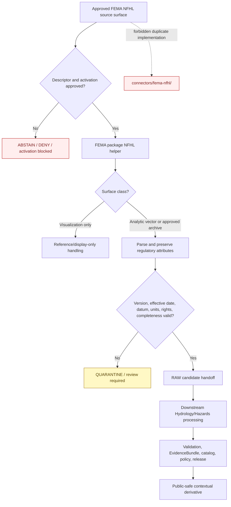

<!-- [KFM_META_BLOCK_V2]
doc_id: kfm://doc/connectors-fema-nfhl-nested-readme
title: connectors/fema/nfhl/ — FEMA NFHL Product Coordination Lane
type: readme
version: v0.2
status: draft
owners: OWNER_TBD — Connector steward · FEMA source steward · NFHL product steward · Hydrology steward · Hazards steward · Rights reviewer · Validation steward · Security reviewer · Docs steward
created: 2026-06-18
updated: 2026-07-11
policy_label: public-context-only; fema-family-product-lane; preferred-nested-path; regulatory-context; shared-family-package; not-for-life-safety; raw-or-quarantine-only; no-direct-publication
proposed_path: connectors/fema/nfhl/README.md
truth_posture: CONFIRMED preferred NFHL product README / shared FEMA package implementation UNPROVED / source NOT ACTIVATED / flat sibling is compatibility-only
related:
  - ../README.md
  - ../pyproject.toml
  - ../src/README.md
  - ../src/fema/README.md
  - ../tests/README.md
  - ../../fema-nfhl/README.md
  - ../../../docs/sources/catalog/fema/README.md
  - ../../../docs/sources/catalog/fema/nfhl-flood-hazard.md
  - ../../../docs/sources/catalog/fema/map-service-center.md
  - ../../../docs/domains/hydrology/README.md
  - ../../../docs/domains/hydrology/CANONICAL_PATHS.md
  - ../../../docs/domains/hydrology/SOURCE_REGISTRY.md
  - ../../../docs/domains/hazards/README.md
  - ../../../docs/domains/hazards/SOURCE_REGISTRY.md
  - ../../../data/raw/hydrology/fema_nfhl/README.md
  - ../../../data/raw/hazards/nfhl/README.md
  - ../../../pipelines/domains/hydrology/ingest_nfhl/README.md
  - ../../../tools/ingest/nfhl_watch/README.md
  - ../../../data/registry/sources/
  - ../../../data/quarantine/hydrology/
  - ../../../data/quarantine/hazards/
  - ../../../policy/sensitivity/
  - ../../../release/
tags: [kfm, connectors, fema, nfhl, product-lane, floodplain, flood-hazard, hydrology, hazards, regulatory-context, version-lock, datum, source-admission, raw, quarantine, governance]
notes:
  - "Current repository evidence favors connectors/fema/nfhl/ as the NFHL product documentation and coordination lane inside the FEMA source-family connector."
  - "The flat connectors/fema-nfhl/ path is now documented as a noncanonical compatibility pointer and must not host parallel implementation."
  - "This product directory currently contains documentation only; executable NFHL behavior, if implemented, belongs under the accepted connectors/fema/src/fema/ package structure and is not proved by this README."
  - "NFHL is regulatory flood-hazard context, not observed inundation, forecast, warning, insurance or legal determination, engineering certification, or life-safety guidance."
  - "Current endpoint inventory, bulk strategy, SourceDescriptor, activation decision, rights snapshot, fixtures, executable tests, watcher, pipeline wiring, and CI evidence remain unresolved or unproved."
[/KFM_META_BLOCK_V2] -->

<a id="top"></a>

# FEMA NFHL Product Coordination Lane

> Product-specific documentation and coordination boundary for the National Flood Hazard Layer inside the FEMA source-family connector. This lane defines NFHL admission requirements and product semantics; it does **not** prove that a client, parser, downloader, watcher, pipeline, SourceDescriptor, test suite, or activated source currently exists.

<p>
  
  
  
  
  
  
</p>

`connectors/fema/nfhl/`

> [!IMPORTANT]
> **Confirmed state:** this product directory contains this README only. The FEMA family scaffold exists at `connectors/fema/`, but no executable NFHL package module, endpoint configuration, SourceDescriptor, fixture set, test implementation, activation record, watcher implementation, pipeline implementation, or passing CI evidence is confirmed by this lane. The flat `connectors/fema-nfhl/` path is a compatibility pointer, not a second connector.

**Quick jumps:** [Purpose](#purpose) · [Placement decision](#placement-decision) · [Verified repository state](#verified-repository-state) · [Evidence ledger](#evidence-ledger) · [Blocking drift](#blocking-drift) · [Product identity and source role](#product-identity-and-source-role) · [NFHL and Map Service Center](#nfhl-and-map-service-center) · [Authority boundary](#authority-boundary) · [Access-surface classification](#access-surface-classification) · [Required metadata preservation](#required-metadata-preservation) · [Version freshness and change detection](#version-freshness-and-change-detection) · [Geometry datum and elevation](#geometry-datum-and-elevation) · [Input and output contract](#input-and-output-contract) · [Finite outcomes](#finite-outcomes) · [Lifecycle boundary](#lifecycle-boundary) · [Shared-package implementation contract](#shared-package-implementation-contract) · [Testing relationship](#testing-relationship) · [Watcher and pipeline separation](#watcher-and-pipeline-separation) · [Activation gates](#activation-gates) · [Review and rollback](#review-and-rollback) · [Definition of done](#definition-of-done) · [Verification backlog](#verification-backlog)

---

## Purpose

`connectors/fema/nfhl/` is the preferred product-level coordination lane for NFHL within the FEMA connector family.

It may document:

- NFHL product identity and `regulatory` source-role constraints;
- analytic-vector versus visualization-only source surfaces;
- required regulatory attributes, version locks, effective dates, datum, units, and lineage;
- SourceDescriptor and activation prerequisites;
- RAW-or-QUARANTINE handoff expectations;
- connector, watcher, test, pipeline, and domain responsibility boundaries;
- product-specific drift, rollback, and review requirements.

This directory is not the Python package implementation home by default. Executable source-admission code should live under the accepted shared FEMA package structure in `connectors/fema/src/fema/`, with connector-local tests under `connectors/fema/tests/`.

This lane does not establish flood-event truth, source activation, regulatory interpretation, legal meaning, insurance requirements, engineering suitability, property safety, or publication approval.

[Back to top ↑](#top)

---

## Placement decision

Current repository evidence favors the FEMA family/product structure:

| Responsibility | Preferred path | Current posture |
|---|---|---:|
| FEMA source-family coordination | `connectors/fema/` | **CONFIRMED scaffold** |
| NFHL product documentation and coordination | `connectors/fema/nfhl/` | **CONFIRMED preferred product README** |
| FEMA package implementation | `connectors/fema/src/fema/` | **CONFIRMED documentation / implementation unproved** |
| FEMA connector-local tests | `connectors/fema/tests/` | **CONFIRMED documentation / test coverage unproved** |
| Flat historical NFHL path | `connectors/fema-nfhl/` | **NONCANONICAL compatibility pointer** |
| NFHL change-detection tooling | `tools/ingest/nfhl_watch/` | **DOCUMENTED / implementation unproved** |
| Hydrology NFHL ingest processing | `pipelines/domains/hydrology/ingest_nfhl/` | **DOCUMENTED / implementation unproved** |

The exact Python module layout remains open. Product documentation placement and package-code placement are distinct decisions.

> [!CAUTION]
> Do not create implementation files in both `connectors/fema/nfhl/` and `connectors/fema/src/fema/`. Parallel clients, parsers, descriptors, fixtures, tests, endpoint settings, or activation state would split product identity and governance.

[Back to top ↑](#top)

---

## Verified repository state

The following relationship is confirmed on the repository's `main` branch at the time of this update:

```text
connectors/
├── fema-nfhl/
│   └── README.md                         # noncanonical compatibility pointer
└── fema/
    ├── README.md                         # FEMA family contract
    ├── pyproject.toml                    # greenfield placeholder
    ├── nfhl/
    │   └── README.md                     # this product coordination lane
    ├── src/
    │   ├── README.md
    │   └── fema/
    │       └── README.md                 # proposed shared package contract
    └── tests/
        └── README.md                     # proposed connector-local test contract
```

### Current maturity

| Surface | Confirmed content | Maturity |
|---|---|---:|
| `connectors/fema/nfhl/README.md` | This NFHL product contract. | **DOCUMENTED** |
| Other files below `connectors/fema/nfhl/` | None found in the current repository search. | **ABSENT / NEEDS CONTINUOUS VERIFICATION** |
| `connectors/fema/pyproject.toml` | Project name `kfm-connector-fema`; version `0.0.0`. | **PLACEHOLDER** |
| `connectors/fema/src/fema/README.md` | Proposes FEMA product dispatch and an NFHL parser responsibility. | **DOCUMENTED / IMPLEMENTATION UNPROVED** |
| NFHL client, bulk, parser, validator, or handoff modules | None confirmed. | **ABSENT / UNPROVED** |
| `connectors/fema/tests/README.md` | Describes NFHL no-network, metadata, role, and failure tests. | **DOCUMENTED / EXECUTABLE TESTS UNPROVED** |
| Accepted NFHL SourceDescriptor | None confirmed by this update. | **NEEDS VERIFICATION** |
| Live NFHL endpoint or bulk access | None confirmed by this update. | **NOT ACTIVATED / UNKNOWN** |
| Passing NFHL connector CI evidence | None confirmed. | **UNKNOWN** |

> [!WARNING]
> The preferred nested product lane is still greenfield. Preferred placement does not mean operational, endpoint-verified, rights-cleared, tested, activated, or publication-ready.

[Back to top ↑](#top)

---

## Evidence ledger

| Evidence | Status | Supports | Does not support |
|---|---:|---|---|
| `connectors/fema/nfhl/README.md` | **CONFIRMED** | The nested product coordination path exists. | Executable NFHL behavior. |
| `connectors/fema-nfhl/README.md` | **CONFIRMED compatibility pointer** | The flat split path redirects work to the FEMA family/product structure. | Independent connector authority. |
| `connectors/fema/README.md` | **CONFIRMED family documentation** | FEMA products share a family connector and must preserve product-specific roles. | Implementation maturity or activation. |
| `connectors/fema/src/fema/README.md` | **CONFIRMED package documentation** | NFHL behavior is expected inside the shared FEMA package; RAW/QUARANTINE only. | Implemented `nfhl.py`, client, parser, or downloader. |
| `connectors/fema/tests/README.md` | **CONFIRMED test documentation** | Required NFHL tests include regulatory-role, metadata, surface-class, and failure checks. | Executable tests or passing results. |
| `docs/sources/catalog/fema/nfhl-flood-hazard.md` | **CONFIRMED draft product profile** | NFHL is regulatory context; required attributes and analytics/visualization separation are documented. | Current endpoint inventory or source activation. |
| `docs/sources/catalog/fema/map-service-center.md` | **CONFIRMED companion documentation path** | MSC is a companion distribution/document surface requiring separate product identity. | Interchangeability with NFHL analytic vectors. |
| NFHL RAW-lane READMEs | **CONFIRMED documentation** | Hydrology and Hazards have documented RAW destinations. | Admitted payloads, receipts, or promotion readiness. |
| NFHL watcher and pipeline READMEs | **CONFIRMED documentation** | Change detection and downstream ingest responsibilities are separated from connector admission. | Executable watcher, pipeline, or approved cadence. |

[Back to top ↑](#top)

---

## Blocking drift

The product lane is blocked by unresolved implementation and governance evidence.

| Blocker | Current state | Required resolution |
|---|---|---|
| Parent documentation alignment | Older FEMA family/test docs still describe the flat/nested split as unresolved. | Align them with the compatibility-pointer decision or record a superseding ADR. |
| Package module home | Shared package README proposes `nfhl.py`; no module exists. | Choose a reviewed single-module or subpackage design. |
| SourceDescriptor identity | No accepted descriptor was confirmed. | Approve source ID, role, authority, rights, cadence, surfaces, and activation state. |
| Access-surface inventory | Current analytic vector, visualization, archive, and metadata surfaces are unverified. | Source steward verifies current service/product identities. |
| Feature-class inventory | Current NFHL feature classes and field definitions are unverified. | Pin an upstream data dictionary or schema fingerprint. |
| Rights and attribution | Current terms snapshot and redistribution posture are unverified. | Complete rights review before public-safe derivatives. |
| RAW routing | Hydrology uses `fema_nfhl`; Hazards uses `nfhl` in current documentation. | Confirm one handoff contract or explicitly documented domain aliases. |
| Watcher and pipeline implementation | README boundaries exist; executable behavior is unproved. | Implement separately with tests and finite review-signal outputs. |
| Fixtures and tests | Test contract exists; executable fixtures/tests are unproved. | Add synthetic no-network cases against implemented code. |
| CI | No passing connector-specific run is confirmed. | Prove local reproducibility before CI enforcement claims. |

These gaps must remain visible. Do not hide them with hard-coded defaults or examples presented as current operational values.

[Back to top ↑](#top)

---

## Product identity and source role

KFM treats NFHL as a **regulatory flood-hazard context** product within the FEMA source family.

A future connector may preserve source-issued evidence concerning:

- flood-hazard zones and Special Flood Hazard Areas;
- FIRM panel, study, jurisdiction, and revision lineage;
- source-carried base-flood-elevation features when datum and units are explicit;
- regulatory effective dates and version identifiers;
- exposure-context candidates for downstream Hydrology, Hazards, and infrastructure workflows.

NFHL does not by itself prove:

- that flooding is occurring now;
- observed flood extent, depth, velocity, or damage;
- a forecast or warning;
- that a location is safe;
- an insurance requirement or eligibility decision;
- a legal, permitting, compliance, or engineering determination;
- eligibility for assistance, financing, or benefits.

The source role must remain `regulatory`. It must not collapse into `observed`, `modeled`, `administrative`, or warning/alert semantics.

[Back to top ↑](#top)

---

## NFHL and Map Service Center

NFHL and the FEMA Map Service Center are companion surfaces, not interchangeable products.

| Product surface | Primary KFM posture | Required distinction |
|---|---|---|
| NFHL analytic vectors | Regulatory spatial context for governed analysis. | Preserve feature and version identity; do not treat as observed inundation. |
| Map Service Center panels and studies | Document, panel, study, and distribution context. | Preserve document/panel lineage; do not silently substitute a rendered panel for analytic vector data. |
| Revision or amendment material | Regulatory lineage and change context. | Preserve references and effective-state relationships. |

Each materially different surface may require a separate SourceDescriptor, activation decision, cadence, rights snapshot, parser contract, and validation profile.

A shared FEMA provider does not create umbrella admission across NFHL, MSC, OpenFEMA, or other FEMA products.

[Back to top ↑](#top)

---

## Authority boundary

```text
THE NFHL PRODUCT CONTRACT MAY DEFINE:
  product identity and regulatory source role
  SourceDescriptor and activation prerequisites
  analytic-vector versus visualization-only classification
  required regulatory attributes and lineage
  version, effective-date, datum, units, and schema guards
  RAW-or-QUARANTINE handoff expectations
  connector, watcher, pipeline, test, and release boundaries

A FUTURE FEMA PACKAGE IMPLEMENTATION MAY:
  access specifically approved NFHL source surfaces
  parse approved feature classes or bulk packages
  preserve regulatory attributes and source lineage
  return finite error, abstention, drift, or quarantine outcomes
  prepare RAW-or-QUARANTINE handoff material

THIS DIRECTORY MUST NOT:
  become a second Python package
  store SourceDescriptors or activation decisions
  contain credentials or source payloads
  establish observed flood truth
  issue forecasts, warnings, or life-safety guidance
  make legal, insurance, engineering, eligibility, or compliance determinations
  write lifecycle data directly
  publish maps, tiles, APIs, reports, stories, or generated answers
```

[Back to top ↑](#top)

---

## Access-surface classification

NFHL handling must classify every input surface before use.

| Surface class | Allowed future use | Prohibited use |
|---|---|---|
| Analytic vector service or extract | Governed feature retrieval, validation, transformation, and downstream analysis after activation. | Direct public use from connector or RAW storage. |
| Visualization-only service, including WMS-like rendering | Human reference or display support where permitted and accurately labeled. | Analytical joins, feature extraction, geometry truth, or replacement for governed vectors. |
| Bulk archive or authoritative package | Immutable RAW capture after descriptor and admission gates. | Silent overwrite, unversioned extraction, or implicit publication. |
| Service metadata or data dictionary | Surface identity, field inventory, version, and drift evidence. | Source activation by itself. |
| Derived tiles, PMTiles, images, or summaries | Public display only after downstream validation, generalization, catalog closure, and release. | Evidence substitution, engineering use, or life-safety determination. |

> [!CAUTION]
> A rendered map image is not an analytic vector dataset. Do not infer regulatory geometry, feature attributes, or engineering values from a visualization-only surface when the governed analytic source is required.

Exact endpoint URLs, layer IDs, archive names, and feature-class enumeration remain `NEEDS VERIFICATION` against current source metadata.

[Back to top ↑](#top)

---

## Required metadata preservation

A future NFHL connector must preserve the source fields needed to identify regulatory vintage and interpret geometry safely.

| Metadata family | Minimum examples | Failure posture |
|---|---|---|
| Provider and product identity | FEMA, NFHL, service/archive/product identifier | Missing identity blocks activation or admission. |
| Feature identity | Feature class, object ID, panel, study, jurisdiction, revision reference | Missing identity routes to quarantine or rejection. |
| Digital FIRM identity | `DFIRM_ID` where carried | Do not drop or replace with an inferred identifier. |
| Regulatory version | `VERSION_ID` or accepted equivalent | Missing/unparseable version blocks current-regulatory claims. |
| Effective state | `EFFECTIVE_DATE` and revision lineage | Missing effective state blocks promotion-track regulatory use. |
| Regulatory attributes | Flood-zone designation, study references, BFE fields where present | Preserve source-issued values; derived recoding requires separate transformation evidence. |
| Spatial reference | CRS, horizontal datum, vertical datum, units | Unknown datum/units blocks elevation and engineering use. |
| Retrieval lineage | Source URI, query/package identity, retrieval time, checksum, parser/connector version | Missing lineage blocks promotion-track use. |
| Surface class | Analytic vector, visualization-only, bulk archive, metadata, derived display | Ambiguity routes to review. |
| Source role | `regulatory` | Role collapse is a validation failure. |
| Lifecycle target | RAW or QUARANTINE | Any direct processed/public target is invalid. |

Source-issued regulatory attributes should remain verbatim in the source-admission record. Normalized or simplified fields may be added downstream only when original values and transformation evidence remain available.

[Back to top ↑](#top)

---

## Version freshness and change detection

NFHL regulatory state must be version-locked and source-attributed.

A future connector or watcher should preserve or evaluate:

- product/service metadata identity;
- feature-class schema fingerprint;
- `VERSION_ID`, `EFFECTIVE_DATE`, and revision references where available;
- retrieval start and completion times;
- query, package, jurisdiction, or panel scope;
- checksums and row/feature counts;
- stable feature identities or documented composite keys;
- source update metadata such as digest, `etag`, `last_modified`, or accepted equivalents where available;
- connector, parser, and transformation versions.

Fail-closed conditions include:

| Condition | Required outcome |
|---|---|
| Version or effective date missing/unparseable | Quarantine, abstain, or activation-blocked result. |
| Service or package identity changes | New capture and review; do not overwrite prior state. |
| Feature schema changes | Drift signal; do not silently discard or rename fields. |
| Unique feature count changes unexpectedly | Completeness review. |
| Stable identity becomes ambiguous | Block deterministic update/deduplication. |
| Vintage comparison lacks datum or QA controls | Deny comparison or require transformation/validation evidence. |
| Watcher detects change | Emit review/proposed-work signal only; do not promote or publish. |

Do not describe a capture as “current NFHL” without a source timestamp, scope, version/effective-state evidence, and retrieval lineage.

[Back to top ↑](#top)

---

## Geometry datum and elevation

Spatial and elevation semantics require explicit controls.

Minimum posture:

1. Record the upstream CRS from source metadata; do not infer it from coordinate appearance.
2. Preserve horizontal datum, vertical datum, units, axis/order assumptions, and transformation history where applicable.
3. Treat base-flood-elevation values as unusable for engineering claims when vertical datum or units are missing.
4. Record every reprojection, vertical transformation, clipping, repair, or generalization as downstream transformation evidence.
5. Do not compare vintages whose geometry, CRS, datum, or QA posture is incompatible without an explicit reviewed method.
6. Keep visualization-only geometry out of analytic processing.
7. Preserve source geometry and identifiers before downstream simplification.
8. Route invalid, self-intersecting, empty, truncated, or unsupported geometries to quarantine or review.

This connector does not certify survey accuracy, engineering suitability, parcel-level applicability, or property-specific regulatory status.

[Back to top ↑](#top)

---

## Input and output contract

### Future allowed inputs

- accepted NFHL SourceDescriptor reference;
- SourceActivationDecision or approved equivalent;
- explicit connector configuration;
- approved service, archive, feature-class, panel, study, or jurisdiction identifier;
- source terms and rights snapshot reference;
- validated query or package scope;
- synthetic no-network fixture;
- approved response, archive, or metadata payload;
- runtime context for domain routing, quarantine, and review.

### Future allowed outputs

- activation-blocked result;
- finite connector error or abstention result;
- surface-classification result;
- schema/version/datum/completeness drift signal;
- source-attributed regulatory-context candidate;
- RAW handoff candidate;
- QUARANTINE handoff candidate;
- safe metadata bundle containing source identity, retrieval lineage, version, effective state, checksum, parser version, and review flags.

### Output invariants

Every non-error candidate should preserve, where applicable:

- canonical source and product identifier;
- source role `regulatory`;
- source surface class;
- feature class and stable identity;
- `DFIRM_ID`, `VERSION_ID`, `EFFECTIVE_DATE`, zone, study, and revision fields where carried;
- CRS, datum, and units;
- retrieval timestamp and source URI;
- query/package scope and checksum;
- parser and connector version;
- intended lifecycle target of RAW or QUARANTINE only;
- unresolved-rights, drift, completeness, and review flags.

Outputs must not be shaped as direct public claims, property determinations, warnings, engineering conclusions, insurance conclusions, or UI-ready records.

[Back to top ↑](#top)

---

## Finite outcomes

| Condition | Required safe behavior |
|---|---|
| SourceDescriptor missing | Refuse activation with actionable error. |
| Activation decision missing | `ABSTAIN` or activation-blocked result. |
| Source surface not approved | Refuse retrieval or quarantine metadata-only evidence. |
| Visualization surface supplied for analytics | Validation failure. |
| Bulk package incomplete or checksum mismatch | Quarantine/incomplete-capture result. |
| Feature schema drift | `NEEDS_VERIFICATION` drift result. |
| Version/effective date missing | Quarantine or abstention. |
| CRS/datum/units unresolved | Quarantine; block elevation or engineering claims. |
| Regulatory attributes dropped | Validation failure. |
| Source role emitted as observed/modeled | Validation failure. |
| Rights or attribution unresolved | No public-safe result; quarantine or review. |
| Malformed/empty response | Finite error or abstention, depending on approved contract. |
| Timeout/rate limit | Bounded error; no infinite retry. |
| Direct processed/catalog/triplet/published/release write attempted | Hard failure. |
| Insurance/legal/life-safety determination requested | Refuse and redirect to official/reviewed channels. |

[Back to top ↑](#top)

---

## Lifecycle boundary

This product documentation lane performs no lifecycle action.

The required future flow is:



The diagram defines responsibility boundaries. It is not implementation or activation evidence.

KFM lifecycle discipline remains:

```text
RAW -> WORK / QUARANTINE -> PROCESSED -> CATALOG / TRIPLET -> PUBLISHED
```

[Back to top ↑](#top)

---

## Shared-package implementation contract

NFHL executable behavior should be implemented once inside the FEMA package after package conventions are accepted.

A minimal design could use:

```text
connectors/fema/src/fema/
├── nfhl.py
└── ...
```

A larger implementation may justify:

```text
connectors/fema/src/fema/nfhl/
├── __init__.py
├── client.py
├── surfaces.py
├── bulk.py
├── parse.py
├── validate.py
├── handoff.py
└── errors.py
```

Both maps are **PROPOSED**, not implementation evidence. Select one design only after resolving:

- package discovery and import surface;
- product and SourceDescriptor identity;
- endpoint/archive strategy;
- analytic/visualization surface classification;
- feature schema and metadata contract;
- rights and attribution;
- domain routing and handoff envelope;
- fixtures and test ownership;
- watcher and pipeline interfaces;
- maintenance and rollback responsibility.

Do not place an independent package, `pyproject.toml`, client, parser, descriptor, fixture set, or test suite directly under `connectors/fema/nfhl/` unless an accepted package-layout decision explicitly requires it.

[Back to top ↑](#top)

---

## Testing relationship

Connector-local NFHL tests belong under:

```text
connectors/fema/tests/
```

Future tests should prove:

- package import performs no network access, secret reads, file writes, or environment mutation;
- live access is disabled by default;
- descriptor and activation evidence are required;
- analytic-vector and visualization-only surfaces cannot collapse;
- `regulatory` source role is preserved;
- NFHL records cannot become observed flood events;
- required regulatory attributes remain intact;
- missing version/effective date fails closed;
- missing datum/units blocks elevation and engineering use;
- bulk completeness and checksums are enforced;
- schema and feature-class drift produce reviewable signals;
- RAW/QUARANTINE are the only connector handoff targets;
- no direct writes reach processed, catalog, triplet, proof, receipt, release, or published roots;
- errors are finite and safe to log;
- fixtures are synthetic, minimized, and no-network.

No test command or passing status is confirmed by this README.

[Back to top ↑](#top)

---

## Watcher and pipeline separation

NFHL source access, change detection, and downstream domain processing are separate responsibilities.

| Surface | Responsibility | Must not do |
|---|---|---|
| FEMA package NFHL helper | Approved source access, parsing, validation, source-admission handoff. | Publish, promote, or own domain normalization. |
| `tools/ingest/nfhl_watch/` | Detect source metadata/version/schema changes and emit review signals. | Fetch promotion-track data, publish, or mutate lifecycle state. |
| `pipelines/domains/hydrology/ingest_nfhl/` | Governed downstream Hydrology ingest/normalization after admission. | Act as source activation authority or bypass RAW/QUARANTINE. |
| Hazards/Hydrology policy and validation | Decide domain admissibility, sensitivity, role, transforms, and release gates. | Rewrite source evidence invisibly. |
| Release surfaces | Approve public-safe derivatives and rollback. | Treat connector or watcher output as released truth. |

A watcher change signal is not a source activation, ingestion receipt, regulatory update approval, or publication decision.

[Back to top ↑](#top)

---

## Activation gates

No live NFHL behavior should run until all applicable gates close:

- [ ] FEMA/NFHL source and product identifiers are accepted.
- [ ] A canonical SourceDescriptor and activation decision exist.
- [ ] Current analytic vector, visualization, metadata, and archive surfaces are inventoried.
- [ ] Current source terms, attribution, and redistribution posture are reviewed.
- [ ] Product role is fixed as `regulatory` and anti-collapse tests exist.
- [ ] Required feature classes and regulatory attributes are pinned or fingerprinted.
- [ ] Version, effective-date, revision, and freshness rules are defined.
- [ ] CRS, horizontal datum, vertical datum, units, and transformation rules are defined.
- [ ] Bulk completeness, checksums, retry, rate-limit, and failure bounds are defined.
- [ ] RAW/QUARANTINE routing between Hydrology and Hazards is accepted.
- [ ] Synthetic no-network fixtures and executable tests pass.
- [ ] Secrets and endpoint configuration use approved handling.
- [ ] Watcher, connector, and pipeline responsibilities are separated.
- [ ] Rollback and correction procedures are documented.
- [ ] CI evidence is reviewable before any maturity badge is upgraded.

Until then, this lane remains documentation-only and source access remains inactive.

[Back to top ↑](#top)

---

## Review and rollback

Review changes to this README as regulatory-context and life-safety-adjacent documentation changes.

A reviewer should confirm:

- product placement remains aligned with the FEMA family structure;
- the flat compatibility path is not reactivated as implementation;
- implementation claims match repository evidence;
- NFHL remains regulatory context rather than observed or predictive flood truth;
- analytic and visualization surfaces remain distinct;
- version, effective-date, datum, units, and regulatory-attribute requirements remain explicit;
- no public client is directed to connector, RAW, WORK, or QUARANTINE material;
- no language resembles an insurance, legal, engineering, eligibility, warning, or life-safety determination.

Rollback is required if a change:

- adds or authorizes parallel implementation under the flat path;
- claims unverified endpoint, activation, test, or CI maturity;
- weakens source-role, version, datum, or analytics/visualization safeguards;
- permits direct downstream/public writes;
- presents NFHL as observed inundation, forecast, or safety guidance;
- silently changes required regulatory fields or product identity.

Rollback procedure:

1. Revert the misleading or unsafe change.
2. Move legitimate source implementation to the accepted FEMA package path.
3. Move legitimate domain behavior to Hydrology/Hazards responsibility lanes.
4. Repair links, imports, configuration, workflows, and generated templates.
5. Record placement, schema, version, datum, role, or life-safety drift in the appropriate register.
6. Re-confirm that product documentation matches executable evidence.

[Back to top ↑](#top)

---

## Definition of done

This product coordination lane is complete for its current documentation role when:

- [x] The nested FEMA/NFHL placement is identified as preferred.
- [x] The flat sibling path is identified as compatibility-only.
- [x] Product documentation and shared-package implementation responsibilities are separated.
- [x] NFHL regulatory-role and life-safety boundaries are explicit.
- [x] Analytic-vector and visualization-only surfaces are separated.
- [x] Required regulatory, version, datum, units, and lineage metadata are identified.
- [x] RAW-or-QUARANTINE-only connector handoff is explicit.
- [ ] Parent FEMA and test documentation are aligned with the placement decision.
- [ ] Accepted NFHL SourceDescriptor and activation evidence exist.
- [ ] Current source surfaces, data dictionary, terms, and rights are verified.
- [ ] The FEMA package is importable and contains one accepted NFHL implementation.
- [ ] Synthetic fixtures and executable no-network tests exist and pass.
- [ ] Watcher and pipeline implementations are separately verified.
- [ ] RAW routing and domain handoff contracts are accepted.
- [ ] CI and rollback evidence support any implementation-maturity claim.
- [ ] All flat-path implementation references are migrated or corrected.

[Back to top ↑](#top)

---

## Verification backlog

| Item | Status | Needed evidence |
|---|---:|---|
| Align `connectors/fema/README.md` with the preferred nested NFHL product lane. | **NEEDS VERIFICATION** | Parent README update or accepted ADR. |
| Align `connectors/fema/tests/README.md` with the compatibility-pointer decision. | **NEEDS VERIFICATION** | Test README update and path assertions. |
| Confirm no non-README files exist under this product directory. | **NEEDS CONTINUOUS VERIFICATION** | Repository tree inspection. |
| Confirm accepted NFHL implementation module under `connectors/fema/src/fema/`. | **OPEN DECISION** | Package design, ownership, tests, and migration review. |
| Confirm accepted SourceDescriptor ID and registry home. | **NEEDS VERIFICATION** | Validated descriptor and activation decision. |
| Confirm current analytic vector endpoint and feature-class inventory. | **NEEDS VERIFICATION** | Current FEMA service metadata and source-steward review. |
| Confirm visualization-only service handling. | **NEEDS VERIFICATION** | Product profile, implementation, and negative tests. |
| Confirm bulk/archive strategy and MSC relationship. | **NEEDS VERIFICATION** | Product review, terms, package design, and fixtures. |
| Confirm current rights, attribution, and redistribution posture. | **NEEDS VERIFICATION** | Terms snapshot and rights review. |
| Confirm `DFIRM_ID`, `VERSION_ID`, `EFFECTIVE_DATE`, zone, revision, CRS, datum, and units validation. | **NEEDS VERIFICATION** | Upstream schema, contracts, fixtures, validators, and tests. |
| Resolve Hydrology `fema_nfhl` versus Hazards `nfhl` RAW naming and routing. | **NEEDS VERIFICATION** | Handoff contract and domain review. |
| Confirm watcher implementation and review-signal envelope. | **NEEDS VERIFICATION** | Tool code, fixtures, tests, and approved cadence. |
| Confirm downstream pipeline implementation. | **NEEDS VERIFICATION** | Pipeline code, specs, tests, and receipts. |
| Confirm connector-output boundary enforcement. | **NEEDS VERIFICATION** | Validators, tests, ADRs, and CI evidence. |
| Confirm all references to `connectors/fema-nfhl/` are migrated or intentionally retained. | **NEEDS VERIFICATION** | Repository-wide path inventory. |

---

## Maintainer note

Keep this lane product-specific, evidence-grounded, and non-operational until the FEMA package implementation exists. Preserve FEMA-issued regulatory meaning without turning it into observed flood truth, engineering advice, insurance guidance, or public safety instruction. Source access belongs in one shared FEMA package; domain processing belongs downstream; public release belongs behind evidence, policy, review, and rollback gates.

[Back to top ↑](#top)
