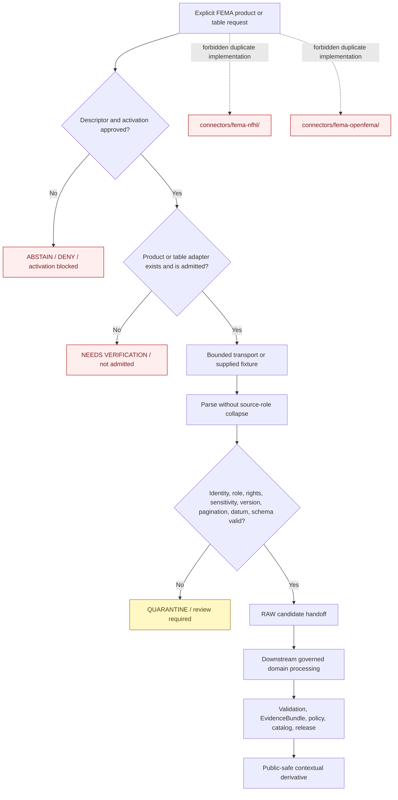

<!-- [KFM_META_BLOCK_V2]
doc_id: kfm://doc/connectors-fema-src-readme
title: connectors/fema/src/ — FEMA Connector Source Root
type: readme
version: v0.2
status: draft
owners: OWNER_TBD — Connector steward · FEMA source steward · NFHL product steward · OpenFEMA product steward · Hazards steward · Hydrology steward · Settlements/Infrastructure steward · Privacy/sensitivity reviewer · Rights reviewer · Security reviewer · Validation steward · Docs steward
created: 2026-06-18
updated: 2026-07-11
policy_label: public-context-only; source-root; shared-fema-package; greenfield; no-network-default; no-secret-import; per-product-admission; per-table-openfema-admission; raw-or-quarantine-only; not-for-life-safety; no-publication
proposed_path: connectors/fema/src/README.md
truth_posture: CONFIRMED README-only source scaffold / package implementation ABSENT / project metadata PLACEHOLDER / sources NOT ACTIVATED / flat FEMA product paths compatibility-only
related:
  - ../README.md
  - ../pyproject.toml
  - ../nfhl/README.md
  - ../tests/README.md
  - fema/README.md
  - ../../fema-nfhl/README.md
  - ../../fema-openfema/README.md
  - ../../../docs/sources/catalog/fema/README.md
  - ../../../docs/sources/catalog/fema/nfhl-flood-hazard.md
  - ../../../docs/sources/catalog/fema/map-service-center.md
  - ../../../docs/sources/catalog/fema/openfema-disaster-declarations.md
  - ../../../docs/sources/catalog/fema/openfema-auxiliary-tables.md
  - ../../../docs/sources/catalog/fema/nfip-claim-policy-aggregates.md
  - ../../../docs/domains/hazards/README.md
  - ../../../docs/domains/hazards/SOURCE_REGISTRY.md
  - ../../../docs/domains/hydrology/README.md
  - ../../../docs/domains/hydrology/CANONICAL_PATHS.md
  - ../../../docs/domains/hydrology/SOURCE_REGISTRY.md
  - ../../../docs/domains/settlements-infrastructure/README.md
  - ../../../data/registry/sources/
  - ../../../data/registry/hazards/sources/fema_disaster_declarations.yaml
  - ../../../data/raw/hydrology/fema_nfhl/README.md
  - ../../../data/raw/hazards/nfhl/README.md
  - ../../../data/raw/hazards/fema/README.md
  - ../../../data/quarantine/
  - ../../../fixtures/
  - ../../../schemas/contracts/v1/source/
  - ../../../policy/sensitivity/
  - ../../../release/
  - ../../../tools/ingest/nfhl_watch/README.md
  - ../../../tools/ingest/fema_decl_watch/README.md
  - ../../../pipelines/domains/hydrology/ingest_nfhl/README.md
tags: [kfm, connectors, fema, source-root, python, greenfield, nfhl, openfema, disaster-declarations, regulatory, administrative, aggregate, pagination, version-lock, datum, source-admission, raw, quarantine, governance]
notes:
  - "Repository inspection confirms that connectors/fema/src/ contains this README and the package-boundary README under fema/; no Python source file, import surface, product adapter, transport, parser, handoff builder, fixture, or executable test is proved."
  - "connectors/fema/pyproject.toml currently declares only project name kfm-connector-fema and version 0.0.0; build backend, package discovery, supported Python version, dependencies, entry points, and installation behavior are unproved."
  - "The preferred implementation destination is one shared package under connectors/fema/src/fema/. Product documentation remains separate at connectors/fema/nfhl/ and source-catalog pages."
  - "The flat connectors/fema-nfhl/ and connectors/fema-openfema/ paths are compatibility pointers and must not host parallel clients, parsers, tests, descriptors, configuration, activation state, or runtime behavior."
  - "NFHL must remain regulatory context; Disaster Declarations must remain administrative; OpenFEMA aggregates must retain an explicit aggregation unit; no FEMA record becomes observed-event truth by convenience."
[/KFM_META_BLOCK_V2] -->

<a id="top"></a>

# FEMA Connector Source Root

> Evidence-grounded source-root contract for future FEMA connector implementation. The current tree is a documentation-only greenfield scaffold: it does **not** provide an importable package, live FEMA access, approved product activation, executable tests, lifecycle writes, or publication capability.

<p>
  
  
  
  
  
  
</p>

`connectors/fema/src/`

> [!IMPORTANT]
> **Confirmed state:** this source root contains this README and the package-boundary README at `fema/README.md`. No `__init__.py`, build backend, package discovery configuration, dependency declaration, client, transport, dispatcher, NFHL adapter, OpenFEMA adapter, parser, pagination implementation, handoff builder, error model, fixture set, executable test, source activation, or passing CI evidence is confirmed. Treat every implementation structure below as a contract or proposal—not as current behavior.

**Quick jumps:** [Purpose](#purpose) · [Verified repository state](#verified-repository-state) · [Evidence ledger](#evidence-ledger) · [Source-root authority boundary](#source-root-authority-boundary) · [Placement and package decisions](#placement-and-package-decisions) · [Blocking drift](#blocking-drift) · [Architecture guardrails](#architecture-guardrails) · [Proposed source-root shapes](#proposed-source-root-shapes) · [Responsibility map](#responsibility-map) · [Configuration and dispatch](#configuration-and-dispatch) · [Transport and credentials](#transport-and-credentials) · [Parsing and normalization](#parsing-and-normalization) · [Product semantics](#product-semantics) · [Metadata preservation](#metadata-preservation) · [Finite outcomes](#finite-outcomes) · [Lifecycle and domain routing](#lifecycle-and-domain-routing) · [Import and packaging contract](#import-and-packaging-contract) · [Testing relationship](#testing-relationship) · [Watcher and pipeline separation](#watcher-and-pipeline-separation) · [Implementation sequence](#implementation-sequence) · [Activation gates](#activation-gates) · [Review and rollback](#review-and-rollback) · [Definition of done](#definition-of-done) · [Verification backlog](#verification-backlog)

---

## Purpose

`connectors/fema/src/` is the reserved Python source root for the shared FEMA connector package.

When implementation exists, this root may contain code that:

- exposes one intentionally small `fema` package;
- validates explicit, side-effect-free connector configuration;
- consumes accepted SourceDescriptor and activation references supplied by governed callers;
- dispatches only to specifically admitted FEMA products or OpenFEMA tables;
- constructs bounded requests for approved source surfaces;
- parses synthetic fixtures or approved source responses without upgrading source material to truth;
- preserves provider, product, table, record, source-role, temporal, geographic, regulatory, rights, sensitivity, retrieval, and digest metadata;
- keeps NFHL, Map Service Center, Disaster Declarations, auxiliary administrative records, and aggregates semantically distinct;
- detects incomplete pagination, stale state, schema drift, unstable identity, missing datum, missing version, unresolved rights, or sensitivity concerns;
- produces finite error, abstention, activation-blocked, review, RAW-candidate, or QUARANTINE-candidate outcomes;
- remains deterministic and testable with no network, no account, and no credentials.

This source root must never become FEMA truth, observed hazard truth, an emergency-alert system, a benefit or eligibility engine, an insurance determination service, legal advice, engineering certification, source-registry authority, schema authority, policy authority, release authority, or a public-data surface.

[Back to top ↑](#top)

---

## Verified repository state

The following scaffold is confirmed on the repository's `main` branch at the time of this update:

```text
connectors/fema/
├── README.md
├── pyproject.toml
├── nfhl/
│   └── README.md
├── src/
│   ├── README.md                         # this source-root contract
│   └── fema/
│       └── README.md                     # shared-package boundary
└── tests/
    └── README.md
```

Related flat compatibility paths:

```text
connectors/fema-nfhl/README.md            # NFHL compatibility pointer
connectors/fema-openfema/README.md        # OpenFEMA compatibility pointer
```

### Current maturity

| Surface | Confirmed content | Maturity |
|---|---|---:|
| `src/README.md` | This source-root contract. | **DOCUMENTED** |
| `src/fema/README.md` | Evidence-grounded package-boundary contract. | **DOCUMENTED** |
| Other files under `src/` | None found in the current repository search. | **ABSENT / NEEDS CONTINUOUS VERIFICATION** |
| `pyproject.toml` | Project name `kfm-connector-fema`; version `0.0.0`. | **PLACEHOLDER** |
| Build backend | None declared in the inspected file. | **ABSENT / UNPROVED** |
| `src` package discovery | None declared in the inspected file. | **ABSENT / UNPROVED** |
| Supported Python version | None declared in the inspected file. | **ABSENT / UNPROVED** |
| Runtime or optional dependencies | None declared in the inspected file. | **ABSENT / UNPROVED** |
| Importable `fema` namespace | No `__init__.py` or import test confirmed. | **ABSENT / UNPROVED** |
| FEMA configuration or dispatcher | None confirmed. | **ABSENT** |
| Network transport | None confirmed. | **ABSENT** |
| NFHL adapter | None confirmed. | **ABSENT** |
| OpenFEMA adapter | None confirmed. | **ABSENT** |
| Connector-result or handoff implementation | None confirmed. | **ABSENT** |
| Executable connector tests | None confirmed. | **ABSENT / UNPROVED** |
| Active FEMA product or table | No accepted activation decision confirmed here. | **NOT ACTIVATED** |
| Passing connector CI evidence | None confirmed. | **UNKNOWN** |

> [!CAUTION]
> A `src` directory, package-shaped child folder, project name, or extensive README is not implementation evidence. Do not describe `kfm-connector-fema` as installable, importable, runnable, integrated, activated, tested, compliant, or production-ready until repository artifacts and reviewable execution evidence support those claims.

[Back to top ↑](#top)

---

## Evidence ledger

| Evidence | Status | What it supports | What it does not support |
|---|---:|---|---|
| `connectors/fema/src/README.md` | **CONFIRMED** | A source-root boundary and future implementation location are documented. | Python source files or package behavior. |
| `connectors/fema/src/fema/README.md` | **CONFIRMED** | The shared package boundary, proposed architectures, product semantics, and activation gates are documented. | Importable or executable package behavior. |
| `connectors/fema/pyproject.toml` | **CONFIRMED placeholder** | Project name and version are reserved. | Build backend, package discovery, dependencies, entry points, installation, or import. |
| `connectors/fema/nfhl/README.md` | **CONFIRMED preferred product documentation** | NFHL product identity, regulatory role, required metadata, version, datum, and surface-class requirements are documented. | Implemented NFHL source access or parser. |
| `connectors/fema-nfhl/README.md` | **CONFIRMED compatibility pointer** | The flat NFHL path must not host duplicate implementation. | Independent connector authority. |
| `connectors/fema-openfema/README.md` | **CONFIRMED compatibility pointer** | OpenFEMA implementation belongs in the shared FEMA package and admission is table-specific. | Implemented OpenFEMA client, parser, or pagination. |
| `connectors/fema/tests/README.md` | **CONFIRMED documentation** | Required no-network, source-role, metadata, pagination, and failure test classes are described. | Executable tests or passing results. |
| FEMA source catalog pages | **CONFIRMED draft documentation** | Product roles, anti-collapse rules, and product-specific governance are documented. | Current endpoint values, current schemas, terms, activation, or runtime behavior. |
| `data/registry/hazards/sources/fema_disaster_declarations.yaml` | **CONFIRMED greenfield template** | A candidate descriptor identity exists for Disaster Declarations. | Approved role, authority, rights, sensitivity, cadence, access posture, or activation. |
| FEMA watcher and pipeline READMEs | **CONFIRMED documentation** | Connector, watcher, and downstream processing responsibilities are separated. | Executable watcher, pipeline, cadence, or lifecycle transition. |
| FEMA RAW-lane READMEs | **CONFIRMED documentation** | Candidate domain-routed RAW destinations are described. | Admitted payloads, receipts, accepted aliases, or promotion readiness. |

[Back to top ↑](#top)

---

## Source-root authority boundary

```text
THIS SOURCE ROOT MAY EVENTUALLY CONTAIN:
  one shared FEMA Python package
  explicit configuration models
  closed product/table dispatch
  bounded replaceable transport interfaces
  NFHL product adapters
  OpenFEMA product/table adapters
  parsers that preserve source meaning
  pagination and completeness accounting
  connector-local validation helpers
  finite connector result and error models
  RAW-or-QUARANTINE handoff candidate builders

THIS SOURCE ROOT MUST NOT CONTAIN OR OWN:
  canonical SourceDescriptors or activation decisions
  source catalog doctrine
  schemas or contracts as authority records
  policy, rights, sensitivity, or release decisions
  watcher or pipeline implementations belonging elsewhere
  real source payload dumps or lifecycle data
  credentials, API keys, tokens, cookies, or sessions
  generated hazard truth
  observed event creation from regulatory or administrative records
  direct WORK, PROCESSED, CATALOG, TRIPLET, PROOF, RECEIPT, RELEASE, or PUBLISHED writes
  public APIs, maps, tiles, dashboards, reports, stories, search payloads, or generated answers
  emergency alerts, forecasts, legal advice, insurance determinations, eligibility decisions, or engineering certifications
```

The source root is an implementation container. It does not decide whether a FEMA product is admitted, what role a source has, whether a record is public-safe, or whether a downstream claim may be released.

[Back to top ↑](#top)

---

## Placement and package decisions

Current repository evidence supports the following responsibility split:

| Responsibility | Preferred path | Current posture |
|---|---|---:|
| FEMA source-family coordination | `connectors/fema/` | **CONFIRMED scaffold** |
| FEMA Python source root | `connectors/fema/src/` | **CONFIRMED documentation-only root** |
| Shared FEMA package | `connectors/fema/src/fema/` | **CONFIRMED package README / implementation absent** |
| NFHL product documentation | `connectors/fema/nfhl/` | **CONFIRMED preferred product lane** |
| FEMA connector-local tests | `connectors/fema/tests/` | **CONFIRMED documentation / executable coverage unproved** |
| Flat NFHL path | `connectors/fema-nfhl/` | **NONCANONICAL compatibility pointer** |
| Flat OpenFEMA path | `connectors/fema-openfema/` | **NONCANONICAL compatibility pointer** |
| NFHL change detection | `tools/ingest/nfhl_watch/` | **DOCUMENTED / implementation unproved** |
| Declaration change detection | `tools/ingest/fema_decl_watch/` | **DOCUMENTED / implementation unproved** |
| Hydrology NFHL processing | `pipelines/domains/hydrology/ingest_nfhl/` | **DOCUMENTED / implementation unproved** |

Package-code placement and product-documentation placement are different decisions. A product README under `connectors/fema/nfhl/` does not require Python modules to live beneath that documentation directory.

> [!IMPORTANT]
> Implement FEMA source behavior once under `connectors/fema/src/fema/`. Do not create parallel clients, parsers, descriptors, fixtures, tests, endpoint settings, caches, activation state, or lifecycle writers under `connectors/fema-nfhl/`, `connectors/fema-openfema/`, or `connectors/fema/nfhl/` unless an accepted package-layout decision explicitly changes this structure.

[Back to top ↑](#top)

---

## Blocking drift

The source root cannot be implemented safely until these gaps are resolved or represented as explicit fail-closed conditions.

| Blocker | Current state | Required resolution |
|---|---|---|
| Source-root inventory | README plus package README only. | Keep documentation claims aligned with the live tree. |
| Package importability | No `__init__.py` or import test. | Select package strategy and prove clean import. |
| Build configuration | `pyproject.toml` has only name and version. | Add reviewed build backend, `src` discovery, Python requirement, dependencies, optional groups, and version policy. |
| Package architecture | Flat-module and product-subpackage options are both proposed. | Choose one; do not implement both in parallel. |
| Parent/test documentation | Older parent and test READMEs still carry prior path ambiguity. | Align them with current compatibility-pointer decisions or adopt a superseding ADR. |
| Connector-result contract | No binding result or handoff shape is confirmed. | Select contracts, schemas, validation, and finite outcomes. |
| NFHL SourceDescriptor | No accepted active descriptor confirmed. | Approve product ID, regulatory role, source surfaces, rights, cadence, routing, and activation. |
| OpenFEMA descriptors | Declaration template is unresolved; auxiliary table descriptors are absent or unproved. | Review each table independently; no umbrella admission. |
| Endpoint/archive inventory | Current FEMA source surfaces are not pinned here. | Source steward verifies product/table identity, endpoint or archive, version, schema, and terms. |
| Rights and sensitivity | Current source terms and public-safe rules are incomplete or unverified. | Complete product/table-specific rights, attribution, privacy, precision, and joining review. |
| Stable identity and time semantics | Per-product/table keys and time meanings are not implemented. | Pin deterministic identity and distinguish source, event, declaration, reporting, update, and retrieval times. |
| Pagination and completeness | OpenFEMA accounting is not implemented. | Define stable ordering, continuation, counts, duplicate/gap checks, and incomplete-run behavior. |
| NFHL surface and datum controls | Analytic/visualization classes, version, CRS, datum, units, and field inventory are not implemented. | Pin current source metadata and negative tests. |
| RAW routing | Hydrology uses `fema_nfhl`; Hazards uses `nfhl` in current documentation. | Confirm one handoff contract or explicitly governed aliases. |
| Fixtures and tests | Test documentation exists; executable fixtures/tests are unproved. | Add synthetic no-network cases against implemented code. |
| CI | No passing connector-specific run is confirmed. | Prove a clean local no-network command before CI enforcement claims. |

Do not paper over these gaps with guessed endpoints, implicit defaults, invented schemas, permissive role inference, or examples presented as operational configuration.

[Back to top ↑](#top)

---

## Architecture guardrails

Any future source-root implementation must preserve these invariants:

1. **One shared FEMA package.** NFHL and OpenFEMA behavior are implemented once beneath `connectors/fema/src/fema/`.
2. **Explicit product dispatch.** Every request names an admitted product or table; there is no generic “fetch all FEMA” operation.
3. **Descriptor-driven activation.** SourceDescriptor and activation evidence are caller-supplied governance inputs, not package-local assumptions.
4. **Role preservation.** `regulatory`, `administrative`, and `aggregate` meanings remain distinct through parsing and handoff.
5. **No import side effects.** Imports perform no network, secret reads, filesystem writes, logging setup, environment mutation, or source activation.
6. **No-network testability.** Parsing, validation, pagination accounting, drift detection, and handoff construction operate on supplied fixtures.
7. **Bounded transport.** Requests have explicit timeout, retry, backoff, rate-limit, pagination, redirect, content-type, and size limits once approved.
8. **Fail closed.** Missing identity, role, rights, sensitivity, version, datum, stable key, pagination, completeness, or schema evidence blocks promotion-track output.
9. **Immutable source meaning.** Source-issued fields remain available; normalization never silently destroys regulatory, administrative, aggregate, temporal, or geographic semantics.
10. **Minimal connector normalization.** Domain joins, geometry repair, place resolution, redaction, aggregation, evidence closure, and publication shaping remain downstream unless a binding pre-admission contract requires a bounded transform.
11. **Finite outcomes.** Errors, abstentions, review states, and handoff candidates are explicit and deterministic.
12. **No publication.** Source-root output stops at finite connector results and RAW-or-QUARANTINE candidates.

[Back to top ↑](#top)

---

## Proposed source-root shapes

No source-file layout is accepted yet. Two coherent package options are documented so the design decision remains explicit.

### Option A — small flat package

```text
connectors/fema/src/
├── README.md
└── fema/
    ├── README.md
    ├── __init__.py
    ├── config.py
    ├── dispatch.py
    ├── transport.py
    ├── nfhl.py
    ├── openfema.py
    ├── envelope.py
    └── errors.py
```

Use this only while product behavior remains small, independently testable, and understandable without hidden cross-module state.

### Option B — product subpackages

```text
connectors/fema/src/
├── README.md
└── fema/
    ├── README.md
    ├── __init__.py
    ├── config.py
    ├── dispatch.py
    ├── transport.py
    ├── envelope.py
    ├── errors.py
    ├── nfhl/
    │   ├── __init__.py
    │   ├── surfaces.py
    │   ├── client.py
    │   ├── bulk.py
    │   ├── parse.py
    │   └── validate.py
    └── openfema/
        ├── __init__.py
        ├── client.py
        ├── pagination.py
        ├── declarations.py
        ├── auxiliary.py
        ├── aggregates.py
        └── validate.py
```

Use this only when product-specific ownership, tests, dependencies, interfaces, and maintenance justify the additional structure.

> [!IMPORTANT]
> Both trees are **PROPOSED**. Do not create every file mechanically. Each module must correspond to implemented responsibility, a known contract, executable tests, and an owner. Documentation folders do not dictate Python subpackage structure.

[Back to top ↑](#top)

---

## Responsibility map

| Surface | Responsibility | Boundary |
|---|---|---|
| `src/README.md` | Source-root placement, inventory, packaging, and cross-package constraints. | No runtime behavior. |
| `src/fema/README.md` | Shared package contract and implementation design choices. | Does not prove package files exist. |
| `fema/__init__.py` *(future)* | Narrow deliberate public import surface. | No network, secrets, filesystem writes, logging setup, or activation. |
| `fema/config.py` *(future)* | Explicit validated configuration models and safe defaults. | No self-activation or provider-wide enable switch. |
| `fema/dispatch.py` *(future)* | Closed product/table routing. | No URL-substring routing or role inference. |
| `fema/transport.py` *(future)* | Bounded replaceable HTTP/archive transport. | No parsing policy or credential acquisition hidden inside parsers. |
| NFHL module/subpackage *(future)* | NFHL surface classification, parsing, version/datum checks, and product-specific validation. | No observed-event, insurance, legal, engineering, or life-safety conclusions. |
| OpenFEMA module/subpackage *(future)* | Per-table identity, pagination, parsing, role, privacy, aggregation, and completeness checks. | No umbrella table admission or aggregate-to-individual inference. |
| `fema/envelope.py` *(future)* | Finite connector-result and RAW/QUARANTINE handoff candidates. | No direct downstream promotion. |
| `fema/errors.py` *(future)* | Small deterministic redacted error taxonomy. | No unbounded raw-payload or secret content. |
| `connectors/fema/tests/` | Connector-local executable tests and safe fixtures/references. | Not source code or release authority. |
| `connectors/fema/nfhl/` | NFHL product documentation and coordination. | Not a second package implementation. |
| `tools/ingest/*watch/` | Change detection and proposed-work signals. | Not source admission, lifecycle mutation, or publication. |
| `pipelines/domains/...` | Governed downstream domain processing. | Not source activation authority. |

Shared utilities should move outside this connector only after multiple connectors require them and the shared ownership, contracts, dependencies, tests, and migration plan are reviewed.

[Back to top ↑](#top)

---

## Configuration and dispatch

Configuration must be explicit, validated, side-effect free, and incapable of activating sources by convenience.

A future request should carry, subject to the accepted contract:

- canonical SourceDescriptor reference;
- activation decision reference;
- provider identity `fema`;
- explicit product family;
- exact product or OpenFEMA table key;
- explicit source role;
- approved source surface, dataset slug, archive, or service identity;
- reviewed request scope;
- rights and attribution reference;
- privacy and sensitivity obligations;
- timeout, retry, pagination, and size limits;
- intended domain route;
- intended lifecycle target of RAW or QUARANTINE only.

Required dispatch behavior:

- reject unknown or non-admitted product/table keys;
- reject product/role mismatches;
- reject missing descriptor or activation evidence for live requests;
- never route by URL substring alone;
- never infer OpenFEMA table role from adjacency in an API listing;
- never use a broad provider-wide switch to activate every FEMA product;
- keep NFHL, Map Service Center, Disaster Declarations, auxiliary tables, and NFIP aggregates distinct;
- keep test-only fixture configuration unable to fall through to live access;
- keep configuration errors finite, redacted, and actionable;
- document no environment-variable name as accepted until implementation and security review establish it.

[Back to top ↑](#top)

---

## Transport and credentials

When a live transport is eventually approved:

- network access must be invoked explicitly;
- endpoint, archive, service, product, and table identity must come from reviewed configuration or descriptor references;
- credentials, API keys, cookies, and tokens must use approved secret handling;
- authorization material must never be committed, cached in fixtures, or printed in logs;
- parsers must not know how credentials are acquired;
- timeouts, response-size limits, pagination limits, and archive-size limits must be explicit;
- retries and backoff must be finite;
- rate-limit responses must not trigger unbounded loops;
- redirects, host changes, content types, encodings, and archive formats must be validated;
- OpenFEMA pagination must carry completeness evidence;
- bulk downloads must be checksum-bound and must not silently overwrite prior captures;
- source payload logging must be minimized;
- test doubles must be usable without network or credentials;
- live smoke tests, if approved, must be isolated from default tests and public CI output.

Transport returns bytes, rows, pages, archives, or explicit transport outcomes. It must not assign source roles, perform domain joins, publish data, or hide incomplete retrieval.

[Back to top ↑](#top)

---

## Parsing and normalization

Parsing preserves source meaning; it does not manufacture domain truth.

Required parser behavior:

- accept supplied bytes, mappings, rows, pages, archives, or fixture objects through explicit interfaces;
- retain raw source identifiers and exact source surface/table identity;
- distinguish missing, null, empty, unsupported, redacted, and malformed values;
- preserve unknown fields or reject them according to a documented schema-drift policy;
- never silently rename or drop NFHL regulatory attributes;
- never merge FEMA records into canonical hazard events, properties, people, projects, places, or infrastructure objects;
- keep source timestamps distinct from retrieval and processing timestamps;
- distinguish declaration dates, incident periods, award/project times, reporting periods, update times, and retrieval times;
- distinguish designated jurisdictions, project locations, applicant locations, aggregation geography, and observed hazard footprints;
- preserve source roles through every parsed candidate;
- preserve stable keys or report their absence explicitly;
- record parser and schema fingerprints where the handoff contract supports them;
- produce deterministic output for identical input and configuration.

Connector-edge normalization should be minimal. Place resolution, geometry repair, reprojection, vertical transformation, sensitive-field suppression, redaction, aggregation, evidence closure, and public-output shaping belong downstream unless a binding connector contract explicitly requires a bounded pre-admission transform with evidence.

[Back to top ↑](#top)

---

## Product semantics

| Product area | Required source-role posture | Source-root guardrails |
|---|---|---|
| NFHL | `regulatory` | Preserve regulatory attributes, surface class, version, effective date, CRS, datum, units, and lineage. Never emit observed inundation, forecast, warning, insurance, legal, compliance, or engineering conclusions. |
| Map Service Center | Product-specific document/distribution context, subject to descriptor review | Preserve panel, study, document, revision, and effective-state identity. Do not substitute rendered panels for governed analytic vectors. |
| OpenFEMA Disaster Declarations | `administrative` | Preserve federal-action semantics, declaration number/type, declaration date, incident period, and designated jurisdictions. Never emit a `Hazard Event` from a declaration alone. |
| OpenFEMA auxiliary action records | `administrative` | Preserve table identity, stable key, program/action meaning, privacy review, and geography semantics. Do not infer damage, completion, or physical conditions. |
| OpenFEMA totals and rollups | `aggregate` | Require explicit aggregation unit, population/scope, geography, and time period. Never infer person, household, applicant, property, or site-level facts. |
| NFIP claim or policy aggregates | `aggregate`, subject to dedicated review | Preserve aggregation, suppression, precision, joining, and temporal context; never expose or infer household/property truth. |

### Source-role anti-collapse rules

```text
NFHL regulatory zone
  ≠ observed flood event
  ≠ forecast or warning

FEMA Disaster Declaration
  = administrative federal action
  ≠ observed hazard event

Grant / project / registration / mission assignment
  = administrative program record
  ≠ verified damage, completion, or physical condition

Count / total / cost rollup
  = aggregate evidence at a declared unit
  ≠ individual, household, applicant, property, or site truth
```

Downstream workflows may combine FEMA records with independently governed observed evidence. The source root must preserve each source role and must not create the semantic upgrade itself.

[Back to top ↑](#top)

---

## Metadata preservation

### Cross-product minimum

Every non-error candidate should preserve, where applicable:

- canonical KFM source identifier;
- FEMA product or OpenFEMA table key;
- source role and role authority;
- record, feature, panel, project, declaration, or row stable identity;
- source URI, archive identity, service identity, or query scope;
- retrieval start and completion times;
- source version and schema fingerprint;
- connector and parser version;
- rights, attribution, privacy, and sensitivity review state;
- checksum or digest;
- intended domain route;
- intended lifecycle target of RAW or QUARANTINE only;
- review, drift, incompleteness, stale, and quarantine flags.

### NFHL-specific minimum

- source surface class: analytic vector, visualization-only, archive, metadata, or derived display;
- feature class and object identity;
- `DFIRM_ID` where carried;
- `VERSION_ID` or accepted equivalent;
- `EFFECTIVE_DATE` and revision lineage;
- flood-zone designation and study references;
- BFE fields where present;
- CRS, horizontal datum, vertical datum, and units;
- panel, study, jurisdiction, package, and query scope;
- feature counts, checksums, and completeness evidence.

### OpenFEMA-specific minimum

- exact dataset slug/key and API/schema version;
- stable row key or documented composite key;
- source role: `administrative` or `aggregate`;
- aggregation unit for aggregate tables;
- declaration, program, project, award, registration, assignment, or cost identity as applicable;
- distinct time meanings;
- exact geography meaning;
- query filters and deterministic ordering where available;
- page size, offset/token/continuation state, pages requested/received, and count evidence;
- duplicate, gap, count-mismatch, and unstable-ordering signals;
- privacy, PII, property, address, precise-infrastructure, and joining-risk review flags.

Source-issued values should remain available in the source-admission record. Simplified or derived values may be added downstream only when originals and transformation evidence remain inspectable.

[Back to top ↑](#top)

---

## Finite outcomes

Future source-root APIs should return or raise a small documented set of finite outcomes instead of ambiguous partial success.

| Condition | Required safe behavior |
|---|---|
| Package target absent or not installed | Fail clearly; do not report connector validation success. |
| SourceDescriptor missing | Refuse live activation with an actionable error. |
| Activation decision missing | `ABSTAIN` or activation-blocked result. |
| Product or table not admitted | `NEEDS_VERIFICATION` or table-not-admitted result. |
| Product/role mismatch | Validation failure. |
| Network disabled | Fixture/parser paths remain usable; live request returns a bounded disabled outcome. |
| Unauthorized or forbidden | Finite redacted error; no credential leakage. |
| Timeout or rate limit | Bounded error; no infinite retry. |
| Redirect, content type, or archive format unexpected | Validation failure or quarantine. |
| Empty response | `ABSTAIN` unless the approved contract defines empty as valid. |
| Malformed response | Finite parser error with safe source metadata. |
| Schema or field drift | Reviewable drift result; no silent data loss. |
| Stable key missing or changed | Block deterministic update and deduplication. |
| OpenFEMA pagination incomplete | Quarantine or incomplete-run result. |
| Count mismatch, duplicate, or gap | Quarantine and completeness review. |
| NFHL visualization surface used for analytics | Validation failure. |
| NFHL version or effective date missing | Quarantine or abstention. |
| NFHL datum or units unresolved | Quarantine; block elevation and engineering use. |
| NFHL regulatory attributes dropped | Validation failure. |
| Aggregate unit missing | Validation failure or quarantine. |
| Rights, privacy, or sensitivity unresolved | No public-safe result; review or quarantine. |
| Attempted direct downstream or public write | Hard failure. |
| Warning, eligibility, insurance, legal, engineering, or life-safety determination requested | Refuse and direct callers to official or governed channels. |

Errors must be deterministic, actionable, safe to log, and free of secrets or unnecessary source-payload content.

[Back to top ↑](#top)

---

## Lifecycle and domain routing

The source root participates only at the source-admission edge.



KFM lifecycle discipline remains:

```text
RAW -> WORK / QUARANTINE -> PROCESSED -> CATALOG / TRIPLET -> PUBLISHED
```

Domain routing must remain explicit:

- NFHL may feed approved Hydrology, Hazards, and exposure-context RAW or QUARANTINE lanes without changing its `regulatory` role;
- Disaster Declarations may feed the Hazards `DisasterDeclaration` lane without becoming observed events;
- OpenFEMA project or grant tables may feed approved Hazards or Settlements/Infrastructure lanes while retaining `administrative` meaning;
- aggregate tables retain their aggregation unit through every route;
- routing to multiple domains does not create multiple connector implementations;
- the source root may construct a handoff candidate or invoke a reviewed handoff interface once a binding contract exists;
- the source root must not independently promote, normalize into domain truth, catalog, prove, release, or publish data.

[Back to top ↑](#top)

---

## Import and packaging contract

Before the source root or package can be described as importable:

- a reviewed build backend must be declared;
- `src` package discovery must be configured;
- the supported Python version must be declared;
- runtime and optional test dependencies must be explicit;
- an `__init__.py` or accepted namespace-package strategy must exist;
- the public import surface must be deliberately small;
- importing the package must perform no network, secret reads, filesystem writes, logging configuration, environment mutation, or source activation;
- optional product dependencies must fail with clear installation guidance rather than import-time side effects;
- package and import behavior must be exercised from a clean environment;
- project versioning must move beyond `0.0.0` only when the repository's version policy permits it;
- build artifacts must not contain credentials, source payloads, caches, or private configuration;
- packaging tests must verify that only intended source files are included.

Potential public imports are **not yet approved**. Do not document concrete functions as available until they exist, are packaged, and pass clean-environment tests.

[Back to top ↑](#top)

---

## Testing relationship

Connector-local tests belong outside the source root at:

```text
connectors/fema/tests/
```

Future source-root tests should prove:

- clean import with no network, secret read, file write, logging setup, or environment mutation;
- no-network default transport behavior;
- explicit descriptor and activation requirements;
- closed product/table dispatch;
- rejection of flat compatibility paths as implementation homes;
- NFHL regulatory-role preservation;
- analytic-vector and visualization-only separation;
- NFHL regulatory attribute, version, effective-date, datum, units, checksum, and completeness guards;
- Disaster Declarations remain administrative rather than Hazard Events;
- auxiliary administrative tables preserve action semantics;
- aggregate tables require an exact aggregation unit;
- OpenFEMA pagination, duplicate, gap, count, stable-key, freshness, and drift checks fail closed;
- privacy, PII, address, property, precise-location, and sensitive-infrastructure cases route to review, restriction, quarantine, or denial;
- errors are finite and redacted;
- only RAW or QUARANTINE handoff targets are accepted;
- processed, catalog, triplet, proof, receipt, release, and publication writes are rejected.

Fixtures must be synthetic, minimized, no-network, and free of real applicant, household, property, credential, or sensitive-infrastructure data unless a separate governed approval exists.

No test command, test dependency, executable test inventory, live-test marker, or passing status is confirmed by this README.

[Back to top ↑](#top)

---

## Watcher and pipeline separation

Source access, source change detection, domain processing, policy, and release are separate responsibilities.

| Surface | Responsibility | Must not do |
|---|---|---|
| FEMA package | Approved source access, parsing, connector-local validation, finite outcomes, and RAW/QUARANTINE handoff candidates. | Publish, promote, own domain normalization, or decide release. |
| `tools/ingest/nfhl_watch/` | Detect NFHL metadata, version, schema, or source-state changes and emit review signals. | Fetch promotion-track data by authority, publish, or mutate lifecycle state. |
| `tools/ingest/fema_decl_watch/` | Detect Disaster Declaration administrative changes and emit proposed-work or review signals. | Create observed hazard events, alerts, eligibility decisions, or publication records. |
| `pipelines/domains/hydrology/ingest_nfhl/` | Governed downstream Hydrology ingest and normalization after admission. | Activate sources or bypass RAW/QUARANTINE. |
| Hazards/Hydrology/Settlements policies and validators | Decide domain admissibility, sensitivity, role, transformation, and release prerequisites. | Rewrite source evidence invisibly. |
| Release surfaces | Approve public-safe derivatives, corrections, withdrawal, and rollback. | Treat connector or watcher output as released truth. |

A watcher signal is not a SourceDescriptor, activation decision, ingest receipt, observed event, regulatory update approval, lifecycle transition, or publication decision.

[Back to top ↑](#top)

---

## Implementation sequence

Implement in dependency order:

1. **Resolve source-root and package convention**
   - select build backend and `src` package discovery;
   - declare supported Python version and dependency policy;
   - choose flat-module or product-subpackage design;
   - define the narrow public import surface.
2. **Align documentation and placement**
   - update the FEMA parent and test READMEs to reflect compatibility-path decisions;
   - keep NFHL product documentation separate from package implementation;
   - inventory generated skeletons and stale flat-path references.
3. **Resolve governance contracts**
   - accept SourceDescriptor and activation interfaces;
   - select finite connector-result and RAW/QUARANTINE handoff contracts;
   - define domain routing and alias policy.
4. **Add configuration and finite errors**
   - no-network defaults;
   - explicit product/table keys;
   - bounded limits;
   - deterministic redacted error types.
5. **Implement one fixture-only product slice**
   - choose NFHL or Disaster Declarations;
   - parse supplied synthetic fixtures only;
   - preserve source role and required metadata;
   - add executable tests before live transport.
6. **Add validated transport**
   - only after source surfaces, terms, activation, limits, and security posture are reviewed;
   - keep transport replaceable by test doubles;
   - prove bounded failure behavior.
7. **Add handoff integration**
   - only after the binding RAW/QUARANTINE contract and domain routing are accepted;
   - reject direct downstream writes.
8. **Add additional products or tables independently**
   - each OpenFEMA table receives its own descriptor, role, stable key, sensitivity, rights, cadence, parser, fixtures, tests, and activation decision.
9. **Add watcher and pipeline interfaces separately**
   - exchange finite metadata or handoff contracts;
   - do not merge responsibilities into the connector package.
10. **Add CI last**
    - prove a clean local no-network command first;
    - retain reviewable run evidence;
    - do not upgrade maturity badges before evidence exists.

[Back to top ↑](#top)

---

## Activation gates

No live FEMA source behavior should run until all applicable gates close:

- [ ] Source-root packaging and clean import behavior are verified from a clean environment.
- [ ] Public import surface is reviewed and side-effect free.
- [ ] One package architecture is accepted.
- [ ] Canonical product/table source identifier is accepted.
- [ ] SourceDescriptor and activation decision exist.
- [ ] Product/table source role is explicit and tested.
- [ ] Current endpoint, archive, dataset slug, API/schema version, or service identity is verified.
- [ ] Source terms, rights, attribution, and redistribution posture are reviewed.
- [ ] Sensitivity, privacy, precision, and joining risks are reviewed.
- [ ] Stable record identity and temporal/geographic semantics are defined.
- [ ] Pagination, completeness, freshness, retry, timeout, rate-limit, redirect, and size bounds are defined.
- [ ] NFHL surface classes, regulatory fields, version, CRS, datum, and units are pinned where applicable.
- [ ] OpenFEMA aggregation units, stable keys, PII handling, and suppression obligations are pinned where applicable.
- [ ] Binding connector result, RAW/QUARANTINE handoff, and domain routing are accepted.
- [ ] Synthetic no-network fixtures and executable tests pass.
- [ ] Secrets and configuration use approved handling.
- [ ] Watcher, connector, pipeline, policy, and release responsibilities remain separate.
- [ ] Rollback, correction, cache invalidation, and incomplete-run procedures are documented.
- [ ] CI evidence is reviewable before any activation or maturity claim is upgraded.

Until then, the source root remains documentation-only and live access remains inactive.

[Back to top ↑](#top)

---

## Review and rollback

Review source-root changes as source-role, privacy, regulatory-context, packaging, and life-safety-adjacent changes.

A reviewer should confirm:

- implementation claims match the repository tree and test evidence;
- package layout is singular and does not duplicate flat compatibility paths;
- package and product-documentation responsibilities remain separate;
- imports are side-effect free;
- descriptors and activation remain external governance inputs;
- product and table roles remain explicit;
- NFHL remains regulatory context rather than observed flooding;
- Disaster Declarations remain administrative rather than observed events;
- aggregate records cannot become individual or property truth;
- pagination, stable-key, version, datum, rights, privacy, and sensitivity guards fail closed;
- source-root outputs stop at finite results and RAW/QUARANTINE candidates;
- no public client consumes connector or lifecycle-internal data directly;
- no language or API suggests warning, insurance, legal, engineering, eligibility, or life-safety authority.

Rollback is required if a change:

- claims importability, activation, endpoint support, tests, or CI without evidence;
- adds import-time network, secret, filesystem, logging, or activation behavior;
- creates parallel implementation under `connectors/fema-nfhl/`, `connectors/fema-openfema/`, or `connectors/fema/nfhl/`;
- enables umbrella FEMA or OpenFEMA admission;
- collapses regulatory, administrative, aggregate, or observed roles;
- weakens pagination, completeness, version, datum, rights, privacy, or sensitivity controls;
- writes directly beyond RAW/QUARANTINE handoff;
- exposes source payloads, secrets, personal data, or sensitive infrastructure rows;
- emits public claims or determination-like output.

Rollback procedure:

1. Revert the unsafe or misleading source-root change.
2. Restore the last verified no-network and no-secret import posture.
3. Remove or quarantine any unapproved source payloads, caches, or credentials and assess repository-history exposure.
4. Move legitimate product documentation, tests, tooling, pipeline, policy, lifecycle, or release work to its correct responsibility lane.
5. Repair imports, descriptors, configuration, workflows, and compatibility links.
6. Record source-role, schema, pagination, privacy, datum, version, packaging, or life-safety drift in the appropriate register.
7. Re-run the last verified clean test command when one exists.
8. Correct README maturity badges and claims to match evidence.

[Back to top ↑](#top)

---

## Definition of done

This source root is not complete merely because its boundary is documented.

- [x] Current README-only source-root state is explicit.
- [x] Placeholder `pyproject.toml` maturity is explicit.
- [x] Shared FEMA package placement is separated from product documentation.
- [x] Flat NFHL and OpenFEMA paths are treated as compatibility-only.
- [x] Regulatory, administrative, aggregate, and observed-role boundaries are explicit.
- [x] RAW-or-QUARANTINE-only connector output is explicit.
- [x] Watcher, connector, pipeline, domain, and release responsibilities are separated.
- [ ] Parent FEMA and test documentation are aligned with current placement decisions.
- [ ] Build backend, `src` discovery, Python version, and dependencies are declared.
- [ ] `fema` imports cleanly without side effects.
- [ ] One accepted package architecture is implemented.
- [ ] Configuration, dispatch, transport, and finite error contracts exist.
- [ ] Canonical SourceDescriptor and activation interfaces are enforced.
- [ ] At least one product adapter is implemented against synthetic fixtures.
- [ ] NFHL metadata/surface guards or OpenFEMA pagination/role guards are executable and tested.
- [ ] Binding connector-result and handoff contracts are selected.
- [ ] Domain RAW/QUARANTINE routing and aliases are accepted.
- [ ] Default no-network tests pass from a clean environment.
- [ ] CI wiring and passing evidence exist.
- [ ] Current source terms, endpoints, schemas, rights, and sensitivity reviews support any live activation.
- [ ] Watcher and pipeline integrations remain independently governed.
- [ ] No package or source-root API creates public claims or formal determinations.

[Back to top ↑](#top)

---

## Verification backlog

| Item | Status | Needed evidence |
|---|---:|---|
| Confirm `src/README.md` and `src/fema/README.md` remain the only files below `connectors/fema/src/` until implementation begins. | **NEEDS CONTINUOUS VERIFICATION** | Repository tree inspection. |
| Choose package architecture: flat modules or product subpackages. | **OPEN DECISION** | Design review, ownership, dependency, and test analysis. |
| Complete `pyproject.toml`. | **BLOCKED** | Build backend, package discovery, Python version, dependencies, optional groups, and version policy. |
| Confirm package import name and public API. | **NEEDS VERIFICATION** | Package files and clean-environment import tests. |
| Align `connectors/fema/README.md` with preferred NFHL product and shared OpenFEMA package decisions. | **NEEDS VERIFICATION** | Parent README update or accepted ADR. |
| Align `connectors/fema/tests/README.md` with current source-root and compatibility decisions. | **NEEDS VERIFICATION** | Test README update and executable path assertions. |
| Confirm accepted connector result and RAW/QUARANTINE handoff contract. | **NEEDS VERIFICATION** | Contracts, schemas, validators, and tests. |
| Confirm NFHL SourceDescriptor ID, product surfaces, rights, cadence, domain routing, and activation. | **NEEDS VERIFICATION** | Validated registry record and source-steward decision. |
| Confirm Disaster Declarations SourceDescriptor fields and activation. | **BLOCKED TEMPLATE** | Completed descriptor, schema validation, rights/sensitivity review, and activation decision. |
| Inventory and review every candidate OpenFEMA auxiliary table. | **NEEDS VERIFICATION** | Per-table descriptors, roles, keys, privacy, rights, cadence, and decisions. |
| Confirm current NFHL analytic-vector, visualization, metadata, and archive surfaces. | **NEEDS VERIFICATION** | Current FEMA source metadata and product review. |
| Confirm NFHL feature classes, required fields, version, CRS, datum, and units. | **NEEDS VERIFICATION** | Current data dictionary, schemas, fixtures, and tests. |
| Confirm OpenFEMA pagination and completeness contract. | **NEEDS VERIFICATION** | Current API behavior, test fixtures, and parser tests. |
| Confirm stable identity and temporal/geographic semantics per OpenFEMA table. | **NEEDS VERIFICATION** | Table documentation, descriptors, contracts, and tests. |
| Confirm privacy, PII, property, applicant, and sensitive-infrastructure handling. | **NEEDS VERIFICATION** | Sensitivity policy, negative fixtures, and reviewer decisions. |
| Resolve NFHL Hydrology/Hazards RAW routing names. | **NEEDS VERIFICATION** | Handoff contract and domain-steward decision. |
| Confirm no-network default and executable test command. | **NEEDS VERIFICATION** | Test configuration and clean run output. |
| Confirm watcher and pipeline interfaces. | **NEEDS VERIFICATION** | Implemented code, finite envelopes, fixtures, tests, and ownership review. |
| Confirm connector-output boundary enforcement. | **NEEDS VERIFICATION** | Validators, negative tests, ADRs, and CI evidence. |
| Inventory and correct generated templates or skeleton maps that recreate flat FEMA connector paths. | **NEEDS VERIFICATION** | Repository-wide path and template review. |

---

## Maintainer note

Keep `connectors/fema/src/` boring, narrow, and evidence-grounded. Build FEMA source access once inside one shared package; keep product meaning in product documentation; keep source activation in governed registry decisions; keep domain processing downstream; and keep publication behind evidence, policy, review, correction, and rollback gates.

[Back to top ↑](#top)
