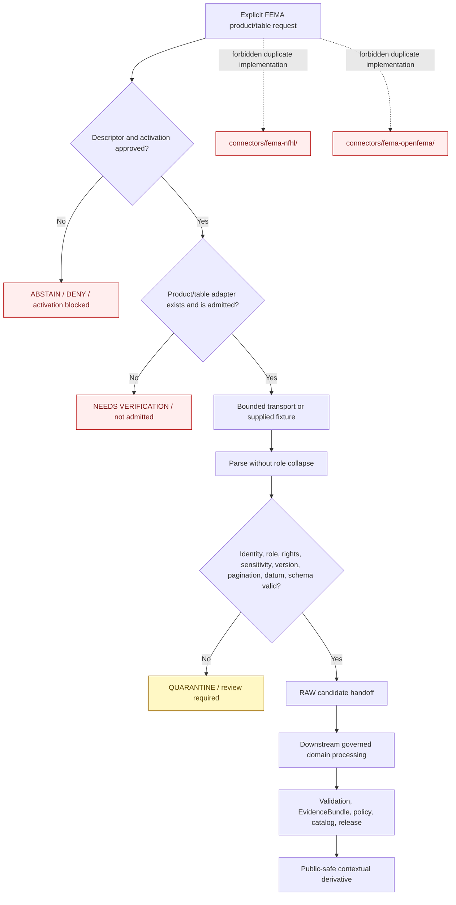

<!-- [KFM_META_BLOCK_V2]
doc_id: kfm://doc/connectors-fema-src-package-readme
title: connectors/fema/src/fema/ — FEMA Connector Package Boundary
type: readme
version: v0.2
status: draft
owners: OWNER_TBD — Connector steward · FEMA source steward · NFHL product steward · OpenFEMA product steward · Hazards steward · Hydrology steward · Settlements/Infrastructure steward · Privacy/sensitivity reviewer · Rights reviewer · Security reviewer · Validation steward · Docs steward
created: 2026-06-18
updated: 2026-07-11
policy_label: public-context-only; package-boundary; shared-fema-package; greenfield; no-network-default; no-secret-import; per-product-admission; per-table-openfema-admission; raw-or-quarantine-only; not-for-life-safety; no-publication
proposed_path: connectors/fema/src/fema/README.md
truth_posture: CONFIRMED README-only package directory / PLACEHOLDER project metadata / NOT IMPORTABLE OR EXECUTABLE / sources NOT ACTIVATED / product modules ABSENT
related:
  - ../../README.md
  - ../README.md
  - ../../pyproject.toml
  - ../../nfhl/README.md
  - ../../tests/README.md
  - ../../../fema-nfhl/README.md
  - ../../../fema-openfema/README.md
  - ../../../../docs/sources/catalog/fema/README.md
  - ../../../../docs/sources/catalog/fema/nfhl-flood-hazard.md
  - ../../../../docs/sources/catalog/fema/map-service-center.md
  - ../../../../docs/sources/catalog/fema/openfema-disaster-declarations.md
  - ../../../../docs/sources/catalog/fema/openfema-auxiliary-tables.md
  - ../../../../docs/sources/catalog/fema/nfip-claim-policy-aggregates.md
  - ../../../../docs/domains/hazards/README.md
  - ../../../../docs/domains/hydrology/README.md
  - ../../../../docs/domains/settlements-infrastructure/README.md
  - ../../../../data/registry/sources/
  - ../../../../data/registry/hazards/sources/fema_disaster_declarations.yaml
  - ../../../../data/raw/hydrology/fema_nfhl/README.md
  - ../../../../data/raw/hazards/nfhl/README.md
  - ../../../../data/raw/hazards/fema/README.md
  - ../../../../data/quarantine/
  - ../../../../fixtures/
  - ../../../../schemas/contracts/v1/source/
  - ../../../../policy/sensitivity/
  - ../../../../release/
  - ../../../../tools/ingest/nfhl_watch/README.md
  - ../../../../tools/ingest/fema_decl_watch/README.md
  - ../../../../pipelines/domains/hydrology/ingest_nfhl/README.md
tags: [kfm, connectors, fema, python-package, greenfield, nfhl, openfema, disaster-declarations, administrative, regulatory, aggregate, pagination, version-lock, datum, source-admission, raw, quarantine, governance]
notes:
  - "Repository inspection confirms that connectors/fema/src/fema/ contains this README only; no __init__.py, client, dispatcher, product adapter, parser, envelope builder, error model, fixture, or executable test is proved."
  - "connectors/fema/pyproject.toml currently declares only project name kfm-connector-fema and version 0.0.0; build backend, package discovery, dependencies, entry points, and importability are unproved."
  - "The package is the preferred future implementation boundary for shared FEMA source-family behavior; product documentation remains separate at connectors/fema/nfhl/ and source catalog pages."
  - "The flat connectors/fema-nfhl/ and connectors/fema-openfema/ paths are compatibility pointers and must not host parallel implementation."
  - "NFHL must remain regulatory context; Disaster Declarations must remain administrative; OpenFEMA aggregates must retain an explicit aggregation unit; no FEMA record becomes observed-event truth by convenience."
[/KFM_META_BLOCK_V2] -->

<a id="top"></a>

# FEMA Connector Package Boundary

> Evidence-grounded package contract for future FEMA source-admission code under `connectors/fema/`. The directory is currently a README-only greenfield scaffold. It does **not** provide an importable package, live FEMA access, an activated source, executable tests, or publication capability.

<p>
  
  
  
  
  
  
</p>

`connectors/fema/src/fema/`

> [!IMPORTANT]
> **Confirmed state:** this package directory contains this README only. No `__init__.py`, build backend, package discovery configuration, dependency declaration, client, parser, product adapter, descriptor validator, handoff builder, fixture set, executable test, source activation, or passing CI evidence is confirmed. Treat all implementation structures below as contracts or proposals—not as current behavior.

**Quick jumps:** [Purpose](#purpose) · [Verified repository state](#verified-repository-state) · [Evidence ledger](#evidence-ledger) · [Package authority boundary](#package-authority-boundary) · [Blocking drift](#blocking-drift) · [Architecture principles](#architecture-principles) · [Proposed package shapes](#proposed-package-shapes) · [Product dispatch contract](#product-dispatch-contract) · [Product semantics](#product-semantics) · [Configuration and activation](#configuration-and-activation) · [Transport and credential posture](#transport-and-credential-posture) · [Parsing and normalization](#parsing-and-normalization) · [Metadata preservation](#metadata-preservation) · [Finite outcomes](#finite-outcomes) · [Lifecycle handoff](#lifecycle-handoff) · [Import and packaging contract](#import-and-packaging-contract) · [Testing relationship](#testing-relationship) · [Implementation sequence](#implementation-sequence) · [Activation gates](#activation-gates) · [Review and rollback](#review-and-rollback) · [Definition of done](#definition-of-done) · [Verification backlog](#verification-backlog)

---

## Purpose

`connectors/fema/src/fema/` is the preferred future Python package boundary for source-specific FEMA intake helpers shared across FEMA product families.

When implemented, package code may:

- validate explicit connector configuration;
- consume an accepted SourceDescriptor reference and activation decision supplied by governed callers;
- dispatch only to specifically admitted FEMA products or OpenFEMA tables;
- construct bounded requests for approved source surfaces;
- parse synthetic fixtures or approved source responses without upgrading them to truth;
- preserve product, table, record, temporal, geographic, regulatory, rights, sensitivity, retrieval, and digest metadata;
- keep NFHL, Disaster Declarations, auxiliary administrative tables, and aggregates in their correct source roles;
- detect incomplete pagination, stale state, schema drift, unstable identity, missing datum, missing version, unresolved rights, or sensitivity concerns;
- produce finite error, abstention, activation-blocked, review, RAW-candidate, or QUARANTINE-candidate results;
- expose small deterministic functions that are testable with no network and no credentials.

This package must never become FEMA truth, observed hazard truth, an emergency alerting system, an insurance or eligibility engine, legal advice, engineering certification, policy authority, schema authority, source-registry authority, release authority, or a public-data surface.

[Back to top ↑](#top)

---

## Verified repository state

The following scaffold is confirmed on the repository's `main` branch at the time of this update:

```text
connectors/fema/
├── README.md
├── pyproject.toml
├── nfhl/
│   └── README.md
├── src/
│   ├── README.md
│   └── fema/
│       └── README.md                 # this file
└── tests/
    └── README.md
```

Related compatibility paths:

```text
connectors/fema-nfhl/README.md        # flat NFHL compatibility pointer
connectors/fema-openfema/README.md    # flat OpenFEMA compatibility pointer
```

### Current maturity

| Surface | Confirmed content | Maturity |
|---|---|---:|
| `src/fema/README.md` | This package-boundary contract. | **DOCUMENTED** |
| Other files under `src/fema/` | None found in current repository search. | **ABSENT / NEEDS CONTINUOUS VERIFICATION** |
| `pyproject.toml` | Project name `kfm-connector-fema`; version `0.0.0`. | **PLACEHOLDER** |
| Build backend | None declared in the inspected file. | **ABSENT / UNPROVED** |
| Package discovery | None declared in the inspected file. | **ABSENT / UNPROVED** |
| Runtime dependencies | None declared in the inspected file. | **ABSENT / UNPROVED** |
| Importable `fema` namespace | No `__init__.py` or import test confirmed. | **ABSENT / UNPROVED** |
| FEMA client or transport | None confirmed. | **ABSENT** |
| NFHL adapter | None confirmed. | **ABSENT** |
| OpenFEMA adapter | None confirmed. | **ABSENT** |
| Admission-envelope implementation | None confirmed. | **ABSENT** |
| Executable package tests | None confirmed. | **ABSENT / UNPROVED** |
| Source activation | No accepted active FEMA product decision confirmed here. | **NOT ACTIVATED** |
| Passing CI evidence | None confirmed. | **UNKNOWN** |

> [!CAUTION]
> Package-shaped directories and extensive documentation are not implementation evidence. Do not describe `kfm-connector-fema` as installable, importable, runnable, integrated, activated, tested, or production-ready until repository artifacts and reviewable execution evidence support those claims.

[Back to top ↑](#top)

---

## Evidence ledger

| Evidence | Status | Supports | Does not support |
|---|---:|---|---|
| `connectors/fema/src/fema/README.md` | **CONFIRMED** | A package boundary and implementation destination are documented. | Importable or executable package behavior. |
| `connectors/fema/pyproject.toml` | **CONFIRMED placeholder** | Project name and version are reserved. | Build backend, dependencies, package discovery, entry points, or installation. |
| `connectors/fema/src/README.md` | **CONFIRMED documentation** | The source root is reserved for FEMA connector implementation. | Actual source files or imports. |
| `connectors/fema/nfhl/README.md` | **CONFIRMED preferred product documentation** | NFHL product semantics, metadata, version, datum, and surface-class requirements are documented. | Implemented NFHL adapter or endpoint access. |
| `connectors/fema-nfhl/README.md` | **CONFIRMED compatibility pointer** | The flat NFHL path must not host duplicate implementation. | Independent connector authority. |
| `connectors/fema-openfema/README.md` | **CONFIRMED compatibility pointer** | OpenFEMA work belongs in the shared FEMA package and requires per-table admission. | Implemented OpenFEMA adapter. |
| `connectors/fema/tests/README.md` | **CONFIRMED documentation** | Required no-network, role, metadata, pagination, and error test classes are described. | Executable tests or passing results. |
| FEMA source catalog pages | **CONFIRMED draft documentation** | Product roles and anti-collapse constraints are documented. | Current endpoints, schemas, terms, activation, or runtime behavior. |
| `data/registry/hazards/sources/fema_disaster_declarations.yaml` | **CONFIRMED greenfield template** | A candidate identity exists for Disaster Declarations. | Approved role, authority, rights, sensitivity, cadence, access posture, or activation. |
| FEMA watcher and pipeline READMEs | **CONFIRMED documentation** | Watcher, connector, and downstream pipeline responsibilities are distinct. | Executable watcher or pipeline implementation. |

[Back to top ↑](#top)

---

## Package authority boundary

```text
THIS PACKAGE MAY EVENTUALLY:
  validate explicit connector configuration
  verify descriptor and activation preconditions
  dispatch to a specifically admitted FEMA product or table
  perform bounded approved source requests
  parse synthetic or approved source-shaped payloads
  preserve source roles and product/table identity
  preserve regulatory, administrative, aggregate, temporal, spatial, and retrieval metadata
  detect incompleteness, drift, stale state, rights, sensitivity, and identity blockers
  produce finite connector outcomes
  prepare RAW-or-QUARANTINE handoff candidates

THIS PACKAGE MUST NOT:
  activate a source by itself
  define canonical SourceDescriptors
  infer source role from endpoint or provider name
  turn regulatory or administrative records into observed hazard events
  infer people, households, properties, damage, eligibility, compliance, or insurance conclusions
  define schemas, policy, sensitivity tiers, rights decisions, or release decisions
  write directly to WORK, PROCESSED, CATALOG, TRIPLET, PROOF, RECEIPT, RELEASE, or PUBLISHED authority roots
  issue forecasts, warnings, emergency guidance, legal advice, or engineering certifications
  expose direct UI, map, tile, report, search, or generated-answer payloads
```

A provider-level name such as “FEMA” is not a source-role decision. Product identity, table identity, source role, rights, sensitivity, cadence, and activation must remain explicit inputs.

[Back to top ↑](#top)

---

## Blocking drift

The package cannot be implemented safely until these repository and governance gaps are resolved or explicitly represented as fail-closed conditions.

| Blocker | Current state | Required resolution |
|---|---|---|
| Package importability | README-only directory; no `__init__.py`. | Select packaging convention and prove clean import. |
| Build configuration | `pyproject.toml` has only name and version. | Add reviewed build backend, package discovery, Python requirement, dependencies, and optional groups. |
| Product module layout | Existing docs propose both flat modules and product subpackages. | Choose one package design; do not implement both. |
| FEMA path alignment | Parent source-root and test docs still describe prior path ambiguity. | Align them with flat-path compatibility decisions or adopt an ADR. |
| NFHL SourceDescriptor | No accepted active descriptor confirmed. | Approve product ID, regulatory role, surfaces, rights, cadence, routing, and activation. |
| OpenFEMA descriptors | Disaster Declarations template is unresolved; auxiliary descriptors absent/unproved. | Review each table independently; no umbrella admission. |
| Endpoint and archive inventory | Current FEMA source surfaces are not pinned here. | Source steward verifies product/table endpoint, version, schema, and terms. |
| Admission envelope | No binding connector output contract is confirmed. | Select contract/schema before implementing handoff builders. |
| RAW routing | Hydrology and Hazards documentation use different NFHL path labels. | Define one handoff contract or explicit aliases with provenance. |
| Fixtures and tests | Documentation exists; executable coverage is unproved. | Add synthetic fixtures only alongside implemented behavior. |
| CI | No package-specific passing evidence confirmed. | Establish reproducible local execution before CI maturity claims. |

Do not paper over these gaps with implicit defaults, guessed endpoint values, invented schemas, or examples presented as operational configuration.

[Back to top ↑](#top)

---

## Architecture principles

Any implementation should preserve these package-level invariants:

1. **One shared FEMA package.** NFHL and OpenFEMA behavior are implemented once beneath `connectors/fema/src/fema/`, not duplicated in flat compatibility paths.
2. **Explicit product dispatch.** A request names an admitted product or table; there is no generic “fetch all FEMA” operation.
3. **Descriptor-driven activation.** SourceDescriptor and activation evidence are inputs, not package-local assumptions.
4. **Role preservation.** `regulatory`, `administrative`, and `aggregate` meanings remain distinct across parsing and handoff.
5. **No import side effects.** Imports perform no network, secret reads, filesystem writes, environment mutation, or activation checks.
6. **No-network testability.** Parsing, validation, pagination accounting, drift detection, and envelope construction work with supplied fixtures.
7. **Bounded transport.** Requests have explicit timeout, retry, backoff, rate-limit, pagination, and size limits once approved.
8. **Fail closed.** Missing identity, role, rights, sensitivity, version, datum, key, pagination, or schema evidence blocks promotion-track output.
9. **Immutable source meaning.** Source-issued fields remain available; normalization never silently destroys regulatory or administrative semantics.
10. **No publication.** Package output stops at finite connector results and RAW-or-QUARANTINE candidates.

[Back to top ↑](#top)

---

## Proposed package shapes

No module layout is accepted yet. Two coherent options are documented to make the design decision explicit.

### Option A — small flat package

```text
connectors/fema/src/fema/
├── README.md
├── __init__.py
├── config.py
├── dispatch.py
├── transport.py
├── nfhl.py
├── openfema.py
├── envelope.py
└── errors.py
```

Use this only while product behavior remains small and independently testable.

### Option B — product subpackages

```text
connectors/fema/src/fema/
├── README.md
├── __init__.py
├── config.py
├── dispatch.py
├── transport.py
├── envelope.py
├── errors.py
├── nfhl/
│   ├── __init__.py
│   ├── surfaces.py
│   ├── client.py
│   ├── bulk.py
│   ├── parse.py
│   └── validate.py
└── openfema/
    ├── __init__.py
    ├── client.py
    ├── pagination.py
    ├── declarations.py
    ├── auxiliary.py
    ├── aggregates.py
    └── validate.py
```

Use this only when product-specific ownership, tests, dependencies, and interfaces justify the additional structure.

> [!IMPORTANT]
> Both trees are **PROPOSED**. Do not create every file mechanically. Each module must correspond to implemented responsibility, a known contract, a test plan, and an owner.

The package should not contain a product subpackage merely because a documentation folder exists. Documentation placement and Python module layout are separate decisions.

[Back to top ↑](#top)

---

## Product dispatch contract

A future dispatcher should accept a closed, explicit product/table identity and refuse ambiguous routing.

Conceptual request shape, **PROPOSED pending contract selection**:

```yaml
source_descriptor_ref: kfm://source/<approved-id>
activation_ref: kfm://source-activation/<approved-id>
provider: fema
product_family: nfhl | map_service_center | openfema
product_key: <explicit-product-or-table-key>
source_role: regulatory | administrative | aggregate
request_scope: <reviewed-query-or-package-scope>
lifecycle_target: raw | quarantine
```

Required dispatch behavior:

- reject unknown or non-admitted product keys;
- reject role/product mismatches;
- reject missing descriptor or activation evidence for live requests;
- never route by URL substring alone;
- never infer OpenFEMA table role from adjacency in an API listing;
- never treat all FEMA products as sharing one schema, rights posture, sensitivity tier, cadence, or lifecycle route;
- keep Map Service Center, NFHL, Disaster Declarations, auxiliary tables, and NFIP aggregates distinct.

[Back to top ↑](#top)

---

## Product semantics

| Product area | Required source-role posture | Package guardrails |
|---|---|---|
| NFHL | `regulatory` | Preserve regulatory attributes, surface class, version, effective date, CRS, datum, units, and lineage. Never emit observed inundation, forecast, warning, insurance, legal, or engineering conclusions. |
| Map Service Center | Product-specific document/distribution context, subject to descriptor review | Preserve panel, study, document, and revision identity. Do not substitute rendered panels for governed analytic vectors. |
| OpenFEMA Disaster Declarations | `administrative` | Preserve federal-action semantics, declaration number/type, declaration date, incident period, and designated areas. Never emit a `Hazard Event` from the declaration alone. |
| OpenFEMA auxiliary action records | `administrative` | Preserve table identity, stable key, program/action meaning, privacy review, and geography semantics. Do not infer damage, completion, or conditions on the ground. |
| OpenFEMA totals and rollups | `aggregate` | Require explicit aggregation unit, population/scope, geography, and time period. Never infer person, household, property, applicant, or site-level facts. |
| NFIP claim/policy aggregates | `aggregate`, subject to dedicated review | Preserve aggregation and suppression context; treat precision and joining risk as sensitivity concerns. |

### Source-role anti-collapse rules

```text
NFHL regulatory zone
  ≠ observed flood event
  ≠ forecast or warning

FEMA Disaster Declaration
  = administrative federal action
  ≠ observed hazard event

Grant / project / registration / mission assignment
  = administrative program record
  ≠ verified damage, completion, or physical condition

Count / total / cost rollup
  = aggregate evidence at a declared unit
  ≠ individual, household, property, applicant, or site truth
```

A downstream transformation may combine FEMA records with independently governed observed evidence, but the connector package must preserve each source role and must not create the semantic upgrade itself.

[Back to top ↑](#top)

---

## Configuration and activation

Configuration must be explicit, validated, and side-effect free.

A future configuration contract should separate:

- local package defaults that are safe without network;
- descriptor-supplied product/table identity;
- activation evidence;
- approved endpoint or archive identity;
- timeout, pagination, retry, and size limits;
- rights and attribution references;
- sensitivity and privacy obligations;
- domain routing and lifecycle target;
- test-only fixture configuration.

Required behavior:

- no live request when descriptor or activation evidence is absent;
- no package-local self-activation;
- no broad provider-wide enable switch that activates every FEMA product;
- no credential or endpoint read at import time;
- no accepted environment-variable name is documented until implementation and security review establish it;
- configuration errors are finite, redacted, and actionable;
- test configuration cannot accidentally fall through to live access.

[Back to top ↑](#top)

---

## Transport and credential posture

When a live transport is eventually approved:

- network access must be invoked explicitly;
- endpoint and product identity must come from reviewed configuration or descriptor references;
- credentials, API keys, cookies, and tokens must use approved secret handling;
- authorization material must never be committed, cached in fixtures, or printed in logs;
- retries must be finite and bounded;
- timeouts and response-size limits must be explicit;
- rate-limit responses must not trigger unbounded loops;
- pagination must include completeness evidence;
- bulk downloads must be checksum-bound and must not overwrite prior captures silently;
- redirects and content-type changes must be validated;
- source payload logging must be minimized;
- live smoke tests, if approved, must be isolated from default tests and public CI output.

The package should expose transport interfaces that can be replaced by deterministic test doubles. Parser code should not know how credentials are obtained.

[Back to top ↑](#top)

---

## Parsing and normalization

Parsing preserves source meaning; it does not manufacture domain truth.

Required parser behavior:

- accept supplied bytes, mappings, rows, archives, or fixture objects through explicit interfaces;
- retain raw source identifiers and source surface/table identity;
- distinguish missing, null, empty, unsupported, redacted, and malformed values;
- preserve unknown fields or reject them according to a documented schema-drift policy;
- never silently rename or drop regulatory attributes;
- never merge FEMA records into canonical hazard events, properties, people, projects, or places;
- separate source timestamps from retrieval timestamps and downstream processing times;
- separate designated jurisdictions, project locations, applicant locations, aggregation geography, and observed event footprints;
- record parser and schema fingerprints where the handoff contract supports them;
- produce deterministic output for identical input and configuration.

Normalization should be minimal at the connector edge. Domain-specific joins, taxonomy, geometry repair, place resolution, redaction, aggregation, and publication shaping belong downstream unless a binding connector contract explicitly requires a bounded pre-admission transform.

[Back to top ↑](#top)

---

## Metadata preservation

### Cross-product minimum

Every non-error candidate should preserve, where applicable:

- canonical KFM source identifier;
- FEMA product or OpenFEMA table key;
- source role and role authority;
- record or feature stable identity;
- source URI, archive identity, or query scope;
- retrieval start and completion times;
- source version, schema fingerprint, and connector/parser version;
- rights, attribution, and sensitivity review state;
- checksum or digest;
- intended domain route;
- intended lifecycle target of RAW or QUARANTINE only;
- review, drift, incompleteness, and quarantine flags.

### NFHL-specific minimum

- analytic-vector, visualization-only, archive, metadata, or derived-display surface class;
- feature class and object identity;
- `DFIRM_ID` where carried;
- `VERSION_ID` or accepted equivalent;
- `EFFECTIVE_DATE` and revision lineage;
- flood-zone designation and study references;
- BFE fields where present;
- CRS, horizontal datum, vertical datum, and units;
- panel, study, jurisdiction, package, and query scope;
- feature counts and completeness evidence.

### OpenFEMA-specific minimum

- exact dataset slug/key and API/schema version;
- stable row key or documented composite key;
- source role: `administrative` or `aggregate`;
- aggregation unit for aggregate tables;
- declaration, program, project, award, registration, assignment, or cost identity as applicable;
- distinct time meanings: declaration date, incident period, award/project time, reporting period, update time, retrieval time;
- exact geography meaning;
- page size, offset/token/continuation state, pages requested/received, and count evidence;
- duplicate, gap, and unstable-ordering signals;
- privacy and precision review flags.

[Back to top ↑](#top)

---

## Finite outcomes

Package APIs should return or raise a small, documented set of finite outcomes rather than ambiguous partial success.

| Condition | Required safe behavior |
|---|---|
| Package target absent or not installed | Fail clearly; do not report connector validation success. |
| SourceDescriptor missing | Refuse live activation with actionable error. |
| Activation decision missing | `ABSTAIN` or activation-blocked result. |
| Product/table not admitted | `NEEDS_VERIFICATION` or table-not-admitted result. |
| Product/role mismatch | Validation failure. |
| Network disabled | Fixture/parser paths remain usable; live request returns bounded disabled outcome. |
| Unauthorized or forbidden | Finite redacted error; no credential leakage. |
| Timeout or rate limit | Bounded error; no infinite retry. |
| Empty response | `ABSTAIN` unless the approved contract defines empty as valid. |
| Malformed response | Finite parser error with safe source metadata. |
| Schema or field drift | Reviewable drift result; no silent data loss. |
| Stable key missing or changed | Block deterministic update/deduplication. |
| OpenFEMA pagination incomplete | Quarantine or incomplete-run result. |
| Count mismatch, duplicates, or gaps | Quarantine and completeness review. |
| NFHL visualization surface used for analytics | Validation failure. |
| NFHL version/effective date missing | Quarantine or abstention. |
| NFHL datum/units unresolved | Quarantine; block elevation and engineering use. |
| NFHL regulatory attributes dropped | Validation failure. |
| Aggregate unit missing | Validation failure or quarantine. |
| Rights or sensitivity unresolved | No public-safe result; review or quarantine. |
| Attempted direct downstream/public write | Hard failure. |
| Warning, eligibility, insurance, legal, or life-safety determination requested | Refuse and direct callers to official or governed channels. |

Error messages must be deterministic, actionable, safe to log, and free of secrets or unnecessary source payload content.

[Back to top ↑](#top)

---

## Lifecycle handoff

The package participates only at the source-admission edge.



KFM lifecycle discipline remains:

```text
RAW -> WORK / QUARANTINE -> PROCESSED -> CATALOG / TRIPLET -> PUBLISHED
```

The package may construct a handoff candidate or invoke a reviewed handoff interface once a binding contract exists. It must not independently promote, catalog, prove, release, or publish data.

[Back to top ↑](#top)

---

## Import and packaging contract

Before the package can be described as importable:

- a reviewed build backend must be declared;
- `src` package discovery must be configured;
- the supported Python version must be declared;
- runtime and optional test dependencies must be explicit;
- an `__init__.py` or accepted namespace-package strategy must exist;
- public imports must be deliberately small;
- importing the package must perform no network, secret reads, filesystem writes, logging configuration, environment mutation, or source activation;
- optional product dependencies must fail with clear installation guidance rather than import-time side effects;
- packaging and import behavior must be exercised from a clean environment;
- package versioning must move beyond `0.0.0` only when the repository's version policy permits it.

Potential public imports are **not yet approved**. Avoid documenting concrete functions such as `parse_nfhl_payload` as available until they exist and are tested.

[Back to top ↑](#top)

---

## Testing relationship

Connector-local tests belong under:

```text
connectors/fema/tests/
```

Future package tests should prove:

- clean import with no network, secret read, file write, or environment mutation;
- no-network default transport behavior;
- explicit descriptor and activation requirements;
- closed product/table dispatch;
- rejection of flat compatibility paths as implementation homes;
- NFHL regulatory-role preservation;
- analytic-vector and visualization-only surface separation;
- NFHL regulatory attribute, version, effective-date, datum, units, checksum, and completeness guards;
- Disaster Declarations remain administrative records rather than Hazard Events;
- auxiliary administrative tables preserve action semantics;
- aggregate tables require an exact aggregation unit;
- OpenFEMA pagination, duplicate, gap, count, stable-key, freshness, and drift checks fail closed;
- privacy, PII, precise-location, and sensitive-infrastructure cases route to review, restriction, quarantine, or denial;
- errors are finite and redacted;
- only RAW or QUARANTINE handoff targets are accepted;
- processed, catalog, triplet, proof, receipt, release, and publication writes are rejected.

Fixtures must be synthetic, minimized, no-network, and free of real applicant, household, property, credential, or sensitive infrastructure data unless a separate governed approval exists.

No test command, test dependency, executable test inventory, or passing status is confirmed by this README.

[Back to top ↑](#top)

---

## Implementation sequence

Implement in dependency order:

1. **Resolve package convention**
   - select build backend and package discovery;
   - choose flat-module or product-subpackage design;
   - define the narrow public import surface.
2. **Resolve governance contracts**
   - accept SourceDescriptor and activation interfaces;
   - select a connector outcome/handoff contract;
   - align parent, product, compatibility, and test documentation.
3. **Add configuration and finite errors**
   - no-network defaults;
   - explicit product keys;
   - bounded limits;
   - redacted deterministic errors.
4. **Implement one fixture-only product slice**
   - choose NFHL or Disaster Declarations;
   - parse supplied synthetic fixtures only;
   - preserve source role and required metadata;
   - add executable tests before live transport.
5. **Add validated transport**
   - only after source surfaces, terms, activation, limits, and security posture are reviewed;
   - keep transport replaceable by test doubles.
6. **Add handoff integration**
   - only after the binding RAW/QUARANTINE contract and domain routing are accepted;
   - reject direct downstream writes.
7. **Add additional products/tables independently**
   - each OpenFEMA table receives its own descriptor, role, sensitivity, rights, cadence, parser, fixtures, tests, and activation decision.
8. **Add CI last**
   - prove the clean local no-network command first;
   - retain reviewable run evidence;
   - do not upgrade maturity badges before evidence exists.

[Back to top ↑](#top)

---

## Activation gates

No live FEMA source behavior should run until all applicable gates close:

- [ ] Package build and import behavior are verified from a clean environment.
- [ ] Public import surface is reviewed and side-effect free.
- [ ] Canonical product/table source identifier is accepted.
- [ ] SourceDescriptor and activation decision exist.
- [ ] Product/table source role is explicit and tested.
- [ ] Current endpoint, archive, dataset slug, API/schema version, or service identity is verified.
- [ ] Source terms, rights, attribution, and redistribution posture are reviewed.
- [ ] Sensitivity, privacy, precision, and joining risks are reviewed.
- [ ] Stable record identity and temporal/geographic semantics are defined.
- [ ] Pagination, completeness, freshness, retry, timeout, rate-limit, and size bounds are defined.
- [ ] NFHL surface classes, regulatory fields, version, CRS, datum, and units are pinned where applicable.
- [ ] OpenFEMA aggregation units and PII handling are pinned where applicable.
- [ ] Binding RAW/QUARANTINE handoff and domain routing are accepted.
- [ ] Synthetic no-network fixtures and executable tests pass.
- [ ] Secrets and configuration use approved handling.
- [ ] Watcher, connector, pipeline, policy, and release responsibilities remain separate.
- [ ] Rollback, correction, and cache invalidation procedures are documented.
- [ ] CI evidence is reviewable before any activation or maturity claim is upgraded.

Until then, package behavior remains documentation-only and live access remains inactive.

[Back to top ↑](#top)

---

## Review and rollback

Review package changes as source-role, privacy, regulatory-context, and life-safety-adjacent changes.

A reviewer should confirm:

- implementation claims match the repository tree and test evidence;
- package layout is singular and does not duplicate flat compatibility paths;
- imports are side-effect free;
- descriptors and activation remain external governance inputs;
- product and table roles remain explicit;
- NFHL remains regulatory context rather than observed flooding;
- Disaster Declarations remain administrative rather than observed events;
- aggregate records cannot become individual or property truth;
- pagination, stable-key, version, datum, rights, and sensitivity guards fail closed;
- package outputs stop at finite results and RAW/QUARANTINE candidates;
- no public client consumes connector or lifecycle-internal data directly;
- no language or API suggests warning, insurance, legal, engineering, eligibility, or life-safety authority.

Rollback is required if a change:

- claims importability, activation, endpoint support, tests, or CI without evidence;
- adds import-time network, secret, filesystem, or activation behavior;
- creates parallel implementation under `connectors/fema-nfhl/` or `connectors/fema-openfema/`;
- enables umbrella FEMA or OpenFEMA admission;
- collapses regulatory, administrative, aggregate, or observed roles;
- weakens pagination, version, datum, rights, privacy, or sensitivity controls;
- writes directly beyond RAW/QUARANTINE handoff;
- exposes source payloads, secrets, or sensitive rows;
- emits public claims or determination-like output.

Rollback procedure:

1. Revert the unsafe or misleading package change.
2. Restore the last verified no-network and no-secret import posture.
3. Remove or quarantine any unapproved source payloads, caches, or credentials and assess history exposure.
4. Move legitimate product documentation, tests, tooling, pipeline, policy, or release work to its correct responsibility lane.
5. Repair imports, descriptors, configuration, workflows, and compatibility links.
6. Record source-role, schema, pagination, privacy, datum, version, or life-safety drift in the appropriate register.
7. Re-run the last verified clean test command when one exists.
8. Correct README maturity badges and claims to match evidence.

[Back to top ↑](#top)

---

## Definition of done

This package is not complete merely because its boundary is documented.

- [x] Current README-only package state is explicit.
- [x] Placeholder `pyproject.toml` maturity is explicit.
- [x] Shared FEMA package placement is separated from product documentation.
- [x] Flat NFHL and OpenFEMA paths are treated as compatibility-only.
- [x] Regulatory, administrative, aggregate, and observed-role boundaries are explicit.
- [x] RAW-or-QUARANTINE-only package output is explicit.
- [ ] Build backend, package discovery, Python version, and dependencies are declared.
- [ ] `fema` imports cleanly without side effects.
- [ ] One accepted package architecture is implemented.
- [ ] Configuration and finite error contracts exist.
- [ ] Canonical SourceDescriptor and activation interfaces are enforced.
- [ ] At least one product adapter is implemented against synthetic fixtures.
- [ ] NFHL metadata/surface guards or OpenFEMA pagination/role guards are executable and tested.
- [ ] Binding connector outcome and handoff contracts are selected.
- [ ] Domain RAW/QUARANTINE routing is accepted.
- [ ] Default no-network tests pass from a clean environment.
- [ ] CI wiring and passing evidence exist.
- [ ] Current source terms, endpoints, schemas, rights, and sensitivity reviews support any live activation.
- [ ] Watcher and pipeline integrations remain independently governed.
- [ ] No package API creates public claims or formal determinations.

[Back to top ↑](#top)

---

## Verification backlog

| Item | Status | Needed evidence |
|---|---:|---|
| Confirm `README.md` remains the only file in `connectors/fema/src/fema/` after subsequent changes. | **NEEDS CONTINUOUS VERIFICATION** | Repository tree inspection. |
| Choose package architecture: flat modules or product subpackages. | **OPEN DECISION** | Design review, ownership, dependency, and test analysis. |
| Complete `pyproject.toml`. | **BLOCKED** | Build backend, package discovery, Python version, dependencies, optional groups, and version policy. |
| Confirm package import name and public API. | **NEEDS VERIFICATION** | Package files and clean-environment import tests. |
| Align `connectors/fema/src/README.md` with current compatibility-path decisions. | **NEEDS VERIFICATION** | Source-root README update. |
| Align `connectors/fema/README.md` with preferred NFHL product and shared OpenFEMA package decisions. | **NEEDS VERIFICATION** | Parent README update or accepted ADR. |
| Align `connectors/fema/tests/README.md` with current package and compatibility decisions. | **NEEDS VERIFICATION** | Test README update and executable path assertions. |
| Confirm accepted connector result and RAW/QUARANTINE handoff contract. | **NEEDS VERIFICATION** | Contracts, schemas, validators, and tests. |
| Confirm NFHL SourceDescriptor ID, product surfaces, rights, cadence, and activation. | **NEEDS VERIFICATION** | Validated registry record and source-steward decision. |
| Confirm Disaster Declarations SourceDescriptor fields and activation. | **BLOCKED TEMPLATE** | Completed descriptor, schema validation, rights/sensitivity review, and activation decision. |
| Inventory and review every candidate OpenFEMA auxiliary table. | **NEEDS VERIFICATION** | Per-table descriptors, roles, keys, privacy, rights, cadence, and decisions. |
| Confirm current NFHL analytic/vector, visualization, metadata, and archive surfaces. | **NEEDS VERIFICATION** | Current FEMA source metadata and product review. |
| Confirm NFHL feature classes, required fields, version, CRS, datum, and units. | **NEEDS VERIFICATION** | Current data dictionary, schemas, fixtures, and tests. |
| Confirm OpenFEMA pagination and completeness contract. | **NEEDS VERIFICATION** | Current API behavior, test fixtures, and parser tests. |
| Confirm stable identity and temporal/geographic semantics per OpenFEMA table. | **NEEDS VERIFICATION** | Table documentation, descriptors, contracts, and tests. |
| Confirm privacy, PII, property, applicant, and sensitive-infrastructure handling. | **NEEDS VERIFICATION** | Sensitivity policy, negative fixtures, and reviewer decisions. |
| Resolve NFHL Hydrology/Hazards RAW routing names. | **NEEDS VERIFICATION** | Handoff contract and domain-steward decision. |
| Confirm no-network default and executable test command. | **NEEDS VERIFICATION** | Test configuration and clean run output. |
| Confirm watcher and pipeline interfaces. | **NEEDS VERIFICATION** | Implemented code, contracts, fixtures, tests, and receipts. |
| Confirm connector-output boundary enforcement in CI. | **UNKNOWN** | Validators, workflows, branch policy, and successful runs. |
| Inventory and migrate implementation references to flat compatibility paths. | **NEEDS VERIFICATION** | Repository-wide path search and patch review. |

---

## Maintainer note

Keep the FEMA package narrow, explicit, and boring. Build source access once, preserve product and table meaning exactly, fail closed on missing governance evidence, and stop at RAW-or-QUARANTINE handoff. NFHL is regulatory context; OpenFEMA declarations are administrative actions; aggregates remain aggregates. Downstream domains may interpret governed evidence, but this package must never turn FEMA records into observed hazard truth, individual determinations, or public safety guidance.

[Back to top ↑](#top)
