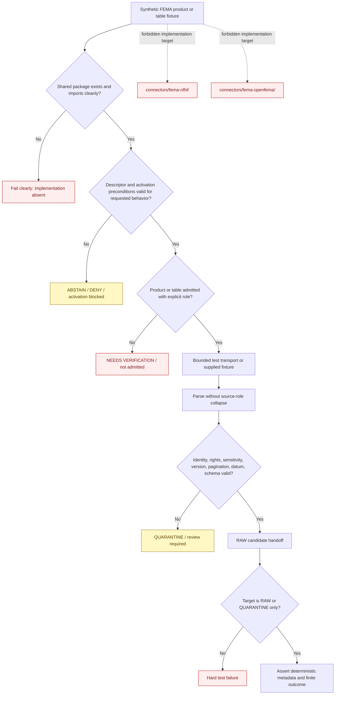

<!-- [KFM_META_BLOCK_V2]
doc_id: kfm://doc/connectors-fema-tests-readme
title: connectors/fema/tests/ — FEMA Connector Test Lane
type: readme
version: v0.2
status: draft
owners: OWNER_TBD — Connector steward · FEMA source steward · NFHL product steward · OpenFEMA product steward · Test steward · Hazards steward · Hydrology steward · Settlements/Infrastructure steward · Privacy/sensitivity reviewer · Rights reviewer · Security reviewer · Validation steward · Docs steward
created: 2026-06-18
updated: 2026-07-11
policy_label: public-context-only; connector-local-tests; greenfield; synthetic-fixtures-only; no-network-default; no-secret-tests; source-role-preserving; per-product-admission; per-table-openfema-admission; raw-or-quarantine-only; not-for-life-safety; no-publication
proposed_path: connectors/fema/tests/README.md
truth_posture: CONFIRMED README-only test lane / executable tests ABSENT / FEMA package NOT IMPORTABLE / sources NOT ACTIVATED / CI UNKNOWN
related:
  - ../README.md
  - ../pyproject.toml
  - ../src/README.md
  - ../src/fema/README.md
  - ../nfhl/README.md
  - ../../fema-nfhl/README.md
  - ../../fema-openfema/README.md
  - ../../../docs/sources/catalog/fema/README.md
  - ../../../docs/sources/catalog/fema/nfhl-flood-hazard.md
  - ../../../docs/sources/catalog/fema/map-service-center.md
  - ../../../docs/sources/catalog/fema/openfema-disaster-declarations.md
  - ../../../docs/sources/catalog/fema/openfema-auxiliary-tables.md
  - ../../../docs/sources/catalog/fema/nfip-claim-policy-aggregates.md
  - ../../../docs/domains/hazards/README.md
  - ../../../docs/domains/hazards/SOURCE_REGISTRY.md
  - ../../../docs/domains/hydrology/README.md
  - ../../../docs/domains/hydrology/CANONICAL_PATHS.md
  - ../../../docs/domains/hydrology/SOURCE_REGISTRY.md
  - ../../../docs/domains/settlements-infrastructure/README.md
  - ../../../data/registry/sources/
  - ../../../data/registry/hazards/sources/fema_disaster_declarations.yaml
  - ../../../data/raw/hydrology/fema_nfhl/README.md
  - ../../../data/raw/hazards/nfhl/README.md
  - ../../../data/raw/hazards/fema/README.md
  - ../../../data/quarantine/
  - ../../../fixtures/
  - ../../../schemas/contracts/v1/source/
  - ../../../policy/sensitivity/
  - ../../../release/
  - ../../../tools/ingest/nfhl_watch/README.md
  - ../../../tools/ingest/fema_decl_watch/README.md
  - ../../../pipelines/domains/hydrology/ingest_nfhl/README.md
tags: [kfm, connectors, fema, tests, greenfield, nfhl, openfema, disaster-declarations, regulatory, administrative, aggregate, pagination, version-lock, datum, privacy, source-admission, raw, quarantine, governance]
notes:
  - "Repository inspection confirms that connectors/fema/tests/ contains this README only; no executable test module, conftest, fixture directory, live-test directory, test configuration, test dependency, or passing run is proved."
  - "The shared FEMA package under connectors/fema/src/fema/ is also README-only and not importable, so proposed tests below define future evidence requirements rather than current coverage."
  - "The flat connectors/fema-nfhl/ and connectors/fema-openfema/ paths are compatibility pointers. Tests must reject parallel implementation or runtime authority beneath those paths."
  - "NFHL remains regulatory context; Disaster Declarations remain administrative; OpenFEMA aggregates require an exact aggregation unit; none becomes observed hazard truth by convenience."
  - "No live-test environment variable, pytest marker, runner command, endpoint, credential mode, or CI integration is accepted by this README."
[/KFM_META_BLOCK_V2] -->

<a id="top"></a>

# FEMA Connector Test Lane

> Evidence-grounded contract for future connector-local tests under `connectors/fema/`. The lane is currently documentation-only. Future tests must prove that one shared FEMA package remains no-network by default, source-role preserving, product- and table-specific, fail-closed, and limited to finite results plus RAW-or-QUARANTINE handoff candidates.

<p>
  
  
  
  
  
  
</p>

`connectors/fema/tests/`

> [!IMPORTANT]
> **Confirmed state:** this directory contains this README and no confirmed executable tests or fixtures. The adjacent FEMA package is also README-only and not import-proven. No test runner, dependency, marker, live-test flag, local command, CI job, coverage result, source activation, or passing test evidence is confirmed. Treat all test files, commands, fixtures, and outcomes below as required future contracts—not current capability.

**Quick jumps:** [Purpose](#purpose) · [Verified repository state](#verified-repository-state) · [Evidence ledger](#evidence-ledger) · [Test authority boundary](#test-authority-boundary) · [Placement and implementation decisions](#placement-and-implementation-decisions) · [Blocking drift](#blocking-drift) · [Test principles](#test-principles) · [Proposed test layout](#proposed-test-layout) · [Test-class contract](#test-class-contract) · [NFHL test matrix](#nfhl-test-matrix) · [OpenFEMA test matrix](#openfema-test-matrix) · [Fixture contract](#fixture-contract) · [No-network no-secret and live-test posture](#no-network-no-secret-and-live-test-posture) · [Finite outcomes](#finite-outcomes) · [Lifecycle and boundary tests](#lifecycle-and-boundary-tests) · [Execution posture](#execution-posture) · [Implementation sequence](#implementation-sequence) · [Acceptance gates](#acceptance-gates) · [Review and rollback](#review-and-rollback) · [Definition of done](#definition-of-done) · [Verification backlog](#verification-backlog)

---

## Purpose

`connectors/fema/tests/` is reserved for **connector-local** tests of the future shared FEMA package at `connectors/fema/src/fema/`.

When executable code exists, this lane may prove that the package:

- imports without network, secret, filesystem, logging, environment, or activation side effects;
- rejects ambiguous or non-admitted FEMA products and OpenFEMA tables;
- requires explicit SourceDescriptor and activation evidence for live behavior;
- preserves FEMA provider, product, table, record, temporal, geographic, regulatory, rights, sensitivity, retrieval, and digest metadata;
- preserves `regulatory`, `administrative`, and `aggregate` source roles without semantic collapse;
- enforces NFHL surface classification, regulatory-vintage, datum, units, completeness, and source-lineage requirements;
- enforces OpenFEMA table identity, stable-key, pagination, count, freshness, aggregation-unit, privacy, and sensitivity requirements;
- returns finite errors, abstentions, activation blocks, drift signals, review results, and RAW-or-QUARANTINE candidates;
- rejects direct writes to downstream lifecycle, proof, receipt, release, publication, public API, map, search, or generated-answer surfaces.

This lane does **not** prove FEMA source truth, current conditions, observed hazard events, regulatory interpretation, insurance requirements, benefit eligibility, damage, legal conclusions, engineering suitability, property safety, life-safety guidance, release readiness, or publication eligibility.

[Back to top ↑](#top)

---

## Verified repository state

The following scaffold is confirmed on the repository's `main` branch at the time of this update:

```text
connectors/fema/
├── README.md
├── pyproject.toml
├── nfhl/
│   └── README.md
├── src/
│   ├── README.md
│   └── fema/
│       └── README.md
└── tests/
    └── README.md                         # this file
```

Related flat compatibility paths:

```text
connectors/fema-nfhl/README.md            # NFHL compatibility pointer
connectors/fema-openfema/README.md        # OpenFEMA compatibility pointer
```

### Current maturity

| Surface | Confirmed content | Maturity |
|---|---|---:|
| `tests/README.md` | This connector-local test contract. | **DOCUMENTED** |
| Other files under `tests/` | None found in the current repository search. | **ABSENT / NEEDS CONTINUOUS VERIFICATION** |
| Test fixtures under this lane | None confirmed. | **ABSENT** |
| `conftest.py` or test configuration | None confirmed. | **ABSENT** |
| Test dependency declaration | None present in the inspected placeholder `pyproject.toml`. | **ABSENT / UNPROVED** |
| Importable `fema` package target | No `__init__.py`, build backend, package discovery, or import test confirmed. | **ABSENT / UNPROVED** |
| Executable NFHL adapter | None confirmed. | **ABSENT** |
| Executable OpenFEMA adapter | None confirmed. | **ABSENT** |
| Executable connector tests | None confirmed. | **ABSENT** |
| Live-test directory or marker | None confirmed. | **ABSENT / NOT APPROVED** |
| Connector-specific CI job | None confirmed. | **UNKNOWN** |
| Passing test or coverage evidence | None confirmed. | **ABSENT** |
| Active FEMA source or table | No accepted activation decision confirmed here. | **NOT ACTIVATED** |

> [!CAUTION]
> A README, test-shaped path, or proposed matrix is not a test suite. Do not describe the FEMA connector as tested, validated, CI-covered, import-safe, activation-safe, privacy-reviewed, or release-ready until executable tests and reviewable run evidence support those claims.

[Back to top ↑](#top)

---

## Evidence ledger

| Evidence | Status | What it supports | What it does not support |
|---|---:|---|---|
| `connectors/fema/tests/README.md` | **CONFIRMED** | A connector-local test boundary exists. | Test implementation or passing results. |
| Current repository search for `connectors/fema/tests/` | **CONFIRMED for inspected state** | Only this README was found for the local test lane. | Permanent absence or unindexed future files. |
| `connectors/fema/src/README.md` | **CONFIRMED documentation** | The FEMA source root is greenfield, shared-package oriented, and not import-proven. | Executable source code. |
| `connectors/fema/src/fema/README.md` | **CONFIRMED documentation** | Package architectures, product semantics, metadata, outcomes, and activation gates are documented. | Importable package behavior. |
| `connectors/fema/pyproject.toml` | **CONFIRMED placeholder** | Project name and version are reserved. | Build backend, dependencies, pytest, package discovery, or installation. |
| `connectors/fema/nfhl/README.md` | **CONFIRMED preferred product documentation** | NFHL test requirements include regulatory role, surface class, version, effective date, datum, units, and lineage. | Implemented NFHL adapter. |
| `connectors/fema-nfhl/README.md` | **CONFIRMED compatibility pointer** | The flat NFHL path must not host duplicate implementation. | Independent test or runtime authority. |
| `connectors/fema-openfema/README.md` | **CONFIRMED compatibility pointer** | OpenFEMA behavior belongs in the shared FEMA package and admission is table-specific. | Implemented OpenFEMA adapter or tests. |
| FEMA source catalog pages | **CONFIRMED draft documentation** | Product roles and anti-collapse requirements are documented. | Current endpoints, schemas, terms, activation, or executable behavior. |
| `data/registry/hazards/sources/fema_disaster_declarations.yaml` | **CONFIRMED greenfield template** | A candidate declaration source identity exists. | Approved role, authority, rights, sensitivity, cadence, access posture, or activation. |
| FEMA watcher and pipeline READMEs | **CONFIRMED documentation** | Connector, watcher, and downstream processing responsibilities are separate. | Executable watcher or pipeline behavior. |

[Back to top ↑](#top)

---

## Test authority boundary

Connector-local tests may prove only behavior at the FEMA source-admission edge.

```text
TESTS MAY EVENTUALLY PROVE:
  clean package import
  no-network and no-secret defaults
  explicit configuration validation
  descriptor and activation preconditions
  closed product and table dispatch
  bounded transport failure behavior
  deterministic parsing of synthetic fixtures
  source-role preservation
  metadata and stable-identity preservation
  pagination and completeness accounting
  finite error and drift outcomes
  RAW-or-QUARANTINE-only handoff behavior
  rejection of duplicate compatibility-path implementation

TESTS MUST NOT CLAIM:
  observed hazard truth
  current flood or disaster conditions
  emergency warning or forecast authority
  regulatory, legal, insurance, eligibility, or engineering determination authority
  damage assessment truth
  public safety of every OpenFEMA field or join
  source activation authority
  SourceDescriptor authority
  policy, rights, sensitivity, schema, proof, release, or publication authority
  public readiness of connector output
```

Cross-domain schema, policy, source-registry, lifecycle, EvidenceBundle, catalog, release, public-client, and end-to-end publication tests belong in their governed repository-wide homes. This directory must not become a second canonical root test hierarchy.

[Back to top ↑](#top)

---

## Placement and implementation decisions

Tests must encode the current placement decisions rather than reopening them implicitly.

| Responsibility | Preferred path | Required test posture |
|---|---|---|
| Shared FEMA package implementation | `connectors/fema/src/fema/` | Import and behavior tests target this package only. |
| NFHL product documentation | `connectors/fema/nfhl/` | Treat as documentation and product contract, not a second package. |
| FEMA connector-local tests | `connectors/fema/tests/` | Keep all shared-package connector tests here. |
| Flat NFHL path | `connectors/fema-nfhl/` | Reject executable files, imports, descriptors, fixtures, tests, activation, or runtime authority. |
| Flat OpenFEMA path | `connectors/fema-openfema/` | Reject executable files, imports, descriptors, fixtures, tests, activation, or runtime authority. |
| NFHL watcher | `tools/ingest/nfhl_watch/` | Test watcher interfaces separately; watcher signals do not activate, ingest, promote, or publish. |
| Declaration watcher | `tools/ingest/fema_decl_watch/` | Preserve administrative semantics and review-signal-only behavior. |
| Hydrology NFHL processing | `pipelines/domains/hydrology/ingest_nfhl/` | Pipeline tests remain downstream and must not bypass RAW/QUARANTINE. |

Required path-boundary tests, once a repository validator exists:

- fail when Python, package metadata, tests, fixtures, endpoint configuration, descriptors, caches, or lifecycle writers appear under either flat compatibility path;
- fail when product documentation paths are imported as Python packages by convenience;
- fail when shared FEMA behavior is duplicated in multiple implementation homes;
- permit reviewed documentation-only compatibility notices;
- require an accepted ADR or migration decision before any placement rule changes.

[Back to top ↑](#top)

---

## Blocking drift

The test lane cannot become executable safely until these gaps are resolved or represented as explicit expected failures.

| Blocker | Current state | Required test response |
|---|---|---|
| Package target | `src/fema/` is README-only. | Do not report a passing package suite; fail clearly when an import target is absent. |
| Build and test configuration | `pyproject.toml` has only name and version. | Do not assume pytest, dependency groups, package discovery, or a command. |
| Package architecture | Flat-module and product-subpackage options remain proposed. | Write path-independent behavioral tests where possible; choose one import layout before implementation tests. |
| Parent documentation alignment | Parent FEMA README still needs alignment with recent package/path decisions. | Treat path assertions as current documentation requirements, not proof of repository-wide enforcement. |
| Descriptor and activation contracts | No accepted binding interfaces confirmed. | Use synthetic invalid references only; do not invent canonical schemas. |
| FEMA result/handoff contract | No binding shape confirmed. | Delay authoritative envelope-shape assertions until the contract is selected. |
| NFHL SourceDescriptor | No accepted active descriptor confirmed. | Live access tests remain prohibited; descriptor-missing behavior must fail closed. |
| Disaster Declarations descriptor | Greenfield template contains unresolved fields. | Do not treat the template as activated or policy-complete. |
| OpenFEMA auxiliary descriptors | None confirmed. | No auxiliary table is admitted by family adjacency. |
| Endpoint/archive inventory | Current source surfaces are not pinned here. | No live test, endpoint string, layer ID, dataset slug, or archive name becomes a test constant yet. |
| NFHL metadata contract | Current feature classes and field inventory require source verification. | Test documented required semantics with synthetic fixtures, not claims about current upstream names beyond pinned fields. |
| OpenFEMA pagination contract | Current API behavior and completeness method are unverified. | Test generic accounting rules only after a transport contract exists. |
| Privacy and sensitivity | Table-specific PII, precision, joining, suppression, and infrastructure risks remain unresolved. | Synthetic negative cases fail closed; no real sensitive rows are committed. |
| RAW routing | Hydrology documentation uses `fema_nfhl`; Hazards uses `nfhl`. | Do not hard-code an authoritative path alias until the handoff contract resolves it. |
| Executable fixtures and tests | None confirmed. | README maturity stays documentation-only. |
| CI | No passing connector-specific run confirmed. | Do not claim merge-gate or coverage enforcement. |

Do not hide these gaps with permissive mocks, guessed endpoints, invented schemas, broad skip conditions, or examples presented as passing evidence.

[Back to top ↑](#top)

---

## Test principles

Every future FEMA connector test should follow these invariants:

1. **Test implemented behavior, not README aspirations.** A proposed module does not justify a passing test stub.
2. **No network by default.** Default collection and execution must not contact FEMA, OpenFEMA, WMS, REST, archive, metadata, or redirect targets.
3. **No secrets by default.** Tests must not require, discover, print, or persist credentials, cookies, tokens, private configuration, or authorization headers.
4. **No import side effects.** Imports perform no network, filesystem write, logging setup, environment mutation, cache initialization, source activation, or registry lookup with side effects.
5. **One implementation home.** Tests target the shared FEMA package and reject runtime authority in flat compatibility paths.
6. **Closed dispatch.** Every case names an explicit product or table identity; no generic “all FEMA” path is accepted.
7. **Descriptor-driven activation.** Missing descriptor or activation evidence blocks live behavior.
8. **Source-role preservation.** Regulatory, administrative, aggregate, and observed meanings never collapse.
9. **Fail closed.** Missing identity, rights, sensitivity, stable key, version, datum, pagination, completeness, or schema evidence cannot produce promotion-track output.
10. **Deterministic fixtures.** Identical fixture and configuration input produces identical connector output or error.
11. **Finite failures.** Timeouts, retries, redirects, schema drift, count mismatches, and malformed input terminate with inspectable outcomes.
12. **No publication.** Connector tests accept only finite results and RAW-or-QUARANTINE candidates.
13. **No determination output.** Tests reject warnings, forecasts, insurance, legal, eligibility, compliance, engineering, damage, and life-safety conclusions.
14. **Safe logs.** Test failures reveal enough metadata to debug behavior without exposing secrets or unnecessary source rows.

[Back to top ↑](#top)

---

## Proposed test layout

The following tree is a **PROPOSED implementation target**. None of these files or directories is confirmed to exist.

```text
connectors/fema/tests/
├── README.md
├── fixtures/
│   ├── README.md
│   ├── nfhl/
│   │   ├── valid/
│   │   ├── invalid/
│   │   ├── visualization_only/
│   │   └── drift/
│   └── openfema/
│       ├── declarations/
│       ├── administrative/
│       ├── aggregate/
│       ├── pagination/
│       ├── private_or_precise/
│       └── drift/
├── test_package_import.py
├── test_packaging.py
├── test_placement_boundaries.py
├── test_configuration.py
├── test_activation_preconditions.py
├── test_dispatch.py
├── test_transport.py
├── test_nfhl_surfaces.py
├── test_nfhl_parser.py
├── test_nfhl_version_and_datum.py
├── test_openfema_declarations.py
├── test_openfema_auxiliary.py
├── test_openfema_aggregates.py
├── test_openfema_pagination.py
├── test_privacy_and_sensitivity.py
├── test_drift_and_errors.py
├── test_handoff_boundaries.py
└── live/
    ├── README.md
    └── test_smoke.py
```

Do not create this entire tree mechanically. Add each test only with the corresponding implementation, contract, fixture, expected outcome, and owner. Keep files small enough that failures reveal a single responsibility.

[Back to top ↑](#top)

---

## Test-class contract

### Package and import safety

Required proof:

- a clean environment can install or import the intended package according to the accepted packaging convention;
- importing `fema` performs no network call, secret read, filesystem write, logging configuration, environment mutation, cache initialization, or source activation;
- optional product dependencies fail with explicit installation guidance rather than unrelated import-time exceptions;
- package artifacts include only intended source files and exclude credentials, caches, payloads, local configuration, and test secrets;
- absence of the package target fails clearly rather than reporting a skipped-success state.

### Packaging configuration

Required proof:

- build backend and `src` discovery are declared and exercised;
- supported Python versions and dependency groups are explicit;
- test dependencies are isolated from runtime dependencies where the repository convention requires it;
- package version and import version are coherent under the accepted version policy;
- wheel and source distributions, if used, contain the same intended package surface;
- installation from a clean checkout does not depend on undeclared local state.

### Placement boundaries

Required proof:

- flat compatibility paths remain documentation-only;
- `connectors/fema/nfhl/` remains product documentation unless package layout explicitly says otherwise;
- no duplicate importable package, client, parser, descriptor, fixture suite, test suite, cache, or activation state exists outside `connectors/fema/src/fema/` and `connectors/fema/tests/`;
- repository validators, if adopted, allow documentation and reject executable/runtime files in compatibility paths.

### Configuration and activation

Required proof:

- safe defaults require no network and no credentials;
- a live request cannot run without explicit product/table identity, SourceDescriptor reference, activation reference, approved source surface, request scope, limits, and lifecycle target;
- there is no provider-wide switch that activates every FEMA product or OpenFEMA table;
- test fixture configuration cannot fall through to live transport;
- no environment-variable name is treated as accepted until implementation and security review establish it;
- configuration errors are deterministic, redacted, and actionable.

### Closed product dispatch

Required proof:

- known admitted product/table keys route to the intended adapter;
- unknown keys, ambiguous keys, and product/role mismatches fail closed;
- dispatch never relies on URL substrings or API adjacency;
- NFHL, Map Service Center, Disaster Declarations, auxiliary administrative tables, aggregates, and NFIP aggregates remain distinct;
- an OpenFEMA table receives no role or activation merely because it shares an API host.

### Transport and credentials

Required proof:

- transport is replaceable by deterministic test doubles;
- parsers do not acquire credentials or perform network requests;
- timeout, retry, backoff, rate-limit, pagination, redirect, content-type, encoding, response-size, and archive-size bounds terminate finitely;
- authorization headers and tokens are redacted from errors and logs;
- unexpected hosts, redirects, content types, or archive formats fail validation;
- bulk captures are checksum-bound and do not overwrite prior state silently;
- partial pages, partial archives, and interrupted transfers produce incomplete-run outcomes rather than success.

### Parsing and normalization

Required proof:

- supplied bytes, mappings, rows, pages, archives, or fixtures parse deterministically;
- missing, null, empty, unsupported, redacted, and malformed values remain distinguishable;
- unknown fields are preserved or rejected according to an explicit drift policy;
- raw source identifiers and exact product/table/surface identity survive parsing;
- source timestamps remain distinct from retrieval and processing timestamps;
- designated jurisdictions, project locations, applicant locations, aggregation geography, and observed-event footprints remain semantically distinct;
- no parser creates canonical hazard events, people, properties, projects, places, or public claims.

### Handoff and output boundaries

Required proof:

- finite connector results and RAW/QUARANTINE candidates are the only accepted outputs;
- every candidate carries explicit source/product/table identity, source role, intended domain route, lifecycle target, retrieval lineage, and review flags according to the selected contract;
- direct WORK, PROCESSED, CATALOG, TRIPLET, PROOF, RECEIPT, RELEASE, PUBLISHED, public API, map, tile, search, report, story, or generated-answer writes fail;
- a watcher result cannot masquerade as a connector handoff, activation decision, ingest receipt, EvidenceBundle, release decision, or public record.

[Back to top ↑](#top)

---

## NFHL test matrix

NFHL tests must preserve its `regulatory` source role and prevent analytical, temporal, spatial, and determination-like misuse.

| Test area | Required assertion | Failure posture |
|---|---|---|
| Source role | NFHL remains `regulatory`; no `observed`, `modeled`, administrative, forecast, or warning role is emitted. | Validation failure. |
| Product identity | FEMA/NFHL and exact surface/package identity remain explicit. | Activation blocked or quarantine. |
| Surface classification | Analytic vector, visualization-only, archive, metadata, and derived display are distinguishable. | Ambiguity routes to review. |
| Visualization boundary | WMS-like or rendered map material cannot be used for feature extraction, analytic joins, geometry truth, or regulatory attributes. | Validation failure. |
| Feature identity | Feature class, object ID, panel, study, jurisdiction, and revision identity remain available where carried. | Quarantine or rejection. |
| `DFIRM_ID` | Source-issued value is preserved where present and not replaced with an inferred identifier. | Validation failure if dropped. |
| Version lock | `VERSION_ID` or accepted equivalent remains available and parseable. | Quarantine or abstention. |
| Effective state | `EFFECTIVE_DATE` and revision lineage remain distinct from retrieval time. | Promotion-track block. |
| Regulatory attributes | Flood-zone, study, revision, and BFE fields remain source-attributed and verbatim where required. | Validation failure if silently renamed or dropped. |
| CRS and datum | CRS, horizontal datum, vertical datum, units, and transform history remain explicit. | Quarantine; block elevation/engineering use. |
| Geometry validity | Empty, truncated, invalid, unsupported, or incompatible geometry routes to review. | Quarantine or error. |
| Vintage comparison | Incompatible CRS, datum, version, or QA state cannot be diffed as regulatory change. | Deny comparison or require reviewed transform evidence. |
| Bulk completeness | Archive identity, checksum, expected members/counts, extraction state, and non-overwrite behavior are enforced. | Incomplete-capture quarantine. |
| Schema drift | Field additions, removals, renames, or type changes produce reviewable drift. | No silent field loss. |
| Currentness language | A capture cannot be called current without scope, source time, version/effective state, and retrieval lineage. | Assertion failure. |
| Determination boundary | No output claims current flooding, safety, insurance, compliance, legal meaning, eligibility, or engineering suitability. | Hard failure/refusal. |

Minimum synthetic NFHL cases should include:

- valid regulatory polygon candidate with stable identity, version, effective date, zone, CRS, and lineage;
- missing version;
- missing effective date;
- missing vertical datum with BFE value;
- visualization-only surface presented for analytics;
- changed feature schema;
- checksum mismatch or incomplete archive;
- incompatible-vintage comparison;
- source-role collapse attempt;
- direct downstream-write attempt.

[Back to top ↑](#top)

---

## OpenFEMA test matrix

OpenFEMA tests must operate **per dataset/table**. There is no umbrella OpenFEMA admission.

### Disaster Declarations

| Test area | Required assertion | Failure posture |
|---|---|---|
| Source role | Declaration records remain `administrative`. | Validation failure on observed-role output. |
| Object boundary | A declaration may support a `DisasterDeclaration` candidate, not a `Hazard Event` from the declaration alone. | Hard anti-collapse failure. |
| Identity | Declaration number/type and stable source key remain explicit. | Quarantine or rejection. |
| Time semantics | Declaration date, incident period, update time, and retrieval time remain distinct. | Validation failure or review. |
| Geography semantics | Designated jurisdictions remain administrative scope, not observed hazard footprint. | Validation failure. |
| Incident category | Source-carried incident type remains a declaration attribute, not proof of a physical event at a specific place/time. | Anti-collapse failure. |
| Eligibility boundary | No person, household, property, organization, insurance, or benefit eligibility conclusion is emitted. | Refusal/hard failure. |

### Auxiliary administrative tables

| Test area | Required assertion | Failure posture |
|---|---|---|
| Per-table admission | Every dataset has its own descriptor, activation, role, key, cadence, rights, sensitivity, and parser contract. | Table-not-admitted result. |
| Administrative semantics | Projects, awards, registrations, grants, and assignments remain records of program actions. | Do not emit observed damage, completion, or physical conditions. |
| Stable key | Primary or documented composite identity supports deterministic updates. | Block deduplication/update. |
| Geography meaning | Applicant, project, declared, reporting, and aggregation locations remain distinct. | Validation failure or review. |
| Privacy and precision | Applicant, household, address, property, precise infrastructure, and join risks trigger table-specific controls. | Restrict, quarantine, or deny. |
| Schema drift | Unknown fields/types and key changes produce drift signals. | No silent parsing. |

### Aggregate tables

| Test area | Required assertion | Failure posture |
|---|---|---|
| Source role | Aggregate records retain `aggregate`. | Validation failure. |
| Aggregation unit | Exact geography, program, disaster, period, population/scope, and unit are explicit. | Validation failure or quarantine. |
| No disaggregation | Counts, totals, costs, or rates cannot become person, household, applicant, property, or site facts. | Hard anti-collapse failure. |
| Suppression/minimum cells | Adopted suppression or minimum-cell obligations remain represented. | No public-safe result when unresolved. |
| Join risk | Low-risk standalone data may route to review when combined with parcels, addresses, people, or infrastructure. | Review/quarantine. |

### Pagination completeness and freshness

| Condition | Required assertion | Failure posture |
|---|---|---|
| Page/continuation missing unexpectedly | Run is incomplete. | Quarantine or incomplete-run error. |
| Count mismatch | Retrieved unique rows reconcile with available count metadata or carry an explicit explanation. | Quarantine and review. |
| Duplicate records | Duplicate accounting is explicit and stable-key based. | Incomplete-run or drift result. |
| Record gaps | Gaps are detected under the selected deterministic ordering/checkpoint strategy. | Quarantine. |
| Unstable ordering | Incremental processing cannot claim completeness without a stable checkpoint. | Abstain. |
| Stable key changes | Prior update/deduplication assumptions become invalid. | Block update and emit drift. |
| Schema fingerprint changes | New review is required. | No silent field discard. |
| Freshness metadata absent/stale | Output is labeled stale or unknown. | No current-completeness claim. |
| Watcher detects change | Only review/proposed-work output is permitted. | No promotion or publication. |

[Back to top ↑](#top)

---

## Fixture contract

Synthetic fixtures are the default and preferred evidence source for this lane.

### Forbidden fixture material

Do not commit:

- real credentials, tokens, cookies, API keys, authorization headers, or private configuration;
- unmanaged full FEMA/OpenFEMA source exports;
- real applicant, household, contact, registration, address, precise property, or person-identifying rows;
- sensitive infrastructure details at unsafe precision;
- source payload snapshots whose rights, retention, provenance, or update behavior are unresolved;
- live-response caches automatically refreshed from external services;
- production SourceDescriptors or activation records masquerading as fixtures;
- public-release artifacts used as connector test inputs by circular reasoning.

### Fixture rules

1. Invent record identities, people-like fields, addresses, project locations, and values unless a separately governed public-safe snippet is approved.
2. Minimize each fixture to the behavior under test.
3. Keep source product/table and source role explicit.
4. Keep valid, malformed, incomplete, drift, privacy, rights, role-collapse, and output-boundary cases separate.
5. Record which tests consume each fixture and why it exists.
6. Preserve unknown fields only when the parser contract requires safe passthrough.
7. Do not copy a real row and call it synthetic merely because names were changed.
8. Do not embed endpoint URLs, dataset slugs, layer IDs, schema versions, or archive names as current truth until source review pins them.
9. Promote shared fixtures to the repository fixture authority only after multi-consumer need and sensitivity review are confirmed.
10. Remove fixtures that no longer correspond to implemented behavior or a maintained drift case.

### Proposed NFHL fixture metadata

```yaml
fixture_id: fema-nfhl-synthetic-zone-001
fixture_status: synthetic
provider: fema
product_family: nfhl
source_role: regulatory
contains_real_source_row: false
contains_credentials: false
contains_personal_data: false
surface_class: analytic-vector-synthetic
supports_tests:
  - regulatory_role_preservation
  - version_effective_date_guard
  - raw_quarantine_handoff
rights_posture: generated-for-tests
sensitivity_posture: public-safe-synthetic
review_state: draft
```

### Proposed OpenFEMA aggregate fixture metadata

```yaml
fixture_id: fema-openfema-synthetic-aggregate-001
fixture_status: synthetic
provider: fema
product_family: openfema
product_key: synthetic-disaster-county-rollup
source_role: aggregate
aggregation_unit: county-disaster-year
contains_real_source_row: false
contains_credentials: false
contains_personal_data: false
supports_tests:
  - aggregate_unit_required
  - no_disaggregation
  - pagination_count_reconciliation
rights_posture: generated-for-tests
sensitivity_posture: public-safe-synthetic
review_state: draft
```

These metadata shapes are **PROPOSED** pending the repository fixture convention. They are not binding schemas.

[Back to top ↑](#top)

---

## No-network no-secret and live-test posture

> [!CAUTION]
> Default test collection and execution must require no internet, FEMA endpoint, OpenFEMA API, archive download, account, credential, token, cookie, browser session, private configuration, source activation, or release workflow.

Required controls once tests exist:

- block or replace all network clients by default;
- fail a test that attempts an unapproved network call;
- keep import, parser, role, metadata, pagination, drift, privacy, and handoff tests independent of live access;
- do not auto-refresh fixtures;
- do not persist source response bodies outside approved test temporaries;
- redact secrets and sensitive fields from failures, snapshots, and captured logs;
- isolate any future live smoke tests under a separate directory and marker;
- exclude live tests from default local runs and default CI unless governance explicitly approves otherwise;
- require an accepted SourceDescriptor, activation decision, source-surface identity, terms review, limits, safe logging, and rollback before any live test;
- limit live smoke tests to the smallest metadata or shape check necessary;
- prevent live tests from writing RAW, QUARANTINE, WORK, PROCESSED, CATALOG, TRIPLET, PROOF, RECEIPT, RELEASE, PUBLISHED, or public-client artifacts.

No environment-variable name or pytest marker is accepted. The earlier `KFM_ALLOW_LIVE_FEMA_TESTS` example was illustrative only and must not be treated as a repository convention.

[Back to top ↑](#top)

---

## Finite outcomes

Tests should require a small, documented set of deterministic outcomes rather than ambiguous partial success.

| Condition | Expected safe behavior |
|---|---|
| Package target absent | Fail clearly; do not report validation success through skips alone. |
| Package not installed or importable | Actionable packaging/import failure. |
| SourceDescriptor missing | Refuse live activation. |
| Activation decision missing | `ABSTAIN` or activation-blocked result. |
| Product/table unknown or not admitted | `NEEDS_VERIFICATION` or table-not-admitted result. |
| Product/role mismatch | Validation failure. |
| Runtime path points to a flat compatibility directory | Placement failure. |
| Network disabled | Fixture/parser tests continue; live path returns bounded disabled result. |
| Unauthorized/forbidden | Finite redacted error. |
| Timeout/rate limit | Bounded error; no infinite retry. |
| Unexpected redirect/host/content type/archive format | Validation failure or quarantine. |
| Empty response | `ABSTAIN` unless the approved product contract defines empty as valid. |
| Malformed response | Finite parser error with safe source metadata. |
| Schema/field drift | Reviewable drift result; no silent loss. |
| Stable identity absent/changed | Block update and deduplication. |
| OpenFEMA pagination incomplete | Quarantine or incomplete-run result. |
| Count mismatch/duplicates/gaps | Quarantine and completeness review. |
| Aggregation unit missing | Validation failure or quarantine. |
| Privacy, rights, precision, or sensitivity unresolved | No public-safe result; restrict, review, quarantine, or deny. |
| NFHL visualization source used for analytics | Validation failure. |
| NFHL version/effective date missing | Quarantine or abstention. |
| NFHL CRS/datum/units unresolved | Quarantine; block elevation and engineering use. |
| NFHL regulatory attributes dropped | Validation failure. |
| Declaration emitted as observed event | Hard anti-collapse failure. |
| Aggregate emitted as individual/property truth | Hard anti-collapse failure. |
| Direct downstream/public write attempted | Hard failure. |
| Warning, damage, eligibility, insurance, legal, engineering, or life-safety determination requested | Refuse and route callers to official or governed channels. |

[Back to top ↑](#top)

---

## Lifecycle and boundary tests



The diagram describes required future test behavior. It is not proof that package import, descriptor validation, parsing, handoff, domain routing, or lifecycle enforcement is implemented.

KFM lifecycle discipline remains:

```text
RAW -> WORK / QUARANTINE -> PROCESSED -> CATALOG / TRIPLET -> PUBLISHED
```

Connector-local tests must stop before downstream domain truth, EvidenceBundle closure, catalog projection, release approval, or publication.

[Back to top ↑](#top)

---

## Execution posture

No test command is currently confirmed runnable because:

- no executable tests are confirmed;
- no test dependency is declared;
- no importable package target is proved;
- package discovery and build backend are absent or unproved;
- no connector-specific CI job or successful run is confirmed.

A possible future local command is:

```bash
python -m pytest connectors/fema/tests
```

This command is **PROPOSED**, not current evidence. Replace it with the repository-standard command after packaging, dependencies, executable tests, and clean-environment behavior are implemented and demonstrated.

Do not document a no-network environment flag, live-test flag, marker, endpoint, or credential variable as runnable until the implementation and security review establish the convention. Do not present a collection-only run, all-skipped run, or README lint as proof that connector behavior is tested.

[Back to top ↑](#top)

---

## Implementation sequence

Build the test lane in dependency order:

1. **Align repository documentation and placement**
   - update parent FEMA documentation to reflect the shared-package and compatibility-path decisions;
   - preserve NFHL product documentation separately;
   - inventory stale flat-path references and generated skeletons.
2. **Resolve package and test tooling**
   - select build backend and `src` discovery;
   - declare supported Python version and dependencies;
   - choose flat-module or product-subpackage architecture;
   - select the repository-standard test runner and configuration.
3. **Create import and placement tests first**
   - prove clean import with no side effects;
   - prove compatibility paths remain documentation-only;
   - prove package files are included intentionally.
4. **Resolve governance contracts**
   - accept SourceDescriptor and activation interfaces;
   - select connector-result and RAW/QUARANTINE handoff contracts;
   - define domain routing and RAW alias policy.
5. **Add configuration, dispatch, and finite-error tests**
   - no-network defaults;
   - closed product/table keys;
   - descriptor and activation requirements;
   - bounded deterministic error taxonomy.
6. **Implement one fixture-only product slice**
   - choose NFHL or Disaster Declarations;
   - add the smallest synthetic fixture set;
   - test source role, identity, metadata, anti-collapse, and finite outcomes;
   - do not add live transport yet.
7. **Add transport tests**
   - use test doubles first;
   - test timeouts, retries, redirects, content types, pagination, partial downloads, and checksums;
   - add real transport only after source and security review.
8. **Add handoff and output-boundary tests**
   - require RAW/QUARANTINE only;
   - reject every direct downstream/public write.
9. **Add additional products and tables independently**
   - every OpenFEMA table receives its own descriptor, role, stable key, privacy posture, cadence, parser, fixture set, and tests.
10. **Add watcher and pipeline interface tests separately**
    - exchange finite signals and handoff references;
    - prevent responsibility collapse.
11. **Add CI last**
    - prove the clean local no-network command first;
    - retain reviewable run evidence;
    - do not upgrade badges or maturity claims before evidence exists.

[Back to top ↑](#top)

---

## Acceptance gates

### Required for every FEMA connector test change

- [ ] Claims match the current repository tree and executable evidence.
- [ ] No real credentials, tokens, cookies, private configuration, or authorization material are committed.
- [ ] No unmanaged real applicant, household, property, address, registration, or sensitive-infrastructure rows are committed.
- [ ] Fixtures are synthetic, minimized, documented, and safe to review.
- [ ] Default tests perform no live network calls.
- [ ] Flat compatibility paths remain documentation-only.
- [ ] The shared FEMA package remains the only implementation target.
- [ ] Product/table identity and source role are explicit.
- [ ] NFHL remains regulatory context.
- [ ] Disaster Declarations remain administrative records.
- [ ] Auxiliary administrative tables retain action semantics.
- [ ] Aggregate tables retain an exact aggregation unit.
- [ ] Pagination, completeness, stable-key, version, datum, rights, privacy, sensitivity, and drift failures close safely.
- [ ] Tests reject direct downstream and public writes.
- [ ] Failure messages are finite, actionable, redacted, and free of unnecessary source rows.
- [ ] README maturity claims match the actual suite.

### Required before claiming the suite runs

- [ ] An importable package target exists.
- [ ] Build backend and `src` discovery are declared.
- [ ] Test dependencies and runner are declared.
- [ ] The documented command succeeds from a clean environment.
- [ ] Import-side-effect tests pass.
- [ ] The default suite blocks network and secrets.
- [ ] Run output or CI evidence is reviewable.
- [ ] The suite contains behavioral assertions rather than only skips or placeholders.

### Required before any live smoke test

- [ ] A specific product/table SourceDescriptor and activation decision exist.
- [ ] Current source surface, dataset slug, endpoint/archive identity, schema/version, and terms are reviewed.
- [ ] Rights, attribution, privacy, sensitivity, precision, and joining risks are reviewed.
- [ ] Credentials and configuration use approved security handling.
- [ ] Timeout, retry, rate-limit, pagination, response-size, archive-size, and safe-logging limits are defined.
- [ ] The test is isolated from default CI and does not persist response bodies.
- [ ] The test emits no lifecycle, proof, receipt, release, publication, alert, or determination artifacts.
- [ ] Rollback and cache cleanup are documented.

[Back to top ↑](#top)

---

## Review and rollback

Review FEMA connector tests as source-role, privacy, regulatory-context, packaging, and life-safety-adjacent changes.

A reviewer should confirm:

- the test targets implemented behavior rather than a proposed README surface;
- package and product-documentation responsibilities remain separate;
- the shared package is the only runtime target;
- imports are side-effect free;
- descriptor and activation authority remain external;
- NFHL regulatory and analytics/visualization boundaries remain intact;
- OpenFEMA administrative and aggregate boundaries remain intact;
- pagination, stable-key, version, datum, rights, privacy, and sensitivity cases fail closed;
- fixtures contain no unapproved real sensitive material;
- mocks do not bypass unresolved governance preconditions;
- a passing connector test is not described as public truth, release approval, or formal determination authority.

Rollback is required if a test change:

- claims package importability, activation, endpoint support, coverage, or CI without evidence;
- permits import-time network, secret, filesystem, logging, environment, or activation behavior;
- creates or legitimizes duplicate implementation under a compatibility or product-documentation path;
- enables umbrella FEMA or OpenFEMA admission;
- collapses regulatory, administrative, aggregate, or observed roles;
- weakens pagination, completeness, stable-key, version, datum, rights, privacy, or sensitivity safeguards;
- commits credentials, source payloads, personal data, or sensitive infrastructure details;
- permits direct writes beyond RAW/QUARANTINE;
- emits public claims, alerts, warnings, damage, insurance, legal, engineering, eligibility, or life-safety output.

Rollback procedure:

1. Revert the unsafe or misleading test and fixture changes.
2. Remove or quarantine any unapproved payloads, caches, credentials, or sensitive rows and assess repository-history exposure.
3. Restore the last verified no-network and no-secret posture.
4. Move legitimate product documentation, source code, shared fixtures, tooling, pipeline, policy, lifecycle, or release work to its correct responsibility lane.
5. Repair imports, descriptors, configuration, workflows, compatibility links, and generated templates.
6. Preserve any real role, schema, pagination, privacy, datum, version, placement, or life-safety drift finding in the appropriate register.
7. Re-run the last verified clean test command when one exists.
8. Correct README badges and maturity claims to match evidence.

[Back to top ↑](#top)

---

## Definition of done

This test lane is not complete merely because its boundary is documented.

- [x] Current README-only test state is explicit.
- [x] The absent package and placeholder project metadata are explicit.
- [x] Shared-package and compatibility-path decisions are represented.
- [x] Regulatory, administrative, aggregate, and observed-role boundaries are explicit.
- [x] NFHL and OpenFEMA test requirements are separated.
- [x] No-network, no-secret, synthetic-fixture, and RAW/QUARANTINE-only posture is explicit.
- [x] No live-test flag or runner command is falsely presented as accepted.
- [ ] Parent FEMA documentation is aligned with current placement decisions.
- [ ] Build backend, package discovery, Python version, and dependencies are declared.
- [ ] The `fema` package imports cleanly without side effects.
- [ ] One package architecture is implemented.
- [ ] Executable package, placement, configuration, dispatch, transport, parser, role, privacy, drift, and handoff tests exist.
- [ ] Synthetic NFHL fixtures exist and cover surface, version, effective-date, datum, regulatory-field, and bulk-completeness failures.
- [ ] Synthetic Disaster Declaration fixtures prove administrative/observed separation.
- [ ] Synthetic auxiliary and aggregate fixtures prove per-table admission, privacy, aggregation, and no-disaggregation rules.
- [ ] OpenFEMA pagination, stable-key, duplicate, gap, count, freshness, and schema-drift tests exist.
- [ ] Binding connector-result and RAW/QUARANTINE handoff contracts are selected and tested.
- [ ] Domain routing and RAW aliases are accepted and tested without changing source role.
- [ ] Default no-network tests pass from a clean environment.
- [ ] CI wiring and passing evidence exist.
- [ ] Any live smoke test is separately approved, isolated, bounded, and reversible.
- [ ] No test or fixture creates public claims or formal determinations.

[Back to top ↑](#top)

---

## Verification backlog

| Item | Status | Needed evidence |
|---|---:|---|
| Confirm `tests/README.md` remains the only file under `connectors/fema/tests/` until implementation begins. | **NEEDS CONTINUOUS VERIFICATION** | Repository tree inspection. |
| Align `connectors/fema/README.md` with current shared-package and compatibility decisions. | **NEEDS VERIFICATION** | Parent README update or accepted ADR. |
| Complete `connectors/fema/pyproject.toml`. | **BLOCKED** | Build backend, `src` discovery, Python version, dependencies, optional test group, and version policy. |
| Choose package architecture: flat modules or product subpackages. | **OPEN DECISION** | Design review, ownership, dependency, and test analysis. |
| Confirm package import name and public API. | **NEEDS VERIFICATION** | Package files and clean-environment import tests. |
| Select the repository-standard test runner and configuration. | **NEEDS VERIFICATION** | Root test docs, package configuration, Makefile/task runner, and CI conventions. |
| Confirm fixture authority and metadata convention. | **NEEDS VERIFICATION** | Root fixture documentation and sensitivity review. |
| Confirm accepted connector-result and RAW/QUARANTINE handoff contracts. | **NEEDS VERIFICATION** | Contracts, schemas, validators, and tests. |
| Confirm NFHL SourceDescriptor ID, product surfaces, rights, cadence, routing, and activation. | **NEEDS VERIFICATION** | Validated registry record and source-steward decision. |
| Confirm Disaster Declarations SourceDescriptor fields and activation. | **BLOCKED TEMPLATE** | Completed descriptor, schema validation, rights/sensitivity review, and activation decision. |
| Inventory and review every candidate OpenFEMA auxiliary table. | **NEEDS VERIFICATION** | Per-table descriptors, roles, stable keys, privacy, rights, cadence, and decisions. |
| Confirm current NFHL analytic-vector, visualization, metadata, and archive surfaces. | **NEEDS VERIFICATION** | Current FEMA source metadata and product review. |
| Confirm NFHL feature classes, required fields, version, CRS, datum, and units. | **NEEDS VERIFICATION** | Current data dictionary, schemas, fixtures, and tests. |
| Confirm OpenFEMA pagination and completeness contract. | **NEEDS VERIFICATION** | Current API behavior, test doubles, fixtures, and parser tests. |
| Confirm stable identity and temporal/geographic semantics for each OpenFEMA table. | **NEEDS VERIFICATION** | Table documentation, descriptors, contracts, and tests. |
| Confirm privacy, PII, property, applicant, address, and sensitive-infrastructure handling. | **NEEDS VERIFICATION** | Sensitivity policy, negative fixtures, and reviewer decisions. |
| Resolve NFHL Hydrology/Hazards RAW routing names and aliases. | **NEEDS VERIFICATION** | Handoff contract and domain-steward decision. |
| Confirm compatibility-path enforcement. | **PROPOSED** | Repository validator, negative fixtures, and CI integration. |
| Confirm no-network default and executable local command. | **NEEDS VERIFICATION** | Test configuration and clean run output. |
| Confirm watcher and pipeline interface tests. | **NEEDS VERIFICATION** | Implemented finite envelopes, fixtures, tests, and ownership review. |
| Confirm connector-output boundary enforcement. | **NEEDS VERIFICATION** | Validators, negative tests, ADRs, and CI evidence. |
| Inventory and correct templates or skeleton maps that recreate flat FEMA connector paths. | **NEEDS VERIFICATION** | Repository-wide path and template review. |
| Define live-smoke policy, marker, and secret handling only if live tests become necessary. | **NOT APPROVED** | Source, security, rights, privacy, activation, retention, and CI reviews. |

---

## Maintainer note

FEMA connector tests should prove restraint before capability. The first executable suite should show that the package imports cleanly, refuses ambiguous or unactivated products, preserves regulatory, administrative, and aggregate meaning, detects incomplete or unsafe inputs, and cannot write or speak beyond the source-admission boundary. Build source access once, test it without network first, and keep public claims behind downstream evidence, policy, review, correction, release, and rollback gates.

[Back to top ↑](#top)
