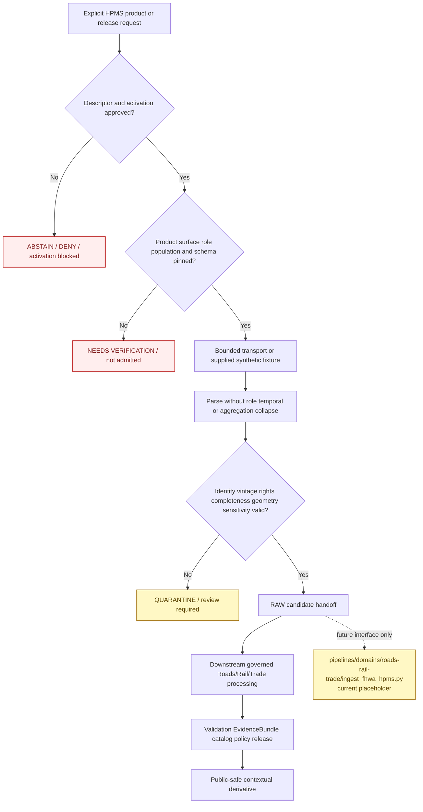

<!-- [KFM_META_BLOCK_V2]
doc_id: kfm://doc/connectors-fhwa-hpms-readme
title: connectors/fhwa_hpms/ — FHWA HPMS Connector Lane
type: readme
version: v0.2
status: draft
owners: OWNER_TBD — Connector steward · FHWA/HPMS source steward · Roads/Rail/Trade steward · Transport-network steward · Rights reviewer · Privacy/sensitivity reviewer · Security reviewer · Validation steward · Docs steward
created: 2026-06-18
updated: 2026-07-11
policy_label: public-context; source-admission; greenfield; no-network-default; source-vintage-aware; source-role-unresolved; aggregation-preserving; sensitive-joins-fail-closed; raw-or-quarantine-only; no-navigation; no-publication
proposed_path: connectors/fhwa_hpms/README.md
truth_posture: CONFIRMED README-only connector lane / implementation ABSENT / SourceDescriptor ABSENT or UNPROVED / source role CONFLICTED / source NOT ACTIVATED / downstream pipeline PLACEHOLDER / tests and CI ABSENT or UNKNOWN
related:
  - ../README.md
  - ../fhwa_nhfn/README.md
  - ../../docs/sources/catalog/usdot/README.md
  - ../../docs/sources/catalog/usdot/fhwa-hpms.md
  - ../../docs/domains/roads-rail-trade/README.md
  - ../../docs/domains/roads-rail-trade/SOURCES.md
  - ../../docs/domains/roads-rail-trade/SOURCE_FAMILIES.md
  - ../../docs/domains/roads-rail-trade/SOURCE_REGISTRY.md
  - ../../docs/domains/roads-rail-trade/DATA_LIFECYCLE.md
  - ../../data/registry/roads-rail-trade/sources/README.md
  - ../../data/registry/sources/README.md
  - ../../data/raw/roads-rail-trade/README.md
  - ../../data/quarantine/roads-rail-trade/
  - ../../pipelines/domains/roads-rail-trade/ingest_fhwa_hpms.py
  - ../../fixtures/
  - ../../schemas/contracts/v1/source/
  - ../../policy/domains/roads-rail-trade/
  - ../../policy/sensitivity/
  - ../../policy/rights/
  - ../../release/
tags: [kfm, connectors, fhwa, hpms, usdot, roads-rail-trade, highway, administrative, aggregate, source-vintage, linear-reference, source-admission, raw, quarantine, governance]
notes:
  - "Repository inspection confirms that connectors/fhwa_hpms/ contains this README only; no package metadata, Python module, client, parser, fixture, test, SourceDescriptor, activation record, or passing CI evidence is proved."
  - "The only directly named downstream HPMS pipeline file is an eight-line PROPOSED placeholder docstring; it is not executable ingestion evidence."
  - "Source-role documentation conflicts: the source product page proposes primarily observed with aggregate rollups, while the Roads/Rail/Trade source ledger and deep reference classify HPMS as administrative/aggregate and deny per-place moment-specific inference. No connector role may be hard-coded until an accepted SourceDescriptor resolves the conflict."
  - "Naming and topology drift remain unresolved: fhwa_hpms versus fhwa-hpms RAW-lane spelling, and domain-first versus subtype-first source-registry paths."
  - "Current access surface, endpoint, release form, cadence details, schema/data-dictionary version, sample-versus-universe composition, rights text, and redistribution posture remain NEEDS VERIFICATION."
[/KFM_META_BLOCK_V2] -->

<a id="top"></a>

# FHWA HPMS Connector Lane

> Evidence-grounded boundary for future FHWA Highway Performance Monitoring System source-admission code. The current directory is documentation-only. It does **not** provide an importable connector, live HPMS access, an activated source, executable tests, RAW captures, downstream ingestion, or publication capability.

<p>
  
  
  
  
  
  
</p>

`connectors/fhwa_hpms/`

> [!IMPORTANT]
> **Confirmed state:** this directory contains this README only. No `pyproject.toml`, `src/`, importable package, endpoint configuration, SourceDescriptor, activation decision, client, downloader, parser, validator, handoff builder, fixture set, test suite, or passing CI evidence is confirmed. The named downstream pipeline file is a placeholder docstring, not working ingestion logic. Treat every implementation structure, command, field list, and outcome below as a future contract or proposal—not current behavior.

**Quick jumps:** [Purpose](#purpose) · [Verified repository state](#verified-repository-state) · [Evidence ledger](#evidence-ledger) · [Connector authority boundary](#connector-authority-boundary) · [Blocking drift](#blocking-drift) · [Source identity and role](#source-identity-and-role) · [What HPMS may and may not support](#what-hpms-may-and-may-not-support) · [Access-surface and product classification](#access-surface-and-product-classification) · [Input contract](#input-contract) · [Metadata preservation](#metadata-preservation) · [Temporal and vintage handling](#temporal-and-vintage-handling) · [Geometry and linear-reference handling](#geometry-and-linear-reference-handling) · [Aggregation sample and universe handling](#aggregation-sample-and-universe-handling) · [Rights privacy and sensitive joins](#rights-privacy-and-sensitive-joins) · [Finite outcomes](#finite-outcomes) · [Lifecycle boundary](#lifecycle-boundary) · [Proposed implementation shape](#proposed-implementation-shape) · [Testing relationship](#testing-relationship) · [Pipeline and downstream separation](#pipeline-and-downstream-separation) · [Implementation sequence](#implementation-sequence) · [Activation gates](#activation-gates) · [Review and rollback](#review-and-rollback) · [Definition of done](#definition-of-done) · [Verification backlog](#verification-backlog)

---

## Purpose

`connectors/fhwa_hpms/` is the reserved source-specific connector lane for FHWA HPMS admission behavior.

When implementation exists, connector code may:

- validate explicit, side-effect-free connector configuration;
- consume an accepted SourceDescriptor reference and activation decision supplied by governed callers;
- identify a specifically approved HPMS release, table, archive, service, extract, or metadata surface;
- retrieve approved source material through bounded, replaceable transport;
- parse synthetic fixtures or approved HPMS-shaped payloads without upgrading them to road-network truth;
- preserve product, table, reporting-year, source-role, aggregation, record, temporal, spatial, rights, sensitivity, retrieval, and digest metadata;
- distinguish inventory/administrative records from aggregate summaries and from any separately admitted observation-like fields;
- detect missing vintage, incomplete capture, unstable identity, schema drift, unknown field meaning, projection/linear-reference uncertainty, rights uncertainty, or sensitive-join risk;
- return finite error, abstention, activation-blocked, drift, review, RAW-candidate, or QUARANTINE-candidate results;
- remain deterministic and testable with no network, no account, and no credentials.

This lane must never become canonical road-network truth, live traffic or closure authority, navigation or routing authority, legal-access authority, roadway-safety guidance, ownership/title authority, transportation-policy authority, source-registry authority, schema authority, policy authority, proof authority, release authority, or a public-data surface.

[Back to top ↑](#top)

---

## Verified repository state

The following relationship is confirmed on the repository's `main` branch at the time of this update:

```text
connectors/
└── fhwa_hpms/
    └── README.md                         # this connector contract

pipelines/
└── domains/
    └── roads-rail-trade/
        └── ingest_fhwa_hpms.py           # PROPOSED placeholder docstring only
```

Related documentation and lifecycle surfaces exist elsewhere:

```text
docs/sources/catalog/usdot/fhwa-hpms.md
docs/domains/roads-rail-trade/SOURCES.md
docs/domains/roads-rail-trade/SOURCE_FAMILIES.md
data/registry/roads-rail-trade/sources/README.md
data/raw/roads-rail-trade/README.md
```

### Current maturity

| Surface | Confirmed content | Maturity |
|---|---|---:|
| `connectors/fhwa_hpms/README.md` | This source-admission contract. | **DOCUMENTED** |
| Other files below `connectors/fhwa_hpms/` | None found in current repository search. | **ABSENT / NEEDS CONTINUOUS VERIFICATION** |
| Package metadata | None confirmed. | **ABSENT** |
| Importable connector namespace | None confirmed. | **ABSENT / UNPROVED** |
| HPMS transport/client | None confirmed. | **ABSENT** |
| Parser/validator/handoff code | None confirmed. | **ABSENT** |
| Connector-local fixtures or tests | None confirmed. | **ABSENT** |
| Accepted HPMS SourceDescriptor | None found or verified in this update. | **ABSENT / NEEDS VERIFICATION** |
| Source role | Conflicting documentation; no accepted descriptor. | **CONFLICTED / BLOCKED** |
| Live source access | No approved endpoint or access surface confirmed. | **NOT ACTIVATED** |
| `pipelines/domains/roads-rail-trade/ingest_fhwa_hpms.py` | Eight-line placeholder docstring. | **PLACEHOLDER / NON-EXECUTABLE** |
| HPMS RAW child lane | Parent RAW README says no child source-family READMEs were confirmed. | **ABSENT / PROPOSED** |
| Connector-specific CI evidence | None confirmed. | **UNKNOWN** |

> [!CAUTION]
> A connector-shaped directory, a source catalog page, and a pipeline-shaped placeholder do not constitute an implementation. Do not describe the HPMS connector as installable, importable, runnable, activated, tested, rights-cleared, schema-pinned, current, or production-ready until repository artifacts and reviewable execution evidence support those claims.

[Back to top ↑](#top)

---

## Evidence ledger

| Evidence | Status | What it supports | What it does not support |
|---|---:|---|---|
| `connectors/fhwa_hpms/README.md` | **CONFIRMED** | The connector lane and its boundary exist. | Executable connector behavior. |
| Current repository search for `connectors/fhwa_hpms/` | **CONFIRMED for inspected state** | Only this README was found under the connector path. | Permanent absence or unindexed future files. |
| `docs/sources/catalog/usdot/fhwa-hpms.md` | **CONFIRMED draft source profile** | Proposed source ID, source-side metadata, temporal, geometry, rights, and lifecycle expectations are documented. | Current endpoint, cadence dates, schema version, rights text, activation, or implementation. |
| `docs/domains/roads-rail-trade/SOURCES.md` | **CONFIRMED draft source ledger** | HPMS is listed as `administrative`/`aggregate`, can support inventory/performance context, and cannot prove moment-specific per-place conditions. | Final admitted role without a SourceDescriptor. |
| `docs/domains/roads-rail-trade/SOURCE_FAMILIES.md` | **CONFIRMED deep reference** | Aggregate-as-per-place collapse is explicitly denied and source terms remain verification-gated. | Runtime enforcement or activation. |
| `data/registry/roads-rail-trade/sources/README.md` | **CONFIRMED registry documentation** | A domain-first registry lane exists and records source identity, role, rights, cadence, activation, and caveats. | A completed HPMS descriptor or settled registry topology. |
| `data/raw/roads-rail-trade/README.md` | **CONFIRMED RAW documentation** | RAW is no-public-path, source-role-preserving, and currently has no confirmed child source-family README. | An HPMS capture, receipt, or accepted child-folder spelling. |
| `pipelines/domains/roads-rail-trade/ingest_fhwa_hpms.py` | **CONFIRMED placeholder** | A future downstream ingest responsibility has been named. | Executable parsing, validation, handoff, or lifecycle transition. |
| Connector tests and CI | **ABSENT / UNKNOWN** | Test requirements can be documented here. | Passing behavior or enforcement. |

[Back to top ↑](#top)

---

## Connector authority boundary

```text
THIS CONNECTOR MAY EVENTUALLY:
  validate explicit configuration
  verify descriptor and activation preconditions
  identify one approved HPMS product/release/surface
  perform bounded source retrieval
  parse supplied HPMS-shaped records or archives
  preserve source identity, role, vintage, aggregation, field, and geometry metadata
  detect incomplete capture, schema drift, unstable keys, projection uncertainty, and sensitive-join risk
  return finite connector outcomes
  prepare RAW-or-QUARANTINE handoff candidates

THIS CONNECTOR MUST NOT:
  assign canonical SourceDescriptor values by itself
  infer source role from the provider name or a table title
  conflate HPMS geometry with canonical KFM road geometry
  merge or snap HPMS records into canonical segments at the connector edge
  claim current road condition, closure, passability, safety, legal access, or ownership
  provide navigation, routing, dispatch, enforcement, or emergency instructions
  infer per-place facts from aggregates or sample summaries
  define policy, rights, sensitivity, schemas, proof, catalog, or release decisions
  write directly to WORK, PROCESSED, CATALOG, TRIPLET, PROOF, RECEIPT, RELEASE, or PUBLISHED authority roots
  serve public APIs, maps, tiles, graphs, reports, stories, search payloads, or generated answers
```

The connector preserves what a specifically admitted HPMS product says and the scope under which it says it. It does not decide that the material is canonical, current, operational, legally controlling, safe for routing, or eligible for public release.

[Back to top ↑](#top)

---

## Blocking drift

The connector cannot be implemented safely until these gaps are resolved or represented as explicit fail-closed conditions.

| Blocker | Current state | Required resolution |
|---|---|---|
| Connector implementation | README-only directory. | Select an implementation and packaging convention; add code only with tests and ownership. |
| Source identity | `fhwa_hpms` is a proposed source-ID hint, not a verified admitted identifier. | Approve a canonical source/product ID in the accepted registry. |
| Source-role conflict | Source product page proposes primarily `observed` with aggregate rollups; domain source ledger says `administrative`/`aggregate`. | Source steward resolves role per product/table in an accepted SourceDescriptor; connector must not default to `observed`. |
| Registry topology | Domain-first `data/registry/roads-rail-trade/sources/` and subtype-first `data/registry/sources/roads-rail-trade/` patterns both appear in documentation. | Choose one canonical descriptor home or governed compatibility/migration plan. |
| RAW child naming | Source docs use `fhwa_hpms`; RAW README gives `fhwa-hpms` as a possible future folder. | Accept one handoff identifier or explicitly governed alias contract. |
| Access surface | Current endpoint, service, download, archive, or export form is unverified. | Pin the approved product/release surface and prohibit provider-wide or guessed access. |
| Release and schema identity | Current release naming, reporting-year convention, data dictionary, field inventory, and schema version are unverified. | Pin a release/data-dictionary fingerprint and drift policy. |
| Product composition | Sample-versus-universe data, section/segment granularity, and rollup products are unresolved. | Classify each admitted product and preserve its population and aggregation semantics. |
| Stable identity | Deterministic row/section/segment keys are not selected. | Define source keys or documented composite keys before incremental updates or deduplication. |
| Rights and terms | Current terms, attribution, redistribution, and caveats are unverified. | Complete a source-specific rights snapshot before activation or public-safe derivatives. |
| Sensitive joins | Private-facility, critical-infrastructure, parcel, person, and operational joins are not governed here. | Adopt fail-closed policy and negative tests before any such join can leave quarantine. |
| Handoff contract | No binding connector-result or RAW/QUARANTINE envelope is confirmed. | Select contract, schema, validation, routing, and finite error semantics. |
| Downstream pipeline | Named pipeline file is a placeholder docstring only. | Implement separately after connector handoff contracts exist; do not treat the placeholder as a working consumer. |
| Fixtures and tests | None confirmed. | Add synthetic no-network fixtures and executable behavior tests. |
| CI | No passing connector-specific run is confirmed. | Prove a clean local no-network command before claiming CI enforcement. |

Do not hide these gaps with guessed endpoint URLs, permissive role defaults, invented field schemas, assumed annual release dates, broad provider activation, or examples presented as operational configuration.

[Back to top ↑](#top)

---

## Source identity and role

The current working provider/product identity is:

```text
provider: FHWA / USDOT
product family: Highway Performance Monitoring System (HPMS)
proposed KFM source ID: fhwa_hpms
connector path: connectors/fhwa_hpms/
```

Only the connector path is confirmed. The source ID and every operational identity field remain subject to registry approval.

### Role resolution requirement

HPMS documentation currently carries two incompatible role interpretations:

1. the source product page discusses primarily `observed` material with possible `aggregate` rollups;
2. the Roads/Rail/Trade source ledger and deep reference classify HPMS as `administrative`/`aggregate` and explicitly deny moment-specific per-place inference.

Until an admitted descriptor resolves the conflict:

- do not hard-code `observed` as the connector default;
- do not collapse all HPMS tables or fields into one role;
- treat inventory/roster/compiled records as at least role-review-required;
- require an exact aggregation unit for rollups and summaries;
- preserve any source-carried measurement date without using it to upgrade the entire product role;
- require separate descriptors or product keys when materially different HPMS surfaces have different roles;
- reject product/role mismatches and role inference from field names alone.

A role correction must produce a reviewed descriptor or correction record. Connector parsing must not silently change role during normalization.

[Back to top ↑](#top)

---

## What HPMS may and may not support

Subject to product-specific admission, HPMS material may support downstream contextual claims about:

- highway inventory attributes;
- source-issued functional-classification context;
- annual or source-vintage performance summaries;
- use and operating-characteristic fields carried by the admitted product;
- road-section, sample-section, universe, route, state, county, or other explicitly documented reporting units;
- source-carried geometry or linear-reference context;
- comparisons across vintages only when identity, schema, units, geometry, and methodology remain compatible;
- corroboration or candidate matching for downstream road-network workflows.

HPMS does not by itself prove:

- current roadway condition at the moment of a user request;
- current closure, detour, congestion, passability, restriction, or emergency status;
- canonical KFM road-segment identity or topology;
- legal route designation, legal access, ownership, title, jurisdictional authority, or enforcement status;
- navigation suitability, routing safety, dispatch instructions, or travel-time reliability;
- parcel-, facility-, household-, person-, or site-specific facts derived from aggregate or sample data;
- that a historical annual value remains valid today;
- that a geometry or linear reference aligns exactly with TIGER/Line, OSM, KDOT, parcel, bridge, or other network sources;
- policy, funding, compliance, engineering, or safety conclusions beyond the source's admitted scope.

[Back to top ↑](#top)

---

## Access-surface and product classification

Every source input must be classified before retrieval or parsing. The exact current HPMS access surfaces remain unverified.

| Surface class | Allowed future use | Prohibited use |
|---|---|---|
| Official release archive or extract | Immutable source capture after descriptor and activation gates. | Silent overwrite, unversioned extraction, or implicit publication. |
| Tabular/feature data product | Parsing and source-admission validation under a pinned data dictionary. | Assuming all rows share one role, aggregation unit, or spatial precision. |
| Data dictionary/schema/technical metadata | Field meaning, units, key, geometry, release, and drift evidence. | Source activation by itself. |
| Service or API surface | Bounded retrieval only after endpoint, limits, completeness, and terms review. | Guessed URLs, provider-wide crawling, or unbounded pagination. |
| Summary/rollup product | Aggregate evidence at an explicit unit and population/scope. | Per-place, individual, facility, parcel, or segment inference below the supported unit. |
| Visualization or rendered product, if any | Human reference where accurately labeled. | Feature extraction, canonical geometry, field reconstruction, or analytic replacement for governed source data. |
| Downstream tiles, graphs, or summaries | Released presentation only after validation, evidence, policy, and release. | Evidence substitution or direct connector output. |

A shared FHWA provider does not create umbrella admission across HPMS, NHFN, bridge products, freight products, or other USDOT surfaces.

[Back to top ↑](#top)

---

## Input contract

Future live or fixture-backed operations should require explicit inputs, subject to the accepted connector contract:

- canonical SourceDescriptor reference;
- SourceActivationDecision or accepted equivalent;
- provider and exact HPMS product/release key;
- approved source surface, archive, service, table, or export identity;
- reporting year or source-vintage scope;
- table/product population classification such as sample, universe, section, summary, or another pinned category;
- explicit source role and, for aggregates, aggregation unit;
- current rights and terms snapshot reference;
- schema/data-dictionary identity or fingerprint;
- validated request, geography, state, route, table, or release scope;
- timeout, retry, size, pagination, archive, and checksum limits where applicable;
- intended domain route;
- lifecycle target of RAW or QUARANTINE only;
- synthetic no-network fixture or approved source payload supplied through an explicit interface.

Required behavior:

- reject missing or ambiguous product identity;
- reject missing descriptor or activation evidence for live behavior;
- reject unknown or non-admitted releases/tables;
- reject product/role and product/aggregation mismatches;
- never route by URL substring or filename alone;
- never activate every FHWA product through one provider-wide switch;
- keep fixture configuration unable to fall through to live transport;
- document no endpoint, environment-variable name, credential convention, or live command as accepted until implementation and security review establish it.

[Back to top ↑](#top)

---

## Metadata preservation

Every non-error candidate should preserve, where applicable and confirmed by the admitted product:

### Cross-product minimum

- canonical KFM source identifier;
- FHWA provider and exact HPMS product/release/table identity;
- source role and role authority;
- aggregation unit and represented population/scope when applicable;
- stable row, section, segment, route, sample, or composite identity;
- source URI, archive, service, table, file, layer, or query identity;
- reporting year and source-vintage label;
- source, observation/measurement, valid, retrieval, release, update, and correction time meanings without collapse;
- schema/data-dictionary identity and field fingerprint;
- connector and parser version;
- rights, attribution, privacy, sensitivity, and review state;
- checksum or digest;
- intended domain route;
- intended lifecycle target of RAW or QUARANTINE only;
- drift, stale, incomplete, quarantine, and review flags.

### Record and field semantics

Where present and verified, preserve:

- state, jurisdiction, route, section, sample/universe, functional-class, facility, condition, performance, use, and operating-characteristic identifiers or fields;
- exact source field names and code values before downstream recoding;
- field definitions, units, null/unknown/not-applicable semantics, code lists, and data-quality flags;
- row counts, unique-key counts, duplicate counts, rejected-row counts, archive members, and completeness evidence;
- source-carried caveats or suppression indicators.

### Spatial and linear-reference minimum

Where present and verified, preserve:

- geometry type and source geometry;
- CRS and horizontal datum;
- linear-reference system, route key, begin/end measures, direction, and measure units;
- spatial resolution, scale, positional-accuracy, or support metadata;
- clipping, reprojection, repair, simplification, or conflation status;
- geometry and attribute checksums or fingerprints.

Source-issued values must remain inspectable. Simplified, crosswalked, conflated, or derived values may be added downstream only when originals and transformation evidence remain available.

[Back to top ↑](#top)

---

## Temporal and vintage handling

HPMS is source-vintage sensitive. Annual or reporting-year context must never be presented as current operational status by convenience.

Keep these time meanings distinct when material:

| Time kind | Connector meaning | Guardrail |
|---|---|---|
| Reporting/source year | Year or vintage under which the product reports the record. | Required for every promotion-track candidate. |
| Observation/measurement time | Date or interval of the underlying measurement, if supplied. | Does not upgrade an administrative/aggregate product into universal observed truth. |
| Valid time | Period the source asserts the value applies to. | Must not be inferred solely from retrieval date. |
| Source publication/update time | When FHWA issued or revised the source release. | Preserve separately from reporting year. |
| Retrieval time | When KFM captured the source material. | Required for provenance and stale-state review. |
| Downstream release time | When a governed KFM derivative was released. | Outside connector authority. |
| Correction/supersession time | When a prior source or KFM artifact was corrected or superseded. | Requires new capture/correction evidence; no silent overwrite. |

Required vintage behavior:

- never overwrite a prior capture silently;
- bind each capture to product/release identity, reporting year, schema fingerprint, scope, and checksum;
- treat late revisions or resubmissions as new source states with explicit lineage;
- block “current HPMS” language when reporting year, publication/update time, or retrieval lineage is absent;
- do not compare vintages when field definitions, aggregation units, units, geometry support, sample design, or stable keys are incompatible without a reviewed method;
- emit drift or review outcomes when a release changes field names, types, code lists, population scope, or identity rules.

[Back to top ↑](#top)

---

## Geometry and linear-reference handling

HPMS geometry and linear-reference information are source evidence, not canonical KFM network topology.

Minimum posture:

1. Record the upstream CRS and datum from source metadata; do not infer them from coordinate appearance.
2. Preserve geometry, route identifiers, linear-reference system, measures, units, direction, and source support metadata where supplied.
3. Distinguish tabular attributes without geometry, source-carried geometry, linear-referenced sections, generalized geometry, and downstream conflated geometry.
4. Do not snap, merge, split, conflate, or assign canonical KFM road-segment identity inside the connector unless a binding pre-admission contract explicitly requires a bounded transform with evidence.
5. Route empty, truncated, invalid, unsupported, or ambiguous geometry to review or quarantine.
6. Record every reprojection, measure conversion, repair, clipping, or simplification as transformation evidence downstream.
7. Do not infer legal access, ownership, current passability, route designation, or navigation suitability from geometry.
8. Keep HPMS-to-TIGER, HPMS-to-OSM, HPMS-to-KDOT, HPMS-to-parcel, and HPMS-to-facility matching in governed downstream pipelines with confidence, ambiguity, and rollback support.

[Back to top ↑](#top)

---

## Aggregation sample and universe handling

The connector must preserve the population and granularity represented by each admitted product.

Required behavior:

- classify each table or release as sample, universe, section-level, route-level, state-level, summary, aggregate, or another source-defined population;
- preserve the exact aggregation unit and denominator/population scope;
- distinguish a sampled or summarized value from a direct section record;
- distinguish annual totals, averages, rates, and indices from component observations;
- never downscale a state, county, route, corridor, sample, or summary value into a more specific place or segment claim without an independently governed model and uncertainty evidence;
- never use a sample-section value as if it described every nearby road segment;
- reject aggregate records without explicit geography, time period, population/scope, method, and unit;
- preserve suppression, weighting, expansion-factor, quality, or sampling indicators when carried and verified;
- require separate descriptors or product keys when different HPMS products materially differ in role, population, aggregation, rights, cadence, or schema.

The absence of an aggregation field does not prove that a record is a direct observation. Role and population are admission decisions, not parser guesses.

[Back to top ↑](#top)

---

## Rights privacy and sensitive joins

Public-source availability does not create a blanket public-safe or join-safe decision.

Minimum posture:

1. Verify current rights, attribution, redistribution, and source terms before activation.
2. Keep rights separate from sensitivity; a reusable federal record may still become unsafe after a high-precision join.
3. Treat private-facility, critical-infrastructure, utility, parcel, property, person, ownership, operator, vulnerability, and access-control joins as review-gated.
4. Do not infer private-road status, legal access, enforcement, facility vulnerability, or household exposure from HPMS context alone.
5. Preserve source geography and precision so downstream policy can generalize, restrict, or deny appropriately.
6. Minimize logs and fixtures; do not commit real sensitive facility, parcel, person, or operational rows merely to test parsing.
7. Review cross-domain joins even when each source is low-risk in isolation.
8. Route unresolved rights, attribution, precision, sensitivity, or joining risk to restriction, quarantine, abstention, or denial.
9. Keep generated maps, graphs, summaries, vector indexes, and AI text downstream; they cannot override source role, aggregation scope, or release gates.

[Back to top ↑](#top)

---

## Finite outcomes

Future connector APIs and tests should require a small documented set of deterministic outcomes rather than ambiguous partial success.

| Condition | Required safe behavior |
|---|---|
| Connector package absent or not installed | Fail clearly; do not report connector validation success. |
| SourceDescriptor missing | Refuse live activation with an actionable error. |
| Activation decision missing | `ABSTAIN` or activation-blocked result. |
| Source identity or product key ambiguous | Validation failure or `NEEDS_VERIFICATION`. |
| Product/release/table not admitted | Table/product-not-admitted result. |
| Source role unresolved or conflicting | Review/activation block; do not default to `observed`. |
| Product/role mismatch | Validation failure. |
| Aggregation unit or population scope missing | Validation failure or quarantine. |
| Network disabled | Fixture/parser paths remain usable; live request returns bounded disabled outcome. |
| Unauthorized or forbidden | Finite redacted error; no credential leakage. |
| Timeout or rate limit | Bounded error; no infinite retry. |
| Unexpected redirect, host, content type, encoding, or archive format | Validation failure or quarantine. |
| Empty response | `ABSTAIN` unless the approved product contract defines empty as valid. |
| Malformed response | Finite parser error with safe source metadata. |
| Archive incomplete or checksum mismatch | Incomplete-capture quarantine. |
| Schema, field, code-list, or type drift | Reviewable drift result; no silent field loss. |
| Stable identity absent or changed | Block deterministic update and deduplication. |
| Reporting year or release/vintage missing | Quarantine or abstention. |
| CRS, datum, linear reference, or units unresolved | Quarantine; block spatial conflation and precision claims. |
| Aggregate emitted as segment/place truth | Hard source-role/aggregation anti-collapse failure. |
| Annual record emitted as current operational status | Hard temporal-boundary failure. |
| Sensitive join requested without policy support | Restrict, quarantine, or deny. |
| Runtime attempts to use downstream placeholder as proof of ingestion | Validation failure. |
| Direct downstream or public write attempted | Hard failure. |
| Navigation, safety, access, ownership, legal, enforcement, or policy determination requested | Refuse and direct callers to official or governed channels. |

Errors must be deterministic, actionable, finite, safe to log, and free of secrets or unnecessary source-payload content.

[Back to top ↑](#top)

---

## Lifecycle boundary

The connector participates only at the source-admission edge.



The diagram defines responsibility boundaries. It does not prove package import, source access, parsing, handoff, RAW storage, pipeline execution, evidence closure, or release.

KFM lifecycle discipline remains:

```text
RAW -> WORK / QUARANTINE -> PROCESSED -> CATALOG / TRIPLET -> PUBLISHED
```

The connector may construct a RAW/QUARANTINE handoff candidate only after a binding contract exists. It must not independently normalize into canonical road-network truth, conflate geometry, build graph authority, promote, catalog, prove, release, or publish data.

[Back to top ↑](#top)

---

## Proposed implementation shape

No implementation layout is accepted. A coherent future package might look like:

```text
connectors/fhwa_hpms/
├── README.md
├── pyproject.toml
├── src/
│   └── fhwa_hpms/
│       ├── __init__.py
│       ├── config.py
│       ├── dispatch.py
│       ├── transport.py
│       ├── products.py
│       ├── parse.py
│       ├── validate.py
│       ├── handoff.py
│       └── errors.py
└── tests/
    ├── README.md
    ├── fixtures/
    ├── test_import_safety.py
    ├── test_configuration.py
    ├── test_activation_preconditions.py
    ├── test_product_dispatch.py
    ├── test_transport.py
    ├── test_role_and_aggregation.py
    ├── test_vintage_and_schema.py
    ├── test_geometry_and_linear_reference.py
    ├── test_sensitive_joins.py
    ├── test_handoff_boundaries.py
    └── test_errors_and_drift.py
```

This tree is **PROPOSED**, not implementation evidence. Do not create it mechanically. Each module must correspond to implemented responsibility, a selected contract, an owner, synthetic fixtures, and executable tests.

Potential responsibility split:

| Future module | Responsibility | Boundary |
|---|---|---|
| `config.py` | Side-effect-free validated configuration and safe defaults. | No self-activation or provider-wide enable switch. |
| `dispatch.py` | Closed product/release/table routing. | No URL/filename substring routing or role inference. |
| `transport.py` | Bounded replaceable service/archive/download transport. | No parsing policy, domain conflation, or hidden credential acquisition. |
| `products.py` | Product/release/table classifications and pinned metadata expectations. | Not SourceDescriptor authority. |
| `parse.py` | Deterministic source-shaped parsing with exact field/value preservation. | No canonical road-network creation. |
| `validate.py` | Connector-local identity, vintage, role, aggregation, completeness, geometry, and drift checks. | Not domain or release policy authority. |
| `handoff.py` | Finite connector results and RAW/QUARANTINE candidates. | No direct downstream promotion. |
| `errors.py` | Small deterministic redacted error taxonomy. | No secrets or unbounded payload excerpts. |

Before any package is called importable, it must declare a build backend, package discovery, supported Python version, dependencies, version policy, and a narrow side-effect-free import surface.

[Back to top ↑](#top)

---

## Testing relationship

No connector-local test directory or executable test is currently confirmed.

Future tests should prove:

- clean import with no network, secret read, filesystem write, logging setup, environment mutation, cache initialization, registry mutation, or source activation;
- no-network default transport behavior;
- explicit descriptor and activation requirements;
- closed product/release/table dispatch;
- source-role conflict fails closed and does not silently choose `observed`;
- administrative and aggregate semantics remain distinct;
- aggregate/sample records require exact population and aggregation scope;
- reporting year, publication/update time, measurement time, valid time, and retrieval time remain distinct;
- schema/data-dictionary drift produces reviewable outcomes;
- stable-key, duplicate, count, archive-member, and checksum failures close safely;
- source field names, code values, units, null semantics, and quality flags are preserved;
- CRS, datum, linear-reference, measure, geometry, and support uncertainty route safely;
- HPMS geometry cannot become canonical road identity at the connector edge;
- annual records cannot become current status, navigation, safety, access, ownership, or enforcement claims;
- private-facility, critical-infrastructure, parcel, person, and high-precision join risks route to review, restriction, quarantine, or denial;
- only finite connector results and RAW/QUARANTINE candidates are accepted;
- all direct WORK, PROCESSED, CATALOG, TRIPLET, PROOF, RECEIPT, RELEASE, PUBLISHED, map, graph, routing, search, report, story, or generated-answer writes fail.

Fixtures must be synthetic, minimized, no-network, and free of real private-facility, parcel, person, credential, or sensitive infrastructure data unless separately governed approval exists.

Minimum synthetic cases should include:

- valid administrative inventory record with reporting year and stable identity;
- valid aggregate record with explicit population and aggregation unit;
- source-role conflict or mismatch;
- aggregate emitted as a segment-specific fact;
- missing reporting year or release identity;
- changed field name/type/code list;
- missing or changed stable key;
- duplicate records or count mismatch;
- incomplete archive or checksum mismatch;
- missing CRS/datum/linear-reference units;
- invalid or unsupported geometry;
- annual record presented as current condition;
- sensitive join request without policy support;
- direct downstream-write attempt.

No test runner, dependency, local command, live-test flag, marker, endpoint constant, credential mode, fixture convention, or passing status is accepted by this README. A future command such as `python -m pytest connectors/fhwa_hpms/tests` remains **PROPOSED** until packaging and tests exist and the repository-standard runner is verified.

[Back to top ↑](#top)

---

## Pipeline and downstream separation

Source access, source admission, domain processing, identity/conflation, policy, evidence, and release are separate responsibilities.

| Surface | Responsibility | Must not do |
|---|---|---|
| `connectors/fhwa_hpms/` | Approved HPMS source access, parsing, connector-local validation, finite outcomes, and RAW/QUARANTINE handoff candidates. | Build canonical road truth, publish, or own domain normalization. |
| `pipelines/domains/roads-rail-trade/ingest_fhwa_hpms.py` | Future downstream ingest/normalization after admission. | Act as SourceDescriptor authority or bypass RAW/QUARANTINE; currently it is only a placeholder. |
| Roads/Rail/Trade identity/network packages | Downstream deterministic identity, conflation, topology, and graph candidates under contracts. | Rewrite source evidence invisibly or claim legal/navigation authority. |
| Domain policies and validators | Decide admissibility, sensitive joins, stale-state, transformations, and release prerequisites. | Fetch source material or infer role from convenience. |
| Evidence/catalog surfaces | Close provenance and projection requirements after validation. | Treat connector output as proof automatically. |
| Release surfaces | Approve public-safe derivatives, corrections, withdrawal, and rollback. | Treat RAW, connector, or pipeline output as released truth. |

A pipeline-shaped path is not proof of a working pipeline. A downstream transformation is not a source-role correction. A graph edge or conflated segment is not source truth or navigation authority.

[Back to top ↑](#top)

---

## Implementation sequence

Implement in dependency order:

1. **Resolve source and path identity**
   - accept canonical source/product ID;
   - reconcile `fhwa_hpms` and `fhwa-hpms` handoff spelling;
   - reconcile registry topology.
2. **Resolve source role and product decomposition**
   - settle administrative/aggregate/observed conflict per product;
   - classify sample, universe, section, summary, and rollup products;
   - require separate descriptors where roles or populations differ.
3. **Resolve packaging and contracts**
   - select implementation layout, build backend, package discovery, Python version, dependencies, and public imports;
   - select finite connector-result and RAW/QUARANTINE handoff contracts.
4. **Pin one source release for fixture-only work**
   - verify product identity, reporting year, data dictionary, schema fingerprint, stable keys, field semantics, geometry/linear reference, rights, and caveats;
   - create the smallest synthetic fixture set.
5. **Implement import safety, configuration, dispatch, and finite errors**
   - no-network defaults;
   - explicit product/release/table keys;
   - deterministic redacted outcomes.
6. **Implement one fixture-only parser slice**
   - preserve source fields, role, vintage, aggregation, keys, time, geometry, and metadata;
   - add executable tests before live transport.
7. **Add validated transport**
   - only after source access form, terms, limits, completeness, security, and retention are reviewed;
   - keep transport replaceable by test doubles.
8. **Add handoff integration**
   - only after RAW/QUARANTINE contract, child-lane naming, and domain routing are accepted;
   - reject direct downstream writes.
9. **Implement the downstream pipeline separately**
   - replace the placeholder only after connector output exists;
   - test identity, conflation, transformation, policy, and rollback independently.
10. **Add additional HPMS products independently**
    - each receives identity, role, population, aggregation, rights, cadence, schema, fixtures, tests, and activation evidence.
11. **Add CI last**
    - prove a clean local no-network command first;
    - retain reviewable run evidence;
    - do not upgrade badges or maturity claims before evidence exists.

[Back to top ↑](#top)

---

## Activation gates

No live HPMS behavior should run until all applicable gates close:

- [ ] Canonical HPMS source/product identifier is accepted.
- [ ] Registry topology and SourceDescriptor home are accepted.
- [ ] Product-specific SourceDescriptor and activation decision exist.
- [ ] Source-role conflict is resolved and anti-collapse tests exist.
- [ ] Sample, universe, section, summary, and aggregate product boundaries are pinned where applicable.
- [ ] Current access surface, endpoint/archive/export identity, reporting-year convention, and release identity are verified.
- [ ] Current schema/data dictionary, field meanings, code lists, units, and stable keys are pinned or fingerprinted.
- [ ] Source terms, rights, attribution, and redistribution posture are reviewed.
- [ ] Privacy, precision, critical-infrastructure, private-facility, parcel/person, and joining risks are reviewed.
- [ ] CRS, datum, geometry, linear-reference, measure, resolution, and transformation rules are defined where applicable.
- [ ] Completeness, counts, duplicates, archive members, checksums, retry, timeout, rate-limit, redirect, and size bounds are defined.
- [ ] RAW child-lane name, connector-result contract, handoff envelope, domain route, and alias behavior are accepted.
- [ ] Packaging and clean import behavior are verified from a clean environment.
- [ ] Synthetic no-network fixtures and executable tests pass.
- [ ] Secrets and configuration use approved handling.
- [ ] Connector, pipeline, identity/conflation, policy, evidence, catalog, and release responsibilities remain separate.
- [ ] Rollback, correction, stale-state, incomplete-run, cache invalidation, and payload cleanup procedures are documented.
- [ ] CI evidence is reviewable before any activation or maturity claim is upgraded.

Until then, this connector remains documentation-only and live access remains inactive.

[Back to top ↑](#top)

---

## Review and rollback

Review connector changes as source-role, aggregation, temporal, spatial, privacy, packaging, and transportation-safety-adjacent changes.

A reviewer should confirm:

- implementation claims match the repository tree and test evidence;
- SourceDescriptor and activation authority remain external;
- product/release/table identity and population scope are explicit;
- source-role conflict is not hidden by defaults or mocks;
- administrative, aggregate, and any admitted observed semantics remain distinct;
- reporting-year records are not presented as current operational status;
- geometry and linear reference are not silently promoted to canonical road topology;
- aggregation, sample, stable-key, schema, rights, privacy, precision, and sensitive-join failures close safely;
- connector output stops at finite results and RAW/QUARANTINE candidates;
- the downstream pipeline placeholder is not cited as implementation evidence;
- no public client consumes connector, RAW, WORK, or QUARANTINE material directly;
- no API or documentation suggests navigation, routing, safety, legal access, ownership, enforcement, funding, policy, or engineering authority.

Rollback is required if a change:

- claims implementation, activation, endpoint support, test coverage, or CI without evidence;
- adds import-time network, secret, filesystem, logging, environment, cache, registry, or activation behavior;
- hard-codes an unresolved source role or silently upgrades aggregate/administrative data to observed;
- enables broad provider-wide FHWA activation;
- weakens vintage, aggregation, stable-key, schema, geometry, rights, privacy, or sensitivity controls;
- conflates source geometry into canonical network identity without a governed downstream contract;
- writes directly beyond RAW/QUARANTINE handoff;
- exposes credentials, source payloads, private-facility, parcel/person, or sensitive infrastructure data;
- emits public claims or determination-like output.

Rollback procedure:

1. Revert the unsafe or misleading connector change.
2. Restore the last verified no-network and no-secret posture.
3. Remove or quarantine unapproved payloads, caches, credentials, or sensitive rows and assess repository-history exposure.
4. Move legitimate pipeline, domain identity, conflation, policy, lifecycle, evidence, catalog, or release work to its correct responsibility lane.
5. Repair descriptors, configuration, imports, workflows, RAW aliases, compatibility references, and generated templates.
6. Record source-role, aggregation, schema, temporal, geometry, privacy, path, or rights drift in the appropriate register.
7. Re-run the last verified clean test command when one exists.
8. Correct README badges and maturity claims to match evidence.

[Back to top ↑](#top)

---

## Definition of done

This connector lane is not complete merely because its boundary is documented.

- [x] Current README-only connector state is explicit.
- [x] The placeholder downstream pipeline is identified as non-executable evidence.
- [x] Source-role conflict is explicit and fail-closed.
- [x] Source-ID, RAW naming, and registry topology drift are visible.
- [x] Annual/source-vintage and current-status boundaries are explicit.
- [x] Administrative, aggregate, sample, universe, and per-place anti-collapse requirements are explicit.
- [x] Geometry/linear-reference and canonical-network boundaries are explicit.
- [x] RAW-or-QUARANTINE-only output is explicit.
- [x] Connector, pipeline, domain, evidence, policy, and release responsibilities are separated.
- [ ] Canonical source ID, SourceDescriptor home, and RAW child-lane name are accepted.
- [ ] Source role is resolved per admitted product/table.
- [ ] Current access surface, release identity, schema/data dictionary, rights, and cadence are verified.
- [ ] Product population, aggregation, stable keys, time semantics, geometry, and linear-reference semantics are pinned.
- [ ] Packaging metadata and an importable side-effect-free connector package exist.
- [ ] Configuration, dispatch, transport, parser, validation, finite error, and handoff contracts are implemented.
- [ ] Synthetic no-network fixtures and executable tests exist and pass.
- [ ] Binding connector-result and RAW/QUARANTINE handoff contracts are selected.
- [ ] Domain routing and RAW aliases are accepted.
- [ ] Downstream pipeline implementation is separately verified.
- [ ] CI wiring and passing evidence exist.
- [ ] Current rights, privacy, sensitivity, and joining reviews support any live activation.
- [ ] No connector API creates public claims, canonical road truth, navigation guidance, or formal determinations.

[Back to top ↑](#top)

---

## Verification backlog

| Item | Status | Needed evidence |
|---|---:|---|
| Confirm `README.md` remains the only file under `connectors/fhwa_hpms/` until implementation begins. | **NEEDS CONTINUOUS VERIFICATION** | Repository tree inspection. |
| Resolve canonical source/product ID. | **NEEDS VERIFICATION** | Accepted SourceDescriptor and source-registry decision. |
| Resolve `fhwa_hpms` versus `fhwa-hpms` RAW-lane spelling. | **CONFLICTED** | Handoff contract, domain review, and migration/alias decision. |
| Resolve domain-first versus subtype-first source-registry topology. | **CONFLICTED / NEEDS VERIFICATION** | Registry ADR, migration note, or accepted standard. |
| Resolve source-role conflict across product and domain documentation. | **BLOCKED** | Source-steward review, product decomposition, descriptor validation, and anti-collapse tests. |
| Confirm current HPMS access surface and release/download mechanism. | **NEEDS VERIFICATION** | Current source documentation, terms, and source-steward review. |
| Confirm reporting cadence, release identity, and late-revision behavior. | **NEEDS VERIFICATION** | Source metadata, descriptor, and vintage tests. |
| Confirm schema/data-dictionary version, field inventory, code lists, and units. | **NEEDS VERIFICATION** | Pinned upstream documentation, fingerprints, fixtures, and parser tests. |
| Confirm sample-versus-universe and other population/aggregation products. | **NEEDS VERIFICATION** | Product documentation, descriptor decomposition, and aggregation tests. |
| Confirm stable row/section/segment identities. | **NEEDS VERIFICATION** | Source technical documentation and deterministic-key tests. |
| Confirm CRS, datum, geometry, linear-reference, measure, resolution, and accuracy handling. | **NEEDS VERIFICATION** | Source metadata, contracts, fixtures, and geometry tests. |
| Confirm current rights, attribution, redistribution, and caveat posture. | **NEEDS VERIFICATION** | Terms snapshot and rights review. |
| Confirm private-facility, critical-infrastructure, parcel/person, precision, and joining controls. | **NEEDS VERIFICATION** | Policy, negative fixtures, and reviewer decisions. |
| Select connector implementation and packaging convention. | **OPEN DECISION** | Design review, ownership, dependency, and test analysis. |
| Select accepted connector-result and RAW/QUARANTINE handoff contracts. | **NEEDS VERIFICATION** | Contracts, schemas, validators, and tests. |
| Confirm fixture authority and metadata convention. | **NEEDS VERIFICATION** | Root fixture documentation and sensitivity review. |
| Confirm no-network default and executable local command. | **NEEDS VERIFICATION** | Package configuration, tests, and clean run output. |
| Replace or remove the downstream pipeline placeholder only when a real connector handoff exists. | **BLOCKED BY CONNECTOR** | Implemented pipeline code, specs, tests, and ownership review. |
| Confirm connector-output and no-public-path enforcement. | **NEEDS VERIFICATION** | Negative tests, validators, ADRs, branch policy, and CI evidence. |
| Inventory generated templates or docs that recreate conflicting HPMS path/role assumptions. | **NEEDS VERIFICATION** | Repository-wide search and correction review. |
| Define any live-smoke policy, marker, and secret handling only if live tests become necessary. | **NOT APPROVED** | Source, security, rights, privacy, activation, retention, and CI reviews. |

---

## Maintainer note

Build HPMS source access once, under a single source-specific connector, and admit products one at a time. Preserve reporting vintage, population, aggregation, field meaning, geometry support, and source role without turning an annual federal compilation into current road status, canonical network truth, navigation guidance, or per-place facts it cannot support. Keep source activation in governed registry decisions, conflation and road identity downstream, sensitive joins fail-closed, and public release behind evidence, policy, review, correction, and rollback gates.

[Back to top ↑](#top)
