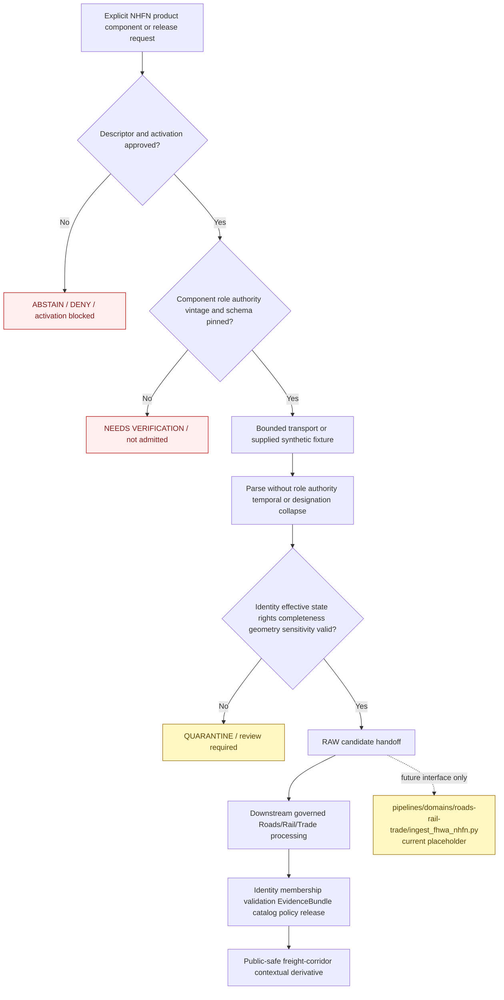

<!-- [KFM_META_BLOCK_V2]
doc_id: kfm://doc/connectors-fhwa-nhfn-readme
title: connectors/fhwa_nhfn/ — FHWA NHFN Connector Lane
type: readme
version: v0.2
status: draft
owners: OWNER_TBD — Connector steward · FHWA/NHFN source steward · Roads/Rail/Trade steward · Freight steward · Transport-network steward · Rights reviewer · Privacy/sensitivity reviewer · Security reviewer · Validation steward · Docs steward
created: 2026-06-18
updated: 2026-07-11
policy_label: public-context; source-admission; greenfield; no-network-default; designation-vintage-aware; component-role-preserving; sensitive-joins-fail-closed; raw-or-quarantine-only; no-navigation; no-freight-flow-inference; no-publication
proposed_path: connectors/fhwa_nhfn/README.md
truth_posture: CONFIRMED README-only connector lane / implementation ABSENT / SourceDescriptor ABSENT or UNPROVED / component-role decomposition UNRESOLVED / source NOT ACTIVATED / downstream pipeline PLACEHOLDER / tests and CI ABSENT or UNKNOWN
related:
  - ../README.md
  - ../fhwa_hpms/README.md
  - ../../docs/sources/catalog/usdot/README.md
  - ../../docs/sources/catalog/usdot/fhwa-nhfn.md
  - ../../docs/sources/catalog/usdot/fhwa-hpms.md
  - ../../docs/domains/roads-rail-trade/README.md
  - ../../docs/domains/roads-rail-trade/SOURCES.md
  - ../../docs/domains/roads-rail-trade/SOURCE_FAMILIES.md
  - ../../docs/domains/roads-rail-trade/SOURCE_REGISTRY.md
  - ../../docs/domains/roads-rail-trade/DATA_LIFECYCLE.md
  - ../../data/registry/roads-rail-trade/sources/README.md
  - ../../data/registry/sources/README.md
  - ../../data/raw/roads-rail-trade/README.md
  - ../../data/quarantine/roads-rail-trade/
  - ../../pipelines/domains/roads-rail-trade/ingest_fhwa_nhfn.py
  - ../../fixtures/
  - ../../schemas/contracts/v1/source/
  - ../../policy/domains/roads-rail-trade/
  - ../../policy/sensitivity/
  - ../../policy/rights/
  - ../../release/
tags: [kfm, connectors, fhwa, nhfn, usdot, freight, roads-rail-trade, designation, regulatory, administrative, phfs, crfc, cufc, source-vintage, route-membership, source-admission, raw, quarantine, governance]
notes:
  - "Repository inspection confirms that connectors/fhwa_nhfn/ contains this README only; no package metadata, Python module, client, parser, fixture, test, SourceDescriptor, activation record, or passing CI evidence is proved."
  - "The only directly named downstream NHFN pipeline file is an eight-line PROPOSED placeholder docstring; it is not executable ingestion evidence."
  - "NHFN is designation evidence, not observed freight flow, modeled commodity movement, current route condition, restriction, incident, facility, navigation, or safety evidence."
  - "Product documentation distinguishes PHFS and statutory other-Interstate components as regulatory from CRFC and CUFC components as administrative; role authority and component authorship must remain explicit."
  - "Naming and topology drift remain unresolved: fhwa_nhfn versus fhwa-nhfn RAW-lane spelling, and domain-first versus subtype-first source-registry paths."
  - "Current access surface, endpoint, designation cycle, component list, statutory/state submission basis, schema version, geometry support, rights text, attribution, and redistribution posture remain NEEDS VERIFICATION."
[/KFM_META_BLOCK_V2] -->

<a id="top"></a>

# FHWA NHFN Connector Lane

> Evidence-grounded boundary for future FHWA National Highway Freight Network source-admission code. The current directory is documentation-only. It does **not** provide an importable connector, live NHFN access, an activated source, executable tests, RAW captures, downstream ingestion, route membership, graph projection, or publication capability.

<p>
  
  
  
  
  
  
  
</p>

`connectors/fhwa_nhfn/`

> [!IMPORTANT]
> **Confirmed state:** this directory contains this README only. No `pyproject.toml`, `src/`, importable package, endpoint configuration, SourceDescriptor, activation decision, client, downloader, parser, validator, handoff builder, fixture set, test suite, or passing CI evidence is confirmed. The named downstream pipeline file is a placeholder docstring, not working ingestion logic. Treat every implementation structure, command, field list, endpoint, component inventory, and outcome below as a future contract or proposal—not current behavior.

**Quick jumps:** [Purpose](#purpose) · [Verified repository state](#verified-repository-state) · [Evidence ledger](#evidence-ledger) · [Connector authority boundary](#connector-authority-boundary) · [Blocking drift](#blocking-drift) · [Source identity and component roles](#source-identity-and-component-roles) · [What NHFN may and may not support](#what-nhfn-may-and-may-not-support) · [Access-surface and product classification](#access-surface-and-product-classification) · [Input contract](#input-contract) · [Metadata preservation](#metadata-preservation) · [Temporal and designation-vintage handling](#temporal-and-designation-vintage-handling) · [Geometry route-membership and graph handling](#geometry-route-membership-and-graph-handling) · [Rights privacy and sensitive joins](#rights-privacy-and-sensitive-joins) · [Finite outcomes](#finite-outcomes) · [Lifecycle boundary](#lifecycle-boundary) · [Proposed implementation shape](#proposed-implementation-shape) · [Testing relationship](#testing-relationship) · [Pipeline and downstream separation](#pipeline-and-downstream-separation) · [Implementation sequence](#implementation-sequence) · [Activation gates](#activation-gates) · [Review and rollback](#review-and-rollback) · [Definition of done](#definition-of-done) · [Verification backlog](#verification-backlog)

---

## Purpose

`connectors/fhwa_nhfn/` is the reserved source-specific connector lane for FHWA NHFN admission behavior.

When implementation exists, connector code may:

- validate explicit, side-effect-free connector configuration;
- consume an accepted SourceDescriptor reference and activation decision supplied by governed callers;
- identify one specifically approved NHFN release, component, archive, service, extract, or metadata surface;
- retrieve approved source material through bounded, replaceable transport;
- parse synthetic fixtures or approved NHFN-shaped payloads without upgrading designation records to freight-flow or road-network truth;
- preserve provider, product, component, designation authority, source role, source vintage, record, temporal, spatial, rights, sensitivity, retrieval, and digest metadata;
- distinguish federally or statutorily designated components from state- or MPO-designated components;
- detect missing designation vintage, incomplete capture, unstable identity, component/role mismatch, schema drift, unknown field meaning, projection uncertainty, rights uncertainty, or sensitive-join risk;
- return finite error, abstention, activation-blocked, drift, review, RAW-candidate, or QUARANTINE-candidate results;
- remain deterministic and testable with no network, no account, and no credentials.

This lane must never become observed freight-flow truth, commodity-volume truth, canonical road-network truth, live traffic or closure authority, navigation or routing authority, legal-access authority, roadway-safety guidance, ownership/title authority, funding or eligibility authority, source-registry authority, schema authority, policy authority, proof authority, release authority, or a public-data surface.

[Back to top ↑](#top)

---

## Verified repository state

The following relationship is confirmed on the repository's `main` branch at the time of this update:

```text
connectors/
└── fhwa_nhfn/
    └── README.md                         # this connector contract

pipelines/
└── domains/
    └── roads-rail-trade/
        └── ingest_fhwa_nhfn.py           # PROPOSED placeholder docstring only
```

Related documentation and lifecycle surfaces exist elsewhere:

```text
docs/sources/catalog/usdot/fhwa-nhfn.md
docs/domains/roads-rail-trade/SOURCES.md
docs/domains/roads-rail-trade/SOURCE_FAMILIES.md
data/registry/roads-rail-trade/sources/README.md
data/raw/roads-rail-trade/README.md
```

### Current maturity

| Surface | Confirmed content | Maturity |
|---|---|---:|
| `connectors/fhwa_nhfn/README.md` | This source-admission contract. | **DOCUMENTED** |
| Other files below `connectors/fhwa_nhfn/` | None found in current repository search. | **ABSENT / NEEDS CONTINUOUS VERIFICATION** |
| Package metadata | None confirmed. | **ABSENT** |
| Importable connector namespace | None confirmed. | **ABSENT / UNPROVED** |
| NHFN transport/client | None confirmed. | **ABSENT** |
| Parser/validator/handoff code | None confirmed. | **ABSENT** |
| Connector-local fixtures or tests | None confirmed. | **ABSENT** |
| Accepted NHFN SourceDescriptor | None found or verified in this update. | **ABSENT / NEEDS VERIFICATION** |
| Component role decomposition | Documented as regulatory versus administrative, but no accepted descriptor contract exists. | **PROPOSED / BLOCKED** |
| Live source access | No approved endpoint or access surface confirmed. | **NOT ACTIVATED** |
| `pipelines/domains/roads-rail-trade/ingest_fhwa_nhfn.py` | Eight-line placeholder docstring. | **PLACEHOLDER / NON-EXECUTABLE** |
| NHFN RAW child lane | Parent RAW README says no child source-family READMEs were confirmed. | **ABSENT / PROPOSED** |
| Connector-specific CI evidence | None confirmed. | **UNKNOWN** |

> [!CAUTION]
> A connector-shaped directory, a source catalog page, and a pipeline-shaped placeholder do not constitute an implementation. Do not describe the NHFN connector as installable, importable, runnable, activated, tested, rights-cleared, schema-pinned, current, or production-ready until repository artifacts and reviewable execution evidence support those claims.

[Back to top ↑](#top)

---

## Evidence ledger

| Evidence | Status | What it supports | What it does not support |
|---|---:|---|---|
| `connectors/fhwa_nhfn/README.md` | **CONFIRMED** | The connector lane and its boundary exist. | Executable connector behavior. |
| Current repository search for `connectors/fhwa_nhfn/` | **CONFIRMED for inspected state** | Only this README was found under the connector path. | Permanent absence or unindexed future files. |
| `docs/sources/catalog/usdot/fhwa-nhfn.md` | **CONFIRMED draft source profile** | Proposed source ID, component distinctions, designation roles, temporal handling, geometry, rights, and lifecycle expectations are documented. | Current endpoint, current designation list, cadence, schema version, rights text, activation, or implementation. |
| `docs/domains/roads-rail-trade/SOURCES.md` | **CONFIRMED draft source ledger** | NHFN is listed as regulatory/administrative designation context and cannot prove observed freight activity. | Final descriptor decomposition or runtime enforcement. |
| `docs/domains/roads-rail-trade/SOURCE_FAMILIES.md` | **CONFIRMED deep reference** | Designation-versus-flow anti-collapse is explicit and source terms remain verification-gated. | Activated source or passing validation. |
| `data/registry/roads-rail-trade/sources/README.md` | **CONFIRMED registry documentation** | A domain-first registry lane exists and records source identity, role, rights, cadence, activation, and caveats. | A completed NHFN descriptor or settled registry topology. |
| `data/raw/roads-rail-trade/README.md` | **CONFIRMED RAW documentation** | RAW is no-public-path, source-role-preserving, and currently has no confirmed child source-family README. | An NHFN capture, receipt, or accepted child-folder spelling. |
| `pipelines/domains/roads-rail-trade/ingest_fhwa_nhfn.py` | **CONFIRMED placeholder** | A future downstream ingest responsibility has been named. | Executable parsing, validation, route membership, graph projection, or lifecycle transition. |
| Connector tests and CI | **ABSENT / UNKNOWN** | Test requirements can be documented here. | Passing behavior or enforcement. |

[Back to top ↑](#top)

---

## Connector authority boundary

```text
THIS CONNECTOR MAY EVENTUALLY:
  validate explicit configuration
  verify descriptor and activation preconditions
  identify one approved NHFN release, component, or surface
  perform bounded source retrieval
  parse supplied NHFN-shaped records or archives
  preserve product, component, authority, role, vintage, field, and geometry metadata
  detect incomplete capture, schema drift, unstable keys, projection uncertainty, and sensitive-join risk
  return finite connector outcomes
  prepare RAW-or-QUARANTINE handoff candidates

THIS CONNECTOR MUST NOT:
  assign canonical SourceDescriptor values by itself
  infer role or authority from provider name, component label, filename, or URL
  collapse PHFS, other Interstate, CRFC, and CUFC authorship into one undifferentiated role
  treat NHFN designation as observed freight flow, freight volume, incident, facility, or restriction evidence
  conflate NHFN geometry with canonical KFM road geometry
  merge or snap NHFN records into canonical segments at the connector edge
  claim current traffic, closure, congestion, passability, safety, legal access, ownership, or enforcement
  provide navigation, routing, dispatch, funding, eligibility, or emergency instructions
  define policy, rights, sensitivity, schemas, proof, catalog, or release decisions
  write directly to WORK, PROCESSED, CATALOG, TRIPLET, PROOF, RECEIPT, RELEASE, or PUBLISHED authority roots
  serve public APIs, maps, tiles, graphs, reports, stories, search payloads, or generated answers
```

The connector preserves what a specifically admitted NHFN component says, who designated it, when that designation applied, and the scope under which it was issued. It does not decide that the material is observed, canonical, operational, legally controlling for a site, safe for routing, or eligible for public release.

[Back to top ↑](#top)

---

## Blocking drift

The connector cannot be implemented safely until these gaps are resolved or represented as explicit fail-closed conditions.

| Blocker | Current state | Required resolution |
|---|---|---|
| Connector implementation | README-only directory. | Select an implementation and packaging convention; add code only with tests and ownership. |
| Source identity | `fhwa_nhfn` is a proposed source-ID hint, not a verified admitted identifier. | Approve a canonical source/product ID in the accepted registry. |
| Component-role model | Product docs distinguish regulatory PHFS/other-Interstate from administrative CRFC/CUFC, but descriptor decomposition is unsettled. | Select per-component descriptors or a binding feature-level component/role/authority contract. |
| Role authority | FHWA, statute, state DOT, and MPO authority may differ by component. | Require explicit `role_authority` and source-lineage fields for every admitted record. |
| Registry topology | Domain-first `data/registry/roads-rail-trade/sources/` and subtype-first `data/registry/sources/roads-rail-trade/` patterns both appear in documentation. | Choose one canonical descriptor home or governed compatibility/migration plan. |
| RAW child naming | Source docs use `fhwa_nhfn`; RAW README gives `fhwa-nhfn` as a possible future folder. | Accept one handoff identifier or explicitly governed alias contract. |
| Access surface | Current endpoint, service, download, archive, state submission, or export form is unverified. | Pin approved federal and state/MPO product surfaces; prohibit provider-wide or guessed access. |
| Designation inventory | Current PHFS, other-Interstate, CRFC, CUFC, designation cycle, and supersession state are unverified. | Pin a release/designation fingerprint and change policy. |
| Schema and component fields | Current field inventory, code lists, component names, source keys, authority fields, and schema version are unverified. | Pin a data dictionary or schema fingerprint with drift tests. |
| Stable identity | Deterministic source segment/designation keys are not selected. | Define source keys or documented composite keys before incremental updates or deduplication. |
| Rights and terms | Current terms, attribution, redistribution, and caveats are unverified. | Complete source-specific federal and state/MPO rights snapshots before activation or public-safe derivatives. |
| Sensitive joins | Facility, operator, carrier, commodity-flow, critical-infrastructure, Indigenous-corridor, parcel, and operational joins are not governed here. | Adopt fail-closed policy and negative tests before any such join can leave quarantine. |
| Handoff contract | No binding connector-result or RAW/QUARANTINE envelope is confirmed. | Select contract, schema, validation, routing, and finite error semantics. |
| Downstream pipeline | Named pipeline file is a placeholder docstring only. | Implement separately after connector handoff contracts exist; do not treat the placeholder as a working consumer. |
| Fixtures and tests | None confirmed. | Add synthetic no-network fixtures and executable behavior tests. |
| CI | No passing connector-specific run is confirmed. | Prove a clean local no-network command before claiming CI enforcement. |

Do not hide these gaps with guessed endpoint URLs, permissive role defaults, invented component schemas, assumed redesignation dates, broad FHWA activation, or examples presented as operational configuration.

[Back to top ↑](#top)

---

## Source identity and component roles

The current working provider/product identity is:

```text
provider: FHWA / USDOT
product family: National Highway Freight Network (NHFN)
proposed KFM source ID: fhwa_nhfn
connector path: connectors/fhwa_nhfn/
```

Only the connector path is confirmed. The source ID and every operational identity field remain subject to registry approval.

### Component-level role requirement

Repository source documentation currently describes the component posture as follows, pending current-source and descriptor verification:

| Component | Designating authority | Proposed source role | Connector requirement |
|---|---|---|---|
| Primary Highway Freight System (PHFS) | FHWA | `regulatory` | Preserve federal designation authority, component identity, effective state, and source lineage. |
| Other Interstate portions included in NHFN | Statutory/federal basis | `regulatory` | Preserve the statutory/federal inclusion basis separately from PHFS where the source distinguishes it. |
| Critical Rural Freight Corridors (CRFC) | State DOT | `administrative` | Preserve state designation authority, submission/designation evidence, component identity, and effective state. |
| Critical Urban Freight Corridors (CUFC) | State DOT and/or MPO | `administrative` | Preserve state/MPO authority and do not relabel the designation as an FHWA observation. |

Until an admitted descriptor or binding feature-level contract resolves the model:

- do not assign one undifferentiated source role to every NHFN record;
- do not omit the component or designation authority;
- do not treat federal hosting or aggregation as proof that a state/MPO designation became FHWA-authored;
- do not upgrade an administrative designation to regulatory merely because it participates in the federal network;
- do not upgrade any designation to `observed` because the designated corridor has traffic;
- require separate descriptors or product keys when components materially differ in authority, cadence, rights, schema, or provenance;
- reject component/role/authority mismatches;
- preserve corrections, redesignations, additions, removals, and supersession as new source states rather than silent edits.

A role or authority correction must produce a reviewed descriptor or correction record. Connector parsing must not silently change either during normalization.

[Back to top ↑](#top)

---

## What NHFN may and may not support

Subject to component-specific admission, NHFN material may support downstream contextual claims about:

- inclusion in a specifically identified NHFN component;
- the authority that designated or included a corridor;
- federal, state, or MPO freight-corridor designation context;
- component-typed route membership candidates;
- designation source vintage, effective interval, and supersession lineage;
- source-carried segment, route, corridor, state, county, jurisdiction, or component attributes;
- source-carried geometry or linear-reference context;
- comparisons across designation vintages only when identity, schema, geometry, authority, and methodology remain compatible;
- downstream freight-corridor context views after governed identity, validation, evidence, policy, and release.

NHFN does not by itself prove:

- observed freight flow, truck counts, commodity volume, origin/destination movement, or modeled flow;
- current traffic, closure, detour, congestion, passability, restriction, incident, or emergency status;
- canonical KFM road-segment identity or topology;
- that source-carried geometry is the authoritative roadway centerline;
- legal access, ownership, title, route safety, enforcement, or operational suitability;
- a facility, terminal, port, carrier, operator, shipment, commodity, or security condition;
- project funding eligibility, grant eligibility, regulatory compliance, or policy conclusions;
- that a prior designation remains effective today without current designation and supersession evidence;
- that a routable graph edge is source truth or safe navigation guidance;
- that a corridor coincides exactly with HPMS, TIGER/Line, OSM, KDOT, parcel, bridge, facility, or historic-route geometry.

[Back to top ↑](#top)

---

## Access-surface and product classification

Every source input must be classified before retrieval or parsing. The exact current NHFN access surfaces remain unverified.

| Surface class | Allowed future use | Prohibited use |
|---|---|---|
| Official federal designation release or archive | Immutable source capture after descriptor and activation gates. | Silent overwrite, unversioned extraction, or implicit publication. |
| State/MPO CRFC or CUFC submission/designation source | Component-specific administrative evidence after identity and authority review. | Treating state/MPO authorship as FHWA-authored observation or universal federal regulatory action. |
| Tabular or feature product | Parsing and source-admission validation under a pinned data dictionary. | Assuming all records share one role, authority, effective date, or spatial precision. |
| Data dictionary, technical guide, statutory/designation metadata | Field, component, authority, effective-state, key, geometry, and drift evidence. | Source activation by itself. |
| Service or API surface | Bounded retrieval only after endpoint, limits, completeness, and terms review. | Guessed URLs, provider-wide crawling, or unbounded pagination. |
| Visualization or rendered product | Human reference where accurately labeled. | Feature extraction, canonical geometry, designation reconstruction, or analytic replacement for governed source data. |
| Downstream tiles, graphs, route memberships, or summaries | Released presentation or derived analysis only after validation, evidence, policy, and release. | Evidence substitution, source-authority replacement, or direct connector output. |

A shared FHWA provider does not create umbrella admission across NHFN, HPMS, bridge products, freight-flow products, safety products, or other USDOT surfaces.

[Back to top ↑](#top)

---

## Input contract

Future live or fixture-backed operations should require explicit inputs, subject to the accepted connector contract:

- canonical SourceDescriptor reference;
- SourceActivationDecision or accepted equivalent;
- provider and exact NHFN product/release/component key;
- approved federal, state, or MPO source surface, archive, service, table, submission, or export identity;
- source vintage, designation cycle, publication date, submission date, or effective-state scope;
- exact component classification such as PHFS, other Interstate, CRFC, CUFC, or another pinned category;
- explicit source role and role authority;
- current rights and terms snapshot reference;
- schema/data-dictionary identity or fingerprint;
- validated request, geography, state, route, component, table, or release scope;
- timeout, retry, size, pagination, archive, and checksum limits where applicable;
- intended domain route;
- lifecycle target of RAW or QUARANTINE only;
- synthetic no-network fixture or approved source payload supplied through an explicit interface.

Required behavior:

- reject missing or ambiguous product, component, authority, or release identity;
- reject missing descriptor or activation evidence for live behavior;
- reject unknown or non-admitted releases/components;
- reject component/role/authority mismatches;
- never route by URL substring, filename, layer name, or provider name alone;
- never activate every FHWA product through one provider-wide switch;
- never treat a combined NHFN product as permission to erase component provenance;
- keep fixture configuration unable to fall through to live transport;
- document no endpoint, environment-variable name, credential convention, marker, or live command as accepted until implementation and security review establish it.

[Back to top ↑](#top)

---

## Metadata preservation

Every non-error candidate should preserve, where applicable and confirmed by the admitted component/product:

### Cross-product minimum

- canonical KFM source identifier;
- FHWA/USDOT provider and exact NHFN product/release identity;
- exact NHFN component;
- source role and role authority;
- designation authority, submission authority, and source-publication authority where they differ;
- stable source segment, route, corridor, designation, or composite identity;
- source URI, archive, service, table, file, layer, submission, or query identity;
- designation cycle, source-vintage label, publication date, submission date, and effective state;
- source, designation, valid, retrieval, release, update, supersession, and correction time meanings without collapse;
- schema/data-dictionary identity and field fingerprint;
- connector and parser version;
- rights, attribution, privacy, sensitivity, and review state;
- checksum or digest;
- intended domain route;
- intended lifecycle target of RAW or QUARANTINE only;
- drift, stale, incomplete, quarantine, and review flags.

### Record and designation semantics

Where present and verified, preserve:

- component code and source-issued component name;
- designation basis, authority, submission reference, statutory/federal reference, or state/MPO action reference;
- route, segment, corridor, state, county, urban/rural, jurisdiction, and membership identifiers;
- exact source field names and code values before downstream recoding;
- field definitions, units, null/unknown/not-applicable semantics, code lists, and data-quality flags;
- addition, removal, redesignation, supersession, amendment, and correction lineage;
- row counts, unique-key counts, duplicate counts, rejected-row counts, archive members, and completeness evidence;
- source-carried caveats, mileage-limit context, or review indicators when present and verified.

### Spatial and route-reference minimum

Where present and verified, preserve:

- geometry type and source geometry;
- CRS and horizontal datum;
- source route key, segment key, linear-reference system, begin/end measures, direction, and measure units;
- spatial resolution, scale, positional-accuracy, or support metadata;
- geometry fingerprint and source-identity relationship;
- clipping, reprojection, repair, simplification, conflation, and graph-projection status;
- geometry and attribute checksums or fingerprints.

Source-issued values must remain inspectable. Simplified, crosswalked, conflated, graph-projected, or derived values may be added downstream only when originals and transformation evidence remain available.

[Back to top ↑](#top)

---

## Temporal and designation-vintage handling

NHFN is designation-vintage sensitive. A prior designation must never be presented as current by convenience.

Keep these time meanings distinct when material:

| Time kind | Connector meaning | Guardrail |
|---|---|---|
| Source/designation time | Federal publication, statutory inclusion basis, state submission, or MPO/state designation date. | Preserve the authority and component to which it applies. |
| Observation time | Generally absent for designation records. | Do not populate merely because traffic occurs on the corridor. |
| Valid/effective time | Period during which the source asserts the designation is in effect. | Required for current or historical membership claims. |
| Source publication/update time | When the issuing source published or revised the product. | Preserve separately from effective time. |
| Retrieval time | When KFM captured the source material. | Required for provenance and stale-state review. |
| Downstream release time | When a governed KFM derivative was released. | Outside connector authority. |
| Correction/supersession time | When a prior source or KFM artifact was corrected, replaced, or withdrawn. | Requires new capture and lineage; no silent overwrite. |

Required designation-vintage behavior:

- never overwrite a prior capture silently;
- bind each capture to product/release identity, component inventory, designation cycle, schema fingerprint, scope, and checksum;
- treat redesignations, state/MPO additions or removals, corrections, and revised geometries as new source states with explicit lineage;
- block “current NHFN” or “currently designated” language when effective-state, supersession, source-publication, or retrieval evidence is absent;
- preserve historic valid intervals for time-aware queries;
- do not compare vintages when component definitions, role authorities, field meanings, geometry support, stable keys, or designation methods are incompatible without a reviewed method;
- emit drift or review outcomes when a release changes component names, field types, code lists, authority fields, geometry support, or identity rules.

[Back to top ↑](#top)

---

## Geometry route-membership and graph handling

NHFN geometry and route identifiers are designation evidence, not canonical KFM network topology or routing authority.

Minimum posture:

1. Record the upstream CRS and datum from source metadata; do not infer them from coordinate appearance.
2. Preserve geometry, route identifiers, segment identifiers, linear-reference information, measures, units, direction, and source support metadata where supplied.
3. Distinguish source-carried geometry, reference-only route identifiers, linear-referenced sections, generalized geometry, downstream conflated geometry, and graph projections.
4. Do not snap, merge, split, conflate, or assign canonical KFM road-segment identity inside the connector unless a binding pre-admission contract explicitly requires a bounded transform with evidence.
5. Treat NHFN membership as a source-attributed designation relation candidate, not as authorship of the underlying road geometry.
6. Route empty, truncated, invalid, unsupported, or ambiguous geometry to review or quarantine.
7. Record every reprojection, measure conversion, repair, clipping, generalization, or simplification as transformation evidence downstream.
8. Do not infer freight volume, legal access, ownership, current passability, route safety, restriction status, or navigation suitability from designation geometry.
9. Keep NHFN-to-HPMS, NHFN-to-TIGER, NHFN-to-OSM, NHFN-to-KDOT, NHFN-to-parcel, NHFN-to-facility, and NHFN-to-historic-corridor matching in governed downstream pipelines with confidence, ambiguity, review, correction, and rollback support.
10. Treat every routable graph edge as a derived candidate that resolves back to source records and downstream evidence; it is not source truth or public navigation authority.

[Back to top ↑](#top)

---

## Rights privacy and sensitive joins

Public-source availability does not create a blanket public-safe or join-safe decision.

Minimum posture:

1. Verify current federal, state, and MPO rights, attribution, redistribution, and source terms before activation.
2. Keep rights separate from sensitivity; a reusable public designation may still become unsafe after a high-precision join.
3. Treat facility, port, terminal, operator, carrier, commodity, shipment, critical-infrastructure, utility, parcel, property, person, vulnerability, and access-control joins as review-gated.
4. Do not infer facility criticality, carrier activity, commodity movement, security posture, legal access, or operational vulnerability from NHFN context alone.
5. Preserve source geography and precision so downstream policy can generalize, restrict, or deny appropriately.
6. Minimize logs and fixtures; do not commit real sensitive facility, operator, shipment, parcel, person, security, or operational rows merely to test parsing.
7. Review cross-domain joins even when each source is low-risk in isolation.
8. Require explicit review for overlaps with Indigenous trade or mobility corridors when domain doctrine calls for steward involvement.
9. Route unresolved rights, attribution, precision, sensitivity, cultural-context, or joining risk to restriction, quarantine, abstention, or denial.
10. Keep generated maps, graphs, summaries, vector indexes, and AI text downstream; they cannot override source role, designation authority, effective state, or release gates.

[Back to top ↑](#top)

---

## Finite outcomes

Future connector APIs and tests should require a small documented set of deterministic outcomes rather than ambiguous partial success.

| Condition | Required safe behavior |
|---|---|
| Connector package absent or not installed | Fail clearly; do not report connector validation success. |
| SourceDescriptor missing | Refuse live activation with an actionable error. |
| Activation decision missing | `ABSTAIN` or activation-blocked result. |
| Source identity, product key, component, or authority ambiguous | Validation failure or `NEEDS_VERIFICATION`. |
| Product/release/component not admitted | Product/component-not-admitted result. |
| Component role or authority unresolved | Review/activation block; do not choose a permissive default. |
| Component/role/authority mismatch | Validation failure. |
| Network disabled | Fixture/parser paths remain usable; live request returns bounded disabled outcome. |
| Unauthorized or forbidden | Finite redacted error; no credential leakage. |
| Timeout or rate limit | Bounded error; no infinite retry. |
| Unexpected redirect, host, content type, encoding, or archive format | Validation failure or quarantine. |
| Empty response | `ABSTAIN` unless the approved product contract defines empty as valid. |
| Malformed response | Finite parser error with safe source metadata. |
| Archive incomplete or checksum mismatch | Incomplete-capture quarantine. |
| Schema, component, authority, code-list, or type drift | Reviewable drift result; no silent field loss. |
| Stable identity absent or changed | Block deterministic update and deduplication. |
| Designation cycle, source publication, or effective state missing | Quarantine or abstention. |
| CRS, datum, linear reference, or units unresolved | Quarantine; block conflation and precision claims. |
| Regulatory component emitted as observed flow | Hard source-role anti-collapse failure. |
| Administrative component silently upgraded to regulatory | Hard authority/role failure. |
| Designation emitted as freight volume, incident, facility, or restriction truth | Hard semantic-boundary failure. |
| Historic designation emitted as current without evidence | Hard temporal-boundary failure. |
| Sensitive join requested without policy support | Restrict, quarantine, or deny. |
| Runtime attempts to use downstream placeholder as proof of ingestion | Validation failure. |
| Direct downstream or public write attempted | Hard failure. |
| Navigation, safety, access, ownership, flow, funding, eligibility, legal, enforcement, or policy determination requested | Refuse and direct callers to official or governed channels. |

Errors must be deterministic, actionable, finite, safe to log, and free of secrets or unnecessary source-payload content.

[Back to top ↑](#top)

---

## Lifecycle boundary

The connector participates only at the source-admission edge.



The diagram defines responsibility boundaries. It does not prove package import, source access, parsing, handoff, RAW storage, pipeline execution, route membership, graph projection, evidence closure, or release.

KFM lifecycle discipline remains:

```text
RAW -> WORK / QUARANTINE -> PROCESSED -> CATALOG / TRIPLET -> PUBLISHED
```

The connector may construct a RAW/QUARANTINE handoff candidate only after a binding contract exists. It must not independently create canonical road identity, route membership truth, routable graph authority, freight-flow evidence, promotion, catalog, proof, release, or publication artifacts.

[Back to top ↑](#top)

---

## Proposed implementation shape

No implementation layout is accepted. A coherent future package might look like:

```text
connectors/fhwa_nhfn/
├── README.md
├── pyproject.toml
├── src/
│   └── fhwa_nhfn/
│       ├── __init__.py
│       ├── config.py
│       ├── dispatch.py
│       ├── transport.py
│       ├── components.py
│       ├── parse.py
│       ├── validate.py
│       ├── handoff.py
│       └── errors.py
└── tests/
    ├── README.md
    ├── fixtures/
    ├── test_import_safety.py
    ├── test_configuration.py
    ├── test_activation_preconditions.py
    ├── test_component_dispatch.py
    ├── test_transport.py
    ├── test_component_roles.py
    ├── test_designation_vintage.py
    ├── test_geometry_and_membership.py
    ├── test_sensitive_joins.py
    ├── test_handoff_boundaries.py
    └── test_errors_and_drift.py
```

This tree is **PROPOSED**, not implementation evidence. Do not create it mechanically. Each module must correspond to implemented responsibility, a selected contract, an owner, synthetic fixtures, and executable tests.

Potential responsibility split:

| Future module | Responsibility | Boundary |
|---|---|---|
| `config.py` | Side-effect-free validated configuration and safe defaults. | No self-activation or provider-wide enable switch. |
| `dispatch.py` | Closed product/release/component routing. | No URL/filename routing or role inference. |
| `transport.py` | Bounded replaceable service/archive/download transport. | No parsing policy, graph projection, or hidden credential acquisition. |
| `components.py` | Pinned component classifications, expected role authority, and metadata expectations. | Not SourceDescriptor authority. |
| `parse.py` | Deterministic source-shaped parsing with exact field/value preservation. | No freight-flow inference or canonical road-network creation. |
| `validate.py` | Connector-local identity, component, authority, vintage, completeness, geometry, and drift checks. | Not domain, legal, funding, or release authority. |
| `handoff.py` | Finite connector results and RAW/QUARANTINE candidates. | No direct downstream promotion or route-membership publication. |
| `errors.py` | Small deterministic redacted error taxonomy. | No secrets or unbounded payload excerpts. |

Before any package is called importable, it must declare a build backend, package discovery, supported Python version, dependencies, version policy, and a narrow side-effect-free import surface.

[Back to top ↑](#top)

---

## Testing relationship

No connector-local test directory or executable test is currently confirmed.

Future tests should prove:

- clean import with no network, secret read, filesystem write, logging setup, environment mutation, cache initialization, registry mutation, or source activation;
- no-network default transport behavior;
- explicit descriptor and activation requirements;
- closed product/release/component dispatch;
- PHFS and other-Interstate regulatory semantics remain distinct from CRFC/CUFC administrative semantics;
- role authority is required and preserved;
- no designation record becomes observed freight-flow, freight-volume, incident, facility, or restriction evidence;
- designation time, valid time, publication/update time, retrieval time, supersession time, and correction time remain distinct;
- schema/data-dictionary and component drift produces reviewable outcomes;
- stable-key, duplicate, count, archive-member, and checksum failures close safely;
- source field names, code values, null semantics, authority fields, and quality flags are preserved;
- CRS, datum, linear-reference, measure, geometry, and support uncertainty route safely;
- NHFN geometry cannot become canonical road identity or routable graph authority at the connector edge;
- historic records cannot become current designation, traffic, navigation, safety, access, ownership, or enforcement claims without current evidence;
- facility, operator, carrier, commodity, infrastructure, Indigenous-corridor, parcel, person, and high-precision join risks route to review, restriction, quarantine, or denial;
- only finite connector results and RAW/QUARANTINE candidates are accepted;
- all direct WORK, PROCESSED, CATALOG, TRIPLET, PROOF, RECEIPT, RELEASE, PUBLISHED, map, graph, routing, search, report, story, or generated-answer writes fail.

Fixtures must be synthetic, minimized, no-network, and free of real facility-security, operator, carrier, shipment, commodity, parcel, person, credential, Indigenous-sensitive, or critical-infrastructure data unless separately governed approval exists.

Minimum synthetic cases should include:

- valid PHFS designation with `regulatory` role and FHWA authority;
- valid CRFC designation with `administrative` role and state-DOT authority;
- valid CUFC designation with administrative role and state/MPO authority;
- component missing;
- role authority missing;
- regulatory component emitted as observed flow;
- administrative component silently upgraded to regulatory;
- source role or authority mismatch;
- missing designation cycle, effective date, or release identity;
- superseded designation presented as current;
- changed component name, field type, authority field, or code list;
- missing or changed stable key;
- duplicate records or count mismatch;
- incomplete archive or checksum mismatch;
- missing CRS/datum/linear-reference units;
- invalid or unsupported geometry;
- source geometry presented as canonical road identity;
- designation presented as freight volume, restriction, incident, or facility truth;
- sensitive join request without policy support;
- downstream placeholder cited as ingestion proof;
- direct downstream-write attempt.

No test runner, dependency, local command, live-test flag, marker, endpoint constant, credential mode, fixture convention, or passing status is accepted by this README. A future command such as `python -m pytest connectors/fhwa_nhfn/tests` remains **PROPOSED** until packaging and tests exist and the repository-standard runner is verified.

[Back to top ↑](#top)

---

## Pipeline and downstream separation

Source access, source admission, domain processing, identity/conflation, route membership, graph projection, policy, evidence, and release are separate responsibilities.

| Surface | Responsibility | Must not do |
|---|---|---|
| `connectors/fhwa_nhfn/` | Approved NHFN source access, parsing, connector-local validation, finite outcomes, and RAW/QUARANTINE handoff candidates. | Build canonical road truth, freight-flow truth, publish, or own domain normalization. |
| `pipelines/domains/roads-rail-trade/ingest_fhwa_nhfn.py` | Future downstream ingest/normalization after admission. | Act as SourceDescriptor authority or bypass RAW/QUARANTINE; currently it is only a placeholder. |
| Roads/Rail/Trade identity/network packages | Downstream deterministic road identity, designation membership, conflation, topology, and graph candidates under contracts. | Rewrite source evidence invisibly or claim legal/navigation authority. |
| Freight-flow and incident sources/pipelines | Observed or modeled freight movement and event evidence under their own descriptors. | Inherit activation or role from NHFN adjacency. |
| Domain policies and validators | Decide admissibility, sensitive joins, stale state, transforms, route membership, graph exposure, and release prerequisites. | Fetch source material or infer role from convenience. |
| Evidence/catalog surfaces | Close provenance and projection requirements after validation. | Treat connector output as proof automatically. |
| Release surfaces | Approve public-safe derivatives, corrections, withdrawal, and rollback. | Treat RAW, connector, pipeline, membership, or graph output as released truth. |

A pipeline-shaped path is not proof of a working pipeline. A downstream route membership is not a source-role correction. A graph edge or conflated segment is not source truth, freight-flow evidence, or navigation authority.

[Back to top ↑](#top)

---

## Implementation sequence

Implement in dependency order:

1. **Resolve source and path identity**
   - accept canonical source/product ID;
   - reconcile `fhwa_nhfn` and `fhwa-nhfn` handoff spelling;
   - reconcile registry topology.
2. **Resolve component and authority model**
   - settle PHFS, other-Interstate, CRFC, and CUFC decomposition;
   - select per-component descriptors or binding feature-level role/authority fields;
   - require separate descriptors when authority, rights, cadence, or schema differ.
3. **Resolve packaging and contracts**
   - select implementation layout, build backend, package discovery, Python version, dependencies, and public imports;
   - select finite connector-result and RAW/QUARANTINE handoff contracts.
4. **Pin one source release for fixture-only work**
   - verify product identity, designation cycle, component inventory, data dictionary, schema fingerprint, stable keys, authority fields, geometry/linear reference, rights, and caveats;
   - create the smallest synthetic fixture set.
5. **Implement import safety, configuration, dispatch, and finite errors**
   - no-network defaults;
   - explicit product/release/component keys;
   - deterministic redacted outcomes.
6. **Implement one fixture-only parser slice**
   - preserve source fields, component, authority, role, vintage, keys, time, geometry, and metadata;
   - add executable tests before live transport.
7. **Add validated transport**
   - only after source access form, terms, limits, completeness, security, and retention are reviewed;
   - keep transport replaceable by test doubles.
8. **Add handoff integration**
   - only after RAW/QUARANTINE contract, child-lane naming, and domain routing are accepted;
   - reject direct downstream writes.
9. **Implement the downstream pipeline separately**
   - replace the placeholder only after connector output exists;
   - test identity, route membership, conflation, transformation, policy, graph projection, and rollback independently.
10. **Add additional components or source surfaces independently**
    - each receives identity, authority, role, rights, cadence, schema, fixtures, tests, and activation evidence.
11. **Add CI last**
    - prove a clean local no-network command first;
    - retain reviewable run evidence;
    - do not upgrade badges or maturity claims before evidence exists.

[Back to top ↑](#top)

---

## Activation gates

No live NHFN behavior should run until all applicable gates close:

- [ ] Canonical NHFN source/product identifier is accepted.
- [ ] Registry topology and SourceDescriptor home are accepted.
- [ ] Product/component-specific SourceDescriptor and activation decisions exist.
- [ ] PHFS, other-Interstate, CRFC, and CUFC role/authority behavior is resolved and anti-collapse tests exist.
- [ ] Current federal and state/MPO source surfaces, endpoint/archive/export identities, designation cycle, and release identity are verified.
- [ ] Current component inventory, schema/data dictionary, field meanings, code lists, authority fields, and stable keys are pinned or fingerprinted.
- [ ] Source terms, rights, attribution, and redistribution posture are reviewed for every admitted source surface.
- [ ] Privacy, precision, critical-infrastructure, facility, operator/carrier, commodity, Indigenous-corridor, parcel/person, and joining risks are reviewed.
- [ ] CRS, datum, geometry, linear-reference, measure, resolution, and transformation rules are defined where applicable.
- [ ] Effective-state, supersession, redesignation, stale-state, and currentness rules are defined.
- [ ] Completeness, counts, duplicates, archive members, checksums, retry, timeout, rate-limit, redirect, and size bounds are defined.
- [ ] RAW child-lane name, connector-result contract, handoff envelope, domain route, and alias behavior are accepted.
- [ ] Packaging and clean import behavior are verified from a clean environment.
- [ ] Synthetic no-network fixtures and executable tests pass.
- [ ] Secrets and configuration use approved handling.
- [ ] Connector, pipeline, identity/conflation, membership, graph, policy, evidence, catalog, and release responsibilities remain separate.
- [ ] Rollback, correction, supersession, stale-state, incomplete-run, cache invalidation, and payload cleanup procedures are documented.
- [ ] CI evidence is reviewable before any activation or maturity claim is upgraded.

Until then, this connector remains documentation-only and live access remains inactive.

[Back to top ↑](#top)

---

## Review and rollback

Review connector changes as source-role, designation-authority, temporal, spatial, privacy, packaging, freight, and transportation-safety-adjacent changes.

A reviewer should confirm:

- implementation claims match the repository tree and test evidence;
- SourceDescriptor and activation authority remain external;
- product/release/component identity and designation authority are explicit;
- PHFS/other-Interstate and CRFC/CUFC roles do not collapse;
- no designation record becomes observed or modeled freight-flow evidence;
- designation vintages are not presented as current without effective-state evidence;
- geometry and route identifiers are not silently promoted to canonical road topology or routable authority;
- stable-key, schema, component, authority, rights, privacy, precision, and sensitive-join failures close safely;
- connector output stops at finite results and RAW/QUARANTINE candidates;
- the downstream pipeline placeholder is not cited as implementation evidence;
- no public client consumes connector, RAW, WORK, or QUARANTINE material directly;
- no API or documentation suggests freight-flow, navigation, routing, safety, legal access, ownership, enforcement, funding, eligibility, facility-security, or policy authority.

Rollback is required if a change:

- claims implementation, activation, endpoint support, test coverage, or CI without evidence;
- adds import-time network, secret, filesystem, logging, environment, cache, registry, or activation behavior;
- hard-codes an unresolved component role or authority;
- silently upgrades administrative designation to regulatory or any designation to observed;
- enables broad provider-wide FHWA activation;
- weakens vintage, effective-state, stable-key, schema, geometry, rights, privacy, or sensitivity controls;
- conflates source geometry into canonical network identity without a governed downstream contract;
- emits designation records as freight flow, incident, restriction, facility, or current operational truth;
- writes directly beyond RAW/QUARANTINE handoff;
- exposes credentials, source payloads, operator/carrier, shipment, commodity, facility-security, parcel/person, Indigenous-sensitive, or critical-infrastructure data;
- emits public claims or determination-like output.

Rollback procedure:

1. Revert the unsafe or misleading connector change.
2. Restore the last verified no-network and no-secret posture.
3. Remove or quarantine unapproved payloads, caches, credentials, or sensitive rows and assess repository-history exposure.
4. Move legitimate pipeline, domain identity, route membership, conflation, graph, policy, lifecycle, evidence, catalog, or release work to its correct responsibility lane.
5. Repair descriptors, component mappings, configuration, imports, workflows, RAW aliases, compatibility references, and generated templates.
6. Record source-role, authority, component, schema, temporal, geometry, privacy, path, or rights drift in the appropriate register.
7. Re-run the last verified clean test command when one exists.
8. Correct README badges and maturity claims to match evidence.

[Back to top ↑](#top)

---

## Definition of done

This connector lane is not complete merely because its boundary is documented.

- [x] Current README-only connector state is explicit.
- [x] The placeholder downstream pipeline is identified as non-executable evidence.
- [x] Designation-versus-flow boundary is explicit.
- [x] PHFS/other-Interstate regulatory and CRFC/CUFC administrative distinction is explicit.
- [x] Source-ID, RAW naming, and registry topology drift are visible.
- [x] Designation-vintage and current-status boundaries are explicit.
- [x] Geometry, route-membership, canonical-network, and graph boundaries are explicit.
- [x] RAW-or-QUARANTINE-only output is explicit.
- [x] Connector, pipeline, domain, evidence, policy, and release responsibilities are separated.
- [ ] Canonical source ID, SourceDescriptor home, and RAW child-lane name are accepted.
- [ ] Component roles and designation authorities are resolved in binding descriptors/contracts.
- [ ] Current source surfaces, designation cycle, release identity, schema/data dictionary, rights, and cadence are verified.
- [ ] Stable keys, effective-state, supersession, geometry, and linear-reference semantics are pinned.
- [ ] Packaging metadata and an importable side-effect-free connector package exist.
- [ ] Configuration, dispatch, transport, parser, validation, finite error, and handoff contracts are implemented.
- [ ] Synthetic no-network fixtures and executable tests exist and pass.
- [ ] Binding connector-result and RAW/QUARANTINE handoff contracts are selected.
- [ ] Domain routing and RAW aliases are accepted.
- [ ] Downstream pipeline, route-membership, and any graph implementation are separately verified.
- [ ] CI wiring and passing evidence exist.
- [ ] Current rights, privacy, sensitivity, cultural-context, and joining reviews support any live activation.
- [ ] No connector API creates freight-flow truth, canonical road truth, navigation guidance, current operational claims, or formal determinations.

[Back to top ↑](#top)

---

## Verification backlog

| Item | Status | Needed evidence |
|---|---:|---|
| Confirm `README.md` remains the only file under `connectors/fhwa_nhfn/` until implementation begins. | **NEEDS CONTINUOUS VERIFICATION** | Repository tree inspection. |
| Resolve canonical source/product ID. | **NEEDS VERIFICATION** | Accepted SourceDescriptor and source-registry decision. |
| Resolve `fhwa_nhfn` versus `fhwa-nhfn` RAW-lane spelling. | **CONFLICTED** | Handoff contract, domain review, and migration/alias decision. |
| Resolve domain-first versus subtype-first source-registry topology. | **CONFLICTED / NEEDS VERIFICATION** | Registry ADR, migration note, or accepted standard. |
| Resolve component descriptor model. | **BLOCKED** | Decision on parent/per-component descriptors or feature-level component/role/authority contract. |
| Confirm current PHFS, other-Interstate, CRFC, and CUFC source surfaces and designation inventory. | **NEEDS VERIFICATION** | Current FHWA, state, and MPO source documentation and source-steward review. |
| Confirm current designation cadence, effective-state, supersession, and correction handling. | **NEEDS VERIFICATION** | Source metadata, descriptor, and temporal tests. |
| Confirm schema/data-dictionary version, component fields, authority fields, code lists, and units. | **NEEDS VERIFICATION** | Pinned upstream documentation, fingerprints, fixtures, and parser tests. |
| Confirm stable segment, route, corridor, and designation identities. | **NEEDS VERIFICATION** | Source technical documentation and deterministic-key tests. |
| Confirm CRS, datum, geometry, linear-reference, measure, resolution, and accuracy handling. | **NEEDS VERIFICATION** | Source metadata, contracts, fixtures, and geometry tests. |
| Confirm current rights, attribution, redistribution, and caveat posture for federal and state/MPO sources. | **NEEDS VERIFICATION** | Terms snapshots and rights review. |
| Confirm facility, operator/carrier, commodity, critical-infrastructure, Indigenous-corridor, parcel/person, precision, and joining controls. | **NEEDS VERIFICATION** | Policy, negative fixtures, and reviewer decisions. |
| Select connector implementation and packaging convention. | **OPEN DECISION** | Design review, ownership, dependency, and test analysis. |
| Select accepted connector-result and RAW/QUARANTINE handoff contracts. | **NEEDS VERIFICATION** | Contracts, schemas, validators, and tests. |
| Confirm fixture authority and metadata convention. | **NEEDS VERIFICATION** | Root fixture documentation and sensitivity review. |
| Confirm no-network default and executable local command. | **NEEDS VERIFICATION** | Package configuration, tests, and clean run output. |
| Replace or remove the downstream pipeline placeholder only when a real connector handoff exists. | **BLOCKED BY CONNECTOR** | Implemented pipeline code, specs, tests, and ownership review. |
| Confirm route-membership and graph-projection contracts remain downstream and evidence-linked. | **NEEDS VERIFICATION** | Domain contracts, pipeline tests, EvidenceBundle rules, and release controls. |
| Confirm connector-output and no-public-path enforcement. | **NEEDS VERIFICATION** | Negative tests, validators, ADRs, branch policy, and CI evidence. |
| Inventory generated templates or docs that recreate conflicting NHFN path, component, authority, or role assumptions. | **NEEDS VERIFICATION** | Repository-wide search and correction review. |
| Define any live-smoke policy, marker, and secret handling only if live tests become necessary. | **NOT APPROVED** | Source, security, rights, privacy, activation, retention, and CI reviews. |

---

## Maintainer note

Build NHFN source access once, under a single source-specific connector, and admit source surfaces and components deliberately. Preserve designation authority, component role, effective state, source geometry, and provenance without turning a freight-network designation into observed freight movement, canonical road truth, current operational status, facility intelligence, or navigation guidance. Keep source activation in governed registry decisions, road identity and route membership downstream, sensitive joins fail-closed, graph projections evidence-linked, and public release behind validation, policy, review, correction, and rollback gates.

[Back to top ↑](#top)
