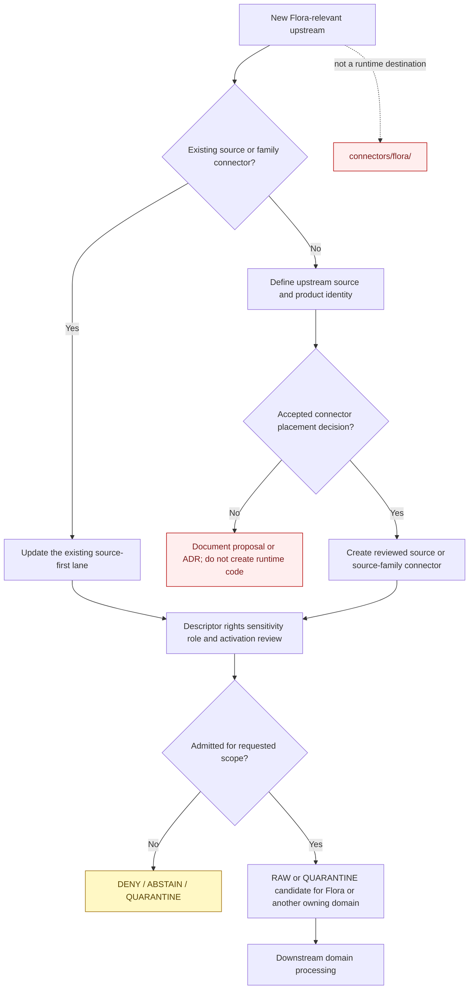
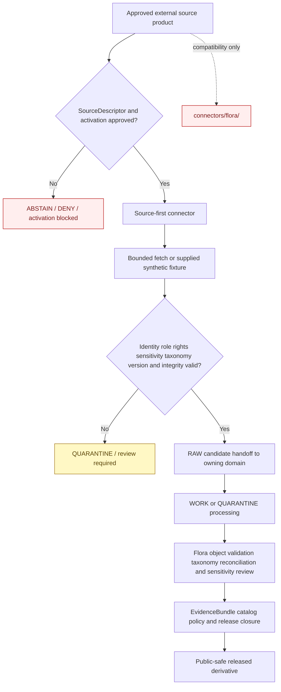

<!-- [KFM_META_BLOCK_V2]
doc_id: kfm://doc/connectors-flora-readme
title: connectors/flora/ — Flora Connector Compatibility Index
type: readme
version: v0.2
status: draft
owners: OWNER_TBD — Connector steward · Source steward · Flora steward · Biodiversity steward · Taxonomy steward · Rights reviewer · Privacy/sensitivity reviewer · Validation steward · Docs steward
created: 2026-06-18
updated: 2026-07-11
policy_label: public-doctrine; compatibility-index; noncanonical-implementation-path; source-first-connectors; documentation-only; rare-plant-deny-default; sensitive-joins-fail-closed; no-code; no-activation; no-publication
proposed_path: connectors/flora/README.md
truth_posture: CONFIRMED README-only compatibility directory / source-first placement is the current safe implementation posture / domain-scoped runtime placement NOT RATIFIED / no source activation or publication authority
related:
  - ../README.md
  - ../gbif/README.md
  - ../inaturalist/README.md
  - ../idigbio/README.md
  - ../natureserve/README.md
  - ../eddmaps/README.md
  - ../usda-plants/README.md
  - ../usda_plants/README.md
  - ../usda/plants/README.md
  - ../usfws/README.md
  - ../usfws/ecos_plants/README.md
  - ../usfws-ecos/README.md
  - ../kdwp/README.md
  - ../kansas/kdwp/README.md
  - ../ku_herbarium/README.md
  - ../kansas/kbs_herbarium/README.md
  - ../../docs/domains/flora/README.md
  - ../../docs/domains/flora/CANONICAL_PATHS.md
  - ../../docs/domains/flora/SOURCE_INTAKE.md
  - ../../docs/domains/flora/SOURCE_FAMILIES.md
  - ../../docs/domains/flora/SOURCE_REGISTRY.md
  - ../../docs/domains/flora/SENSITIVITY.md
  - ../../docs/sources/catalog/usda/usda-plants.md
  - ../../docs/sources/catalog/gbif/README.md
  - ../../docs/sources/catalog/inaturalist/README.md
  - ../../docs/sources/catalog/idigbio/README.md
  - ../../docs/sources/catalog/natureserve/
  - ../../docs/sources/catalog/eddmaps/README.md
  - ../../docs/sources/catalog/kansas/ku-herbarium.md
  - ../../data/registry/sources/flora/README.md
  - ../../data/raw/flora/README.md
  - ../../data/quarantine/flora/
  - ../../tests/domains/flora/README.md
  - ../../fixtures/domains/flora/
  - ../../policy/domains/flora/
  - ../../policy/sensitivity/flora/
  - ../../policy/rights/
  - ../../release/
tags: [kfm, connectors, flora, compatibility, noncanonical, source-first, plants, taxonomy, specimens, occurrences, rare-plants, geoprivacy, sensitive-joins, raw, quarantine, governance]
notes:
  - "Repository inspection confirms that connectors/flora/ contains this README only; no child connector, package metadata, importable module, test, fixture, descriptor, activation record, source payload, or runtime behavior is proved."
  - "Flora canonical-path doctrine shows the Directory Rules source-first shape connectors/<source>/ and labels a connectors/flora/<source>/ hierarchy only PROPOSED / NEEDS VERIFICATION; the live tree contains multiple source-first Flora-relevant lanes."
  - "This directory is therefore treated as a documentation-only compatibility and navigation index unless an accepted ADR explicitly ratifies a Flora-scoped connector hierarchy."
  - "Source-first lanes have their own unresolved placement and naming drift, notably USDA PLANTS aliases, USFWS ECOS variants, KDWP compatibility paths, and KU/KBS herbarium naming. This index reports those conflicts but does not resolve them by convenience."
  - "Rare, protected, or culturally sensitive plant locations fail closed; source obscuration must be preserved; taxonomy/checklist data must not become occurrence evidence; specimen records must not become current-presence claims; and join-induced sensitivity must be reassessed downstream."
[/KFM_META_BLOCK_V2] -->

<a id="top"></a>

# Flora Connector Compatibility Index

> Documentation-only compatibility and navigation surface for historical or generated Flora-scoped connector references. Under the current repository posture, connector implementation is organized around an upstream source or source family under `connectors/<source-or-family>/`, not as a parallel runtime hierarchy beneath `connectors/flora/`.

<p>
  
  
  
  
  
  
</p>

`connectors/flora/`

> [!IMPORTANT]
> **Confirmed state:** this directory contains this README only. No child connector directory, package metadata, source tree, importable module, test lane, fixture set, SourceDescriptor, activation decision, credential configuration, source payload, cache, lifecycle writer, or passing CI evidence is confirmed here. Flora-relevant connector work exists in source-first or source-family lanes elsewhere under `connectors/`; their presence does not prove activation, implementation maturity, rights clearance, sensitivity clearance, or publication readiness.

**Quick jumps:** [Purpose](#purpose) · [Placement decision](#placement-decision) · [Verified repository state](#verified-repository-state) · [Evidence ledger](#evidence-ledger) · [Compatibility responsibilities](#compatibility-responsibilities) · [Forbidden responsibilities](#forbidden-responsibilities) · [Source-first connector navigation](#source-first-connector-navigation) · [Unresolved connector-path drift](#unresolved-connector-path-drift) · [Flora source semantics](#flora-source-semantics) · [Source-role anti-collapse](#source-role-anti-collapse) · [Taxonomy occurrence specimen and range boundaries](#taxonomy-occurrence-specimen-and-range-boundaries) · [Sensitivity and geoprivacy posture](#sensitivity-and-geoprivacy-posture) · [Rights license and citation posture](#rights-license-and-citation-posture) · [Join-induced sensitivity](#join-induced-sensitivity) · [Flora responsibility lanes](#flora-responsibility-lanes) · [Placement decision flow](#placement-decision-flow) · [Admission and lifecycle boundary](#admission-and-lifecycle-boundary) · [Child-path policy](#child-path-policy) · [Migration and deprecation](#migration-and-deprecation) · [Review and rollback](#review-and-rollback) · [Definition of done](#definition-of-done) · [Verification backlog](#verification-backlog)

---

## Purpose

This README prevents `connectors/flora/` from hardening into a second connector hierarchy organized by consumer domain.

It may:

- explain the current source-first connector placement posture;
- redirect historical Flora-scoped references to source or source-family connector homes;
- index connectors that may admit Flora-relevant taxonomy, specimen, occurrence, conservation-status, invasive-plant, remote-sensing, survey, or restoration material;
- identify the Flora responsibility lanes that take over after source admission;
- preserve taxonomy, source-role, rights, geoprivacy, rare-plant, cultural-sensitivity, and join-sensitivity warnings;
- document connector-path conflicts, migration work, correction needs, and deprecation choices;
- prevent connector-to-RAW, connector-to-publication, taxonomy-to-occurrence, specimen-to-current-presence, and obscured-to-exact-location shortcuts.

It does **not** host connector implementations, activate sources, assign canonical source roles, decide taxonomic truth, classify sensitivity, generalize geometry, admit payloads, produce Flora objects, close evidence, or publish Flora claims.

[Back to top ↑](#top)

---

## Placement decision

The Flora path register records the Directory Rules source-first shape and treats a domain-scoped connector hierarchy as an unresolved proposal. The live repository also contains multiple Flora-relevant connector lanes organized by source or source family, while `connectors/flora/` contains documentation only.

The current safe decision is therefore:

| Question | Decision | Evidence posture |
|---|---|---:|
| Are Flora connector implementations organized beneath `connectors/flora/`? | **No, not under the current accepted posture.** | The live directory is README-only; current connector examples and Directory Rules use source or source-family homes. |
| Is `connectors/flora/` a canonical runtime implementation root? | **No.** Treat it as a compatibility and navigation index. | The Flora path register labels the domain-segment form proposed/unresolved rather than accepted. |
| May a new source connector be created at `connectors/flora/<source>/`? | **No, absent an accepted ADR.** | Creating it would duplicate source identity, credentials, tests, activation, rights, and rollback across consumer domains. |
| Where should source-specific access live? | In a reviewed source or source-family lane under `connectors/`. | Examples include GBIF, iNaturalist, iDigBio, NatureServe, EDDMapS, USDA, USFWS, and Kansas-family lanes. |
| Where should Flora-specific processing live? | Under Flora packages, pipelines, contracts, schemas, policies, tests, fixtures, and lifecycle lanes after admission. | Source access and domain interpretation are separate responsibilities. |
| Can this decision change? | Yes, only through an explicit accepted ADR or migration decision. | Any change must include ownership, path migration, tests, descriptor handling, activation, rollback, and backlink updates. |

> [!CAUTION]
> Directory presence is not authority. A generated skeleton, topic grouping, historical link, or source used only by Flora does not establish a Flora-scoped implementation home.

[Back to top ↑](#top)

---

## Verified repository state

The following relationship is confirmed on the repository's `main` branch at the time of this update:

```text
connectors/
├── flora/
│   └── README.md                         # this compatibility index
├── gbif/                                 # source-first biodiversity lane
│   ├── README.md
│   └── plants/README.md
├── inaturalist/                          # source-first community-observation lane
│   ├── README.md
│   └── observations/README.md
├── idigbio/                              # source-first specimen/portal lane
│   ├── README.md
│   └── specimens/README.md
├── natureserve/                          # source-family conservation-status lane
│   ├── README.md
│   └── explorer/README.md
├── eddmaps/
│   └── README.md                         # README-only invasive-source lane
├── usda-plants/
│   └── README.md                         # one PLANTS path candidate
├── usda_plants/
│   └── README.md                         # underscore alias candidate
├── usda/
│   └── plants/README.md                  # nested PLANTS path candidate
├── usfws/
│   └── ecos_plants/README.md             # nested plant-status candidate
├── kdwp/
│   └── README.md                         # top-level compatibility lane
├── ku_herbarium/
│   └── README.md                         # top-level compatibility lane
└── kansas/
    └── kbs_herbarium/README.md           # live Kansas-family herbarium candidate
```

This tree is an illustrative set of confirmed Flora-relevant connector documentation, not a complete connector inventory and not evidence that any listed source is activated or operational.

### Current maturity

| Surface | Confirmed content | Maturity |
|---|---|---:|
| `connectors/flora/README.md` | This compatibility and navigation contract. | **DOCUMENTED / NONCANONICAL IMPLEMENTATION PATH** |
| Other files below `connectors/flora/` | None found in current repository search. | **ABSENT / NEEDS CONTINUOUS VERIFICATION** |
| Connector code below `connectors/flora/` | None confirmed. | **ABSENT / FORBIDDEN UNDER CURRENT POSTURE** |
| Package metadata below `connectors/flora/` | None confirmed. | **ABSENT** |
| Connector-local tests or fixtures below `connectors/flora/` | None confirmed. | **ABSENT** |
| Source activation owned by this directory | None. | **FORBIDDEN** |
| Source-first Flora-relevant lanes | Multiple confirmed documentation/scaffold paths. | **MIXED DRAFT / EXPERIMENTAL / COMPATIBILITY** |
| `data/raw/flora/README.md` | Five-line greenfield stub. | **PLACEHOLDER** |
| `data/registry/sources/flora/README.md` | Expanded source-registry doctrine; parallel registry topology remains unresolved. | **DOCUMENTED / TOPOLOGY NEEDS VERIFICATION** |
| `tests/domains/flora/README.md` | Domain test contract and coverage map. | **DOCUMENTED / EXECUTABLE ENFORCEMENT UNKNOWN** |
| Publication authority owned by this directory | None. | **FORBIDDEN** |

[Back to top ↑](#top)

---

## Evidence ledger

| Evidence | Status | What it supports | What it does not support |
|---|---:|---|---|
| `docs/domains/flora/CANONICAL_PATHS.md` | **CONFIRMED doctrine-derived register** | Connectors emit only to Flora RAW/QUARANTINE; Directory Rules show `connectors/<source>/`; a Flora-domain connector subtree remains proposed/unratified. | Activation or maturity of any connector. |
| `connectors/README.md` | **CONFIRMED root contract** | The default source-admission flow begins at `connectors/<source-or-product>/`; connector output stops at RAW, QUARANTINE, or receipts. | A single universally ratified naming pattern for every existing connector. |
| `connectors/flora/README.md` and current path search | **CONFIRMED for inspected state** | The Flora directory exists and contains only this README. | Permanent absence of future compatibility material. |
| `connectors/gbif/`, `connectors/inaturalist/`, `connectors/idigbio/`, `connectors/natureserve/`, and `connectors/eddmaps/` | **CONFIRMED source/source-family lanes** | Flora-relevant source access is represented outside `connectors/flora/`. | Source activation, endpoint health, rights clearance, or production readiness. |
| USDA PLANTS connector READMEs | **CONFIRMED path conflict** | `usda-plants`, `usda_plants`, and `usda/plants` all exist as draft candidates. | A canonical PLANTS implementation home. |
| USFWS ECOS connector READMEs | **CONFIRMED path conflict** | Flat and nested ECOS/plant-oriented connector forms exist. | A ratified ECOS plant connector path or active regulatory feed. |
| KDWP connector READMEs | **CONFIRMED compatibility/family split** | Top-level `kdwp` is documented as compatibility; Kansas-family KDWP paths exist. | Final sublane design, rights, activation, or public-safe release. |
| KU/KBS herbarium connector READMEs | **CONFIRMED naming drift** | Top-level `ku_herbarium` is compatibility; live `kansas/kbs_herbarium` exists; the documented `kansas/ku-herbarium` target was not found by direct fetch. | A settled canonical herbarium adapter name or implementation. |
| `docs/domains/flora/SOURCE_INTAKE.md` | **CONFIRMED doctrine** | Rare/protected/culturally sensitive locations fail closed; obscuration is preserved; specimen localities and joins require review. | Implemented connector enforcement. |
| `docs/domains/flora/SOURCE_REGISTRY.md` and `data/registry/sources/flora/README.md` | **CONFIRMED registry documentation** | Flora source families, roles, activation prerequisites, and deny-default sensitivity are documented. | Completed descriptors or settled registry topology. |
| `data/raw/flora/README.md` | **CONFIRMED greenfield stub** | A Flora RAW root is reserved. | Source-specific child lanes, captures, receipts, or promotion readiness. |
| `tests/domains/flora/README.md` | **CONFIRMED domain test contract** | Domain-wide rights, sensitivity, evidence, temporal, geometry, release, and rollback tests have a documented home. | Connector implementation coverage or passing CI. |

[Back to top ↑](#top)

---

## Compatibility responsibilities

`connectors/flora/` may contain only non-executable compatibility and navigation material.

Allowed content:

- this README;
- short correction, deprecation, or tombstone notices;
- links from historical Flora-scoped references to source-first connectors;
- inventories of stale backlinks, generated skeletons, or migration candidates;
- notes identifying unresolved source-lane naming conflicts;
- navigation to Flora source families, source registry, RAW, quarantine, policy, test, fixture, pipeline, evidence, and release documentation;
- a machine-readable redirect manifest only if the repository adopts and validates a redirect standard;
- explicit warnings against taxonomy, occurrence, specimen, sensitivity, and publication boundary collapse.

Every artifact here must remain:

- documentation-only;
- non-authoritative;
- non-executable;
- reversible;
- explicit about its destination and evidence status;
- free of credentials, source payloads, caches, activation state, exact sensitive locations, culturally sensitive plant knowledge, and public claims.

[Back to top ↑](#top)

---

## Forbidden responsibilities

Do not add the following beneath `connectors/flora/`:

```text
FORBIDDEN HERE:
  source client code
  fetchers, downloaders, crawlers, or harvesters
  request builders, conditional-fetch logic, or watcher logic
  parsers, normalizers, taxonomy resolvers, or crosswalk implementations
  package metadata or importable modules
  source descriptors or activation decisions
  endpoint, credential, authentication, retry, rate-limit, or cadence configuration
  API keys, tokens, cookies, sessions, private configuration, or account exports
  source payloads, occurrence exports, herbarium archives, taxonomy tables, rasters, or caches
  connector-local fixtures or executable test suites
  exact rare-plant or culturally sensitive coordinates
  geoprivacy de-obscuration, reverse-geocoding, or coordinate-recovery logic
  rights, license, sensitivity, redaction, or public-precision policy implementations
  source-to-source joins or identity resolution
  RAW or QUARANTINE writers
  WORK, PROCESSED, CATALOG, TRIPLET, PROOF, RECEIPT, RELEASE, or PUBLISHED writers
  public API, map, tile, graph, search, report, story, dashboard, or generated-answer payloads
```

A pull request adding these responsibilities should be rejected or redirected unless it also supplies an accepted ADR that deliberately changes connector placement, defines ownership and authority, migrates existing source-first lanes, adds tests and rollback, and updates every affected descriptor and backlink.

[Back to top ↑](#top)

---

## Source-first connector navigation

Flora consumes evidence from many source families. The connector remains organized around the source even when Flora is the primary or only current consumer.

| Source or family lane | Flora relevance | Current path posture | Boundary |
|---|---|---:|---|
| [`connectors/gbif/`](../gbif/README.md) | Occurrence aggregation, Darwin Core material, and backbone/version context. | **CONFIRMED lane / maturity needs verification** | Per-dataset rights, publisher provenance, taxon version, uncertainty, and restricted-record state must remain intact; GBIF is not final taxonomic or occurrence truth. |
| [`connectors/inaturalist/`](../inaturalist/README.md) | Community-science plant observations shared with Fauna. | **CONFIRMED source-first scaffold** | Preserve grade, license, taxon fields, media, uncertainty, and geoprivacy; never de-obscure or infer legal/status authority. |
| [`connectors/idigbio/`](../idigbio/README.md) | Specimen-backed corroborative evidence and institution/recordset context. | **CONFIRMED lane / canonicality still under review** | Keep specimen, media, summaries, recordsets, and non-specimen subsets distinct; record-level rights and sensitivity apply. |
| [`connectors/natureserve/`](../natureserve/README.md) | Conservation-status ranks and restricted source surfaces. | **CONFIRMED family lane / placement needs ADR** | Status/rank context does not prove occurrence; restricted or precise data fails closed. |
| [`connectors/eddmaps/`](../eddmaps/README.md) | Invasive-plant observations, state lists, and query-scoped extracts. | **CONFIRMED README-only lane / placement unresolved** | Observation, regulatory/list, and query-product roles must remain distinct; no dual-write shortcut across Flora and Fauna. |
| [`connectors/usda-plants/`](../usda-plants/README.md), [`connectors/usda_plants/`](../usda_plants/README.md), [`connectors/usda/plants/`](../usda/plants/README.md) | USDA PLANTS taxonomy, checklist, symbol, and state/county distribution context. | **THREE CONFIRMED DRAFT PATHS / CANONICAL HOME UNRESOLVED** | County/checklist distribution is not specimen-backed occurrence; taxonomy changes must not be mistaken for presence changes; do not implement three copies. |
| [`connectors/usfws/ecos_plants/`](../usfws/ecos_plants/README.md) and [`connectors/usfws-ecos/`](../usfws-ecos/README.md) | Federal listed-plant, profile, recovery, and critical-habitat context. | **COMPETING NESTED/FLAT FORMS / NEEDS DECISION** | ECOS is a carrier for regulatory context; critical habitat is not current plant presence and does not replace sovereign legal text. |
| [`connectors/kdwp/`](../kdwp/README.md) and [`connectors/kansas/kdwp/`](../kansas/kdwp/README.md) | Kansas listed-species, stewardship, review-tool, and observation-related surfaces. | **TOP-LEVEL COMPATIBILITY + KANSAS-FAMILY HOME** | Authority/regulatory, administrative, and observed products require separate roles; sensitive locations remain controlled. |
| [`connectors/ku_herbarium/`](../ku_herbarium/README.md) and [`connectors/kansas/kbs_herbarium/`](../kansas/kbs_herbarium/README.md) | KU/KBS/KANU specimen-backed Flora evidence. | **COMPATIBILITY + LIVE BUT UNSETTLED KANSAS SUBLANE** | Preserve institution, catalog number, collector/event date, taxon, locality uncertainty, rights, and sensitivity; specimen evidence is not current population truth. |

The table is a navigation aid—not a source registry, activation list, endorsement, or maturity certification.

Before adding or changing a Flora-relevant connector:

1. identify the upstream source, publisher, product, and access surface;
2. search for every existing source or family connector path and compatibility alias;
3. review source catalog, SourceDescriptor, rights, sensitivity, role, cadence, and activation evidence;
4. resolve naming and placement conflicts before creating implementation files;
5. implement source access once in the accepted source-first home;
6. route an admitted capture to the correct domain RAW or QUARANTINE lane without changing its source role;
7. keep Flora-specific taxonomy, sensitivity, object construction, joins, and publication downstream.

[Back to top ↑](#top)

---

## Unresolved connector-path drift

This compatibility index reports naming and placement drift but does not resolve it by convenience.

| Source family | Confirmed competing or incomplete paths | Safe current posture |
|---|---|---|
| USDA PLANTS | `connectors/usda-plants/`, `connectors/usda_plants/`, and `connectors/usda/plants/` all have READMEs. | Do not add runtime code to more than one path. Choose a canonical home through ADR/migration and convert the others to pointers. |
| USFWS ECOS | `connectors/usfws-ecos/`, `connectors/usfws_ecos/`, `connectors/usfws/`, and `connectors/usfws/ecos_plants/` are referenced or present in the live tree. | Resolve family/product placement and keep plant regulatory context distinct from other ECOS products. |
| KDWP | Top-level `connectors/kdwp/` is compatibility; `connectors/kansas/kdwp/` and Flora/ERT sublanes exist or are documented. | Keep the Kansas-family path as the implementation direction unless a reviewed decision changes it; preserve product-specific roles. |
| KU/KBS herbarium | `connectors/ku_herbarium/` points toward `connectors/kansas/ku-herbarium/`, but that target was not found; `connectors/kansas/kbs_herbarium/` is live with placement unresolved. | Do not invent the missing path or call the live path canonical. Reconcile KBS umbrella, KANU surface, naming, descriptors, and migration first. |
| Flora group | `connectors/flora/` exists only as this README. | Keep it documentation-only; do not create `connectors/flora/<source>/` children without an accepted ADR. |

Path drift is not harmless. Duplicated connector homes can split credentials, cache state, retry policy, source IDs, taxonomy versions, sensitivity handling, tests, activation decisions, receipts, and rollback behavior.

[Back to top ↑](#top)

---

## Flora source semantics

Flora source material enters KFM under the role and scope of the admitted source product—not under a generic “plant data” truth class.

| Source material | Typical admitted meaning | Must not become |
|---|---|---|
| Taxonomy or checklist record | `aggregate`, `administrative`, or source-specific taxonomy context | Specimen evidence, site occurrence, legal status, or exact rare-plant location. |
| Herbarium specimen record | Vouchered `observed` evidence tied to a collection event and specimen identity | Current population, current site occupancy, complete range, or accepted-name authority. |
| Community observation | Source-attributed `observed` candidate with grade, media, taxon, uncertainty, and geoprivacy | Regulatory status, canonical taxonomy, verified absence, or unrestricted exact location. |
| Occurrence aggregator record | Re-served or aggregated occurrence evidence with upstream dataset provenance | A new first-hand observation, final deduplication result, or universal rights decision. |
| Conservation-status or listed-status record | `regulatory`, `administrative`, or `aggregate` status context by product | Occurrence evidence or current presence at a place. |
| State stewardship/review output | `administrative` or source-specific stewardship evidence | Direct observation merely because it mentions a taxon and place. |
| Invasive observation | Source-attributed observation candidate | Regulatory designation, eradication success, absence, or final distribution truth. |
| State invasive list | `regulatory` or `administrative` list context | Observed occurrence. |
| Remote-sensing vegetation surface | `modeled` or derived vegetation signal | Species-level observation without independently governed evidence. |
| Restoration planting record | `administrative` or project-level record | Wild occurrence, natural population, or restoration success. |

[Back to top ↑](#top)

---

## Source-role anti-collapse

Source role is fixed at admission and must remain visible through parsing, routing, transformation, citation, and release.

```text
TAXONOMY / CHECKLIST
  ≠ specimen
  ≠ occurrence
  ≠ legal status

SPECIMEN
  = evidence that a collected object was documented at a collection event
  ≠ current presence
  ≠ complete range

COMMUNITY OR AGGREGATED OCCURRENCE
  = source-attributed occurrence evidence with uncertainty
  ≠ canonical taxonomic truth
  ≠ regulatory status
  ≠ verified absence

REGULATORY / CONSERVATION STATUS
  = status or designation context
  ≠ plant occurrence
  ≠ exact sensitive location authority

MODELED VEGETATION OR RANGE
  = derived product with method and uncertainty
  ≠ direct observation

RESTORATION / STEWARDSHIP RECORD
  = administrative or project evidence
  ≠ wild biological occurrence
```

Required behavior:

- preserve the exact source product, record basis, dataset/publisher, role, role authority, and upstream identifier;
- reject product/role mismatches;
- preserve source names and taxon identifiers before downstream accepted-name resolution;
- distinguish collected specimens, visual observations, checklist distributions, modeled ranges, status ranks, legal listings, surveys, and restoration records;
- preserve observation grade, evidence type, event date, occurrence status, establishment means, uncertainty, and geometry precision where supplied;
- never infer absence from a missing record or empty query result;
- never convert county-level checklist context into point occurrence;
- never convert conservation rank or listing into an occurrence;
- never convert obscured coordinates into exact coordinates;
- require independently governed evidence for taxonomic merges, range claims, current-presence claims, and public exact-geometry claims.

[Back to top ↑](#top)

---

## Taxonomy occurrence specimen and range boundaries

Flora identity and presence questions require several evidence layers that must remain separable.

| Evidence layer | Required preservation | Boundary |
|---|---|---|
| Source taxonomy | Source name, author, identifier, rank, synonym/accepted status, backbone version, snapshot/version. | A connector does not choose final KFM accepted taxonomy. |
| Taxon crosswalk | Source-to-target identifiers, match method, confidence, ambiguity, version, review state. | Crosswalks are downstream governed transforms, not silent connector renames. |
| Specimen | Institution code, collection/catalog number, collector, event date, basis of record, locality, uncertainty, rights. | A specimen can corroborate historical occurrence but not current presence by itself. |
| Occurrence observation | Source record ID, observer/provider, date, evidence/media, grade, coordinate uncertainty, geoprivacy, rights. | One occurrence does not establish range, abundance, persistence, or absence elsewhere. |
| Checklist/distribution | Geography unit, snapshot, taxon ID, inclusion basis, source method. | County/state inclusion is not a precise occurrence. |
| Range polygon | Method, source role, date/vintage, resolution, uncertainty, supporting evidence. | A range polygon is compiled or modeled context, not proof at every point. |
| Conservation or legal status | Jurisdiction, authority, rank/status system, effective date, citation, supersession. | Status is not occurrence and an aggregator is not sovereign legal text. |
| Vegetation community | Classification system, polygon source, date, method, scale, confidence. | Community mapping is not species-level occurrence unless separately supported. |

Taxonomy drift must be tracked separately from biological presence drift. A new name, synonym, split, merge, or backbone change must not be reported as a new occurrence without evidence that the underlying biological record changed.

[Back to top ↑](#top)

---

## Sensitivity and geoprivacy posture

> [!WARNING]
> Rare, protected, steward-controlled, or culturally sensitive plant locations default to denial or hold at exact precision. Public-source availability does not override Flora sensitivity policy.

Minimum posture:

1. **Preserve source obscuration.** Never de-obscure, reverse-engineer, triangulate, or infer an exact location from an obscured, generalized, withheld, or private source record.
2. **Treat exact rare-plant geometry as restricted.** Exact points, polygons, locality text, uncertainty radii, collector notes, and linked media can all leak location.
3. **Review herbarium localities.** Historical specimen labels may be precise enough to expose extant rare taxa or culturally sensitive sites.
4. **Protect culturally sensitive plant knowledge.** Traditional use, harvesting locations, community knowledge, and steward-only notes require explicit governance beyond ordinary occurrence handling.
5. **Reassess after joins.** A benign checklist, taxon list, or generalized record can become sensitive when joined with occurrence, parcel, trail, access, landowner, habitat, or heritage data.
6. **Generalize downstream, not here.** Public-safe geometry requires an accepted policy decision, deterministic transform, review, and `RedactionReceipt` or equivalent evidence outside this compatibility index.
7. **Keep exact and public-safe representations separate.** A “restricted” subfolder beneath a public path is not an acceptable control.
8. **Minimize logs and fixtures.** Never commit real exact rare-plant coordinates, steward-only notes, private contacts, access tokens, or restricted payloads merely to test parsing.
9. **Fail closed on uncertainty.** Unknown sensitivity, obscuration state, cultural context, or join risk routes to restriction, quarantine, abstention, or denial.
10. **Generated carriers inherit restrictions.** Maps, tiles, reports, search indexes, embeddings, graphs, and AI text must not re-expose precision removed from a released derivative.

| Condition | Required safe outcome |
|---|---|
| Exact rare/protected/culturally sensitive location | `DENY`, `HOLD`, or QUARANTINE at exact precision. |
| Source record is obscured or withheld | Preserve source state; no precision recovery. |
| Precise herbarium locality for a sensitive taxon | Review and restrict/generalize before any public derivative. |
| Checklist joined to observations or heritage data | Recompute product sensitivity; do not inherit the checklist's low-risk posture. |
| Restricted source rights or account-only record | No public-safe result without rights and sensitivity clearance. |
| Public derivative requested | Require deterministic generalization/redaction, review evidence, release decision, and rollback path. |

[Back to top ↑](#top)

---

## Rights license and citation posture

Flora-relevant connectors must preserve rights and citation at the granularity supplied by the source product.

- GBIF records may inherit dataset-specific licenses and publisher citations; a global GBIF label is insufficient.
- iNaturalist observations and media may carry per-record or per-asset licensing and geoprivacy state.
- iDigBio and herbarium records may require institution, collection, recordset, media, and provider attribution.
- NatureServe public and access-controlled products can have materially different redistribution and precision rules.
- EDDMapS observation, list, and download products may have different access, query, citation, and redistribution obligations.
- USDA PLANTS federal checklist context does not automatically resolve downstream product rights or join sensitivity.
- USFWS, KDWP, state, university, and partner products require current terms and product-specific authority review even when the underlying institution is public.
- Rights, sensitivity, source role, and legal authority are separate questions; clearing one does not clear the others.

Required connector posture:

- preserve source URI, product identity, dataset/recordset, provider, rights holder, license, citation, attribution, retrieval time, and version where available;
- reject or quarantine records whose rights cannot be resolved strongly enough for the intended admission;
- do not silently replace a source license with a family-level default;
- do not strip provider attribution during aggregation or deduplication;
- do not present a connector, catalog page, or source profile as legal permission;
- keep public-release interpretation downstream behind policy, evidence, review, and release gates.

[Back to top ↑](#top)

---

## Join-induced sensitivity

A source that is low-risk in isolation can become highly sensitive after combination.

```text
USDA PLANTS county checklist
  + GBIF / iNaturalist / herbarium occurrence evidence
  + rare-status or heritage context
  + parcel, trail, road, access, or landowner data
  = potentially actionable rare-plant location product
```

Connector implications:

- source connectors preserve each source independently and do not perform cross-source joins;
- domain pipelines own crosswalk, deduplication, place resolution, range construction, habitat association, and join logic;
- every join must preserve source role, source IDs, rights, geometry precision, uncertainty, and citation;
- product sensitivity must be evaluated after the join, not copied from the least-sensitive input;
- a join that increases location precision or identifiability without policy approval must fail closed;
- public-safe generalization must be deterministic, receipt-backed, and reversible to an internal evidence lineage—not reversible to the public exact coordinates;
- public output must not expose source combinations that reconstruct a withheld or obscured location.

[Back to top ↑](#top)

---

## Flora responsibility lanes

Flora-specific responsibilities belong under their owning roots after source-first admission—not beneath this compatibility directory.

| Responsibility | Correct lane | Boundary |
|---|---|---|
| Connector-root doctrine | `connectors/README.md` | Source admission boundary and allowed handoffs. |
| Source-specific access | `connectors/<source-or-family>/` | Fetch, parse, validate, and prepare RAW/QUARANTINE candidates for one source identity. |
| Flora domain doctrine | `docs/domains/flora/` | Object families, source families, lifecycle, sensitivity, taxonomy, and release posture. |
| Source/product doctrine | `docs/sources/catalog/<source>/` | What a source can support, cannot prove, and how products differ. |
| SourceDescriptor and activation | `data/registry/sources/flora/` or accepted canonical registry lane | Identity, role, rights, cadence, sensitivity, access, and activation—not source payloads. |
| Semantic object meaning | `contracts/domains/flora/` | `PlantTaxon`, `SpecimenRecord`, `FloraOccurrence`, `RarePlantRecord`, and related invariants. |
| Machine shape | `schemas/contracts/v1/domains/flora/` and `schemas/contracts/v1/source/` | Schema authority; exact topology remains governed separately. |
| Flora implementation | `packages/domains/flora/` and governed shared packages | Taxonomy resolution, object construction, geometry, redaction helpers, and domain logic—not source activation. |
| Flora pipelines | `pipelines/domains/flora/` and cross-lane pipeline homes | Normalize, reconcile, validate, join, quarantine, and prepare downstream candidates. |
| Connector-local tests | The accepted source connector's own test lane | Import, no-network, parser, transport, source-role, rights, sensitivity, and handoff behavior. |
| Domain-wide Flora tests | `tests/domains/flora/` | Rights, sensitivity, temporal, evidence, geometry, release, and rollback enforcement. |
| Flora fixtures | `fixtures/domains/flora/` or the repository-selected fixture authority | Synthetic/public-safe examples; never real exact sensitive coordinates. |
| RAW source captures | `data/raw/flora/` | Immutable admitted source captures; current README is still a greenfield stub. |
| Held source captures | `data/quarantine/flora/` | Rights-, role-, sensitivity-, taxonomy-, geometry-, or access-unclear material. |
| Processed Flora objects | `data/work/flora/`, `data/processed/flora/` | Downstream governed candidates and validated objects. |
| Receipts and evidence | `data/receipts/`, `data/proofs/` | Process memory, RedactionReceipts, EvidenceBundles, validation, and proof closure. |
| Policy | `policy/domains/flora/`, `policy/sensitivity/flora/`, `policy/rights/` | Allow, deny, restrict, abstain, precision, and rights rules. |
| Catalog and publication | `data/catalog/`, `data/triplets/`, `release/`, `data/published/` | Catalog closure, release decisions, corrections, rollback, and public-safe artifacts. |

[Back to top ↑](#top)

---

## Placement decision flow



A source used by Flora and Fauna still has one source connector. Domain-specific candidates are produced through governed downstream routing with explicit lineage, not by cloning the connector under multiple domain folders.

[Back to top ↑](#top)

---

## Admission and lifecycle boundary

This compatibility directory performs no source access and no lifecycle action.

The required future source-admission flow is:



KFM lifecycle discipline remains:

```text
RAW -> WORK / QUARANTINE -> PROCESSED -> CATALOG / TRIPLET -> PUBLISHED
```

Connector output may stop at finite errors, abstentions, denial/no-change receipts, or RAW/QUARANTINE candidates. It must not independently normalize into Flora truth, resolve taxonomy canonically, generalize sensitive geometry, close evidence, catalog, release, or publish data.

[Back to top ↑](#top)

---

## Child-path policy

No child connector directory is currently confirmed beneath `connectors/flora/`.

Under the current posture:

- do not create `connectors/flora/<source>/` for a new connector;
- do not move an existing source-first connector beneath this directory merely because Flora consumes it;
- do not create a Flora-specific copy of a cross-domain source client;
- do not place Flora packages, tests, fixtures, schemas, policies, lifecycle data, or source descriptors here;
- a historical child path may contain only a minimal compatibility pointer after repository review;
- every compatibility child must name its intended source-first destination and prohibit local runtime authority;
- no compatibility child may hold credentials, payloads, caches, activation state, tests, or implementation code;
- any accepted ADR changing this rule must update this README, the connector root, Flora canonical paths, source descriptors, tests, workflows, templates, and migration/rollback documentation together.

[Back to top ↑](#top)

---

## Migration and deprecation

The preferred long-term state is that connector references name the owning source or source family, while Flora-specific processing references Flora responsibility lanes.

Migration sequence:

1. inventory all references to `connectors/flora/` and any generated `connectors/flora/<source>/` paths;
2. classify each reference as documentation, code, import, package metadata, workflow, configuration, descriptor, test, fixture, cache, lifecycle writer, or generated skeleton;
3. identify the real upstream source or product and its existing connector candidates;
4. resolve source-lane naming conflicts before moving implementation;
5. replace runtime references with the accepted source-first connector path;
6. replace domain-processing references with the correct Flora package, pipeline, policy, test, fixture, or lifecycle lane;
7. verify that no SourceDescriptor, activation decision, secret, workflow, CI job, or runtime import depends on this compatibility directory;
8. update source catalog pages, Flora canonical paths, templates, skeleton maps, and backlinks;
9. choose an explicit end state for this directory.

| End state | Use when |
|---|---|
| Retained compatibility index | Historical links remain common and the index prevents duplicate domain-scoped implementations. |
| Minimal tombstone README | Most navigation has moved but old links still require an explanation. |
| Directory removal | All backlinks are corrected, no tooling depends on the path, and removal is reviewed. |
| ADR-ratified Flora connector group | Only if an accepted ADR deliberately chooses domain-scoped connector placement and includes migration, source-identity, cross-domain, testing, activation, and rollback plans. |

Do not remove this directory merely for cosmetic cleanliness while unresolved links or generated templates still recreate it.

[Back to top ↑](#top)

---

## Review and rollback

Review every change under `connectors/flora/` as placement-sensitive, taxonomy-sensitive, rights-sensitive, and rare-plant-sensitivity-adjacent documentation work.

A reviewer should confirm:

- the change remains documentation-only;
- source-first or source-family destinations are evidence-backed and not invented;
- unresolved connector-path conflicts remain explicit;
- no connector implementation or source activation is implied;
- taxonomy, checklist, specimen, occurrence, range, status, modeled, and administrative roles remain distinct;
- rare-plant, cultural-knowledge, exact-location, obscuration, herbarium-locality, and join-sensitivity controls remain fail-closed;
- rights and citation remain product- or record-specific where required;
- no public client is directed to connector, registry, RAW, WORK, or QUARANTINE material;
- no text implies botanical truth, legal status, exact sensitive occurrence, taxonomy closure, or publication approval.

Rollback is required if a change:

- adds executable code, package metadata, tests, fixtures, descriptors, credentials, payloads, caches, or lifecycle writers here;
- creates a child source connector under this directory without an accepted ADR;
- chooses a canonical source path without resolving known conflicts;
- describes a source as activated, tested, rights-cleared, sensitivity-cleared, or production-ready without evidence;
- weakens geoprivacy, obscuration, rare-plant, cultural-sensitivity, rights, or join-sensitivity controls;
- collapses taxonomy/checklist into occurrence, specimen into current presence, status into occurrence, or modeled surfaces into observations;
- enables direct RAW, downstream, or public writes;
- presents generated maps, indexes, or AI text as sovereign Flora truth.

Rollback procedure:

1. revert the unsafe or misleading compatibility change;
2. remove or quarantine any unapproved source payloads, caches, credentials, or sensitive location material and assess repository-history exposure;
3. move legitimate source work to the accepted source-first connector lane;
4. move legitimate Flora processing, policy, test, fixture, lifecycle, evidence, or release work to its correct responsibility root;
5. repair imports, descriptors, configuration, workflows, backlinks, and generated templates;
6. record placement, taxonomy, source-role, rights, sensitivity, geometry, or join drift in the appropriate register;
7. re-run the last verified path and boundary checks when they exist;
8. correct README badges and maturity claims to match evidence.

[Back to top ↑](#top)

---

## Definition of done

This compatibility index is complete for its current role when:

- [x] The current README-only state is explicit.
- [x] The directory is labeled noncanonical for runtime implementation under the current posture.
- [x] Source-first connector navigation is documented.
- [x] Child implementation, activation, and publication are explicitly forbidden.
- [x] Taxonomy, checklist, specimen, occurrence, range, status, modeled, and administrative boundaries are explicit.
- [x] Rare-plant deny-default, obscuration preservation, herbarium-locality review, and join-induced sensitivity are explicit.
- [x] Connector output is limited conceptually to finite outcomes and RAW/QUARANTINE handoff in source-first lanes.
- [x] Flora domain tests and responsibility lanes are separated from connector compatibility material.
- [x] USDA PLANTS, USFWS ECOS, KDWP, and KU/KBS path drift is visible rather than silently resolved.
- [ ] Every backlink to `connectors/flora/` is inventoried.
- [ ] Generated templates and skeleton maps stop creating Flora-scoped connector implementations.
- [ ] Flora canonical-path documentation is updated or an ADR records the compatibility-index decision.
- [ ] USDA PLANTS connector paths are reconciled.
- [ ] USFWS ECOS connector paths are reconciled.
- [ ] KDWP source-family and product sublane placement is reconciled.
- [ ] KU/KBS/KANU herbarium connector naming and placement is reconciled.
- [ ] Registry topology, RAW child naming, fixture authority, and connector test conventions are accepted.
- [ ] A retained-index, tombstone, removal, or ADR-ratified-group decision is recorded.
- [ ] Repository validation rejects runtime files beneath this compatibility path, if such a validator is adopted.

[Back to top ↑](#top)

---

## Verification backlog

| Item | Status | Needed evidence |
|---|---:|---|
| Confirm `README.md` remains the only file below `connectors/flora/`. | **NEEDS CONTINUOUS VERIFICATION** | Repository tree inspection. |
| Inventory every backlink, import, workflow, descriptor, and generated reference to `connectors/flora/`. | **NEEDS VERIFICATION** | Repository-wide path search and template review. |
| Reconcile the Flora path register's open per-domain connector question with the current compatibility-index posture. | **OPEN / NEEDS DECISION** | ADR, Directory Rules update, or reviewed canonical-path amendment. |
| Resolve USDA PLANTS placement among `usda-plants`, `usda_plants`, and `usda/plants`. | **CONFLICTED** | Source-family ADR, migration note, ownership, package/test inventory, and rollback plan. |
| Resolve USFWS ECOS placement among flat, underscore, family, and plant-specific paths. | **CONFLICTED** | Source-family/product architecture and migration decision. |
| Confirm KDWP canonical family and product sublanes, and convert top-level aliases to stable pointers. | **NEEDS VERIFICATION** | Kansas connector inventory, source profile, descriptors, and path decision. |
| Resolve KU/KBS/KANU herbarium naming; verify why the documented `kansas/ku-herbarium` target is absent while `kansas/kbs_herbarium` exists. | **CONFLICTED / NEEDS VERIFICATION** | Source profile correction, Kansas-family inventory, descriptor/product decomposition, and migration decision. |
| Confirm GBIF, iNaturalist, iDigBio, NatureServe, and EDDMapS implementation maturity independently. | **NEEDS VERIFICATION** | Package trees, tests, fixtures, SourceDescriptors, activation decisions, and CI evidence. |
| Confirm canonical Flora SourceDescriptor topology. | **CONFLICTED / NEEDS VERIFICATION** | Reconcile `data/registry/sources/flora/` with domain-first registry siblings. |
| Replace the `data/raw/flora/` greenfield stub with a governed RAW index before source-specific children are activated. | **BLOCKED BY LIFECYCLE REVIEW** | RAW contract, child naming, admission/handoff contract, rights/sensitivity posture, and receipts. |
| Confirm Flora connector-local test homes versus domain-wide tests. | **NEEDS VERIFICATION** | Source connector test inventories, `tests/domains/flora/`, root test conventions, and CI. |
| Reconcile fixture homes among `fixtures/domains/flora/`, `tests/fixtures/domains/flora/`, and other live fixture paths. | **CONFLICTED / NEEDS VERIFICATION** | Fixture-root authority, sensitivity review, and migration plan. |
| Confirm source-specific rights, licenses, citations, geoprivacy, obscuration, and access rules. | **NEEDS VERIFICATION PER SOURCE/PRODUCT** | Current terms snapshots, SourceDescriptors, negative fixtures, and reviewer decisions. |
| Confirm deterministic redaction/generalization and join-sensitivity enforcement. | **NEEDS VERIFICATION** | Policy code, RedactionReceipt contract, synthetic fixtures, domain tests, and CI evidence. |
| Confirm no connector or watcher can write beyond approved RAW/QUARANTINE/receipt boundaries. | **NEEDS VERIFICATION** | Negative tests, static validators, runtime guards, branch policy, and successful runs. |
| Inventory and correct templates or skeleton maps that create `connectors/flora/<source>/`. | **NEEDS VERIFICATION** | Repository-wide generated-path review. |
| Decide whether this directory remains an index, becomes a tombstone, or is removed after migration. | **OPEN DECISION** | Backlink cleanup, dependency inventory, and maintainer review. |

---

## Maintainer note

Keep this directory boring, non-executable, and useful as a map of boundaries. Build source access once in an evidence-backed source or source-family connector; preserve source role, taxonomy version, record basis, rights, uncertainty, and geoprivacy; route admitted material to Flora RAW or QUARANTINE without semantic upgrade; keep taxonomy resolution, joins, redaction, object construction, and evidence closure downstream; and keep every public Flora claim behind policy, review, release, correction, and rollback gates.

[Back to top ↑](#top)
